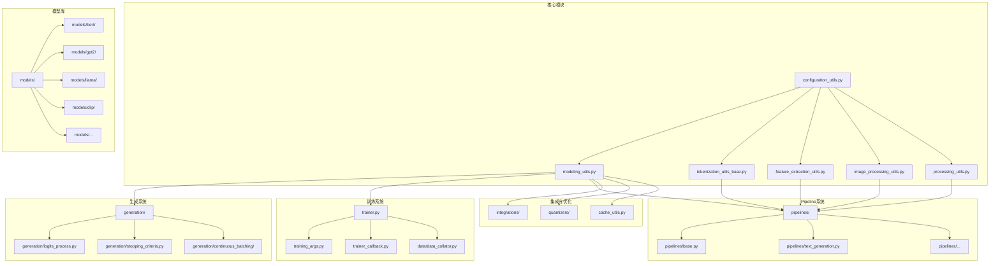

# Transformers 库 - 目录结构分析

## 1. 项目根目录

```
transformers/
├── src/
│   └── transformers/          # 主要源代码目录
├── tests/                     # 测试代码
├── examples/                  # 示例代码
├── docs/                      # 文档
├── benchmark/                 # 基准测试
├── utils/                     # 工具脚本
├── .github/                   # GitHub 配置
├── .circleci/                 # CircleCI 配置
├── docker/                    # Docker 配置
├── README.md                  # 项目说明
├── setup.py                   # 安装配置
└── pyproject.toml             # 项目配置
```

## 2. 核心源代码目录 (src/transformers/)

### 2.1 核心模块

| 目录/文件 | 描述 |
|---------|------|
| `__init__.py` | 包入口，定义导出的符号和延迟加载机制 |
| `configuration_utils.py` | 配置基类和工具 |
| `modeling_utils.py` | 模型基类和工具 |
| `tokenization_utils_base.py` | 分词器基类 |
| `feature_extraction_utils.py` | 特征提取基类 |
| `image_processing_utils.py` | 图像处理基类 |
| `processing_utils.py` | 多模态处理基类 |
| `generation/` | 文本生成相关模块 |
| `pipelines/` | Pipeline 高级 API |
| `models/` | 各种预训练模型的实现 |
| `data/` | 数据处理相关 |
| `integrations/` | 各种优化和集成（量化、注意力优化等） |
| `quantizers/` | 量化系统 |
| `trainer.py` | Trainer 训练 API |
| `training_args.py` | 训练参数 |
| `trainer_callback.py` | 训练回调 |
| `utils/` | 各种工具函数 |
| `cli/` | 命令行接口 |
| `cache_utils.py` | 缓存管理 |

### 2.2 详细目录结构



### 2.3 核心文件详解

#### 2.3.1 配置系统
- **`configuration_utils.py`**: 定义 `PretrainedConfig` 基类
  - 负责从 `config.json` 加载配置
  - 保存配置到文件
  - 配置验证和类型转换

#### 2.3.2 模型系统
- **`modeling_utils.py`**: 定义 `PreTrainedModel` 基类
  - `from_pretrained()` 方法加载预训练模型
  - `save_pretrained()` 方法保存模型
  - 权重加载和初始化
  - 设备管理

#### 2.3.3 分词器系统
- **`tokenization_utils_base.py`**: 定义 `PreTrainedTokenizerBase` 基类
  - 文本编码和解码
  - 特殊 token 管理
  - 批处理支持

#### 2.3.4 生成系统
- **`generation/`**: 文本生成的核心模块
  - `logits_process.py`: 各种 logits 处理器
  - `stopping_criteria.py`: 停止条件
  - `continuous_batching/`: 连续批处理系统（用于高吞吐量推理）

#### 2.3.5 训练系统
- **`trainer.py`**: `Trainer` 类，简化模型训练
  - 训练循环管理
  - 评估和验证
  - 优化器和学习率调度
  - 分布式训练支持

#### 2.3.6 Pipeline 系统
- **`pipelines/`**: 高级推理 API
  - `base.py`: 基类 `Pipeline`
  - 各种任务专用 Pipeline 实现
  - 预处理 -> 模型推理 -> 后处理 一体化

#### 2.3.7 模型实现
- **`models/`**: 包含各种预训练模型的实现
  - 每个模型通常包含：`configuration_*.py`, `modeling_*.py`, `tokenization_*.py`
  - 支持的模型：BERT、GPT、Llama、CLIP、Whisper 等

## 3. 设计理念

### 3.1 统一 API
- 所有模型都通过 `from_pretrained()` 加载
- 一致的接口，减少学习成本

### 3.2 模块化设计
- 配置、模型、分词器分离
- 易于扩展和定制

### 3.3 多模态支持
- 文本、图像、音频等多种模态
- 统一的处理接口

### 3.4 延迟加载
- 使用 `_LazyModule` 减少启动时间
- 只在需要时导入模块
