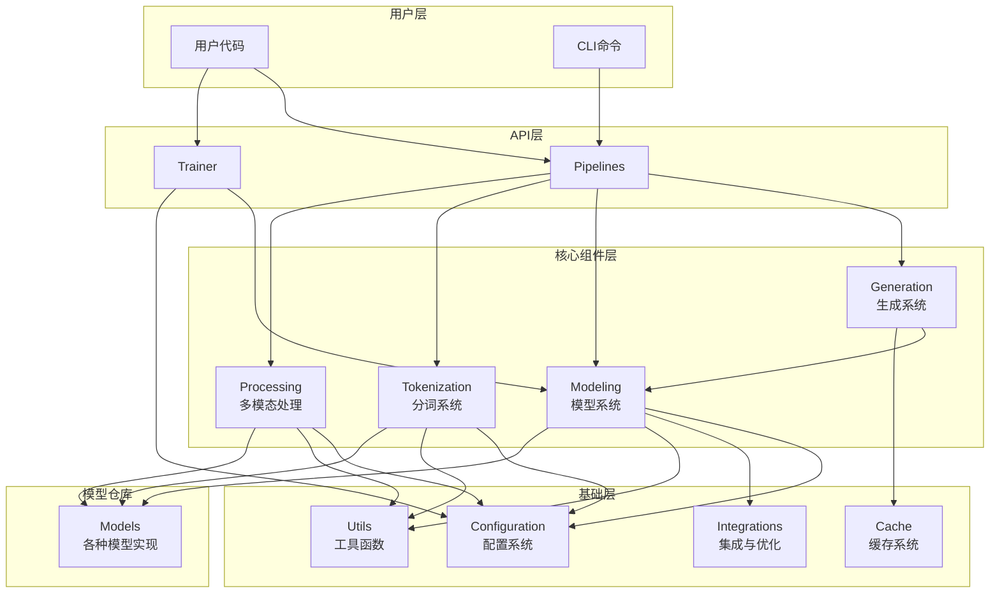
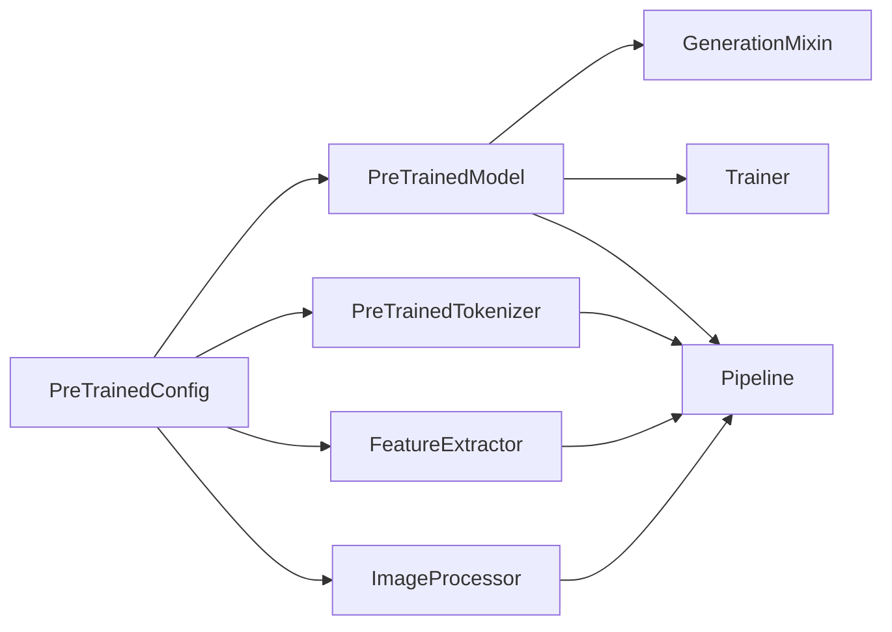
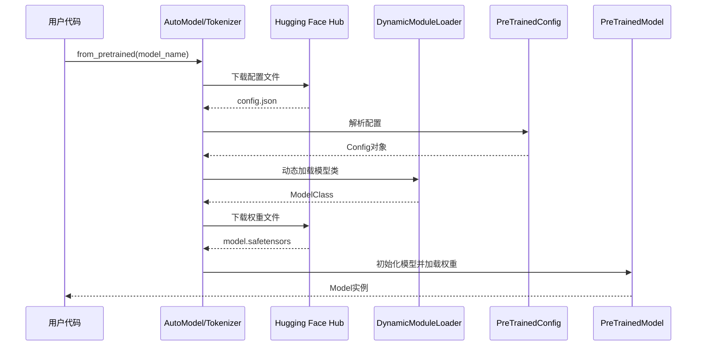
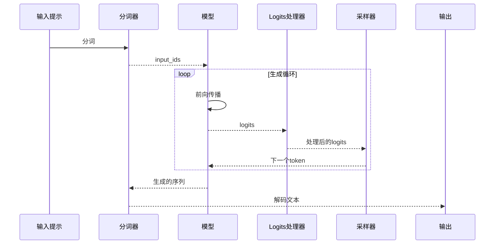
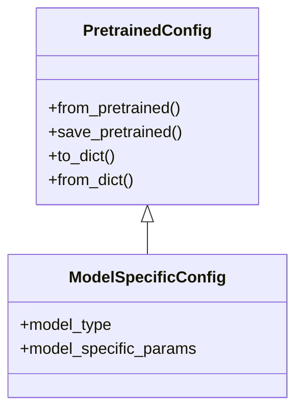
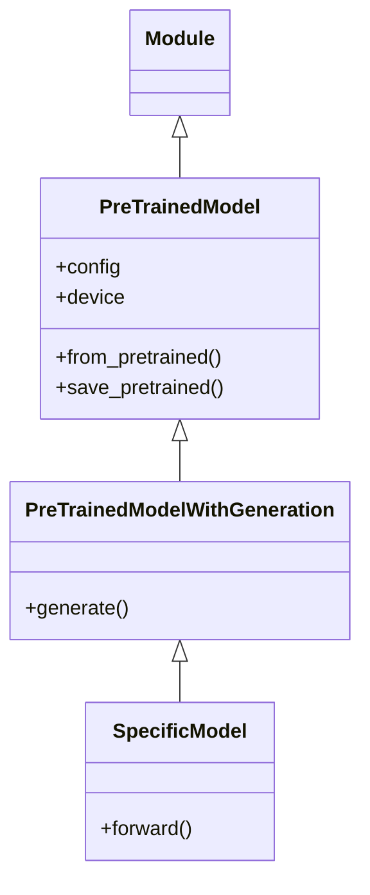

# Transformers 库 - 项目架构图

## 1. 整体架构

下面是 Transformers 库的整体架构图，展示了主要模块之间的关系：



## 2. 核心模块关系

### 2.1 依赖关系



### 2.2 模型加载流程



## 3. 数据流

### 3.1 推理数据流

```mermaid
graph LR
    A[原始输入] --> B[预处理<br/>(Tokenization/Processing)]
    B --> C[模型前向传播]
    C --> D[后处理]
    D --> E[输出结果]
    
    style A fill:#e1f5ff
    style B fill:#e1ffe1
    style C fill:#ffe1e1
    style D fill:#e1ffe1
    style E fill:#e1f5ff
```

### 3.2 文本生成流程



## 4. 类继承关系

### 4.1 配置类继承



### 4.2 模型类继承


