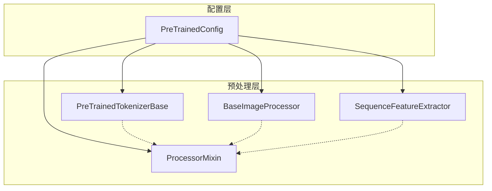

# 核心基础组件

本章节深入分析 Transformers 库的核心基础组件，这些组件构成了整个库的基础架构。

## 目录

1. **[配置系统](./配置系统.md)** - 分析 `PreTrainedConfig` 及其功能
2. **[分词器系统](./分词器系统.md)** - 分析文本分词和编码系统
3. **[特征提取与图像处理](./特征提取与图像处理.md)** - 分析图像、音频等多模态处理

## 组件关系图

## 设计模式

核心基础组件遵循统一的设计模式：

1. **统一接口** - 所有组件都有 `from_pretrained()` 和 `save_pretrained()` 方法
2. **Mixin 组合** - 通过 Mixin 类添加功能（如 `PushToHubMixin`）
3. **继承扩展** - 基类定义接口，具体模型通过继承实现特定功能

## 特点

- **多模态支持** - 文本、图像、音频等多种输入格式
- **灵活扩展** - 易于添加新的模型和处理方式
- **向后兼容** - 保持良好的版本兼容性
