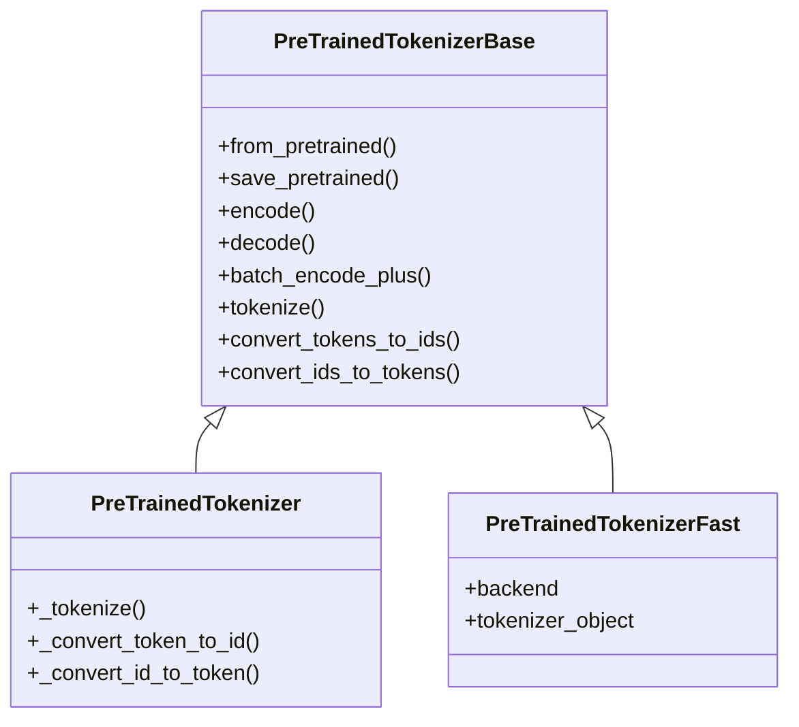
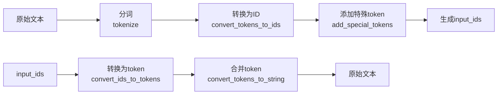

# 分词器系统分析

## 1. 概述

分词器系统负责将文本转换为模型可以处理的 token 序列，是 NLP 模型的关键预处理组件。Transformers 库提供了统一的分词器接口，支持多种分词算法。

## 2. 核心类结构



## 3. 核心功能

### 3.1 编码与解码



### 3.2 主要方法

#### encode()
将文本编码为 token ID 序列。

```python
def encode(
    self,
    text: Union[str, List[str]],
    text_pair: Optional[Union[str, List[str]]] = None,
    add_special_tokens: bool = True,
    padding: Union[bool, str] = False,
    truncation: Union[bool, str] = False,
    max_length: Optional[int] = None,
    return_tensors: Optional[str] = None,
    **kwargs,
) -> List[int]:
```

#### batch_encode_plus()
批量编码文本，返回完整的模型输入。

```python
def batch_encode_plus(
    self,
    batch_text_or_text_pairs: Union[List[str], List[Tuple[str, str]]],
    add_special_tokens: bool = True,
    padding: Union[bool, str] = False,
    truncation: Union[bool, str] = False,
    max_length: Optional[int] = None,
    return_tensors: Optional[str] = None,
    **kwargs,
) -> BatchEncoding:
```

## 4. 特殊 Token 管理

| Token | 描述 |
|------|------|
| `[CLS]` | 分类 token，通常在序列开头 |
| `[SEP]` | 分隔 token，用于分隔句子对 |
| `[PAD]` | 填充 token，用于对齐序列长度 |
| `[UNK]` | 未知 token，替换词汇表外的词 |
| `[MASK]` | 掩码 token，用于掩码语言模型 |

## 5. 快速分词器 vs 慢速分词器

### 5.1 对比

| 特性 | PreTrainedTokenizer | PreTrainedTokenizerFast |
|-----|---------------------|-------------------------|
| 实现 | Python | Rust (通过 tokenizers 库) |
| 速度 | 较慢 | 快 |
| 功能 | 基础 | 丰富（包括偏移映射等） |

### 5.2 转换

支持将慢速分词器转换为快速分词器：

```python
from transformers import convert_slow_tokenizer

fast_tokenizer = convert_slow_tokenizer(slow_tokenizer)
```

## 6. 示例用法

```python
from transformers import BertTokenizer

# 加载分词器
tokenizer = BertTokenizer.from_pretrained("bert-base-uncased")

# 编码文本
text = "Hello, world!"
encoding = tokenizer(text)
print(encoding["input_ids"])  # token ID 序列

# 批量编码
texts = ["Hello, world!", "How are you?"]
encodings = tokenizer(texts, padding=True, truncation=True, return_tensors="pt")

# 解码
decoded = tokenizer.decode(encoding["input_ids"])
print(decoded)  # "[CLS] hello , world ! [SEP]"
```
