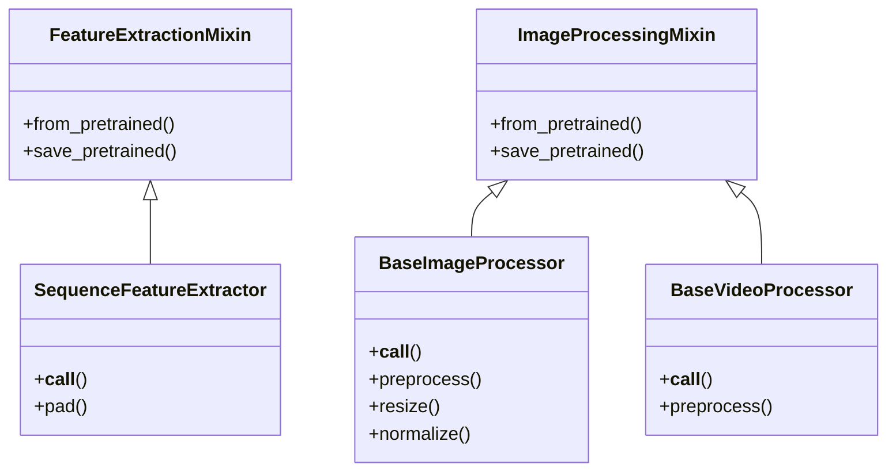
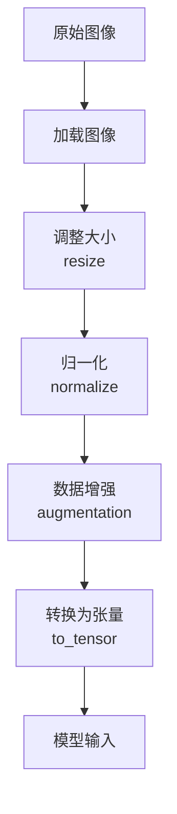
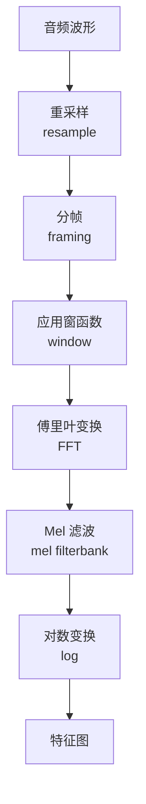
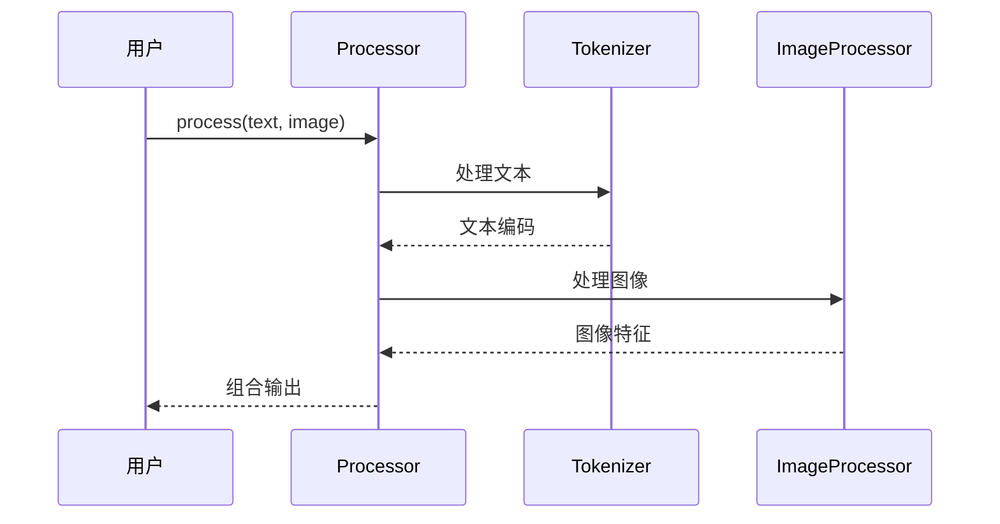

# 特征提取与图像处理系统分析

## 1. 概述

除了文本处理，Transformers 库还支持多种模态的数据处理，包括图像、音频等。本章节分析特征提取和图像处理系统。

## 2. 类层次结构



## 3. 图像处理系统

### 3.1 核心功能

图像处理系统负责将原始图像转换为模型输入，主要步骤包括：



### 3.2 主要方法

#### __call__()
预处理图像的主要接口。

```python
def __call__(
    self,
    images: Union[ImageInput, List[ImageInput]],
    return_tensors: Optional[str] = None,
    **kwargs,
) -> BatchFeature:
```

### 3.3 图像处理链

图像处理通常包含多个步骤的组合：

1. **调整大小** - 将图像调整到模型期望的尺寸
2. **裁剪** - 中心裁剪或随机裁剪
3. **归一化** - 像素值标准化（通常使用 ImageNet 的均值和标准差）
4. **通道调整** - 确保 RGB 格式
5. **转换为张量** - 转换为 PyTorch/TensorFlow 张量

## 4. 音频特征提取

### 4.1 功能概述

音频特征提取器负责将音频波形转换为声学特征，如 Mel 频谱图。

### 4.2 典型处理步骤



## 5. 多模态处理

### 5.1 Processor 类

对于多模态模型，通常使用 `Processor` 类来组合多种处理：

```python
class ProcessorMixin:
    # 组合 tokenizer、image processor 等
```

### 5.2 工作流程



## 6. 示例用法

### 6.1 图像处理

```python
from transformers import ViTImageProcessor
from PIL import Image

# 加载处理器
processor = ViTImageProcessor.from_pretrained("google/vit-base-patch16-224")

# 加载图像
image = Image.open("cat.jpg")

# 预处理
inputs = processor(images=image, return_tensors="pt")
```

### 6.2 多模态处理

```python
from transformers import CLIPProcessor
from PIL import Image

processor = CLIPProcessor.from_pretrained("openai/clip-vit-base-patch32")

# 处理文本和图像
inputs = processor(
    text=["a photo of a cat", "a photo of a dog"],
    images=Image.open("cat.jpg"),
    return_tensors="pt",
    padding=True,
)
```
