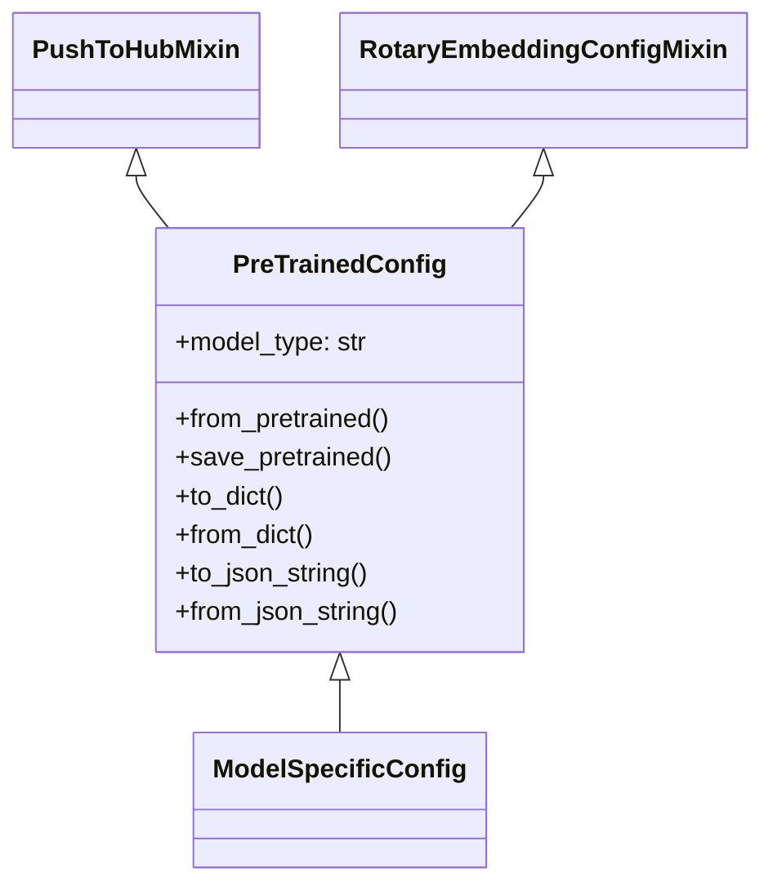
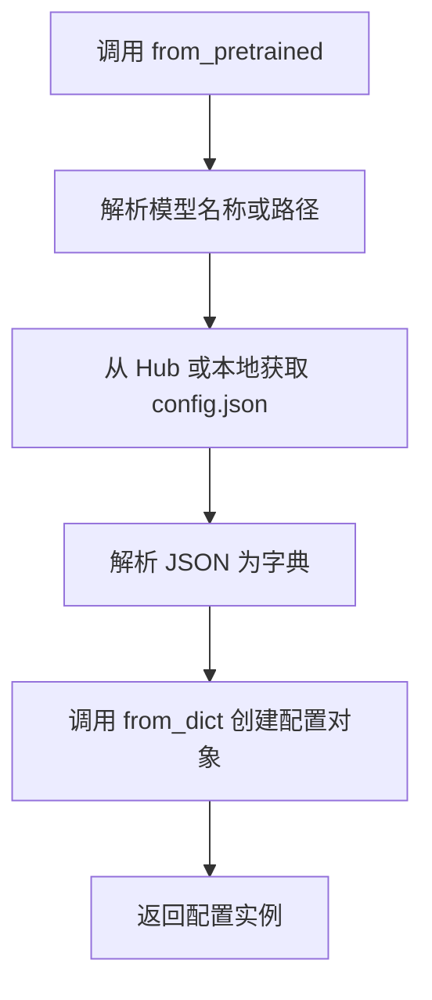
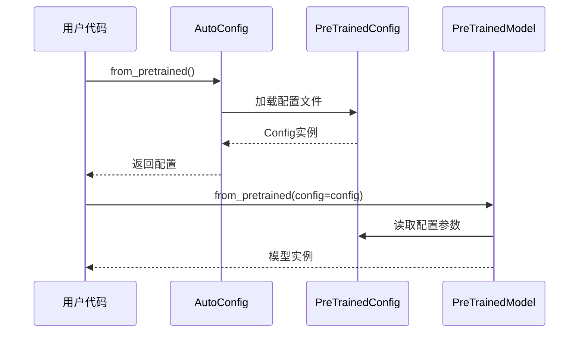

# 配置系统分析

## 1. 概述

配置系统是 Transformers 库的核心基础组件之一，负责管理模型的配置信息。它的主要作用包括：

1. **存储模型架构参数** - 如层数、隐藏维度、注意力头数等
2. **提供序列化/反序列化** - 支持从 JSON 文件加载和保存配置
3. **配置验证和转换** - 确保配置的正确性和兼容性
4. **支持模型类型识别** - 通过 `model_type` 标识模型种类

## 2. 核心类：PreTrainedConfig

`PreTrainedConfig` 是所有配置类的基类，定义在 `configuration_utils.py` 中。

### 2.1 类结构



### 2.2 主要属性

| 属性 | 类型 | 描述 |
|-----|------|------|
| `model_type` | str | 模型类型标识符，用于自动加载 |
| `vocab_size` | int | 词汇表大小 |
| `hidden_size` | int | 隐藏层维度 |
| `num_attention_heads` | int | 注意力头数量 |
| `num_hidden_layers` | int | 隐藏层数量 |
| `output_hidden_states` | bool | 是否输出隐藏状态 |
| `output_attentions` | bool | 是否输出注意力权重 |
| `return_dict` | bool | 是否返回 ModelOutput 对象 |

### 2.3 核心方法

#### 2.3.1 from_pretrained()

从预训练模型加载配置。

```python
@classmethod
def from_pretrained(
    cls,
    pretrained_model_name_or_path: Union[str, os.PathLike],
    **kwargs,
) -> "PreTrainedConfig":
    # 从 Hugging Face Hub 或本地路径加载配置
    # 解析配置文件并返回配置对象
```

**工作流程：**



#### 2.3.2 save_pretrained()

保存配置到文件。

```python
def save_pretrained(
    self,
    save_directory: Union[str, os.PathLike],
    **kwargs,
):
    # 将配置序列化为 JSON 并保存到指定目录
```

#### 2.3.3 to_dict() / from_dict()

在配置对象和字典之间转换。

```python
def to_dict(self) -> Dict[str, Any]:
    # 将配置转换为字典
    
@classmethod
def from_dict(
    cls,
    config_dict: Dict[str, Any],
    **kwargs,
) -> "PreTrainedConfig":
    # 从字典创建配置对象
```

## 3. 配置生命周期



## 4. 设计特点

### 4.1 数据类装饰

`PreTrainedConfig` 使用 Python 的 `@dataclass` 装饰器，提供了：

- 简洁的属性定义
- 自动生成 `__init__`、`__repr__` 等方法
- 类型提示支持

### 4.2 兼容性处理

- 支持旧版本配置的加载
- 属性映射机制 (`attribute_map`)
- 自动类型转换

### 4.3 推送到 Hub

通过继承 `PushToHubMixin`，配置类可以直接推送到 Hugging Face Hub。

## 5. 示例用法

```python
from transformers import BertConfig

# 创建新配置
config = BertConfig(
    vocab_size=30522,
    hidden_size=768,
    num_hidden_layers=12,
    num_attention_heads=12,
)

# 保存配置
config.save_pretrained("./my_config")

# 加载预训练配置
config = BertConfig.from_pretrained("bert-base-uncased")

# 转换为字典
config_dict = config.to_dict()
```
