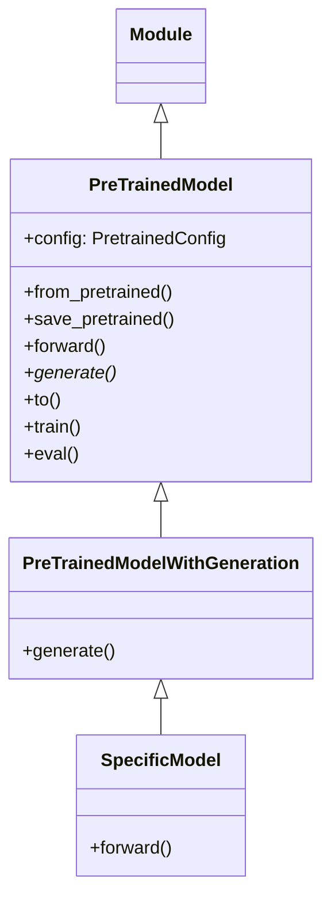
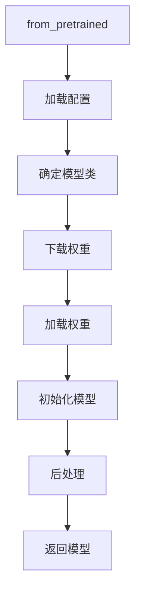

# PreTrainedModel 分析

## 1. 概述

`PreTrainedModel` 是 Transformers 库中所有模型的基类，定义在 `modeling_utils.py` 中。它提供了模型加载、保存、权重管理等核心功能。

## 2. 类结构



## 3. 核心功能

### 3.1 模型加载流程



### 3.2 from_pretrained() 方法

这是最常用的模型加载方法：

```python
@classmethod
def from_pretrained(
    cls,
    pretrained_model_name_or_path: Union[str, os.PathLike],
    *model_args,
    **kwargs,
) -> "PreTrainedModel":
    # 1. 解析参数
    # 2. 加载配置
    # 3. 下载/定位权重文件
    # 4. 初始化模型
    # 5. 加载权重
    # 6. 应用后处理
    # 7. 返回模型
```

### 3.3 权重加载机制

权重加载过程包括：

1. **定位权重文件** - 支持 safetensors、PyTorch bin 等格式
2. **映射权重键** - 处理不同命名规范的权重
3. **加载到设备** - 支持 CPU、GPU、多 GPU 等
4. **量化处理** - 支持 8bit、4bit 等量化加载

## 4. 核心属性

| 属性 | 类型 | 描述 |
|-----|------|------|
| `config` | PretrainedConfig | 模型配置对象 |
| `device` | torch.device | 模型所在设备 |
| `dtype` | torch.dtype | 模型数据类型 |
| `name_or_path` | str | 模型名称或路径 |

## 5. 设备管理

```mermaid
flowchart LR
    A[模型初始化] --> B[to(device)]
    B --> C[移动到目标设备]
    C --> D[更新 model.device]
    D --> E[可以进行前向传播]
```

## 6. 模型保存

`save_pretrained()` 方法将模型保存到指定目录：

1. 保存配置文件 (`config.json`)
2. 保存权重文件 (`model.safetensors` 或 `pytorch_model.bin`)
3. 保存生成配置 (`generation_config.json`)
4. 保存其他必要文件

## 7. 示例用法

```python
from transformers import BertForSequenceClassification

# 加载预训练模型
model = BertForSequenceClassification.from_pretrained(
    "bert-base-uncased",
    num_labels=2,
)

# 保存模型
model.save_pretrained("./my_model")

# 设备移动
model.to("cuda")

# 训练/评估模式
model.train()
model.eval()
```
