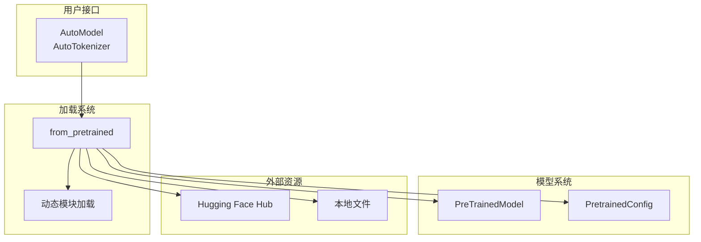

# 模型加载与管理

本章节分析 Transformers 库的模型加载与管理系统，包括预训练模型基类和动态模块加载机制。

## 目录

1. **[PreTrainedModel 分析](./PreTrainedModel分析.md)** - 分析预训练模型基类
2. **[动态模块加载](./动态模块加载.md)** - 分析自定义代码加载机制

## 模型加载架构

## 特点

- **统一加载接口** - 所有模型使用相同的 `from_pretrained()` 方法
- **多种格式支持** - 支持 safetensors、PyTorch bin 等权重格式
- **安全机制** - 动态代码加载需要显式授权
- **灵活扩展** - 支持自定义模型架构
