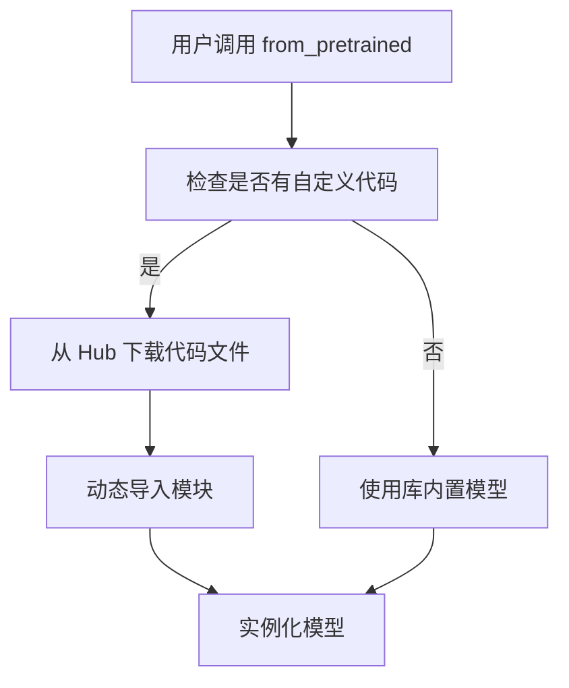
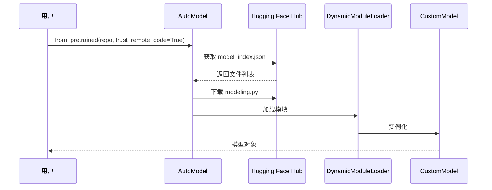

# 动态模块加载

## 1. 概述

动态模块加载是 Transformers 库的一个重要特性，它允许从 Hugging Face Hub 动态加载自定义模型代码，而不需要将代码添加到库中。

## 2. 工作原理



## 3. 核心组件

### 3.1 DynamicModuleLoader

负责动态加载和管理自定义模块。

### 3.2 支持的文件类型

- `config.py` - 自定义配置类
- `modeling.py` - 自定义模型类
- `tokenization.py` - 自定义分词器类
- `tokenization_fast.py` - 自定义快速分词器类

## 4. 安全性

动态加载包含安全机制：

1. **信任远程代码** - 需要显式设置 `trust_remote_code=True`
2. **代码审核** - 建议用户审核下载的代码
3. **沙箱环境** - 限制某些危险操作

## 5. 示例流程



## 6. 使用示例

```python
from transformers import AutoModel

# 加载包含自定义代码的模型
model = AutoModel.from_pretrained(
    "username/custom-model",
    trust_remote_code=True,
)
```

## 7. 优势

- **灵活性** - 可以快速实验新模型架构
- **社区贡献** - 研究人员可以分享新模型
- **版本管理** - 代码随模型版本一起管理
