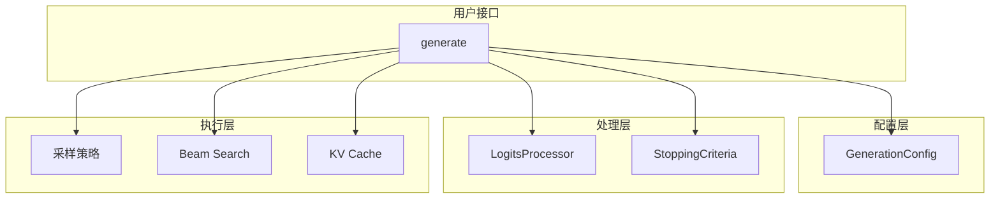

# 生成系统

本章节分析 Transformers 库的文本生成系统，这是现代大语言模型的核心功能。

## 目录

1. **[生成架构概述](./生成架构概述.md)** - 完整的生成系统分析

## 生成系统组件

## 核心特性

- **多种解码策略** - 贪心、采样、beam search 等
- **灵活的配置** - GenerationConfig 管理所有参数
- **高效缓存** - KV Cache 提升生成速度
- **可扩展** - 支持自定义 logits processor 和 stopping criteria
