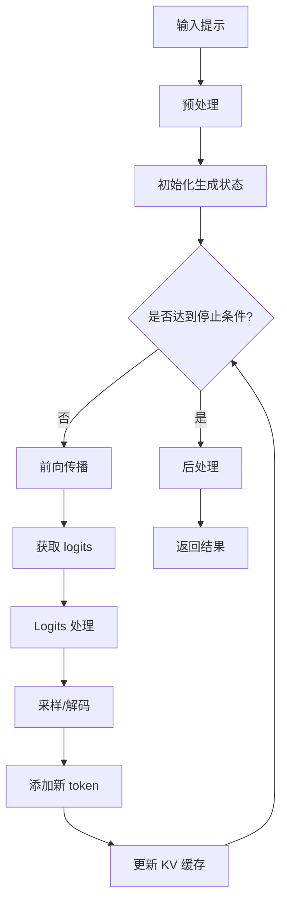
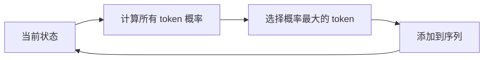
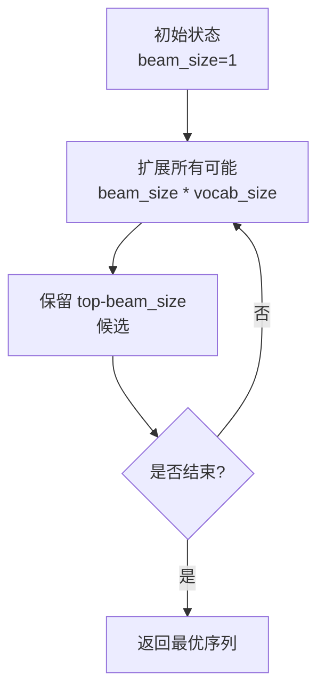
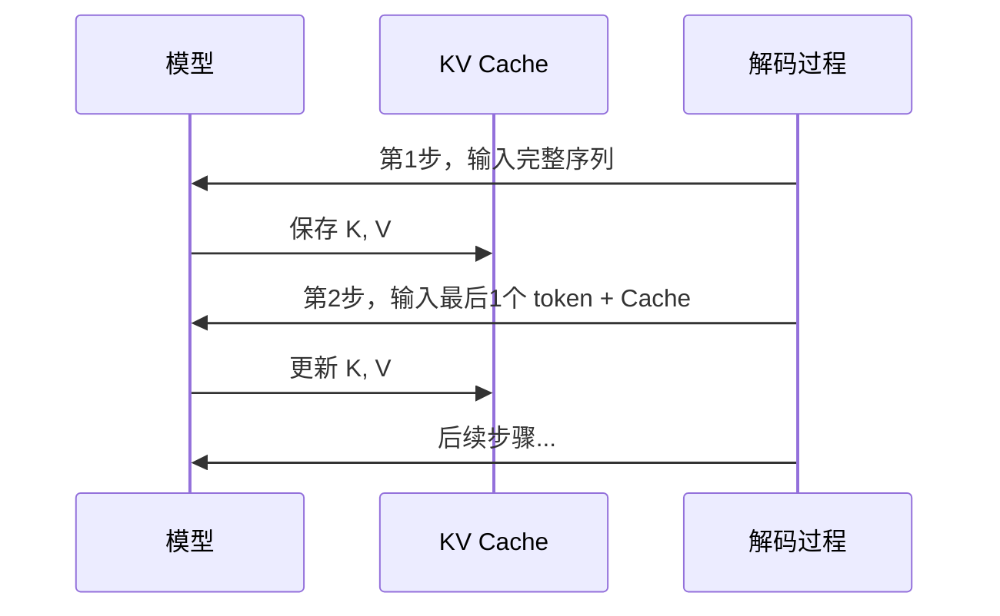

# 生成架构概述

## 1. 概述

文本生成是 Transformers 库的核心功能之一，支持自回归生成、条件生成等多种生成方式。生成系统由 `GenerationMixin` 类提供统一接口。

## 2. 生成流程



## 3. 核心组件

### 3.1 GenerationMixin

提供 `generate()` 方法的 mixin 类。

```python
class GenerationMixin:
    def generate(
        self,
        inputs: Optional[torch.Tensor] = None,
        generation_config: Optional[GenerationConfig] = None,
        logits_processor: Optional[LogitsProcessorList] = None,
        stopping_criteria: Optional[StoppingCriteriaList] = None,
        **kwargs,
    ):
        # 生成逻辑
```

### 3.2 GenerationConfig

生成配置类，管理所有生成参数。

| 参数 | 描述 |
|-----|------|
| `max_new_tokens` | 最大生成 token 数 |
| `temperature` | 采样温度 |
| `top_p` | nucleus 采样参数 |
| `top_k` | top-k 采样参数 |
| `do_sample` | 是否采样 |
| `num_beams` | beam search 数量 |

## 4. 解码策略

### 4.1 贪心解码 (Greedy Search)



### 4.2 采样解码 (Sampling)

- **Temperature Sampling** - 调整概率分布的锐度
- **Top-K Sampling** - 只从概率最高的 k 个 token 中采样
- **Top-P (Nucleus) Sampling** - 从累积概率达到 p 的最小 token 集合中采样

### 4.3 Beam Search



## 5. Logits 处理

生成过程中可以对 logits 进行多种处理：

| 处理器 | 功能 |
|-------|------|
| `TemperatureLogitsWarper` | 应用温度缩放 |
| `TopKLogitsWarper` | 保留 top-k |
| `TopPLogitsWarper` | 保留 nucleus |
| `RepetitionPenaltyLogitsProcessor` | 惩罚重复 |
| `NoRepeatNGramLogitsProcessor` | 禁止重复 n-gram |

## 6. 停止条件

控制生成何时停止：

| 条件 | 描述 |
|-----|------|
| `MaxLengthCriteria` | 达到最大长度 |
| `MaxTimeCriteria` | 达到最大时间 |
| `EosTokenCriteria` | 生成 EOS token |
| `StopStringCriteria` | 生成特定字符串 |

## 7. KV 缓存

KV 缓存是提升生成效率的关键技术：



## 8. 示例用法

```python
from transformers import AutoModelForCausalLM, AutoTokenizer

model = AutoModelForCausalLM.from_pretrained("gpt2")
tokenizer = AutoTokenizer.from_pretrained("gpt2")

inputs = tokenizer("Hello, my name is", return_tensors="pt")

# 贪心解码
outputs = model.generate(**inputs, max_new_tokens=50)

# 采样解码
outputs = model.generate(
    **inputs,
    max_new_tokens=50,
    do_sample=True,
    temperature=0.7,
    top_p=0.9,
)

# Beam search
outputs = model.generate(
    **inputs,
    max_new_tokens=50,
    num_beams=5,
    early_stopping=True,
)
```
