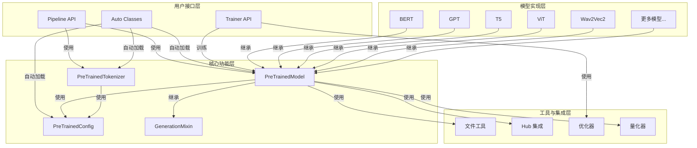
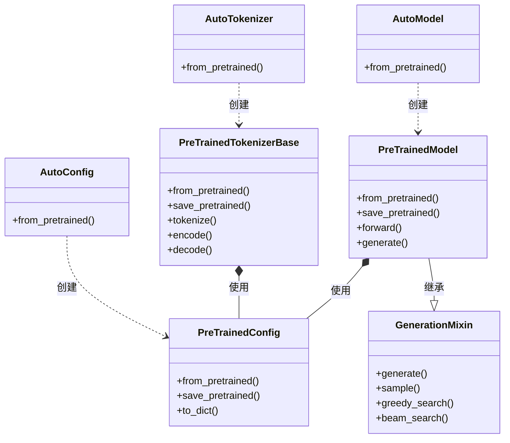
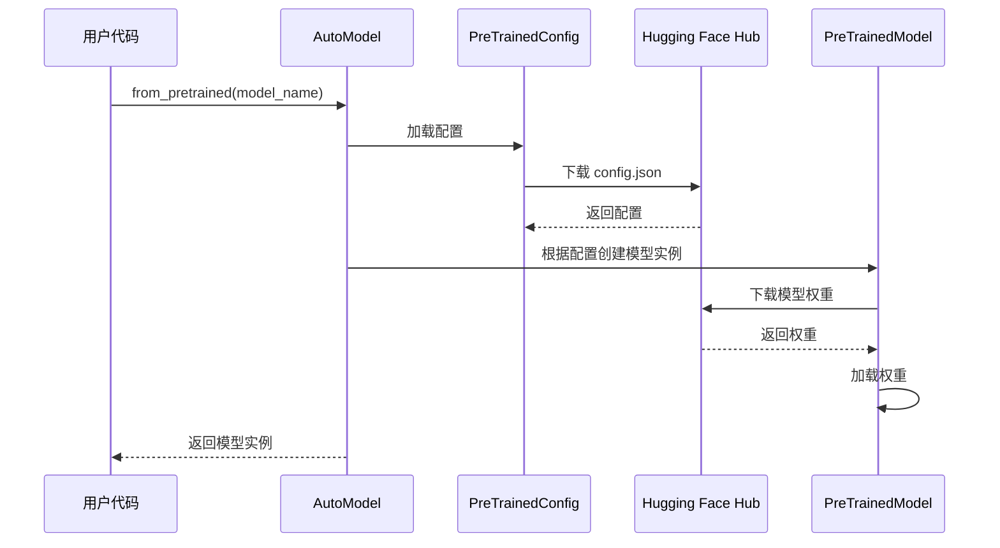
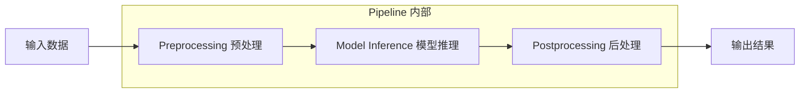
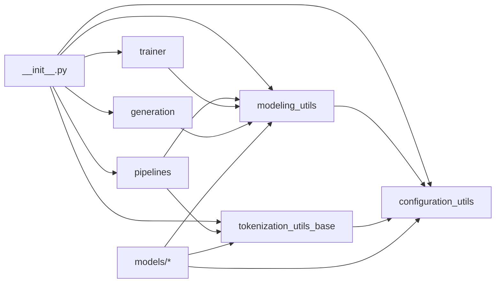

# 项目架构图

本文件包含 Hugging Face Transformers 项目的主要架构示意图。

---

## 1. 整体架构图

以下是 Transformers 库的整体架构设计：

---

## 2. 核心组件关系图

展示核心类之间的关系：

---

## 3. 模型加载流程图

展示 `from_pretrained` 的工作流程：

---

## 4. Pipeline 工作流程图

---

## 5. 模块依赖关系图

展示主要模块之间的依赖关系：

