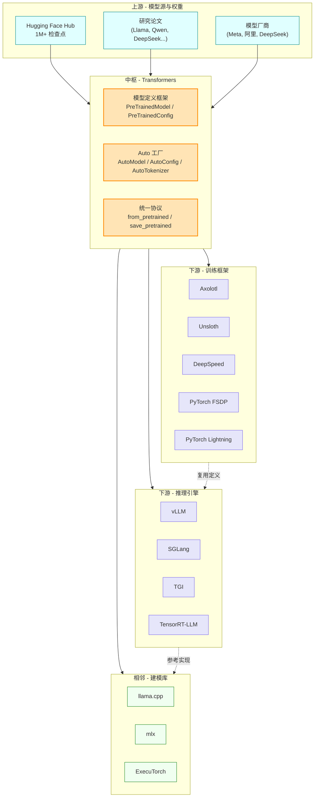
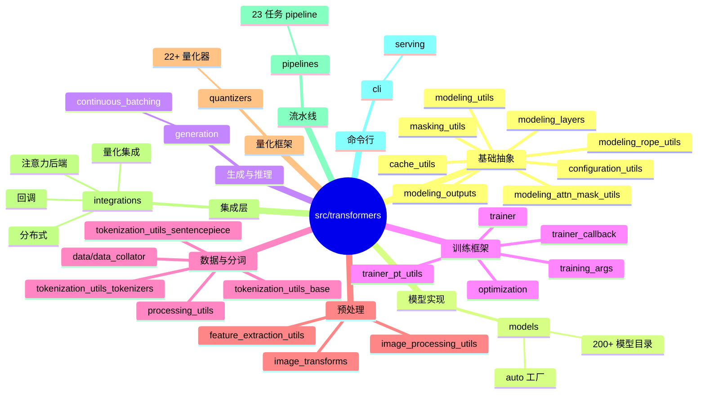
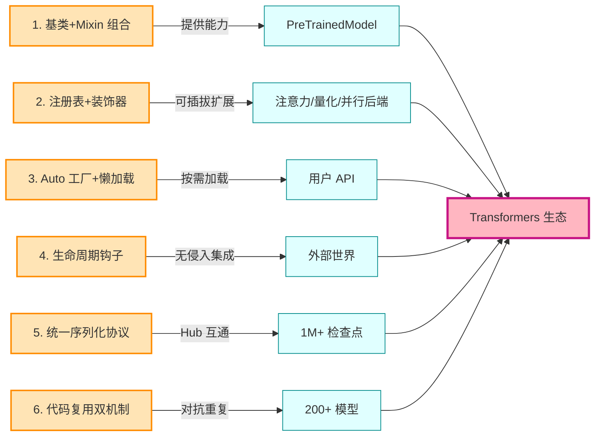
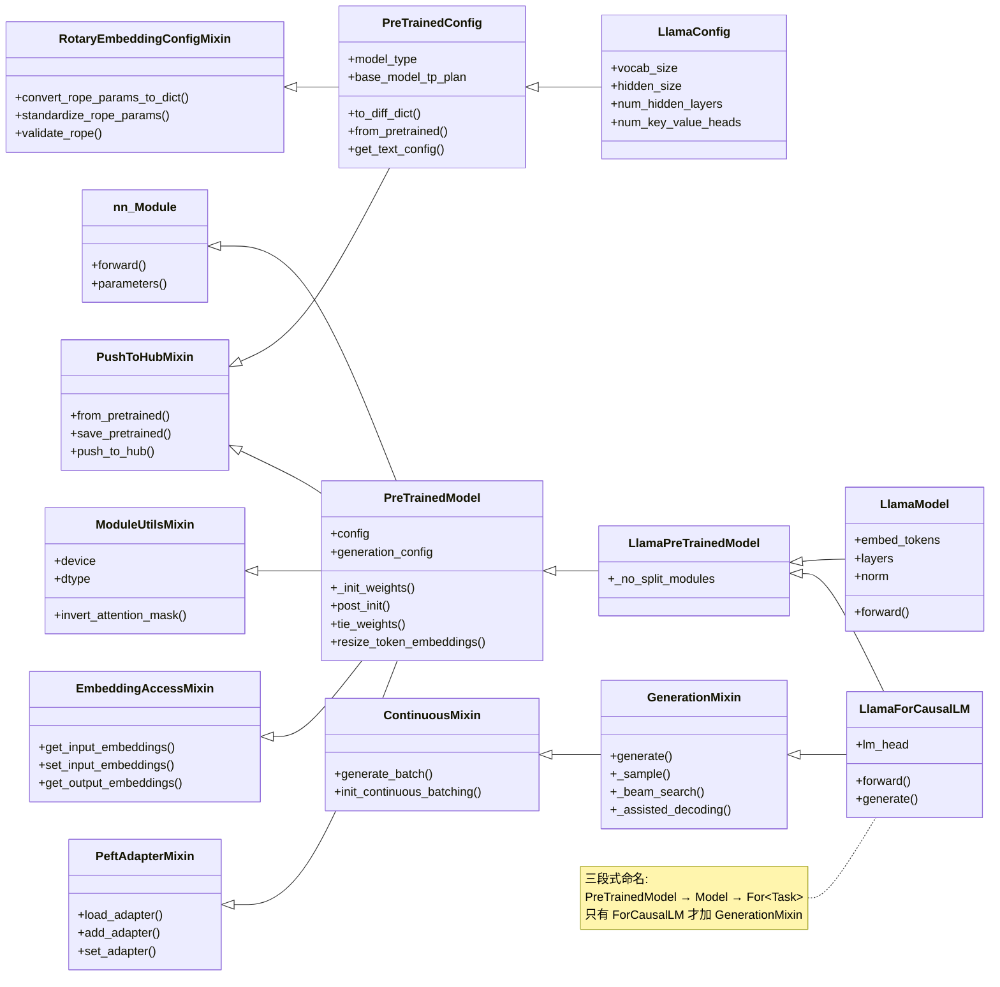
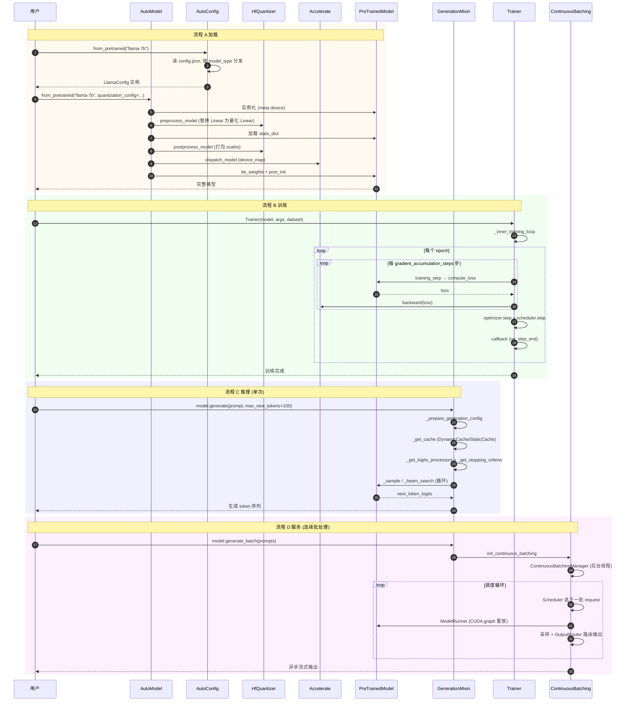
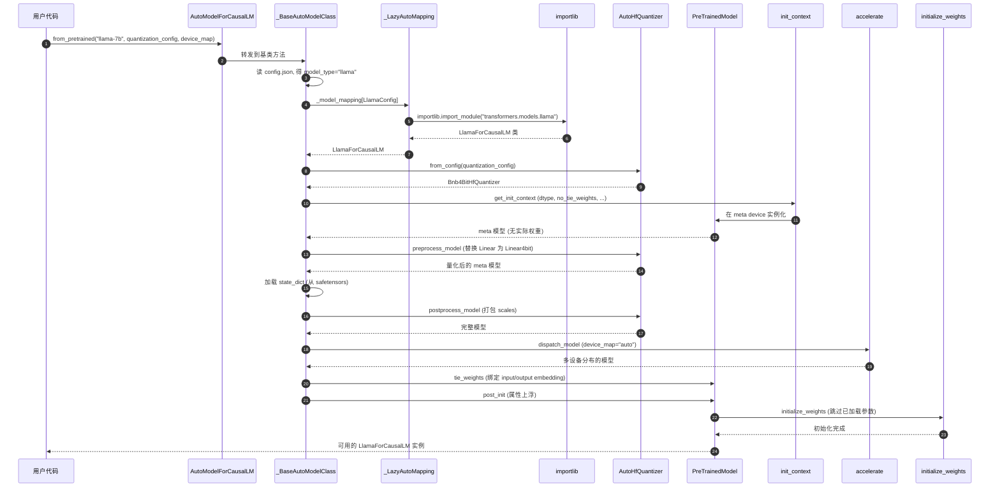

# 整体观：HuggingFace Transformers 的项目全貌与设计哲学

> **本篇定位**：第一维度——给读者一种"看懂全貌"的整体观。
> 从生态定位、代码结构、设计理念、核心抽象、整体流程到实现细节，层层递进地搭建 Transformers 的"骨架地图"。
> 行文采用"总-分-总"结构，配 6 张 Mermaid 图解与 4 个可运行案例。

---

## 总：一句话定位与三大生态角色

如果只能用一句话定义 HuggingFace Transformers，那便是：**它是 SOTA（State-of-the-Art）机器学习模型定义的中央枢纽**。

这句话里每一个词都经过斟酌：

- **SOTA**：它追踪并集成最前沿的模型，从 BERT、GPT 到 Llama、Qwen、DeepSeek，凡是社区认为重要的模型，几乎都会在这里有一份"官方定义"。
- **模型定义（model-definition）**：它不是训练框架，也不是推理引擎，而是"模型应该长什么样"的权威蓝本。其他框架（vLLM、DeepSpeed、llama.cpp）都以此为参照。
- **中央枢纽**：它处在 AI 工程化生态的十字路口，向上承接 Hub 上 1M+ 检查点，向下对接数十种训练/推理后端。

用三句话进一步刻画其生态地位：

1. **它是模型定义的"宪法"**——所有模型都必须遵守 `from_pretrained` / `save_pretrained` 协议、声明 `model_type` 身份、继承 `PreTrainedModel`，否则无法被生态识别。
2. **它是跨框架的"枢轴"**——同一个模型定义，能被 Axolotl/Unsloth 训练、被 vLLM/SGLang/TGI 推理、被 llama.cpp/mlx 转译，因为它们都参照 transformers 的定义。
3. **它是 1M+ 检查点的"集散地"**——Hugging Face Hub 上的模型权重都以 transformers 的格式存储，加载时统一走 `AutoModel.from_pretrained`。

正因为它横跨"算法、工程、生态"三个维度，且代码量超过 80 万行、模型数超过 200 个，**仅靠一篇文档无法读懂它**。本系列用三篇文档完成"森林 → 树木 → 根系"的层层递进：本篇（第一篇）搭骨架，让你建立整体观；第二篇填血肉，让你摸到算法与工程的细节；第三篇提炼灵魂，让你刻进记忆。

下面进入"分"的部分，用六章搭建 Transformers 的整体地图。

---

## 分：六章搭建整体地图

### 第一章 生态定位——Transformers 在 AI 世界的坐标

#### 1.1 从"模型实现库"到"模型定义框架"

Transformers 项目早期（2018-2020）的定位是"一个提供预训练模型实现的 PyTorch 库"，与当时盛行的"模型实现库"（如 fairseq、allennlp）并无本质差异。但随着大模型时代的到来，它的角色发生了根本性转变：**从"实现库"升级为"定义框架"**。

这一转变的核心标志是 README 中明确写出的定位声明（见 [README.md](file:///workspace/README.md)）：

> *Transformers acts as the model-definition framework for state-of-the-art machine learning with text, computer vision, audio, video, and multimodal models, for both inference and training. It centralizes the model definition so that this definition is agreed upon across the ecosystem.*

"centralizes the model definition"（集中化模型定义）这一表述，揭示了 Transformers 的真正价值：**它不是要成为最快的训练库或最快的推理库，而是要成为所有人共同认可的"模型定义标准"**。

#### 1.2 上下游生态关系

Transformers 处在 AI 工程化生态的中枢位置，其上下游关系如下图所示：



**图 1 说明**：Transformers 处在生态中枢位置（橙色节点）。上游的论文与厂商模型经由它"标准化"为可被生态识别的格式（`config.json` + `modeling_xxx.py` + `pytorch_model.bin`）；下游的训练框架、推理引擎、相邻建模库都参照它的模型定义。虚线表示"间接复用"——训练框架产出的权重，可被推理引擎直接加载，因为它们都遵循 transformers 的格式。

#### 1.3 "枢轴"角色的三个工程体现

1. **`model_type` 字符串作为身份标识**：每个模型的 config.json 中都有一个 `model_type` 字段（如 `"llama"`、`"qwen2"`），这是该模型在生态中的"身份证号"。AutoConfig 据此分发到对应的 Config 类，AutoModel 据此分发到对应的 Model 类。
2. **权重格式的统一**：所有模型的权重都以 `safetensors` 或 `pytorch_model.bin` 格式存储，命名遵循 `state_dict` 的键约定。一个 Llama 权重可以被 vLLM、SGLang、llama.cpp 直接加载，因为它们都按 transformers 的命名规则解析。
3. **配置即契约**：`config.json` 是模型与外界沟通的"契约文件"。它声明了模型架构（`num_hidden_layers`、`hidden_size` 等）、注意力实现偏好（`_attn_implementation`）、张量并行计划（`base_model_tp_plan`）等所有信息，让下游框架无需查看模型代码即可加载。

---

### 第二章 代码结构总览——一张地图看懂全仓

#### 2.1 顶层目录组织

Transformers 的源码主体位于 [src/transformers/](file:///workspace/src/transformers/) 下，按"职责分层 + 模型平铺"的方式组织。其核心子目录如下：



**图 2 说明**：这张思维导图把 `src/transformers/` 的核心子目录分为 9 大类。最关键的观察是：**基础抽象层（configuration_utils / modeling_utils 等）极薄，但定义了所有模型的"骨架"；模型实现层（models/）极厚，包含 200+ 个具体模型，但都遵循同一套骨架**。这正是"约定宪法"哲学的体现——核心薄、边缘厚。

#### 2.2 13 大核心模块的职责定位

| 模块 | 文件路径 | 一句话职责 |
|------|---------|-----------|
| 配置基类 | [configuration_utils.py](file:///workspace/src/transformers/configuration_utils.py) | `PretrainedConfig`，所有模型配置的根基类，dataclass + JSON 序列化 |
| 模型基类 | [modeling_utils.py](file:///workspace/src/transformers/modeling_utils.py) | `PreTrainedModel`，所有模型的根基类，权重加载/初始化/设备管理 |
| 层抽象 | [modeling_layers.py](file:///workspace/src/transformers/modeling_layers.py) | `GradientCheckpointingLayer` + `GenericFor*` 任务头混入 |
| KV 缓存 | [cache_utils.py](file:///workspace/src/transformers/cache_utils.py) | 7 种 Cache 实现（Dynamic/Static/Offloaded/Quantized/...） |
| 掩码工具 | [masking_utils.py](file:///workspace/src/transformers/masking_utils.py) | 函数式 mask 组合 + 后端物化器 |
| RoPE 工具 | [modeling_rope_utils.py](file:///workspace/src/transformers/modeling_rope_utils.py) | 7 种 RoPE 变体的统一抽象 |
| 生成框架 | [generation/](file:///workspace/src/transformers/generation/) | `GenerationMixin` + logits 处理器 + 停止准则 + 投机解码 |
| 连续批处理 | [generation/continuous_batching/](file:///workspace/src/transformers/generation/continuous_batching/) | vLLM 式的 PagedAttention + 调度器 + CUDA graph |
| 训练器 | [trainer.py](file:///workspace/src/transformers/trainer.py) | `Trainer` 类，功能完整但可定制的训练循环 |
| 量化框架 | [quantizers/](file:///workspace/src/transformers/quantizers/) | `HfQuantizer` 基类 + 22+ 种量化器实现 |
| 集成层 | [integrations/](file:///workspace/src/transformers/integrations/) | 注意力后端 / 分布式 / 量化集成 / 训练回调 |
| 流水线 | [pipelines/](file:///workspace/src/transformers/pipelines/) | 23 种任务的"端到端"推理流水线 |
| 自动工厂 | [models/auto/](file:///workspace/src/transformers/models/auto/) | `AutoConfig` / `AutoModel` / `AutoTokenizer` 等工厂类 |

#### 2.3 "约定优于配置"的目录哲学

观察 [models/](file:///workspace/src/transformers/models/) 下任意一个模型目录（如 [models/llama/](file:///workspace/src/transformers/models/llama/)），你会发现它们都遵循同一套命名约定：

- `__init__.py`：用 `_LazyModule` 实现惰性导入
- `configuration_<name>.py`：配置类 `<Name>Config`
- `modeling_<name>.py`：模型类 `<Name>Model` / `<Name>ForCausalLM` 等
- `tokenization_<name>.py`（可选）：分词器
- `modular_<name>.py`（可选）：模块化源文件

这种"约定优于配置"的设计让任何一个新模型都能被社区成员快速定位：你想看 Llama 的实现？直接打开 `models/llama/modeling_llama.py`。你想知道 Qwen2VL 怎么处理图像？打开 `models/qwen2_vl/processing_qwen2_vl.py`。**目录结构本身就是文档**。

---

### 第三章 设计理念六大支柱

剥开代码细节，Transformers 的设计理念可以归纳为六大支柱。这六大支柱共同支撑了"数百个模型在数百万人手中协同进化"的工程奇迹。



**图 3 说明**：六大支柱（橙色）各自承担一项设计职责，分别落到不同的目标对象（青色），最终汇聚成 Transformers 生态（粉色）。下面逐一展开。

#### 3.1 支柱一：基类 + Mixin 组合

`PreTrainedModel` 不靠深度继承树获取能力，而是通过多 Mixin 组合：

- `ModuleUtilsMixin`：设备/精度工具
- `EmbeddingAccessMixin`：自动处理 input/output embedding 读写
- `PushToHubMixin`：Hub 上传/下载
- `PeftAdapterMixin`：PEFT adapter 加载与管理

这种"能力是插件而非血统"的设计，让新模型只需继承 `PreTrainedModel` 即可获得所有能力，而无需理解复杂的继承树。详见 [modeling_utils.py:1166](file:///workspace/src/transformers/modeling_utils.py)。

#### 3.2 支柱二：注册表 + 装饰器

Transformers 用"全局映射 + 装饰器注册"实现可扩展的插件机制。核心注册表包括：

| 注册表 | 位置 | 作用 |
|--------|------|------|
| `AttentionInterface` | [modeling_utils.py:5032](file:///workspace/src/transformers/modeling_utils.py) | 注意力后端（eager/sdpa/flash2/flash3/flex） |
| `AttentionMaskInterface` | [masking_utils.py:741](file:///workspace/src/transformers/masking_utils.py) | 掩码物化器 |
| `ParallelInterface` | [integrations/tensor_parallel.py](file:///workspace/src/transformers/integrations/tensor_parallel.py) | 张量并行风格（11 种） |
| `AUTO_QUANTIZER_MAPPING` | [quantizers/auto.py](file:///workspace/src/transformers/quantizers/auto.py) | 量化器（22+ 种） |
| `LAYER_TYPE_CACHE_MAPPING` | [cache_utils.py:34](file:///workspace/src/transformers/cache_utils.py) | 每层 Cache 类型 |
| `SUPPORTED_TASKS` | [pipelines/__init__.py:137](file:///workspace/src/transformers/pipelines/__init__.py) | 流水线任务（23 种） |
| `LOSS_MAPPING` | loss/loss_utils.py | 损失函数 |
| `ROPE_INIT_FUNCTIONS` | [modeling_rope_utils.py](file:///workspace/src/transformers/modeling_rope_utils.py) | RoPE 变体（7 种） |

新增扩展只需 `@register_xxx`，无需修改核心代码。

#### 3.3 支柱三：Auto 工厂 + 懒加载

`AutoModel` / `AutoConfig` / `AutoTokenizer` 等工厂类采用**双层懒加载**设计：

- 第一层：`MODEL_FOR_CAUSAL_LM_MAPPING_NAMES` 是字符串映射（`"llama" → "LlamaForCausalLM"`），编译期定义
- 第二层：`_LazyAutoMapping` 在运行期按需 `importlib.import_module` 加载模型模块

这一设计避免了 transformers 启动时一次性导入数百个模型（否则启动会非常慢），同时让用户只需记住 `AutoModelForCausalLM.from_pretrained(...)` 即可加载任意模型。详见 [models/auto/auto_factory.py:578](file:///workspace/src/transformers/models/auto/auto_factory.py)。

#### 3.4 支柱四：生命周期钩子

好框架的标志是"扩展点比核心代码还多"。Transformers 在关键流程中预设了大量钩子：

- `HfQuantizer` 的 `preprocess_model` / `postprocess_model`：让 22 种量化方法无需侵入 `from_pretrained`
- `TrainerCallback` 的 15 个钩子（`on_train_begin` / `on_step_end` / `on_epoch_end` 等）：让 WandB / TensorBoard / MLflow 无需侵入训练循环
- `AttentionInterface`：让 FlashAttention / SDPA / Flex 无需侵入模型 forward

详见 [quantizers/base.py](file:///workspace/src/transformers/quantizers/base.py) 与 [trainer_callback.py](file:///workspace/src/transformers/trainer_callback.py)。

#### 3.5 支柱五：统一 from_pretrained / save_pretrained 协议

所有可序列化对象都实现 `from_pretrained` / `save_pretrained` 这对方法，包括：

- `PreTrainedConfig`：配置
- `PreTrainedModel`：模型
- `PreTrainedTokenizerBase`：分词器
- `ImageProcessingMixin`：图像处理器
- `FeatureExtractionMixin`：特征提取器
- `ProcessorMixin`：多模态处理器

它们都继承 `PushToHubMixin`，支持 Hub repo id、本地目录、单文件路径三种输入，通过 `cached_file()` 处理缓存和下载。这是"宪法"最直接的体现——**所有对象必须说同一种语言**。

#### 3.6 支柱六：代码复用双机制

由于 `models/` 下的 `modeling_*.py` 之间不允许直接继承（避免继承地狱），Transformers 提供两套互补的代码复用机制：

1. **modular_*.py（推荐）**：模块化源文件**可以**继承其他模型，`make fix-repo` 会把继承"展开"为独立的 `modeling_<name>.py`。例如 [models/mistral/modular_mistral.py](file:///workspace/src/transformers/models/mistral/modular_mistral.py) 继承自 Llama，只在 Attention 上加 sliding window。
2. **# Copied from（旧）**：注释驱动的文本复制 + 符号替换，如 `# Copied from transformers.models.bart.modeling_bart.BartScaledWordEmbedding with Bart->XGLM`。

两套机制共同对抗"200+ 模型 × 数千行代码"带来的重复压力。详见根 [AGENTS.md](file:///workspace/.ai/AGENTS.md) 中的 "Copies and Modular Models" 章节。

---

### 第四章 核心抽象的继承谱系

理解 Transformers 的整体观，必须看懂三条核心继承谱系：配置谱系、模型谱系、生成谱系。



**图 4 说明**：这张类图展示了三条核心谱系。**配置谱系**（上半部）：`PreTrainedConfig` 同时继承 `PushToHubMixin`（获得序列化能力）和 `RotaryEmbeddingConfigMixin`（获得 RoPE 参数管理能力），具体配置类如 `LlamaConfig` 只需声明字段。**模型谱系**（中部）：`PreTrainedModel` 同时继承 5 个父类（`nn.Module` + 4 个 Mixin），获得设备管理、嵌入访问、Hub 互通、PEFT 适配等能力。**生成谱系**（右下）：`GenerationMixin` 继承 `ContinuousMixin`，提供 `generate`（单次生成）与 `generate_batch`（连续批处理）两条路径。注意三段式命名约定：`<Name>PreTrainedModel` → `<Name>Model` → `<Name>For<Task>`，只有 `ForCausalLM` 类才混入 `GenerationMixin`。

这种设计的巧妙之处在于：**任何一个新模型，只需声明配置字段 + 实现网络结构 + 实现 `_init_weights`，就能自动获得训练、推理、量化、分布式、Hub 互通等所有能力**。这正是"宪法联邦"的体现——宪法薄，州权厚。

---

### 第五章 整体流程——从 from_pretrained 到 generate

Transformers 的整体流程可以归纳为四条主线：**加载、训练、推理、服务**。它们共享同一套基础设施（基类、注册表、钩子），但走不同的代码路径。



**图 5 说明**：四条流程对比时序图。**流程 A（加载）** 走 `AutoConfig → AutoModel → 量化器钩子 → accelerate 分发 → tie_weights + post_init`，是最长的链路。**流程 B（训练）** 走 `Trainer._inner_training_loop → training_step → compute_loss → accelerator.backward → optimizer.step`，依赖 Accelerate 统一抽象 DDP/FSDP/DeepSpeed。**流程 C（推理）** 走 `generate → _prepare_generation_config → _get_cache → _sample` 循环，是单请求路径。**流程 D（服务）** 是 v5 新增的连续批处理路径，走 `generate_batch → ContinuousBatchingManager → Scheduler → ModelRunner`，用 CUDA graph 加速，支持多请求并发与异步流式输出。**四条流程共享 PreTrainedModel 与 GenerationMixin 基础设施**，但走不同的"业务层"代码。

#### 5.1 加载流程的深入

加载流程是理解整个 transformers 的钥匙。以 `AutoModelForCausalLM.from_pretrained("meta-llama/Llama-2-7b-hf", quantization_config=BitsAndBytesConfig(load_in_4bit=True), device_map="auto")` 为例：

1. **AutoConfig.from_pretrained**：从 Hub 下载 `config.json`，读取 `model_type="llama"`，从 `CONFIG_MAPPING_NAMES` 查到 `"llama" → "LlamaConfig"`，`importlib.import_module("transformers.models.llama")` 加载模块，实例化 `LlamaConfig`。
2. **AutoModelForCausalLM.from_pretrained**：从 `MODEL_FOR_CAUSAL_LM_MAPPING_NAMES` 查到 `"llama" → "LlamaForCausalLM"`，加载对应类。
3. **量化器介入**：`get_hf_quantizer(config, quantization_config)` 创建 `Bnb4BitHfQuantizer`，调用 `preprocess_model` → `_process_model_before_weight_loading`，在 meta device 上把所有 `nn.Linear` 替换为 `bnb.nn.Linear4bit`。
4. **模型实例化**：用 `get_init_context` 构造上下文管理器栈（dtype、`no_tie_weights`、可选 DeepSpeed ZeRO-3 `zero.Init`），在 meta device 上实例化模型（不分配实际内存）。
5. **权重加载**：下载 `model.safetensors`，加载到 state_dict，处理 mismatch（多余/缺失键）。
6. **量化后处理**：`postprocess_model` → `_process_model_after_weight_loading`，打包 scales、处理 tied weights。
7. **设备分发**：`accelerate.dispatch_model` 按 `device_map="auto"` 自动把模型切分到多 GPU/CPU。
8. **tie_weights + post_init**：绑定 input/output embedding，递归收集子模型的 `_tp_plan` / `_pp_plan` / `_keep_in_fp32_modules` 等属性到顶层，调用 `initialize_weights`。

#### 5.2 训练流程的深入

训练流程由 [trainer.py](file:///workspace/src/transformers/trainer.py) 的 `Trainer` 类驱动，核心是 `_inner_training_loop`：

1. **准备阶段**：`get_train_dataloader` 获取数据加载器（默认用 `LengthGroupedSampler` 按长度分组减少 padding），`_prepare_for_training` 包装模型（DDP/FSDP/DeepSpeed）、创建 optimizer 和 scheduler。
2. **Epoch 循环**：每个 epoch 调 `_run_epoch`，内部按 `gradient_accumulation_steps` 累积梯度。
3. **training_step**：`compute_loss` 计算损失 → `accelerator.backward(loss)` 反向传播。多 GPU 时 loss.mean()，按 GA 归一化。
4. **同步步**：梯度裁剪 → `optimizer.step()` → `lr_scheduler.step()` → `model.zero_grad()` → 更新 global_step → `_maybe_log_save_evaluate`。
5. **回调触发**：在 `on_step_end` / `on_epoch_end` / `on_train_end` 等点触发 `callback_handler`，集成 WandB/TensorBoard/MLflow。

#### 5.3 推理流程的深入

推理流程由 [generation/utils.py](file:///workspace/src/transformers/generation/utils.py) 的 `GenerationMixin.generate` 驱动：

1. **配置准备**：`_prepare_generation_config` 合并默认 GenerationConfig 与用户参数。
2. **输入准备**：`_prepare_model_inputs` 获取 input_ids 与 attention_mask。
3. **缓存准备**：`_get_cache` 根据 `cache_implementation` 创建 `DynamicCache` / `StaticCache` / `OffloadedCache` / `QuantizedCache`。
4. **处理器准备**：`_get_logits_processors` 组装 `LogitsProcessorList`（temperature、top_k、top_p、repetition_penalty 等共 38 种处理器），`_get_stopping_criteria` 组装停止准则。
5. **模式分派**：按 `GenerationMode` 分派到 `_sample`（采样）/ `_beam_search`（束搜索）/ `_assisted_decoding`（投机解码）/ `_contrastive_search`（对比搜索）。
6. **解码循环**：在 `_sample` 中循环调用 `model.forward` → 应用 logits 处理器 → 采样 next token → 更新 cache → 检查停止准则。

#### 5.4 服务流程的深入

服务流程是 v5 引入的生产级推理子系统，灵感来自 vLLM：

1. **初始化**：`init_continuous_batching` 创建 `ContinuousBatchingManager`，预热 CUDA graph。
2. **请求提交**：`add_request` 把请求放入 `input_queue`，后台线程 `_run_generation_loop` 持续处理。
3. **调度**：`Scheduler` 决定哪些 request 进入下一批（`FIFOScheduler` 或 `PrefillFirstScheduler`）。
4. **执行**：`ModelRunner` 执行实际 forward，按 q/kv padding interval 分桶捕获 CUDA graph，重放时填充实际数据。
5. **输出路由**：`OutputRouter` 把生成输出路由到注册的 async handler 或共享 `output_queue`，支持异步流式。

---

### 第六章 实现细节的若干精彩处

整体观不仅看"有什么"，还要看"做得有多巧"。本章挑出 8 个精彩实现细节，它们共同塑造了 Transformers 的工程美学。

#### 6.1 `__init_subclass__` 自动推导 config_class

在 [modeling_utils.py:1298](file:///workspace/src/transformers/modeling_utils.py)，`PreTrainedModel` 重写了 `__init_subclass__`：

```python
def __init_subclass__(cls, **kwargs):
    super().__init_subclass__(**kwargs)
    # 自动从类型注解 config 推导 config_class
    # 优先级: child_attribute > child_annotation > global_attribute > global_annotation
```

这意味着子类只需在 `__init__` 中写 `def __init__(self, config: LlamaConfig):`，框架就能自动把 `LlamaConfig` 设为 `config_class`，无需显式写 `config_class = LlamaConfig`。**这是"减少样板代码"的极致**。

#### 6.2 `smart_apply` 动态注入解决复合模型初始化

`PreTrainedModel.initialize_weights`（[modeling_utils.py:2469](file:///workspace/src/transformers/modeling_utils.py)）通过动态注入 `smart_apply`（一个改进版 `nn.Module.apply`），在递归时遇到子 `PreTrainedModel` 自动切换到该子模型的 `_initialize_weights`。这解决了复合模型（如 VLM 包含视觉编码器 + 语言模型）的初始化函数分发难题——**无需每个复合模型手写递归**。

#### 6.3 `post_init` 属性上浮

`PreTrainedModel.post_init`（[modeling_utils.py:1362](file:///workspace/src/transformers/modeling_utils.py)）递归收集子模型的 `_tp_plan` / `_ep_plan` / `_pp_plan`、`all_tied_weights_keys`、`_keep_in_fp32_modules`、`_no_split_modules` 等静态属性到顶层。这让顶层模型对 device_map、TP/PP plan、tied weights 有完整视图，**是处理复合模型的关键**。

#### 6.4 `_is_hf_initialized` 标志避免重复初始化

在 `_initialize_weights` 中，每个参数会被打上 `_is_hf_initialized` 标志。`from_pretrained` 加载权重后，已加载的参数会被跳过初始化。**这让"加载"与"初始化"不冲突**，避免重复计算。

#### 6.5 `to_diff_dict` 让 config.json 极简

`PreTrainedConfig.to_diff_dict`（[configuration_utils.py](file:///workspace/src/transformers/configuration_utils.py)）只保存与默认值不同的字段，嵌套递归 diff。这让 config.json 极简且可读，提升可读性、减少冲突。例如 LlamaConfig 默认 `hidden_act="silu"`，如果用户没改，config.json 中就不会出现这个字段。

#### 6.6 量化模型覆盖 cuda/to 而非 patch

`PreTrainedModel` 覆盖了 `cuda` / `to` / `half` / `float`（[modeling_utils.py:3594-3699](file:///workspace/src/transformers/modeling_utils.py)），针对 HQQ、BNB 4/8bit、GPTQ、Quark 等量化模型做特殊处理或抛错（量化模型不能改 dtype）。**集中管控而非每个量化器 patch**，避免了散弹枪式的代码修改。

#### 6.7 函数式 mask 组合

[masking_utils.py](file:///workspace/src/transformers/masking_utils.py) 把掩码建模为"以 `(batch_idx, head_idx, q_idx, kv_idx) -> bool` 为签名的纯函数"，通过 `and_masks` / `or_masks` 组合，再按后端（sdpa/eager/flash/flex）物化为具体张量或 `BlockMask`。这取代了旧的"4D 张量 + 大负数填充"方案，**更灵活、更省内存、更易扩展**。例如 VLM 可以叠加自定义图像 token mask，无需改库代码。

#### 6.8 每层独立 Cache 对象

[cache_utils.py](file:///workspace/src/transformers/cache_utils.py) 经历了重大重构：从"Cache 是一个持有 keys/values 张量列表的容器"演变为"Cache 是一个 `CacheLayerMixin` 列表的容器"。每一层有独立的 cache 对象，支持不同层使用不同 cache 策略（如混合架构中 full_attention 层与 sliding_attention 层并存）。**这是支持 DeepSeek-V4、MiniMax、LFMv2 等混合架构的关键**。



**图 6 说明**：`from_pretrained` 内部时序图，展示了加载流程的 12 个关键步骤。注意三个"钩子点"：① `Quant.preprocess_model` 在模型实例化后、权重加载前介入（替换模块）；② `Quant.postprocess_model` 在权重加载后介入（打包 scales）；③ `post_init` 在所有加载完成后介入（属性上浮 + 初始化未加载参数）。这三个钩子点让量化、分布式、初始化等横切关注点都能无侵入地介入加载流程。

---

## 总：回归"模型定义的中央宪法"

至此，我们用六章搭建了 Transformers 的整体地图：

- **生态定位**：它是 SOTA 模型定义的中央枢纽，处在 AI 工程化生态的十字路口。
- **代码结构**：基础抽象层极薄（约定宪法），模型实现层极厚（200+ 模型）。
- **六大支柱**：基类+Mixin / 注册表+装饰器 / Auto 工厂+懒加载 / 生命周期钩子 / 统一序列化协议 / 代码复用双机制。
- **核心谱系**：配置、模型、生成三条谱系，共享基类基础设施。
- **整体流程**：加载、训练、推理、服务四条主线，走不同业务层代码。
- **精彩细节**：`__init_subclass__` / `smart_apply` / `post_init` / `_is_hf_initialized` / `to_diff_dict` / 量化覆盖 / 函数式 mask / 每层独立 Cache。

把这些点串联起来，你会看到一个清晰的整体观：**Transformers 不是一个"实现了多少功能"的库，而是一个"让多少功能可以被别人实现"的框架**。它的核心代码（基类、注册表、钩子）极其克制，把舞台留给了 200+ 模型、22+ 量化器、11 种并行风格、7 种 RoPE 变体、38 种 logits 处理器。这种"克制的中央 + 繁荣的边缘"，正是它能成为生态中枢的根本原因。

但这只是骨架。光知道"有什么"还不够，我们要进入血肉——算法的原理与工程的极致。第二篇将带你看清：每一项极致工程背后都有一篇论文，每一篇论文都被织进同一个可组合框架。

---

## 使用指南与案例

### 案例 1：用 5 行代码加载任意模型

```python
from transformers import AutoModelForCausalLM, AutoTokenizer

model_name = "meta-llama/Llama-2-7b-hf"
tokenizer = AutoTokenizer.from_pretrained(model_name)
model = AutoModelForCausalLM.from_pretrained(model_name)
print(f"模型参数量: {sum(p.numel() for p in model.parameters()) / 1e9:.2f}B")
```

**说明**：`AutoModelForCausalLM` 通过 `_LazyAutoMapping` 按 `model_type` 自动派发到 `LlamaForCausalLM`。把 `model_name` 换成任何 Hub 上的模型（如 `"Qwen/Qwen2-7B"`），代码无需任何修改。这就是 Auto 工厂的力量。

### 案例 2：切换注意力后端

```python
from transformers import AutoModelForCausalLM
import torch

# 方式一: 加载时指定
model = AutoModelForCausalLM.from_pretrained(
    "meta-llama/Llama-2-7b-hf",
    attn_implementation="flash_attention_2",  # 或 "sdpa" / "eager" / "flash_attention_3"
    torch_dtype=torch.bfloat16,
)

# 方式二: 加载后切换
model.set_attn_implementation("sdpa")
```

**说明**：`AttentionInterface` 注册表让注意力后端可热切换。FlashAttention-2 在长序列上比 SDPA 快 2-3 倍，但 SDPA 在短序列上更稳定。详见 [modeling_utils.py:2081](file:///workspace/src/transformers/modeling_utils.py)。

### 案例 3：用 device_map="auto" 自动分布大模型

```python
from transformers import AutoModelForCausalLM
import torch

model = AutoModelForCausalLM.from_pretrained(
    "meta-llama/Llama-2-13b-hf",
    device_map="auto",                  # 自动按 _no_split_modules 切分
    torch_dtype=torch.bfloat16,
    max_memory={0: "20GiB", 1: "20GiB", "cpu": "60GiB"},
)
print(model.hf_device_map)  # 查看各层落在哪个设备
```

**说明**：`accelerate` 的 `infer_auto_device_map` 按 `_no_split_modules` 切分模型，处理 tied weights 同设备约束。这让 13B 模型能在两张 24GB 显卡上跑起来。详见 [integrations/accelerate.py:610](file:///workspace/src/transformers/integrations/accelerate.py)。

### 案例 4：用 pipeline() 一行做情感分析

```python
from transformers import pipeline

classifier = pipeline("text-classification", model="nlptown/bert-base-multilingual-uncased-sentiment")
result = classifier("I love HuggingFace Transformers!")
print(result)
# [{'label': '5 stars', 'score': 0.95}]
```

**说明**：`pipeline()` 工厂按 task 名从 `SUPPORTED_TASKS` 注册表派发，自动加载模型 + tokenizer + image_processor + feature_extractor + processor。23 种任务覆盖文本、视觉、音频、视频、多模态。详见 [pipelines/__init__.py:641](file:///workspace/src/transformers/pipelines/__init__.py)。

---

**第一篇完。请继续阅读第二篇《具体观：算法原理与极致工程》。**
