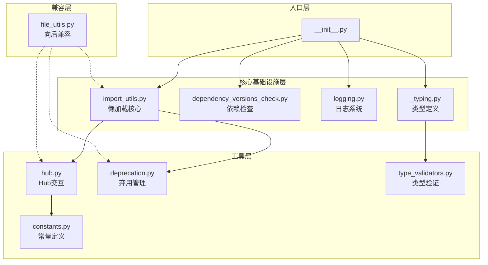
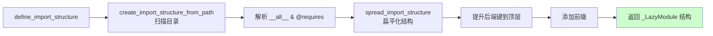
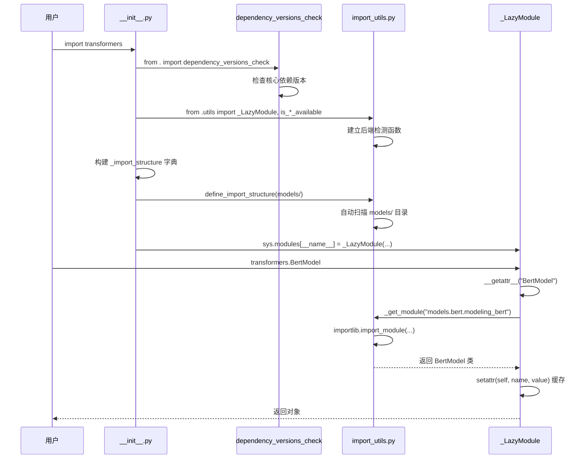

# Hugging Face Transformers 核心基础设施深度分析

> 分析版本：Transformers v5.8.0.dev0
> 分析范围：懒加载机制、依赖检测、日志系统、Hub 交互、弃用管理、类型系统

---

## 目录

1. [懒加载核心 — import_utils.py](#1-懒加载核心--import_utilspy)
2. [入口懒加载 — __init__.py](#2-入口懒加载----__init__py)
3. [依赖版本检查 — dependency_versions_check.py](#3-依赖版本检查--dependency_versions_checkpy)
4. [依赖版本表 — dependency_versions_table.py](#4-依赖版本表--dependency_versions_tablepy)
5. [日志系统 — logging.py](#5-日志系统--loggingpy)
6. [Hub 交互 — hub.py](#6-hub-交互--hubpy)
7. [弃用管理 — deprecation.py](#7-弃用管理--deprecationpy)
8. [类型定义 — _typing.py](#8-类型定义--_typingpy)
9. [类型验证器 — type_validators.py](#9-类型验证器--type_validatorspy)
10. [常量定义 — constants.py](#10-常量定义--constantspy)
11. [文件工具 — file_utils.py](#11-文件工具--file_utilspy)
12. [模块间关系总览](#12-模块间关系总览)

---

## 模块架构总览



---

## 1. 懒加载核心 — import_utils.py

**文件路径**: `src/transformers/utils/import_utils.py`（约 3064 行）

### 模块职责

这是 Transformers 项目中**最核心的基础设施文件**，实现了三大关键能力：

1. **可选依赖检测** — 检测 60+ 个可选包的安装状态和版本
2. **懒加载模块系统** — `_LazyModule` 类实现按需导入，避免 `import transformers` 时加载所有后端
3. **导入结构自动生成** — 从源码文件中自动解析 `__all__` 和 `@requires` 装饰器，构建导入映射

### 核心类/函数

#### 1.1 `_is_package_available` — 包检测原语

```python
def _is_package_available(pkg_name: str, return_version: bool = False) -> tuple[bool, str]:
    spec = importlib.util.find_spec(pkg_name)       # 不实际导入，仅查找模块规格
    package_exists = spec is not None
    package_version = "N/A"
    if package_exists and return_version:
        # importlib.metadata 使用分发包名，可能与导入名不同（如 PIL → pillow）
        distributions = PACKAGE_DISTRIBUTION_MAPPING[pkg_name]
        normalized_pkg_name = pkg_name.replace("_", "-")  # PEP 503 规范
        # 优先匹配规范化名称，再匹配原始名称，最后取第一个
        ...
        package_version = importlib.metadata.version(distribution_name)
    return (package_exists, package_version) if return_version else (package_exists, None)
```

**设计要点**：
- 使用 `importlib.util.find_spec` 而非 `importlib.import_module`，避免真正加载模块
- 通过 `PACKAGE_DISTRIBUTION_MAPPING`（`importlib.metadata.packages_distributions()`）解决导入名与分发包名不一致的问题
- PEP 503 规范：下划线与连字符等价

#### 1.2 `is_torch_available` 等 — 带版本约束的检测函数

```python
@lru_cache
def is_torch_available() -> bool:
    is_available, torch_version = _is_package_available("torch", return_version=True)
    parsed_version = version.parse(torch_version)
    if is_available and parsed_version < version.parse("2.4.0"):
        logger.warning_once(f"Disabling PyTorch because PyTorch >= 2.4 is required but found {torch_version}")
    return is_available and parsed_version >= version.parse("2.4.0")
```

**设计要点**：
- 所有检测函数均使用 `@lru_cache` 缓存结果，避免重复检测
- Torch 最低版本要求 2.4.0，低于此版本会发出警告并视为不可用
- 特殊处理：`is_torch_hpu_available` 中包含对 Habana Gaudi 的 monkey-patch（修补 `torch.gather`、`torch.scatter` 等的 int64 bug）

#### 1.3 `_LazyModule` — 懒加载模块核心类

```python
class _LazyModule(ModuleType):
    def __init__(
        self,
        name: str,
        module_file: str,
        import_structure: IMPORT_STRUCTURE_T,       # {frozenset(backends): {module_path: {object_names}}}
        module_spec: ModuleSpec | None = None,
        extra_objects: dict | None = None,
        explicit_import_shortcut: dict | None = None,
    ):
```

**导入结构类型定义**：
```python
BACKENDS_T = frozenset[str]                        # 后端集合，如 frozenset({"torch", "tokenizers"})
IMPORT_STRUCTURE_T = dict[BACKENDS_T, dict[str, set[str]]]  # {后端集合: {模块路径: {对象名集合}}}
```

**`__getattr__` 核心流程**（简化）：

```mermaid
flowchart TD
    A[用户访问<br/>transformers.BertModel] --> B[_LazyModule.__getattr__<br/>"BertModel"]
    B --> C{检查 _objects?}
    C -->|是| D[返回缓存对象]
    C -->|否| E{检查 _object_missing_backend?}
    E -->|是| F[创建 Placeholder<br/>DummyObject 元类]
    F --> G[返回占位类]
    E -->|否| H{检查 _class_to_module?}
    H -->|是| I[调用 _get_module()<br/>真正导入模块]
    I --> J[getattr(module, name)<br/>获取实际对象]
    H -->|否| K{检查 _modules?}
    K -->|是| L[返回子模块]
    K -->|否| M[抛出 AttributeError]
    J --> N[setattr(self, name, value)<br/>缓存结果]
    N --> O[返回对象]
    
    style F fill:#ffcccc
    style O fill:#ccffcc
```

**DummyObject 元类**：当对象缺少后端时，创建一个占位类，任何属性访问都会触发 `requires_backends` 抛出友好的错误信息：

```python
class DummyObject(type):
    is_dummy = True
    def __getattribute__(cls, key):
        if key.startswith("_") or key in ("is_dummy", "mro", "call"):
            return super().__getattribute__(key)
        requires_backends(cls, cls._backends)  # 抛出 ImportError，附带安装提示
```

#### 1.4 `define_import_structure` — 自动构建导入结构

```python
@lru_cache
def define_import_structure(module_path: str, prefix: str | None = None) -> IMPORT_STRUCTURE_T:
    import_structure = create_import_structure_from_path(module_path)  # 从文件系统解析
    spread_dict = spread_import_structure(import_structure)            # 扁平化，将后端约束提升到顶层
    ...
```

**三阶段流程**：



1. **`create_import_structure_from_path`**：扫描目录，解析每个 `.py` 文件的 `__all__` 和 `@requires` 装饰器
2. **`spread_import_structure`**：将嵌套结构扁平化，将 `frozenset(后端)` 键提升到顶层
3. **`define_import_structure`**：添加前缀，返回 `_LazyModule` 可消化的结构

**文件默认后端规则**（`BASE_FILE_REQUIREMENTS`）：
- `modeling_*.py` → 需要 `torch`
- `tokenization_*_fast.py` → 需要 `tokenizers`
- `image_processing_*.py`（含 TorchvisionBackend）→ 需要 `vision` + `torch` + `torchvision`
- `image_processing_*.py` → 需要 `vision`

#### 1.5 `Backend` 类 — 版本约束后端

```python
class Backend:
    def __init__(self, backend_requirement: str):
        # 解析 "torch>=2.4" → ("torch", ">=", "2.4")
        self.package_name, self.version_comparison, self.version = split_package_version(backend_requirement)

    def is_satisfied(self) -> bool:
        return VersionComparison.from_string(self.version_comparison).value(
            version.parse(self.get_installed_version()), version.parse(self.version)
        )
```

允许在导入结构中使用如 `frozenset({"torch>=2.4"})` 这样的版本约束后端。

#### 1.6 `@requires` 装饰器

```python
def requires(*, backends=()):
    # 对类：附加 __backends 元数据，不包装（保持 isinstance 可用）
    # 对函数：包装，调用前检查后端
```

### 设计原理

1. **零成本导入**：`import transformers` 不加载任何后端（PyTorch、TensorFlow 等），仅建立名称映射
2. **友好错误**：缺少依赖时给出精确的安装指令，而非 `ModuleNotFoundError`
3. **自动发现**：通过 `define_import_structure` 自动从源码解析导入结构，减少手动维护
4. **V5 兼容性**：TokenizerFast → Tokenizer 回退、ImageProcessorFast → ImageProcessor 回退

---

## 2. 入口懒加载 — __init__.py

### __init__.py 执行流程

```mermaid
flowchart TD
    A[import transformers] --> B[导入 dependency_versions_check<br/>检查核心依赖]
    B --> C[导入 import_utils<br/>建立后端检测]
    C --> D[构建 _import_structure<br/>基础导入]
    D --> E[try/except 模式<br/>动态扩展结构]
    E --> F{TYPE_CHECKING?}
    F -->|是| G[直接导入所有符号<br/>用于IDE/mypy]
    F -->|否| H[define_import_structure<br/>扫描 models/ 目录]
    H --> I[合并导入结构]
    I --> J[创建 _LazyModule 实例]
    K[_create_module_alias<br/>V5兼容性]
    J --> L[sys.modules[__name__] = _LazyModule]
    
    style L fill:#ccffcc
```

**文件路径**: `src/transformers/__init__.py`（约 852 行）

### 模块职责

作为包的入口点，协调所有懒加载逻辑，是用户执行 `import transformers` 时首先执行的代码。

### 核心代码流程

#### 2.1 构建导入结构

```python
# 1. 定义基础导入结构（不依赖任何后端的对象）
_import_structure = {
    "configuration_utils": ["PreTrainedConfig", "PretrainedConfig"],
    "tokenization_utils_base": ["AddedToken", "BatchEncoding", ...],
    "pipelines": ["Pipeline", "pipeline", ...],
    ...
}

# 2. 根据后端可用性动态扩展
try:
    if not is_tokenizers_available():
        raise OptionalDependencyNotAvailable()
except OptionalDependencyNotAvailable:
    # 加载 dummy 对象，占位
    from .utils import dummy_tokenizers_objects
    _import_structure["utils.dummy_tokenizers_objects"] = [...]
else:
    # 真正的导入结构
    _import_structure["tokenization_utils_tokenizers"] = ["PreTrainedTokenizerFast", "TokenizersBackend"]
```

**关键设计**：使用 `try/except OptionalDependencyNotAvailable` 模式，而非 `if/else`，确保异常路径也能被测试覆盖。

#### 2.2 TYPE_CHECKING 分支

```python
if TYPE_CHECKING:
    # 静态类型检查时，直接导入所有符号
    from .modeling_utils import PreTrainedModel as PreTrainedModel
    from .models import *
    ...
else:
    # 运行时，构建懒加载模块
    _import_structure = {k: set(v) for k, v in _import_structure.items()}
    import_structure = define_import_structure(Path(__file__).parent / "models", prefix="models")
    import_structure[frozenset({})].update(_import_structure)

    sys.modules[__name__] = _LazyModule(
        __name__, globals()["__file__"], import_structure,
        module_spec=__spec__,
        extra_objects={"__version__": __version__},
    )
```

**设计要点**：
- `TYPE_CHECKING` 分支让 IDE 和 mypy 能正确识别所有符号
- 运行时将 `transformers` 模块替换为 `_LazyModule` 实例
- `define_import_structure` 自动扫描 `models/` 目录，合并到导入结构中

#### 2.3 模块别名系统

```python
def _create_module_alias(alias: str, target: str) -> None:
    module = types.ModuleType(alias)
    module.__getattr__ = lambda name: getattr(importlib.import_module(target, __name__), name)
    sys.modules[alias] = module

# V5 重命名兼容
_create_module_alias(f"{__name__}.tokenization_utils_fast", ".tokenization_utils_tokenizers")
_create_module_alias(f"{__name__}.tokenization_utils", ".tokenization_utils_sentencepiece")
_create_module_alias(f"{__name__}.image_processing_utils_fast", ".image_processing_backends")
```

为 V5 版本中重命名的模块创建别名，保持向后兼容。

#### 2.4 ImageProcessorFast 兼容

```python
for _proc_file in sorted((Path(__file__).parent / "models").rglob("image_processing_*.py")):
    _create_module_alias(f"{__name__}.models.{_model}.{_module}_fast", _target)
    # 同时映射 XImageProcessorFast → XImageProcessor，发出弃用警告
```

### 与其他模块的关系

- 依赖 `import_utils.py` 的 `_LazyModule`、`define_import_structure`、`OptionalDependencyNotAvailable`
- 依赖 `dependency_versions_check.py` 进行版本检查
- 依赖 `utils/logging.py` 提供日志功能
- 依赖 `utils/` 下各种 `dummy_*_objects.py` 提供占位对象

---

## 3. 依赖版本检查 — dependency_versions_check.py

**文件路径**: `src/transformers/dependency_versions_check.py`（约 62 行）

### 模块职责

在 `transformers` 包导入时**自动执行**，检查核心依赖的版本是否满足最低要求。

### 核心代码

```python
from .dependency_versions_table import deps
from .utils.versions import require_version, require_version_core

pkgs_to_check_at_runtime = [
    "python", "tqdm", "regex", "packaging", "filelock",
    "numpy", "tokenizers", "huggingface-hub", "safetensors",
    "accelerate", "pyyaml",
]

for pkg in pkgs_to_check_at_runtime:
    if pkg in deps:
        if pkg == "tokenizers":
            if not is_tokenizers_available():
                continue  # 可选依赖，未安装则跳过
        elif pkg == "accelerate":
            if not is_accelerate_available():
                continue
        require_version_core(deps[pkg])  # 检查版本约束
```

### 设计原理

1. **导入时检查**：作为 `__init__.py` 的第一个导入（`from . import dependency_versions_check`），确保版本不兼容问题尽早暴露
2. **核心 vs 可选**：`python`、`tqdm` 等是核心依赖（必须满足），`tokenizers`、`accelerate` 是可选依赖（仅安装时检查）
3. **顺序敏感**：注释明确指出 `tqdm` 必须在 `tokenizers` 之前检查

### 与其他模块的关系

- 读取 `dependency_versions_table.py` 的版本约束
- 调用 `utils/versions.py` 的 `require_version_core` 执行实际比较
- 调用 `import_utils.py` 的 `is_tokenizers_available` / `is_accelerate_available` 判断可选依赖

---

## 4. 依赖版本表 — dependency_versions_table.py

**文件路径**: `src/transformers/dependency_versions_table.py`（约 95 行）

### 模块职责

集中定义所有依赖的版本约束，作为**唯一真相来源**（Single Source of Truth）。

### 核心结构

```python
deps = {
    "Pillow": "Pillow>=10.0.1,<=15.0",
    "accelerate": "accelerate>=1.1.0",
    "huggingface-hub": "huggingface-hub>=1.5.0,<2.0",
    "numpy": "numpy>=1.17",
    "python": "python>=3.10.0",
    "safetensors": "safetensors>=0.4.3",
    "torch": "torch>=2.4",
    "tokenizers": "tokenizers>=0.22.0,<=0.23.0",
    ...
}
```

### 设计原理

1. **自动生成**：文件头注释说明此文件由 `setup.py` 中的 `_deps` 字典自动生成，通过 `make fix-repo` 更新
2. **pip 风格约束**：使用 pip 标准的版本约束语法（`>=`、`<=`、`!=` 等）
3. **分类覆盖**：包含核心依赖、测试依赖、文档依赖、可选后端依赖

### 与其他模块的关系

- 被 `dependency_versions_check.py` 读取
- 与 `setup.py` 中的 `_deps` 保持同步
- `import_utils.py` 中的最低版本常量（如 `ACCELERATE_MIN_VERSION = "1.1.0"`）应与此表一致

---

## 5. 日志系统 — logging.py

**文件路径**: `src/transformers/utils/logging.py`（约 441 行）

### 模块职责

提供统一的日志系统，基于 Python 标准 `logging` 模块扩展，增加了进度条控制、一次性警告、建议警告等功能。

### 核心类/函数

#### 5.1 日志配置

```python
log_levels = {
    "detail": logging.DEBUG,   # 额外级别：显示文件名和行号
    "debug": logging.DEBUG,
    "info": logging.INFO,
    "warning": logging.WARNING,
    "error": logging.ERROR,
    "critical": logging.CRITICAL,
}

_default_log_level = logging.WARNING  # 默认只显示 WARNING 及以上
```

#### 5.2 `get_logger` — 获取日志器

```python
def get_logger(name: str | None = None) -> TransformersLogger:
    if name is None:
        name = _get_library_name()  # "transformers"
    _configure_library_root_logger()
    return logging.getLogger(name)
```

#### 5.3 `_configure_library_root_logger` — 初始化根日志器

```python
def _configure_library_root_logger() -> None:
    with _lock:  # 线程安全
        if _default_handler:
            return  # 已配置，跳过
        _default_handler = logging.StreamHandler()  # 输出到 stderr
        library_root_logger.addHandler(_default_handler)
        library_root_logger.setLevel(_get_default_logging_level())

        # 默认格式：[transformers] %(message)s
        logging_format = f"[{lib_name}] %(message)s"

        # detail 模式：显示级别、文件名、行号、时间
        if os.getenv("TRANSFORMERS_VERBOSITY") == "detail":
            logging_format = "%(levelname)s [%(name)s:%(lineno)s] %(asctime)s %(message)s"

        # CI 环境：启用传播（propagate=True），让根 logger 也能捕获
        library_root_logger.propagate = is_ci
```

**环境变量控制**：
- `TRANSFORMERS_VERBOSITY`：设置日志级别（detail/debug/info/warning/error/critical）
- `TRANSFORMERS_NO_ADVISORY_WARNINGS`：设为 1 时抑制建议性警告

#### 5.4 扩展方法 — monkey-patch logging.Logger

```python
# 建议性警告：可通过环境变量全局关闭
def warning_advice(self, *args, **kwargs):
    if os.getenv("TRANSFORMERS_NO_ADVISORY_WARNINGS"):
        return
    self.warning(*args, **kwargs)
logging.Logger.warning_advice = warning_advice

# 一次性警告：相同消息只输出一次（基于 lru_cache）
@functools.lru_cache(None)
def warning_once(self, *args, **kwargs):
    self.warning(*args, **kwargs)
logging.Logger.warning_once = warning_once

# 一次性信息
@functools.lru_cache(None)
def info_once(self, *args, **kwargs):
    self.info(*args, **kwargs)
logging.Logger.info_once = info_once
```

**设计要点**：通过 monkey-patch 将自定义方法注入 `logging.Logger`，使得所有通过 `get_logger()` 获取的日志器都自动拥有这些方法。`warning_once` 使用 `lru_cache(None)` 实现消息去重。

#### 5.5 tqdm 进度条集成

```python
class _tqdm_cls:
    def __call__(self, *args, **kwargs):
        factory = tqdm_lib.tqdm if _tqdm_active else EmptyTqdm
        if _tqdm_hook is not None:
            return _tqdm_hook(factory, args, kwargs)
        return factory(*args, **kwargs)

tqdm = _tqdm_cls()
```

- `_tqdm_active`：与 `huggingface_hub` 的进度条设置同步
- `EmptyTqdm`：进度条禁用时的空实现
- `set_tqdm_hook`：允许自定义 tqdm 创建逻辑

### 与其他模块的关系

- 被 `import_utils.py`、`hub.py`、`__init__.py` 等几乎所有模块使用
- `_typing.py` 定义了 `TransformersLogger` Protocol，与 `get_logger` 返回类型对应
- 与 `huggingface_hub` 的进度条设置联动

---

## 6. Hub 交互 — hub.py

**文件路径**: `src/transformers/utils/hub.py`（约 949 行）

### 模块职责

封装与 Hugging Face Hub 的所有交互逻辑，包括文件下载/缓存、模型推送、仓库操作等。

### 核心类/函数

#### 6.1 `cached_file` / `cached_files` — 文件下载与缓存

```python
def cached_file(
    path_or_repo_id: str | os.PathLike,
    filename: str,
    **kwargs,
) -> str | None:
    file = cached_files(path_or_repo_id=path_or_repo_id, filenames=[filename], **kwargs)
    return file[0] if file is not None else file
```

**`cached_files` 核心流程**：

```
1. 离线模式检查 → 强制 local_files_only=True
2. 本地目录检查 → 如果是目录，直接拼接路径
3. 缓存命中检查 → try_to_load_from_cache（使用 _commit_hash）
4. 下载文件 → hf_hub_download（单文件）或 snapshot_download（多文件）
5. 异常处理 → 分级处理各种错误：
   - RepositoryNotFoundError → 友好提示
   - GatedRepoError → 提示申请访问权限
   - PermissionError → 提示缓存目录权限问题
   - 网络错误 → 尝试回退到缓存
6. 返回解析后的文件路径
```

**设计要点**：
- `_raise_exceptions_for_*` 系列参数允许调用方控制异常行为（静默 vs 抛出）
- `_commit_hash` 参数支持链式调用时复用 commit hash，避免重复 HEAD 请求
- 异常处理层次分明：不可恢复错误直接抛出，可恢复错误尝试回退到缓存

#### 6.2 `PushToHubMixin` — 推送混入类

```python
class PushToHubMixin:
    def push_to_hub(self, repo_id, *, commit_message=None, private=None,
                    token=None, revision=None, create_pr=False, ...):
        repo_id = create_repo(repo_id, private=private, token=token, exist_ok=True).repo_id
        model_card = create_and_tag_model_card(repo_id, tags, token=token)
        with tempfile.TemporaryDirectory() as tmp_dir:
            self.save_pretrained(tmp_dir, max_shard_size=max_shard_size)
            model_card.save(os.path.join(tmp_dir, "README.md"))
            return self._upload_modified_files(tmp_dir, repo_id, ...)
```

**流程**：创建仓库 → 加载/创建模型卡片 → 保存到临时目录 → 上传修改的文件

#### 6.3 `http_user_agent` — 用户代理构建

```python
def http_user_agent(user_agent=None) -> str:
    ua = f"transformers/{__version__}; python/{sys.version.split()[0]}; session_id/{SESSION_ID}"
    if is_torch_available():
        ua += f"; torch/{get_torch_version()}"
    if constants.HF_HUB_DISABLE_TELEMETRY:
        return ua + "; telemetry/off"
    ...
```

收集运行环境信息用于遥测，尊重 `HF_HUB_DISABLE_TELEMETRY` 设置。

#### 6.4 `PushInProgress` — 异步推送追踪

```python
class PushInProgress:
    def __init__(self, jobs=None):
        self.jobs = [] if jobs is None else jobs
    def is_done(self):
        return all(job.done() for job in self.jobs)
    def cancel(self):
        self.jobs = [job for job in self.jobs if not (job.cancel() or job.done())]
```

使用 `concurrent.futures.Future` 追踪多个并行上传任务。

### 与其他模块的关系

- 依赖 `huggingface_hub` 库的核心功能（`hf_hub_download`、`snapshot_download` 等）
- 依赖 `import_utils.py` 的环境检测函数
- 依赖 `logging.py` 的日志功能
- 被 `modeling_utils.py`、`configuration_utils.py`、`tokenization_utils_base.py` 等调用

---

## 7. 弃用管理 — deprecation.py

**文件路径**: `src/transformers/utils/deprecation.py`（约 175 行）

### 模块职责

提供优雅的 API 弃用机制，支持参数重命名、版本感知的警告/错误升级。

### 核心函数

#### `deprecate_kwarg` — 参数弃用装饰器

```python
def deprecate_kwarg(
    old_name: str,              # 旧参数名
    version: str,               # 弃用版本
    new_name: str | None = None,  # 新参数名（可选）
    warn_if_greater_or_equal_version: bool = False,
    raise_if_greater_or_equal_version: bool = False,
    raise_if_both_names: bool = False,
    additional_message: str | None = None,
):
```

**行为矩阵**：

| 场景 | 默认行为 |
|------|---------|
| 仅传旧参数名，有新名 | 警告 + 自动映射到新名 |
| 仅传旧参数名，无新名 | 警告 |
| 同时传旧名和新名 | 默认警告（`raise_if_both_names=True` 时抛异常） |
| 当前版本 ≥ 弃用版本 | 警告变为"已移除"措辞 |

**Action 枚举**：

```python
class Action(ExplicitEnum):
    NONE = "none"             # 不做任何事
    NOTIFY = "notify"         # 通知（版本未到时显示，版本已到时可配置隐藏）
    NOTIFY_ALWAYS = "notify_always"  # 始终通知
    RAISE = "raise"           # 抛出 ValueError
```

**torch.compile 安全**：

```python
elif minimum_action in (Action.NOTIFY, Action.NOTIFY_ALWAYS) and not is_torchdynamo_compiling():
    warnings.warn(message, FutureWarning, stacklevel=2)
```

在 `torch.compile` 编译期间不发出警告，避免图断裂。

**使用示例**：

```python
@deprecate_kwarg("reduce_labels", new_name="do_reduce_labels", version="6.0.0")
def my_function(do_reduce_labels):
    ...

@deprecate_kwarg("max_size", version="6.0.0")
def my_function(max_size):
    ...
```

### 设计原理

1. **渐进式弃用**：先警告，再升级为错误，最终移除
2. **版本感知**：根据当前版本自动调整行为（"将在 X 版移除" vs "已从 X 版移除"）
3. **编译安全**：不破坏 `torch.compile` 的图构建
4. **使用 FutureWarning**：而非 DeprecationWarning（后者默认被 Python 抑制）

### 与其他模块的关系

- 依赖 `import_utils.py` 的 `is_torchdynamo_compiling`
- 依赖 `__version__` 判断当前版本
- 依赖 `utils/generic.py` 的 `ExplicitEnum`

---

## 8. 类型定义 — _typing.py

**文件路径**: `src/transformers/_typing.py`（约 187 行）

### 模块职责

定义跨库共享的类型别名和 Protocol，解决循环导入问题，为类型检查器提供接口定义。

### 核心类型

#### 8.1 `TransformersLogger` Protocol

```python
class TransformersLogger(Protocol):
    name: str
    level: int
    # ... 标准 Logger 方法 ...
    def warning(self, msg: object, *args: object, **kwargs: object) -> None: ...
    def error(self, msg: object, *args: object, **kwargs: object) -> None: ...
    # Transformers 特有方法
    def warning_advice(self, msg: object, *args: object, **kwargs: object) -> None: ...
    def warning_once(self, msg: object, *args: object, **kwargs: object) -> None: ...
    def info_once(self, msg: object, *args: object, **kwargs: object) -> None: ...
```

**设计要点**：使用 `Protocol` 而非继承 `logging.Logger`，因为 `logging.py` 通过 monkey-patch 添加方法，类型检查器无法识别。Protocol 声明了所有方法签名，使 `get_logger()` 的返回值类型安全。

#### 8.2 `GenerativePreTrainedModel` Protocol

```python
class GenerativePreTrainedModel(Protocol):
    config: Any
    device: torch.device
    dtype: torch.dtype
    main_input_name: str
    _cache: Cache
    generation_config: Any
    def forward(self, *args, **kwargs) -> Any: ...
    def can_generate(self) -> bool: ...
    def get_encoder(self) -> Any: ...
    ...
```

**设计要点**：`GenerationMixin` 被混入到 `PreTrainedModel` 子类中，但 mixin 中的 `self.xxx` 访问对类型检查器不可见。此 Protocol 声明了 mixin 依赖的所有属性和方法，帮助 `ty` 类型检查器解析。

#### 8.3 辅助类型别名

```python
Level: TypeAlias = int
ExcInfo: TypeAlias = None | bool | BaseException | tuple[type[BaseException], BaseException, object]
DeviceMeshLike: TypeAlias = Any  # PyTorch 的 device_mesh 类型不稳定
```

#### 8.4 其他 Protocol

- `PeftConfigLike`：PEFT 配置的协议接口
- `WhisperGenerationConfigLike`：Whisper 专用生成配置接口
- `StringValuedEnumLike`：字符串值枚举的协议接口

### 设计原理

1. **打破循环导入**：`_typing.py` 放在包顶层（`src/transformers/_typing.py`），避免 `utils/` 和 `models/` 之间的循环依赖
2. **Protocol 模式**：使用结构化子类型（鸭子类型的类型安全版本），不要求实际继承
3. **TYPE_CHECKING 守卫**：`torch` 和 `Cache` 等重量级导入仅在类型检查时执行

### 与其他模块的关系

- `logging.py` 导入 `TransformersLogger` 作为 `get_logger` 的返回类型
- `GenerationMixin` 使用 `GenerativePreTrainedModel` 进行类型标注
- PEFT 集成代码使用 `PeftConfigLike`

---

## 9. 类型验证器 — type_validators.py

**文件路径**: `src/transformers/utils/type_validators.py`（约 251 行）

### 模块职责

为配置类（`PretrainedConfig`、`ProcessingKwargs` 等）的参数提供运行时验证函数，通常与 `huggingface_hub.dataclasses.as_validated_field` 配合使用。

### 核心验证器

| 验证器 | 用途 |
|--------|------|
| `positive_int` | 验证非负整数 |
| `positive_any_number` | 验证非负整数或浮点数 |
| `padding_validator` | 验证 padding 参数（bool/str/PaddingStrategy） |
| `truncation_validator` | 验证 truncation 参数 |
| `image_size_validator` | 验证图像尺寸字典的键名 |
| `device_validator` | 验证设备字符串（cpu/cuda/xla/xpu/mps/meta） |
| `resampling_validator` | 验证重采样方法 |
| `video_metadata_validator` | 验证视频元数据字典的键名 |
| `tensor_type_validator` | 验证张量类型（pt/np/mlx） |
| `probability` | 验证 [0, 1] 范围内的概率值 |
| `interval(min, max)` | 参数化验证器：验证值在指定区间内 |
| `is_divisible_by(divisor)` | 参数化验证器：验证值可被整除 |
| `activation_fn_key` | 验证激活函数名称（在 ACT2FN 中） |
| `tensor_shape(shape)` | 参数化验证器：验证张量形状 |

### 关键设计模式

#### 参数化验证器

```python
def interval(min=None, max=None, exclude_min=False, exclude_max=False) -> Callable:
    @as_validated_field
    def _inner(value: int | float):
        min_valid = min <= value if not exclude_min else min < value
        max_valid = value <= max if not exclude_max else value < max
        if not (min_valid and max_valid):
            raise ValueError(error_message.format(value=value))
    return _inner
```

使用高阶函数模式，允许验证器接受配置参数。

#### `@as_validated_field` 装饰器

来自 `huggingface_hub.dataclasses`，将验证函数标记为"验证字段"，使其能在 dataclass 定义中直接使用。

### 与其他模块的关系

- 被 `ProcessingKwargs`、`PretrainedConfig` 等配置类使用
- 依赖 `import_utils.py` 的 `is_torch_available`、`is_vision_available`
- 依赖 `tokenization_utils_base.py` 的 `PaddingStrategy`、`TruncationStrategy`
- 依赖 `generic.py` 的 `TensorType`

---

## 10. 常量定义 — constants.py

**文件路径**: `src/transformers/utils/constants.py`（约 6 行）

### 模块职责

定义图像处理相关的标准化常量。

### 内容

```python
IMAGENET_DEFAULT_MEAN = [0.485, 0.456, 0.406]
IMAGENET_DEFAULT_STD = [0.229, 0.224, 0.225]
IMAGENET_STANDARD_MEAN = [0.5, 0.5, 0.5]
IMAGENET_STANDARD_STD = [0.5, 0.5, 0.5]
OPENAI_CLIP_MEAN = [0.48145466, 0.4578275, 0.40821073]
OPENAI_CLIP_STD = [0.26862954, 0.26130258, 0.27577711]
```

**三组标准化参数**：
1. **ImageNet Default**：来自 ImageNet 训练集的通道均值和标准差，用于大多数 TorchVision 预训练模型
2. **ImageNet Standard**：简单的 [0.5, 0.5, 0.5] 标准化，用于部分模型
3. **OpenAI CLIP**：CLIP 模型专用的标准化参数

### 与其他模块的关系

- 被 `utils/__init__.py` 导出
- 被各模型的 `image_processing_*.py` 文件引用
- 被其他 utils 模块间接使用

---

## 11. 文件工具 — file_utils.py

**文件路径**: `src/transformers/file_utils.py`（约 105 行）

### 模块职责

**纯粹的向后兼容层**。文件头注释明确写道：

> This module should not be update anymore and is only left for backward compatibility.

### 内容

```python
from .utils import (
    CLOUDFRONT_DISTRIB_PREFIX, CONFIG_NAME, DUMMY_INPUTS, DUMMY_MASK,
    ENV_VARS_TRUE_AND_AUTO_VALUES, ENV_VARS_TRUE_VALUES, FEATURE_EXTRACTOR_NAME,
    HF_MODULES_CACHE, MODEL_CARD_NAME, MULTIPLE_CHOICE_DUMMY_INPUTS,
    S3_BUCKET_PREFIX, SENTENCEPIECE_UNDERLINE, SPIECE_UNDERLINE,
    TRANSFORMERS_DYNAMIC_MODULE_NAME, WEIGHTS_INDEX_NAME, WEIGHTS_NAME,
    ContextManagers, DummyObject, EntryNotFoundError, ExplicitEnum,
    ModelOutput, PaddingStrategy, PushToHubMixin, RepositoryNotFoundError,
    RevisionNotFoundError, TensorType, _LazyModule,
    add_code_sample_docstrings, add_end_docstrings, add_start_docstrings,
    add_start_docstrings_to_model_forward, copy_func,
    define_sagemaker_information, get_torch_version, has_file,
    http_user_agent, is_apex_available, is_bs4_available, ...
    requires_backends, to_numpy, to_py_obj, torch_only_method,
)
```

将 `transformers.file_utils` 中的所有符号重新导出为从 `transformers.utils` 导入。

### 设计原理

1. **迁移路径**：V4 时代用户习惯 `from transformers.file_utils import ...`，V5 将这些工具移到 `transformers.utils` 下
2. **零成本**：仅是导入重导出，不增加任何逻辑
3. **渐进弃用**：保持旧导入路径可用，未来版本可添加 DeprecationWarning

### 与其他模块的关系

- 所有实际实现来自 `utils/` 子包
- 是 `utils/` 子包的"旧名称透传"

---

## 12. 模块间关系总览

### 依赖关系图

```
                    ┌─────────────────────┐
                    │   __init__.py       │
                    │  (入口/协调者)       │
                    └──────┬──────────────┘
                           │
           ┌───────────────┼───────────────┐
           │               │               │
           ▼               ▼               ▼
┌──────────────────┐ ┌──────────────┐ ┌──────────────────┐
│dependency_versions│ │ import_utils │ │    logging.py    │
│   _check.py      │ │   (核心)     │ │   (日志系统)     │
└────────┬─────────┘ └──────┬───────┘ └──────────────────┘
         │                  │
         ▼                  │
┌──────────────────┐       │
│dependency_versions│       │
│   _table.py      │       │
└──────────────────┘       │
                           │
        ┌──────────────────┼──────────────────┐
        │                  │                  │
        ▼                  ▼                  ▼
┌──────────────┐  ┌──────────────┐  ┌──────────────────┐
│  hub.py      │  │deprecation.py│  │   _typing.py     │
│ (Hub 交互)   │  │ (弃用管理)   │  │  (类型定义)      │
└──────────────┘  └──────────────┘  └──────────────────┘
                                           │
                    ┌──────────────────────┤
                    │                      │
                    ▼                      ▼
          ┌──────────────────┐  ┌──────────────────┐
          │type_validators.py│  │  constants.py    │
          │ (类型验证器)     │  │  (常量定义)      │
          └──────────────────┘  └──────────────────┘

┌──────────────────┐
│  file_utils.py   │ ──→ 重新导出 utils/ 下的所有符号（向后兼容）
└──────────────────┘
```

### 关键交互流程

#### 流程 1：`import transformers` 的完整路径



#### 流程 2：缺少后端时的错误路径

```mermaid
flowchart TD
    A[用户访问<br/>BlipForConditionalGeneration] --> B[_LazyModule.__getattr__]
    B --> C{检查 _object_missing_backend?}
    C -->|是| D[创建 Placeholder<br/>metaclass=DummyObject]
    D --> E[设置 _backends=["torch"]]
    E --> F[返回 Placeholder 类]
    F --> G[用户尝试实例化<br/>Placeholder(...)]
    G --> H[DummyObject.__getattribute__拦截]
    H --> I[调用 requires_backends]
    I --> J[抛出 ImportError<br/>友好的安装提示]
    
    style J fill:#ffcccc
```

#### 流程 3：模型下载与缓存

```mermaid
flowchart TD
    A[PreTrainedModel.from_pretrained<br/>"bert-base-uncased"] --> B[cached_file<br/>"config.json"]
    B --> C[cached_files<br/>["config.json"]]
    C --> D{离线模式?}
    D -->|是| E[local_files_only=True]
    D -->|否| F{本地目录?}
    F -->|是| G[直接拼接路径]
    F -->|否| H{缓存命中?<br/>使用 _commit_hash}
    H -->|是| I[返回缓存文件]
    H -->|否| J[hf_hub_download / snapshot_download]
    J --> K{异常?}
    K -->|RepositoryNotFound| L[友好提示]
    K -->|GatedRepo| M[提示申请访问权限]
    K -->|PermissionError| N[提示缓存目录权限问题]
    K -->|网络错误| O[尝试回退到缓存]
    K -->|无| P[返回解析后的文件路径]
    E --> P
    G --> P
    
    style P fill:#ccffcc
    style L fill:#ffcccc
    style M fill:#ffcccc
    style N fill:#ffcccc
```

### 设计哲学总结

1. **零成本抽象**：`import transformers` 不加载任何后端，所有重量级导入延迟到实际使用时
2. **友好错误**：缺少依赖时给出精确的安装指令，而非晦涩的 `ModuleNotFoundError`
3. **自动发现**：通过 `define_import_structure` 自动从源码解析导入结构，减少手动维护负担
4. **渐进式弃用**：`deprecate_kwarg` 提供从警告到错误的平滑升级路径
5. **类型安全**：`_typing.py` 的 Protocol 模式在不引入循环依赖的前提下提供类型标注
6. **向后兼容**：`file_utils.py` 和模块别名系统确保旧代码继续工作
7. **缓存优先**：所有检测结果和导入结果都被缓存（`@lru_cache`），避免重复计算
