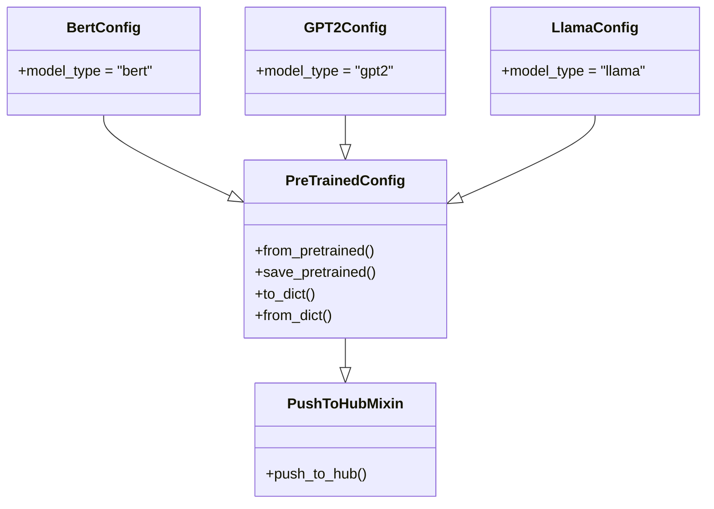

# 配置模块详解

本文件详细解析 Transformers 库中配置模块的实现原理和使用方法。

---

## 1. PreTrainedConfig 基类

`PreTrainedConfig` 是所有模型配置类的基类，定义在 [src/transformers/configuration_utils.py](file:///workspace/src/transformers/configuration_utils.py)。

### 1.1 核心特性

```python
@dataclass_transform(kw_only_default=True)
@strict(accept_kwargs=True)
@dataclass(repr=False)
class PreTrainedConfig(PushToHubMixin, RotaryEmbeddingConfigMixin):
    """
    所有配置类的基类，处理所有模型配置共有的参数
    以及加载/下载/保存配置的方法。
    """
```

### 1.2 主要类属性

配置类需要定义的类属性：

| 属性 | 说明 |
|------|------|
| `model_type` | 模型类型标识 |
| `keys_to_ignore_at_inference` | 推理时忽略的键 |
| `attribute_map` | 属性映射字典 |

### 1.3 常用配置属性

```python
# 通用属性
vocab_size: int          # 词汇表大小
hidden_size: int           # 隐藏层大小
num_attention_heads: int # 注意力头数
num_hidden_layers: int  # 隐藏层数

# 输出控制
output_hidden_states: bool = False
output_attentions: bool = False
return_dict: bool = True
```

---

## 2. 配置加载与保存

### 2.1 from_pretrained - 加载配置

```python
@classmethod
def from_pretrained(
    cls,
    pretrained_model_name_or_path,
    **kwargs
):
    """
    从预训练模型名称或路径加载配置
    """
```

**工作流程**：
1. 从 Hub 或本地路径加载 `config.json`
2. 解析 JSON 为字典
3. 根据 `model_type` 确定配置类
4. 创建配置实例

### 2.2 save_pretrained - 保存配置

```python
def save_pretrained(
    self,
    save_directory,
    **kwargs
):
    """
    保存配置到指定目录
    """
```

---

## 3. 配置类图



---

## 4. 配置使用示例

### 4.1 基本使用

```python
from transformers import AutoConfig, BertConfig

# 方法1: 使用 AutoConfig 自动加载
config = AutoConfig.from_pretrained("bert-base-uncased")

# 方法2: 直接使用特定配置类
config = BertConfig.from_pretrained("bert-base-uncased")

# 方法3: 手动创建配置
config = BertConfig(
    vocab_size=30522,
    hidden_size=768,
    num_hidden_layers=12,
    num_attention_heads=12,
)
```

### 4.2 修改配置

```python
# 修改配置参数
config.num_hidden_layers = 6
config.hidden_dropout_prob = 0.1

# 保存配置
config.save_pretrained("./my-config")
```

---

## 5. 配置与模型的关系

配置和模型的关系非常紧密：

```python
from transformers import AutoConfig, AutoModel

# 1. 加载配置
config = AutoConfig.from_pretrained("bert-base-uncased")

# 2. 可以修改配置
config.num_hidden_layers = 6

# 3. 使用修改后的配置创建模型
model = AutoModel.from_config(config)
```

---

## 6. 关键方法详解

### 6.1 to_dict() - 转换为字典

```python
def to_dict(self):
    """
    将配置对象转换为字典
    """
```

### 6.2 from_dict() - 从字典创建

```python
@classmethod
def from_dict(cls, config_dict, **kwargs):
    """
    从字典创建配置实例
    """
```

---

## 7. 配置文件格式

标准的 `config.json` 文件结构：

```json
{
  "model_type": "bert",
  "vocab_size": 30522,
  "hidden_size": 768,
  "num_hidden_layers": 12,
  "num_attention_heads": 12,
  "hidden_act": "gelu",
  "intermediate_size": 3072,
  "hidden_dropout_prob": 0.1,
  "attention_probs_dropout_prob": 0.1,
  "max_position_embeddings": 512,
  "type_vocab_size": 2,
  "initializer_range": 0.02,
  "layer_norm_eps": 1e-12
}
```
