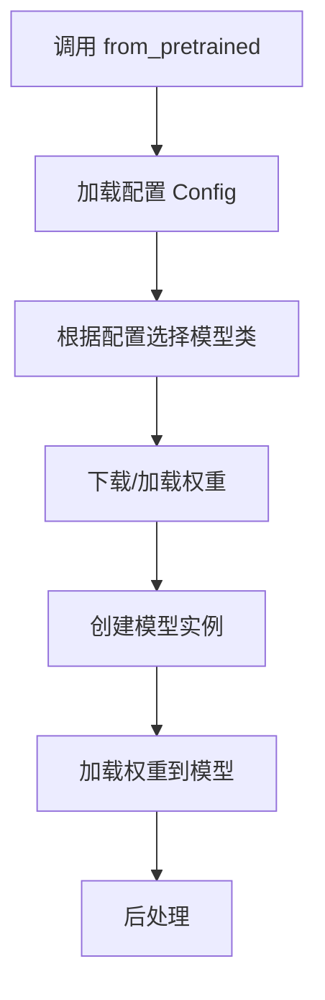
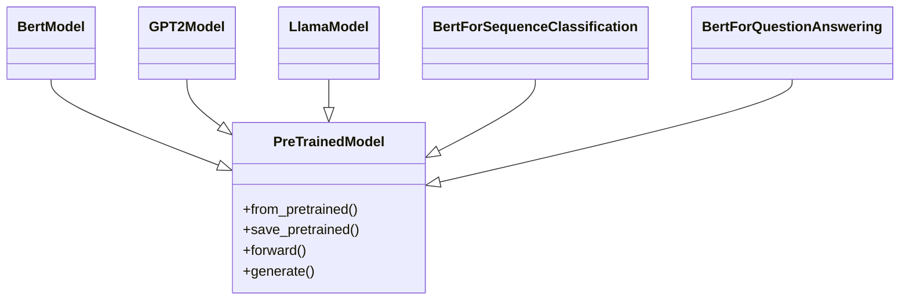

# 模型基类详解

本文件详细解析 `PreTrainedModel` 的设计与实现。

---

## 1. PreTrainedModel 概述

`PreTrainedModel` 是所有模型的基类，定义在 [src/transformers/modeling_utils.py](file:///workspace/src/transformers/modeling_utils.py)。

### 1.1 核心继承关系

```python
class PreTrainedModel(
    nn.Module,
    PushToHubMixin,
    GenerationMixin,
    PeftAdapterMixin
):
    """
    所有模型的基类，继承自 PyTorch 的 nn.Module
    """
```

---

## 2. 核心功能

### 2.1 from_pretrained - 模型加载

这是最常用的方法：

```python
@classmethod
def from_pretrained(
    cls,
    pretrained_model_name_or_path,
    *model_args,
    **kwargs
):
    """
    从预训练模型加载模型实例
    """
```

**加载流程**：


### 2.2 save_pretrained - 保存模型

```python
def save_pretrained(
    self,
    save_directory,
    **kwargs
):
    """
    保存模型和配置到指定目录
    """
```

---

## 3. 模型架构

### 3.1 forward - 前向传播

所有模型都需要实现的方法：

```python
@abstractmethod
def forward(
    self,
    *args,
    **kwargs
):
    """
    前向传播方法，必须由子类实现
    """
```

### 3.2 生成方法

通过 `GenerationMixin` 提供：

```python
def generate(
    self,
    inputs=None,
    **kwargs
):
    """
    文本生成方法
    """
```

---

## 4. 模型类层次结构



---

## 5. 模型加载配置参数

| 参数 | 说明 |
|------|------|
| `pretrained_model_name_or_path` | 模型名称或路径 |
| `config` | 配置对象或路径 |
| `cache_dir` | 缓存目录 |
| `from_tf` | 从 TensorFlow 加载 |
| `device_map` | 设备映射 |
| `torch_dtype` | 数据类型 |
| `low_cpu_mem_usage` | 低内存模式 |

---

## 6. 使用示例

### 6.1 基本使用

```python
from transformers import AutoModel, BertModel

# 1. 自动加载
model = AutoModel.from_pretrained("bert-base-uncased")

# 2. 指定类型加载
model = BertModel.from_pretrained("bert-base-uncased")

# 3. 从配置创建
from transformers import AutoConfig
config = AutoConfig.from_pretrained("bert-base-uncased")
model = AutoModel.from_config(config)
```

### 6.2 指定设备和精度

```python
import torch

# 使用 GPU
model = AutoModel.from_pretrained(
    "bert-base-uncased",
    device_map="auto"
)

# 使用半精度
model = AutoModel.from_pretrained(
    "bert-base-uncased",
    torch_dtype=torch.float16
)
```

---

## 7. 关键特性

### 7.1 权重加载机制

- 支持 safetensors 格式
- 支持分片权重
- 支持权重转换

### 7.2 量化支持

- 8-bit、4-bit 量化
- 多种量化后端

### 7.3 分布式支持

- Tensor Parallel
- Pipeline Parallel
- DeepSpeed
