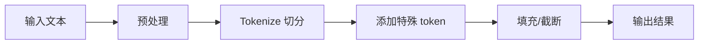

# 分词器基类详解

本文件详细解析 `PreTrainedTokenizerBase` 的设计与实现。

---

## 1. 分词器基类

`PreTrainedTokenizerBase` 是所有分词器的基类，定义在 [src/transformers/tokenization_utils_base.py](file:///workspace/src/transformers/tokenization_utils_base.py)。

---

## 2. 分词器架构

### 2.1 三种分词器后端

Transformers 支持多种分词器后端：

| 类型 | 说明 |
|------|------|
| **Python 后端 (PreTrainedTokenizer) | 纯 Python 实现 |
| **Tokenizers 后端 (PreTrainedTokenizerFast) | 基于 HuggingFace Tokenizers 库 |
| **SentencePiece 后端 | 基于 SentencePiece |

---

## 3. 核心方法

### 3.1 基本调用

```python
tokenizer(text,
    text_pair=None,
    add_special_tokens=True,
    padding=False,
    truncation=None,
    max_length=None,
    stride=0,
    return_tensors=None,
    **kwargs
):
    """
    分词主方法
    """
```

### 3.2 encode 方法

```python
def encode(
    self,
    text,
    text_pair=None,
    **kwargs
):
    """
    将文本编码为 token ids
    """
```

### 3.3 decode 方法

```python
def decode(
    self,
    token_ids,
    **kwargs
):
    """
    将 token ids 解码为文本
    """
```

### 3.4 tokenize 方法

```python
def tokenize(
    self,
    text,
    **kwargs
):
    """
    将文本切分为 tokens
    """
```

---

## 4. 分词流程



---

## 5. 特殊 tokens

```python
# 常见特殊 tokens
bos_token: str      # 序列开始
eos_token: str      # 序列结束
sep_token: str     # 分隔符
cls_token: str      # 分类 token
pad_token: str      # 填充 token
mask_token: str     # 掩码 token
unk_token: str       # 未知 token
```

---

## 6. BatchEncoding

分词器的输出类型：

```python
class BatchEncoding(UserDict):
    """
    分词器输出的封装类
    """
```

**主要属性：
- `input_ids`
- `attention_mask`
- `token_type_ids`

---

## 7. 使用示例

### 7.1 基本使用

```python
from transformers import AutoTokenizer

tokenizer = AutoTokenizer.from_pretrained("bert-base-uncased")

# 分词
encoding = tokenizer("Hello, world!")

# 输出
# {
#   'input_ids': [101, 7592, 1010, 2088, 999, 102],
#   'attention_mask': [1, 1, 1, 1, 1, 1]
# }
```

### 7.2 批量处理

```python
texts = ["Hello, world!", "How are you?"]

encoding = tokenizer(
    texts,
    padding=True,
    truncation=True,
    return_tensors="pt"
)
```

### 7.3 编码和解码

```python
# 编码
ids = tokenizer.encode("Hello, world!")

# 解码
text = tokenizer.decode(ids)
```

---

## 8. 分词器保存与加载

```python
# 保存
tokenizer.save_pretrained("./my-tokenizer")

# 加载
tokenizer = AutoTokenizer.from_pretrained("./my-tokenizer")
```
