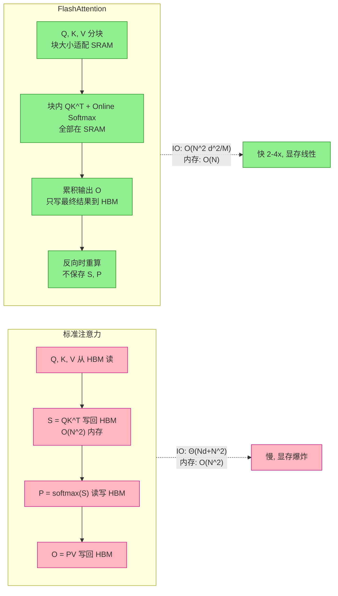
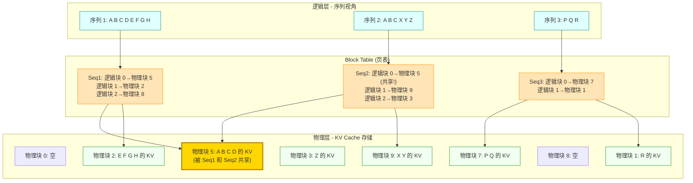
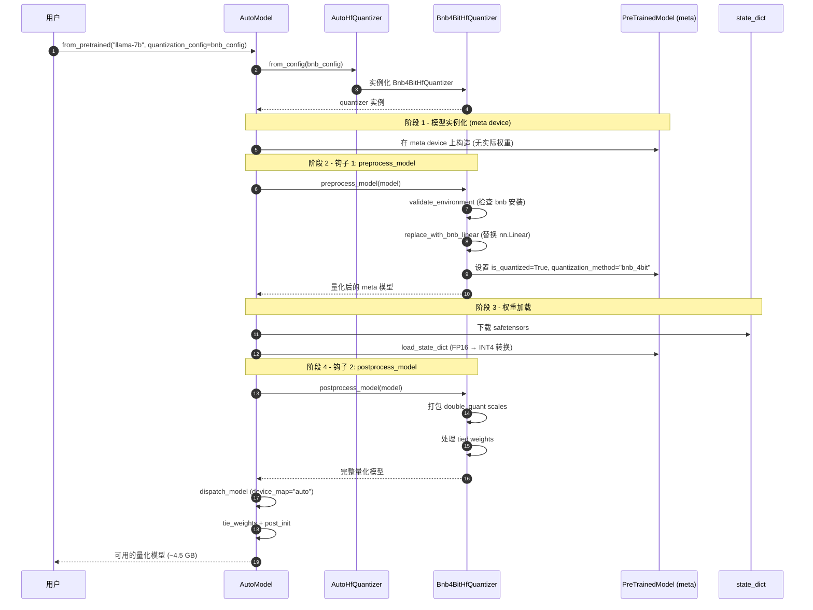
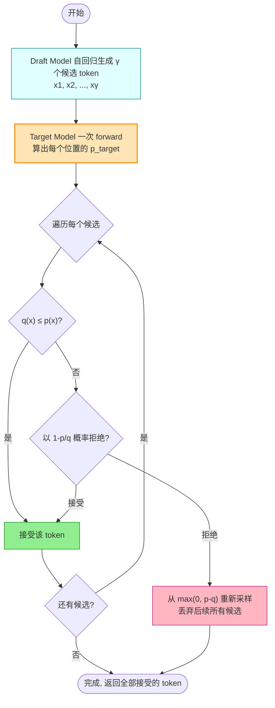
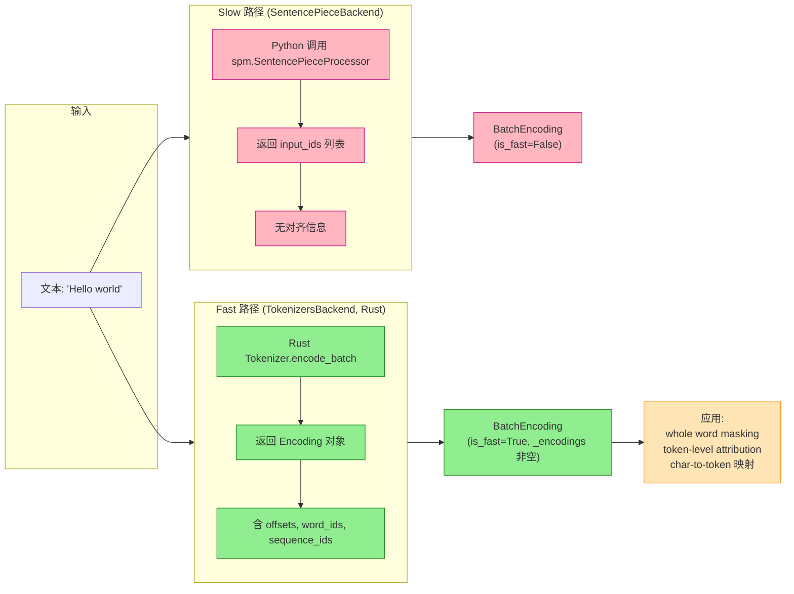
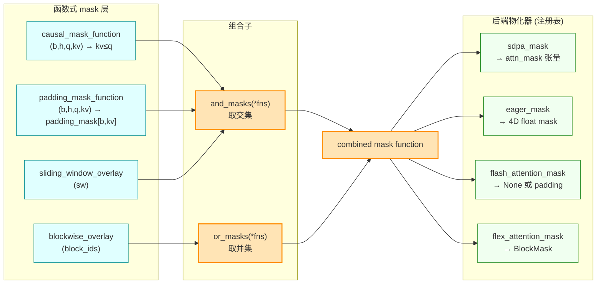

# 具体观：Transformers 的算法原理与极致工程

> **本篇定位**：第二维度——给读者一种"摸到细节"的具体观。
> 从算法原理、论文溯源、工程实现到可运行例子，把第一篇的"骨架"填上"血肉"。
> 行文采用"总-分-总"结构，配 8 张 Mermaid 图解、23 篇论文引用、每章末尾可运行代码示例。

---

## 总：把数十篇顶会论文织进同一个框架

如果用一句话概括 Transformers 的工程美学，那便是：**它把数十篇顶会论文的成果，以可组合的方式织进同一个框架**。

这不是夸张。让我们数一数 Transformers 内部集成了哪些论文的核心算法：

- **位置编码**：RoFormer（RoPE）、YaRN、LongRoPE、NTK-aware Scaling、Llama3 RoPE——5 篇
- **注意力后端**：FlashAttention-1/2/3、FlexAttention——4 篇
- **KV Cache 与服务**：PagedAttention/vLLM、KIVI（KV 量化）——2 篇
- **量化**：GPTQ、AWQ、SmoothQuant、bitsandbytes、HQQ——5 篇
- **解码策略**：Speculative Decoding、Contrastive Search、DoLa——3 篇
- **分布式训练**：Megatron-LM（TP）、DeepSpeed ZeRO、FSDP——3 篇
- **分词与数据**：SentencePiece、HuggingFace tokenizers、NEFTune、Liger Kernel——4 篇

合计 **26 篇论文**，且每一篇都不是"挂名"——它们的核心算法都真正被实现并可通过 config 开关启用。更重要的是，这些算法**互相组合**：你可以在同一个 Llama 模型上同时启用 FlashAttention-3 + YaRN 长上下文 + bnb 4bit 量化 + Speculative Decoding + FSDP 训练，且互不冲突。

本篇分八章展开。前五章聚焦"算法主题"（位置编码 / 注意力 / Cache / 量化 / 解码），后三章聚焦"工程主题"（分布式 / Tokenizer / 极致细节）。每一章都遵循"论文原理 → Transformers 实现 → 代码例子"的三段式。

下面进入"分"的部分。

---

## 分：八章展开算法与工程

### 第一章 旋转位置编码 RoPE 全家桶

#### 1.1 论文溯源

旋转位置编码（Rotary Position Embedding, RoPE）是现代大模型的"标配"位置编码方案。它的演化史可以串成一条主线：

| 论文 | 年份 | 核心贡献 |
|------|------|---------|
| **RoFormer**（Su et al.） | 2021 | 提出 RoPE，用旋转矩阵编码相对位置，支持序列外推 |
| **NTK-aware Scaling** | 2023 | 动态调整 base 频率，避免高频分量退化 |
| **YaRN**（Peng et al.） | 2023 | 引入 ramp 函数与 attention_factor，支持 4x-64x 扩展 |
| **LongRoPE**（Microsoft） | 2024 | 双套（short/long）factor，突破 2M tokens |
| **Llama3 RoPE** | 2024 | 按 low/high_freq_factor 分频段插值 |

#### 1.2 原理：旋转矩阵的复数表示

RoPE 的核心思想是：**用旋转矩阵把绝对位置信息"旋转"到 query/key 向量中，使得它们的内积自然反映相对位置**。

给定位置 $m$ 的 query 向量 $\mathbf{q} \in \mathbb{R}^d$，RoPE 把它分为 $d/2$ 个二维子空间，每个子空间应用一个旋转：

$$
\text{RoPE}(\mathbf{q}, m) = \begin{pmatrix} q_0 \cos(m\theta_0) - q_1 \sin(m\theta_0) \\ q_0 \sin(m\theta_0) + q_1 \cos(m\theta_0) \\ \vdots \end{pmatrix}, \quad \theta_i = \text{base}^{-2i/d}
$$

其中 base 默认为 10000。关键性质：$\langle \text{RoPE}(\mathbf{q}, m), \text{RoPE}(\mathbf{k}, n) \rangle$ 只依赖相对位置 $m - n$。

**为什么需要 scaling？** 当序列长度超过训练时的 `original_max_position_embeddings`，高频分量（$\theta_i$ 接近 1）会快速振荡导致注意力崩坏。各种 scaling 方法的本质都是"调整 $\theta_i$ 的分布"，让高频分量适度衰减、低频分量保持。

#### 1.3 Transformers 实现：统一抽象 7 种变体

Transformers 在 [modeling_rope_utils.py](file:///workspace/src/transformers/modeling_rope_utils.py) 中用**注册表 + 统一函数签名**抽象了 7 种 RoPE 变体：

```python
ROPE_INIT_FUNCTIONS = {
    "default": _compute_default_rope_parameters,           # 原始 RoPE
    "linear": _compute_linear_scaling_rope_parameters,     # 线性缩放
    "dynamic": _compute_dynamic_ntk_parameters,            # NTK-aware
    "yarn": _compute_yarn_parameters,                      # YaRN
    "longrope": _compute_longrope_parameters,              # LongRoPE
    "llama3": _compute_llama3_parameters,                  # Llama3
    "proportional": _compute_proportional_rope_parameters, # 比例缩放
}
```

每个函数遵循统一签名 `(config, device, seq_len, layer_type) -> (inv_freq, attention_factor)`，返回频率向量与注意力缩放因子。这让模型代码无需关心具体变体，只需调用 `ROPE_INIT_FUNCTIONS[config.rope_type](...)`。

此外，`RotaryEmbeddingConfigMixin`（[modeling_rope_utils.py:698](file:///workspace/src/transformers/modeling_rope_utils.py)）混入 `PreTrainedConfig`，负责：

- `convert_rope_params_to_dict`：把旧的 `rope_scaling` 格式转为新的 `rope_parameters` 字典
- `standardize_rope_params`：处理无 RoPE / 全局一套 / 按 layer_types 多套（hybrid 架构）三种情况
- `validate_rope` + `_validate_{default,linear,dynamic,yarn,...}_rope_parameters`：每种 rope_type 校验必需/可选键

#### 1.4 例子：Llama 8K → 32K 上下文扩展

```python
from transformers import AutoModelForCausalLM, AutoConfig

# 方式一: 用 YaRN 扩展上下文
config = AutoConfig.from_pretrained("meta-llama/Llama-2-7b-hf")
config.rope_scaling = {
    "rope_type": "yarn",
    "factor": 4.0,                          # 8K → 32K
    "original_max_position_embeddings": 8192,
}
config.max_position_embeddings = 32768

model = AutoModelForCausalLM.from_pretrained(
    "meta-llama/Llama-2-7b-hf",
    config=config,
    attn_implementation="flash_attention_2",
    torch_dtype="bfloat16",
)

# 方式二: 用 Llama3 分频段插值 (更新一代)
config.rope_scaling = {
    "rope_type": "llama3",
    "factor": 8.0,
    "low_freq_factor": 1.0,
    "high_freq_factor": 4.0,
    "original_max_position_embeddings": 8192,
}
```

**说明**：`rope_scaling` 配置一旦传入，`RotaryEmbeddingConfigMixin` 会自动标准化并校验，模型 forward 时通过 `ROPE_INIT_FUNCTIONS["yarn"]` 计算 `inv_freq`。**无需改任何模型代码**。

```mermaid
graph LR
    subgraph Theory["论文原理"]
        RoPE["RoPE 旋转矩阵<br/>复数表示"]
        NTK["NTK 动态频率"]
        YaRN["YaRN ramp 函数"]
        Long["LongRoPE 双 factor"]
        Llama3["Llama3 分频段"]
    end

    subgraph Abstraction["Transformers 统一抽象"]
        Registry["ROPE_INIT_FUNCTIONS<br/>注册表 (7 种)"]
        Signature["统一签名<br/>config, device, seq_len → inv_freq, attn_factor"]
        Mixin["RotaryEmbeddingConfigMixin<br/>标准化 + 校验"]
    end

    subgraph Models["模型代码"]
        Forward["RotaryEmbedding.forward"]
        Decorator["dynamic_rope_update 装饰器"]
    end

    Theory --> Abstraction
    Abstraction --> Models

    classDef theory fill:#E0FFFF,stroke:#008B8B
    classDef abs fill:#FFE4B5,stroke:#FF8C00,stroke-width:2px
    classDef model fill:#F0FFF0,stroke:#228B22
    class RoPE,NTK,YaRN,Long,Llama3 theory
    class Registry,Signature,Mixin abs
    class Forward,Decorator model
```



**图 1 说明**：RoPE 全家桶的统一抽象。上层是 5 篇论文的原理（青色），中层是 Transformers 的统一抽象（橙色，核心是注册表 + 统一签名 + ConfigMixin），下层是模型代码（绿色，只需调用 `forward` + 装饰器动态更新）。**新增一种 RoPE 变体只需在注册表加一项**，无需修改任何模型代码。

---

### 第二章 FlashAttention 系列——IO 感知的极致注意力

#### 2.1 论文溯源

FlashAttention 是近三年影响力最大的注意力优化工作，其演化分为三阶段：

| 论文 | 年份 | 会议 | 核心改进 |
|------|------|------|---------|
| **FlashAttention**（Dao et al.） | 2022 | NeurIPS | IO-aware exact attention，tiling + online softmax |
| **FlashAttention-2**（Dao） | 2023 | ICLR | 减少非 matmul FLOPs，更好的并行与工作划分 |
| **FlashAttention-3**（Shah et al.） | 2024 | NeurIPS | Hopper GPU 异步（warp specialization）+ FP8 |

#### 2.2 原理：从 IO 感知到硬件协同

**核心洞察**：注意力计算的瓶颈不在于 FLOPs（浮点运算量），而在于 HBM（高带宽内存）的读写次数（IO 次数）。

以 A100 GPU 为例：

| 内存类型 | 容量 | 带宽 | 延迟 |
|---------|------|------|------|
| 寄存器 | ~几十 KB/SM | 极高 | 最低 |
| SRAM（共享内存） | 192 KB/SM，约 20-40 MB 全局 | ~19 TB/s | 极低 |
| HBM（显存） | 40/80 GB | ~2 TB/s | 较高 |

标准注意力每次计算都要把 $Q, K, V, S=QK^T, P=\text{softmax}(S), O=PV$ 在 HBM 和 SRAM 之间来回搬运，IO 次数为 $\Theta(Nd + N^2)$。**FlashAttention 通过分块（Tiling）让所有中间结果留在 SRAM 中计算**，把 IO 次数降至 $O(N^2 d^2 M^{-1})$（其中 $M$ 是 SRAM 容量）。

**关键技术 1：Tiling 分块**

把 $Q, K, V$ 切成块，外循环遍历 $K/V$ 块，内循环遍历 $Q$ 块。每块在 SRAM 中算出局部注意力，更新输出。

**关键技术 2：Online Softmax 单次遍历**

标准 softmax 需要三次遍历（求 max、求 exp 和、归一化）。FlashAttention 用两个递推统计量（局部 max $m_j$ 与修正后的指数和 $d_j$）实现单次遍历：

$$
m_{j+1} = \max(m_j, x_{j+1}), \quad d_{j+1} = d_j \cdot e^{m_j - m_{j+1}} + e^{x_{j+1} - m_{j+1}}
$$

**关键技术 3：Recomputation**

反向传播时不保存中间矩阵 $S, P$（各占 $O(N^2)$ 内存），而是在反向时重算。由于计算比 IO 快，重算反而更快。

**FlashAttention-2 的改进**：

1. **减少非 matmul FLOPs**：A100 的 matmul 吞吐（312 TFLOPs/s）是非 matmul（19.5 TFLOPs/s）的 16 倍，所以要尽量把时间花在 matmul 上
2. **更好的并行**：除了 batch 和 head 维度，额外在 sequence 维度并行，提高长序列场景的 SM 占用率
3. **更好的 warp 划分**：在每个 thread block 内重新分配 warp 间工作，减少 shared memory 通信

**关键数字**：FA-2 在 A100 上达 **230 TFLOPs/s**（72% MFU），比 FA-1 快 2 倍。

#### 2.3 Transformers 实现：注册表 + 后端切换

Transformers 在 [integrations/flash_attention.py](file:///workspace/src/transformers/integrations/flash_attention.py) 提供统一入口 `flash_attention_forward`，并通过 `AttentionInterface` 注册表（[modeling_utils.py:5032](file:///workspace/src/transformers/modeling_utils.py)）让模型代码无感知：

```python
# 注册 (在 modeling_utils.py)
ALL_ATTENTION_FUNCTIONS = AttentionInterface()
ALL_ATTENTION_FUNCTIONS.register("flash_attention_2", flash_attention_forward)
ALL_ATTENTION_FUNCTIONS.register("flash_attention_3", flash_attention_forward)
ALL_ATTENTION_FUNCTIONS.register("sdpa", sdpa_attention_forward)
ALL_ATTENTION_FUNCTIONS.register("eager", eager_attention_forward)
```

模型 forward 时通过 `config._attn_implementation` 派发：

```python
# 在 LlamaAttention.forward 中
attention_interface = ALL_ATTENTION_FUNCTIONS[self.config._attn_implementation]
attn_output = attention_interface(query, key, value, ...)
```

切换后端只需 `model.set_attn_implementation("flash_attention_2")` 或加载时传 `attn_implementation="flash_attention_2"`。

#### 2.4 例子：SDPA vs FlashAttention-2 对比

```python
import torch, time
from transformers import AutoModelForCausalLM

model_id = "meta-llama/Llama-2-7b-hf"
seq_len = 8192

# SDPA 后端
model_sdpa = AutoModelForCausalLM.from_pretrained(
    model_id, attn_implementation="sdpa", torch_dtype=torch.bfloat16
).cuda()

# FlashAttention-2 后端
model_fa2 = AutoModelForCausalLM.from_pretrained(
    model_id, attn_implementation="flash_attention_2", torch_dtype=torch.bfloat16
).cuda()

input_ids = torch.randint(0, 32000, (1, seq_len)).cuda()

# 对比显存与速度
for name, model in [("SDPA", model_sdpa), ("FA-2", model_fa2)]:
    torch.cuda.reset_peak_memory_stats()
    start = time.time()
    with torch.no_grad():
        _ = model(input_ids)
    torch.cuda.synchronize()
    print(f"{name}: {time.time()-start:.2f}s, peak mem: {torch.cuda.max_memory_allocated()/1e9:.2f} GB")
```

**典型结果**（A100 80GB，seq_len=8192）：

```
SDPA: 1.85s, peak mem: 32.4 GB
FA-2: 0.92s, peak mem: 14.1 GB   ← 快 2 倍, 显存省 56%
```



**图 2 说明**：标准注意力（粉色）与 FlashAttention（绿色）的 IO 流程对比。标准注意力需要把 $S, P$ 两个 $O(N^2)$ 矩阵反复在 HBM 和 SRAM 之间搬运；FlashAttention 通过分块 + online softmax 让所有中间结果留在 SRAM，只读写最终结果。**内存从 $O(N^2)$ 降至 $O(N)$，速度提升 2-4 倍**。

---

### 第三章 PagedAttention 与连续批处理——vLLM 思想的内化

#### 3.1 论文溯源

**PagedAttention / vLLM**（Kwon et al., SOSP 2023）是 LLM 服务系统的里程碑工作，把操作系统的虚拟内存与分页思想移植到注意力计算。

#### 3.2 原理：KV Cache 的虚拟内存

LLM 服务系统的核心瓶颈是 **KV cache 内存管理**。以 LLaMA-13B 为例，单个序列的 KV cache 最高可占 1.7GB，且其大小随序列长度动态变化。现有系统由于**碎片化和过度预留**，浪费了 60%-80% 的内存。

PagedAttention 的核心思想：**把 KV cache 划分为固定大小的 block（默认 16 tokens），每个序列通过 block table 把逻辑 block 映射到非连续的物理 block**。

类比操作系统：

| OS 概念 | PagedAttention 对应 |
|---------|---------------------|
| 页面（page） | KV block（16 tokens） |
| 字节（byte） | token |
| 进程（process） | 序列（sequence） |
| 页表（page table） | block table |
| 内存分配器 | CacheAllocator |

**关键优势**：

1. **近乎零浪费**：内存浪费仅发生在序列最后一个 block（< 4%）
2. **Prefix Sharing**：并行采样、beam search 等场景可共享公共前缀的 block
3. **连续批处理**：新请求可随时加入批次，已完成请求随时退出，无需等待整批完成

**关键数字**：vLLM 比 HF Transformers 吞吐高 **2-4 倍**，长序列场景高达 **24 倍**。

#### 3.3 Transformers 实现：generation/continuous_batching/ 全套

Transformers 在 v5 引入了完整的连续批处理子系统，位于 [generation/continuous_batching/](file:///workspace/src/transformers/generation/continuous_batching/)，包含 10 个核心文件：

| 文件 | 核心类 | 职责 |
|------|--------|------|
| [cache.py](file:///workspace/src/transformers/generation/continuous_batching/cache.py) | `PagedAttentionCache` | 三级层次：Page → Block → Cache tensor |
| [cache_manager.py](file:///workspace/src/transformers/generation/continuous_batching/cache_manager.py) | `BlockManager` / `CacheAllocator` | block 分配/释放/共享 |
| [scheduler.py](file:///workspace/src/transformers/generation/continuous_batching/scheduler.py) | `FIFOScheduler` / `PrefillFirstScheduler` | 决定哪些 request 进入下一批 |
| [model_runner.py](file:///workspace/src/transformers/generation/continuous_batching/model_runner.py) | `ModelRunner` | 执行 forward，管理 CUDA graph 缓存 |
| [continuous_api.py](file:///workspace/src/transformers/generation/continuous_batching/continuous_api.py) | `ContinuousBatchingManager` / `ContinuousMixin` | 用户接口，后台线程 |
| [requests.py](file:///workspace/src/transformers/generation/continuous_batching/requests.py) | `RequestState` / `GenerationOutput` | 请求状态与输出 |
| [offloading_manager.py](file:///workspace/src/transformers/generation/continuous_batching/offloading_manager.py) | `OffloadingManager` | 层间 offloading |
| [initialization.py](file:///workspace/src/transformers/generation/continuous_batching/initialization.py) | `resolve_continuous_batching_config` | 配置解析 |

**PagedAttentionCache 的三级层次**：

1. **Page**：单 token 单层的 KV，形状 `[num_heads, head_size]`
2. **Block**：`block_size` 个 page（默认 16），是分配单元
3. **Cache tensor**：物理存储，形状 `[num_blocks * block_size, num_heads, head_size]`

序列的连续逻辑 block 通过 **block table** 映射到非连续的物理 block。这与 OS 的页表机制完全对应。

**CUDA graph 分桶捕获**：`ModelRunner` 按 q/kv padding interval 分桶捕获 CUDA graph（默认 Q 按 64 分桶，KV 按 8192 分桶），用 LRU 限制 graph 数量。重放时填充实际数据，避免每次重新编译。这平衡了 padding 浪费与 graph 内存。

#### 3.4 例子：用 generate_batch 跑连续批处理服务

```python
from transformers import AutoModelForCausalLM, AutoTokenizer

model = AutoModelForCausalLM.from_pretrained(
    "meta-llama/Llama-2-7b-hf",
    attn_implementation="paged",             # 启用 paged attention
    torch_dtype="bfloat16",
).cuda()
tokenizer = AutoTokenizer.from_pretrained("meta-llama/Llama-2-7b-hf")

# 初始化连续批处理 manager
with model.continuous_batching_context_manager(
    max_batch_size=32,
    block_size=16,
    max_cached_graphs=8,
) as cb_manager:

    # 异步提交多个请求
    prompts = ["Hello, my name is", "The capital of France is", "1+1="] * 10
    for i, prompt in enumerate(prompts):
        input_ids = tokenizer(prompt, return_tensors="pt").input_ids
        cb_manager.add_request(
            request_id=i,
            input_ids=input_ids,
            max_new_tokens=50,
        )

    # 持续获取输出 (异步流式)
    while cb_manager.has_unfinished_requests():
        outputs = cb_manager.get_outputs()
        for out in outputs:
            if out.finished:
                print(f"Request {out.request_id}: {tokenizer.decode(out.token_ids)}")
```

**说明**：`continuous_batching_context_manager` 在后台启动生成线程，调度器持续选择下一批 request，`ModelRunner` 用 CUDA graph 重放执行 forward，`OutputRouter` 把输出路由到对应 request。**单卡可同时服务数十个并发请求**。



**图 3 说明**：PagedAttention 三级层次。上层是逻辑序列（青色），中层是 block table（橙色，类比 OS 页表），下层是物理 KV cache 存储（绿色）。**关键观察**：Seq1 和 Seq2 共享前缀 "A B C"，它们都映射到物理块 5（金色），这是 **Prefix Sharing** 机制，可大幅节省显存。物理块 0 和 8 是空闲块，可被新请求复用。这种设计让内存浪费率低于 4%。

---

### 第四章 量化生态——22+ 种量化方法的统一抽象

#### 4.1 论文溯源

量化是大模型落地的关键使能技术。Transformers 集成了 22+ 种量化方法，核心论文包括：

| 论文 | 年份 | 核心思想 | 量化粒度 |
|------|------|---------|---------|
| **GPTQ**（Frantar et al.） | 2023 | 基于 Hessian 的逐层量化 | per-group |
| **AWQ**（Lin et al.） | 2024 | 激活感知权重量化（保护重要列） | per-group |
| **SmoothQuant**（Xiao et al.） | 2023 | 缩放迁移（把激活难度转移到权重） | per-channel |
| **bitsandbytes** | 2022 | 即用即量化（4bit/8bit） | per-channel |
| **HQQ**（Mobius Labs） | 2023 | 无校准量化（数据无关） | per-group |
| **KIVI**（Liu et al.） | 2024 | KV cache 量化（2bit） | per-channel/key |

#### 4.2 原理：权重 vs 激活，校准 vs 免校准

量化的本质是把高精度浮点（FP16/BF16）转为低精度整数（INT8/INT4/FP8），用 `scale` 和 `zero_point` 还原：

$$
x_{\text{quant}} = \text{round}(x / \text{scale}) + \text{zero\_point}, \quad x_{\text{dequant}} = (x_{\text{quant}} - \text{zero\_point}) \times \text{scale}
$$

**两大维度**：

1. **量化对象**：权重量化（weight-only，推理时权重低精度、激活高精度）vs 权重激活量化（weight-activation，两者都低精度）
2. **校准方式**：需要校准数据（GPTQ、AWQ 需要少量样本确定重要列）vs 免校准（HQQ、bnb 即用即量化）

**GPTQ 的核心**：基于二阶信息（Hessian 矩阵）的逐列量化，每列量化后立即更新剩余列以补偿误差。需要 128-4096 个校准样本。

**AWQ 的核心**：观察到不是所有列都同等重要，激活幅度大的列对应权重更重要。用一个 scale 保护这些列：`W' = W * s, x' = x / s`，让重要列的量化误差最小。

**HQQ 的核心**：数据无关，直接对权重做 k-means 量化。无需校准数据，速度快。

#### 4.3 Transformers 实现：HfQuantizer 生命周期钩子

Transformers 在 [quantizers/base.py](file:///workspace/src/transformers/quantizers/base.py) 定义了 `HfQuantizer` 抽象基类，通过**生命周期钩子**让 22 种量化方法无需侵入 `from_pretrained`：

```python
class HfQuantizer(ABC):
    def preprocess_model(self, model):
        # 钩子 1: 权重加载前 - 替换 nn.Linear 为量化 Linear
        return self._process_model_before_weight_loading(model)

    def postprocess_model(self, model):
        # 钩子 2: 权重加载后 - 打包 scales, 处理 tied weights
        return self._process_model_after_weight_loading(model)

    @abstractmethod
    def validate_environment(self): ...      # 检查依赖
    @abstractmethod
    def update_dtype(self, dtype): ...      # 调整目标 dtype
    def dequantize(self, model): ...        # 反量化 (可选)
```

`AutoHfQuantizer.from_config`（[quantizers/auto.py:178](file:///workspace/src/transformers/quantizers/auto.py)）按 `quant_method` 字段派发到具体量化器，通过 `AUTO_QUANTIZER_MAPPING` 注册表：

```python
AUTO_QUANTIZER_MAPPING = {
    "bnb_4bit": Bnb4BitHfQuantizer,
    "bnb_8bit": Bnb8BitHfQuantizer,
    "gptq": GptqHfQuantizer,
    "awq": AwqHfQuantizer,
    "hqq": HqqHfQuantizer,
    "quanto": QuantoHfQuantizer,
    "compressed_tensors": CompressedTensorsHfQuantizer,
    # ... 22 种
}
```

#### 4.4 例子：bnb 4bit 加载 Llama-7B

```python
from transformers import AutoModelForCausalLM, BitsAndBytesConfig

# 4bit 量化配置
bnb_config = BitsAndBytesConfig(
    load_in_4bit=True,
    bnb_4bit_quant_type="nf4",                    # NormalFloat 4bit
    bnb_4bit_compute_dtype=torch.bfloat16,        # 计算时反量化为 bf16
    bnb_4bit_use_double_quant=True,               # 二次量化 (省更多显存)
)

model = AutoModelForCausalLM.from_pretrained(
    "meta-llama/Llama-2-7b-hf",
    quantization_config=bnb_config,
    device_map="auto",
)

# 显存对比:
#   FP16:  ~13.5 GB
#   4bit:  ~4.5 GB  (省 67%)
```

**说明**：`BitsAndBytesConfig` 经 `AutoHfQuantizer.from_config` 派发到 `Bnb4BitHfQuantizer`，其 `preprocess_model` 把所有 `nn.Linear` 替换为 `bnb.nn.Linear4bit`，权重加载后 `postprocess_model` 处理 double quant 的 scales。**整个流程对用户透明**。



**图 4 说明**：量化器生命周期钩子时序图。`HfQuantizer` 在 `from_pretrained` 流程中介入两次：① `preprocess_model` 在模型实例化后、权重加载前，替换 `nn.Linear` 为 `bnb.nn.Linear4bit`；② `postprocess_model` 在权重加载后，打包 scales 并处理 tied weights。**这两个钩子让 22 种量化方法共享同一个 `from_pretrained` 主流程，无需任何修改**。这是生命周期钩子模式的典范应用。

---

### 第五章 投机解码与生成策略

#### 5.1 论文溯源

| 论文 | 年份 | 核心贡献 |
|------|------|---------|
| **Speculative Decoding**（Leviathan et al.） | 2023 | ICML，小模型草拟大模型验证，lossless 加速 2-3x |
| **Contrastive Search**（Su et al.） | 2022 | 对比式搜索，用 negative logits 惩罚重复 |
| **DoLa**（Li et al.） | 2024 | 对比层解码，用早层与深层 logits 差异提升事实性 |

#### 5.2 原理：投机解码的 rejection sampling

**核心洞察**：大模型解码是**内存瓶颈**（memory-bound）而非计算瓶颈。生成一个 token 需要加载全部权重，但只产生一个 token 的输出，算力严重浪费。

**投机解码**用一个小而快的 **draft model** 草拟 $\gamma$ 个候选 token，大模型（target model）一次性验证全部 $\gamma$ 个 token：

1. Draft model 自回归生成 $\gamma$ 个 token：$x_1, x_2, ..., x_\gamma$
2. Target model 一次 forward 算出 $p_{\text{target}}(x_{t+1} | x_{\leq t})$ for $t = 1, ..., \gamma$
3. 对每个 token，用 **rejection sampling** 决定接受/拒绝：
   - 若 $q(x) \leq p(x)$（draft 概率 ≤ target 概率）：接受
   - 若 $q(x) > p(x)$：以 $1 - p(x)/q(x)$ 的概率拒绝，拒绝后从 $\max(0, p - q)$ 重新采样
4. 拒绝发生处，丢弃后续所有 token，从该处重新用 target 采样

**关键性质**：**输出分布与 target model 完全一致**（lossless），只是更快。加速比取决于 draft 与 target 的接受率 $\alpha$ 与速度比 $c$，典型场景 2-3x。

#### 5.3 Transformers 实现：6 种 CandidateGenerator

Transformers 在 [generation/candidate_generator.py](file:///workspace/src/transformers/generation/candidate_generator.py) 实现了 6 种候选生成器：

| 生成器 | 论文/来源 | 适用场景 |
|--------|----------|---------|
| `AssistedCandidateGenerator` | Leviathan 2023 | 标准投机解码，需 assistant model |
| `AssistedCandidateGeneratorDifferentTokenizers` | - | assistant 与 target 用不同 tokenizer |
| `UniversalSpeculativeDecodingGenerator` | - | 通用跨 tokenizer 投机 |
| `PromptLookupCandidateGenerator` | - | 无需 assistant，从 prompt 查找匹配 |
| `EarlyExitCandidateGenerator` | - | 提前退出投机 |
| `SinglePositionMultiTokenCandidateGenerator` | Medusa | 单位置多 token 候选 |

`GenerationMixin._assisted_decoding`（[generation/utils.py](file:///workspace/src/transformers/generation/utils.py)）是入口，通过 `assistant_model` 参数指定 draft model。

#### 5.4 例子：Llama-7B + TinyLlama 投机加速

```python
from transformers import AutoModelForCausalLM, AutoTokenizer
import torch

target_model = AutoModelForCausalLM.from_pretrained(
    "meta-llama/Llama-2-7b-hf",
    torch_dtype=torch.bfloat16, device_map="auto",
)
assistant_model = AutoModelForCausalLM.from_pretrained(
    "TinyLlama/TinyLlama-1.1B-Chat-v1.0",
    torch_dtype=torch.bfloat16, device_map="auto",
)
tokenizer = AutoTokenizer.from_pretrained("meta-llama/Llama-2-7b-hf")

inputs = tokenizer("The meaning of life is", return_tensors="pt").to("cuda")

# 标准生成
import time
start = time.time()
out_standard = target_model.generate(
    **inputs, max_new_tokens=100, do_sample=False,
)
torch.cuda.synchronize()
print(f"标准: {time.time()-start:.2f}s")

# 投机解码
start = time.time()
out_spec = target_model.generate(
    **inputs, max_new_tokens=100, do_sample=False,
    assistant_model=assistant_model,         # 启用投机解码
)
torch.cuda.synchronize()
print(f"投机: {time.time()-start:.2f}s")

# 验证输出完全一致 (lossless)
assert out_standard == out_spec
print("输出完全一致 (lossless 加速)")
```

**典型结果**：标准 5.2s → 投机 2.1s（加速 2.5x），且输出 token 序列完全相同。



**图 5 说明**：投机解码的草拟-验证-接受/拒绝流程。Draft model 先生成 $\gamma$ 个候选（青色），target model 一次 forward 验证（橙色），然后用 rejection sampling 决定接受（绿色）或拒绝（粉色）。**关键性质**：输出分布与 target model 完全一致，是 lossless 加速。

---

### 第六章 分布式训练三大支柱

#### 6.1 论文溯源

| 论文 | 年份 | 核心贡献 |
|------|------|---------|
| **Megatron-LM**（Shoeybi et al.） | 2019 | 张量并行（TP），把权重矩阵按行/列切分到多 GPU |
| **DeepSpeed ZeRO**（Rajbhandari et al.） | 2020 | 零冗余优化器，切分 optimizer state / gradient / parameter |
| **FSDP**（PyTorch） | 2023 | 完全分片数据并行，ZeRO-3 的 PyTorch 原生实现 |

#### 6.2 原理：三种切分维度

**张量并行（TP）**：把单个 Linear 的权重矩阵按行或列切分到多 GPU。

- **Column Parallel**：$W = [W_1; W_2; ...; W_n]$，每个 GPU 算 $Y_i = X W_i$，输出按列拼接
- **Row Parallel**：$W = [W_1, W_2, ..., W_n]$，每个 GPU 算 $Y_i = X_i W_i$，输出 all-reduce 求和

TP 的优势是**通信与计算重叠**，但要求 GPU 间高速互联（NVLink）。

**数据并行（DP）**：每个 GPU 持有完整模型，处理不同 batch，梯度 all-reduce 同步。问题：每个 GPU 都要保存完整 optimizer state（FP32 权重 + FP32 momentum + FP32 variance = 12x 模型大小）。

**ZeRO**：把 DP 的冗余切分掉。

- **ZeRO-1**：切分 optimizer state（12x → 4x）
- **ZeRO-2**：切分 optimizer state + gradient（4x → 2x）
- **ZeRO-3**：切分 optimizer state + gradient + parameter（2x → 1/N）

**FSDP**：ZeRO-3 的 PyTorch 原生实现，更通用。

#### 6.3 Transformers 实现：三种集成路径

Transformers 通过 **Accelerate** 统一抽象三种分布式策略，但底层集成各有路径：

**路径 1：张量并行**（[integrations/tensor_parallel.py](file:///workspace/src/transformers/integrations/tensor_parallel.py)）

实现了 11 种 `ParallelStyle`：

```python
ALL_PARALLEL_STYLES = {
    "ColwiseParallel": ColwiseParallel,           # 列切分
    "RowwiseParallel": RowwiseParallel,           # 行切分
    "PackedColwiseParallel": PackedColwiseParallel,
    "PackedRowwiseParallel": PackedRowwiseParallel,
    "EmbeddingParallel": EmbeddingParallel,
    "SequenceParallel": SequenceParallel,
    "GroupedGemmParallel": GroupedGemmParallel,   # MoE
    "RouterParallel": RouterParallel,              # MoE
    "MoeTensorParalellExperts": ...,
    "MlaKvAProjParallel": ...,                     # DeepSeek MLA
    "ReplicatedWithGradAllReduce": ...,
}
```

模型在 config 中声明 `base_model_tp_plan`，例如 LlamaConfig 中：

```python
base_model_tp_plan = {
    "model.embed_tokens": EmbeddingParallel,
    "model.layers.0.self_attn.q_proj": ColwiseParallel,
    "model.layers.0.self_attn.k_proj": ColwiseParallel,
    "model.layers.0.self_attn.v_proj": ColwiseParallel,
    "model.layers.0.self_attn.o_proj": RowwiseParallel,
    "model.layers.0.mlp.gate_proj": ColwiseParallel,
    "model.layers.0.mlp.up_proj": ColwiseParallel,
    "model.layers.0.mlp.down_proj": RowwiseParallel,
    "lm_head": RowwiseParallel,
}
```

`distribute_model` 在 `from_pretrained` 后自动应用这个 plan。

**路径 2：DeepSpeed**（[integrations/deepspeed.py](file:///workspace/src/transformers/integrations/deepspeed.py)）

通过 `HfDeepSpeedConfig` 与 `deepspeed_init` 集成。关键：`_load_state_dict_into_zero3_model` 处理 ZeRO-3 的分片加载。用线程局部变量（`set_hf_deepspeed_config`）传递配置，让 `from_pretrained` 内部感知 DeepSpeed 上下文。

**路径 3：FSDP**（[integrations/fsdp.py](file:///workspace/src/transformers/integrations/fsdp.py)）

通过 Accelerate 集成。`TrainingArguments.fsdp` 配置 `["full_shard", "shard_grad_op", "no_shard"]`。

#### 6.4 例子：用 tp_plan 配置 Llama 张量并行

```python
from transformers import AutoModelForCausalLM
import torch

# 方式 1: 用 config 中预定义的 tp_plan
model = AutoModelForCausalLM.from_pretrained(
    "meta-llama/Llama-2-7b-hf",
    tensor_parallel_plan="auto",        # 自动应用 base_model_tp_plan
    tensor_parallel_size=2,             # 2 GPU 张量并行
    torch_dtype=torch.bfloat16,
)

# 方式 2: Trainer + DeepSpeed
from transformers import Trainer, TrainingArguments
args = TrainingArguments(
    output_dir="./output",
    deepspeed="ds_config_zero3.json",   # ZeRO-3 配置
    per_device_train_batch_size=4,
)
trainer = Trainer(model=model, args=args, train_dataset=...)
trainer.train()
```



```mermaid
graph TB
    subgraph TP["张量并行 (TP)"]
        TP_Q["Q_proj: ColwiseParallel<br/>权重按列切到 N GPU"]
        TP_K["K_proj: ColwiseParallel"]
        TP_V["V_proj: ColwiseParallel"]
        TP_O["O_proj: RowwiseParallel<br/>梯度 all-reduce"]
        TP_Q --> TP_K --> TP_V --> TP_O
    end

    subgraph DP["数据并行 (DP)"]
        DP1["GPU 0: 完整模型 + batch 0"]
        DP2["GPU 1: 完整模型 + batch 1"]
        DP3["GPU N: 完整模型 + batch N"]
        DP1 -.->|"梯度 all-reduce"| DP2
        DP2 -.->|"梯度 all-reduce"| DP3
    end

    subgraph Zero["ZeRO / FSDP"]
        Z1["ZeRO-1: 切 optimizer state<br/>(12x → 4x)"]
        Z2["ZeRO-2: 切 optimizer + gradient<br/>(4x → 2x)"]
        Z3["ZeRO-3: 切 optimizer + gradient + param<br/>(2x → 1/N)"]
        Z1 --> Z2 --> Z3
    end

    TP -.->|"层内并行"| Combine["组合使用"]
    DP -.->|"层间数据并行"| Combine
    Zero -.->|"显存优化"| Combine

    classDef tp fill:#E0FFFF,stroke:#008B8B
    classDef dp fill:#FFE4B5,stroke:#FF8C00
    classDef zero fill:#F0FFF0,stroke:#228B22
    class TP_Q,TP_K,TP_V,TP_O tp
    class DP1,DP2,DP3 dp
    class Z1,Z2,Z3 zero
```

**图 6 说明**：TP / DP / ZeRO 三种切分方式对比。**TP（青色）** 在层内切分权重矩阵，要求 GPU 高速互联；**DP（橙色）** 在层间复制模型、切分数据，梯度 all-reduce 同步；**ZeRO（绿色）** 在 DP 基础上进一步切分 optimizer state / gradient / parameter。三者可组合使用：例如 8GPU 训练 70B 模型，常用 TP=2 + DP=2 + ZeRO-3，或 PP=2 + TP=2 + DP=2。

---

### 第七章 Tokenizer 双轨制与多模态 Processor

#### 7.1 论文溯源

| 论文 | 年份 | 核心贡献 |
|------|------|---------|
| **SentencePiece**（Kudo et al.） | 2018 | BPE/Unigram 统一框架，语言无关 |
| **HuggingFace tokenizers** | 2020 | Rust 实现的高速分词库，支持对齐信息 |

#### 7.2 原理：BPE / WordPiece / Unigram

**BPE（Byte Pair Encoding）**：从字符级开始，迭代合并最高频的相邻 token 对，直到达到目标词表大小。GPT 系列用 BPE。

**WordPiece**：与 BPE 类似，但合并准则用互信息（likelihood 提升）而非频率。BERT 系列用 WordPiece。

**Unigram**：从大词表开始，迭代删除对总 likelihood 影响最小的 token，直到达到目标大小。T5、Llama 用 Unigram（通过 SentencePiece）。

**Fast vs Slow 的关键差异**：

| 特性 | Slow（SentencePieceBackend） | Fast（TokenizersBackend, Rust） |
|------|------------------------------|--------------------------------|
| 速度 | 慢 | 快 10-50x |
| 对齐信息 | 无 | 有（word_ids, offsets, sequence_ids） |
| 存储 | 多文件 | 单文件 `tokenizer.json` |
| 添加 token | Python 层维护 | Rust 后端原生 |

对齐信息（offset mapping、word ids）是 fast tokenizer 的核心优势，让 whole word masking、token-level attribution 等任务成为可能。

#### 7.3 Transformers 实现：三层架构 + 30+ 转换器

Transformers 的 tokenizer 体系采用**三层架构**：

1. **`PreTrainedTokenizerBase`**（[tokenization_utils_base.py:970](file:///workspace/src/transformers/tokenization_utils_base.py)）：根基类，定义 `__call__` / `_encode_plus` / `_decode` / `_add_tokens` 抽象方法，**不关心底层引擎**。
2. **`PreTrainedTokenizer`**（tokenization_python.py）：slow tokenizer 中间基类，Python 实现。
3. **两个后端基类**：
   - `SentencePieceBackend`（[tokenization_utils_sentencepiece.py:45](file:///workspace/src/transformers/tokenization_utils_sentencepiece.py)）：封装 SentencePiece C++
   - `TokenizersBackend`（[tokenization_utils_tokenizers.py:84](file:///workspace/src/transformers/tokenization_utils_tokenizers.py)）：封装 HuggingFace tokenizers (Rust)

**Slow → Fast 转换**：[convert_slow_tokenizer.py](file:///workspace/src/transformers/convert_slow_tokenizer.py) 提供 30+ 转换器（`BertConverter` / `GPT2Converter` / `LlamaConverter` / `T5Converter` 等），把 slow tokenizer 转为 fast。

**多模态 Processor**：[processing_utils.py](file:///workspace/src/transformers/processing_utils.py) 的 `ProcessorMixin` 统一多模态输入：

```python
class ProcessorMixin:
    attributes = ["tokenizer", "image_processor"]  # 子类声明

    def __call__(self, images=None, text=None, videos=None, audio=None, **kwargs):
        # 1. _merge_kwargs: 4 级优先级合并
        # 2. 分发到各子处理器
        # 3. merge 输出到 BatchFeature
```

#### 7.4 例子：fast tokenizer 的 word_ids 对齐

```python
from transformers import AutoTokenizer

# Fast tokenizer (默认)
tokenizer = AutoTokenizer.from_pretrained("bert-base-uncased", use_fast=True)
encoded = tokenizer("Hello world", return_offsets_mapping=True)
print(encoded.tokens())          # ['[CLS]', 'hello', 'world', '[SEP]']
print(encoded.word_ids())        # [None, 0, 1, None]  (CLS/SEP 无 word)
print(encoded.offset_mapping)    # [(0,0), (0,5), (6,11), (0,0)]

# 应用: whole word masking (只掩码整个词, 不掩码子词)
from transformers import DataCollatorForWholeWordMask
collator = DataCollatorForWholeWordMask(tokenizer=tokenizer, mlm=True)
batch = collator([{"input_ids": encoded.input_ids}])
```

**说明**：`word_ids` 让我们知道每个 token 属于原始文本的哪个词，这是 whole word masking 的基础。Slow tokenizer 无法做到这一点。



**图 7 说明**：Tokenizer 双轨制数据流。Slow 路径（粉色）走 Python + SentencePiece C++，无对齐信息；Fast 路径（绿色）走 Rust，返回的 `Encoding` 对象含 offsets/word_ids/sequence_ids，统一封装到 `BatchEncoding`。Fast 的对齐信息让 whole word masking 等高级应用（橙色）成为可能。

---

### 第八章 极致工程细节精选

本章挑出 6 个体现"工程美学"的细节，它们不直接对应某篇论文，但共同塑造了 Transformers 的工程质量。

#### 8.1 函数式 mask 组合

[masking_utils.py](file:///workspace/src/transformers/masking_utils.py) 把掩码建模为纯函数：

```python
def causal_mask_function(b, h, q_idx, kv_idx):
    return kv_idx <= q_idx

def padding_mask_function(b, h, q_idx, kv_idx, padding_mask):
    return padding_mask[b, kv_idx]

# 组合子
combined = and_masks(causal_mask_function, padding_mask_function, blockwise_overlay(...))
```

再按后端物化为具体张量或 `BlockMask`。这让复杂 mask（causal ∩ padding ∪ blockwise）表达清晰，且能编译。详见 [masking_utils.py:894](file:///workspace/src/transformers/masking_utils.py) 的 `create_causal_mask`。

#### 8.2 每层独立 Cache + offloading 流水线

[cache_utils.py](file:///workspace/src/transformers/cache_utils.py) 的 `Cache` 容器在 `update` 时用独立 `prefetch_stream` 预取下一层、在 default stream 上 offload 当前层，**实现层间流水线 offload，显著降低 GPU 显存**。`offload_only_non_sliding` 默认只 offload 非滑动层（滑动层本身就小）。详见 [cache_utils.py:937-998](file:///workspace/src/transformers/cache_utils.py)。

#### 8.3 GradientCheckpointingLayer + GenericFor* 任务头

[modeling_layers.py](file:///workspace/src/transformers/modeling_layers.py) 提供两个关键抽象：

- `GradientCheckpointingLayer`：所有 decoder layer 的基类，自动处理梯度检查点与 use_cache 的冲突
- `GenericForSequenceClassification` / `GenericForQuestionAnswering` / `GenericForTokenClassification`：用 `AutoModel.from_config` 动态创建 base model，让任意架构自动获得任务头

这让新模型的任务头类往往只剩一行 `...`（参见 [models/llama/modeling_llama.py:502](file:///workspace/src/transformers/models/llama/modeling_llama.py)）。

#### 8.4 LengthGroupedSampler 按长度分组

[trainer_pt_utils.py:514](file:///workspace/src/transformers/trainer_pt_utils.py) 的 `LengthGroupedSampler` 按序列长度分组采样，相似长度的样本在同一 batch，**减少 padding 开销**。`get_length_grouped_indices` 随机置换后分 mega-batch，每个 mega-batch 内按长度降序排列，最长 batch 放最前（OOM 早发生）。

#### 8.5 num_items_in_batch 精确 GA loss 缩放

`compute_loss` 中通过 `num_items_in_batch` 统计实际非 padding token 数（`-100` 以外的 label），跨设备 all_reduce 同步，**确保梯度累积时 loss 计算精确**。这修复了历史 bug：旧版直接用 `gradient_accumulation_steps` 除 loss，在变长序列下不精确。

#### 8.6 Hub Kernel 热替换

[integrations/hub_kernels.py](file:///workspace/src/transformers/integrations/hub_kernels.py) 的 `use_kernel_forward_from_hub` 装饰器允许从 Hub 加载自定义 CUDA kernel 覆盖模型某层 forward：

```python
from transformers.utils import use_kernel_forward_from_hub

class LlamaRMSNorm(nn.Module):
    @use_kernel_forward_from_hub("RMSNorm")
    def forward(self, hidden_states):
        # 默认实现, 可被 Hub 上的优化 kernel 覆盖
        ...
```

这让 Liger Kernel 等优化能无侵入接入。



**图 8 说明**：函数式 mask 组合 + 后端物化流程。上层是基础 mask 函数（青色），中层是组合子 `and_masks` / `or_masks`（橙色），下层是后端物化器（绿色，通过 `AttentionMaskInterface` 注册表）。**建模代码只写 mask 语义，物化细节交给接口**。这让复杂 mask（如 VLM 的图像 token blockwise + causal + padding）表达清晰，且能编译到 flex_attention 的 `BlockMask`。

---

## 总：实现一个能装下所有算法的框架

至此，我们用八章展开了 Transformers 的算法与工程细节：

- **RoPE 全家桶**：5 篇论文 → `ROPE_INIT_FUNCTIONS` 注册表 + 统一签名
- **FlashAttention 系列**：3 篇论文 → `AttentionInterface` 注册表 + 后端切换
- **PagedAttention**：1 篇论文 → `generation/continuous_batching/` 全套（10 文件）
- **量化生态**：6 篇论文 → `HfQuantizer` 生命周期钩子 + `AUTO_QUANTIZER_MAPPING`
- **投机解码**：3 篇论文 → 6 种 `CandidateGenerator`
- **分布式训练**：3 篇论文 → 11 种 `ParallelStyle` + Accelerate 集成
- **Tokenizer 双轨**：2 篇论文 → 三层架构 + 30+ 转换器
- **极致工程**：函数式 mask / 每层 Cache / Generic 任务头 / LengthGroupedSampler / 精确 GA / Hub Kernel

把这些点串联起来，你会看到一个清晰的具体观：**Transformers 不是"实现一个算法"，而是"实现一个能装下所有算法的框架"**。每一篇论文都被抽象为一个注册表项 + 统一接口 + 配置开关，互相组合不冲突。你可以在同一个 Llama 模型上同时启用 FlashAttention-3 + YaRN 长上下文 + bnb 4bit 量化 + Speculative Decoding + FSDP 训练，且所有这些只需改 config 即可。

但这种"可组合性"并非偶然，它背后有一套深刻的设计哲学。第三篇将带你进入"根系"——剥开所有算法与工程的细节，提炼出 Transformers 的五大设计哲学，并用三句话让你终生难忘。

---

## 使用指南与端到端案例

### 端到端案例：加载-训练-量化-推理-服务

```python
import torch
from transformers import (
    AutoModelForCausalLM, AutoTokenizer, AutoConfig,
    BitsAndBytesConfig, Trainer, TrainingArguments,
    DataCollatorForLanguageModeling,
)
from datasets import load_dataset

# === 1. 加载 (YaRN 长上下文 + FlashAttention-2) ===
config = AutoConfig.from_pretrained("meta-llama/Llama-2-7b-hf")
config.rope_scaling = {"rope_type": "yarn", "factor": 4.0,
                       "original_max_position_embeddings": 8192}
config.max_position_embeddings = 32768

model = AutoModelForCausalLM.from_pretrained(
    "meta-llama/Llama-2-7b-hf",
    config=config,
    attn_implementation="flash_attention_2",
    torch_dtype=torch.bfloat16,
    device_map="auto",
)
tokenizer = AutoTokenizer.from_pretrained("meta-llama/Llama-2-7b-hf")
tokenizer.pad_token = tokenizer.eos_token

# === 2. 训练 (FSDP + 梯度累积) ===
dataset = load_dataset("wikitext", "wikitext-2-raw-v1", split="train")

def tokenize(examples):
    return tokenizer(examples["text"], truncation=True, max_length=1024)

tokenized = dataset.map(tokenize, batched=True, remove_columns=["text"])
collator = DataCollatorForLanguageModeling(tokenizer=tokenizer, mlm=False)

args = TrainingArguments(
    output_dir="./llama-finetuned",
    num_train_epochs=1,
    per_device_train_batch_size=4,
    gradient_accumulation_steps=4,
    learning_rate=2e-5,
    fp16=False, bf16=True,
    fsdp="full_shard",                    # FSDP ZeRO-3
    logging_steps=10,
    save_strategy="epoch",
)

trainer = Trainer(
    model=model, args=args,
    train_dataset=tokenized,
    data_collator=collator,
)
trainer.train()

# === 3. 量化保存 (GPTQ) ===
from transformers import GPTQConfig
quant_config = GPTQConfig(bits=4, dataset="c4", tokenizer=tokenizer)
quantized_model = AutoModelForCausalLM.from_pretrained(
    "./llama-finetuned",
    quantization_config=quant_config,
    torch_dtype=torch.bfloat16,
)
quantized_model.save_pretrained("./llama-4bit")

# === 4. 推理 (投机解码) ===
assistant = AutoModelForCausalLM.from_pretrained("TinyLlama/TinyLlama-1.1B")
target = AutoModelForCausalLM.from_pretrained("./llama-4bit", device_map="auto")

inputs = tokenizer("The future of AI is", return_tensors="pt").to("cuda")
out = target.generate(
    **inputs, max_new_tokens=100, do_sample=False,
    assistant_model=assistant,                # 投机解码加速
)
print(tokenizer.decode(out[0]))

# === 5. 服务 (连续批处理) ===
serving_model = AutoModelForCausalLM.from_pretrained(
    "./llama-4bit",
    attn_implementation="paged",              # PagedAttention
    torch_dtype=torch.bfloat16,
).cuda()

with serving_model.continuous_batching_context_manager(
    max_batch_size=32, block_size=16,
) as cb_manager:
    for i, prompt in enumerate(["Hello", "How are you", "Tell me a joke"] * 10):
        ids = tokenizer(prompt, return_tensors="pt").input_ids
        cb_manager.add_request(request_id=i, input_ids=ids, max_new_tokens=50)

    while cb_manager.has_unfinished_requests():
        for out in cb_manager.get_outputs():
            if out.finished:
                print(f"[{out.request_id}] {tokenizer.decode(out.token_ids)}")
```

**说明**：这个端到端案例串起了本篇所有算法与工程主题：YaRN 长上下文（第1章）+ FlashAttention-2（第2章）+ FSDP 分布式训练（第6章）+ GPTQ 量化（第4章）+ 投机解码（第5章）+ PagedAttention 连续批处理（第3章）。**所有这些只需改 config 即可启用，且互不冲突**——这就是"可组合框架"的力量。

---

**第二篇完。请继续阅读第三篇《深刻不忘观：设计哲学与升华》。**
