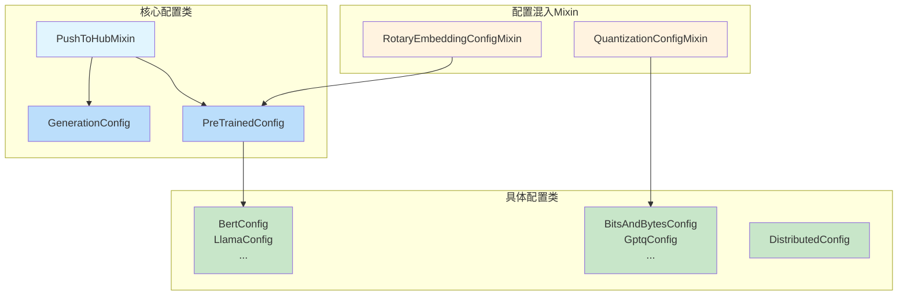
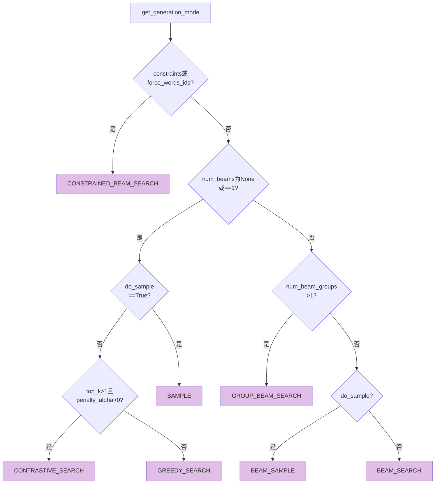
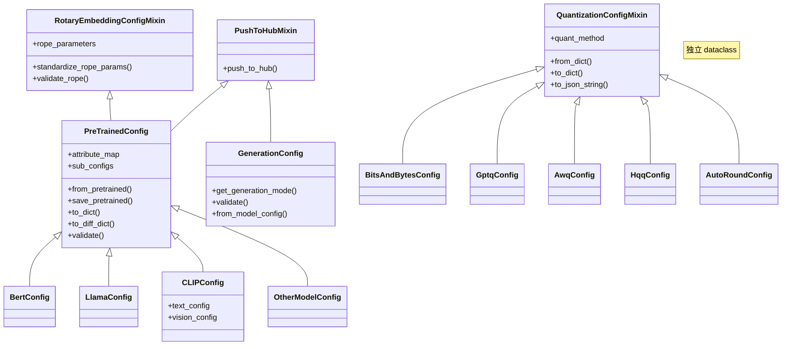
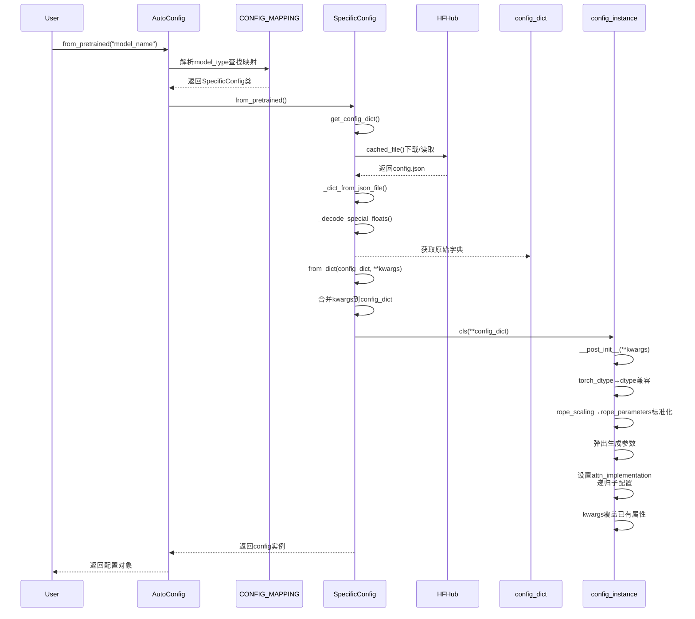

# Hugging Face Transformers 配置系统深度分析

## 目录

1. [PreTrainedConfig 基类](#1-pretrainedconfig-基类)
2. [GenerationConfig 生成配置](#2-generationconfig-生成配置)
3. [DistributedConfig 分布式配置](#3-distributedconfig-分布式配置)
4. [QuantizationConfigMixin 量化配置](#4-quantizationconfigmixin-量化配置)
5. [RotaryEmbeddingConfigMixin 与 RopeParameters](#5-rotaryembeddingconfigmixin-与-ropeparameters)
6. [@auto_docstring 装饰器](#6-auto_docstring-装饰器)
7. [配置系统整体架构与关系](#7-配置系统整体架构与关系)

---

## 配置系统整体架构



---

## 1. PreTrainedConfig 基类

**源文件**: [configuration_utils.py](file:///workspace/src/transformers/configuration_utils.py)

### 1.1 模块职责

`PreTrainedConfig` 是所有模型配置类的基类，承担以下核心职责：

- **配置序列化/反序列化**：支持从 JSON 文件、字典、Hub 仓库加载和保存配置
- **模型架构描述**：存储模型的超参数（如层数、隐藏维度、注意力头数等）
- **向后兼容性管理**：处理历史遗留字段（如 `torch_dtype` → `dtype`、`rope_scaling` → `rope_parameters`）
- **验证与约束**：通过 `@strict` 装饰器和自定义 `validate` 方法确保配置合法性
- **子配置管理**：支持嵌套配置（如多模态模型中的 text_config、vision_config）
- **Hub 集成**：通过 `PushToHubMixin` 支持推送到 Hugging Face Hub

### 1.2 核心类结构

```python
@dataclass_transform(kw_only_default=True)   # 让 IDE 把它当作 dataclass 处理
@strict(accept_kwargs=True)                   # huggingface_hub 提供的严格验证装饰器
@dataclass(repr=False)                        # Python 标准 dataclass，禁用默认 repr
class PreTrainedConfig(PushToHubMixin, RotaryEmbeddingConfigMixin):
    # ClassVar: 类级别属性，不参与序列化
    base_config_key: ClassVar[str] = ""
    sub_configs: ClassVar[dict[str, type["PreTrainedConfig"]]] = {}
    has_no_defaults_at_init: ClassVar[bool] = False
    keys_to_ignore_at_inference: ClassVar[list[str]] = []
    attribute_map: ClassVar[dict[str, str]] = {}
    base_model_tp_plan: ClassVar[dict[str, Any] | None] = None
    base_model_pp_plan: ClassVar[dict[str, Sequence[list[str]]] | None] = None
    base_model_ep_plan: ClassVar[dict[str, Sequence[list[str]]] | None] = None
    _auto_class: ClassVar[str | None] = None
    model_type: ClassVar[str] = ""

    # 实例属性：所有模型共享的通用配置
    transformers_version: str | None = None
    architectures: list[str] | None = None
    output_hidden_states: bool | None = False
    return_dict: bool | None = True
    dtype: Union[str, "torch.dtype"] | None = None
    chunk_size_feed_forward: int = 0
    is_encoder_decoder: bool = False
    id2label: dict[int, str] | dict[str, str] | None = None
    label2id: dict[str, int] | dict[str, str] | None = None
    problem_type: Literal["regression", "single_label_classification", "multi_label_classification"] | None = None
```

### 1.3 关键设计原理

#### 1.3.1 dataclass + `__post_init__` 模式

v5 版本中，`PreTrainedConfig` 从传统的手动 `__init__` 迁移到了 Python `dataclass`。这带来了：

- **类型安全**：字段类型声明直接写在类体上，IDE 和静态检查器可以推断类型
- **自动生成 `__init__`**：无需手写大量 `self.xxx = kwargs.pop("xxx", default)` 代码
- **`__post_init__` 处理向后兼容**：dataclass 生成的 `__init__` 只设置声明字段，额外的 kwargs 传入 `__post_init__`

```python
def __post_init__(self, **kwargs):
    # 向后兼容：torch_dtype → dtype
    if (torch_dtype := kwargs.pop("torch_dtype", None)) is not None:
        self.dtype = self.dtype if self.dtype is not None else torch_dtype

    # 字符串 dtype 转换为 torch.dtype
    if self.dtype is not None and isinstance(self.dtype, str) and is_torch_available():
        import torch
        self.dtype = getattr(torch, self.dtype)

    # RoPE 参数标准化
    if hasattr(self, "rope_parameters"):
        kwargs = self.convert_rope_params_to_dict(**kwargs)

    # 弹出生成参数（不应存在于模型配置中）
    for parameter_name in GenerationConfig._get_default_generation_params().keys():
        kwargs.pop(parameter_name, None)

    # 额外的 kwargs 设置为属性（保持向后兼容）
    for key, value in kwargs.items():
        if key not in ("_attn_implementation_internal", "_experts_implementation_internal"):
            setattr(self, key, value)
```

#### 1.3.2 `__init_subclass__` 自动装饰子类

每当定义 `PreTrainedConfig` 的子类时，`__init_subclass__` 会自动将其转换为 dataclass，并包装 `__init__` 以接受任意 kwargs：

```python
def __init_subclass__(cls, *args, **kwargs):
    super().__init_subclass__(*args, **kwargs)
    cls_has_custom_init = "__init__" in cls.__dict__

    # 自动将子类转为 dataclass（kw_only=True 确保字段顺序灵活）
    cls = dataclass(cls, repr=False, kw_only=True)

    # 如果子类没有自定义 __init__，包装它以接受额外 kwargs
    if not cls_has_custom_init:
        cls = wrap_init_to_accept_kwargs(cls)
```

`wrap_init_to_accept_kwargs` 的核心逻辑：

```python
def wrap_init_to_accept_kwargs(cls: dataclass):
    original_init = cls.__init__

    @wraps(original_init)
    def __init__(self, *args, **kwargs: Any) -> None:
        dataclass_fields = {f.name for f in fields(cls)}
        standard_kwargs = {k: v for k, v in kwargs.items() if k in dataclass_fields}

        # 只设置 dataclass 声明的字段
        for f in fields(cls):
            if f.name in standard_kwargs:
                setattr(self, f.name, standard_kwargs[f.name])
            elif f.default is not MISSING:
                setattr(self, f.name, f.default)
            elif f.default_factory is not MISSING:
                setattr(self, f.name, f.default_factory())
            else:
                raise TypeError(f"Missing required field - '{f.name}'")

        # 额外 kwargs 传给 __post_init__
        additional_kwargs = {k: v for k, v in kwargs.items() if k not in dataclass_fields}
        self.__post_init__(**additional_kwargs)

    cls.__init__ = __init__
    return cls
```

#### 1.3.3 `attribute_map` 属性别名机制

通过重写 `__setattr__` 和 `__getattribute__`，实现属性名映射：

```python
def __setattr__(self, key, value):
    if key in super().__getattribute__("attribute_map"):
        key = super().__getattribute__("attribute_map")[key]
    super().__setattr__(key, value)

def __getattribute__(self, key):
    if key != "attribute_map" and key in super().__getattribute__("attribute_map"):
        key = super().__getattribute__("attribute_map")[key]
    return super().__getattribute__(key)
```

这使得模型可以使用标准化命名（如 `num_hidden_layers`）同时兼容历史命名（如 `n_layer`）。

#### 1.3.4 注意力/专家实现的递归传播

`_attn_implementation` 和 `_experts_implementation` 的 setter 会递归地将值传播到所有子配置：

```python
@_attn_implementation.setter
def _attn_implementation(self, value: str | dict | None):
    """We set it recursively on the sub-configs as well"""
    current_attn = getattr(self, "_attn_implementation", None)
    # 如果 value 是 dict，可以为不同子配置指定不同实现
    attn_implementation = value if not isinstance(value, dict) else value.get("", current_attn)
    self._attn_implementation_internal = attn_implementation

    # 递归设置子配置
    for subconfig_key in self.sub_configs:
        subconfig = getattr(self, subconfig_key, None)
        if subconfig is not None:
            current_subconfig_attn = getattr(subconfig, "_attn_implementation", None)
            sub_implementation = (
                value if not isinstance(value, dict) else value.get(subconfig_key, current_subconfig_attn)
            )
            subconfig._attn_implementation = sub_implementation
```

### 1.4 序列化流程

#### 保存流程 (`save_pretrained`)

```mermaid
flowchart TD
    A[save_pretrained<br/>save_directory] --> B{检查是否有生成参数混入?}
    B -->|是| C[报错]
    B -->|否| D[创建目录]
    D --> E{有_auto_class?}
    E -->|是| F[保存自定义对象文件]
    E -->|否| G
    F --> G[调用validate()严格验证]
    G --> H[to_json_file<br/>config.json, use_diff=True]
    H --> I[to_json_string<br/>use_diff=True]
    I --> J[to_diff_dict]
    J --> K[to_dict<br/>深拷贝__dict__]
    K --> L1[处理嵌套PreTrainedConfig<br/>递归to_dict]
    K --> L2[tuple → list转换]
    K --> L3[添加transformers_version]
    K --> L4[处理quantization_config]
    K --> L5[dict_dtype_to_str<br/>torch.float32→float32]
    L1 --> M[与默认PreTrainedConfig对比]
    L2 --> M
    L3 --> M
    L4 --> M
    L5 --> M
    M --> N[与当前类默认值对比]
    N --> O[递归处理嵌套配置的diff]
    O --> P[_remove_keys_not_serialized<br/>移除内部字段]
    P --> Q[_encode_special_floats<br/>Infinity/NaN编码]
    
    style C fill:#ffcccc
    style Q fill:#ccffcc
```

#### 加载流程 (`from_pretrained`)

```mermaid
flowchart TD
    A[from_pretrained<br/>pretrained_model_name_or_path<br/>**kwargs] --> B[get_config_dict<br/>获取原始字典]
    B --> C[_get_config_dict]
    C --> D[cached_file<br/>从Hub/本地/缓存解析文件]
    D --> E[_dict_from_json_file<br/>JSON解析]
    E --> F[_decode_special_floats<br/>还原Infinity/NaN]
    F --> G[处理configuration_files版本选择]
    G --> H[base_config_key提取嵌套配置]
    H --> I[model_type匹配检查]
    I --> J[from_dict<br/>config_dict, **kwargs]
    J --> K[合并kwargs中的有效字段到config_dict]
    K --> L[cls(**config_dict)<br/>实例化]
    L --> M[__post_init__<br/>**kwargs]
    M --> N1[torch_dtype→dtype兼容]
    M --> N2[rope_scaling→rope_parameters标准化]
    M --> N3[弹出生成参数]
    M --> N4[设置attn_implementation<br/>递归子配置]
    M --> N5[设置额外kwargs属性]
    N1 --> O[kwargs覆盖已有属性]
    N2 --> O
    N3 --> O
    N4 --> O
    N5 --> O
    O --> P[返回config或config+unused_kwargs]
    
    style P fill:#ccffcc
```

#### 差异序列化 (`to_diff_dict`)

差异序列化只保存与默认值不同的字段，使配置文件更简洁：

```python
def to_diff_dict(self) -> dict[str, Any]:
    config_dict = self.to_dict()
    default_config_dict = PreTrainedConfig().to_dict()
    class_config_dict = self.__class__().to_dict() if not self.has_no_defaults_at_init else {}

    serializable_config_dict = {}
    for key, value in config_dict.items():
        # 嵌套配置递归 diff
        if isinstance(getattr(self, key, None), PreTrainedConfig) and key in class_config_dict:
            diff = recursive_diff_dict(value, default_config_dict, config_obj=getattr(self, key, None))
            if "model_type" in value:
                diff["model_type"] = value["model_type"]
            serializable_config_dict[key] = diff
        # 非默认值才保存
        elif key not in default_config_dict or value != default_config_dict[key]:
            serializable_config_dict[key] = value

    self._remove_keys_not_serialized(serializable_config_dict)
    return serializable_config_dict
```

### 1.5 特殊浮点数处理

JSON 标准不支持 `Infinity`、`-Infinity`、`NaN`，因此使用自定义编解码：

```python
_FLOAT_TAG_KEY = "__float__"
_FLOAT_TAG_VALUES = {"Infinity": float("inf"), "-Infinity": float("-inf"), "NaN": float("nan")}

# 编码：float("inf") → {"__float__": "Infinity"}
@classmethod
def _encode_special_floats(cls, obj: Any) -> Any:
    if isinstance(obj, float):
        if math.isnan(obj): return {_FLOAT_TAG_KEY: "NaN"}
        if obj == float("inf"): return {_FLOAT_TAG_KEY: "Infinity"}
        if obj == float("-inf"): return {_FLOAT_TAG_KEY: "-Infinity"}
        return obj
    if isinstance(obj, dict):
        return {k: cls._encode_special_floats(v) for k, v in obj.items()}
    if isinstance(obj, (list, tuple)):
        return [cls._encode_special_floats(v) for v in obj]
    return obj

# 解码：{"__float__": "Infinity"} → float("inf")
@classmethod
def _decode_special_floats(cls, obj: Any) -> Any:
    if isinstance(obj, dict):
        if set(obj.keys()) == {_FLOAT_TAG_KEY} and isinstance(obj[_FLOAT_TAG_KEY], str):
            tag = obj[_FLOAT_TAG_KEY]
            if tag in _FLOAT_TAG_VALUES:
                return _FLOAT_TAG_VALUES[tag]
        return {k: cls._decode_special_floats(v) for k, v in obj.items()}
    if isinstance(obj, list):
        return [cls._decode_special_floats(v) for v in obj]
    return obj
```

### 1.6 验证机制

`PreTrainedConfig` 通过 `@strict` 装饰器自动获得 `validate` 方法，同时提供多个自定义验证方法：

```python
def validate_architecture(self):
    """验证 head_dim * num_heads == embed_dim"""
    if (hasattr(self, "head_dim") and hasattr(self, "num_heads")
        and hasattr(self, "embed_dim")
        and self.head_dim * self.num_heads != self.embed_dim):
        raise ValueError(...)

def validate_token_ids(self):
    """验证特殊 token ID 在词汇表范围内"""
    text_config = self.get_text_config(decoder=True)
    vocab_size = getattr(text_config, "vocab_size", None)
    if vocab_size is not None:
        for name in text_config:
            value = getattr(text_config, name)
            if name.endswith("_token_id") and isinstance(value, int) and not 0 <= value < vocab_size:
                logger.warning_once(...)

def validate_layer_type(self):
    """验证 layer_types 合法性"""
    if not all(layer_type in ALLOWED_LAYER_TYPES for layer_type in self.layer_types):
        raise ValueError(...)
```

### 1.7 与其他模块的关系

- **GenerationConfig**：`PreTrainedConfig.__post_init__` 中会弹出所有生成参数，防止它们混入模型配置
- **RotaryEmbeddingConfigMixin**：通过多重继承混入 RoPE 参数管理能力
- **QuantizationConfigMixin**：`PreTrainedConfig` 可包含 `quantization_config` 属性，序列化时特殊处理
- **PushToHubMixin**：提供 Hub 推送能力
- **AutoConfig**：通过 `model_type` 和 `register_for_auto_class` 实现自动映射

---

## 2. GenerationConfig 生成配置

**源文件**: [generation/configuration_utils.py](file:///workspace/src/transformers/generation/configuration_utils.py)

### 2.1 模块职责

`GenerationConfig` 管理文本生成过程中的所有参数，包括：

- 解码策略（贪心、采样、束搜索等）
- 长度控制（max_length、max_new_tokens 等）
- logits 操控（temperature、top_k、top_p、repetition_penalty 等）
- 缓存配置（KV cache 实现类型）
- 特殊 token（pad、bos、eos）
- 辅助生成（speculative decoding）
- 水印配置

### 2.2 核心类结构

```python
class GenerationConfig(PushToHubMixin):
    extra_output_flags = ("output_attentions", "output_hidden_states", "output_scores", "output_logits")

    # Tensor 版本的 token ID（在 generate 时设置）
    _bos_token_tensor: "torch.Tensor | None"
    _eos_token_tensor: "torch.Tensor | None"
    _pad_token_tensor: "torch.Tensor | None"
    _decoder_start_token_tensor: "torch.Tensor | None"
    _original_object_hash: int | None  # 用于检测实例是否被修改

    def __init__(self, **kwargs):
        user_set_attributes = set(kwargs.keys())  # 记录用户显式设置的属性

        # 长度控制参数
        self.max_length = kwargs.pop("max_length", None)
        self.max_new_tokens = kwargs.pop("max_new_tokens", None)
        # ... 更多参数

        # 水印配置（支持从 dict 自动转换）
        self.watermarking_config = kwargs.pop("watermarking_config", None)
        if isinstance(self.watermarking_config, dict):
            self.watermarking_config = WatermarkingConfig.from_dict(self.watermarking_config)

        # 验证
        self.validate(user_set_attributes=user_set_attributes)
```

### 2.3 生成模式判定

`GenerationMode` 枚举定义了所有支持的生成模式：

```python
class GenerationMode(ExplicitEnum):
    CONTRASTIVE_SEARCH = "contrastive_search"
    GREEDY_SEARCH = "greedy_search"
    SAMPLE = "sample"
    ASSISTED_GENERATION = "assisted_generation"
    DOLA_GENERATION = "dola_generation"
    BEAM_SEARCH = "beam_search"
    BEAM_SAMPLE = "beam_sample"
    CONSTRAINED_BEAM_SEARCH = "constrained_beam_search"
    GROUP_BEAM_SEARCH = "group_beam_search"
```

`get_generation_mode` 方法根据配置参数自动推断生成模式：



```python
def get_generation_mode(self, assistant_model=None) -> GenerationMode:
    if self.constraints or self.force_words_ids:
        return GenerationMode.CONSTRAINED_BEAM_SEARCH
    elif self.num_beams is None or self.num_beams == 1:
        if self.do_sample is not True:
            if self.top_k > 1 and self.penalty_alpha > 0:
                return GenerationMode.CONTRASTIVE_SEARCH
            return GenerationMode.GREEDY_SEARCH
        return GenerationMode.SAMPLE
    else:
        if self.num_beam_groups > 1:
            return GenerationMode.GROUP_BEAM_SEARCH
        elif self.do_sample:
            return GenerationMode.BEAM_SAMPLE
        return GenerationMode.BEAM_SEARCH
```

### 2.4 验证机制

`validate` 方法实现了多层验证：

1. **单属性验证**：`early_stopping` 必须是 bool 或 "never"；`max_new_tokens` 必须 > 0
2. **属性组合验证**：`do_sample=False` 时采样参数（temperature、top_p 等）不应设置
3. **缓存相关验证**：`use_cache=False` 时缓存参数不应设置
4. **输出标志验证**：`return_dict_in_generate` 非 True 时 output 标志无效

关键设计：`user_set_attributes` 参数用于区分用户显式设置的参数和从 `generation_config.json` 继承的默认值，避免对继承参数产生不必要的警告：

```python
def _should_warn(outer_attr, inner_attr, user_set_attributes):
    """只有当内外属性都被用户显式设置，或只有内属性被设置时才警告"""
    outer_set = user_set_attributes is not None and outer_attr in user_set_attributes
    inner_set = user_set_attributes is not None and inner_attr in user_set_attributes
    return (outer_set and inner_set) or (not outer_set and not inner_set) or (inner_set and not outer_set)
```

### 2.5 默认生成参数

```python
@staticmethod
def _get_default_generation_params() -> dict[str, Any]:
    return {
        "max_length": 20, "min_length": 0,
        "do_sample": False, "use_cache": True,
        "early_stopping": False, "num_beams": 1,
        "temperature": 1.0, "top_k": 50, "top_p": 1.0,
        "typical_p": 1.0, "repetition_penalty": 1.0,
        "length_penalty": 1.0, "no_repeat_ngram_size": 0,
        # ... 更多参数
    }
```

这些默认值在 `PreTrainedConfig.__post_init__` 中被用来弹出混入模型配置的生成参数。

### 2.6 与 PreTrainedConfig 的关系

- **分离关注点**：v5 中生成参数从 `PreTrainedConfig` 迁移到 `GenerationConfig`
- **`from_model_config`**：从旧的 `PreTrainedConfig`（可能包含生成参数）创建 `GenerationConfig`
- **`_get_default_generation_params`**：`PreTrainedConfig` 使用此方法检测并拒绝保存生成参数
- **保存路径不同**：`PreTrainedConfig` → `config.json`，`GenerationConfig` → `generation_config.json`

---

## 3. DistributedConfig 分布式配置

**源文件**: [distributed/configuration_utils.py](file:///workspace/src/transformers/distributed/configuration_utils.py)

### 3.1 模块职责

`DistributedConfig` 是分布式训练/推理配置的基类，目前处于早期阶段，负责：

- 管理专家并行（Expert Parallelism）开关
- 提供序列化/反序列化基础设施
- 为未来的张量并行、流水线并行等配置预留扩展空间

### 3.2 核心类结构

```python
@dataclass
class DistributedConfig:
    enable_expert_parallel: bool = False
    # TODO: add tp_plan, pp_plan, device_mesh etc..

    @classmethod
    def from_dict(cls, config_dict, **kwargs):
        config = cls(**config_dict)
        to_remove = []
        for key, value in kwargs.items():
            if hasattr(config, key):
                setattr(config, key, value)
                to_remove.append(key)
        for key in to_remove:
            kwargs.pop(key, None)
        return config

    def to_json_file(self, json_file_path):
        with open(json_file_path, "w", encoding="utf-8") as writer:
            config_dict = self.to_dict()
            json_string = json.dumps(config_dict, indent=2, sort_keys=True) + "\n"
            writer.write(json_string)

    def to_dict(self) -> dict[str, Any]:
        return copy.deepcopy(self.__dict__)

    def __iter__(self):
        yield from copy.deepcopy(self.__dict__).items()

    def update(self, **kwargs):
        to_remove = []
        for key, value in kwargs.items():
            if hasattr(self, key):
                setattr(self, key, value)
                to_remove.append(key)
        unused_kwargs = {key: value for key, value in kwargs.items() if key not in to_remove}
        return unused_kwargs
```

### 3.3 设计原理

- **极简设计**：当前只有一个 `enable_expert_parallel` 字段，体现了渐进式开发策略
- **与 QuantizationConfigMixin 同构**：`to_json_file`、`__iter__`、`__repr__` 等方法直接从量化配置复制
- **`update` 返回未使用 kwargs**：与 `PreTrainedConfig.from_dict` 的模式一致，允许调用方处理未知参数
- **`__iter__` 支持 `dict(obj)`**：使配置对象可以像字典一样迭代

### 3.4 与 PreTrainedConfig 的关系

- `PreTrainedConfig` 的 `base_model_tp_plan`、`base_model_pp_plan`、`base_model_ep_plan` 是分布式并行计划的声明
- `DistributedConfig` 未来可能整合这些计划，形成统一的分布式配置入口
- 目前分布式配置主要通过 `PreTrainedConfig` 的类属性（tp_plan/pp_plan/ep_plan）实现

---

## 4. QuantizationConfigMixin 量化配置

**源文件**: [utils/quantization_config.py](file:///workspace/src/transformers/utils/quantization_config.py)

### 4.1 模块职责

`QuantizationConfigMixin` 是所有量化配置的基类混入，提供：

- 统一的序列化/反序列化接口
- 量化方法枚举（`QuantizationMethod`）
- 多种量化后端的配置类（BitsAndBytes、GPTQ、AWQ、HQQ、AutoRound 等）

### 4.2 量化方法枚举

```python
class QuantizationMethod(str, Enum):
    BITS_AND_BYTES = "bitsandbytes"
    GPTQ = "gptq"
    AWQ = "awq"
    AQLM = "aqlm"
    VPTQ = "vptq"
    QUANTO = "quanto"
    EETQ = "eetq"
    HIGGS = "higgs"
    HQQ = "hqq"
    COMPRESSED_TENSORS = "compressed-tensors"
    FBGEMM_FP8 = "fbgemm_fp8"
    TORCHAO = "torchao"
    BITNET = "bitnet"
    SPQR = "spqr"
    FP8 = "fp8"
    QUARK = "quark"
    FPQUANT = "fp_quant"
    AUTOROUND = "auto-round"
    MXFP4 = "mxfp4"
    METAL = "metal"
    FOUR_OVER_SIX = "fouroversix"
    SINQ = "sinq"
```

### 4.3 基类混入

```python
@dataclass
class QuantizationConfigMixin:
    quant_method: QuantizationMethod  # 必须指定量化方法

    @classmethod
    def from_dict(cls, config_dict, return_unused_kwargs=False, **kwargs):
        config = cls(**config_dict)
        to_remove = []
        for key, value in kwargs.items():
            if hasattr(config, key):
                setattr(config, key, value)
                to_remove.append(key)
        for key in to_remove:
            kwargs.pop(key, None)
        if return_unused_kwargs:
            return config, kwargs
        return config

    def to_dict(self) -> dict[str, Any]:
        return copy.deepcopy(self.__dict__)

    def to_diff_dict(self) -> dict[str, Any]:
        return self.to_dict()  # 默认不做 diff

    def to_json_string(self, use_diff: bool = True) -> str:
        config_dict = self.to_diff_dict() if use_diff else self.to_dict()
        return json.dumps(config_dict, indent=2, sort_keys=True) + "\n"

    def update(self, **kwargs):
        """更新匹配的属性，返回未使用的 kwargs"""
        to_remove = []
        for key, value in kwargs.items():
            if hasattr(self, key):
                setattr(self, key, value)
                to_remove.append(key)
        unused_kwargs = {key: value for key, value in kwargs.items() if key not in to_remove}
        return unused_kwargs
```

### 4.4 具体量化配置示例

#### BitsAndBytesConfig

```python
@dataclass
class BitsAndBytesConfig(QuantizationConfigMixin):
    def __init__(self, load_in_8bit=False, load_in_4bit=False,
                 llm_int8_threshold=6.0, bnb_4bit_compute_dtype=None,
                 bnb_4bit_quant_type="fp4", bnb_4bit_use_double_quant=False,
                 bnb_4bit_quant_storage=None, **kwargs):
        self.quant_method = QuantizationMethod.BITS_AND_BYTES

        if load_in_4bit and load_in_8bit:
            raise ValueError("Cannot use both 4-bit and 8-bit quantization")

        self._load_in_8bit = load_in_8bit
        self._load_in_4bit = load_in_4bit
        # ... 更多参数设置
        self.post_init()
```

#### AutoRoundConfig

```python
@dataclass
class AutoRoundConfig(QuantizationConfigMixin):
    def __init__(self, bits: int = 4, group_size: int = 128,
                 sym: bool = True, backend: str = "auto", **kwargs):
        self.bits = bits
        self.group_size = group_size
        self.sym = sym
        self.backend = backend
        self.packing_format = "auto_round:gptq"
        self.quant_method = QuantizationMethod.AUTOROUND
        self.post_init()

    def post_init(self):
        if self.bits not in [2, 3, 4, 8]:
            raise ValueError(f"Only support quantization to [2,3,4,8] bits")
```

### 4.5 设计原理

- **`quant_method` 作为标识符**：每个量化配置必须声明其量化方法，用于 `AutoQuantizationConfig` 自动分发
- **`post_init` 安全检查**：各子类在 `__init__` 末尾调用 `post_init` 进行参数校验
- **`from_dict` 多态**：子类可覆盖 `from_dict` 实现特殊逻辑（如 `AutoRoundConfig` 支持从 GPTQ/AWQ 格式转换）
- **`to_diff_dict` 差异序列化**：`HqqConfig` 等子类覆盖此方法只保存非默认值

### 4.6 与 PreTrainedConfig 的关系

- `PreTrainedConfig` 的 `to_dict` 和 `to_diff_dict` 中对 `quantization_config` 做特殊处理
- 量化配置作为 `PreTrainedConfig` 的一个属性存在，序列化时独立处理
- `AutoQuantizationConfig` 根据 `quant_method` 字段自动选择正确的配置类

---

## 5. RotaryEmbeddingConfigMixin 与 RopeParameters

**源文件**: [modeling_rope_utils.py](file:///workspace/src/transformers/modeling_rope_utils.py)

### 5.1 模块职责

`RotaryEmbeddingConfigMixin` 管理 RoPE（旋转位置编码）的配置，包括：

- 将历史 `rope_scaling` 格式标准化为 `rope_parameters`
- 验证不同 RoPE 类型的参数完整性
- 支持多种 RoPE 变体（linear、dynamic、yarn、longrope、llama3、proportional）

`RopeParameters` 是一个 `TypedDict`，定义了 RoPE 参数的结构。

### 5.2 RopeParameters 类型定义

```python
class RopeParameters(TypedDict):
    rope_theta: float | None              # 基础频率，默认 10000.0
    rope_type: str | None                 # RoPE 变体类型
    partial_rotary_factor: float | None   # 部分旋转比例
    factor: float | None                  # 缩放因子
    original_max_position_embeddings: int | None  # 原始最大位置编码长度
    attention_factor: float | None        # 注意力缩放因子
    beta_fast: float | None              # YaRN 外推边界
    beta_slow: float | None              # YaRN 内插边界
    short_factor: list[float] | None     # LongRoPE 短上下文因子
    long_factor: list[float] | None      # LongRoPE 长上下文因子
    low_freq_factor: float | None        # Llama3 低频缩放因子
    high_freq_factor: float | None       # Llama3 高频缩放因子
```

### 5.3 RotaryEmbeddingConfigMixin 核心方法

#### 标准化 (`standardize_rope_params`)

将各种历史格式统一为标准 `rope_parameters` 字典：

```python
def standardize_rope_params(self):
    rope_theta = getattr(self, "rope_theta", None)
    partial_rotary_factor = getattr(self, "partial_rotary_factor", None)
    rope_parameters = getattr(self, "rope_parameters", None) or {}
    layer_types = getattr(self, "layer_types", None)

    # Case 0: 无 RoPE 参数
    if not (rope_parameters or rope_theta):
        return

    # Case 1: 全局 RoPE 参数（单一 dict）
    elif layer_types is None or not set(rope_parameters.keys()).issubset(layer_types):
        rope_parameters.setdefault("rope_type", rope_parameters.get("type", "default"))
        rope_parameters.setdefault("rope_theta", rope_theta)
        # 对 llama3/yarn/longrope 类型设置 original_max_position_embeddings
        if rope_parameters["rope_type"] in ["llama3", "yarn", "longrope"]:
            rope_parameters.setdefault("original_max_position_embeddings", self.max_position_embeddings)

    # Case 2: 每层类型不同 RoPE（嵌套 dict，key 为 layer_type）
    else:
        for layer_type in set(layer_types):
            rope_parameters[layer_type].setdefault("rope_type", ...)
            rope_parameters[layer_type].setdefault("rope_theta", rope_theta)
```

#### 验证 (`validate_rope`)

根据 `rope_type` 分发到对应的验证函数：

```python
def validate_rope(self: "PreTrainedConfig"):
    rope_parameters_dict = getattr(self, "rope_parameters", None)
    if not rope_parameters_dict:
        return

    for rope_parameters in rope_parameters_dict.values():
        rope_type = rope_parameters.get("rope_type", "default")
        validation_fn = getattr(self, f"_validate_{rope_type}_rope_parameters", None)
        if validation_fn is not None:
            validation_fn(rope_parameters, ignore_keys=self.ignore_keys_at_rope_validation)
```

每种 RoPE 类型有独立的验证逻辑：

| RoPE 类型 | 必需字段 | 可选字段 |
|-----------|---------|---------|
| default | rope_type | rope_theta |
| linear | rope_type, factor | rope_theta |
| dynamic | rope_type, factor | rope_theta |
| yarn | rope_type, factor, original_max_position_embeddings | rope_theta, attention_factor, beta_fast, beta_slow |
| longrope | rope_type, short_factor, long_factor, original_max_position_embeddings | rope_theta, attention_factor, factor |
| llama3 | rope_type, factor, original_max_position_embeddings, low_freq_factor, high_freq_factor, rope_theta | — |
| proportional | rope_type, rope_theta | partial_rotary_factor, factor |

### 5.4 RoPE 初始化函数映射

```python
ROPE_INIT_FUNCTIONS: dict[str, Callable] = {
    "linear": _compute_linear_scaling_rope_parameters,
    "dynamic": _compute_dynamic_ntk_parameters,
    "yarn": _compute_yarn_parameters,
    "longrope": _compute_longrope_parameters,
    "llama3": _compute_llama3_parameters,
    "proportional": _compute_proportional_rope_parameters,
}
```

每个初始化函数的签名统一为：

```python
def _compute_xxx_parameters(
    config: PreTrainedConfig,
    device: torch.device,
    seq_len: int | None = None,
    layer_type: str | None = None,
) -> tuple[torch.Tensor, float]:  # (inv_freq, attention_factor)
```

### 5.5 动态 RoPE 更新

`dynamic_rope_update` 装饰器在 forward 过程中根据序列长度动态更新 RoPE 频率：

```python
def dynamic_rope_update(rope_forward):
    @wraps(rope_forward)
    def wrapper(self, x, position_ids, layer_type=None):
        rope_type = self.rope_type if layer_type is None else self.rope_type[layer_type]
        if "dynamic" in rope_type:
            dynamic_frequency_update(self, position_ids, device=x.device)
        elif rope_type == "longrope":
            longrope_frequency_update(self, position_ids, device=x.device)
        return rope_forward(self, x, position_ids)
    return wrapper
```

### 5.6 与 PreTrainedConfig 的关系

- `PreTrainedConfig` 通过多重继承 `RotaryEmbeddingConfigMixin` 获得 RoPE 管理能力
- `__post_init__` 中调用 `convert_rope_params_to_dict` 进行参数标准化
- `rope_scaling` 属性作为 `rope_parameters` 的别名，保持向后兼容：

```python
@property
def rope_scaling(self):
    return self.rope_parameters

@rope_scaling.setter
def rope_scaling(self, value):
    self.rope_parameters = value
```

---

## 6. @auto_docstring 装饰器

**源文件**: [utils/auto_docstring.py](file:///workspace/src/transformers/utils/auto_docstring.py)

### 6.1 模块职责

`@auto_docstring` 是一个装饰器，用于自动生成模型类和方法的文档字符串，减少重复的文档编写工作：

- 从函数签名中提取参数名和类型
- 从预定义的参数描述库（`ConfigArgs`、`ImageProcessorArgs` 等）中查找标准参数的文档
- 自动生成 Args 段、Return 段和 Example 段
- 支持自定义参数和自定义介绍文本

### 6.2 核心函数

```python
def auto_docstring(obj=None, *, custom_intro=None, custom_args=None, checkpoint=None):
    """自动生成文档字符串的装饰器"""

    def auto_docstring_decorator(obj):
        if len(obj.__qualname__.split(".")) > 1:
            # 方法（如 forward、__init__）→ 生成方法文档
            return auto_method_docstring(
                obj, custom_args=custom_args, custom_intro=custom_intro, checkpoint=checkpoint
            )
        else:
            # 类 → 生成类文档
            return auto_class_docstring(
                obj, custom_args=custom_args, custom_intro=custom_intro, checkpoint=checkpoint
            )

    if obj:
        return auto_docstring_decorator(obj)
    return auto_docstring_decorator
```

### 6.3 预定义参数描述库

`auto_docstring.py` 包含大量预定义的参数描述类，用于自动填充文档：

```python
class ConfigArgs:
    output_hidden_states = {"description": "Whether or not the model should return all hidden-states."}
    dtype = {"description": "The chunk size of all feed forward layers..."}
    vocab_size = {"description": "Vocabulary size of the model..."}
    hidden_size = {"description": "Dimension of the hidden representations."}
    num_hidden_layers = {"description": "Number of hidden layers in the Transformer decoder."}
    num_attention_heads = {"description": "Number of attention heads..."}
    rope_parameters = {"description": "Dictionary containing the configuration parameters for the RoPE embeddings..."}
    # ... 更多参数
```

### 6.4 使用方式

```python
# 基本用法
@auto_docstring
class MyModel(PreTrainedModel):
    def __init__(self, config):
        ...

# 带自定义介绍
@auto_docstring(custom_intro="This model implements a novel attention mechanism.")
class MySpecialModel(PreTrainedModel):
    ...

# 带自定义参数
@auto_docstring(custom_args=VISION_ARGS)
def encode_images(self, pixel_values=None, image_features=None):
    ...
```

### 6.5 设计原理

- **DRY 原则**：标准参数（如 `input_ids`、`attention_mask`）的文档只定义一次，自动注入
- **签名检查**：装饰器检查函数签名，只为实际存在的参数生成文档
- **占位符替换**：支持 `{image_processor_class}` 等占位符，在运行时替换为实际的类名
- **分层覆盖**：方法自己的 docstring 中的自定义参数会与自动生成的参数合并

### 6.6 与配置系统的关系

- `ConfigArgs` 类定义了 `PreTrainedConfig` 各字段的文档描述
- 当 `@auto_docstring` 装饰配置类的 `__init__` 时，会从 `ConfigArgs` 中提取参数文档
- `rope_parameters` 等新字段的文档也在 `ConfigArgs` 中定义

---

## 7. 配置系统整体架构与关系

### 7.1 类继承关系



### 7.2 配置文件布局

```
model_directory/
├── config.json              ← PreTrainedConfig.save_pretrained()
├── generation_config.json   ← GenerationConfig.save_pretrained()
├── model.safetensors        ← 模型权重（不属于配置系统）
└── tokenizer.json           ← 分词器配置（不属于配置系统）
```

### 7.3 序列化协议对比

| 特性 | PreTrainedConfig | GenerationConfig | QuantizationConfigMixin | DistributedConfig |
|------|-----------------|-----------------|------------------------|-------------------|
| 差异序列化 | ✅ `to_diff_dict` | ✅ `to_diff_dict` | ⚠️ 部分子类支持 | ❌ |
| 特殊浮点数 | ✅ `_encode_special_floats` | ❌ | ❌ | ❌ |
| dtype 转字符串 | ✅ `dict_dtype_to_str` | ✅ `dict_dtype_to_str` | ❌ | ❌ |
| 嵌套配置 | ✅ 递归处理 | ❌ | ❌ | ❌ |
| Hub 推送 | ✅ `PushToHubMixin` | ✅ `PushToHubMixin` | ❌ | ❌ |
| 从 Hub 加载 | ✅ `from_pretrained` | ✅ `from_pretrained` | ❌ | ❌ |
| 版本选择 | ✅ `configuration_files` | ❌ | ❌ | ❌ |
| 验证 | ✅ `@strict` + 自定义 | ✅ `validate` | ✅ `post_init` | ❌ |

### 7.4 配置加载完整流程



### 7.5 关键设计模式总结

1. **dataclass 驱动**：v5 全面采用 Python dataclass，通过 `__post_init__` 处理向后兼容，通过 `__init_subclass__` 自动装饰子类

2. **差异序列化**：`to_diff_dict` 只保存与默认值不同的字段，使配置文件简洁易读

3. **关注点分离**：
   - `PreTrainedConfig`：模型架构
   - `GenerationConfig`：生成行为
   - `QuantizationConfigMixin`：量化策略
   - `DistributedConfig`：分布式策略
   - `RotaryEmbeddingConfigMixin`：位置编码

4. **向后兼容优先**：大量兼容代码（`torch_dtype`→`dtype`、`rope_scaling`→`rope_parameters`、`type`→`rope_type`）确保旧配置文件仍可加载

5. **递归传播**：`_attn_implementation`、`_experts_implementation` 等属性在设置时自动传播到子配置

6. **验证分层**：从 `@strict` 装饰器的自动验证到各模块的自定义验证方法，形成多层验证体系

7. **开放-封闭原则**：`ROPE_INIT_FUNCTIONS` 字典允许注册新的 RoPE 类型，`QuantizationMethod` 枚举支持添加新的量化方法，无需修改核心代码
