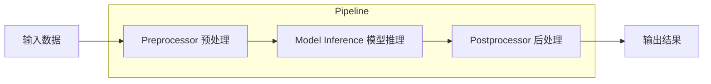

# Pipeline 设计理念

本文件详细解析 Pipeline 模块的设计思想。

---

## 1. Pipeline 概述

Pipeline 是 Transformers 库提供的高级 API，目的是让用户能够轻松使用预训练模型进行推理，而不需要了解太多底层细节。

### 1.1 设计目标

- **简单易用**：一行代码完成复杂任务
- **端到端**：从原始输入直接到最终输出
- **多模态**：支持文本、图像、音频等多种任务
- **可扩展**：易于添加新的 pipeline 类型

---

## 2. Pipeline 架构



---

## 3. Pipeline 工作流程

### 3.1 三个核心步骤

1. **预处理 (Preprocessing)**
   - 文本分词
   - 图像处理
   - 音频处理

2. **推理 (Inference)**
   - 模型前向传播
   - 获得 logits

3. **后处理 (Postprocessing)**
   - 解析模型输出
   - 格式化结果

---

## 4. 常见 Pipeline 类型

| Pipeline 类型 | 任务 |
|--------------|------|
| `text-generation` | 文本生成 |
| `fill-mask` | 掩码填充 |
| `text-classification` | 文本分类 |
| `token-classification` | 序列标注 |
| `question-answering` | 问答 |
| `summarization` | 摘要 |
| `translation` | 翻译 |
| `image-classification` | 图像分类 |
| `object-detection` | 目标检测 |
| `automatic-speech-recognition` | 语音识别 |

---

## 5. 使用示例

### 5.1 基本使用

```python
from transformers import pipeline

# 创建 pipeline
classifier = pipeline(
    task="text-classification",
    model="distilbert-base-uncased-finetuned-sst-2-english"
)

# 推理
result = classifier("I love Transformers!")
# [{'label': 'POSITIVE', 'score': 0.9998}]
```

### 5.2 文本生成

```python
generator = pipeline(
    "text-generation",
    model="gpt2"
)

result = generator("Once upon a time")
```

---

## 6. Pipeline 基类

Pipeline 基类定义在 [src/transformers/pipelines/base.py](file:///workspace/src/transformers/pipelines/base.py)

```python
class Pipeline:
    """
    Pipeline 基类
    """
    def __init__(
        self,
        model,
        tokenizer=None,
        feature_extractor=None,
        ...
    ):
        ...
    
    def __call__(self, inputs, **kwargs):
        ...
    
    def preprocess(self, inputs, **kwargs):
        ...
    
    def _forward(self, model_inputs, **kwargs):
        ...
    
    def postprocess(self, model_outputs, **kwargs):
        ...
```

---

## 7. 自定义 Pipeline

可以通过继承基类来创建自定义 pipeline：

```python
from transformers import Pipeline

class MyPipeline(Pipeline):
    def _sanitize_parameters(self, **kwargs):
        ...
    
    def preprocess(self, inputs, **kwargs):
        ...
    
    def _forward(self, model_inputs, **kwargs):
        ...
    
    def postprocess(self, model_outputs, **kwargs):
        ...
```
