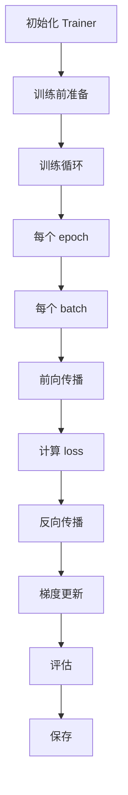

# Trainer 基类详解

本文件详细解析 `Trainer` 类的设计与实现。

---

## 1. Trainer 概述

`Trainer` 是 Transformers 库提供的高级训练 API，简化了模型训练、评估、预测的流程。它定义在 [src/transformers/trainer.py](file:///workspace/src/transformers/trainer.py)。

### 1.1 核心特性

- 开箱即用的训练循环
- 内置评估功能
- 支持多种优化器和调度器
- 支持梯度累积、混合精度等
- 支持回调机制
- 支持分布式训练

---

## 2. Trainer 工作流程



---

## 3. 核心组件

### 3.1 初始化参数

主要初始化参数：

| 参数 | 说明 |
|------|------|
| `model` | 模型 |
| `args` | TrainingArguments |
| `data_collator` | 数据整理器 |
| `train_dataset` | 训练数据集 |
| `eval_dataset` | 评估数据集 |
| `tokenizer` | 分词器 |
| `compute_metrics` | 指标计算函数 |
| `callbacks` | 回调列表 |
| `optimizers` | 优化器和调度器 |

### 3.2 主要方法

```python
class Trainer:
    # 训练
    def train():
        ...
    
    # 评估
    def evaluate():
        ...
    
    # 预测
    def predict():
        ...
    
    # 保存
    def save_model():
        ...
```

---

## 4. 使用示例

### 4.1 基本使用

```python
from transformers import (
    Trainer,
    TrainingArguments,
    AutoModelForSequenceClassification,
    AutoTokenizer
)

# 1. 加载模型和分词器
model = AutoModelForSequenceClassification.from_pretrained("bert-base-uncased")
tokenizer = AutoTokenizer.from_pretrained("bert-base-uncased")

# 2. 准备数据
# (假设已经准备好 train_dataset 和 eval_dataset)

# 3. 定义训练参数
training_args = TrainingArguments(
    output_dir="./results",
    learning_rate=2e-5,
    per_device_train_batch_size=8,
    num_train_epochs=3,
)

# 4. 创建 Trainer
trainer = Trainer(
    model=model,
    args=training_args,
    train_dataset=train_dataset,
    eval_dataset=eval_dataset,
    tokenizer=tokenizer,
)

# 5. 训练
trainer.train()
```

### 4.2 使用 compute_metrics

```python
import numpy as np
from datasets import load_metric

metric = load_metric("accuracy")

def compute_metrics(eval_pred):
    logits, labels = eval_pred
    predictions = np.argmax(logits, axis=-1)
    return metric.compute(predictions=predictions, references=labels)

trainer = Trainer(
    ...,
    compute_metrics=compute_metrics
)
```

---

## 5. 回调机制

### 5.1 常用回调

| 回调 | 说明 |
|------|------|
| `EarlyStoppingCallback` | 早停 |
| `PrinterCallback` | 打印日志 |
| `ProgressCallback` | 进度条 |
| `TensorBoardCallback` | TensorBoard 日志 |

### 5.2 自定义回调

```python
from transformers import TrainerCallback

class MyCallback(TrainerCallback):
    def on_epoch_end(self, args, state, control, **kwargs):
        print(f"Epoch {state.epoch} finished!")
```

---

## 6. TrainingArguments

`TrainingArguments` 包含所有训练配置，定义在 [src/transformers/training_args.py](file:///workspace/src/transformers/training_args.py)。

主要配置：

```python
TrainingArguments(
    # 基本
    output_dir="./results",
    do_train=True,
    do_eval=True,
    
    # 训练
    learning_rate=2e-5,
    per_device_train_batch_size=8,
    num_train_epochs=3,
    gradient_accumulation_steps=1,
    
    # 优化
    weight_decay=0.01,
    adam_beta1=0.9,
    adam_beta2=0.999,
    
    # 保存
    save_steps=500,
    save_total_limit=3,
    load_best_model_at_end=True,
)
```

---

## 7. 关键概念

### 7.1 梯度累积

```python
TrainingArguments(
    gradient_accumulation_steps=4  # 累积 4 步后更新
)
```

### 7.2 混合精度训练

```python
TrainingArguments(
    fp16=True  # 使用半精度
)
```

### 7.3 梯度裁剪

```python
TrainingArguments(
    max_grad_norm=1.0
)
```

---

## 8. 评估与预测

```python
# 评估
eval_result = trainer.evaluate()

# 预测
predictions = trainer.predict(test_dataset)
```

---

## 9. 保存与加载

```python
# 保存模型
trainer.save_model("./my_model")

# 加载模型 (使用 AutoModel)
from transformers import AutoModel
model = AutoModel.from_pretrained("./my_model")
```
