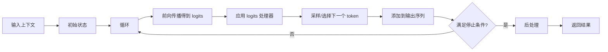

# 生成策略详解

本文件详细解析文本生成的各种策略。

---

## 1. Generation 概述

`GenerationMixin` 为模型添加了文本生成能力，定义在 [src/transformers/generation/](file:///workspace/src/transformers/generation) 目录中。

### 1.1 核心功能

- 多种解码策略
- 灵活的配置
- 流输出支持
- 停止条件控制

---

## 2. 生成配置

使用 `GenerationConfig` 来控制生成：

```python
from transformers import GenerationConfig

config = GenerationConfig(
    max_new_tokens=100,
    do_sample=True,
    temperature=0.7,
    top_p=0.95,
)

model.generate(inputs, generation_config=config)
```

---

## 3. 生成策略

### 3.1 贪婪搜索 (Greedy Search)

最简单的策略，每步选择概率最大的 token。

```python
model.generate(
    inputs,
    do_sample=False,
    num_beams=1
)
```

**特点**：
- 快速，但可能陷入局部最优
- 缺乏多样性

---

### 3.2 束搜索 (Beam Search)

同时维护多个候选序列。

```python
model.generate(
    inputs,
    do_sample=False,
    num_beams=5,
    num_return_sequences=5
)
```

**特点**：
- 比贪婪搜索质量高
- 计算代价更高
- 可能产生重复

---

### 3.3 采样 (Sampling)

基于概率分布随机采样。

```python
model.generate(
    inputs,
    do_sample=True,
    temperature=0.7
)
```

**参数**：
- `temperature`：控制随机性，值越高越随机

---

### 3.4 Top-K 采样

只从概率最高的 K 个 token 中采样。

```python
model.generate(
    inputs,
    do_sample=True,
    top_k=50
)
```

---

### 3.5 Top-P 采样 (Nucleus Sampling)

从累计概率达到 P 的最小词集合中采样。

```python
model.generate(
    inputs,
    do_sample=True,
    top_p=0.95
)
```

---

### 3.6 对比搜索 (Contrastive Search)

平衡一致性和多样性的方法。

```python
model.generate(
    inputs,
    penalty_alpha=0.6,
    top_k=4
)
```

---

## 4. 生成流程



---

## 5. 关键参数

### 5.1 长度控制

```python
model.generate(
    inputs,
    max_new_tokens=100,       # 最大生成 token 数
    min_length=10,            # 最小长度
    early_stopping=True        # 是否早停
)
```

### 5.2 惩罚机制

```python
model.generate(
    inputs,
    repetition_penalty=1.2,     # 重复惩罚
    no_repeat_ngram_size=2      # 避免重复的 n-gram
)
```

### 5.3 Logits 处理

```python
model.generate(
    inputs,
    temperature=0.7,          # 温度
    top_k=50,              # top-k
    top_p=0.95,            # top-p
    typical_p=0.95,         # typical sampling
    epsilon_cutoff=0.0001,   # epsilon cutoff
    eta_cutoff=0.0001,      # eta cutoff
)
```

### 5.4 特殊 token

```python
model.generate(
    inputs,
    bos_token_id=0,         # 开始 token
    eos_token_id=1,         # 结束 token
    pad_token_id=2,         # 填充 token
    forced_bos_token_id=0,    # 强制开始 token
    forced_eos_token_id=1     # 强制结束 token
)
```

---

## 6. 停止条件

可以自定义停止条件：

```python
from transformers import StoppingCriteria, StoppingCriteriaList

class MyStoppingCriteria(StoppingCriteria):
    def __call__(self, input_ids, scores, **kwargs):
        # 自定义停止逻辑
        should_stop = ...
        return should_stop

model.generate(
    inputs,
    stopping_criteria=StoppingCriteriaList([MyStoppingCriteria()])
)
```

---

## 7. 流式输出

```python
from transformers import TextStreamer

streamer = TextStreamer(tokenizer)

model.generate(
    inputs,
    streamer=streamer
)
```

---

## 8. 完整示例

```python
from transformers import AutoModelForCausalLM, AutoTokenizer

model = AutoModelForCausalLM.from_pretrained("gpt2")
tokenizer = AutoTokenizer.from_pretrained("gpt2")

inputs = tokenizer("Once upon a time", return_tensors="pt")

# 生成
outputs = model.generate(
    **inputs,
    max_new_tokens=50,
    do_sample=True,
    temperature=0.7,
    top_p=0.95,
    repetition_penalty=1.1,
)

# 解码
print(tokenizer.decode(outputs[0], skip_special_tokens=True))
```
