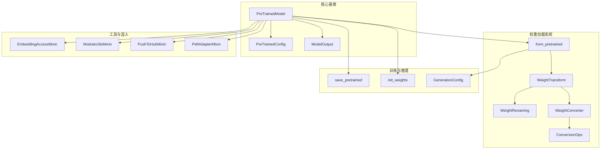

# Hugging Face Transformers 模型系统深度分析

> 基于 Transformers V5 源码，涵盖 PreTrainedModel 基类、权重加载/转换/融合、初始化策略、模型输出、通用层与动态模块加载

---

## 目录

1. [PreTrainedModel 基类](#1-pretrainedmodel-基类)
2. [from_pretrained 完整流程](#2-from_pretrained-完整流程)
3. [save_pretrained 与权重回写](#3-save_pretrained-与权重回写)
4. [V5 WeightConverter 新 API](#4-v5-weightconverter-新-api)
5. [权重转换映射 (conversion_mapping)](#5-权重转换映射-conversion_mapping)
6. [算子融合映射 (fusion_mapping)](#6-算子融合映射-fusion_mapping)
7. [权重初始化策略 (initialization)](#7-权重初始化策略-initialization)
8. [模型输出 dataclass (modeling_outputs)](#8-模型输出-dataclass-modeling_outputs)
9. [通用层 (modeling_layers)](#9-通用层-modeling_layers)
10. [动态模块加载 (dynamic_module_utils)](#10-动态模块加载-dynamic_module_utils)
11. [模块间关系总览](#11-模块间关系总览)

---

## 模型系统架构总览



---

## 1. PreTrainedModel 基类

**文件**: `src/transformers/modeling_utils.py`

### 模块职责

`PreTrainedModel` 是所有 Transformers 模型的基类，承担以下核心职责：

- 定义模型公共接口（`from_pretrained`、`save_pretrained`、`init_weights` 等）
- 管理配置（`config`）、设备映射（`device_map`）、数据类型（`dtype`）
- 协调权重共享（tied weights）、梯度检查点、注意力机制分发
- 整合量化、张量并行、DeepSpeed 等分布式/加速后端

### 类继承体系

```python
class PreTrainedModel(nn.Module, EmbeddingAccessMixin, ModuleUtilsMixin, PushToHubMixin, PeftAdapterMixin):
```

多重继承了五个 Mixin：

| Mixin | 职责 |
|-------|------|
| `EmbeddingAccessMixin` | 输入/输出 embedding 的获取与设置 |
| `ModuleUtilsMixin` | 设备管理、dtype 转换、内存估算等工具方法 |
| `PushToHubMixin` | 推送模型到 Hugging Face Hub |
| `PeftAdapterMixin` | PEFT 适配器加载/管理 |

### 核心类属性

```python
class PreTrainedModel(nn.Module, ...):
    config_class: type[PreTrainedConfig] | None = None   # 配置类
    base_model_prefix: str = ""                           # 基础模型前缀（如 "model"）
    main_input_name: str = "input_ids"                    # 主输入名

    # 设备映射相关
    _no_split_modules: set[str] | list[str] | None = None
    _skip_keys_device_placement: set[str] | list[str] | None = None

    # dtype 特殊处理
    _keep_in_fp32_modules: set[str] | list[str] | None = None       # fp16 时保持 fp32
    _keep_in_fp32_modules_strict: set[str] | list[str] | None = None # fp16/bf16 都保持 fp32

    # 权重共享
    _tied_weights_keys: dict[str, str] = None             # {"target": "source"} 映射

    # 注意力机制支持
    _supports_sdpa: bool = False
    _supports_flash_attn: bool = False
    _supports_flex_attn: bool = False

    # 张量并行
    _tp_plan: dict[str, str] = None                       # {"model.layer.mlp.param": "colwise"}
    _pp_plan: dict[str, tuple[str, str]] = None           # 流水线并行计划

    # 梯度检查点
    supports_gradient_checkpointing: bool = False
```

### `__init_subclass__` — 自动推断 config_class

```python
def __init_subclass__(cls, **kwargs):
    super().__init_subclass__(**kwargs)
    # 优先级：子类显式定义 > 子类注解 > 全局显式定义 > 全局注解
    child_annotation = inspect.get_annotations(cls).get("config", None)
    child_attribute = cls.__dict__.get("config_class", None)
    # ... 按优先级设置 cls.config_class
```

**设计原理**：V5 引入了类型注解推断 `config_class`，模型只需声明 `config: LlamaConfig` 即可自动绑定，无需显式赋值 `config_class = LlamaConfig`。

### `__init__` — 初始化流程

```python
def __init__(self, config: PreTrainedConfig, *inputs, **kwargs):
    super().__init__()
    self.config = config
    # 检查并设置注意力实现
    self.config._attn_implementation_internal = self._check_and_adjust_attn_implementation(...)
    # 检查并设置专家实现
    self.config._experts_implementation_internal = self._check_and_adjust_experts_implementation(...)
    # 如果可生成，创建 generation_config
    if self.can_generate():
        self.generation_config = GenerationConfig.from_model_config(config)
    # 自动推断 loss_type
    loss_type = self.__class__.__name__
    if loss_type not in LOSS_MAPPING:
        loss_groups = f"({'|'.join(LOSS_MAPPING)})"
        loss_type = re.findall(loss_groups, self.__class__.__name__)
        ...
    self.loss_type = loss_type
```

### `post_init` — 初始化后处理

`post_init` 是每个模型 `__init__` 末尾必须调用的方法，负责：

1. **收集子模型属性**：递归遍历 `named_children()`，将子模型的 `_tp_plan`、`_pp_plan`、`all_tied_weights_keys`、`_keep_in_fp32_modules`、`_no_split_modules` 等属性聚合到顶层模型
2. **初始化权重**：调用 `self.init_weights()`
3. **梯度检查点兼容**：`_backward_compatibility_gradient_checkpointing()`

```python
def post_init(self):
    self._tp_plan, self._ep_plan, self._pp_plan = {}, {}, {}
    # 基础模型从 config 获取并行计划
    if self.base_model is self:
        self._pp_plan = self.config.base_model_pp_plan.copy() if ... else {}
        self._tp_plan = self.config.base_model_tp_plan.copy() if ... else {}
    # 递归收集子模型属性
    for name, module in self.named_children():
        if plan := getattr(module, "_tp_plan", None):
            self._tp_plan.update({f"{name}.{k}": v for k, v in plan.copy().items()})
        ...
    self.init_weights()
    self._backward_compatibility_gradient_checkpointing()
```

### `init_weights` 与 `initialize_weights`

```python
def init_weights(self):
    if get_torch_context_manager_or_global_device() != torch.device("meta"):
        self.initialize_weights()  # 仅在非 meta 设备上初始化
    self.tie_weights(recompute_mapping=False)

def initialize_weights(self):
    # 使用 smart_apply 动态分派 _initialize_weights
    # 遇到子模型时，切换到子模型自己的 _initialize_weights
    smart_apply_fn = getattr(self, "smart_apply")
    smart_apply_fn(self._initialize_weights, self.is_remote_code())
```

**`smart_apply` 的设计原理**：复合模型（如 `LlavaForConditionalGeneration`）包含多个子模型（语言模型、视觉模型等），每个子模型可能有不同的 `_initialize_weights` 实现。`smart_apply` 在遍历模块树时，遇到 `PreTrainedModel` 子类就切换到该子模型的初始化函数，避免在顶层 `_init_weights` 中手动递归。

### 权重共享（tied weights）

```python
def tie_weights(self, missing_keys=None, recompute_mapping=True):
    tied_keys = self.all_tied_weights_keys  # {target: source} 映射
    for target_param_name, source_param_name in tied_keys.items():
        # from_pretrained 时支持对称绑定：如果 source 缺失但 target 存在，交换两者
        if missing_keys is not None:
            source_is_there = source_param_name not in missing_keys
            target_is_there = target_param_name not in missing_keys
            if not source_is_there and target_is_there:
                target_param_name, source_param_name = source_param_name, target_param_name
        # 执行实际绑定
        source_param = self.get_parameter_or_buffer(source_param_name)
        setattr(parent, name, source_param)
```

### ALL_ATTENTION_FUNCTIONS — 注意力机制分发

```python
class AttentionInterface(GeneralInterface):
    _global_mapping = {
        "flash_attention_4": flash_attention_forward,
        "flash_attention_3": flash_attention_forward,
        "flash_attention_2": flash_attention_forward,
        "flex_attention": flex_attention_forward,
        "sdpa": sdpa_attention_forward,
        "paged|flash_attention_4": paged_attention_forward,
        "paged|flash_attention_3": paged_attention_forward,
        "paged|flash_attention_2": paged_attention_forward,
        "paged|sdpa": sdpa_attention_paged_forward,
        "paged|eager": eager_paged_attention_forward,
    }

    def get_interface(self, attn_implementation, default):
        if attn_implementation != "eager" and attn_implementation not in self:
            raise KeyError(...)
        return super().get(attn_implementation, default)

ALL_ATTENTION_FUNCTIONS: AttentionInterface = AttentionInterface()
```

**设计原理**：

- `AttentionInterface` 继承自 `GeneralInterface`（类似字典的注册表），支持 `register()` 动态注册新注意力实现
- 全局单例 `ALL_ATTENTION_FUNCTIONS` 被所有模型共享；模型如需覆盖特定实现，可创建新的 `AttentionInterface` 实例
- `paged|` 前缀表示分页注意力变体，用于 KV cache 分页管理
- 模型通过 `config._attn_implementation` 选择实现，`_check_and_adjust_attn_implementation` 自动降级不支持的实现

---

## 2. from_pretrained 完整流程

**文件**: `src/transformers/modeling_utils.py` L3789-L4314

`from_pretrained` 是 Transformers 最核心的类方法，负责从预训练 checkpoint 实例化模型。以下是其完整流程：

### 流程图

```mermaid
flowchart TD
    Start[from_pretrained] --> P1[1. 参数解析与兼容性处理]
    P1 --> C1[提取 kwargs dtype, device_map, quantization_config]
    C1 --> C2[torch_dtype → dtype 兼容]
    C2 --> C3[TP 初始化 tp_plan/tp_size → device_mesh]
    
    C3 --> P2[2. 加载配置]
    P2 --> D1[config = config_class.from_pretrained]
    D1 --> D2[递归设置子配置的 dtype]
    
    D2 --> P3[3. 量化器初始化]
    P3 --> Q1[hf_quantizer, config, device_map = get_hf_quantizer]
    
    Q1 --> P4[4. 解析 checkpoint 文件]
    P4 --> Chk1[checkpoint_files, sharded_metadata = _get_resolved_checkpoint_files]
    
    Chk1 --> P5[5. 确定 dtype]
    P5 --> Dt1[config, dtype = _get_dtype]
    
    Dt1 --> P6[6. 注册融合补丁]
    P6 --> F1[register_fusion_patches cls, config, fusion_config]
    
    F1 --> P7[7. 在上下文管理器中实例化模型]
    P7 --> IC1[model_init_context = cls.get_init_context dtype]
    IC1 --> IC2[local_torch_dtype dtype]
    IC2 --> IC3[no_tie_weights]
    IC3 --> IC4[apply_patches]
    IC4 --> IC5[torch.device meta]
    IC5 --> IC6[meta_device_safe_creation_ops]
    IC6 --> IC7[with ContextManagers]
    IC7 --> IC8[model = cls config]
    
    IC8 --> P8[8. 量化预处理]
    P8 --> QP1[hf_quantizer.preprocess_model model]
    
    QP1 --> P9[9. 获取权重转换映射]
    P9 --> W1[weight_conversions = get_model_conversion_mapping]
    
    W1 --> P10[10. 张量并行分发]
    P10 --> TP1[model = distribute_model model, tp_plan]
    
    TP1 --> P11[11. 准备设备映射]
    P11 --> Dev1[device_map = _get_device_map model, device_map, max_memory]
    
    Dev1 --> P12[12. 加载权重]
    P12 --> Ld1[LoadStateDictConfig]
    Ld1 --> Ld2[_load_pretrained_model model, state_dict, checkpoint_files]
    Ld2 --> Ld3[safetensors 延迟加载 get_slice]
    Ld2 --> Ld4[.bin 全量加载]
    Ld3 --> Ld5[convert_and_load_state_dict_in_model]
    Ld4 --> Ld5
    Ld5 --> Ld6[_finalize_model_loading model]
    Ld6 --> Ld7[mark_tied_weights_as_initialized]
    Ld7 --> Ld8[_move_missing_keys_from_meta_to_device]
    Ld8 --> Ld9[_initialize_missing_keys]
    Ld9 --> Ld10[tie_weights]
    
    Ld10 --> P13[13. 设备分发]
    P13 --> Acc1[accelerate_dispatch model]
    
    Acc1 --> P14[14. 后处理]
    P14 --> Post1[model.eval]
    Post1 --> Post2[hf_quantizer.postprocess_model model]
    Post2 --> Post3[加载 generation_config / adapter]
    
    Post3 --> End[返回 model]
    
    style End fill:#ccffcc
```



### 关键设计决策

**Meta 设备初始化**：V5 统一在 `torch.device("meta")` 上创建模型，所有参数都是空壳（无数据），然后在 `_load_pretrained_model` 中逐个填充实际权重。这避免了先在 CPU 上初始化全精度权重再覆盖的低效模式。

**延迟物化（Lazy Materialization）**：对 safetensors 格式，使用 `get_slice()` 获取张量切片描述而非实际数据，直到 `convert_and_load_state_dict_in_model` 中才真正读取和转换。

**异步加载**：默认使用 `ThreadPoolExecutor` 并行读取和转换权重，仅在磁盘卸载或即时量化时退化为同步。

### `get_init_context` — 初始化上下文管理器

```python
@classmethod
def get_init_context(cls, dtype, is_quantized, _is_ds_init_called, allow_all_kernels):
    init_contexts = [
        local_torch_dtype(dtype, cls.__name__),  # 设置默认 dtype
        init.no_tie_weights(),                     # 禁止权重绑定
        apply_patches(),                           # 应用 monkey patch
    ]
    if allow_all_kernels:
        init_contexts.append(allow_all_hub_kernels())
    if is_deepspeed_zero3_enabled():
        if not is_quantized and not _is_ds_init_called:
            init_contexts.extend([
                init.no_init_weights(),             # 跳过权重初始化
                deepspeed.zero.Init(...),           # DeepSpeed ZeRO-3 初始化
                set_zero3_state(),
            ])
        elif is_quantized:
            init_contexts.extend([torch.device("meta"), set_quantized_state()])
    else:
        init_contexts.extend([
            torch.device("meta"),                   # meta 设备
            init.meta_device_safe_creation_ops(),   # 安全的 linspace
        ])
    return init_contexts
```

---

## 3. save_pretrained 与权重回写

**文件**: `src/transformers/modeling_utils.py` L3274-L3473

### 核心流程

```
save_pretrained(save_directory, ...)
  │
  ├─ 1. 量化器检查（是否可序列化）
  ├─ 2. 保存 config 和 generation_config
  ├─ 3. 获取 state_dict
  │     ├─ 量化模型: hf_quantizer.get_state_dict_and_metadata(self)
  │     └─ 普通模型: model_to_save.state_dict()
  ├─ 4. TP 分片收集: gather_state_dict_for_save(...)
  ├─ 5. 移除绑定权重: remove_tied_weights_from_state_dict(...)
  ├─ 6. 反向权重转换: revert_weight_conversion(model, state_dict)
  │     └─ 将模型内部命名空间映射回原始 checkpoint 命名空间
  ├─ 7. 分片保存: split_torch_state_dict_into_shards(...)
  └─ 8. 写入 safetensors 文件
```

### `revert_weight_conversion` — 反向转换

保存时需要将模型内部的权重名映射回 checkpoint 的原始命名空间。这是加载时 `WeightConverter`/`WeightRenaming` 的逆操作：

```python
def revert_weight_conversion(model, state_dict):
    weight_conversions = getattr(model, "_weight_conversions", None)
    if weight_conversions is None:
        weight_conversions = get_model_conversion_mapping(model, add_legacy=False)
    # 反转顺序（先应用的转换后撤销）
    weight_conversions = weight_conversions[::-1]
    # 两阶段保存：先反向 converter，再反向 renaming
    inverted_transforms = [transform.reverse_transform() for transform in weight_conversions]
    ...
```

**两阶段设计**：`WeightConverter` 的输出可能被后续 `WeightRenaming` 再次重命名，因此反向操作需要分两阶段：先撤销 converter，再撤销 renaming。

---

## 4. V5 WeightConverter 新 API

**文件**: `src/transformers/core_model_loading.py`

### 模块职责

V5 引入了全新的权重转换 API，用于在加载/保存 checkpoint 时对权重进行重命名、拆分、合并、转置等操作。核心目标是：

1. **兼容不同 checkpoint 格式**：上游 checkpoint 的权重命名可能与 Transformers 内部命名不一致
2. **支持 MoE 模型**：专家权重的合并/拆分（如 `experts.*.w1` → `experts.gate_up_proj`）
3. **支持算子融合**：如 Conv3d → Linear 的权重重排
4. **可逆操作**：每个转换都有 `reverse_op`，保证 save 时能还原

### 核心类层次

```
ConversionOps (抽象基类)
  ├─ Chunk(dim)              — 沿维度拆分
  ├─ Concatenate(dim)        — 沿维度拼接
  ├─ MergeModulelist(dim)    — 将 ModuleList 张量堆叠
  ├─ SplitModulelist(dim)    — 拆分 ModuleList 张量
  ├─ Transpose(dim0, dim1)   — 转置
  ├─ Conv3dToLinear          — Conv3d 权重展平为 Linear
  ├─ LinearToConv3d          — Linear 权重重排为 Conv3d
  ├─ PermuteForRope          — RoPE 权重排列
  ├─ ErnieFuseAndSplitTextVisionExperts — ERNIE 多模态专家融合
  └─ ErnieSplitAndDecoupleTextVisionExperts — ERNIE 反向拆分

WeightTransform (基类)
  ├─ WeightRenaming          — 仅重命名（1:1 映射）
  │   └─ PrefixChange        — 添加/移除前缀
  └─ WeightConverter         — 重命名 + 转换操作（支持 1:N, N:1, N:M）
```

### WeightTransform — 转换基类

```python
class WeightTransform:
    __slots__ = (
        "source_patterns",     # 源模式列表（支持正则）
        "target_patterns",     # 目标模式列表
        "compiled_sources",    # 编译后的正则
        "distributed_operation",  # TP 分片操作
        "quantization_operation", # 量化操作
        "collected_tensors",   # 收集的张量（Future/Callable/Tensor）
        "layer_targets",       # 目标键映射
        "scope_prefix",        # 作用域前缀（子模型隔离）
        "_was_used",           # 是否匹配到任何权重
    )
```

**核心方法**：

- `rename_source_key(source_key)` — 将 checkpoint 中的键名重命名为模型内部键名
- `add_tensor(target_key, source_key, source_pattern, future)` — 收集异步加载的张量
- `materialize_tensors()` — 物化所有收集的张量（等待 Future / 调用 Callable）
- `reverse_transform()` — 生成反向转换（用于 save）

### WeightRenaming — 纯重命名

```python
class WeightRenaming(WeightTransform):
    __slots__ = ()

    def convert(self, layer_name, model=None, config=None, hf_quantizer=None, loading_info=None):
        collected_tensors = self.materialize_tensors()
        target_key = self.target_patterns[0]
        collected_tensors = {target_key: collected_tensors[self.source_patterns[0]]}
        # 可选：应用量化操作
        if hf_quantizer is not None and self.quantization_operation is not None:
            collected_tensors = self.quantization_operation.convert(...)
        return collected_tensors
```

**示例**：将 checkpoint 中的 `attention.query` 重命名为模型内部的 `attention.q_proj`：

```python
WeightRenaming("attention.query", "attention.q_proj")
```

### PrefixChange — 前缀操作

```python
class PrefixChange(WeightRenaming):
    def __init__(self, prefix_to_add=None, prefix_to_remove=None, model_prefix=None):
        if prefix_to_add is not None:
            super().__init__(
                source_patterns=rf"^{prefix}(?:(?!{prefix_to_add}\.))(.+)$",
                target_patterns=rf"{prefix}{prefix_to_add}\.\1",
            )
        else:
            super().__init__(
                source_patterns=rf"^{prefix}{prefix_to_remove}\.(.+)$",
                target_patterns=rf"{prefix}\1"
            )
```

**示例**：

```python
PrefixChange(prefix_to_remove="vision_model")  # vision_model.xxx → xxx
PrefixChange(prefix_to_add="model", model_prefix="model")  # xxx → model.xxx
```

### WeightConverter — 重命名 + 转换操作

```python
class WeightConverter(WeightTransform):
    __slots__ = ("operations",)

    def __init__(self, source_patterns, target_patterns, operations: list[ConversionOps]):
        super().__init__(source_patterns, target_patterns)
        self.operations = operations
        # 验证：只允许 1:1, 1:N, N:1，N:M 仅限内部操作
        if bool(len(self.source_patterns) - 1) + bool(len(self.target_patterns) - 1) >= 2:
            if not any(isinstance(op, _INTERNAL_MANY_TO_MANY_CONVERSIONS) for op in self.operations):
                raise ValueError(...)

    def convert(self, layer_name, model=None, config=None, hf_quantizer=None, loading_info=None):
        collected_tensors = self.materialize_tensors()
        # 链式执行所有操作
        for op in self.operations:
            collected_tensors = op.convert(
                collected_tensors,
                source_patterns=self.source_patterns,
                target_patterns=self.target_patterns,
                ...
            )
        return collected_tensors
```

**MoE 示例**：Mixtral 风格的专家权重合并

```python
WeightConverter(
    source_patterns=[".experts.*.w1.weight", ".experts.*.w3.weight"],
    target_patterns=".experts.gate_up_proj",
    operations=[
        MergeModulelist(dim=0),   # 堆叠每个专家的 w1 和 w3
        Concatenate(dim=1),       # 拼接 gate 和 up
    ],
)
```

执行过程：
1. 收集 `experts.0.w1.weight`, `experts.1.w1.weight`, ..., `experts.7.w1.weight` 和对应的 `w3`
2. `MergeModulelist(dim=0)` → 将 8 个 w1 堆叠，8 个 w3 堆叠
3. `Concatenate(dim=1)` → 拼接 gate 和 up → `experts.gate_up_proj`

### `convert_and_load_state_dict_in_model` — 核心加载函数

**文件**: `src/transformers/core_model_loading.py` L1202-L1483

这是权重加载的核心引擎，负责：

1. **键名重命名**：根据 `WeightRenaming`/`WeightConverter` 的 `source_patterns` 将 checkpoint 键名映射到模型内部键名
2. **张量收集**：将重命名后的张量收集到对应的 `WeightTransform` 实例中
3. **异步物化**：使用 `ThreadPoolExecutor` 并行读取和转换
4. **转换执行**：链式执行 `ConversionOps`
5. **参数设置**：将转换后的张量设置到模型参数中

```python
def convert_and_load_state_dict_in_model(model, state_dict, load_config, tp_plan, disk_offload_index=None):
    # 分离 renaming 和 converter
    renamings = [entry for entry in weight_mapping if isinstance(entry, WeightRenaming)]
    converters = [entry for entry in weight_mapping if isinstance(entry, WeightConverter)]

    # 遍历 state_dict 中的每个键
    for original_key, tensor in state_dict:
        # 1. 重命名
        renamed_key, source_pattern = rename_source_key(original_key, renamings, converters, ...)
        # 2. 收集到对应的 transform
        if source_pattern is not None:
            mapping = param_name_to_load.setdefault(renamed_key, deepcopy(pattern_to_converter[source_pattern]))
        else:
            mapping = param_name_to_load.setdefault(renamed_key, WeightRenaming(original_key, renamed_key))
        # 3. 处理 dtype/TP/量化
        # 4. 异步物化
        future_or_tensor = spawn_materialize(thread_pool, tensor, param_device, _dtype)
        mapping.add_tensor(renamed_key, original_key, source_pattern, future_or_tensor)

    # 执行所有转换
    for first_param_name, mapping in tqdm(param_name_to_load.items(), desc="Loading weights"):
        realized_value = mapping.convert(first_param_name, model=model, ...)
        for target_name, param in realized_value.items():
            set_param_for_module(model, target_name, param, ...)
```

---

## 5. 权重转换映射 (conversion_mapping)

**文件**: `src/transformers/conversion_mapping.py`

### 模块职责

维护一个全局注册表 `_MODEL_TO_CONVERSION_PATTERN`，将模型类型/类名映射到对应的 `WeightTransform` 列表。这是权重转换的"配置中心"。

### 核心数据结构

```python
_MODEL_TO_CONVERSION_PATTERN = {
    # 别名映射：多个模型共享同一套转换规则
    "minimax": "mixtral",
    "deepseek_v3": "qwen2_moe",
    "gemma3": "llava",
    # 类名映射
    "PaliGemmaModel": "LlavaModel",
    "Qwen2_5_VLForConditionalGeneration": "Qwen2VLForConditionalGeneration",
    # ViT 风格视觉模型
    "ASTModel": "ViTModel",
    "BeitModel": "ViTModel",
    ...
}
```

### `_build_checkpoint_conversion_mapping` — 构建映射表

此函数构建完整的 `{model_type: [WeightTransform]}` 映射，包含所有模型的转换规则：

```python
def _build_checkpoint_conversion_mapping():
    mapping = {
        "ViTModel": [
            WeightRenaming(r"encoder\.layer\.", "layers."),
            WeightRenaming("attention.query", "q_proj"),
            WeightRenaming("attention.key", "k_proj"),
            WeightRenaming("attention.value", "v_proj"),
            WeightRenaming("attention.output.dense", "attention.o_proj"),
            WeightRenaming("intermediate.dense", "mlp.fc1"),
            WeightRenaming("output.dense", "mlp.fc2"),
        ],
        "mixtral": [
            WeightRenaming(".block_sparse_moe.", ".mlp."),
            WeightConverter(
                source_patterns=[".experts.*.w1.weight", ".experts.*.w3.weight"],
                target_patterns=".experts.gate_up_proj",
                operations=[MergeModulelist(dim=0), Concatenate(dim=1)],
            ),
            WeightConverter(
                source_patterns=".experts.*.w2.weight",
                target_patterns=".experts.down_proj",
                operations=[MergeModulelist(dim=0)],
            ),
        ],
        "deepseek_v4": [
            # 两阶段：先结构性前缀重命名，再特定键重命名
            # Pass 1: 结构性前缀
            WeightRenaming(r"^layers\.(\d+)\.attn\.", r"layers.\1.self_attn."),
            WeightRenaming(r"^layers\.(\d+)\.ffn\.", r"layers.\1.mlp."),
            # Pass 2: 特定键
            WeightRenaming(r"^layers\.(\d+)\.self_attn\.wq_a\.", r"layers.\1.self_attn.q_a_proj."),
            ...
        ],
        ...
    }
    return mapping
```

### `get_model_conversion_mapping` — 获取模型的转换列表

```python
def get_model_conversion_mapping(model, key_mapping=None, hf_quantizer=None, add_legacy=True):
    weight_conversions = []

    # 1. 用户提供的 key_mapping
    if key_mapping is not None:
        weight_conversions = [WeightRenaming(source_patterns=k, target_patterns=v) for k, v in key_mapping.items()]

    # 2. 遍历模型的所有子模块
    seen_identifiers = defaultdict(list)
    for module_name, submodule in model.named_modules():
        if not isinstance(submodule, PreTrainedModel):
            continue
        # 先按类名查找，再按 model_type 查找
        conversions = get_checkpoint_conversion_mapping(class_name)
        if conversions is None:
            conversions = get_checkpoint_conversion_mapping(model_type)
        if conversions is None:
            continue
        # 非根模型需要设置 scope_prefix
        if module_name != "":
            for transform in conversions:
                transform.scope_prefix = module_name
        weight_conversions.extend(conversions)

    # 3. 添加 legacy 映射
    if add_legacy:
        weight_conversions.extend(get_checkpoint_conversion_mapping("legacy"))

    # 4. 量化器可修改转换管线
    if hf_quantizer is not None:
        weight_conversions = hf_quantizer.update_weight_conversions(weight_conversions)

    return weight_conversions
```

**设计要点**：

- **类名优先**：`LlavaForConditionalGeneration` 和 `LlavaModel` 可以有不同的转换规则
- **scope_prefix 隔离**：子模型的转换只匹配该子模块前缀下的键
- **去重**：`seen_identifiers` 防止父模型和子模型重复应用同一套转换
- **量化器注入**：FP8 量化器可以在现有 converter 前插入 `Fp8Dequantize` 操作

---

## 6. 算子融合映射 (fusion_mapping)

**文件**: `src/transformers/fusion_mapping.py`

### 模块职责

提供运行时算子融合的注册与发现机制。融合（Fusion）是将多个模块替换为功能等价但更高效的单一模块，例如将 Conv3d patch embedding 替换为 Linear 投影。

### 核心类

#### `ModuleFusionSpec` — 融合规范基类

```python
class ModuleFusionSpec:
    target_modules_patterns: tuple[str, ...] = ()  # 目标模块名模式

    def is_fusable(self, module: nn.Module) -> bool: ...       # 是否可融合
    def make_fused_class(self, original_cls: type) -> type: ... # 创建融合类
    def make_transforms(self, config) -> list[WeightTransform]: ... # 创建权重转换
```

#### `PatchEmbeddingsFusionSpec` — Conv3d → Linear 融合

```python
class PatchEmbeddingsFusionSpec(ModuleFusionSpec):
    target_modules_patterns = (r"(^|\.)patch_embed$",)

    def is_fusable(self, module):
        proj = getattr(module, "proj", None)
        if not isinstance(proj, nn.Conv3d):
            return False
        # 仅当无重叠时才融合
        return (proj.stride == proj.kernel_size and proj.padding == (0,0,0)
                and proj.dilation == (1,1,1) and proj.groups == 1)

    def make_fused_class(self, original_cls):
        # 动态创建 Fused{ClassName}，混入 _FusedPatchEmbeddingMixin
        fused_cls = type(f"Fused{original_cls.__name__}", (_FusedPatchEmbeddingMixin, original_cls), {})
        return fused_cls

    def make_transforms(self, config):
        return [
            WeightConverter(
                source_patterns=r"patch_embed\.proj\.weight$",
                target_patterns=r"patch_embed\.linear_proj\.weight$",
                operations=[Conv3dToLinear(in_channels=..., kernel_size=...)],
            ),
            WeightRenaming(
                source_patterns=r"patch_embed\.proj\.bias$",
                target_patterns=r"patch_embed\.linear_proj\.bias$",
            ),
        ]
```

### 融合注册流程

```python
_FUSION_REGISTRY = {"patch_embeddings": PatchEmbeddingsFusionSpec()}

def register_fusion_patches(cls, config, fusion_config):
    for fusion_name in _iter_enabled_fusions(fusion_config):
        _register_module_fusion(cls, config, fusion_name, _FUSION_REGISTRY[fusion_name])

def _register_module_fusion(cls, config, fusion_name, spec):
    # 1. 发现可融合模块
    fusable_classes = _discover_fusable_modules(cls, config, fusion_name, spec)
    # 2. 注册 monkey patch（替换模块类）
    register_patch_mapping(fusable_classes, overwrite=True)
    # 3. 注册 checkpoint 转换（处理权重格式差异）
    converters = spec.make_transforms(config)
    register_checkpoint_conversion_mapping(model_type, converters, overwrite=True)
```

### `_discover_fusable_modules` — 发现可融合模块

```python
def _discover_fusable_modules(cls, config, fusion_name, spec):
    # 在 meta 设备上实例化模型
    with torch.device("meta"):
        model = cls(config)
    # 扫描所有模块
    for module_name, module in model.named_modules():
        if target_module_pattern is not None and target_module_pattern.search(module_name) is None:
            continue
        if not spec.is_fusable(module):
            continue
        # 创建融合类并记录
        patch_mapping[module_cls.__name__] = spec.make_fused_class(module_cls)
    return patch_mapping
```

**设计原理**：融合发生在模型实例化之前（`from_pretrained` 步骤 6），通过 monkey patch 替换模块类，使得模型初始化时直接使用融合后的类。同时注册对应的权重转换，确保 checkpoint 中的原始权重格式能正确加载到融合后的模块中。

---

## 7. 权重初始化策略 (initialization)

**文件**: `src/transformers/initialization.py`

### 模块职责

提供权重初始化的防护机制，防止已加载的预训练权重被意外重新初始化。

### 核心设计：`_is_hf_initialized` 标记

每个 `torch.nn.Parameter` 和 `torch.Tensor` 都可以附加一个 `_is_hf_initialized` 属性。当权重从 checkpoint 加载后，该标记被设为 `True`，后续的初始化函数会跳过该参数。

```python
def normal_(tensor, mean=0.0, std=1.0, generator=None):
    if not getattr(tensor, "_is_hf_initialized", False):
        return TORCH_INIT_FUNCTIONS["normal_"](tensor, mean=mean, std=std, generator=generator)
    return tensor  # 已初始化，跳过
```

### 所有受保护的初始化函数

```python
TORCH_INIT_FUNCTIONS = {
    "uniform_": torch.nn.init.uniform_,
    "normal_": torch.nn.init.normal_,
    "constant_": torch.nn.init.constant_,
    "ones_": torch.nn.init.ones_,
    "zeros_": torch.nn.init.zeros_,
    "eye_": torch.nn.init.eye_,
    "dirac_": torch.nn.init.dirac_,
    "xavier_uniform_": torch.nn.init.xavier_uniform_,
    "xavier_normal_": torch.nn.init.xavier_normal_,
    "kaiming_uniform_": torch.nn.init.kaiming_uniform_,
    "kaiming_normal_": torch.nn.init.kaiming_normal_,
    "trunc_normal_": torch.nn.init.trunc_normal_,
    "orthogonal_": torch.nn.init.orthogonal_,
    "sparse_": torch.nn.init.sparse_,
}
```

每个函数都被包装为：检查 `_is_hf_initialized`，若已初始化则跳过。

### 上下文管理器

#### `guard_torch_init_functions` — 全局防护

```python
@contextmanager
def guard_torch_init_functions():
    originals = defaultdict(dict)
    try:
        for module_name in TORCH_MODULES_TO_PATCH:
            if module_name in sys.modules:
                module = sys.modules[module_name]
                for func_name in TORCH_INIT_FUNCTIONS.keys():
                    if hasattr(module, func_name):
                        originals[module][func_name] = getattr(module, func_name)
                        setattr(module, func_name, globals()[func_name])
        yield
    finally:
        for module, functions in originals.items():
            for func_name, func in functions.items():
                setattr(module, func_name, func)
```

**设计原理**：PyTorch 内部模块（如 `torch.nn.modules.linear`）在 import 时就绑定了 `torch.nn.init` 的函数引用，直接修改 `torch.nn.init` 不会影响已绑定的引用。因此需要遍历所有可能引用这些函数的模块，逐一替换。

#### `no_init_weights` — 完全跳过初始化

```python
@contextmanager
def no_init_weights():
    def empty_func(*args, **kwargs):
        pass
    # 替换所有 torch init 函数为空函数
    for module_name in TORCH_MODULES_TO_PATCH:
        ...
    # 同时替换 PreTrainedModel.init_weights
    original_init_weights = PreTrainedModel.init_weights
    PreTrainedModel.init_weights = empty_func
    try:
        yield
    finally:
        # 恢复
        PreTrainedModel.init_weights = original_init_weights
```

用于 DeepSpeed ZeRO-3 等场景，模型初始化时不需要运行任何初始化逻辑。

#### `no_tie_weights` — 延迟权重绑定

```python
@contextmanager
def no_tie_weights():
    original_tie_weights = PreTrainedModel.tie_weights
    PreTrainedModel.tie_weights = empty_func
    try:
        yield
    finally:
        PreTrainedModel.tie_weights = original_tie_weights
```

在 `from_pretrained` 中，模型初始化时需要看到所有权重键（包括将被绑定的），因此延迟绑定到权重加载完成后。

#### `meta_device_safe_creation_ops` — 安全的 linspace

```python
@contextmanager
def meta_device_safe_creation_ops():
    original_linspace = torch.linspace
    def _safe_linspace(*args, **kwargs):
        kwargs.setdefault("device", "cpu")  # 默认 CPU 而非 meta
        return original_linspace(*args, **kwargs)
    torch.linspace = _safe_linspace
    try:
        yield
    finally:
        torch.linspace = original_linspace
```

**设计原理**：远程代码模型（remote code）可能在 `__init__` 中调用 `torch.linspace(...).item()` 计算 drop-path 概率等标量，在 meta 设备上这会崩溃。将 `linspace` 默认到 CPU 可以避免此问题。

### 自定义初始化函数

```python
def _variance_scaling(tensor, mode="fan_in", distribution="normal"):
    fan_in, fan_out = torch.nn.init._calculate_fan_in_and_fan_out(tensor)
    if mode == "fan_in":
        denom = fan_in
    elif mode == "fan_out":
        denom = fan_out
    elif mode == "fan_avg":
        denom = (fan_in + fan_out) / 2
    variance = 1.0 / denom
    if distribution == "truncated_normal":
        trunc_normal_(tensor, std=math.sqrt(variance) / 0.87962566103423978)
    elif distribution == "normal":
        normal_(tensor, std=math.sqrt(variance))
    elif distribution == "uniform":
        bound = math.sqrt(3 * variance)
        uniform_(tensor, -bound, bound)

def lecun_normal_(tensor):
    if not getattr(tensor, "_is_hf_initialized", False):
        _variance_scaling(tensor, mode="fan_in", distribution="truncated_normal")
    return tensor
```

---

## 8. 模型输出 dataclass (modeling_outputs)

**文件**: `src/transformers/modeling_outputs.py`

### 模块职责

定义所有模型输出类型的 dataclass，提供统一的、类型安全的返回值结构。

### 基类：`ModelOutput`

**文件**: `src/transformers/utils/generic.py` L379

```python
class ModelOutput(OrderedDict):
    """模型输出的基类，同时支持字典和元组访问"""
    def __init_subclass__(cls):
        _register_model_output_pytree_node(cls)  # 注册为 pytree 节点

    def __post_init__(self):
        # 安全检查：所有字段默认值必须为 None
        # 支持从迭代器构造（如旧式元组返回值）
        ...
```

**设计原理**：

- 继承 `OrderedDict`，同时支持 `output["key"]` 和 `output.key` 访问
- 支持 `__getitem__` 按整数索引（忽略 None 值），兼容旧式元组返回
- 注册为 PyTorch pytree 节点，支持 `torch.vmap` 和 DDP `static_graph=True`

### 输出类型层次

```
ModelOutput (OrderedDict)
  ├─ BaseModelOutput                          # last_hidden_state, hidden_states, attentions
  ├─ BaseModelOutputWithNoAttention           # 无注意力输出
  ├─ BaseModelOutputWithPooling               # + pooler_output
  ├─ BaseModelOutputWithPast                  # + past_key_values
  ├─ BaseModelOutputWithCrossAttentions       # + cross_attentions
  ├─ BaseModelOutputWithPoolingAndCrossAttentions
  ├─ BaseModelOutputWithPastAndCrossAttentions
  │
  ├─ MoEModelOutput                           # + router_probs, router_logits
  ├─ MoeModelOutputWithPast                   # + past_key_values
  ├─ MoeCausalLMOutputWithPast                # + loss, logits, aux_loss
  ├─ MoEModelOutputWithPastAndCrossAttentions
  │
  ├─ Seq2SeqModelOutput                       # encoder/decoder 分离
  ├─ Seq2SeqLMOutput                          # + loss, logits
  ├─ Seq2SeqSequenceClassifierOutput
  ├─ Seq2SeqQuestionAnsweringModelOutput
  │
  ├─ CausalLMOutputWithPast                   # 自回归语言模型
  ├─ CausalLMOutputWithCrossAttentions
  │
  ├─ MaskedLMOutput                           # 掩码语言模型
  ├─ NextSentencePredictorOutput
  ├─ SequenceClassifierOutput                 # 序列分类
  ├─ SequenceClassifierOutputWithPast
  ├─ TokenClassifierOutput                    # token 分类
  ├─ QuestionAnsweringModelOutput             # 问答
  ├─ MultipleChoiceModelOutput                # 多选
  ├─ ImageClassifierOutput                    # 图像分类
  ├─ SemanticSegmenterOutput                  # 语义分割
  ├─ BaseModelOutputWithPoolingAndProjection  # + projection
  └─ ... (更多任务特定输出)
```

### 典型输出 dataclass

```python
@dataclass
class CausalLMOutputWithPast(ModelOutput):
    loss: torch.FloatTensor | None = None
    logits: torch.FloatTensor | None = None
    past_key_values: Cache | None = None
    hidden_states: tuple[torch.FloatTensor, ...] | None = None
    attentions: tuple[torch.FloatTensor, ...] | None = None

@dataclass
class MoeCausalLMOutputWithPast(ModelOutput):
    loss: torch.FloatTensor | None = None
    aux_loss: torch.FloatTensor | None = None
    logits: torch.FloatTensor | None = None
    past_key_values: Cache | None = None
    hidden_states: tuple[torch.FloatTensor, ...] | None = None
    attentions: tuple[torch.FloatTensor, ...] | None = None
    router_logits: tuple[torch.FloatTensor] | None = None
```

---

## 9. 通用层 (modeling_layers)

**文件**: `src/transformers/modeling_layers.py`

### 模块职责

提供可复用的通用层和任务头 Mixin，减少各模型间的代码重复。

### GradientCheckpointingLayer

```python
class GradientCheckpointingLayer(nn.Module):
    """支持梯度检查点的层基类"""
    gradient_checkpointing = False

    def __call__(self, *args, **kwargs):
        if self.gradient_checkpointing and self.training:
            # 自动禁用与 GC 不兼容的缓存
            if "use_cache" in kwargs and kwargs["use_cache"]:
                kwargs["use_cache"] = False
            if "past_key_values" in kwargs and kwargs["past_key_values"] is not None:
                kwargs["past_key_values"] = None
            # 使用 checkpoint 函数
            return self._gradient_checkpointing_func(partial(super().__call__, **kwargs), *args)
        return super().__call__(*args, **kwargs)
```

**设计原理**：

- 梯度检查点与 KV cache 不兼容（检查点不存储中间激活，而 cache 需要它们）
- 自动检测并禁用 `use_cache`、`past_key_values`、`layer_past` 等缓存参数
- 使用 `functools.partial` 将 kwargs 绑定到 `__call__`，确保梯度正确传播

### GenericFor* — 通用任务头 Mixin

V5 引入了通用任务头 Mixin，让新模型只需继承即可获得标准的分类/问答/token分类能力：

#### GenericForSequenceClassification

```python
class GenericForSequenceClassification:
    base_model_prefix = "model"

    def __init__(self, config):
        super().__init__(config)
        self.num_labels = config.num_labels
        setattr(self, self.base_model_prefix, AutoModel.from_config(config))
        self.score = nn.Linear(config.get_text_config().hidden_size, self.num_labels, bias=False)
        self.post_init()

    def forward(self, input_ids=None, attention_mask=None, ..., labels=None, **kwargs):
        transformer_outputs = getattr(self, self.base_model_prefix)(input_ids, ...)
        hidden_states = transformer_outputs.last_hidden_state
        logits = self.score(hidden_states)
        # 处理左右填充
        pooled_logits = logits[torch.arange(batch_size), last_non_pad_token]
        loss = self.loss_function(logits=logits, labels=labels, pooled_logits=pooled_logits, config=self.config)
        return SequenceClassifierOutputWithPast(loss=loss, logits=pooled_logits, ...)
```

#### GenericForQuestionAnswering

```python
class GenericForQuestionAnswering:
    base_model_prefix = "model"

    def __init__(self, config):
        super().__init__(config)
        setattr(self, self.base_model_prefix, AutoModel.from_config(config))
        self.qa_outputs = nn.Linear(config.hidden_size, 2)
        self.post_init()

    def forward(self, ..., start_positions=None, end_positions=None, **kwargs):
        outputs = getattr(self, self.base_model_prefix)(...)
        logits = self.qa_outputs(outputs.last_hidden_state)
        start_logits, end_logits = logits.split(1, dim=-1)
        ...
```

#### GenericForTokenClassification

```python
class GenericForTokenClassification:
    base_model_prefix = "model"

    def __init__(self, config):
        super().__init__(config)
        self.num_labels = config.num_labels
        setattr(self, self.base_model_prefix, AutoModel.from_config(config))
        self.dropout = nn.Dropout(classifier_dropout)
        self.score = nn.Linear(config.get_text_config().hidden_size, config.num_labels)
        self.post_init()
```

**设计原理**：

- 使用 `setattr(self, self.base_model_prefix, ...)` 而非 `self.model = ...`，允许子类通过覆盖 `base_model_prefix` 改变属性名
- 使用 `AutoModel.from_config(config)` 自动创建基础模型
- `@can_return_tuple` 装饰器支持将输出转为元组
- `@auto_docstring` 自动生成文档字符串

---

## 10. 动态模块加载 (dynamic_module_utils)

**文件**: `src/transformers/dynamic_module_utils.py`

### 模块职责

支持从 Hugging Face Hub 加载自定义模型代码（trust_remote_code），将远程 Python 文件缓存到本地并动态导入。

### 核心流程

```
用户调用 AutoModel.from_pretrained("org/custom-model", trust_remote_code=True)
  │
  ├─ 1. 下载自定义 modeling 文件到缓存
  │     └─ get_cached_module_file(pretrained_model_name_or_path, "modeling_custom.py", ...)
  │
  ├─ 2. 检查依赖
  │     └─ check_imports(resolved_module_file) → 确保所有 import 的包都已安装
  │
  ├─ 3. 复制到动态模块缓存目录
  │     └─ HF_MODULES_CACHE/transformers_modules/{repo_name}/{commit_hash}/modeling_custom.py
  │
  └─ 4. 动态导入
        └─ get_class_in_module(class_name, module_path) → 从缓存目录 import 类
```

### 关键函数

#### `_sanitize_module_name` — 模块名清理

```python
def _sanitize_module_name(name: str) -> str:
    new_name = name.replace(".", "_dot_").replace("-", "_hyphen_")
    if new_name and new_name[0].isdigit():
        new_name = f"_{new_name}"
    # 检查是否为 Python 保留字
    if keyword.iskeyword(new_name):
        logger.warning(...)
    return new_name
```

#### `get_cached_module_file` — 获取缓存模块文件

```python
def get_cached_module_file(pretrained_model_name_or_path, module_file, ...):
    # 1. 下载或从缓存获取模块文件
    resolved_module_file = cached_file(pretrained_model_name_or_path, module_file, ...)
    # 2. 检查依赖
    modules_needed = check_imports(resolved_module_file)
    # 3. 创建动态模块目录
    full_submodule = TRANSFORMERS_DYNAMIC_MODULE_NAME + os.path.sep + submodule
    create_dynamic_module(full_submodule)
    # 4. 复制文件到缓存目录
    if is_local:
        shutil.copyfile(resolved_module_file, submodule_path / module_file)
    else:
        # 使用 commit hash 作为版本
        submodule_path = submodule_path / commit_hash
        shutil.copyfile(resolved_module_file, submodule_path / module_file)
    # 5. 返回模块路径
    return full_submodule_module_file_path
```

#### `get_class_in_module` — 动态导入类

```python
def get_class_in_module(class_name, module_path, *, force_reload=False):
    name = os.path.normpath(module_path).removesuffix(".py").replace(os.path.sep, ".")
    module_file = Path(HF_MODULES_CACHE) / module_path

    with _HF_REMOTE_CODE_LOCK:  # 线程安全
        # 计算模块哈希（包括相对导入的文件）
        module_files = [module_file] + sorted(map(Path, get_relative_import_files(module_file)))
        module_hash = hashlib.sha256(b"".join(bytes(f) + f.read_bytes() for f in module_files)).hexdigest()

        # 缓存检查
        cached_module = sys.modules.get(name)
        if cached_module is not None and getattr(cached_module, "__transformers_module_hash__", "") == module_hash:
            module = cached_module
        else:
            module = importlib.util.module_from_spec(module_spec)
            sys.modules[name] = module
            module_spec.loader.exec_module(module)
            module.__transformers_module_hash__ = module_hash

        return getattr(module, class_name)
```

**设计要点**：

- **哈希校验**：通过 SHA256 哈希检测模块文件是否变更，避免不必要的重新加载
- **线程安全**：使用 `_HF_REMOTE_CODE_LOCK` 保护动态导入过程
- **相对导入处理**：递归解析所有相对导入的文件，确保完整复制
- **版本管理**：远程模块使用 commit hash 作为版本号

#### `get_relative_imports` / `get_relative_import_files` — 解析相对导入

```python
def get_relative_imports(module_file):
    with open(module_file, encoding="utf-8") as f:
        content = f.read()
    # 匹配 `import .xxx` 和 `from .xxx import yyy`
    relative_imports = re.findall(r"^\s*import\s+\.(\S+)\s*$", content, flags=re.MULTILINE)
    relative_imports += re.findall(r"^\s*from\s+\.(\S+)\s+import", content, flags=re.MULTILINE)
    return list(set(relative_imports))

def get_relative_import_files(module_file):
    # 递归解析所有相对导入文件
    ...
```

#### `get_imports` / `check_imports` — 检查外部依赖

```python
def get_imports(filename):
    # 使用 AST 解析，提取所有非相对导入的顶层模块
    tree = ast.parse(content)
    recursive_look_for_imports(tree)  # 递归遍历 AST
    return sorted(imported_modules)

def check_imports(filename):
    imports = get_imports(filename)
    missing_packages = []
    for imp in imports:
        try:
            importlib.import_module(imp)
        except ImportError as exception:
            if "No module named" in str(exception):
                missing_packages.append(imp)
            else:
                raise  # 依赖问题而非缺失，向上抛出
    if missing_packages:
        raise ImportError(f"This modeling file requires: {', '.join(missing_packages)}")
    return get_relative_imports(filename)
```

---

## 11. 模块间关系总览

```
┌─────────────────────────────────────────────────────────────────────┐
│                        from_pretrained()                            │
│  ┌───────────────────────────────────────────────────────────────┐  │
│  │ 1. 配置加载 (configuration_utils)                             │  │
│  │ 2. 量化器初始化 (quantizers)                                  │  │
│  │ 3. 融合注册 (fusion_mapping) ←── conversion_mapping          │  │
│  │ 4. 模型实例化 (modeling_utils.PreTrainedModel)                │  │
│  │    ├─ get_init_context → initialization (上下文管理器)        │  │
│  │    ├─ __init__ → config, attention, loss_type                 │  │
│  │    └─ post_init → initialize_weights + tie_weights            │  │
│  │ 5. 权重转换映射 (conversion_mapping.get_model_conversion_mapping) │
│  │ 6. 权重加载 (core_model_loading.convert_and_load_state_dict)  │  │
│  │    ├─ WeightRenaming / WeightConverter / ConversionOps        │  │
│  │    ├─ 异步加载 (ThreadPoolExecutor)                           │  │
│  │    └─ TP 分片 / 量化 / dtype 转换                             │  │
│  │ 7. 后处理: tie_weights, initialize_missing_keys               │  │
│  └───────────────────────────────────────────────────────────────┘  │
└─────────────────────────────────────────────────────────────────────┘

┌─────────────────────────────────────────────────────────────────────┐
│                        save_pretrained()                            │
│  ┌───────────────────────────────────────────────────────────────┐  │
│  │ 1. 获取 state_dict                                            │  │
│  │ 2. TP 分片收集 (distributed)                                  │  │
│  │ 3. 移除绑定权重                                               │  │
│  │ 4. 反向权重转换 (core_model_loading.revert_weight_conversion)  │  │
│  │    └─ reverse_transform() → 反向执行所有 WeightTransform      │  │
│  │ 5. 分片保存 (safetensors)                                     │  │
│  └───────────────────────────────────────────────────────────────┘  │
└─────────────────────────────────────────────────────────────────────┘

依赖关系图:

modeling_utils.PreTrainedModel
  ├── initialization (权重初始化防护)
  ├── core_model_loading (权重加载引擎)
  │   ├── WeightTransform / WeightRenaming / WeightConverter
  │   ├── ConversionOps (Chunk, Concatenate, Transpose, ...)
  │   └── convert_and_load_state_dict_in_model
  ├── conversion_mapping (转换规则注册表)
  │   └── get_model_conversion_mapping → 递归收集子模型转换
  ├── fusion_mapping (算子融合)
  │   ├── ModuleFusionSpec / PatchEmbeddingsFusionSpec
  │   └── register_fusion_patches → monkey_patch + conversion_mapping
  ├── modeling_outputs (输出 dataclass)
  │   └── ModelOutput → BaseModelOutput → CausalLMOutputWithPast → ...
  ├── modeling_layers (通用层)
  │   ├── GradientCheckpointingLayer
  │   └── GenericFor* (SequenceClassification, QA, TokenClassification)
  ├── dynamic_module_utils (远程代码加载)
  │   └── get_cached_module_file → get_class_in_module
  └── AttentionInterface (注意力机制分发)
      └── ALL_ATTENTION_FUNCTIONS (全局注册表)
```

### 关键设计模式总结

1. **Meta 设备 + 延迟加载**：V5 统一在 meta 设备上创建模型骨架，然后逐个填充权重，避免 CPU 上全精度初始化的内存浪费

2. **声明式权重转换**：通过 `WeightRenaming`/`WeightConverter` 声明 checkpoint 与模型内部的映射关系，加载和保存共享同一套规则（反向执行）

3. **可逆操作链**：每个 `ConversionOps` 都有 `reverse_op`，`WeightTransform.reverse_transform()` 生成完整的反向转换，保证 save 时能还原到原始格式

4. **作用域隔离**：`scope_prefix` 机制确保子模型的转换规则只匹配该子模块前缀下的键，避免跨模块冲突

5. **防护式初始化**：`_is_hf_initialized` 标记防止已加载的权重被重新初始化，`guard_torch_init_functions` 确保即使是 PyTorch 内部引用也能被拦截

6. **智能 apply**：`smart_apply` 在遍历模块树时动态切换初始化函数，自动处理复合模型的多层初始化需求

7. **融合即补丁**：算子融合通过 monkey patch 在模型实例化前替换模块类，同时注册对应的权重转换，实现透明的运行时优化
