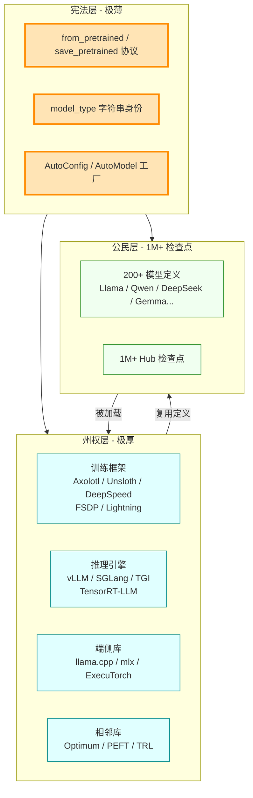
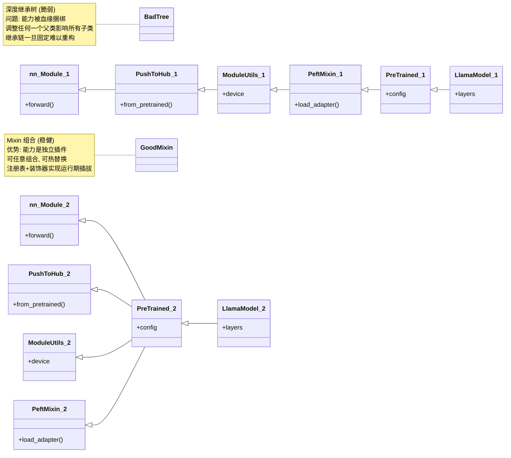
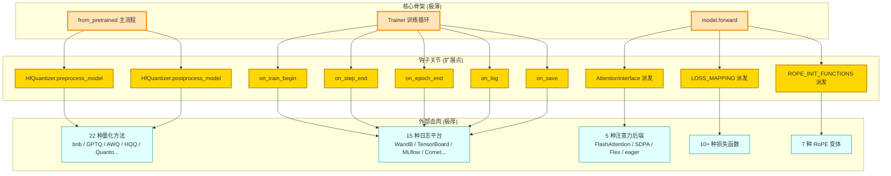
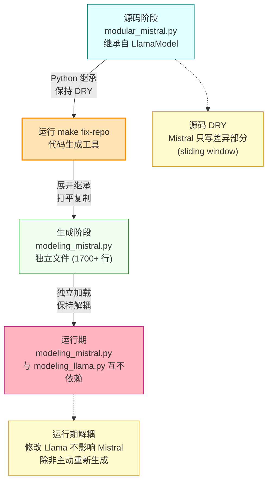
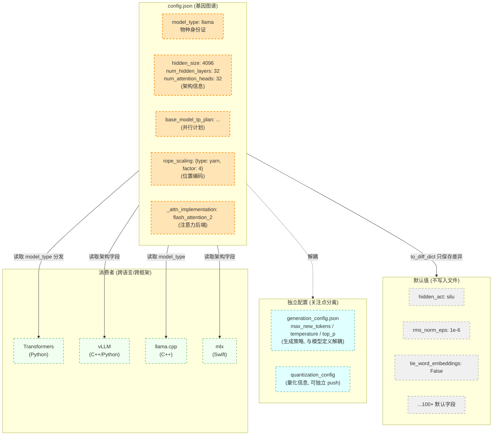

# 深刻不忘观：Transformers 的设计哲学与升华

> **本篇定位**：第三维度——给读者一种"刻进记忆"的深刻不忘观。
> 剥开所有算法与工程的细节，提炼五大设计哲学，最终用三句话让你终生难忘。
> 行文采用"总-分-总"结构，配 5 张 Mermaid 图解与 3 个实践案例。

---

## 总：从一个工程哲学命题开始

前两篇我们看了 Transformers 的"森林"（整体观）与"树木"（具体观）：200+ 模型、22+ 量化器、7 种 RoPE 变体、38 种 logits 处理器、11 种并行风格、26 篇顶会论文的算法实现。但若止步于此，你只是"知道"，而非"理解"。

本篇要回答一个更深的命题：**为什么是 Transformers 成为生态中枢，而不是别的库？**

答案不在代码量，不在算法多，而在**设计哲学**。Transformers 不是一个库，而是一套关于"如何让数百种模型在数百万人手中协同进化"的工程哲学。这套哲学围绕三个张力展开：

1. **抽象与具体的张力**：框架要足够抽象以容纳所有模型，又要足够具体以高效运行
2. **中心化与去中心化的平衡**：核心要统一标准，边缘要保留自由
3. **算法速度与工程可维护性的取舍**：既要跑得快，又要改得动

这三个张力，最终凝聚为五大设计哲学。下面进入"分"的部分，逐一展开。

---

## 分：五大设计哲学

### 第一章 第一哲学——"约定宪法，而非中央集权"

#### 1.1 核心隐喻：Transformers 是 AI 模型世界的"宪法"

美国宪法只用了 7591 个单词，却治理了 3.3 亿人 240 年。它的力量不在于"规定了多少事"，而在于"约定了根本规则"。Transformers 的核心代码同样克制：`PreTrainedConfig` / `PreTrainedModel` / `from_pretrained` / `save_pretrained` 这套"宪法"不到 5000 行，却治理了 200+ 模型、1M+ 检查点、整个 AI 生态。

**宪法只规定"模型定义必须是什么样"，不规定"如何训练、如何推理"**：

- 训练交给 Axolotl / Unsloth / DeepSpeed / FSDP
- 推理交给 vLLM / SGLang / TGI / TensorRT-LLM
- 端侧交给 llama.cpp / mlx / ExecuTorch

Transformers 自己不追求"最快的训练"或"最快的推理"，它追求"所有人都认可的模型定义"。这是**宪法联邦**的智慧：中央薄，地方厚。

#### 1.2 反例对比：TensorFlow 1.x 的"中央集权"

TensorFlow 1.x 试图"什么都管"：训练（Estimator）、推理（Serving）、部署（TF Lite）、可视化（TensorBoard）、调参（TFX）全部内置。结果是：

- 每个环节都要等核心团队更新
- 任何新算法都要侵入核心代码
- 生态被"中央"绑架，创新缓慢

Transformers 反其道而行：核心只定宪法（`from_pretrained` 协议、`model_type` 身份、Auto 工厂），把训练/推理/部署的"主权"让渡给生态。**结果反而成了中枢**——因为所有人都愿意接入一个"不抢自己饭碗"的标准。

#### 1.3 宪法的三个工程体现

1. **`from_pretrained` / `save_pretrained` 协议**：所有可序列化对象（Config / Model / Tokenizer / ImageProcessor / FeatureExtractor / Processor）都说同一种语言
2. **`model_type` 字符串身份**：每个模型的 config.json 都有 `"model_type": "llama"` 这样的身份证号，AutoConfig 据此分发
3. **AutoConfig / AutoModel / AutoTokenizer 工厂**：用户只需 `AutoModelForCausalLM.from_pretrained("任意模型名")`，工厂自动派发



**图 1 说明**：宪法联邦模型。顶层是极薄的"宪法层"（橙色），只规定协议、身份、工厂；中间是极厚的"州权层"（青色），训练/推理/端侧各自由专门框架负责；底层是"公民层"（绿色），200+ 模型与 1M+ 检查点都遵循宪法。**宪法不抢州权，州权不违宪法**——这是 Transformers 成为生态中枢的根本智慧。

#### 1.4 深刻启示

**好框架不是"实现了多少功能"，而是"让多少功能可以被别人实现"**。当你设计一个库时，问自己：我的核心是在"抢饭碗"，还是在"立规矩"？前者会陷入 TF 1.x 的困境，后者会成为 Transformers 式的中枢。

---

### 第二章 第二哲学——"用 Mixin 组合替代深度继承"

#### 2.1 核心隐喻：能力是"插件"而非"血统"

传统 OOP 用继承树表达"是什么"（is-a）：`LlamaModel` 是 `PreTrainedModel`，`PreTrainedModel` 是 `nn.Module`。但 Transformers 的能力远不止"是模型"——它还要能生成、能加载 PEFT adapter、能 Hub 互通、能设备管理、能量化。

如果用深度继承表达这些能力，继承树会变成：

```
nn.Module → PushToHubMixin → ModuleUtilsMixin → EmbeddingAccessMixin → PeftAdapterMixin → PreTrainedModel → LlamaPreTrainedModel → LlamaModel → LlamaForCausalLM → GenerationMixin → ...
```

这条链一旦固定，任何调整都会引发连锁反应。Transformers 选择**多重 Mixin 组合**：

```python
class PreTrainedModel(nn.Module, EmbeddingAccessMixin, ModuleUtilsMixin,
                      PushToHubMixin, PeftAdapterMixin):
    ...

class LlamaForCausalLM(LlamaPreTrainedModel, GenerationMixin):
    ...
```

每个 Mixin 是一个独立"插件"，提供一类能力。模型按需组合，**能力是"has"而非"is"**。

#### 2.2 注册表 + 装饰器让能力可插拔

Mixin 解决了"能力组合"，但有些能力是"运行期可选"的（如注意力后端、量化方法、并行风格）。这些用**注册表 + 装饰器**实现：

| 能力 | 注册表 | 装饰器 |
|------|--------|--------|
| 注意力后端 | `AttentionInterface` | `ALL_ATTENTION_FUNCTIONS.register("flash_attention_2", fn)` |
| 掩码物化器 | `AttentionMaskInterface` | `ALL_MASK_ATTENTION_FUNCTIONS.register(...)` |
| 并行风格 | `ParallelInterface` | `ALL_PARALLEL_STYLES["ColwiseParallel"] = ...` |
| 量化器 | `AUTO_QUANTIZER_MAPPING` | `@register_quantizer("my_quant")` |
| Cache 层类型 | `LAYER_TYPE_CACHE_MAPPING` | 设置 `layer_type` 类属性自动注册 |
| 流水线任务 | `SUPPORTED_TASKS` | `PIPELINE_REGISTRY.register_pipeline(...)` |
| 损失函数 | `LOSS_MAPPING` | `@register_loss("my_loss")` |
| RoPE 变体 | `ROPE_INIT_FUNCTIONS` | 字典注册 |

新增能力只需 `@register_xxx`，无需修改核心代码。**这是"开放-封闭原则"（OCP）的极致实践**。

#### 2.3 深刻启示

**"is-a" 关系是脆弱的，"has-a" 关系是稳健的**。当你发现继承树超过 3 层，停下来问自己：这些能力真的需要"血缘"传递吗？还是可以做成 Mixin 插件？Mixin 组合让能力可拆可装，继承树让能力捆绑难调。**伟大的框架用组合，平庸的框架用继承**。



**图 2 说明**：深度继承树（上半部）vs Mixin 组合（下半部）对比。深度继承把所有能力串成一条链，任何调整都引发连锁反应；Mixin 组合把能力做成独立插件，按需组合，可热替换。**Transformers 选择后者，让 200+ 模型能共享同一套能力插件**。

---

### 第三章 第三哲学——"用生命周期钩子编织外部世界"

#### 3.1 核心隐喻：框架是"骨架"，外部世界是"血肉"，钩子是"关节"

人之所以能跑能跳，不是骨头多硬，而是关节灵活。Transformers 的核心代码（`from_pretrained`、`Trainer.train`、`model.forward`）是骨架，外部世界（量化方法、日志平台、注意力后端）是血肉，**钩子是让两者灵活连接的关节**。

好的框架设计，标志是"扩展点比核心代码还多"。Transformers 在关键流程中预设了大量钩子：

#### 3.2 三大钩子系统

**钩子系统 1：HfQuantizer 的 preprocess / postprocess**

[quantizers/base.py](file:///workspace/src/transformers/quantizers/base.py) 的 `HfQuantizer` 定义了两个钩子：

- `preprocess_model`：在 `from_pretrained` 实例化模型后、加载权重前介入，替换 `nn.Linear` 为量化 Linear
- `postprocess_model`：在权重加载后介入，打包 scales、处理 tied weights

这让 **22 种量化方法无需侵入 `from_pretrained` 主流程**。新增一种量化方法只需实现这两个钩子。

**钩子系统 2：TrainerCallback 的 15 个事件**

[trainer_callback.py](file:///workspace/src/transformers/trainer_callback.py) 定义了 15 个回调钩子：

```python
class TrainerCallback:
    def on_init_end(self, args, state, control, **kwargs): ...
    def on_train_begin(self, args, state, control, **kwargs): ...
    def on_train_end(self, args, state, control, **kwargs): ...
    def on_epoch_begin(self, args, state, control, **kwargs): ...
    def on_epoch_end(self, args, state, control, **kwargs): ...
    def on_step_begin(self, args, state, control, **kwargs): ...
    def on_step_end(self, args, state, control, **kwargs): ...
    def on_pre_optimizer_step(self, args, state, control, **kwargs): ...
    def on_optimizer_step(self, args, state, control, **kwargs): ...
    def on_substep_end(self, args, state, control, **kwargs): ...
    def on_evaluate(self, args, state, control, **kwargs): ...
    def on_predict(self, args, state, control, **kwargs): ...
    def on_save(self, args, state, control, **kwargs): ...
    def on_log(self, args, state, control, **kwargs): ...
    def on_prediction_step(self, args, state, control, **kwargs): ...
    def on_push_begin(self, args, state, control, **kwargs): ...
```

这让 **15 种日志平台（WandB / TensorBoard / MLflow / ClearML / Comet / Neptune / SwanLab / ...）无需侵入训练循环**。每个平台只需实现一个 Callback 子类。

**钩子系统 3：AttentionInterface 的运行期派发**

[modeling_utils.py:5032](file:///workspace/src/transformers/modeling_utils.py) 的 `AttentionInterface` 注册表让注意力后端可热切换：

```python
model.set_attn_implementation("flash_attention_2")  # 一行切换
```

这让 **FlashAttention / SDPA / Flex / eager 无需侵入模型 forward**。模型代码只写 `ALL_ATTENTION_FUNCTIONS[self.config._attn_implementation](query, key, value, ...)`，后端由注册表派发。

#### 3.3 深刻启示

**好框架的标志是"扩展点比核心代码还多"**。当你设计一个系统时，问自己：用户想加一个新功能，是改我的代码，还是加一个钩子？前者是"中央集权"，后者是"宪法联邦"。钩子让外部世界无侵入接入，让框架能"长"出超越作者想象的能力。



**图 3 说明**：钩子编织图。核心骨架（橙色）极薄，只定义 `from_pretrained` / `Trainer.train` / `model.forward` 三条主流程；钩子关节（金色）是预设的扩展点，让外部血肉（青色）无侵入接入。**核心代码量 < 钩子数量 < 外部扩展数量**，这是好框架的标志。

---

### 第四章 第四哲学——"用代码生成对抗代码重复"

#### 4.1 核心隐喻：modular 机制是"编译期继承"，运行期是"独立文件"

DRY（Don't Repeat Yourself）是软件工程的金科玉律。但当你的代码库有 200+ 个模型，且很多模型架构相近（Mistral ≈ Llama + sliding window，Qwen2 ≈ Llama + GQA），纯粹的 DRY 会逼你做深度继承，而深度继承会引发"意大利面条式"的依赖地狱。

Transformers 的解法是**编译期继承 + 运行期独立**：

- **编译期**：`modular_<name>.py` 文件**可以**继承其他模型，例如 [models/mistral/modular_mistral.py](file:///workspace/src/transformers/models/mistral/modular_mistral.py) 继承 Llama
- **生成期**：运行 `make fix-repo`，工具把继承"展开"为独立的 `modeling_mistral.py`（约 1700+ 行），把所有继承的方法"打平"复制进去
- **运行期**：`modeling_mistral.py` 与 `modeling_llama.py` **互不依赖**，保持独立

这就像 C 语言的宏展开：源码用宏（继承）保持 DRY，编译后展开为独立代码。**兼顾了复用与解耦**。

#### 4.2 为什么不直接继承？

想象 200+ 模型如果都直接继承会怎样：

- Llama 是基座，Mistral 继承 Llama，Qwen2 继承 Llama，Gemma 继承 Llama...
- DeepSeek-V3 继承 Llama 但改了 Attention，Mixtral 继承 Llama 加了 MoE
- 任何对 Llama 的修改都会影响所有继承者
- 新贡献者要看懂一个 Mistral 模型，得先读 Llama，再读 Llama 的父类，递归向下

这种"继承地狱"在 fairseq 等老库中真实发生过。Transformers 的 modular 机制让运行期文件独立，**任何对 Llama 的修改只影响 Llama 本身**，Mistral 已经是独立文件，不受影响（除非主动重新生成）。

#### 4.3 `# Copied from` 是其前身

在 modular 机制出现前，Transformers 用 `# Copied from ...` 注释实现文本复制：

```python
# Copied from transformers.models.bart.modeling_bart.BartScaledWordEmbedding with Bart->XGLM
class XGLMScaledWordEmbedding(nn.Embedding):
    ...
```

`make fix-repo` 会从源（BartScaledWordEmbedding）拉取代码，把 `Bart` 替换为 `XGLM`，写入目标位置。这是"带符号替换的文本复制"，灵活性低（不能局部修改），已逐步被 modular 取代。

#### 4.4 深刻启示

**DRY 原则在大规模代码库中需要被重新定义**。小项目里 DRY 意味着"不重复写"，大项目里 DRY 意味着"源码不重复，但生成的代码可以重复"。代码生成是对抗重复的高级武器，它让"源码 DRY"与"运行期解耦"共存。

当你维护一个有 100+ 类似实现的代码库时，问自己：是该用继承（脆弱）、用复制（重复）、还是用代码生成（兼顾）？Transformers 给出了第三条路。



**图 4 说明**：modular 代码生成流程。源码阶段（青色）`modular_mistral.py` 用 Python 继承保持 DRY，只写与 Llama 的差异部分；`make fix-repo`（橙色）把继承展开为独立的 `modeling_mistral.py`（绿色，1700+ 行）；运行期（粉色）该文件与 `modeling_llama.py` 互不依赖。**源码 DRY 与运行期解耦共存**，这是代码生成的智慧。

---

### 第五章 第五哲学——"用文档化的配置对抗熵增"

#### 5.1 核心隐喻：config.json 是模型的"基因图谱"

热力学第二定律说：孤立系统的熵总是增加的。代码库也一样——随着模型增多、参数增多、配置增多，混乱度（熵）必然上升。Transformers 用**文档化的配置**对抗熵增：每个模型都有一个 `config.json`，它是模型的"基因图谱"，记录了所有架构信息。

#### 5.2 to_diff_dict：只保存差异的极简哲学

`PreTrainedConfig.to_diff_dict`（[configuration_utils.py](file:///workspace/src/transformers/configuration_utils.py)）是这一哲学的精华。它只保存**与默认值不同的字段**，嵌套递归 diff：

```python
# LlamaConfig 默认值
class LlamaConfig:
    hidden_act: str = "silu"        # 默认 silu
    rms_norm_eps: float = 1e-6      # 默认 1e-6
    # ...

# 实际 config.json (只保存差异)
{
    "model_type": "llama",
    "hidden_size": 4096,            # 非默认, 保存
    "num_hidden_layers": 32,        # 非默认, 保存
    # hidden_act 不出现, 因为是默认值
    # rms_norm_eps 不出现, 因为是默认值
}
```

这让 config.json **极简且可读**：用户一眼就能看出这个模型"与默认有什么不同"。这比把所有字段都列出来（包括 100+ 个默认值）要好得多。

#### 5.3 model_type：物种身份证

每个 config.json 都有 `"model_type": "llama"` 这样的字段。这是模型的"物种身份证"，AutoConfig 据此分发到 `LlamaConfig` 类。**一个字符串就完成了"我是谁"的声明**。

这背后的设计是**身份与实现分离**：身份（`model_type` 字符串）是稳定的、可序列化的、跨语言可读的；实现（`LlamaConfig` 类）是变化的、Python 特定的。下游框架（vLLM、llama.cpp）可以只读 `model_type` 就知道是哪种模型，无需 import Python 类。

#### 5.4 GenerationConfig 从 config 中独立

Transformers 把生成参数（`max_new_tokens` / `temperature` / `top_p` / ...）从 `PreTrainedConfig` 中独立为 `GenerationConfig`。这一分离的深刻含义是：

- **模型定义**（config.json）与**生成策略**（generation_config.json）解耦
- 同一个模型可以用不同的生成配置推理
- 生成配置可以独立 push 到 Hub，被多人共享

这是"关注点分离"（SoC）原则的典范：**模型是什么**与**模型怎么生成**是两个独立的问题，不该混在一个配置里。

#### 5.5 深刻启示

**配置即文档，文档即契约**。当你设计一个系统时，把所有重要决策都写进配置文件，让配置本身成为可读的文档。用户读完 config.json 就能理解这个模型的架构，无需看代码。这比"代码即文档"更进一步——**配置是跨语言、跨框架、跨时间的契约**。



**图 5 说明**：配置的分层与差分编码。`config.json`（橙色）只保存与默认值（灰色虚线，不写入文件）不同的字段，让文件极简可读。生成配置与量化配置独立分离（青色），实现关注点分离。**同一份 config.json 被多个跨语言消费者（绿色）读取**——Python / C++ / Swift 都能解析，因为它是 JSON 契约而非 Python 代码。

---

## 总：五大哲学与三句话总结

至此，我们提炼了 Transformers 的五大设计哲学：

| 哲学 | 核心隐喻 | 工程体现 |
|------|---------|---------|
| **第一哲学** | 约定宪法，而非中央集权 | `from_pretrained` 协议 + `model_type` 身份 + Auto 工厂 |
| **第二哲学** | 用 Mixin 组合替代深度继承 | `PreTrainedModel` 多重 Mixin + 注册表 + 装饰器 |
| **第三哲学** | 用生命周期钩子编织外部世界 | `HfQuantizer` 钩子 + `TrainerCallback` 15 事件 + `AttentionInterface` |
| **第四哲学** | 用代码生成对抗代码重复 | `modular_*.py` 编译期继承 + `make fix-repo` 展开 |
| **第五哲学** | 用文档化的配置对抗熵增 | `to_diff_dict` + `model_type` + `GenerationConfig` 独立 |

这五大哲学不是孤立的，它们共同回答一个问题：**如何让一个开源项目成为整个生态的中枢？**

- **宪法**让所有人愿意接入（不抢饭碗）
- **Mixin**让能力可插拔（不绑血缘）
- **钩子**让外部世界无侵入（不锁接口）
- **代码生成**让复用与解耦共存（不陷地狱）
- **配置**让决策可读可契约（不增混乱）

把这五点串起来，你会发现 Transformers 的真正价值：**它不是"实现了多少功能"的库，而是"让多少功能可以被别人实现"的框架**。它的核心代码极其克制，把舞台留给了 200+ 模型、22+ 量化器、11 种并行风格、7 种 RoPE 变体、38 种 logits 处理器。这种"克制的中央 + 繁荣的边缘"，正是工程美学的最高境界。

### 三句话总结（让人终生难忘）

读到这里，请合上文档，记住这三句话：

> **1. Transformers 不是写出来的，是"长"出来的——它的每一行代码都在回答"如何让一个新模型能以最小代价接入"。**

这句话揭示了它的演化本质：核心代码（`PreTrainedModel` / `PreTrainedConfig` / `from_pretrained`）稳定多年，但围绕它"长"出了 200+ 模型、22+ 量化器、26 篇论文的算法实现。每一行新代码都在回答"接入成本能否更低"。

> **2. 它把"继承"留给了编译期（modular），把"组合"留给了运行期（Mixin），把"扩展"留给了钩子（Hook），把"身份"留给了字符串（model_type）。**

这句话浓缩了四大哲学：modular 解决源码 DRY，Mixin 解决运行期能力组合，Hook 解决外部世界接入，model_type 解决身份识别。**四种机制各司其职，互不越界**。

> **3. 最终，它教会我们一个工程真理：伟大的框架不是"实现了多少功能"，而是"让多少功能可以被别人实现"。**

这句话是整个系列的升华。当你设计任何系统（不只是 AI 库）时，问自己：我的核心是在"抢饭碗"，还是在"立规矩"？前者会陷入 TF 1.x 的困境，后者会成为 Transformers 式的中枢。**伟大的框架让渡主权，因此获得忠诚**。

---

## 使用指南与案例

### 案例 1：用五大哲学指导自己设计一个"插件式"框架

假设你要设计一个"数据处理流水线"框架，应用五大哲学：

```python
# 哲学 1: 宪法 - 定义协议
class ProcessingMixin:
    """所有处理器的基类 Mixin"""
    def process(self, data): raise NotImplementedError

class Pipeline:
    """流水线骨架, 不实现具体处理逻辑"""
    def __init__(self, steps):
        self.steps = steps
    def run(self, data):
        for step in self.steps:
            data = step.process(data)
        return data

# 哲学 2: Mixin 组合 - 能力是插件
class CacheableMixin:
    def process(self, data):
        cache_key = self._hash(data)
        if cache_key in self._cache: return self._cache[cache_key]
        result = super().process(data)
        self._cache[cache_key] = result
        return result

class MyProcessor(ProcessingMixin, CacheableMixin):
    def process(self, data):
        return data.upper()

# 哲学 3: 钩子 - 扩展点
class PipelineHook:
    def on_step_begin(self, step, data): pass
    def on_step_end(self, step, data, result): pass

# 哲学 4: 代码生成 - 用装饰器生成样板
def auto_pipeline(name):
    def decorator(cls):
        # 自动注册到 PIPELINE_REGISTRY
        PIPELINE_REGISTRY[name] = cls
        return cls
    return decorator

@auto_pipeline("text_cleaning")
class TextCleaningPipeline(Pipeline): ...

# 哲学 5: 配置即文档
@dataclass
class PipelineConfig:
    name: str
    steps: list
    cache_enabled: bool = False  # 默认值不写入 config 文件

    def to_diff_dict(self):
        return {k: v for k, v in asdict(self).items()
                if v != getattr(PipelineConfig, k, None)}
```

### 案例 2：用 modular 机制添加一个新模型

假设你要基于 Llama 添加一个"MyLlama"模型，只改 MLP 激活函数：

```python
# 文件: src/transformers/models/my_llama/modular_my_llama.py

from ..llama.modeling_llama import (
    LlamaAttention, LlamaDecoderLayer, LlamaForCausalLM,
    LlamaMLP, LlamaModel, LlamaPreTrainedModel,
)
from ..llama.configuration_llama import LlamaConfig
from torch import nn

class MyLlamaConfig(LlamaConfig):
    model_type = "my_llama"

class MyLlamaMLP(LlamaMLP):
    """改用 GELU 而非 SiLU"""
    def __init__(self, config):
        super().__init__(config)
        self.act_fn = nn.GELU()  # 替换激活

class MyLlamaAttention(LlamaAttention): ...
class MyLlamaDecoderLayer(LlamaDecoderLayer): ...
class MyLlamaPreTrainedModel(LlamaPreTrainedModel): ...
class MyLlamaModel(LlamaModel): ...
class MyLlamaForCausalLM(LlamaForCausalLM): ...
```

然后在 `models/auto/modeling_auto.py` 的 `MODEL_FOR_CAUSAL_LM_MAPPING_NAMES` 加一行：

```python
("my_llama", "MyLlamaForCausalLM"),
```

运行 `make fix-repo`，工具会展开 `modular_my_llama.py` 为独立的 `modeling_my_llama.py`。**新模型自动获得 Llama 的所有能力，但运行期与 Llama 互不依赖**。

### 案例 3：用 Auto 工厂模式让自己的库支持第三方扩展

假设你写了一个"模型评估库"，想让用户能注册自定义指标：

```python
# 你的库核心代码
METRIC_REGISTRY = {}

def register_metric(name):
    def decorator(cls):
        METRIC_REGISTRY[name] = cls
        return cls
    return decorator

class AutoMetric:
    """类似 AutoModel 的工厂"""
    @classmethod
    def from_name(cls, metric_name, **kwargs):
        if metric_name not in METRIC_REGISTRY:
            raise ValueError(f"Unknown metric: {metric_name}")
        return METRIC_REGISTRY[metric_name](**kwargs)

# 用户代码 (第三方扩展)
@register_metric("f1")
class F1Metric:
    def __init__(self, average="macro"):
        self.average = average
    def compute(self, preds, labels):
        # ...
        return 0.85

# 使用
metric = AutoMetric.from_name("f1", average="micro")
```

**说明**：用户无需修改你的库代码，只需 `@register_metric` 装饰器即可注册新指标。这就是 Transformers 的 `register_quantizer` / `register_pipeline` / `register_attention` 等装饰器的模式。**让第三方无侵入扩展，是好框架的标志**。

---

**第三篇完。三部曲至此结束：从整体观（森林）到具体观（树木），再到深刻不忘观（根系）。愿这三篇文档让你对 Transformers 的理解，从"知道"变为"理解"，再变为"刻进记忆"。**
