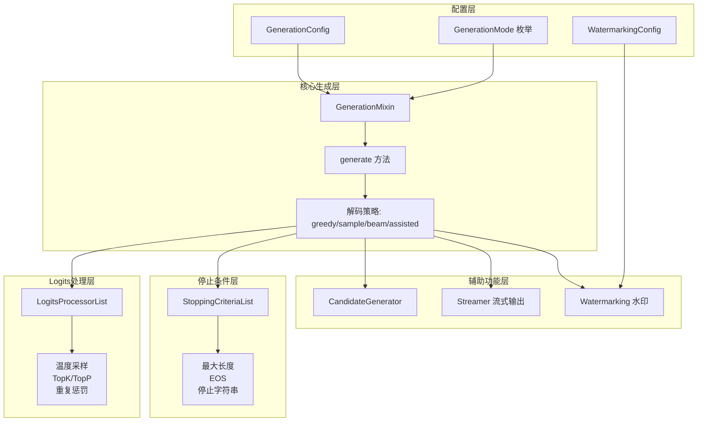

# Hugging Face Transformers 生成系统深度分析

## 目录

1. [系统总览与架构设计](#1-系统总览与架构设计)
2. [GenerationConfig — 生成配置](#2-generationconfig--生成配置)
3. [GenerationMixin — 核心生成混入类](#3-generationmixin--核心生成混入类)
4. [Logits 处理器链](#4-logits-处理器链)
5. [停止条件](#5-停止条件)
6. [候选生成器（辅助解码/推测解码）](#6-候选生成器辅助解码推测解码)
7. [流式输出](#7-流式输出)
8. [水印系统](#8-水印系统)
9. [模块间关系与协作流程](#9-模块间关系与协作流程)

---

## 生成系统架构总览



---

## 1. 系统总览与架构设计

### 1.1 模块职责划分

Hugging Face Transformers 的生成系统是一个高度模块化、可扩展的文本生成框架，位于 `src/transformers/generation/` 目录下。各模块职责如下：

| 模块 | 文件 | 核心职责 |
|------|------|----------|
| 生成配置 | `configuration_utils.py` | 定义所有生成参数、生成模式枚举、序列化/反序列化 |
| 核心生成逻辑 | `utils.py` | `GenerationMixin` 类，包含 `generate` 入口和所有解码策略 |
| Logits 处理 | `logits_process.py` | 对模型输出的 logits 进行变换（温度、top-k/p、重复惩罚等） |
| 停止条件 | `stopping_criteria.py` | 判断生成何时终止（最大长度、EOS、时间、停止字符串等） |
| 候选生成器 | `candidate_generator.py` | 辅助解码/推测解码的候选 token 生成 |
| 流式输出 | `streamers.py` | 逐 token 流式输出文本 |
| 水印 | `watermarking.py` | 生成文本水印嵌入与检测 |
| 连续批处理 | `continuous_batching/` | 高吞吐量服务场景的连续批处理生成 |

### 1.2 核心设计原理

生成系统的设计遵循以下核心原则：

1. **策略模式（Strategy Pattern）**：通过 `GenerationMode` 枚举和 `GENERATION_MODES_MAPPING` 将生成策略与配置解耦，运行时动态选择解码方法。
2. **责任链模式（Chain of Responsibility）**：`LogitsProcessorList` 和 `StoppingCriteriaList` 以链式调用方式组织，每个处理器/条件独立工作，可灵活组合。
3. **模板方法模式（Template Method）**：`generate` 方法定义了固定的准备流程（9步），具体的解码逻辑由子方法（`_sample`、`_beam_search`、`_assisted_decoding`）实现。
4. **Mixin 模式**：`GenerationMixin` 作为混入类，可被任何具有语言建模头的模型继承，实现 `generate` 能力的注入。

---

## 2. GenerationConfig — 生成配置

### 2.1 核心类结构

[configuration_utils.py](file:///workspace/src/transformers/generation/configuration_utils.py) 定义了生成系统的配置层，核心类包括：

- **`GenerationMode`**：生成模式枚举，定义了所有支持的解码策略
- **`GenerationConfig`**：生成参数配置类，继承自 `PushToHubMixin`
- **`BaseWatermarkingConfig`**：水印配置基类
- **`WatermarkingConfig`**：标准水印配置
- **`SynthIDTextWatermarkingConfig`**：Google SynthID 水印配置
- **`CompileConfig`**：`torch.compile` 编译配置
- **`ContinuousBatchingConfig`**：连续批处理配置

### 2.2 GenerationMode — 生成模式枚举

```python
class GenerationMode(ExplicitEnum):
    CONTRASTIVE_SEARCH = "contrastive_search"       # 对比搜索（已弃用，移至Hub）
    GREEDY_SEARCH = "greedy_search"                 # 贪心搜索
    SAMPLE = "sample"                               # 采样
    ASSISTED_GENERATION = "assisted_generation"      # 辅助生成/推测解码
    DOLA_GENERATION = "dola_generation"              # DoLa解码（已弃用，移至Hub）
    BEAM_SEARCH = "beam_search"                     # 束搜索
    BEAM_SAMPLE = "beam_sample"                     # 束采样
    CONSTRAINED_BEAM_SEARCH = "constrained_beam_search"  # 约束束搜索（已弃用）
    GROUP_BEAM_SEARCH = "group_beam_search"         # 分组束搜索（已弃用）
```

生成模式的判定逻辑在 `get_generation_mode` 方法中：

```python
def get_generation_mode(self, assistant_model=None):
    # 1. 约束束搜索优先级最高
    if self.constraints is not None or self.force_words_ids is not None:
        return GenerationMode.CONSTRAINED_BEAM_SEARCH
    # 2. 单束模式
    elif self.num_beams is None or self.num_beams == 1:
        if self.do_sample is not True:
            if self.top_k > 1 and self.penalty_alpha > 0:
                return GenerationMode.CONTRASTIVE_SEARCH
            else:
                return GenerationMode.GREEDY_SEARCH
        else:
            return GenerationMode.SAMPLE
    # 3. 多束模式
    else:
        if self.num_beam_groups > 1:
            return GenerationMode.GROUP_BEAM_SEARCH
        elif self.do_sample:
            return GenerationMode.BEAM_SAMPLE
        else:
            return GenerationMode.BEAM_SEARCH
    # 4. 辅助生成可扩展贪心/采样模式
    if assistant_model is not None or self.prompt_lookup_num_tokens is not None:
        if generation_mode in ("greedy_search", "sample"):
            generation_mode = GenerationMode.ASSISTED_GENERATION
```

### 2.3 GenerationConfig — 参数配置

`GenerationConfig` 管理超过 50 个生成参数，按功能分组：

| 参数组 | 关键参数 | 说明 |
|--------|----------|------|
| 长度控制 | `max_length`, `max_new_tokens`, `min_length`, `min_new_tokens` | 控制生成长度 |
| 生成策略 | `do_sample`, `num_beams` | 决定解码模式 |
| 缓存控制 | `use_cache`, `cache_implementation`, `cache_config` | KV缓存策略 |
| Logits 操控 | `temperature`, `top_k`, `top_p`, `min_p`, `top_h`, `typical_p`, `repetition_penalty` 等 | 采样参数 |
| 输出控制 | `output_scores`, `output_logits`, `output_attentions`, `return_dict_in_generate` | 返回内容 |
| 特殊 Token | `pad_token_id`, `bos_token_id`, `eos_token_id` | 特殊标记 |
| 辅助生成 | `num_assistant_tokens`, `assistant_confidence_threshold`, `prompt_lookup_num_tokens` | 推测解码参数 |

**默认值机制**：`_get_default_generation_params()` 提供全局默认值，参数优先级为：

```
用户显式传参 > model.generation_config > 全局默认值
```

### 2.4 参数校验

`validate` 方法执行两类校验：

1. **单属性校验**：如 `early_stopping` 必须是 `bool` 或 `"never"`，`cache_implementation` 必须在允许列表中
2. **组合属性校验**：如 `do_sample=False` 时 `temperature≠1.0` 会产生警告，`num_beams=1` 时 `length_penalty≠1.0` 会产生警告

`_should_warn` 辅助函数智能控制警告行为——仅当用户显式设置了冲突参数时才发出警告，避免因模型默认配置产生噪音。

---

## 3. GenerationMixin — 核心生成混入类

### 3.1 类概览

[utils.py](file:///workspace/src/transformers/generation/utils.py) 中的 `GenerationMixin` 是整个生成系统的核心，所有具备生成能力的模型都通过继承此混入类获得 `generate` 方法。

### 3.2 generate 方法 — 9步生成流程

`generate` 方法是生成系统的统一入口，执行以下 9 个标准化步骤：

```
┌─────────────────────────────────────────────────────────┐
│  Step 0: 特殊路径处理                                     │
│    - custom_generate: 自定义生成函数（Hub或本地）            │
│    - cache_implementation="paged": 切换到连续批处理         │
├─────────────────────────────────────────────────────────┤
│  Step 1: 准备配置与确定生成模式                             │
│    - _prepare_generation_config()                         │
│    - get_generation_mode()                                │
│    - _validate_model_kwargs()                             │
├─────────────────────────────────────────────────────────┤
│  Step 2: 设置生成参数                                      │
│    - 初始化 logits_processor / stopping_criteria           │
├─────────────────────────────────────────────────────────┤
│  Step 3: 定义模型输入                                      │
│    - _prepare_model_inputs()                              │
│    - _prepare_special_tokens()                            │
│    - 左填充校验                                            │
├─────────────────────────────────────────────────────────┤
│  Step 4: 准备其他模型参数                                  │
│    - attention_mask / position_ids                        │
│    - encoder_outputs（编码器-解码器模型）                    │
├─────────────────────────────────────────────────────────┤
│  Step 5: 准备 input_ids                                   │
│    - 解码器输入准备 / 输入扩展（束搜索）                     │
│    - token_healing（词元修复）                              │
│    - streamer.put()（流式输出提示词）                       │
├─────────────────────────────────────────────────────────┤
│  Step 6: 准备生成长度                                      │
│    - _prepare_generated_length()                          │
│    - max_new_tokens 优先于 max_length                      │
├─────────────────────────────────────────────────────────┤
│  Step 7: 准备缓存                                         │
│    - _prepare_cache_for_generation()                      │
│    - 根据 cache_implementation 创建对应缓存类型             │
├─────────────────────────────────────────────────────────┤
│  Step 8: 准备 logits 处理器和停止条件                       │
│    - _get_logits_processor()                              │
│    - _get_stopping_criteria()                             │
├─────────────────────────────────────────────────────────┤
│  Step 9: 调用解码方法                                     │
│    - decoding_method() → _sample / _beam_search / ...     │
└─────────────────────────────────────────────────────────┘
```

### 3.3 生成模式映射

```python
GENERATION_MODES_MAPPING = {
    GenerationMode.SAMPLE: "_sample",               # 采样 → _sample
    GenerationMode.GREEDY_SEARCH: "_sample",         # 贪心 → _sample（do_sample=False）
    GenerationMode.BEAM_SEARCH: "_beam_search",      # 束搜索 → _beam_search
    GenerationMode.BEAM_SAMPLE: "_beam_search",      # 束采样 → _beam_search（do_sample=True）
    GenerationMode.ASSISTED_GENERATION: "_assisted_decoding",  # 辅助生成
}
```

关键设计：**贪心搜索和采样共用 `_sample` 方法**，通过 `do_sample` 标志区分——贪心取 `argmax`，采样取 `multinomial`。

### 3.4 _sample 方法 — 贪心/采样解码

`_sample` 是最核心的解码方法，同时服务于贪心搜索和随机采样：

```python
def _sample(self, input_ids, logits_processor, stopping_criteria,
            generation_config, synced_gpus=False, streamer=None, **model_kwargs):
    # 1. 初始化
    unfinished_sequences = torch.ones(batch_size, dtype=torch.long, device=input_ids.device)

    # 2. Prefill 阶段（首次前向传播，处理整个提示词）
    outputs = self._prefill(input_ids, generation_config, model_kwargs,
                            is_first_iteration=not generation_config.is_assistant)

    # 3. 自回归生成循环
    while self._has_unfinished_sequences(this_peer_finished, synced_gpus, device):
        # 3a. 后续步：仅传入最新 token
        if prefill_consumed:
            model_inputs = self.prepare_inputs_for_generation(
                input_ids, next_sequence_length=1, **model_kwargs)
            outputs = model_forward(**model_inputs, return_dict=True)
        prefill_consumed = True

        # 3b. 更新模型参数（KV缓存等）
        model_kwargs = self._update_model_kwargs_for_generation(outputs, model_kwargs, ...)

        # 3c. 提取最后一个 token 的 logits
        next_token_logits = outputs.logits[:, -1, :].to(copy=True, dtype=torch.float32)

        # 3d. Logits 处理器链处理
        next_token_scores = logits_processor(input_ids, next_token_logits)

        # 3e. Token 选择（贪心 vs 采样）
        if do_sample:
            probs = nn.functional.softmax(next_token_scores, dim=-1)
            next_tokens = torch.multinomial(probs, num_samples=1).squeeze(1)
        else:
            next_tokens = torch.argmax(next_token_scores, dim=-1)

        # 3f. 已完成序列填充 pad_token
        if has_eos_stopping_criteria:
            next_tokens = next_tokens * unfinished_sequences + pad_token_id * (1 - unfinished_sequences)

        # 3g. 拼接新 token
        input_ids = torch.cat([input_ids, next_tokens[:, None]], dim=-1)

        # 3h. 流式输出
        if streamer is not None:
            streamer.put(next_tokens.cpu())

        # 3i. 检查停止条件
        unfinished_sequences = unfinished_sequences & ~stopping_criteria(input_ids, scores)
        this_peer_finished = unfinished_sequences.max() == 0

        del outputs  # 释放大 logits 张量

    if streamer is not None:
        streamer.end()
```

**关键设计要点**：

1. **Prefill/Decode 分离**：首次前向传播处理整个提示词（prefill），后续每步只处理 1 个新 token（decode），利用 KV 缓存避免重复计算。
2. **`_optimize_model_for_decode` 上下文管理器**：在 decode 阶段对模型进行优化（如禁用梯度计算）。
3. **自动编译**：当满足条件时，使用 `get_compiled_call` 获取编译后的前向传播函数。
4. **内存管理**：`del outputs` 显式释放 logits 张量，避免引用保持导致内存泄漏。

### 3.5 _beam_search 方法 — 束搜索解码

束搜索的实现更为复杂，核心数据结构：

```python
# 静态形状的张量，避免动态分配
running_sequences = torch.full((batch_size, num_beams, max_length), fill_value=pad_token_id)
sequences = running_sequences.detach().clone()  # 已完成序列

running_beam_scores = torch.zeros((batch_size, num_beams))  # 活跃束的累积分数
beam_scores = torch.full((batch_size, num_beams), fill_value=-1e9)  # 已完成束的分数

is_sent_finished = torch.zeros((batch_size, num_beams), dtype=torch.bool)  # 序列完成标记
is_early_stop_heuristic_unsatisfied = torch.ones((batch_size, 1), dtype=torch.bool)  # 早停启发式
```

束搜索的每步迭代流程：

```
┌──────────────────────────────────────────────────┐
│  a. 前向传播获取 logits                            │
│  b. log_softmax + logits_processor 处理           │
│  c. 累积 log 概率 = 当前 log_probs + running_beam_scores │
│  d. _get_top_k_continuations: 选择 top-K 候选延续  │
│     - 贪心: torch.topk                            │
│     - 采样: torch.multinomial                     │
│     - K = (n_eos_tokens + 1) * num_beams          │
│  e. 检查停止条件                                   │
│  f. _get_running_beams_for_next_iteration:         │
│     选择未完成的 num_beams 个束继续搜索             │
│  g. _update_finished_beams:                        │
│     更新已完成束（如果有更高分的新完成序列）          │
│  h. 重排 KV 缓存（根据束索引）                      │
│  i. 检查早停启发式                                 │
└──────────────────────────────────────────────────┘
```

**早停启发式**（`_check_early_stop_heuristic`）：判断当前活跃束的最佳可能分数是否还能超过已完成束的最低分数。如果不可能，则提前终止搜索。

### 3.6 _assisted_decoding 方法 — 辅助解码/推测解码

辅助解码的核心思路：用一个更小的"助手模型"快速生成候选 token 序列，再用目标模型验证，从而加速生成。

```python
def _assisted_decoding(self, input_ids, logits_processor, stopping_criteria,
                       generation_config, ..., **model_kwargs):
    # 1. 获取候选生成器
    candidate_generator = self._get_candidate_generator(...)

    while self._has_unfinished_sequences(...):
        # 2. 从候选生成器获取候选 token
        candidate_input_ids, candidate_logits = candidate_generator.get_candidates(input_ids)

        # 3. 目标模型对候选序列做一次前向传播（验证 + 额外生成1个token）
        model_inputs = self.prepare_inputs_for_generation(candidate_input_ids, ...)
        outputs = self(**model_inputs)
        new_logits = outputs.logits[:, -candidate_length - 1:]

        # 4. Logits 处理
        for i in range(candidate_length + 1):
            new_logits[:, i, :] = logits_processor(candidate_input_ids[:, :cur_len+i], new_logits[:, i, :])

        # 5. Token 验证与接受
        if do_sample and candidate_logits is not None:
            # 推测解码：按论文 Algorithm 1 进行采样验证
            valid_tokens, n_matches = _speculative_sampling(...)
        else:
            # 辅助生成：逐 token 比对，接受到第一个不匹配处
            selected_tokens = new_logits.argmax(dim=-1)  # 或 multinomial
            n_matches = ((~(candidate_new_tokens == selected_tokens[:, :-1])).cumsum(dim=-1) < 1).sum()
            valid_tokens = selected_tokens[:, :n_matches + 1]

        # 6. 更新 input_ids
        input_ids = torch.cat([input_ids, valid_tokens], dim=-1)

        # 7. 更新候选策略
        candidate_generator.update_candidate_strategy(input_ids, scores, n_matches)
```

---

## 4. Logits 处理器链

### 4.1 架构设计

[logits_process.py](file:///workspace/src/transformers/generation/logits_process.py) 实现了完整的 logits 变换管道，基于责任链模式：

```python
class LogitsProcessor:
    """所有 logits 处理器的抽象基类"""
    supports_continuous_batching: bool | None = None  # 是否支持连续批处理

    def __call__(self, input_ids, scores) -> torch.FloatTensor:
        raise NotImplementedError(...)

class LogitsProcessorList(list):
    """处理器链：顺序调用每个处理器"""
    def __call__(self, input_ids, scores, **kwargs):
        for processor in self:
            function_args = inspect.signature(processor.__call__).parameters
            if len(function_args) > 2:
                scores = processor(input_ids, scores, **kwargs)
            else:
                scores = processor(input_ids, scores)
        return scores
```

### 4.2 处理器分类

处理器分为两大类：**LogitsProcessor**（硬约束，修改 logits）和 **LogitsWarper**（软变换，调整分布形状）。在代码中两者都继承自 `LogitsProcessor`，区别在于 Warper 仅在 `do_sample=True` 时被添加。

#### 4.2.1 约束类处理器（始终生效）

| 处理器 | 功能 | 核心逻辑 |
|--------|------|----------|
| `MinLengthLogitsProcessor` | 最小长度约束 | 序列长度 < min_length 时，EOS token logits 设为 -inf |
| `MinNewTokensLengthLogitsProcessor` | 最小新 token 数约束 | 同上，但忽略提示词长度 |
| `RepetitionPenaltyLogitsProcessor` | 重复惩罚 | 已出现 token 的 logits 除以 penalty（>1 惩罚，<1 奖励） |
| `EncoderRepetitionPenaltyLogitsProcessor` | 编码器重复惩罚 | 对编码器输入中出现的 token 施加惩罚 |
| `NoRepeatNGramLogitsProcessor` | N-gram 重复禁止 | 禁止生成已出现的 n-gram |
| `NoBadWordsLogitsProcessor` | 禁用词过滤 | 指定词序列的 logits 设为 -inf |
| `ForcedBOSTokenLogitsProcessor` | 强制 BOS | 第一个生成 token 强制为 BOS |
| `ForcedEOSTokenLogitsProcessor` | 强制 EOS | 达到 max_length 时强制 EOS |
| `SuppressTokensLogitsProcessor` | 抑制 token | 指定 token 的 logits 设为 -inf |
| `SuppressTokensAtBeginLogitsProcessor` | 开头抑制 | 仅在生成开始时抑制指定 token |
| `SequenceBiasLogitsProcessor` | 序列偏置 | 为特定 token 序列添加偏置值 |
| `PrefixConstrainedLogitsProcessor` | 前缀约束 | 仅允许特定函数返回的 token |
| `InfNanRemoveLogitsProcessor` | 异常值移除 | 将 nan/inf 替换为 0/最大有限值 |
| `ExponentialDecayLengthPenalty` | 指数衰减长度惩罚 | 超过起始位置后，EOS 概率指数增加 |

#### 4.2.2 采样类处理器（仅 do_sample=True 时生效）

| 处理器 | 功能 | 核心逻辑 |
|--------|------|----------|
| `TemperatureLogitsWarper` | 温度缩放 | `scores = scores / temperature` |
| `TopKLogitsWarper` | Top-K 过滤 | 仅保留概率最高的 K 个 token |
| `TopPLogitsWarper` | Nucleus 采样 | 保留累积概率达到 top_p 的最小 token 集 |
| `MinPLogitsWarper` | Min-P 采样 | 动态阈值 = min_p × 最高概率，过滤低于阈值的 token |
| `TopHLogitsWarper` | Top-H 采样 | 基于熵的自适应采样，保留累积熵 ≤ top_h × 总熵 的 token |
| `TypicalLogitsWarper` | 典型采样 | 保留信息量接近期望的 token |
| `EpsilonLogitsWarper` | Epsilon 截断 | 过滤概率 < epsilon 的 token |
| `EtaLogitsWarper` | Eta 截断 | epsilon + 典型性的混合截断 |

#### 4.2.3 特殊处理器

| 处理器 | 功能 |
|--------|------|
| `WatermarkLogitsProcessor` | 水印嵌入 |
| `SynthIDTextWatermarkLogitsProcessor` | Google SynthID 水印 |
| `UnbatchedClassifierFreeGuidanceLogitsProcessor` | 无分类器引导（CFG） |
| `WhisperTimeStampLogitsProcessor` | Whisper 时间戳处理 |
| `LogitNormalization` | Log-Softmax 归一化（始终在最后） |

### 4.3 处理器链构建顺序

`_get_logits_processor` 方法按固定顺序构建处理器链：

```python
def _get_logits_processor(self, generation_config, ...):
    processors = LogitsProcessorList()

    # 1. 约束类处理器（固定顺序）
    if guidance_scale:     processors.append(UnbatchedClassifierFreeGuidanceLogitsProcessor(...))
    if sequence_bias:      processors.append(SequenceBiasLogitsProcessor(...))
    if encoder_repetition: processors.append(EncoderRepetitionPenaltyLogitsProcessor(...))
    if repetition_penalty: processors.append(RepetitionPenaltyLogitsProcessor(...))
    if no_repeat_ngram:    processors.append(NoRepeatNGramLogitsProcessor(...))
    if bad_words:          processors.append(NoBadWordsLogitsProcessor(...))
    if min_length:         processors.append(MinLengthLogitsProcessor(...))
    if min_new_tokens:     processors.append(MinNewTokensLengthLogitsProcessor(...))
    if forced_bos:         processors.append(ForcedBOSTokenLogitsProcessor(...))
    if forced_eos:         processors.append(ForcedEOSTokenLogitsProcessor(...))
    if remove_invalid:     processors.append(InfNanRemoveLogitsProcessor(...))
    if decay_penalty:      processors.append(ExponentialDecayLengthPenalty(...))
    if suppress_tokens:    processors.append(SuppressTokensLogitsProcessor(...))
    if begin_suppress:     processors.append(SuppressTokensAtBeginLogitsProcessor(...))

    # 2. 合并用户自定义处理器
    processors = self._merge_criteria_processor_list(processors, logits_processor)

    # 3. 采样类处理器（仅 do_sample=True）
    if do_sample:
        if temperature:  processors.append(TemperatureLogitsWarper(...))
        if top_h:        processors.append(TopHLogitsWarper(...))
        if top_k:        processors.append(TopKLogitsWarper(...))
        if top_p:        processors.append(TopPLogitsWarper(...))
        if min_p:        processors.append(MinPLogitsWarper(...))
        if typical_p:    processors.append(TypicalLogitsWarper(...))
        if epsilon:      processors.append(EpsilonLogitsWarper(...))
        if eta:          processors.append(EtaLogitsWarper(...))

    # 4. 水印（在所有 logits 处理完成后）
    if watermarking_config: processors.append(watermarking_config.construct_processor(...))

    # 5. 归一化（始终在最后）
    if renormalize_logits:  processors.append(LogitNormalization())

    return processors
```

### 4.4 关键处理器实现细节

#### TemperatureLogitsWarper — 温度缩放

```python
def __call__(self, input_ids, scores):
    scores_processed = scores / self.temperature
    return scores_processed
```

温度 < 1 使分布更尖锐（更确定性），温度 > 1 使分布更平坦（更随机）。

#### TopPLogitsWarper — Nucleus 采样

```python
def __call__(self, input_ids, scores):
    sorted_logits, sorted_indices = torch.sort(scores, descending=False)
    cumulative_probs = sorted_logits.softmax(dim=-1).cumsum(dim=-1)
    # 移除累积概率超过 (1 - top_p) 的 token
    sorted_indices_to_remove = cumulative_probs <= (1 - self.top_p)
    sorted_indices_to_remove[..., -self.min_tokens_to_keep:] = 0
    indices_to_remove = sorted_indices_to_remove.scatter(1, sorted_indices, sorted_indices_to_remove)
    scores_processed = scores.masked_fill(indices_to_remove, self.filter_value)
    return scores_processed
```

#### MinPLogitsWarper — 动态最小概率

```python
def __call__(self, input_ids, scores):
    probs = torch.softmax(scores, dim=-1)
    top_probs = probs.amax(dim=-1, keepdim=True)
    scaled_min_p = self.min_p * top_probs       # 动态阈值 = min_p × 最高概率
    tokens_to_remove = probs < scaled_min_p      # 过滤低于阈值的 token
    # 保证至少保留 min_tokens_to_keep 个 token
    k = min(self.min_tokens_to_keep, probs.shape[-1])
    sorted_indices = torch.topk(probs, k, dim=-1).indices
    tokens_to_remove.scatter_(-1, sorted_indices, False)
    scores_processed = scores.masked_fill(tokens_to_remove, self.filter_value)
    return scores_processed
```

#### TopHLogitsWarper — 基于熵的自适应采样

这是最新的采样策略，基于 NeurIPS 2025 论文。核心思想：保留累积熵不超过 `top_h × 总熵` 的最小 token 前缀。

```python
def __call__(self, input_ids, scores):
    top_logits, top_idx = torch.topk(scores, self.top_n, dim=-1, largest=True, sorted=True)
    dist = torch.distributions.Categorical(logits=top_logits)
    tau = (dist.entropy() * self.top_h).unsqueeze(-1)  # 熵阈值
    entropy_terms = -dist.probs * torch.log(dist.probs)
    cumulative_entropy = torch.cumsum(entropy_terms, dim=-1)
    selection_mask = cumulative_entropy <= tau  # 保留累积熵 ≤ 阈值的 token
    selection_mask[:, 0] = True                 # 至少保留1个
    keep_mask.scatter_(dim=1, index=top_idx, src=selection_mask)
    scores_processed = scores.masked_fill(~keep_mask, self.filter_value)
    return scores_processed
```

---

## 5. 停止条件

### 5.1 架构设计

[stopping_criteria.py](file:///workspace/src/transformers/generation/stopping_criteria.py) 实现了生成终止条件的判断框架：

```python
class StoppingCriteria(ABC):
    """停止条件抽象基类"""
    def __call__(self, input_ids, scores, **kwargs) -> torch.BoolTensor:
        raise NotImplementedError(...)

class StoppingCriteriaList(list):
    """停止条件列表：任一条件满足即停止（OR 逻辑）"""
    def __call__(self, input_ids, scores, **kwargs):
        is_done = torch.full((input_ids.shape[0],), False, device=input_ids.device, dtype=torch.bool)
        for criteria in self:
            is_done = is_done | criteria(input_ids, scores, **kwargs)
        return is_done
```

### 5.2 内置停止条件

| 条件 | 功能 | 触发时机 |
|------|------|----------|
| `MaxLengthCriteria` | 最大长度 | `cur_len >= max_length` |
| `MaxTimeCriteria` | 最大时间 | `time.time() - initial_timestamp > max_time` |
| `EosTokenCriteria` | EOS token | 最新 token 是 EOS |
| `StopStringCriteria` | 停止字符串 | 解码后文本以指定字符串结尾 |
| `ConfidenceCriteria` | 置信度阈值 | 助手模型置信度低于阈值（推测解码用） |

### 5.3 StopStringCriteria — 停止字符串匹配

这是最复杂的停止条件，需要在纯张量操作下实现字符串匹配（兼容 `torch.compile` 和 XLA）。

**核心算法**：

1. **预处理阶段**：对词表中每个 token，计算其在停止字符串中的有效位置和与停止字符串末尾的重叠长度
2. **运行时匹配**：
   - 从序列末尾向前回溯
   - 检查最后一个 token 是否与停止字符串末尾有重叠（end_overlap）
   - 逐步向前检查前序 token 是否在停止字符串的对应位置
   - 使用 `cumsum` 跟踪已匹配的字符数

```python
class StopStringCriteria(StoppingCriteria):
    def __init__(self, tokenizer, stop_strings):
        # 预计算：为每个 token 生成嵌入向量
        # 包含：valid_positions（在停止字符串中的有效位置）
        #       end_lengths（与停止字符串末尾的重叠长度）
        #       lengths（token 总长度）
        self.embedding_vec, self.max_valid_positions, self.max_valid_end_lens = \
            self._stop_string_create_embedding_vec(clean_token_list, clean_token_indices, self.stop_strings)

    def __call__(self, input_ids, scores):
        # 纯张量操作的字符串匹配
        embedded = F.embedding(flipped_ids, self.embedding_vec)
        valid_positions = embedded[:, 1:, :max_valid_positions * num_stop_strings].unflatten(...)
        end_lengths = embedded[:, :1, max_valid_positions * num_stop_strings:-1].unflatten(...)
        lengths = embedded[:, 1:, None, -1:]
        # ... cumsum + mask 逻辑判断是否完全匹配
        string_matches = torch.amax(cumsum * mask, dim=(1, -1)) >= self.target_lens[None, :]
        return torch.any(string_matches, dim=-1)
```

**模块级缓存**：使用 `OrderedDict` 缓存嵌入向量（LRU 策略，最多 8 项），避免重复计算。

---

## 6. 候选生成器（辅助解码/推测解码）

### 6.1 架构设计

[candidate_generator.py](file:///workspace/src/transformers/generation/candidate_generator.py) 实现了推测解码的候选 token 生成框架：

```python
class CandidateGenerator:
    """候选生成器抽象基类"""
    requires_model_outputs: bool = False  # 是否需要目标模型的输出

    def get_candidates(self, input_ids, **kwargs) -> tuple[torch.LongTensor, torch.FloatTensor]:
        """获取候选 token 序列和对应的 logits"""
        raise NotImplementedError(...)

    def update_candidate_strategy(self, input_ids, scores, num_matches):
        """根据验证结果更新生成策略"""
        raise NotImplementedError(...)
```

### 6.2 候选生成器类型

| 生成器 | 功能 | 适用场景 |
|--------|------|----------|
| `AssistedCandidateGenerator` | 使用更小的助手模型生成候选 | 同 tokenizer 的推测解码 |
| `AssistedCandidateGeneratorDifferentTokenizers` | 不同 tokenizer 的辅助生成 | 助手/目标模型 tokenizer 不同 |
| `UniversalSpeculativeDecodingGenerator` | 通用推测解码 | 异构词汇表的推测解码 |
| `PromptLookupCandidateGenerator` | 提示词 n-gram 查找 | 无需助手模型的快速候选 |
| `EarlyExitCandidateGenerator` | 模型早退出 | 模型自身中间层作为助手 |
| `SinglePositionMultiTokenCandidateGenerator` | 单位置多 token 预测 | Gemma 4 MTP 方法 |

### 6.3 AssistedCandidateGenerator — 核心推测解码

```python
class AssistedCandidateGenerator(CandidateGenerator):
    def __init__(self, input_ids, assistant_model, generation_config, model_kwargs, ...):
        self.assistant_model = assistant_model
        self.num_assistant_tokens = assistant_generation_config.num_assistant_tokens
        self.assistant_confidence_threshold = assistant_generation_config.assistant_confidence_threshold
        # 助手模型的生成配置
        self.generation_config.cache_implementation = "dynamic_full"  # 需要回滚缓存

    def get_candidates(self, input_ids, **kwargs):
        # 1. 计算可生成的 token 数
        min_new_tokens, max_new_tokens = self._calculate_new_tokens(input_ids)
        # 2. 更新 KV 缓存和掩码
        self._update_past_and_masks(input_ids)
        # 3. 使用助手模型生成候选
        assistant_output = self.assistant_model.generate(**generation_args, **self.assistant_kwargs)
        # 4. 提取候选 token 和 logits
        candidate_logits = torch.stack(assistant_output.scores, dim=1)
        candidate_ids = assistant_output.sequences
        return candidate_ids, candidate_logits

    def update_candidate_strategy(self, input_ids, scores, num_matches):
        # 启发式调整候选 token 数
        if schedule in {"heuristic", "heuristic_transient"}:
            if num_matches == len(scores[0]) - 1:
                self.num_assistant_tokens += 2  # 全部匹配，增加推测量
            else:
                self.num_assistant_tokens = max(1, self.num_assistant_tokens - 1)  # 部分失败，减少

        # 基于 ROC 曲线自适应调整置信度阈值
        if sklearn_available and assistant_confidence_threshold:
            fpr, tpr, thresholds = roc_curve(self.matches, self.probs)
            costs = fpr + 3 * (1 - tpr)  # 假阳性权重1，假阴性权重3
            best_threshold = thresholds[np.argmin(costs)]
            self.assistant_generation_config.assistant_confidence_threshold = best_threshold
```

### 6.4 AssistantToTargetTranslator — 词汇表翻译器

用于不同 tokenizer 的推测解码，处理词汇表不匹配问题：

```python
class AssistantToTargetTranslator:
    """在助手和目标模型的词汇表之间翻译 token ID 和 logits"""

    def __init__(self, target_tokenizer, assistant_tokenizer, target_vocab_size, ...):
        # 构建双向映射
        self._assistant_to_target_input_ids, self.target_to_assistant_input_ids = \
            self._get_assistant_to_target_input_ids()
        # 不在目标词汇表中的 token 需要抑制
        self._suppress_input_ids = self._get_suppress_input_ids()

        # 可选：裁剪助手模型的 LM Head 以匹配目标词汇表
        if assistant_prune_lm_head:
            pruned_lm_head = _PruneReindexingLMHead(original_lm_head, self.assistant_overlap_token_ids)
            assistant_model.set_output_embeddings(pruned_lm_head)

    def get_target_ids(self, assistant_input_ids, target_input_ids, assistant_candidate_ids):
        """将助手模型的候选 token ID 转换为目标模型的 token ID"""
        transformed_slice = self._assistant_to_target_input_ids[last_candidate_ids]
        return torch.cat((target_input_ids, transformed_slice.unsqueeze(0)), dim=1)

    def get_target_logits(self, assistant_logits):
        """将助手模型的 logits 映射到目标词汇表空间"""
        target_logits = torch.full(target_shape, self.FILTER_VALUE, ...)
        target_logits[..., target_logits_supported_indices] = valid_assistant_logits[..., assistant_indices_mask]
        return target_logits
```

### 6.5 PromptLookupCandidateGenerator — 提示词查找

无需助手模型的轻量级候选生成方法，通过在提示词中查找 n-gram 匹配来生成候选：

```python
class PromptLookupCandidateGenerator(CandidateGenerator):
    def get_candidates(self, input_ids, **kwargs):
        for ngram_size in range(min(self.max_matching_ngram_size, input_length - 1), 0, -1):
            windows = input_ids.unfold(dimension=1, size=ngram_size, step=1)
            ngram_tensor = input_ids[0, -ngram_size:]
            matches = (windows == ngram_tensor).all(dim=2)
            match_indices = matches.nonzero(as_tuple=True)[1]
            for idx in match_indices:
                start_idx = idx + ngram_size
                chosen_ids = input_ids[0, start_idx:start_idx + self.num_output_tokens]
                # 检查候选 token 是否被 logits 处理器禁止
                # 检查是否包含 EOS
                ...
```

---

## 7. 流式输出

### 7.1 架构设计

[streamers.py](file:///workspace/src/transformers/generation/streamers.py) 提供了三种流式输出实现：

```
BaseStreamer (抽象基类)
├── TextStreamer (同步打印到 stdout)
├── TextIteratorStreamer (同步迭代器，用于线程间通信)
└── AsyncTextIteratorStreamer (异步迭代器，用于 asyncio)
```

### 7.2 BaseStreamer — 抽象接口

```python
class BaseStreamer:
    def put(self, value):
        """generate 调用此方法推送新 token"""
        raise NotImplementedError()

    def end(self):
        """generate 调用此方法信号生成结束"""
        raise NotImplementedError()
```

### 7.3 TextStreamer — 同步打印

```python
class TextStreamer(BaseStreamer):
    def __init__(self, tokenizer, skip_prompt=False, **decode_kwargs):
        self.token_cache = []   # 缓存未完成词的 token ID
        self.print_len = 0      # 已打印的字符位置
        self.next_tokens_are_prompt = True

    def put(self, value):
        if self.skip_prompt and self.next_tokens_are_prompt:
            self.next_tokens_are_prompt = False
            return
        self.token_cache.extend(value.tolist())
        text = self.tokenizer.decode(self.token_cache, **self.decode_kwargs)
        # 换行时刷新缓存
        if text.endswith("\n"):
            printable_text = text[self.print_len:]
            self.token_cache = []
            self.print_len = 0
        # CJK 字符直接打印（无需等待空格）
        elif len(text) > 0 and self._is_chinese_char(ord(text[-1])):
            printable_text = text[self.print_len:]
            self.print_len += len(printable_text)
        # 否则只打印到最后一个空格（避免打印不完整的词）
        else:
            printable_text = text[self.print_len : text.rfind(" ") + 1]
            self.print_len += len(printable_text)
        self.on_finalized_text(printable_text)

    def end(self):
        # 刷新剩余缓存
        text = self.tokenizer.decode(self.token_cache, **self.decode_kwargs)
        self.on_finalized_text(text[self.print_len:], stream_end=True)
```

**关键设计**：通过 `token_cache` 和 `print_len` 实现增量解码，只在形成完整词时才输出，避免子词切分导致的输出抖动。特别处理了 CJK 字符（无需等待空格）。

### 7.4 TextIteratorStreamer — 同步迭代器

```python
class TextIteratorStreamer(TextStreamer):
    def __init__(self, tokenizer, skip_prompt=False, timeout=None, **decode_kwargs):
        super().__init__(tokenizer, skip_prompt, **decode_kwargs)
        self.text_queue = Queue()     # 线程安全队列
        self.stop_signal = None       # 停止信号

    def on_finalized_text(self, text, stream_end=False):
        self.text_queue.put(text, timeout=self.timeout)
        if stream_end:
            self.text_queue.put(self.stop_signal, timeout=self.timeout)

    def __iter__(self):
        return self

    def __next__(self):
        value = self.text_queue.get(timeout=self.timeout)
        if value == self.stop_signal:
            raise StopIteration()
        return value
```

**使用模式**：在单独线程中运行 `model.generate`，主线程通过迭代器非阻塞获取生成文本。

### 7.5 AsyncTextIteratorStreamer — 异步迭代器

```python
class AsyncTextIteratorStreamer(TextStreamer):
    def __init__(self, tokenizer, skip_prompt=False, timeout=None, **decode_kwargs):
        super().__init__(tokenizer, skip_prompt, **decode_kwargs)
        self.text_queue = asyncio.Queue()       # 异步队列
        self.loop = asyncio.get_running_loop()  # 事件循环引用

    def on_finalized_text(self, text, stream_end=False):
        # 线程安全地向异步队列推送
        self.loop.call_soon_threadsafe(self.text_queue.put_nowait, text)
        if stream_end:
            self.loop.call_soon_threadsafe(self.text_queue.put_nowait, self.stop_signal)

    async def __anext__(self):
        if self.has_asyncio_timeout:
            async with self.asyncio_timeout(self.timeout):
                value = await self.text_queue.get()
        else:
            value = await asyncio.wait_for(self.text_queue.get(), timeout=self.timeout)
        if value == self.stop_signal:
            raise StopAsyncIteration()
        return value
```

**关键设计**：使用 `call_soon_threadsafe` 确保从生成线程向 asyncio 事件循环安全地推送数据。

---

## 8. 水印系统

### 8.1 架构设计

[watermarking.py](file:///workspace/src/transformers/generation/watermarking.py) 实现了两种水印方案：

```
WatermarkLogitsProcessor (标准水印，基于论文 2306.04634)
SynthIDTextWatermarkLogitsProcessor (Google SynthID，基于 Nature 2024 论文)

WatermarkDetector (标准水印检测器)
SynthIDTextWatermarkDetector (SynthID 水印检测器)
BayesianDetectorModel (贝叶斯检测器模型)
```

### 8.2 WatermarkLogitsProcessor — 标准水印

核心思想：根据前文 token 的哈希值将词表分为"绿色"和"红色"两组，给绿色 token 添加正向偏置。

```python
class WatermarkLogitsProcessor(LogitsProcessor):
    def __init__(self, vocab_size, device, greenlist_ratio=0.25, bias=2.0,
                 hashing_key=15485863, seeding_scheme="lefthash", context_width=1):
        self.greenlist_ratio = greenlist_ratio  # 绿色 token 比例
        self.bias = bias                        # 绿色 token 偏置
        self.hashing_key = hashing_key          # 哈希密钥
        self.seeding_scheme = seeding_scheme    # 播种方案
        self.context_width = context_width      # 上下文宽度

    def _get_greenlist_ids(self, input_ids):
        # 根据前文 token 计算种子
        if self.seeding_scheme == "lefthash":
            seed = self.hashing_key * input_ids[-1].item()
        elif self.seeding_scheme == "selfhash":
            seed = self.hashing_key * input_ids[-1].item() + input_ids[-1].item()
        # 用种子生成绿色 token 列表
        rng = torch.Generator(device=input_ids.device).manual_seed(seed)
        greenlist_size = int(self.vocab_size * self.greenlist_ratio)
        greenlist_ids = torch.randperm(self.vocab_size, generator=rng)[:greenlist_size]
        return greenlist_ids

    def __call__(self, input_ids, scores):
        greenlist_ids = self._get_greenlist_ids(input_ids[-self.context_width:])
        greenlist_mask = torch.zeros_like(scores, dtype=torch.bool)
        greenlist_mask[..., greenlist_ids] = True
        scores[greenlist_mask] += self.bias  # 给绿色 token 加偏置
        return scores
```

### 8.3 SynthIDTextWatermarkLogitsProcessor — SynthID 水印

Google 的 SynthID 使用更复杂的锦标赛（Tournament）方法：

```python
class SynthIDTextWatermarkLogitsProcessor(LogitsProcessor):
    def __init__(self, ngram_len, keys, sampling_table_size=2**16,
                 sampling_table_seed=0, context_history_size=1024, ...):
        self.ngram_len = ngram_len          # N-gram 长度
        self.keys = keys                    # 水印密钥序列（每层一个）
        self.sampling_table_size = sampling_table_size
        # 预计算采样表
        self.sampling_table = self._precompute_sampling_table()

    def __call__(self, input_ids, scores):
        # 1. 计算 g-values（伪随机函数值）
        g_values = self._compute_g_values(input_ids)
        # 2. 修改 logits：根据 g-values 调整 token 概率
        # 锦标赛方法：每层根据 g-value 决定胜负
        modified_scores = self._apply_watermark(scores, g_values)
        return modified_scores
```

### 8.4 WatermarkDetector — 标准水印检测

```python
class WatermarkDetector:
    def __call__(self, input_ids, z_threshold=3.0, return_dict=False):
        # 1. 统计绿色 token 数量
        num_tokens_scored, green_token_count = self._score_ngrams_in_passage(input_ids)
        # 2. 计算 z-score
        z_score = self._compute_z_score(green_token_count, num_tokens_scored)
        # 3. 判断是否水印
        prediction = z_score > z_threshold
        # z = (green_count - expected_count) / sqrt(n * p * (1-p))
```

### 8.5 BayesianDetectorModel — SynthID 贝叶斯检测器

```python
class BayesianDetectorModel(PreTrainedModel):
    """贝叶斯分类器，计算 P(watermarked|g_values)"""

    def _compute_posterior(self, likelihoods_watermarked, likelihoods_unwatermarked, mask, prior):
        # 对数似然比
        log_odds = log(likelihoods_watermarked) - log(likelihoods_unwatermarked)
        relative_surprisal_likelihood = torch.einsum("i...->i", log_odds * mask)
        relative_surprisal_prior = log(prior) - log(1 - prior)
        relative_surprisal = relative_surprisal_prior + relative_surprisal_likelihood
        return torch.sigmoid(relative_surprisal)  # P(watermarked|g_values)

    def forward(self, g_values, mask, labels=None):
        likelihoods_watermarked = self.likelihood_model_watermarked(g_values)
        likelihoods_unwatermarked = 0.5 * torch.ones_like(g_values)  # 均匀分布
        out = self._compute_posterior(likelihoods_watermarked, likelihoods_unwatermarked, mask, self.prior)
        return out
```

---

## 9. 模块间关系与协作流程

### 9.1 完整生成流程

```
用户调用 model.generate(input_ids, do_sample=True, top_p=0.9, ...)
│
├── 1. GenerationConfig 构建
│   ├── 合并优先级：用户参数 > model.generation_config > 全局默认
│   ├── get_generation_mode() → GenerationMode.SAMPLE
│   └── validate() 校验参数
│
├── 2. 模型输入准备
│   ├── _prepare_model_inputs() → input_ids
│   ├── _prepare_attention_mask_for_generation()
│   ├── _prepare_position_ids_for_generation()
│   └── encoder_outputs（编码器-解码器模型）
│
├── 3. Logits 处理器链构建
│   ├── RepetitionPenaltyLogitsProcessor (repetition_penalty=1.2)
│   ├── TemperatureLogitsWarper (temperature=0.8)
│   ├── TopPLogitsWarper (top_p=0.9)
│   └── [用户自定义处理器]
│
├── 4. 停止条件构建
│   ├── MaxLengthCriteria (max_length=100)
│   ├── EosTokenCriteria (eos_token_id=2)
│   └── [用户自定义条件]
│
├── 5. 缓存准备
│   └── 根据 cache_implementation 创建 DynamicCache / StaticCache / ...
│
├── 6. 解码循环 (_sample)
│   └── while unfinished:
│       ├── model.forward() → logits
│       ├── logits_processor(input_ids, logits) → processed_scores
│       │   ├── RepetitionPenalty: 惩罚已出现 token
│       │   ├── Temperature: 缩放分布
│       │   └── TopP: 过滤低概率 token
│       ├── softmax → probs → multinomial → next_token
│       ├── stopping_criteria(input_ids, scores) → is_done
│       └── streamer.put(next_token)  [可选]
│
└── 7. 返回结果
    ├── return_dict_in_generate=True → GenerateDecoderOnlyOutput
    └── return_dict_in_generate=False → input_ids (torch.LongTensor)
```

### 9.2 辅助解码流程

```
model.generate(assistant_model=draft_model, ...)
│
├── GenerationMode.ASSISTED_GENERATION
│
├── _assisted_decoding()
│   └── while unfinished:
│       ├── candidate_generator.get_candidates(input_ids)
│       │   └── draft_model.generate(max_new_tokens=N) → candidate_ids, candidate_logits
│       ├── target_model(candidate_ids) → new_logits  [一次前向传播验证所有候选]
│       ├── logits_processor 处理 new_logits
│       ├── 验证与接受
│       │   ├── 推测解码: _speculative_sampling() (Algorithm 1 from paper 2211.17192)
│       │   └── 辅助生成: 逐 token 比对，接受到第一个不匹配
│       ├── input_ids = cat([input_ids, valid_tokens])
│       └── candidate_generator.update_candidate_strategy(n_matches)
│           ├── 启发式调整 num_assistant_tokens
│           └── ROC 曲线调整 confidence_threshold
│
└── 返回结果
```

### 9.3 模块依赖关系图

```
                    ┌─────────────────────┐
                    │   GenerationConfig   │
                    │ (configuration_utils) │
                    └──────────┬──────────┘
                               │ 参数配置
                               ▼
┌──────────────┐    ┌─────────────────────┐    ┌───────────────────┐
│  Streamers    │◄───│   GenerationMixin    │───►│  StoppingCriteria  │
│ (streamers)   │    │     (utils.py)       │    │(stopping_criteria)│
└──────────────┘    └──────────┬──────────┘    └───────────────────┘
                               │
                    ┌──────────┼──────────┐
                    ▼          ▼          ▼
          ┌────────────┐ ┌──────────┐ ┌──────────────────┐
          │LogitsProc. │ │Candidate │ │  Watermarking     │
          │(logits_    │ │Generator │ │  (watermarking)   │
          │ process)   │ │(candidate│ │                   │
          └────────────┘ │_generator│ └──────────────────┘
                         └────┬─────┘
                              │ 使用
                              ▼
                    ┌──────────────────┐
                    │  AssistantToTarget│
                    │  Translator       │
                    │  (词汇表翻译)      │
                    └──────────────────┘
```

### 9.4 关键设计总结

1. **高度模块化**：每个子模块（logits 处理、停止条件、候选生成、流式输出、水印）都是独立的，可以单独扩展和替换。

2. **配置驱动**：`GenerationConfig` 作为单一配置源，驱动所有模块的行为。通过参数优先级机制（用户 > 模型 > 全局默认）确保灵活性。

3. **策略自动选择**：`get_generation_mode` 根据参数组合自动确定解码策略，用户无需显式指定。

4. **可扩展性**：
   - 自定义 `LogitsProcessor` 可通过 `logits_processor` 参数注入
   - 自定义 `StoppingCriteria` 可通过 `stopping_criteria` 参数注入
   - 自定义生成函数可通过 `custom_generate` 参数注入
   - 新的候选生成器可继承 `CandidateGenerator` 实现

5. **性能优化**：
   - Prefill/Decode 分离，利用 KV 缓存
   - `logits_to_keep` 参数避免计算完整 logit 矩阵
   - 自动 `torch.compile` 支持
   - 静态形状张量（束搜索）避免动态分配
   - 显式 `del outputs` 管理 logits 内存

6. **推测解码加速**：支持多种候选生成策略（助手模型、提示词查找、早退出、MTP），以及异构词汇表的翻译，通过启发式和 ROC 曲线自适应调整推测参数。
