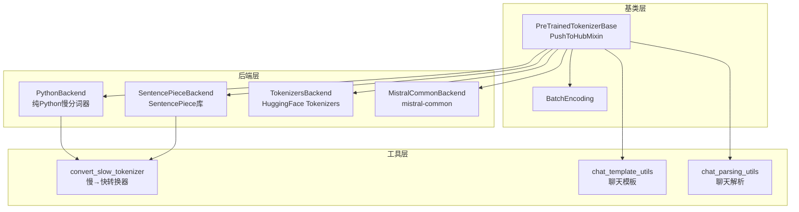

# Hugging Face Transformers 分词器系统深度分析

## 目录

1. [系统架构概览](#1-系统架构概览)
2. [PreTrainedTokenizerBase 基类](#2-pretrainedtokenizerbase-基类)
3. [PythonBackend — V5 纯 Python 分词器](#3-pythonbackend--v5-纯-python-分词器)
4. [SentencePieceBackend — SentencePiece 后端](#4-sentencepiecebackend--sentencepiece-后端)
5. [TokenizersBackend — HuggingFace Tokenizers 快速后端](#5-tokenizersbackend--huggingface-tokenizers-快速后端)
6. [MistralCommonBackend — Mistral Common 分词器](#6-mistralcommonbackend--mistral-common-分词器)
7. [convert_slow_tokenizer — 慢到快转换器](#7-convert_slow_tokenizer--慢到快转换器)
8. [Chat Template 系统](#8-chat-template-系统)
9. [Chat Parsing 系统](#9-chat-parsing-系统)
10. [模块间关系与协作流程](#10-模块间关系与协作流程)

---

## 分词器系统架构总览



---

## 1. 系统架构概览

### 1.1 分词器后端架构（V5 重构）

Transformers V5 对分词器系统进行了重大重构，将原先的"慢/快"二元架构升级为**多后端架构**，支持四种不同的分词后端：

```
PreTrainedTokenizerBase (基类，定义统一接口)
    ├── PythonBackend       (纯 Python 实现，原"慢分词器")
    ├── SentencePieceBackend (SentencePiece C++ 库后端)
    ├── TokenizersBackend    (HuggingFace tokenizers Rust 库后端，原"快分词器")
    └── MistralCommonBackend (mistral-common 官方库后端)
```

### 1.2 核心设计原则

- **统一接口**：所有后端共享 `PreTrainedTokenizerBase` 定义的公共 API（`__call__`、`encode`、`decode`、`pad` 等）
- **后端透明**：用户代码无需关心底层后端实现，通过 `backend` 属性可查询当前使用的后端
- **渐进式降级**：当首选后端不可用时，自动降级到备选后端（如 SentencePiece → TikToken）
- **V5 特殊 Token 重构**：将 `additional_special_tokens` 重命名为 `extra_special_tokens`，引入 `model_specific_special_tokens` 支持多模态 Token

### 1.3 文件职责映射

| 文件 | 核心类 | 职责 |
|------|--------|------|
| `tokenization_utils_base.py` | `PreTrainedTokenizerBase`, `BatchEncoding` | 基类：统一接口、特殊 Token 管理、padding/truncation 策略、from_pretrained 流程 |
| `tokenization_python.py` | `PythonBackend`, `Trie` | 纯 Python 慢分词器：Trie 分词、added_tokens 管理、encode_plus 流程 |
| `tokenization_utils_sentencepiece.py` | `SentencePieceBackend` | SentencePiece 后端：加载 .model 文件、SPM 编解码 |
| `tokenization_utils_tokenizers.py` | `TokenizersBackend` | Rust 快速后端：封装 tokenizers 库、批量编码、offset mapping |
| `tokenization_mistral_common.py` | `MistralCommonBackend` | mistral-common 后端：Mistral 官方分词器封装 |
| `convert_slow_tokenizer.py` | `Converter` 及子类 | 慢→快转换器：将 Python/SentencePiece 分词器转换为 Rust tokenizers 格式 |
| `chat_template_utils.py` | `render_jinja_template` 等 | 聊天模板：Jinja2 渲染、工具调用 Schema 生成 |
| `chat_parsing_utils.py` | `recursive_parse` | 聊天解析：正则提取 + JSON 解析的结构化输出解析 |

---

## 2. PreTrainedTokenizerBase 基类

**文件**: [tokenization_utils_base.py](file:///workspace/src/transformers/tokenization_utils_base.py)

### 2.1 类层次与核心数据结构

```python
class PreTrainedTokenizerBase(PushToHubMixin):
    # 类属性
    vocab_files_names: dict[str, str] = {}
    pretrained_vocab_files_map: dict[str, dict[str, str]] = {}
    model_input_names: list[str] = ["input_ids", "attention_mask"]
    padding_side: str = "right"
    truncation_side: str = "right"

    # V5: 命名特殊 Token 属性列表
    SPECIAL_TOKENS_ATTRIBUTES = [
        "bos_token", "eos_token", "unk_token",
        "sep_token", "pad_token", "cls_token", "mask_token",
    ]
```

**V5 特殊 Token 存储模型**：

```python
def __init__(self, **kwargs):
    # 命名特殊 Token（bos/eos/unk/sep/pad/cls/mask）
    self._special_tokens_map = dict.fromkeys(self.SPECIAL_TOKENS_ATTRIBUTES)

    # 额外特殊 Token（原 additional_special_tokens）
    self._extra_special_tokens = []

    # 模型特定特殊 Token（如多模态的 <image>, <audio>）
    # 通过 _set_model_specific_special_tokens 动态添加
```

### 2.2 BatchEncoding — 分词结果容器

`BatchEncoding` 继承自 `UserDict`，是分词器输出的核心数据结构，同时支持字典式访问和快速分词器的高级映射功能：

```python
class BatchEncoding(UserDict, Generic[_V]):
    def __init__(self, data, encoding=None, tensor_type=None, ...):
        super().__init__(data)
        self._encodings = encoding  # Rust Encoding 对象（仅快速分词器）

    # 快速分词器专属方法
    def tokens(self, batch_index=0) -> list[str]: ...
    def word_ids(self, batch_index=0) -> list[int | None]: ...
    def token_to_chars(self, ...) -> CharSpan | None: ...
    def char_to_token(self, ...) -> int: ...

    # 张量转换
    def convert_to_tensors(self, tensor_type=None, ...):
        # 支持 PyTorch / NumPy / MLX
        if tensor_type == TensorType.PYTORCH:
            tensor = torch.tensor(value, dtype=dtype)
        elif tensor_type == TensorType.MLX:
            tensor = mx.array(value, dtype=dtype)
        else:
            tensor = np.asarray(value, dtype=dtype)
```

### 2.3 Padding/Truncation 策略

`_get_padding_truncation_strategies` 是所有编码方法的策略解析入口：

```python
def _get_padding_truncation_strategies(self, padding=False, truncation=None, max_length=None, ...):
    # 向后兼容：仅设置 max_length 时自动激活截断
    if max_length is not None and padding is False and truncation is None:
        truncation = "longest_first"

    # 解析 padding 策略
    if padding is True:
        padding_strategy = PaddingStrategy.LONGEST  # 填充到批次最长序列
    elif isinstance(padding, str):
        padding_strategy = PaddingStrategy(padding)  # "max_length" / "do_not_pad"
    else:
        padding_strategy = PaddingStrategy.DO_NOT_PAD

    # 解析 truncation 策略
    if truncation is True:
        truncation_strategy = TruncationStrategy.LONGEST_FIRST
    elif isinstance(truncation, str):
        truncation_strategy = TruncationStrategy(truncation)
    else:
        truncation_strategy = TruncationStrategy.DO_NOT_TRUNCATE

    # 自动设置 max_length
    if max_length is None:
        if padding_strategy == PaddingStrategy.MAX_LENGTH:
            max_length = self.model_max_length
        if truncation_strategy != TruncationStrategy.DO_NOT_TRUNCATE:
            max_length = self.model_max_length
```

**`_pad` 方法的核心逻辑**：

```python
def _pad(self, encoded_inputs, max_length=None, padding_strategy=..., padding_side=None, ...):
    needs_to_be_padded = padding_strategy != PaddingStrategy.DO_NOT_PAD and len(required_input) != max_length

    if needs_to_be_padded:
        difference = max_length - len(required_input)
        if padding_side == "right":
            encoded_inputs["attention_mask"] = encoded_inputs["attention_mask"] + [0] * difference
            encoded_inputs[self.model_input_names[0]] = required_input + [self.pad_token_id] * difference
        elif padding_side == "left":
            encoded_inputs["attention_mask"] = [0] * difference + encoded_inputs["attention_mask"]
            encoded_inputs[self.model_input_names[0]] = [self.pad_token_id] * difference + required_input
```

### 2.4 `__call__` — 主入口方法

`__call__` 是分词器的核心入口，统一处理单条/批量、文本/目标文本的编码：

```python
def __call__(self, text=None, text_pair=None, text_target=None, ...):
    # 1. 解析 padding/truncation 策略
    padding_strategy, truncation_strategy, max_length, kwargs = \
        self._get_padding_truncation_strategies(...)

    # 2. 编码输入文本
    if text is not None:
        encodings = self._encode_plus(text=text, text_pair=text_pair, ...)

    # 3. 编码目标文本（用于 seq2seq 模型的 labels）
    if text_target is not None:
        target_encodings = self._encode_plus(text=text_target, ...)

    # 4. 合并结果
    if text_target is None:
        return encodings
    elif text is None:
        return target_encodings
    else:
        encodings["labels"] = target_encodings["input_ids"]
        return encodings
```

### 2.5 `from_pretrained` — 加载流程

`from_pretrained` 是分词器实例化的核心类方法，流程如下：

```
from_pretrained(pretrained_model_name_or_path)
    │
    ├── 1. 解析路径（本地目录 / Hub 模型 ID / 单文件）
    │
    ├── 2. 构建文件映射表 vocab_files
    │   ├── vocab_file / merges_file / tokenizer_file
    │   ├── tokenizer_config.json / added_tokens.json
    │   └── chat_template.jinja
    │
    ├── 3. 通过 cached_file() 下载/缓存所有文件
    │
    └── 4. 调用 _from_pretrained()
        ├── 4a. 读取 tokenizer_config.json → init_kwargs
        ├── 4b. 处理聊天模板文件
        ├── 4c. 加载 added_tokens_decoder（从 JSON/added_tokens.json/tokenizer.json）
        ├── 4d. 转换 AddedToken 格式
        ├── 4e. 调用 cls.convert_to_native_format() → 后端特定预处理
        └── 4f. 实例化 cls(*init_inputs, **init_kwargs)
```

### 2.6 特殊 Token 管理机制

V5 重构后的特殊 Token 管理采用三层结构：

1. **命名特殊 Token**（`_special_tokens_map`）：`bos_token`, `eos_token` 等标准属性
2. **额外特殊 Token**（`_extra_special_tokens`）：列表形式的额外 Token
3. **模型特定特殊 Token**（通过 `_set_model_specific_special_tokens`）：动态扩展 `SPECIAL_TOKENS_ATTRIBUTES`

```python
def __setattr__(self, key, value):
    key_without_id = key.removesuffix("_ids").removesuffix("_id")
    if key_without_id in self.SPECIAL_TOKENS_ATTRIBUTES:
        # bos_token_id = 1 → 自动转换为 bos_token = "<s>"
        if key != key_without_id and value is not None:
            value = self.convert_ids_to_tokens(value)
        self._special_tokens_map[key_without_id] = value
        return
    super().__setattr__(key, value)

def __getattr__(self, key):
    key_without_id = key.removesuffix("_ids").removesuffix("_id")
    if key_without_id in self.SPECIAL_TOKENS_ATTRIBUTES:
        token_value = self.__dict__.get("_special_tokens_map", {}).get(key_without_id)
        # bos_token → 返回字符串；bos_token_id → 返回 ID
        return self.convert_tokens_to_ids(str(token_value)) if key != key_without_id else str(token_value)
```

### 2.7 `apply_chat_template` — 聊天模板入口

```python
def apply_chat_template(self, conversation, tools=None, chat_template=None,
                        add_generation_prompt=False, tokenize=True, ...):
    # 1. 获取模板（支持多模板字典）
    chat_template = self.get_chat_template(chat_template, tools)

    # 2. 渲染 Jinja2 模板
    rendered_chat, generation_indices = render_jinja_template(
        conversations=conversations, tools=tools, chat_template=chat_template, ...
    )

    # 3. 可选：直接分词
    if tokenize:
        out = self(rendered_chat, add_special_tokens=False, ...)
        if return_assistant_tokens_mask:
            # 利用 generation_indices 构建 assistant_masks
            out["assistant_masks"] = assistant_masks
        return out
    else:
        return rendered_chat
```

---

## 3. PythonBackend — V5 纯 Python 分词器

**文件**: [tokenization_python.py](file:///workspace/src/transformers/tokenization_python.py)

### 3.1 核心职责

`PythonBackend`（原 `PreTrainedTokenizer`）是所有纯 Python 慢分词器的基类，提供：

- Trie 数据结构用于 Added Token 的优先匹配
- `_added_tokens_decoder` / `_added_tokens_encoder` 的双向映射
- 完整的 `_encode_plus` 编码流程
- `build_inputs_with_special_tokens` 的模式化实现

### 3.2 Trie — Added Token 快速匹配

Trie 用于在分词时优先匹配 added token（如 `[CLS]`, `<mask>` 等），确保它们不被拆分：

```python
class Trie:
    def __init__(self, *args):
        self.data = {}
        self._tokens = set()
        self._termination_char = ""

    def add(self, word: str):
        """将 token 添加到 Trie 中，空字符串 "" 作为终止标记"""
        self._tokens.add(word)
        ref = self.data
        for char in word:
            ref[char] = ref.setdefault(char, {})
            ref = ref[char]
        ref[self._termination_char] = 1

    def split(self, text: str) -> list[str]:
        """O(n) 复杂度，最长匹配优先，将文本按 added token 边界切分"""
        states = OrderedDict()  # 跟踪所有活跃的局部匹配
        offsets = [0]           # 切分点
        skip = 0                # lookahead 跳过计数

        for current, current_char in enumerate(text):
            if skip and current < skip:
                continue
            # ... 匹配逻辑，支持 lookahead 以匹配最长 token
```

**示例**：

```python
trie = Trie()
trie.add("[CLS]")
trie.add("extra_id_1")
trie.add("extra_id_100")
trie.split("[CLS] This is a extra_id_100")
# → ["[CLS]", " This is a ", "extra_id_100"]
```

### 3.3 `tokenize` — 分词主流程

```python
def tokenize(self, text, **kwargs):
    split_special_tokens = kwargs.pop("split_special_tokens", self.split_special_tokens)
    text, kwargs = self.prepare_for_tokenization(text, **kwargs)

    if split_special_tokens:
        return self._tokenize(text)  # 直接分词，不保留特殊 Token

    # 1. 用 Trie 切分文本，added token 保持完整
    tokens = self.tokens_trie.split(text)
    no_split_token = self._added_tokens_encoder.keys()

    # 2. 处理 AddedToken 属性（lstrip/rstrip/single_word）
    for i, token in enumerate(tokens):
        if token in no_split_token:
            tok_extended = self._added_tokens_decoder.get(self._added_tokens_encoder[token])
            if isinstance(tok_extended, AddedToken):
                if tok_extended.rstrip and right:
                    tokens[i + 1] = right.lstrip()
                if tok_extended.lstrip and left:
                    tokens[i - 1] = left.rstrip()
                if tok_extended.single_word:
                    # single_word 模式：token 必须被空格包围

    # 3. 对非 added token 调用子类 _tokenize 进行实际分词
    result = []
    for token in tokens:
        if token in no_split_token or token in all_special_tokens_set:
            result.append(token)
        else:
            result.extend(self._tokenize(token))
    return result
```

### 3.4 `_encode_plus` — 编码流程

```python
def _encode_plus(self, text, text_pair=None, ...):
    # 检测批量输入
    is_batched = isinstance(text, (list, tuple)) and ...

    if is_batched:
        # 逐条编码，然后批量 padding
        for current_text, current_pair in zip(text, pairs):
            current_output = self._encode_plus(current_text, current_pair, ...)
            # 合并到 batch_outputs
        batch_outputs = self.pad(batch_outputs, ...)
        return BatchEncoding(batch_outputs, tensor_type=return_tensors)

    # 单条编码
    first_ids = get_input_ids(text)     # tokenize → convert_tokens_to_ids
    second_ids = get_input_ids(text_pair)
    return self.prepare_for_model(first_ids, pair_ids=second_ids, ...)
```

### 3.5 `build_inputs_with_special_tokens` — 模式化特殊 Token

V5 引入了 `special_tokens_pattern` 配置，替代了原先每个子类单独覆盖的方式：

```python
def build_inputs_with_special_tokens(self, token_ids_0, token_ids_1=None):
    if self.special_tokens_pattern == "cls_sep":
        # [CLS] seq0 [SEP] 或 [CLS] seq0 [SEP] seq1 [SEP]
        return [self.cls_token_id] + token_ids_0 + [self.sep_token_id]
    elif self.special_tokens_pattern == "eos":
        # seq0 [EOS] 或 seq0 [EOS] seq1 [EOS]
        return token_ids_0 + [self.eos_token_id]
    elif self.special_tokens_pattern == "bos":
        # [BOS] seq0 或 [BOS] seq0 [BOS] seq1
        return [self.bos_token_id] + token_ids_0
    elif self.special_tokens_pattern == "bos_eos":
        # [BOS] seq0 [EOS] 或 [BOS] seq0 [EOS] seq1 [EOS]
        return [self.bos_token_id] + token_ids_0 + [self.eos_token_id]
    elif self.special_tokens_pattern == "prefix_suffix":
        # <prefix_tokens> seq0 [seq1] <suffix_tokens>
        return prefix_tokens + token_ids_0 + suffix_tokens
    else:  # "none"
        return token_ids_0
```

---

## 4. SentencePieceBackend — SentencePiece 后端

**文件**: [tokenization_utils_sentencepiece.py](file:///workspace/src/transformers/tokenization_utils_sentencepiece.py)

### 4.1 核心职责

`SentencePieceBackend` 继承自 `PythonBackend`，封装 Google SentencePiece 库的分词能力：

- 加载 `.model` 二进制模型文件
- 处理 `legacy` 模式与新版 `add_dummy_prefix` 行为差异
- 管理 SentencePiece 词汇表与 Added Token 的统一映射

### 4.2 初始化流程

```python
class SentencePieceBackend(PreTrainedTokenizer):
    vocab_files_names = {"vocab_file": "tokenizer.model"}

    def __init__(self, **kwargs):
        requires_backends(self, "sentencepiece")
        self.vocab_file = kwargs.get("vocab_file")
        self.legacy = kwargs.get("legacy", True)
        self.sp_model_kwargs = kwargs.pop("sp_model_kwargs", {})

        # 1. 加载 SentencePiece 模型
        tokenizer = spm.SentencePieceProcessor(**self.sp_model_kwargs)
        tokenizer.Load(self.vocab_file)

        # 2. 非 legacy 模式：禁用 add_dummy_prefix
        if not self.legacy:
            model_pb2 = import_protobuf()
            proto = model_pb2.ModelProto.FromString(tokenizer.serialized_model_proto())
            if proto.normalizer_spec.add_dummy_prefix:
                proto.normalizer_spec.add_dummy_prefix = False
                tokenizer.LoadFromSerializedProto(proto.SerializeToString())

        self.sp_model = tokenizer
        self.total_vocab_size = self.sp_model.get_piece_size()

        # 3. 调用父类初始化（处理特殊 Token、added tokens 等）
        super().__init__(**kwargs)
        self._update_trie()
```

### 4.3 `_tokenize` — SentencePiece 编码

```python
def _tokenize(self, text, **kwargs):
    if self.legacy or not text.startswith((SPIECE_UNDERLINE, " ")):
        return self.sp_model.encode(text, out_type=str)

    # 非 legacy 模式：处理前导空格
    # 编码 "<unk>text"，然后移除 unk_token 部分
    tokens = self.sp_model.encode(self.unk_token + text, out_type=str)
    unk_token_length = len(self.sp_model.encode(str(self.unk_token)))
    return tokens[unk_token_length:]
```

### 4.4 `_add_tokens` — 词汇表扩展

SentencePiece 后端的 `_add_tokens` 需要区分 Token 是否已存在于 SPM 基础词汇表中：

```python
def _add_tokens(self, new_tokens, special_tokens=False):
    next_index = len(self)  # 总大小 = 基础 + 已添加
    num_added = 0
    for token in new_tokens:
        # 检查 Token 是否已在 SentencePiece 基础词汇表中
        tok_id = self.sp_model.piece_to_id(token.content)
        in_base_vocab = (
            tok_id < self.sp_model.get_piece_size()
            and self.sp_model.IdToPiece(tok_id) == token.content
        )

        if in_base_vocab:
            token_index = tok_id  # 复用 SPM 中的 ID
        else:
            token_index = next_index  # 分配新 ID
            next_index += 1
            num_added += 1

        self._added_tokens_decoder[token_index] = token
        self._added_tokens_encoder[token.content] = token_index
```

---

## 5. TokenizersBackend — HuggingFace Tokenizers 快速后端

**文件**: [tokenization_utils_tokenizers.py](file:///workspace/src/transformers/tokenization_utils_tokenizers.py)

### 5.1 核心职责

`TokenizersBackend`（原 `PreTrainedTokenizerFast`）封装 HuggingFace `tokenizers` Rust 库，提供：

- 高性能 Rust 后端编码/解码
- 批量编码（`encode_batch`）
- 字符/Token/Word 级别的偏移映射
- 溢出 Token 处理
- 直接操作 Rust `Tokenizer` 对象

### 5.2 `convert_to_native_format` — 后端构建

这是 `from_pretrained` 流程中的关键步骤，负责将各种格式的词汇表文件转换为 Rust `Tokenizer` 对象：

```python
@classmethod
def convert_to_native_format(cls, trust_remote_code=False, **kwargs):
    fast_tokenizer_file = kwargs.pop("tokenizer_file", None)

    # 路径1：直接从 tokenizer.json 加载
    if fast_tokenizer_file is not None and os.path.isfile(fast_tokenizer_file):
        # 优化：对于 BPE/WordPiece，构建最小化 JSON 以提取 post_processor/padding/truncation
        # 避免 Rust 端解析完整词汇表
        model_type = tokenizer_json.get("model", {}).get("type")
        if model_type not in (None, "Unigram"):
            minimal_tokenizer_json = dict(tokenizer_json)
            minimal_model["vocab"] = {}  # 清空词汇表
            tok_from_file = TokenizerFast.from_str(json.dumps(minimal_tokenizer_json))
        else:
            tok_from_file = TokenizerFast.from_file(fast_tokenizer_file)

        # 提取 post_processor、padding、truncation 配置
        local_kwargs["post_processor"] = tok_from_file.post_processor
        local_kwargs["tokenizer_padding"] = tok_from_file.padding
        local_kwargs["tokenizer_truncation"] = tok_from_file.truncation

        # 提取词汇表和合并规则
        local_kwargs["vocab"] = vocab
        local_kwargs["merges"] = merges
        return local_kwargs

    # 路径2：从 tekken.json 加载（Mistral）
    if vocab_file.endswith("tekken.json"):
        local_kwargs["vocab"], local_kwargs["merges"] = \
            MistralConverter(vocab_file=vocab_file).extract_vocab_merges_from_model(vocab_file)

    # 路径3：从 SentencePiece .model 加载
    if vocab_file.endswith(".model"):
        extractor = SentencePieceExtractor(vocab_file)
        local_kwargs = extractor.extract(cls.model, **local_kwargs)
        # 尝试使用模型特定的转换器
        converter_class = SLOW_TO_FAST_CONVERTERS.get(cls.__name__)
        if converter_class and hasattr(converter_class, "convert_from_spm"):
            local_kwargs = converter_class.convert_from_spm(**local_kwargs)
```

### 5.3 `__init__` — 初始化流程

```python
def __init__(self, *args, **kwargs):
    tokenizer_object = kwargs.pop("tokenizer_object", None)
    vocab = kwargs.get("vocab")
    merges = kwargs.get("merges")

    # 构建 Rust Tokenizer 对象
    if tokenizer_object is not None:
        fast_tokenizer = copy.deepcopy(tokenizer_object)
    elif fast_tokenizer_file is not None:
        fast_tokenizer = TokenizerFast.from_file(fast_tokenizer_file)
    elif vocab is not None:
        if merges is not None:
            fast_tokenizer = TokenizerFast(BPE(vocab=vocab_dict, merges=merges, fuse_unk=True))
        elif isinstance(vocab, list):
            fast_tokenizer = TokenizerFast(Unigram(vocab=vocab, unk_id=...))

    self._tokenizer = fast_tokenizer

    # 配置 truncation/padding
    if _truncation is not None:
        self._tokenizer.enable_truncation(**_truncation)
    if _padding is not None:
        self._tokenizer.enable_padding(**_padding)

    super().__init__(**kwargs)

    # 添加缺失的特殊 Token
    for special_token_value in self._special_tokens_map.values():
        if str(special_token_value) not in encoder:
            tokens_to_add.append(special_token_value)
    if tokens_to_add:
        self.add_tokens(tokens_to_add)
```

### 5.4 `_encode_plus` — 快速编码核心

```python
def _encode_plus(self, text, text_pair=None, ...):
    # 1. 批量检测与格式化
    if is_batched:
        batch_text_or_text_pairs = list(zip(text, text_pair)) if text_pair else text
    else:
        batch_text_or_text_pairs = [(text, text_pair)] if text_pair else [text]

    # 2. 配置 Rust 后端的 truncation/padding
    self.set_truncation_and_padding(
        padding_strategy=padding_strategy,
        truncation_strategy=truncation_strategy,
        max_length=max_length, ...
    )

    # 3. 调用 Rust 批量编码
    encodings = self._tokenizer.encode_batch(
        batch_text_or_text_pairs,
        add_special_tokens=add_special_tokens,
        is_pretokenized=is_split_into_words,
    )

    # 4. 转换编码结果为 BatchEncoding
    tokens_and_encodings = [
        self._convert_encoding(encoding, ...) for encoding in encodings
    ]

    return BatchEncoding(sanitized_tokens, sanitized_encodings, tensor_type=return_tensors)
```

### 5.5 `set_truncation_and_padding` — Rust 后端配置

```python
def set_truncation_and_padding(self, padding_strategy, truncation_strategy, max_length, ...):
    if truncation_strategy == TruncationStrategy.DO_NOT_TRUNCATE:
        self._tokenizer.no_truncation()
    else:
        self._tokenizer.enable_truncation(
            max_length=max_length, stride=stride,
            strategy=truncation_strategy.value,
            direction=self.truncation_side,
        )

    if padding_strategy == PaddingStrategy.DO_NOT_PAD:
        self._tokenizer.no_padding()
    else:
        length = max_length if padding_strategy == PaddingStrategy.MAX_LENGTH else None
        self._tokenizer.enable_padding(
            length=length,
            direction=padding_side or self.padding_side,
            pad_id=self.pad_token_id,
            pad_token=self.pad_token,
            pad_type_id=self.pad_token_type_id,
            pad_to_multiple_of=pad_to_multiple_of,
        )
```

---

## 6. MistralCommonBackend — Mistral Common 分词器

**文件**: [tokenization_mistral_common.py](file:///workspace/src/transformers/tokenization_mistral_common.py)

### 6.1 设计动机

Mistral AI 的分词器有独特的特殊 Token 处理方式（特殊 Token 永远不会被直接编码），需要使用官方 `mistral-common` 库才能正确处理。`MistralCommonBackend` 直接继承 `PreTrainedTokenizerBase`，绕过所有其他中间层。

### 6.2 关键行为差异

```python
@requires(backends=("mistral-common",))
class MistralCommonBackend(PreTrainedTokenizerBase):
    """
    关键行为差异：
    - 不支持序列对（text_pair）
    - 不支持 is_split_into_words
    - 不能添加新 Token
    - 特殊 Token 不会被直接编码：
      tokenizer.encode("<s>") 不会返回 <s> 的 ID
    """
    SPECIAL_TOKENS_ATTRIBUTES = ["bos_token", "eos_token", "unk_token", "pad_token"]
    padding_side = "left"  # Mistral 默认左填充
```

### 6.3 初始化

```python
def __init__(self, tokenizer_path, mode=ValidationMode.test, ...):
    self._tokenizer_path = Path(tokenizer_path)
    self._mode = self._get_validation_mode(mode)

    # 加载 MistralTokenizer
    self.tokenizer = MistralTokenizer.from_file(str(self._tokenizer_path), mode=self._mode)

    # 检测分词器类型（tekken 或 spm）
    self._tokenizer_type = (
        MistralTokenizerType.tekken
        if isinstance(self.tokenizer.instruct_tokenizer.tokenizer, Tekkenizer)
        else MistralTokenizerType.spm
    )

    # 映射 Mistral 特殊 Token 到 Transformers 格式
    super().__init__(**_MAP_SPECIAL_TOKENS, **kwargs)
```

### 6.4 解码

```python
def _decode(self, token_ids, skip_special_tokens=False, ...):
    special_token_policy = SpecialTokenPolicy.IGNORE if skip_special_tokens else SpecialTokenPolicy.KEEP
    text = self.tokenizer.decode(token_ids, special_token_policy=special_token_policy)

    # Voxtral 模型特殊处理：移除 "lang:xx" 前缀
    return _maybe_remove_lang(text=text, skip_special_tokens=skip_special_tokens)
```

---

## 7. convert_slow_tokenizer — 慢到快转换器

**文件**: [convert_slow_tokenizer.py](file:///workspace/src/transformers/convert_slow_tokenizer.py)

### 7.1 核心职责

将各种慢分词器（Python/SentencePiece 实现）转换为 HuggingFace `tokenizers` Rust 库的 `Tokenizer` 对象。这是实现快速分词器的关键桥梁。

### 7.2 转换器类层次

```
Converter (基类)
    ├── BertConverter        → WordPiece 模型 + BertPreTokenizer
    ├── GPT2Converter        → BPE 模型 + ByteLevel PreTokenizer
    ├── RobertaConverter     → BPE 模型 + ByteLevel + RobertaProcessing
    ├── Qwen2Converter       → BPE 模型 + 自定义 Split + ByteLevel
    ├── SpmConverter         → BPE/Unigram + SentencePiece 正常化
    │   ├── LlamaConverter   → BPE + byte_fallback + SpmExtractor
    │   ├── T5Converter      → Unigram + SentencePiece
    │   └── GemmaConverter   → BPE + GemmaSentencePieceExtractor
    ├── MistralConverter     → Tekken/BPE 转换
    └── TikTokenConverter    → TikToken → BPE 转换
```

### 7.3 SentencePieceExtractor — SPM 模型提取

```python
class SentencePieceExtractor:
    def __init__(self, model: str):
        model_pb2 = import_protobuf()
        m = model_pb2.ModelProto()
        with open(model, "rb") as f:
            m.ParseFromString(f.read())
        self.proto = m

    def extract(self, model_type, **kwargs):
        vocab = [(piece.piece, piece.score) for piece in self.proto.pieces]

        if model_type.__name__ != "BPE":
            kwargs["unk_id"] = self.proto.trainer_spec.unk_id
            kwargs["vocab"] = vocab
        else:
            vocab = {word: i for i, (word, score) in enumerate(vocab)}
            merges = generate_merges(vocab)
            kwargs["vocab"] = vocab
            kwargs["merges"] = merges

        # 提取 SPM 中的用户定义/控制 Token 作为 AddedToken
        spm_added_tokens = [
            (id, p.piece, p.type == 3)
            for id, p in enumerate(self.proto.pieces) if p.type in [3, 4]
        ]
        kwargs["additional_special_tokens"] = [
            AddedToken(token, normalized=False, special=special)
            for id, token, special in sorted(spm_added_tokens, key=lambda x: x[0])
        ]
        kwargs["_spm_precompiled_charsmap"] = getattr(
            self.proto.normalizer_spec, "precompiled_charsmap", None
        )
        return kwargs
```

### 7.4 SpmConverter — SentencePiece 到 Rust Tokenizer

```python
class SpmConverter(Converter):
    @staticmethod
    def build_tokenizer_from_spm_proto(proto, vocab, merges=None):
        byte_fallback = proto.trainer_spec.byte_fallback
        unk_piece = proto.trainer_spec.unk_piece
        precompiled_charsmap = proto.normalizer_spec.precompiled_charsmap

        # 构建 BPE 或 Unigram 模型
        if isinstance(vocab, dict):
            tokenizer = Tokenizer(BPE(vocab=vocab, merges=merges or [],
                                       unk_token=unk_piece, fuse_unk=True,
                                       byte_fallback=byte_fallback))
        elif isinstance(vocab, list):
            tokenizer = Tokenizer(Unigram(vocab=vocab,
                                           unk_id=proto.trainer_spec.unk_id,
                                           byte_fallback=byte_fallback))

        # 配置 Normalizer
        _normalizers = [normalizers.Replace(" ", "▁")]
        if precompiled_charsmap:
            _normalizers.insert(0, normalizers.Precompiled(precompiled_charsmap))
        tokenizer.normalizer = normalizers.Sequence(_normalizers)

        # 配置 Decoder
        if byte_fallback:
            tokenizer.decoder = decoders.Sequence(
                [decoders.Replace("▁", " "), decoders.ByteFallback(), decoders.Fuse()]
            )
        else:
            tokenizer.decoder = decoders.Sequence([decoders.Replace("▁", " ")])

        return tokenizer
```

### 7.5 GPT2Converter — BPE 转换示例

```python
class GPT2Converter(Converter):
    def converted(self, vocab=None, merges=None):
        tokenizer = Tokenizer(BPE(vocab=vocab, merges=merges, fuse_unk=False))
        tokenizer.pre_tokenizer = pre_tokenizers.ByteLevel(
            add_prefix_space=getattr(self.original_tokenizer, "add_prefix_space", False)
        )
        tokenizer.decoder = decoders.ByteLevel()
        if getattr(self.original_tokenizer, "add_bos_token", False):
            tokenizer.post_processor = processors.TemplateProcessing(
                single=f"{bos}:0 $A:0",
                pair=f"{bos}:0 $A:0 $B:1",
                special_tokens=[(bos, bos_token_id)],
            )
        else:
            tokenizer.post_processor = processors.ByteLevel(trim_offsets=False)
        return tokenizer
```

### 7.6 `generate_merges` — 合并规则生成

```python
def generate_merges(vocab, vocab_scores, skip_tokens=None):
    """从词汇表和分数生成 BPE 合并规则"""
    merges = []
    for merge, piece_score in vocab_scores.items():
        if merge in skip_tokens:
            continue
        local = []
        for index in range(1, len(merge)):
            piece_l, piece_r = merge[:index], merge[index:]
            if piece_l in vocab and piece_r in vocab:
                local.append((piece_l, piece_r, piece_score))
        local = sorted(local, key=lambda x: (vocab[x[0]], vocab[x[1]]))
        merges.extend(local)

    # 按分数降序排序（分数越高，合并优先级越高）
    merges = sorted(merges, key=lambda val: (val[2], len(val[0]), len(val[1])), reverse=True)
    merges = [(val[0], val[1]) for val in merges]
    return merges
```

---

## 8. Chat Template 系统

**文件**: [chat_template_utils.py](file:///workspace/src/transformers/utils/chat_template_utils.py)

### 8.1 核心职责

Chat Template 系统负责将对话消息列表（`[{"role": "user", "content": "..."}, ...]`）格式化为模型特定的文本格式，使用 Jinja2 模板引擎。

### 8.2 `render_jinja_template` — 模板渲染

```python
def render_jinja_template(conversations, tools=None, documents=None,
                          chat_template=None, return_assistant_tokens_mask=False,
                          continue_final_message=False, add_generation_prompt=False, **kwargs):
    # 1. 编译模板（带缓存）
    compiled_template = _compile_jinja_template(chat_template)

    # 2. 工具 Schema 转换（函数 → JSON Schema）
    if tools is not None:
        tool_schemas = []
        for tool in tools:
            if isinstance(tool, dict):
                tool_schemas.append(tool)
            elif isfunction(tool):
                tool_schemas.append(get_json_schema(tool))  # 自动从函数生成 Schema

    # 3. 逐条渲染对话
    for chat in conversations:
        if return_assistant_tokens_mask:
            rendered_chat, generation_indices = _render_with_assistant_indices(
                compiled_template, messages=chat, tools=tool_schemas, ...
            )
        else:
            rendered_chat = compiled_template.render(
                messages=chat, tools=tool_schemas, documents=documents, ...
            )

        # 4. 处理 continue_final_message（截断最后一条消息的末尾）
        if continue_final_message:
            tag_loc = rendered_chat.rindex(continue_final_message_tag.strip())
            rendered_chat = rendered_chat[:tag_loc]

    return rendered, all_generation_indices
```

### 8.3 `_compile_jinja_template` — 模板编译

```python
def _cached_compile_jinja_template(chat_template):
    # 自定义 Jinja2 扩展：追踪 assistant 生成区间
    class AssistantTracker(Extension):
        tags = {"generation"}

        def parse(self, parser):
            body = parser.parse_statements(["name:endgeneration"], drop_needle=True)
            return jinja2.nodes.CallBlock(self.call_method("_generation_support"), [], [], body)

        @jinja2.pass_eval_context
        def _generation_support(self, context, caller):
            rv = caller()
            if self.is_active():
                start_index = len("".join(self._rendered_blocks))
                end_index = start_index + len(rv)
                self._generation_indices.append((start_index, end_index))
            return rv

    # 沙箱化 Jinja 环境
    jinja_env = ImmutableSandboxedEnvironment(
        trim_blocks=True, lstrip_blocks=True,
        extensions=[AssistantTracker, jinja2.ext.loopcontrols]
    )
    jinja_env.filters["tojson"] = tojson  # 覆盖默认 tojson（不转义 HTML）
    jinja_env.globals["raise_exception"] = raise_exception
    jinja_env.globals["strftime_now"] = strftime_now
    return jinja_env.from_string(chat_template)
```

### 8.4 `get_json_schema` — 函数到工具 Schema

```python
def get_json_schema(func):
    """从 Python 函数的 docstring 和类型提示自动生成 JSON Schema"""
    doc = inspect.getdoc(func)
    main_doc, param_descriptions, return_doc = parse_google_format_docstring(doc)
    json_schema = _convert_type_hints_to_json_schema(func)

    # 为每个参数添加描述
    for arg, schema in json_schema["properties"].items():
        schema["description"] = param_descriptions[arg]

    return {"type": "function", "function": {
        "name": func_name,
        "description": main_doc,
        "parameters": json_schema,
    }}
```

**示例**：

```python
def multiply(x: float, y: float):
    """A function that multiplies two numbers
    Args:
        x: The first number
        y: The second number
    """
    return x * y

get_json_schema(multiply)
# → {"type": "function", "function": {
#     "name": "multiply",
#     "description": "A function that multiplies two numbers",
#     "parameters": {
#         "type": "object",
#         "properties": {
#             "x": {"type": "number", "description": "The first number"},
#             "y": {"type": "number", "description": "The second number"}
#         },
#         "required": ["x", "y"]
#     }
# }}
```

---

## 9. Chat Parsing 系统

**文件**: [chat_parsing_utils.py](file:///workspace/src/transformers/utils/chat_parsing_utils.py)

### 9.1 核心职责

Chat Parsing 系统负责从模型生成的文本中解析结构化输出，支持：

- 正则表达式提取（`x-regex`, `x-regex-iterator`, `x-regex-key-value`）
- JSON 解析（`x-parser: "json"`）
- Gemma4 工具调用格式解析
- 递归解析嵌套结构

### 9.2 `recursive_parse` — 递归解析引擎

```python
def recursive_parse(node_content, node_schema):
    """根据 Schema 递归解析内容，支持正则提取和 JSON 解析"""

    # 1. 常量节点直接返回
    if "const" in node_schema:
        return node_schema["const"]

    # 2. 正则替换
    for node_sub in node_schema.get("x-regex-substitutions", []):
        node_content = re.sub(node_sub[0], node_sub[1], node_content, flags=re.DOTALL)

    # 3. 正则提取
    if "x-regex" in node_schema:
        node_match = re.search(node_schema["x-regex"], node_content, flags=re.DOTALL)
        if not node_match:
            return None
        node_content = _parse_re_match(node_match)

    # 4. 正则迭代器（用于数组）
    if "x-regex-iterator" in node_schema:
        node_content = [
            _parse_re_match(m)
            for m in re.finditer(node_schema["x-regex-iterator"], node_content, flags=re.DOTALL)
        ]

    # 5. 正则键值对（用于对象）
    if "x-regex-key-value" in node_schema:
        output_content = {}
        for m in re.finditer(node_schema["x-regex-key-value"], node_content, flags=re.DOTALL):
            match_groups = _parse_re_match(m)
            output_content[match_groups["key"]] = match_groups["value"]
        node_content = output_content

    # 6. 解析器
    if "x-parser" in node_schema:
        parser = node_schema["x-parser"]
        if parser == "gemma4-tool-call":
            node_content = _gemma4_json_to_json(node_content)  # 转换 Gemma4 格式
            parser = "json"
        if parser == "json":
            parsed_json = json.loads(node_content)
            if transform := node_schema.get("x-parser-args", {}).get("transform"):
                parsed_json = jmespath.search(transform, parsed_json)
            node_content = parsed_json

    # 7. 递归处理子节点
    if node_type == "object":
        for key, child_node in node_schema["properties"].items():
            child_node_content = recursive_parse(node_content, child_node)
            if child_node_content is not None:
                parsed_schema[key] = child_node_content
    elif node_type == "array":
        return [recursive_parse(item, node_schema["items"]) for item in node_content]

    return parsed_schema
```

### 9.3 Gemma4 格式转换

Gemma4 使用非标准 JSON 格式（无引号键、`<|"|>` 字符串分隔符），需要预处理：

```python
def _gemma4_json_to_json(text):
    strings = []

    def _capture(m):
        strings.append(m.group(1))
        return f"\x00{len(strings) - 1}\x00"

    # 1. 提取 gemma-quotes 中的字符串内容
    text = re.sub(r'<\|"\|>(.*?)<\|"\|>', _capture, text, flags=re.DOTALL)

    # 2. 为裸键添加引号
    text = re.sub(r'(?<=[{,])(\w+):', r'"\1":', text)

    # 3. 恢复字符串内容
    for i, s in enumerate(strings):
        text = text.replace(f"\x00{i}\x00", json.dumps(s))

    return text
```

---

## 10. 模块间关系与协作流程

### 10.1 分词器加载完整流程

```
AutoTokenizer.from_pretrained("model_name")
    │
    ├── 1. 解析模型配置，确定 Tokenizer 类
    │   └── 根据 auto_map / tokenizer_class 选择具体类
    │
    ├── 2. TokenizerClass.from_pretrained()
    │   ├── 2a. 下载/缓存词汇表文件
    │   ├── 2b. 读取 tokenizer_config.json
    │   ├── 2c. 加载 added_tokens_decoder
    │   └── 2d. 调用 convert_to_native_format()
    │       │
    │       ├── [TokenizersBackend]
    │       │   ├── tokenizer.json → TokenizerFast.from_file()
    │       │   ├── .model → SentencePieceExtractor → SpmConverter
    │       │   ├── tekken.json → MistralConverter
    │       │   └── vocab.txt + merges.txt → BPE(vocab, merges)
    │       │
    │       ├── [SentencePieceBackend]
    │       │   └── .model → spm.SentencePieceProcessor.Load()
    │       │
    │       ├── [PythonBackend]
    │       │   └── vocab.txt + merges.txt → Python BPE/WordPiece
    │       │
    │       └── [MistralCommonBackend]
    │           └── MistralTokenizer.from_file()
    │
    └── 3. 实例化 TokenizerClass(**init_kwargs)
```

### 10.2 编码调用链

```
tokenizer(text, padding=True, truncation=True)
    │
    └── PreTrainedTokenizerBase.__call__()
        ├── _get_padding_truncation_strategies() → 策略解析
        │
        ├── [PythonBackend / SentencePieceBackend]
        │   └── _encode_plus()
        │       ├── tokenize() → Trie.split() + _tokenize()
        │       ├── convert_tokens_to_ids()
        │       ├── build_inputs_with_special_tokens()
        │       └── prepare_for_model() → _pad()
        │
        ├── [TokenizersBackend]
        │   └── _encode_plus()
        │       ├── set_truncation_and_padding() → Rust 配置
        │       ├── _tokenizer.encode_batch() → Rust 编码
        │       └── _convert_encoding() → BatchEncoding
        │
        └── [MistralCommonBackend]
            └── _encode_plus() → 委托给父类 Python 流程
```

### 10.3 聊天模板调用链

```
tokenizer.apply_chat_template(messages, tools=tools)
    │
    ├── get_chat_template() → 选择模板
    │
    ├── render_jinja_template()
    │   ├── _compile_jinja_template() → Jinja2 编译（带缓存）
    │   ├── get_json_schema() → 工具函数 → JSON Schema
    │   └── compiled_template.render() → 渲染文本
    │
    └── tokenizer(rendered_chat) → 分词编码
```

### 10.4 慢→快转换流程

```
TokenizersBackend.convert_to_native_format()
    │
    ├── SentencePiece .model 文件
    │   ├── SentencePieceExtractor.extract() → vocab + merges + special_tokens
    │   ├── SLOW_TO_FAST_CONVERTERS[cls.__name__] → 模型特定转换器
    │   └── SpmConverter.build_tokenizer_from_spm_proto() → Rust Tokenizer
    │
    ├── vocab.txt + merges.txt
    │   └── BPE(vocab, merges) → Rust Tokenizer
    │
    └── tekken.json
        └── MistralConverter.extract_vocab_merges_from_model() → Rust Tokenizer
```

### 10.5 关键设计模式总结

1. **策略模式**：Padding/Truncation 策略通过 `_get_padding_truncation_strategies` 统一解析，各后端自行实现具体逻辑
2. **模板方法模式**：`PreTrainedTokenizerBase` 定义编码骨架，子类通过 `_encode_plus`、`_tokenize`、`_pad` 等钩子方法填充具体实现
3. **转换器模式**：`convert_slow_tokenizer.py` 中的 `Converter` 层次结构，将不同源格式统一转换为 Rust `Tokenizer`
4. **代理模式**：`TokenizersBackend` 代理 Rust `Tokenizer` 对象，`MistralCommonBackend` 代理 `MistralTokenizer`
5. **Trie 匹配**：Python 后端使用 Trie 数据结构实现 O(n) 的 Added Token 优先匹配
6. **Jinja2 沙箱**：Chat Template 使用 `ImmutableSandboxedEnvironment` 确保模板执行安全
7. **递归下降解析**：Chat Parsing 使用 Schema 驱动的递归解析器，支持正则提取和 JSON 解析的组合
