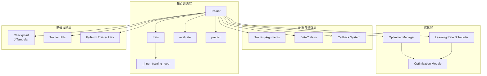

# Hugging Face Transformers 训练系统深度分析

## 目录

1. [系统架构总览](#1-系统架构总览)
2. [Trainer 核心训练循环](#2-trainer-核心训练循环)
3. [TrainingArguments 训练参数](#3-trainingarguments-训练参数)
4. [回调系统](#4-回调系统)
5. [训练工具 (trainer_utils)](#5-训练工具-trainer_utils)
6. [PyTorch 训练工具 (trainer_pt_utils)](#6-pytorch-训练工具-trainer_pt_utils)
7. [Seq2Seq Trainer](#7-seq2seq-trainer)
8. [JIT Checkpoint](#8-jit-checkpoint)
9. [优化器管理 (trainer_optimizer)](#9-优化器管理-trainer_optimizer)
10. [数据整理器 (data_collator)](#10-数据整理器-data_collator)
11. [优化器与学习率调度器 (optimization)](#11-优化器与学习率调度器-optimization)
12. [模块间关系与协作](#12-模块间关系与协作)

---

## 训练系统架构总览



---

## 1. 系统架构总览

Hugging Face Transformers 的训练系统是一个功能完备、高度可扩展的训练框架，核心设计理念是 **"约定优于配置"** —— 提供合理的默认行为，同时通过继承和回调机制允许深度定制。

### 核心模块职责划分

```
┌─────────────────────────────────────────────────────────┐
│                      Trainer                            │
│  ┌──────────┐ ┌──────────┐ ┌──────────┐ ┌───────────┐  │
│  │  train() │ │evaluate()│ │predict() │ │compute_   │  │
│  │          │ │          │ │          │ │  loss()   │  │
│  └────┬─────┘ └────┬─────┘ └────┬─────┘ └─────┬─────┘  │
│       │            │            │              │         │
│  ┌────▼────────────▼────────────▼──────────────▼─────┐  │
│  │           _inner_training_loop / evaluation_loop   │  │
│  └───────────────────────┬───────────────────────────┘  │
│                          │                               │
│  ┌───────────┐ ┌────────▼────────┐ ┌────────────────┐  │
│  │ Callback  │ │ TrainingArguments│ │  DataCollator  │  │
│  │  System   │ │                  │ │                │  │
│  └───────────┘ └─────────────────┘ └────────────────┘  │
│                          │                               │
│  ┌───────────┐ ┌────────▼────────┐ ┌────────────────┐  │
│  │ Optimizer │ │   Scheduler     │ │  Checkpoint    │  │
│  │  Manager  │ │   (optimization)│ │  (JIT/regular) │  │
│  └───────────┘ └─────────────────┘ └────────────────┘  │
└─────────────────────────────────────────────────────────┘
```

### 初始化流程（Trainer.__init__）

Trainer 的初始化遵循严格的 11 步流程，源码中已有清晰注释：

```python
# Init flow:
#   1. Args & seed               – 默认参数、确定性设置
#   2. Accelerator & logging     – accelerator、内存追踪、日志级别、设备设置
#   3. Model resolution          – model / model_init、Liger Kernel、量化检查
#   4. Distributed strategy      – 模型并行、FSDP、SageMaker MP 标志
#   5. Device placement          – 将模型移至设备、模型包装
#   6. Model introspection       – loss kwargs、label names、label smoother
#   7. Store init arguments      – 数据、可调用对象、优化器、调度器、验证
#   8. Callbacks                 – 报告集成、JIT checkpoint、进度条
#   9. Hub & output              – repo 初始化、输出目录
#  10. Training state            – TrainerState、TrainerControl、内部簿记
#  11. Finalize                  – use_cache、XLA FSDPv2 mesh、内存追踪器停止
```

---

## 2. Trainer 核心训练循环

**文件**: [trainer.py](file:///workspace/src/transformers/trainer.py) (4420 行)

### 2.1 train() 方法 — 训练入口

`train()` 是训练的主入口，负责训练前的准备工作：

```python
def train(
    self,
    resume_from_checkpoint: str | bool | None = None,
    trial: "optuna.Trial | dict[str, Any] | None" = None,
    ignore_keys_for_eval: list[str] | None = None,
) -> TrainOutput:
    # 1. 内存追踪启动
    self._memory_tracker.start()

    # 2. 模型重初始化（如果提供了 model_init）
    if self.model_init is not None:
        enable_full_determinism(args.seed) if args.full_determinism else set_seed(args.seed)
        self.model = self.call_model_init(trial)
        self.optimizer, self.lr_scheduler = None, None

    # 3. Liger Kernel 优化
    if self.args.use_liger_kernel:
        apply_liger_kernel(self.model, self.args.liger_kernel_config)

    # 4. 梯度检查点
    if args.gradient_checkpointing:
        self.model.gradient_checkpointing_enable(
            gradient_checkpointing_kwargs=args.gradient_checkpointing_kwargs
        )

    # 5. 特殊 token 对齐
    align_special_tokens(self.model, self.processing_class)

    # 6. NEFTune 噪声注入
    if self.neftune_noise_alpha is not None:
        self.neftune_hook_handle = activate_neftune(self.model, self.neftune_noise_alpha, self.accelerator)

    # 7. 从 checkpoint 恢复
    if resume_from_checkpoint is not None:
        self._load_from_checkpoint(resume_from_checkpoint)

    # 8. 自动查找可执行 batch size
    inner_training_loop = find_executable_batch_size(
        self._inner_training_loop, self._train_batch_size, args.auto_find_batch_size
    )

    return inner_training_loop(
        args=args, resume_from_checkpoint=resume_from_checkpoint,
        trial=trial, ignore_keys_for_eval=ignore_keys_for_eval,
    )
```

**设计要点**：
- `find_executable_batch_size` 装饰器支持自动 batch size 搜索，遇到 OOM 时以 0.9 倍衰减重试
- 恢复训练时先加载 checkpoint，再进入内层循环
- NEFTune 和 Liger Kernel 等优化在训练开始时动态注入

### 2.2 _inner_training_loop() — 核心训练循环

这是实际执行训练的内部方法，结构清晰：

```python
def _inner_training_loop(self, batch_size=None, args=None, ...):
    # 阶段1: 准备
    self.accelerator.free_memory()
    train_dataloader = self.get_train_dataloader()

    # 计算训练步数
    (num_train_epochs, num_update_steps_per_epoch, num_examples,
     num_train_samples, total_train_batch_size, steps_in_epoch,
     max_steps) = self.set_initial_training_values(args, train_dataloader)

    # 初始化训练状态
    epochs_trained, steps_trained_in_current_epoch = self._init_training_state(...)

    # 准备模型、优化器、调度器
    model, train_dataloader = self._prepare_for_training(
        max_steps, train_dataloader, resume_from_checkpoint
    )

    # 阶段2: 训练
    self._tr_loss = torch.tensor(0.0, device=args.device)  # 在设备上累积 loss
    self._total_loss_scalar = 0.0
    model.zero_grad()

    self.control = self.callback_handler.on_train_begin(args, self.state, self.control)

    for epoch in range(epochs_trained, num_train_epochs):
        self._run_epoch(model=model, epoch=epoch, train_dataloader=train_dataloader, ...)
        if self.control.should_training_stop:
            break

    # 阶段3: 收尾
    return self._finalize_training(trial, num_train_samples, start_time)
```

### 2.3 _run_epoch() — 单 epoch 执行

```python
def _run_epoch(self, model, epoch, train_dataloader, ...):
    step = -1

    # 处理 checkpoint 恢复：跳过已训练的 batch
    if epoch == epochs_trained and resume_from_checkpoint is not None:
        if steps_trained_in_current_epoch > 0 and not self.args.ignore_data_skip:
            train_dataloader = skip_first_batches(train_dataloader, steps_trained_in_current_epoch)

    # 设置 epoch（用于分布式数据 shuffle）
    if hasattr(train_dataloader, "set_epoch"):
        train_dataloader.set_epoch(epoch)

    # 外层循环：每个 optimizer step 一次迭代
    for update_step in range(num_update_steps_trained, num_update_steps_per_epoch):
        # 预取 gradient_accumulation_steps 个 batch
        batch_samples, num_items_in_batch = self.get_batch_samples(
            epoch_iterator, num_batches, self.args.device
        )

        # 内层循环：每个 micro-batch 执行 forward + backward
        for i, inputs in enumerate(batch_samples):
            step += 1
            do_sync_step = (step + 1) % self.args.gradient_accumulation_steps == 0
            self.accelerator.gradient_state._set_sync_gradients(do_sync_step)

            # ... training_step, gradient clipping, optimizer step ...
```

**关键设计**：
- **预取机制**：一次性获取 `gradient_accumulation_steps` 个 batch，减少数据加载开销
- **梯度累积**：内层循环累积梯度，仅在同步步执行 optimizer step
- **loss 累积优化**：`_tr_loss` 在设备上累积（避免频繁 `.item()` 同步），仅在日志步才同步到 CPU

### 2.4 training_step() — 单步训练

```python
def training_step(self, model, inputs, num_items_in_batch=None):
    # 上下文并行准备
    cp_context, inputs = self._prepare_context_parallel_inputs(model, inputs)

    with cp_context():
        model.train()
        inputs = self._prepare_inputs(inputs)

        with self.compute_loss_context_manager():
            loss = self.compute_loss(model, inputs, num_items_in_batch=num_items_in_batch)

        # 多 GPU 时取均值
        if self.args.n_gpu > 1:
            loss = loss.mean()

        # 梯度累积归一化
        if (not self.model_accepts_loss_kwargs or num_items_in_batch is None) and self.compute_loss_func is None:
            loss = loss / self.current_gradient_accumulation_steps

        # DeepSpeed 特殊处理
        if self.accelerator.distributed_type == DistributedType.DEEPSPEED:
            kwargs["scale_wrt_gas"] = False

        self.accelerator.backward(loss, **kwargs)
        return loss.detach()
```

### 2.5 compute_loss() — 损失计算

```python
def compute_loss(self, model, inputs, return_outputs=False, num_items_in_batch=None):
    # DeepSpeed 序列并行
    if pc is not None and pc.sp_backend == "deepspeed" and pc.sp_enabled and self.model.training:
        return deepspeed_sp_compute_loss(self.accelerator, model, inputs, return_outputs, pc)

    # Label smoother 或自定义 loss 函数时，先弹出 labels
    if (self.label_smoother is not None or self.compute_loss_func is not None) and "labels" in inputs:
        labels = inputs.pop("labels")
    else:
        labels = None

    # 传递 num_items_in_batch 给模型（用于精确 loss 计算）
    if self.model_accepts_loss_kwargs:
        kwargs = {}
        if num_items_in_batch is not None:
            kwargs["num_items_in_batch"] = num_items_in_batch
        inputs = {**inputs, **kwargs}

    outputs = model(**inputs)

    # 自定义 loss 函数优先
    if self.compute_loss_func is not None:
        loss = self.compute_loss_func(outputs, labels, num_items_in_batch=num_items_in_batch)
    # Label smoothing
    elif labels is not None:
        if model_name in MODEL_FOR_CAUSAL_LM_MAPPING_NAMES.values():
            loss = self.label_smoother(outputs, labels, shift_labels=True)  # 因果 LM 需要 shift
        else:
            loss = self.label_smoother(outputs, labels)
    # 默认：直接取模型输出的 loss
    else:
        loss = outputs["loss"] if isinstance(outputs, dict) else outputs[0]

    return (loss, outputs) if return_outputs else loss
```

**设计亮点**：
- 三层 loss 计算优先级：`compute_loss_func` > `label_smoother` > 模型内置 loss
- `num_items_in_batch` 参数用于精确归一化梯度累积时的 loss
- 因果 LM 自动执行 label shift（`shift_labels=True`）

### 2.6 evaluate() — 评估

```python
def evaluate(self, eval_dataset=None, ignore_keys=None, metric_key_prefix="eval"):
    # 支持多评估数据集
    if isinstance(eval_dataset, dict):
        metrics = {}
        for eval_dataset_name, _eval_dataset in eval_dataset.items():
            dataset_metrics = self.evaluate(
                eval_dataset=_eval_dataset,
                metric_key_prefix=f"{metric_key_prefix}_{eval_dataset_name}",
            )
            metrics.update(dataset_metrics)
        return metrics

    eval_dataloader = self.get_eval_dataloader(eval_dataset)
    output = self.evaluation_loop(
        eval_dataloader, description="Evaluation",
        prediction_loss_only=True if self.compute_metrics is None else None,
        ignore_keys=ignore_keys, metric_key_prefix=metric_key_prefix,
    )
    # 添加速度指标
    output.metrics.update(speed_metrics(metric_key_prefix, start_time, num_samples=output.num_samples))
    self.log(output.metrics)
    return output.metrics
```

### 2.7 prediction_step() — 预测步骤

```python
def prediction_step(self, model, inputs, prediction_loss_only, ignore_keys=None):
    # 无梯度计算
    with torch.no_grad():
        if self.args.prediction_loss_only:
            # 仅计算 loss
            loss = self.compute_loss(model, inputs)
            return (loss, None, None)

        # 计算 loss + logits
        with self.compute_loss_context_manager():
            loss, outputs = self.compute_loss(model, inputs, return_outputs=True)
        # ... 处理 logits 和 labels ...
```

---

## 3. TrainingArguments 训练参数

**文件**: [training_args.py](file:///workspace/src/transformers/training_args.py) (2871 行)

### 3.1 核心设计

`TrainingArguments` 是一个 `@dataclass`，集中管理所有训练超参数，可通过 `HfArgumentParser` 转换为命令行参数。

### 3.2 关键参数分类

| 类别 | 关键参数 | 默认值 | 说明 |
|------|---------|--------|------|
| **训练时长** | `num_train_epochs` | 3.0 | 训练轮数 |
| | `max_steps` | -1 | 最大步数（覆盖 epochs） |
| | `per_device_train_batch_size` | 8 | 每设备 batch size |
| **学习率** | `learning_rate` | 5e-5 | 初始学习率 |
| | `lr_scheduler_type` | "linear" | 调度器类型 |
| | `warmup_steps` | 0 | 预热步数 |
| **优化器** | `optim` | "adamw_torch" | 优化器类型 |
| | `weight_decay` | 0 | 权重衰减 |
| | `adam_beta1/beta2` | 0.9/0.999 | Adam 参数 |
| **正则化** | `gradient_accumulation_steps` | 1 | 梯度累积步数 |
| | `max_grad_norm` | 1.0 | 梯度裁剪阈值 |
| | `label_smoothing_factor` | 0.0 | 标签平滑 |
| **混合精度** | `fp16` / `bf16` | False | 混合精度训练 |
| | `tf32` | 自动 | TF32 模式 |
| **梯度检查点** | `gradient_checkpointing` | False | 梯度检查点 |
| **日志** | `logging_strategy` | "steps" | 日志策略 |
| | `logging_steps` | 500 | 日志间隔 |
| **评估** | `eval_strategy` | "no" | 评估策略 |
| | `eval_steps` | 500 | 评估间隔 |
| **保存** | `save_strategy` | "steps" | 保存策略 |
| | `save_steps` | 500 | 保存间隔 |
| | `save_total_limit` | None | 最多保存数 |
| **分布式** | `fsdp` | "" | FSDP 配置 |
| | `deepspeed` | None | DeepSpeed 配置 |
| | `ddp_timeout` | 1800 | DDP 超时 |

### 3.3 OptimizerNames 枚举

支持 30+ 种优化器，通过 `ExplicitEnum` 实现类型安全：

```python
class OptimizerNames(ExplicitEnum):
    ADAMW_TORCH = "adamw_torch"           # PyTorch AdamW（默认）
    ADAMW_TORCH_FUSED = "adamw_torch_fused"  # 融合 AdamW
    ADAFACTOR = "adafactor"               # 内存高效优化器
    ADAMW_8BIT = "adamw_8bit"             # 8-bit AdamW (bitsandbytes)
    SGD = "sgd"                           # SGD
    GALORE_ADAMW = "galore_adamw"         # GaLore 低秩优化器
    LOMO = "lomo"                         # LOMO 优化器
    GROKADAMW = "grokadamw"               # GrokAdamW
    SCHEDULE_FREE_ADAMW = "schedule_free_adamw"  # ScheduleFree
    APOLLO_ADAMW = "apollo_adamw"         # APOLLO 低秩优化器
    STABLE_ADAMW = "stable_adamw"         # StableAdamW
    # ... 更多
```

### 3.4 ParallelMode 枚举

```python
class ParallelMode(Enum):
    NOT_PARALLEL = "not_parallel"
    NOT_DISTRIBUTED = "not_distributed"
    DISTRIBUTED = "distributed"
    SAGEMAKER_MODEL_PARALLEL = "sagemaker_model_parallel"
    SAGEMAKER_DATA_PARALLEL = "sagemaker_data_parallel"
    TPU = "tpu"
```

### 3.5 关键属性计算

TrainingArguments 包含多个 `@cached_property`，在首次访问时计算：

```python
@cached_property
def device(self) -> torch.device:
    # 自动选择最优设备：CUDA > NPU > HPU > MPS > XPU > CPU
    ...

@cached_property
def n_gpu(self) -> int:
    # 可用 GPU 数量
    ...

@cached_property
def parallel_mode(self) -> ParallelMode:
    # 根据环境自动判断并行模式
    ...
```

---

## 4. 回调系统

**文件**: [trainer_callback.py](file:///workspace/src/transformers/trainer_callback.py) (784 行)

### 4.1 架构设计

回调系统采用 **观察者模式**，由三个核心类组成：

```
TrainerCallback (基类)
    ├── DefaultFlowCallback   — 控制训练流程（日志/评估/保存触发）
    ├── ProgressCallback      — 进度条显示
    ├── PrinterCallback       — 打印日志
    ├── EarlyStoppingCallback — 早停机制
    └── JITCheckpointCallback — JIT 检查点

TrainerState (数据类) — 训练状态快照
TrainerControl (控制类) — 训练流程控制信号

CallbackHandler (调度器) — 按序调用所有回调
```

### 4.2 TrainerState — 训练状态

```python
@dataclass
class TrainerState:
    epoch: float = 0                    # 当前 epoch
    global_step: int = 0                # 全局步数
    max_steps: int = 0                  # 最大步数
    logging_steps: int = 500            # 日志间隔
    eval_steps: int = 500               # 评估间隔
    save_steps: int = 500               # 保存间隔
    total_flos: float = 0               # 总浮点运算量
    log_history: list[dict] = None      # 日志历史
    best_metric: float | None = None    # 最佳指标值
    best_model_checkpoint: str | None = None  # 最佳模型路径
    is_local_process_zero: bool = True  # 是否本地主进程
    is_world_process_zero: bool = True  # 是否全局主进程
    stateful_callbacks: list = None     # 有状态回调

    def save_to_json(self, json_path): ...    # 保存为 JSON
    def load_from_json(cls, json_path): ...   # 从 JSON 加载
    def compute_steps(self, args, max_steps): ...  # 计算绝对步数
```

**设计要点**：
- `compute_steps()` 支持比例值（如 `logging_steps=0.1` 表示总步数的 10%）
- `stateful_callbacks` 支持回调状态的保存和恢复，实现训练恢复时回调状态不丢失
- `save_to_json` / `load_from_json` 用于 checkpoint 保存/恢复

### 4.3 TrainerControl — 流程控制

```python
@dataclass
class TrainerControl(ExportableState):
    should_training_stop: bool = False   # 停止整个训练
    should_epoch_stop: bool = False      # 停止当前 epoch
    should_save: bool = False            # 保存模型
    should_evaluate: bool = False        # 执行评估
    should_log: bool = False             # 记录日志

    def _new_training(self): ...   # 重置训练控制
    def _new_epoch(self): ...      # 重置 epoch 控制
    def _new_step(self): ...       # 重置步控制
```

**信号重置机制**：每个控制信号在对应的生命周期开始时自动重置，确保信号不会跨阶段传播。

### 4.4 TrainerCallback — 回调基类

定义了 14 个事件钩子，覆盖训练全生命周期：

```python
class TrainerCallback:
    def on_init_end(self, args, state, control, **kwargs): ...        # 初始化完成
    def on_train_begin(self, args, state, control, **kwargs): ...     # 训练开始
    def on_train_end(self, args, state, control, **kwargs): ...       # 训练结束
    def on_epoch_begin(self, args, state, control, **kwargs): ...     # Epoch 开始
    def on_epoch_end(self, args, state, control, **kwargs): ...       # Epoch 结束
    def on_step_begin(self, args, state, control, **kwargs): ...      # 步开始
    def on_pre_optimizer_step(self, args, state, control, **kwargs): ...  # 优化器步前
    def on_optimizer_step(self, args, state, control, **kwargs): ...  # 优化器步后
    def on_substep_end(self, args, state, control, **kwargs): ...     # 子步结束
    def on_step_end(self, args, state, control, **kwargs): ...        # 步结束
    def on_evaluate(self, args, state, control, **kwargs): ...        # 评估完成
    def on_predict(self, args, state, control, **kwargs): ...         # 预测完成
    def on_save(self, args, state, control, **kwargs): ...            # 保存完成
    def on_log(self, args, state, control, **kwargs): ...             # 日志记录
```

### 4.5 CallbackHandler — 回调调度器

```python
class CallbackHandler(TrainerCallback):
    def call_event(self, event, args, state, control, **kwargs):
        for callback in self.callbacks:
            result = getattr(callback, event)(
                args, state, control,
                model=self.model,
                processing_class=self.processing_class,
                optimizer=self.optimizer,
                lr_scheduler=self.lr_scheduler,
                train_dataloader=self.train_dataloader,
                eval_dataloader=self.eval_dataloader,
                **kwargs,
            )
            if result is not None:
                control = result  # 回调可以修改 control
        return control
```

**设计要点**：
- 每个事件自动注入 `model`、`optimizer`、`lr_scheduler` 等上下文
- 回调返回修改后的 `control` 对象，实现流程控制
- 回调按添加顺序执行，后添加的回调可以覆盖前面的控制决策

### 4.6 DefaultFlowCallback — 默认流程控制

这是训练流程的核心驱动者，决定了何时日志、评估和保存：

```python
class DefaultFlowCallback(TrainerCallback):
    def on_step_end(self, args, state, control, **kwargs):
        # 日志触发
        if state.global_step == 1 and args.logging_first_step:
            control.should_log = True
        if args.logging_strategy == IntervalStrategy.STEPS and state.global_step % state.logging_steps == 0:
            control.should_log = True

        # 评估触发
        if (args.eval_strategy == IntervalStrategy.STEPS
            and state.global_step % state.eval_steps == 0
            and args.eval_delay <= state.global_step):
            control.should_evaluate = True

        # 保存触发
        if (args.save_strategy == SaveStrategy.STEPS
            and state.save_steps > 0
            and state.global_step % state.save_steps == 0):
            control.should_save = True

        # 训练结束
        if state.global_step >= state.max_steps:
            control.should_training_stop = True
        return control

    def on_epoch_end(self, args, state, control, **kwargs):
        if args.logging_strategy == IntervalStrategy.EPOCH:
            control.should_log = True
        if args.eval_strategy == IntervalStrategy.EPOCH and args.eval_delay <= state.epoch:
            control.should_evaluate = True
        if args.save_strategy == SaveStrategy.EPOCH:
            control.should_save = True
        return control
```

### 4.7 EarlyStoppingCallback — 早停

```python
class EarlyStoppingCallback(TrainerCallback, ExportableState):
    def __init__(self, early_stopping_patience=1, early_stopping_threshold=0.0):
        self.early_stopping_patience = early_stopping_patience
        self.early_stopping_patience_counter = 0

    def on_evaluate(self, args, state, control, metrics, **kwargs):
        metric_value = metrics.get(metric_to_check)
        self.check_metric_value(args, state, control, metric_value)
        if self.early_stopping_patience_counter >= self.early_stopping_patience:
            control.should_training_stop = True
```

**关键约束**：需要 `load_best_model_at_end=True` 和 `metric_for_best_model` 才能正常工作。

### 4.8 ExportableState — 状态导出接口

```python
class ExportableState:
    def state(self) -> dict:
        """返回可序列化的状态字典"""
        raise NotImplementedError

    @classmethod
    def from_state(cls, state):
        """从状态字典恢复实例"""
        instance = cls(**state["args"])
        for k, v in state["attributes"].items():
            setattr(instance, k, v)
        return instance
```

允许回调在 checkpoint 保存/恢复时持久化自身状态，是训练可恢复性的关键。

---

## 5. 训练工具 (trainer_utils)

**文件**: [trainer_utils.py](file:///workspace/src/transformers/trainer_utils.py) (1254 行)

### 5.1 核心数据结构

```python
class EvalPrediction:
    """评估输出，用于计算指标"""
    predictions: np.ndarray
    label_ids: np.ndarray
    inputs: np.ndarray | None = None
    losses: np.ndarray | None = None

class EvalLoopOutput(NamedTuple):
    """评估循环输出"""
    predictions: np.ndarray | tuple
    label_ids: np.ndarray | tuple | None
    metrics: dict | None
    num_samples: int | None

class PredictionOutput(NamedTuple):
    """预测输出"""
    predictions: np.ndarray | tuple
    label_ids: np.ndarray | tuple | None
    metrics: dict | None

class TrainOutput(NamedTuple):
    """训练输出"""
    global_step: int
    training_loss: float
    metrics: dict
```

### 5.2 策略枚举

```python
class IntervalStrategy(ExplicitEnum):
    NO = "no"          # 不执行
    STEPS = "steps"    # 按步执行
    EPOCH = "epoch"    # 按 epoch 执行

class SaveStrategy(ExplicitEnum):
    NO = "no"
    STEPS = "steps"
    EPOCH = "epoch"
    BEST = "best"      # 仅保存最佳模型

class SchedulerType(ExplicitEnum):
    LINEAR = "linear"
    COSINE = "cosine"
    COSINE_WITH_RESTARTS = "cosine_with_restarts"
    POLYNOMIAL = "polynomial"
    CONSTANT = "constant"
    CONSTANT_WITH_WARMUP = "constant_with_warmup"
    INVERSE_SQRT = "inverse_sqrt"
    REDUCE_ON_PLATEAU = "reduce_lr_on_plateau"
    COSINE_WITH_MIN_LR = "cosine_with_min_lr"
    WARMUP_STABLE_DECAY = "warmup_stable_decay"
    GREEDY = "greedy"
```

### 5.3 关键工具函数

**Checkpoint 管理**：

```python
def get_last_checkpoint(folder):
    """查找最新的 checkpoint 目录"""
    checkpoints = [path for path in content if _re_checkpoint.search(path) is not None]
    return os.path.join(folder, max(checkpoints, key=lambda x: int(_re_checkpoint.search(x).groups()[0])))

def rotate_checkpoints(output_dir, save_total_limit=None, best_model_checkpoint=None, ...):
    """删除旧 checkpoint，保留最近的和最佳的"""
    # 始终保护最新 checkpoint（用于恢复训练）和最佳 checkpoint
    protected = {checkpoints[-1]}
    if best_model_checkpoint is not None:
        protected.add(str(Path(best_model_checkpoint)))
    # 删除最旧的非保护 checkpoint
```

**随机种子**：

```python
def set_seed(seed, deterministic=False):
    """设置 random、numpy、torch 的随机种子"""
    random.seed(seed)
    np.random.seed(seed)
    torch.manual_seed(seed)
    torch.cuda.manual_seed_all(seed)
    # 支持多种设备：MLU、MUSA、NPU、HPU、XPU

def enable_full_determinism(seed, warn_only=False):
    """启用完全确定性模式"""
    set_seed(seed)
    os.environ["CUDA_LAUNCH_BLOCKING"] = "1"
    os.environ["CUBLAS_WORKSPACE_CONFIG"] = ":16:8"
    torch.use_deterministic_algorithms(True, warn_only=warn_only)
    torch.backends.cudnn.deterministic = True
    torch.backends.cudnn.benchmark = False
```

**RemoveColumnsCollator**：

```python
class RemoveColumnsCollator:
    """包装 data_collator，在整理前移除模型不需要的列"""
    def __call__(self, features):
        features = [self._remove_columns(feature) for feature in features]
        return self.data_collator(features)
```

**速度指标**：

```python
def speed_metrics(split, start_time, num_samples=None, num_steps=None, num_tokens=None):
    """计算运行时、样本/秒、步/秒、token/秒"""
    runtime = time.time() - start_time
    result = {f"{split}_runtime": round(runtime, 4)}
    if num_samples is not None:
        result[f"{split}_samples_per_second"] = round(num_samples / runtime, 3)
    # ...
```

---

## 6. PyTorch 训练工具 (trainer_pt_utils)

**文件**: [trainer_pt_utils.py](file:///workspace/src/transformers/trainer_pt_utils.py) (1336 行)

### 6.1 嵌套张量操作

这是训练系统中大量使用的底层工具，支持对任意嵌套结构（list/tuple/dict/Tensor）的操作：

```python
def nested_concat(tensors, new_tensors, padding_index=-100):
    """递归拼接嵌套张量，支持不同长度的 padding"""
    if isinstance(tensors, torch.Tensor):
        return torch_pad_and_concatenate(tensors, new_tensors, padding_index)
    elif isinstance(tensors, Mapping):
        return type(tensors)({k: nested_concat(t, new_tensors[k]) for k, t in tensors.items()})
    # ...

def nested_detach(tensors):
    """递归 detach 嵌套张量"""
    # ...

def nested_numpify(tensors):
    """递归将嵌套张量转为 numpy（自动处理 bfloat16 → float32）"""
    # ...

def nested_gather(tensors, parallel_mode, name=None):
    """跨进程收集嵌套张量"""
    if is_torch_xla_available():
        tensors = nested_xla_mesh_reduce(tensors, name)
    elif parallel_mode == ParallelMode.DISTRIBUTED:
        tensors = distributed_concat(tensors)
    return tensors
```

### 6.2 LabelSmoother — 标签平滑

```python
@dataclass
class LabelSmoother:
    epsilon: float = 0.1
    ignore_index: int = -100

    def __call__(self, model_output, labels, shift_labels=False):
        logits = model_output["logits"] if isinstance(model_output, dict) else model_output[0]
        if shift_labels:
            logits = logits[..., :-1, :].contiguous()  # 因果 LM shift
            labels = labels[..., 1:].contiguous()

        log_probs = -nn.functional.log_softmax(logits, dim=-1)
        padding_mask = labels.eq(self.ignore_index)
        labels = torch.clamp(labels, min=0)
        nll_loss = log_probs.gather(dim=-1, index=labels.unsqueeze(-1))
        smoothed_loss = log_probs.sum(dim=-1, keepdim=True, dtype=torch.float32)

        # 忽略 padding 位置
        nll_loss.masked_fill_(padding_mask, 0.0)
        smoothed_loss.masked_fill_(padding_mask, 0.0)

        num_active = padding_mask.numel() - padding_mask.long().sum()
        nll_loss = nll_loss.sum() / num_active
        smoothed_loss = smoothed_loss.sum() / (num_active * log_probs.shape[-1])
        return (1 - self.epsilon) * nll_loss + self.epsilon * smoothed_loss
```

### 6.3 LengthGroupedSampler — 长度分组采样

```python
def get_length_grouped_indices(lengths, batch_size, mega_batch_mult=None, generator=None):
    """
    将相似长度的样本分到同一个 batch，减少 padding 开销：
    1. 随机排列索引
    2. 按 mega_batch 分组
    3. 每组内按长度排序
    4. 最长 batch 放最前（OOM 尽早发生）
    """
    indices = torch.randperm(len(lengths), generator=generator)
    megabatches = [indices[i:i+megabatch_size].tolist() for i in range(0, len(lengths), megabatch_size)]
    megabatches = [sorted(megabatch, key=lambda i: lengths[i], reverse=True) for megabatch in megabatches]
    # 将最长 batch 放最前
    megabatch_maximums = [lengths[megabatch[0]] for megabatch in megabatches]
    max_idx = torch.argmax(torch.tensor(megabatch_maximums)).item()
    megabatches[0][0], megabatches[max_idx][0] = megabatches[max_idx][0], megabatches[0][0]
    return [i for megabatch in megabatches for i in megabatch]
```

### 6.4 EvalLoopContainer — 评估结果容器

```python
class EvalLoopContainer:
    """评估循环中间结果容器，支持延迟拼接和内存优化"""
    def __init__(self, do_nested_concat=True, padding_index=-100):
        self.do_nested_concat = do_nested_concat
        self.tensors = None   # 设备上的张量
        self.arrays = None    # CPU 上的 numpy 数组

    def add(self, tensors):
        """添加张量（在设备上累积）"""
        if self.do_nested_concat:
            self.tensors = nested_concat(self.tensors, tensors, padding_index=self.padding_index)
        else:
            self.tensors.append(tensors)

    def to_cpu_and_numpy(self):
        """将设备张量移至 CPU 并转为 numpy"""
        new_arrays = nested_numpify(self.tensors)
        self.arrays = nested_concat(self.arrays, new_arrays)
        self.tensors = None  # 释放设备内存
```

**设计要点**：设备上累积 → 批量转 CPU → 释放设备内存，避免频繁 CPU-GPU 同步。

### 6.5 LayerWiseDummyOptimizer / Scheduler

```python
class LayerWiseDummyOptimizer(torch.optim.Optimizer):
    """逐层优化器（如 GaLore）的占位符，实际优化通过 post_grad_hook 完成"""
    def zero_grad(self, set_to_none=True): pass
    def step(self, closure=None): pass

class LayerWiseDummyScheduler(LRScheduler):
    """逐层调度器的占位符"""
    def get_lr(self):
        # 从 optimizer_dict 中收集所有参数组的学习率
        param_wise_lrs = [
            [group["lr"] for group in optim.param_groups]
            for optim in self.optimizer.optimizer_dict.values()
        ]
        return list(chain(*param_wise_lrs))
```

### 6.6 AcceleratorConfig

```python
@dataclass
class AcceleratorConfig:
    """Accelerator 配置子集"""
    split_batches: bool = False          # 是否跨设备分割 batch
    dispatch_batches: bool | None = None # 是否仅在主进程迭代
    even_batches: bool = True            # 是否均匀分配 batch
    use_seedable_sampler: bool = True    # 使用可复现的采样器
    non_blocking: bool = False           # 非阻塞 CUDA 调用
    gradient_accumulation_kwargs: dict | None = None
    use_configured_state: bool = False
```

---

## 7. Seq2Seq Trainer

**文件**: [trainer_seq2seq.py](file:///workspace/src/transformers/trainer_seq2seq.py) (392 行)

### 7.1 核心设计

`Seq2SeqTrainer` 继承自 `Trainer`，核心差异在于评估/预测时使用 **`model.generate()`** 而非简单的 forward pass：

```python
class Seq2SeqTrainer(Trainer):
    def __init__(self, ...):
        super().__init__(...)
        # 覆盖 generation_config
        if self.args.generation_config is not None:
            gen_config = self.load_generation_config(self.args.generation_config)
            self.model.generation_config = gen_config
```

### 7.2 prediction_step() — 关键覆写

```python
def prediction_step(self, model, inputs, prediction_loss_only, ignore_keys=None, **gen_kwargs):
    # 如果不需要生成，回退到父类
    if not self.args.predict_with_generate or prediction_loss_only:
        return super().prediction_step(model, inputs, ...)

    # 使用 model.generate() 生成 token
    generation_inputs = inputs.copy()
    # 移除 decoder_input_ids（避免从 labels 生成的输入限制生成）
    if "labels" in generation_inputs and "decoder_input_ids" in generation_inputs:
        generation_inputs = {
            k: v for k, v in inputs.items()
            if k not in ("decoder_input_ids", "decoder_attention_mask")
        }

    # FSDP 需要召唤完整参数
    with FullyShardedDataParallel.summon_full_params(self.model):
        generated_tokens = self.model.generate(**generation_inputs, **gen_kwargs)

    # 单独计算 loss（不参与生成）
    with torch.no_grad():
        if has_labels:
            outputs = model(**inputs)
            loss = (outputs["loss"] if isinstance(outputs, dict) else outputs[0]).detach().mean()

    # 对齐生成长度
    if generated_tokens.shape[-1] < gen_config.max_length:
        generated_tokens = self._pad_tensors_to_max_len(generated_tokens, gen_config.max_length)

    return loss, generated_tokens, labels
```

**设计要点**：
- 生成和 loss 计算是分离的：生成用 `model.generate()`，loss 用 `model.forward()`
- FSDP 兼容：使用 `summon_full_params` 上下文管理器
- 自动处理 `decoder_input_ids` 的移除，避免约束生成

---

## 8. JIT Checkpoint

**文件**: [trainer_jit_checkpoint.py](file:///workspace/src/transformers/trainer_jit_checkpoint.py) (125 行)

### 8.1 设计目标

在分布式训练中，当收到 SIGTERM 信号（如抢占式实例被回收）时，**及时保存 checkpoint**，避免训练进度丢失。

### 8.2 CheckpointManager

```python
class CheckpointManager:
    def __init__(self, trainer, kill_wait=3):
        self.trainer = trainer
        self.is_checkpoint_requested = False
        self.kill_wait = kill_wait  # 区分 SIGTERM 和 SIGKILL 的等待时间

    def setup_signal_handler(self):
        """注册 SIGTERM 信号处理器"""
        self._original_sigterm_handler = signal.signal(signal.SIGTERM, self._sigterm_handler)

    def _sigterm_handler(self, signum, frame):
        """收到 SIGTERM 后，等待 kill_wait 秒再标记需要 checkpoint"""
        if self.is_checkpoint_requested:
            return
        threading.Timer(self.kill_wait, self._enable_checkpoint).start()

    def execute_jit_checkpoint(self):
        """执行即时 checkpoint"""
        self.is_checkpoint_requested = False
        current_step = self.trainer.state.global_step

        # 创建 sentinel 文件标记 checkpoint 进行中
        sentinel_file = os.path.join(output_dir, checkpoint_folder, "checkpoint-is-incomplete.txt")
        with open(sentinel_file, "w") as f:
            f.write(f"Checkpoint started at step {current_step} and in progress...")

        # 调用 Trainer 的 checkpoint 方法
        self.trainer._save_checkpoint(self.trainer.model, trial=None)

        # 删除 sentinel 文件
        if os.path.exists(sentinel_file):
            os.remove(sentinel_file)
```

### 8.3 JITCheckpointCallback

```python
class JITCheckpointCallback(TrainerCallback):
    def on_pre_optimizer_step(self, args, state, control, **kwargs):
        if self.jit_manager and self.jit_manager.is_checkpoint_requested:
            control.should_training_stop = True
            self.jit_manager.execute_jit_checkpoint()

    def on_step_end(self, args, state, control, **kwargs):
        if self.jit_manager and self.jit_manager.is_checkpoint_requested:
            control.should_save = False      # 取消常规保存
            control.should_training_stop = True
            self.jit_manager.execute_jit_checkpoint()

    def on_train_end(self, args, state, control, **kwargs):
        # 恢复原始 SIGTERM 处理器
        if self.jit_manager and self.jit_manager._original_sigterm_handler is not None:
            signal.signal(signal.SIGTERM, self.jit_manager._original_sigterm_handler)
```

**设计亮点**：
- `kill_wait` 机制：等待 3 秒确认是 SIGTERM（优雅终止）而非 SIGKILL（强制终止）
- Sentinel 文件：标记 checkpoint 进行中，防止中断导致的不完整 checkpoint 被误用
- 在多个回调事件中检查 checkpoint 请求，确保及时响应

---

## 9. 优化器管理 (trainer_optimizer)

**文件**: [trainer_optimizer.py](file:///workspace/src/transformers/trainer_optimizer.py) (615 行)

### 9.1 架构设计

采用 **策略模式 + 注册表** 的设计，每个优化器对应一个 handler 函数：

```python
OptimizerHandler = Callable[[OptimizerContext], tuple[Any, dict[str, Any]]]

@dataclass
class OptimizerContext:
    args: TrainingArguments
    model: PreTrainedModel | None
    optimizer_kwargs: dict[str, Any]    # 基础参数（lr 等）
    adam_kwargs: dict[str, Any]         # Adam 特定参数
    optim_args: dict[str, str]          # 自定义参数字符串
```

### 9.2 Handler 示例

```python
def _get_adamw_torch(ctx: OptimizerContext):
    """PyTorch AdamW（常规或融合版本）"""
    from torch.optim import AdamW
    ctx.optimizer_kwargs.update(ctx.adam_kwargs)
    if ctx.args.optim == OptimizerNames.ADAMW_TORCH_FUSED:
        ctx.optimizer_kwargs.update({"fused": True})
    return AdamW, ctx.optimizer_kwargs

def _get_bitsandbytes_optimizer(ctx: OptimizerContext):
    """bitsandbytes 优化器（AdamW/Lion/RMSprop 变体）"""
    from bitsandbytes.optim import AdamW, Lion, RMSprop
    optim_name = ctx.args.optim
    is_paged = "paged" in optim_name
    optim_bits = 8 if "8bit" in optim_name else 32
    # ... 根据 optim_name 选择优化器类和参数
```

### 9.3 低秩优化器设置

```python
def _setup_low_rank_optimizer(args, model, optimizer_name, optimizer_mapping, optim_kwargs, ...):
    """设置低秩优化器（GaLore、APOLLO）"""
    # 1. 识别目标模块
    for module_name, module in model.named_modules():
        target_module_exists, is_regex = check_target_module_exists(
            args.optim_target_modules, module_name, return_is_regex=True
        )
        if isinstance(module, nn.Linear) and (target_module_exists or all_linear):
            target_params_names.append(module_name + ".weight")

    # 2. 分离目标参数和非目标参数
    target_params = [p for n, p in model.named_parameters() if n in target_params_names]
    non_target_params = [p for n, p in model.named_parameters() if n not in target_params_names]

    # 3. 逐层优化器（layerwise）
    if is_layerwise:
        optimizer_dict = {}
        for param in target_params:
            optimizer_dict[param] = optimizer_cls([{"params": [param], **optim_kwargs}], **optimizer_kwargs)
        # 注册 post_grad_hook，梯度累积后自动 step
        for param in model.parameters():
            if param.requires_grad:
                param.register_post_accumulate_grad_hook(optimizer_hook)
        optimizer_cls = LayerWiseDummyOptimizer  # 用占位符替代
```

### 9.4 优化器注册表

```python
_OPTIMIZER_HANDLERS: dict[str, OptimizerHandler] = {
    OptimizerNames.ADAFACTOR: _get_adafactor,
    OptimizerNames.ADAMW_TORCH: _get_adamw_torch,
    OptimizerNames.ADAMW_TORCH_FUSED: _get_adamw_torch,
    OptimizerNames.SGD: _get_sgd,
    OptimizerNames.GROKADAMW: _get_grokadamw,
    **dict.fromkeys(_BITSANDBYTES_OPTIMIZERS, _get_bitsandbytes_optimizer),
    **dict.fromkeys(_GALORE_OPTIMIZERS, _get_galore_optimizer),
    **dict.fromkeys(_APOLLO_OPTIMIZERS, _get_apollo_optimizer),
    **dict.fromkeys(_TORCHAO_OPTIMIZERS, _get_torchao_optimizer),
    **dict.fromkeys(_SCHEDULE_FREE_OPTIMIZERS, _get_schedule_free_optimizer),
    # ...
}
```

**设计优势**：
- 新增优化器只需添加 handler 函数和注册条目，无需修改 Trainer 代码
- `OptimizerContext` 统一了所有 handler 的输入接口
- `is_optimizer_factory()` 区分普通优化器类和工厂函数（如 Muon）

---

## 10. 数据整理器 (data_collator)

**文件**: [data_collator.py](file:///workspace/src/transformers/data/data_collator.py) (1462 行)

### 10.1 核心接口

```python
DataCollator = Callable[[list[InputDataClass]], dict[str, Any]]
```

DataCollator 负责将单个样本列表整理成一个 batch 的张量字典。

### 10.2 DataCollator 层次结构

```
DataCollator (类型别名)
    ├── default_data_collator()           — 最简单的整理器
    ├── DefaultDataCollator               — 面向对象版本
    ├── DataCollatorWithPadding           — 动态 padding
    ├── DataCollatorForTokenClassification — token 分类（labels 也需 padding）
    ├── DataCollatorForSeq2Seq            — 序列到序列（labels + decoder_input_ids）
    ├── DataCollatorForMultipleChoice     — 多选题
    ├── DataCollatorForLanguageModeling   — 语言建模（MLM / CLM）
    ├── DataCollatorForWholeWordMask      — 全词掩码（已废弃，合并到上面的 whole_word_mask=True）
    ├── DataCollatorForSOP                — 句子顺序预测（已废弃）
    ├── DataCollatorForPermutationLanguageModeling — 排列语言建模（XLNet）
    └── DataCollatorWithFlattening        — 无 padding 展平（Flash Attention）
```

### 10.3 DataCollatorWithPadding — 动态 Padding

```python
@dataclass
class DataCollatorWithPadding:
    tokenizer: PreTrainedTokenizerBase
    padding: bool | str | PaddingStrategy = True
    max_length: int | None = None
    pad_to_multiple_of: int | None = None
    return_tensors: str = "pt"

    def __call__(self, features):
        batch = pad_without_fast_tokenizer_warning(
            self.tokenizer, features,
            padding=self.padding, max_length=self.max_length,
            pad_to_multiple_of=self.pad_to_multiple_of,
            return_tensors=self.return_tensors,
        )
        # 统一 label / label_ids → labels
        if "label" in batch:
            batch["labels"] = batch["label"]
            del batch["label"]
        return batch
```

### 10.4 DataCollatorForLanguageModeling — MLM/CLM

```python
@dataclass
class DataCollatorForLanguageModeling(DataCollatorMixin):
    tokenizer: PreTrainedTokenizerBase
    mlm: bool = True                    # True=MLM, False=CLM
    mlm_probability: float = 0.15       # 掩码概率
    mask_replace_prob: float = 0.8      # 替换为 [MASK] 的概率
    random_replace_prob: float = 0.1    # 替换为随机 token 的概率
    whole_word_mask: bool = False       # 全词掩码
    seed: int | None = None             # 可复现的随机种子

    def torch_mask_tokens(self, inputs, special_tokens_mask=None, offset_mapping=None):
        """MLM 掩码策略：80% [MASK], 10% 随机, 10% 原始"""
        labels = inputs.clone()
        probability_matrix = torch.full(labels.shape, self.mlm_probability)
        probability_matrix.masked_fill_(no_mask_mask, value=0.0)
        masked_indices = torch.bernoulli(probability_matrix).bool()
        labels[~masked_indices] = -100  # 非掩码位置不计算 loss

        # 80% → [MASK]
        indices_replaced = torch.bernoulli(torch.full(labels.shape, 0.8)).bool() & masked_indices
        inputs[indices_replaced] = self.tokenizer.mask_token_id

        # 10% → 随机 token
        # 10% → 保持不变
        return inputs, labels
```

### 10.5 DataCollatorForSeq2Seq

```python
@dataclass
class DataCollatorForSeq2Seq:
    tokenizer: PreTrainedTokenizerBase
    model: Any | None = None
    label_pad_token_id: int = -100

    def __call__(self, features, return_tensors=None):
        # 分离 labels，先 padding 输入
        labels = [feature[label_name] for feature in features]
        non_labels_features = [{k: v for k, v in feature.items() if k != label_name} for feature in features]
        batch = pad_without_fast_tokenizer_warning(self.tokenizer, non_labels_features, ...)

        # 手动 padding labels（tokenizer.pad 不支持 labels）
        max_label_length = max(len(l) for l in labels)
        if padding_side == "right":
            batch["labels"] = [label + [self.label_pad_token_id] * (max_label_length - len(label)) for label in labels]
        else:
            batch["labels"] = [[self.label_pad_token_id] * (max_label_length - len(label)) + label for label in labels]

        # 准备 decoder_input_ids（如果模型支持）
        if hasattr(self.model, "prepare_decoder_input_ids_from_labels"):
            decoder_input_ids = self.model.prepare_decoder_input_ids_from_labels(labels=batch["labels"])
            batch["decoder_input_ids"] = decoder_input_ids
        return batch
```

### 10.6 DataCollatorWithFlattening — 无 Padding 展平

```python
@dataclass
class DataCollatorWithFlattening(DefaultDataCollator):
    """将整个 mini-batch 展平为单个长序列，用于 Flash Attention 等无需 padding 的场景"""
    def __call__(self, features, return_tensors=None, separator_id=-100):
        batch = {"input_ids": [], "labels": []}
        for seq_idx, sample in enumerate(features):
            input_ids = sample["input_ids"]
            batch["input_ids"] += input_ids
            batch["labels"] += [separator_id] + labels[1:]  # 序列间用 separator 分隔
            if self.return_position_ids:
                batch["position_ids"] += list(range(len(input_ids)))

        # 返回 shape: [1, total_tokens]
        return batch
```

---

## 11. 优化器与学习率调度器 (optimization)

**文件**: [optimization.py](file:///workspace/src/transformers/optimization.py) (1342 行)

### 11.1 学习率调度器

所有调度器基于 `LambdaLR` 实现，通过 lambda 函数定义学习率乘数：

```python
TYPE_TO_SCHEDULER_FUNCTION = {
    SchedulerType.LINEAR: get_linear_schedule_with_warmup,
    SchedulerType.COSINE: get_cosine_schedule_with_warmup,
    SchedulerType.COSINE_WITH_RESTARTS: get_cosine_with_hard_restarts_schedule_with_warmup,
    SchedulerType.POLYNOMIAL: get_polynomial_decay_schedule_with_warmup,
    SchedulerType.CONSTANT: get_constant_schedule,
    SchedulerType.CONSTANT_WITH_WARMUP: get_constant_schedule_with_warmup,
    SchedulerType.INVERSE_SQRT: get_inverse_sqrt_schedule,
    SchedulerType.REDUCE_ON_PLATEAU: get_reduce_on_plateau_schedule,
    SchedulerType.COSINE_WITH_MIN_LR: get_cosine_with_min_lr_schedule_with_warmup,
    SchedulerType.WARMUP_STABLE_DECAY: get_wsd_schedule,
    SchedulerType.GREEDY: get_greedy_schedule,
}
```

### 11.2 核心调度器实现

**Linear Schedule with Warmup**：

```python
def _get_linear_schedule_with_warmup_lr_lambda(current_step, *, num_warmup_steps, num_training_steps):
    if current_step < num_warmup_steps:
        return float(current_step) / float(max(1, num_warmup_steps))  # 线性预热
    return max(0.0, float(num_training_steps - current_step) /
               float(max(1, num_training_steps - num_warmup_steps)))  # 线性衰减
```

**Cosine Schedule with Warmup**：

```python
def _get_cosine_schedule_with_warmup_lr_lambda(current_step, *, num_warmup_steps, num_training_steps, num_cycles):
    if current_step < num_warmup_steps:
        return float(current_step) / float(max(1, num_warmup_steps))
    progress = float(current_step - num_warmup_steps) / float(max(1, num_training_steps - num_warmup_steps))
    return max(0.0, 0.5 * (1.0 + math.cos(math.pi * float(num_cycles) * 2.0 * progress)))
```

**WSD (Warmup-Stable-Decay) Schedule**：

```python
def _get_wsd_scheduler_lambda(current_step, *, num_warmup_steps, num_stable_steps, num_decay_steps,
                                warmup_type, decay_type, min_lr_ratio, num_cycles):
    if current_step < num_warmup_steps:
        # 阶段1: 预热（linear/cosine/1-sqrt）
        ...
    elif current_step < num_warmup_steps + num_stable_steps:
        return 1.0  # 阶段2: 稳定
    elif current_step < num_warmup_steps + num_stable_steps + num_decay_steps:
        # 阶段3: 衰减（linear/cosine/1-sqrt）
        ...
    return min_lr_ratio
```

### 11.3 GreedyLR — 自适应调度器

```python
class GreedyLR:
    """基于训练指标的自适应学习率调度器"""
    def step(self, metrics, epoch=None):
        current = float(metrics)
        if self.is_better(current, self.best):
            self.best = current
            self.num_good_epochs += 1
        else:
            self.num_bad_epochs += 1

        # 指标持续改善 → 增大学习率
        if self.num_good_epochs > self.patience:
            self._increase_lr(epoch)
        # 指标停滞 → 减小学习率
        elif self.num_bad_epochs > self.patience:
            self._reduce_lr(epoch)

    def _reduce_lr(self, epoch):
        new_lr = max(old_lr * self.factor, self.min_lrs[i])

    def _increase_lr(self, epoch):
        new_lr = min(old_lr / self.factor, self.max_lrs[i])
```

### 11.4 get_scheduler() — 统一调度器工厂

```python
def get_scheduler(name, optimizer, num_warmup_steps=None, num_training_steps=None,
                  scheduler_specific_kwargs=None):
    name = SchedulerType(name)
    schedule_func = TYPE_TO_SCHEDULER_FUNCTION[name]

    # LayerWiseDummyOptimizer 特殊处理
    if isinstance(optimizer, LayerWiseDummyOptimizer):
        # 为每个参数的优化器递归创建调度器
        # 注册 post_accumulate_grad_hook 自动 step
        ...

    # 根据调度器类型传递不同参数
    if name == SchedulerType.CONSTANT:
        return schedule_func(optimizer)
    if name == SchedulerType.REDUCE_ON_PLATEAU:
        return schedule_func(optimizer, **scheduler_specific_kwargs)
    # ... 其他类型需要 num_warmup_steps 和/或 num_training_steps
```

### 11.5 Adafactor — 内存高效优化器

```python
class Adafactor(Optimizer):
    """
    AdaFactor: 自适应学习率 + 亚线性内存成本
    - 对 ≥2D 参数使用分解的二阶矩估计（行+列而非完整矩阵）
    - 支持 factored 更新：exp_avg_sq_row × exp_avg_sq_col
    - 内置学习率调度（relative_step）
    """
    @staticmethod
    def _approx_sq_grad(exp_avg_sq_row, exp_avg_sq_col):
        r_factor = (exp_avg_sq_row / exp_avg_sq_row.mean(dim=-1, keepdim=True)).rsqrt_().unsqueeze(-1)
        c_factor = exp_avg_sq_col.unsqueeze(-2).rsqrt()
        return torch.mul(r_factor, c_factor)
```

---

## 12. 模块间关系与协作

### 12.1 训练流程中的模块协作

```
用户调用 trainer.train()
        │
        ▼
┌─── train() ────────────────────────────────────────────┐
│  1. TrainingArguments → 验证参数、设置种子              │
│  2. get_train_dataloader() → DataCollator 整理数据      │
│  3. create_optimizer() → trainer_optimizer 创建优化器   │
│  4. create_scheduler() → optimization 创建调度器        │
│  5. accelerator.prepare() → 包装模型/优化器/数据        │
│        │                                                │
│        ▼                                                │
│  ┌─── _inner_training_loop() ───────────────────────┐  │
│  │  for epoch:                                       │  │
│  │    _run_epoch():                                  │  │
│  │      for step:                                    │  │
│  │        training_step() → compute_loss() → backward│  │
│  │        callback_handler.on_step_end()             │  │
│  │        if control.should_log:   → _maybe_log...   │  │
│  │        if control.should_evaluate: → evaluate()   │  │
│  │        if control.should_save:  → _save_checkpoint│  │
│  └──────────────────────────────────────────────────┘  │
│        │                                                │
│        ▼                                                │
│  _finalize_training() → deactivate_neftune, log        │
└────────────────────────────────────────────────────────┘
```

### 12.2 依赖关系图

```
TrainingArguments ──────────────────┐
    │                               │
    ▼                               ▼
Trainer ────────────┬──── trainer_callback (TrainerState, TrainerControl, Callbacks)
    │               │
    │               ├──── trainer_utils (EvalPrediction, checkpoint 管理, 种子)
    │               │
    │               ├──── trainer_pt_utils (LabelSmoother, 采样器, 嵌套操作)
    │               │
    │               ├──── trainer_optimizer (OptimizerContext, Handler 注册表)
    │               │         │
    │               │         └──── optimization (Adafactor, get_scheduler, 调度器)
    │               │
    │               ├──── data_collator (DataCollatorWithPadding, MLM, Seq2Seq)
    │               │
    │               ├──── trainer_jit_checkpoint (CheckpointManager, JITCheckpointCallback)
    │               │
    │               └──── trainer_seq2seq (Seq2SeqTrainer, prediction_step with generate)
    │
    └─── accelerate (Accelerator, 分布式训练抽象层)
```

### 12.3 关键设计模式总结

| 设计模式 | 应用场景 | 说明 |
|---------|---------|------|
| **模板方法** | Trainer.train() → _inner_training_loop → _run_epoch | 定义算法骨架，子类覆写特定步骤 |
| **策略模式** | trainer_optimizer 的 Handler 注册表 | 每个优化器一个策略函数，通过注册表分发 |
| **观察者模式** | Callback 系统 | Trainer 是被观察者，Callback 是观察者 |
| **工厂方法** | get_scheduler(), get_optimizer_cls_and_kwargs() | 根据参数创建不同类型的对象 |
| **装饰器** | find_executable_batch_size | 自动 batch size 搜索包装训练循环 |
| **占位符** | LayerWiseDummyOptimizer/Scheduler | 逐层优化器的占位实现 |
| **数据类** | TrainingArguments, TrainerState, TrainerControl | 类型安全的参数和状态管理 |
| **上下文管理器** | compute_loss_context_manager, autocast | 管理混合精度等临时状态 |

### 12.4 扩展点总结

Trainer 的设计提供了丰富的扩展点：

1. **继承覆写**：`compute_loss()`、`training_step()`、`prediction_step()`、`get_train_dataloader()` 等
2. **回调注入**：通过 `TrainerCallback` 在训练全生命周期注入自定义行为
3. **自定义 loss**：通过 `compute_loss_func` 参数或覆写 `compute_loss()`
4. **自定义优化器**：通过 `optimizers` 参数或 `optimizer_cls_and_kwargs`
5. **自定义数据整理**：通过 `data_collator` 参数
6. **自定义指标**：通过 `compute_metrics` 参数
7. **JIT Checkpoint**：通过 `enable_jit_checkpoint` 启用信号驱动的即时保存

这些扩展点使得 Trainer 既能满足 90% 的标准训练场景（开箱即用），又能通过精细的定制满足复杂的特殊需求，体现了 **"约定优于配置"** 与 **"开放封闭原则"** 的完美结合。
