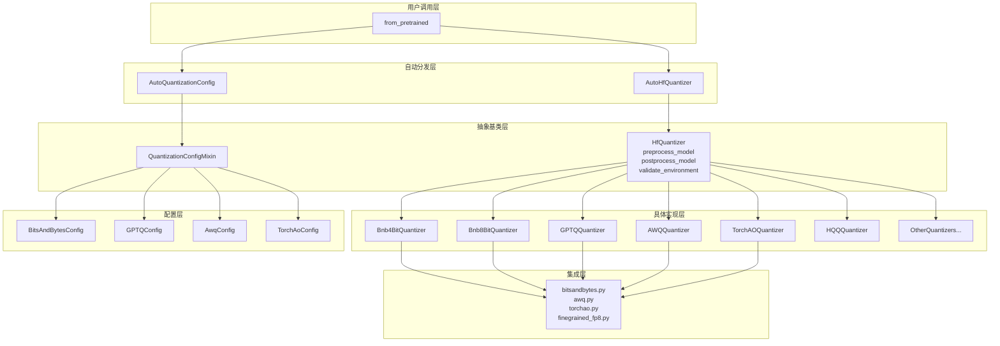

# Hugging Face Transformers 量化系统深度分析

## 目录

1. [系统概览](#1-系统概览)
2. [量化配置体系 (QuantizationConfig)](#2-量化配置体系)
3. [量化器基类 (HfQuantizer)](#3-量化器基类)
4. [自动量化分发 (AutoHfQuantizer)](#4-自动量化分发)
5. [量化工具函数](#5-量化工具函数)
6. [BitsAndBytes 4-bit 量化](#6-bitsandbytes-4-bit-量化)
7. [BitsAndBytes 8-bit 量化](#7-bitsandbytes-8-bit-量化)
8. [GPTQ 量化](#8-gptq-量化)
9. [AWQ 量化](#9-awq-量化)
10. [TorchAO 量化](#10-torchao-量化)
11. [FineGrained FP8 量化](#11-finegrained-fp8-量化)
12. [FBGEMM FP8 量化](#12-fbgemm-fp8-量化)
13. [量化系统完整加载流程](#13-量化系统完整加载流程)
14. [各量化方法对比](#14-各量化方法对比)
15. [与其他模块的关系](#15-与其他模块的关系)

---

## 量化系统架构总览



---

## 1. 系统概览

Hugging Face Transformers 的量化系统为模型推理和训练提供了统一的量化抽象层，支持 **20+ 种量化后端**。系统采用 **策略模式 (Strategy Pattern)** 设计，通过基类 `HfQuantizer` 定义统一接口，各量化方法实现各自的策略类，由 `AutoHfQuantizer` 负责自动分发。

### 架构分层

```
┌──────────────────────────────────────────────────────────────┐
│                    用户调用层 (from_pretrained)                │
├──────────────────────────────────────────────────────────────┤
│              AutoHfQuantizer (自动分发)                        │
│         AutoQuantizationConfig (配置自动解析)                   │
├──────────────────────────────────────────────────────────────┤
│              HfQuantizer (抽象基类)                            │
│    preprocess_model / postprocess_model / validate_environment │
├──────────┬──────────┬──────────┬──────────┬─────────────────┤
│ Bnb4Bit  │ Bnb8Bit  │  GPTQ    │   AWQ    │   TorchAO  ...  │
│Quantizer │Quantizer │Quantizer │Quantizer │  Quantizer       │
├──────────┴──────────┴──────────┴──────────┴─────────────────┤
│              QuantizationConfigMixin (配置基类)                │
│   BitsAndBytesConfig / GPTQConfig / AwqConfig / TorchAoConfig│
├──────────────────────────────────────────────────────────────┤
│              integrations/ (底层算子实现)                       │
│   bitsandbytes.py / awq.py / torchao.py / finegrained_fp8.py │
└──────────────────────────────────────────────────────────────┘
```

### 核心设计原则

1. **配置与执行分离**：`QuantizationConfigMixin` 只负责参数定义和校验，`HfQuantizer` 负责执行
2. **前后双阶段处理**：权重加载前替换模块骨架 (`_process_model_before_weight_loading`)，权重加载后执行后处理 (`_process_model_after_weight_loading`)
3. **注册式扩展**：通过 `register_quantizer` / `register_quantization_config` 装饰器支持第三方量化方法注册
4. **权重转换管线**：通过 `WeightConverter` + `ConversionOps` 实现可组合的权重序列化/反序列化管线

---

## 2. 量化配置体系

### 2.1 QuantizationMethod 枚举

定义了所有支持的量化方法标识符，作为配置和分发的关键依据：

```python
class QuantizationMethod(str, Enum):
    BITS_AND_BYTES = "bitsandbytes"
    GPTQ = "gptq"
    AWQ = "awq"
    AQLM = "aqlm"
    VPTQ = "vptq"
    QUANTO = "quanto"
    EETQ = "eetq"
    HIGGS = "higgs"
    HQQ = "hqq"
    COMPRESSED_TENSORS = "compressed-tensors"
    FBGEMM_FP8 = "fbgemm_fp8"
    TORCHAO = "torchao"
    BITNET = "bitnet"
    SPQR = "spqr"
    FP8 = "fp8"
    QUARK = "quark"
    FPQUANT = "fp_quant"
    AUTOROUND = "auto-round"
    MXFP4 = "mxfp4"
    METAL = "metal"
    FOUR_OVER_SIX = "fouroversix"
    SINQ = "sinq"
```

### 2.2 QuantizationConfigMixin 基类

所有量化配置的基类，采用 `@dataclass` 装饰，提供序列化/反序列化能力：

```python
@dataclass
class QuantizationConfigMixin:
    quant_method: QuantizationConfigMixin  # 必须由子类指定

    @classmethod
    def from_dict(cls, config_dict, return_unused_kwargs=False, **kwargs):
        config = cls(**config_dict)
        # 用 kwargs 覆盖已有属性
        for key, value in kwargs.items():
            if hasattr(config, key):
                setattr(config, key, value)
        return config

    def to_dict(self) -> dict[str, Any]:
        return copy.deepcopy(self.__dict__)

    def update(self, **kwargs):
        # 用 kwargs 更新已有属性，返回未使用的 kwargs
        ...
```

**关键设计**：每个配置类必须设置 `quant_method` 属性，这是 `AutoHfQuantizer` 进行分发的唯一依据。

### 2.3 BitsAndBytesConfig

BitsAndBytes 是最常用的量化方法，配置类同时支持 4-bit 和 8-bit 两种模式：

```python
@dataclass
class BitsAndBytesConfig(QuantizationConfigMixin):
    def __init__(
        self,
        load_in_8bit=False,           # 启用 8-bit LLM.int8() 量化
        load_in_4bit=False,           # 启用 4-bit FP4/NF4 量化
        llm_int8_threshold=6.0,       # 异常值检测阈值
        llm_int8_skip_modules=None,   # 跳过量化的模块列表
        llm_int8_enable_fp32_cpu_offload=False,  # CPU offload 支持
        llm_int8_has_fp16_weight=False,          # 16-bit 主权重（微调用）
        bnb_4bit_compute_dtype=None,  # 计算精度 (默认 fp32)
        bnb_4bit_quant_type="fp4",    # 量化数据类型: fp4 或 nf4
        bnb_4bit_use_double_quant=False,  # 双重量化（量化常数再量化）
        bnb_4bit_quant_storage=None,  # 4-bit 参数存储类型
        **kwargs,
    ):
```

**互斥约束**：`load_in_4bit` 和 `load_in_8bit` 不能同时为 True，setter 方法中做了校验。

### 2.4 GPTQConfig

GPTQ 量化配置，继承关系较深——`AwqConfig` 继承自 `GPTQConfig`：

```python
@dataclass
class GPTQConfig(QuantizationConfigMixin):
    def __init__(
        self,
        bits: int,                    # 量化位数: 2, 3, 4, 8
        tokenizer=None,               # 校准用分词器
        dataset=None,                 # 校准数据集
        group_size: int = 128,        # 分组大小
        damp_percent: float = 0.1,    # Hessian 对角线阻尼百分比
        desc_act: bool = False,       # 按激活大小降序量化 (act-order)
        act_group_aware: bool = True, # GAR: 组感知激活顺序
        sym: bool = True,             # 对称量化
        true_sequential: bool = True, # 块内逐层顺序量化
        format: str = "gptq",         # 权重格式: gptq / gptq_v2
        backend: str | None = None,   # 推理后端
        ...
    ):
```

### 2.5 AwqConfig

AWQ 配置继承自 GPTQConfig，增加了 AWQ 特有参数：

```python
@dataclass
class AwqConfig(GPTQConfig):
    def __init__(
        self,
        bits: int = 4,
        group_size: int = 128,
        zero_point: bool = True,      # 是否使用零点量化
        backend: AwqBackend = AwqBackend.AUTO,  # 量化后端
        modules_to_not_convert=None,
        **kwargs,
    ):
```

**AwqBackend 枚举**支持多种推理后端：`marlin`、`machete`、`exllama_v1/v2`、`gemm`、`gemv` 等。

### 2.6 TorchAoConfig

TorchAO 配置接受 `AOBaseConfig` 实例，支持灵活的量化类型：

```python
@dataclass
class TorchAoConfig(QuantizationConfigMixin):
    def __init__(
        self,
        quant_type: "AOBaseConfig",   # torchao 量化配置对象
        modules_to_not_convert=None,
        include_input_output_embeddings: bool = False,  # 是否量化嵌入层
        untie_embedding_weights: bool = False,          # 解绑嵌入权重
    ):
```

使用示例：
```python
from torchao.quantization import Int4WeightOnlyConfig
quantization_config = TorchAoConfig(Int4WeightOnlyConfig(group_size=32))
```

### 2.7 FineGrainedFP8Config

细粒度 FP8 量化配置，主要用于 DeepSeek 系列模型：

```python
@dataclass
class FineGrainedFP8Config(QuantizationConfigMixin):
    def __init__(
        self,
        activation_scheme: str = "dynamic",     # 激活量化方案: dynamic / static
        weight_block_size: tuple[int, int] = (128, 128),  # 权重块大小
        dequantize: bool = False,               # 加载时反量化
        modules_to_not_convert=None,
    ):
```

### 2.8 FbgemmFp8Config

FBGEMM FP8 量化配置，基于 Meta 的 FBGEMM 库：

```python
@dataclass
class FbgemmFp8Config(QuantizationConfigMixin):
    def __init__(
        self,
        activation_scale_ub: float = 1200.0,  # 激活缩放上界
        modules_to_not_convert=None,
    ):
```

---

## 3. 量化器基类

### 3.1 类定义与核心属性

`HfQuantizer` 是所有量化器的抽象基类，定义了量化生命周期的完整接口：

```python
class HfQuantizer(ABC):
    requires_calibration = False  # 子类覆盖：是否需要校准

    def __init__(self, quantization_config: QuantizationConfigMixin, **kwargs):
        self.quantization_config = quantization_config
        self.pre_quantized = kwargs.pop("pre_quantized", True)

        # 需要校准的方法必须使用预量化模型
        if not self.pre_quantized and self.requires_calibration:
            raise ValueError(...)
```

### 3.2 量化生命周期方法

量化器在模型加载过程中通过两个核心方法介入：

```python
def preprocess_model(self, model, dtype=None, **kwargs):
    """权重加载前：设置模型属性 + 替换模块骨架"""
    setattr(model, "is_quantized", True)
    setattr(model, "quantization_method", self.quantization_config.quant_method)
    if self.pre_quantized:
        self._convert_model_for_quantization(model)  # 替换特殊模块 (如 Llama4TextExperts)
    self._process_model_before_weight_loading(model, **kwargs)  # 子类实现：替换 Linear 层

def postprocess_model(self, model, **kwargs):
    """权重加载后：设置配置 + 后处理"""
    model.config.quantization_config = self.quantization_config
    if self.pre_quantized and getattr(self.quantization_config, "dequantize", False):
        self.remove_quantization_config(model)  # 反量化模式：移除量化标记
    else:
        _assign_is_quantized(model)
    return self._process_model_after_weight_loading(model, **kwargs)  # 子类实现
```

**生命周期时序**：
```
from_pretrained()
  │
  ├─ 1. get_hf_quantizer() → 创建量化器实例
  ├─ 2. hf_quantizer.validate_environment() → 环境校验
  ├─ 3. hf_quantizer.update_device_map() → 设备映射调整
  ├─ 4. hf_quantizer.preprocess_model() → 替换模块骨架 (meta device)
  ├─ 5. 加载权重
  ├─ 6. hf_quantizer.postprocess_model() → 后处理
  └─ 完成
```

### 3.3 可覆盖的钩子方法

| 方法 | 用途 | 默认行为 |
|------|------|---------|
| `update_dtype(dtype)` | 调整模型 dtype | 原样返回 |
| `update_device_map(device_map)` | 调整设备映射 | 原样返回 |
| `adjust_max_memory(max_memory)` | 调整最大内存 | 原样返回 |
| `param_element_size(model, name, param)` | 返回参数字节大小 | `param.element_size()` |
| `param_needs_quantization(model, name)` | 判断参数是否需要量化 | 返回 False |
| `validate_environment(*args, **kwargs)` | 校验运行环境 | 无操作 |
| `update_tp_plan(config)` | 更新张量并行计划 | 原样返回 |
| `update_ep_plan(config)` | 更新专家并行计划 | 原样返回 |
| `get_quantize_ops()` | 获取量化操作 | 抛出 NotImplementedError |
| `get_weight_conversions()` | 获取权重转换器 | 返回空列表 |
| `update_weight_conversions(conversions)` | 修改权重转换管线 | 追加自定义转换器 |

### 3.4 抽象属性（子类必须实现）

```python
@abstractmethod
def is_serializable(self): ...  # 量化模型是否可序列化

@property
@abstractmethod
def is_trainable(self): ...     # 量化模型是否可训练
```

### 3.5 反量化支持

```python
def dequantize(self, model, dtype=None):
    """将量化模型反量化为原始精度"""
    if dtype is None:
        dtype = model.config.dtype
    model = self._dequantize(model, dtype=dtype)  # 子类实现
    self.remove_quantization_config(model)          # 移除量化标记
    return model
```

### 3.6 模块跳过机制

`get_modules_to_not_convert` 静态方法自动检测不应量化的模块：

```python
@staticmethod
def get_modules_to_not_convert(model, skip_modules=None, keep_in_fp32_modules=None, add_default_skips=False):
    if skip_modules is None or add_default_skips:
        modules_to_not_convert = get_keys_to_not_convert(model)  # 自动检测
    else:
        modules_to_not_convert = []

    if skip_modules is not None:
        modules_to_not_convert.extend(skip_modules)
    if keep_in_fp32_modules is not None:
        modules_to_not_convert.extend(keep_in_fp32_modules)

    return list(set(modules_to_not_convert))
```

`get_keys_to_not_convert` 函数自动识别三类不应量化的模块：
1. **绑定权重** (tied weights)：如嵌入层与 lm_head 共享权重
2. **最后一个模块**：通常是输出投影
3. **输出嵌入层**：`lm_head` 等

### 3.7 特殊模块补丁

`MODULES_TO_PATCH_FOR_QUANTIZATION` 字典处理量化不兼容的特殊模块：

```python
MODULES_TO_PATCH_FOR_QUANTIZATION = {
    "Llama4TextExperts": {
        "module_name": SequentialLlama4TextExperts,  # 替换为顺序执行版本
        "quantization_methods": [
            QuantizationMethod.COMPRESSED_TENSORS,
            QuantizationMethod.BITS_AND_BYTES,
        ],
    }
}
```

`SequentialLlama4TextExperts` 将 Llama4 的融合专家模块拆解为逐专家顺序执行，以兼容量化操作。

---

## 4. 自动量化分发

### 4.1 AutoQuantizationConfig

从字典或预训练模型自动解析量化配置：

```python
class AutoQuantizationConfig:
    @classmethod
    def from_dict(cls, quantization_config_dict: dict):
        quant_method = quantization_config_dict.get("quant_method")
        # 特殊处理 BitsAndBytes：根据 load_in_4bit/load_in_8bit 添加后缀
        if quantization_config_dict.get("load_in_8bit", False) or quantization_config_dict.get("load_in_4bit", False):
            suffix = "_4bit" if quantization_config_dict.get("load_in_4bit", False) else "_8bit"
            quant_method = QuantizationMethod.BITS_AND_BYTES + suffix

        target_cls = AUTO_QUANTIZATION_CONFIG_MAPPING[quant_method]
        return target_cls.from_dict(quantization_config_dict)

    @classmethod
    def from_pretrained(cls, pretrained_model_name_or_path, **kwargs):
        model_config = AutoConfig.from_pretrained(pretrained_model_name_or_path, **kwargs)
        quantization_config_dict = model_config.quantization_config
        quantization_config = cls.from_dict(quantization_config_dict)
        quantization_config.update(**kwargs)
        return quantization_config
```

### 4.2 AutoHfQuantizer

根据量化配置自动实例化对应的量化器：

```python
class AutoHfQuantizer:
    @classmethod
    def from_config(cls, quantization_config, **kwargs):
        if isinstance(quantization_config, dict):
            quantization_config = AutoQuantizationConfig.from_dict(quantization_config)

        quant_method = quantization_config.quant_method

        # BitsAndBytes 特殊处理：4-bit 和 8-bit 使用不同量化器
        if quant_method == QuantizationMethod.BITS_AND_BYTES:
            if quantization_config.load_in_8bit:
                quant_method += "_8bit"
            else:
                quant_method += "_4bit"

        target_cls = AUTO_QUANTIZER_MAPPING[quant_method]
        return target_cls(quantization_config, **kwargs)
```

### 4.3 映射注册表

`AUTO_QUANTIZER_MAPPING` 和 `AUTO_QUANTIZATION_CONFIG_MAPPING` 维护方法名到类的映射：

```python
AUTO_QUANTIZER_MAPPING = {
    "awq": AwqQuantizer,
    "bitsandbytes_4bit": Bnb4BitHfQuantizer,
    "bitsandbytes_8bit": Bnb8BitHfQuantizer,
    "gptq": GptqHfQuantizer,
    "torchao": TorchAoHfQuantizer,
    "fbgemm_fp8": FbgemmFp8HfQuantizer,
    "fp8": FineGrainedFP8HfQuantizer,
    # ... 共 20+ 种
}
```

### 4.4 配置合并

`merge_quantization_configs` 处理模型自带配置与用户传入配置的合并：

```python
@classmethod
def merge_quantization_configs(cls, quantization_config, quantization_config_from_args):
    # 1. 模型配置优先，用户配置的加载属性覆盖模型配置
    # 2. 类型必须一致，否则报错
    # 3. 对于 LOADING_ATTRIBUTES_CONFIG_TYPES 类型的配置，合并加载属性
    if isinstance(quantization_config, LOADING_ATTRIBUTES_CONFIG_TYPES) and ...:
        loading_attr_dict = quantization_config_from_args.get_loading_attributes()
        for attr, val in loading_attr_dict.items():
            setattr(quantization_config, attr, val)
```

`LOADING_ATTRIBUTES_CONFIG_TYPES` 定义了哪些配置类支持加载属性覆盖：
```python
LOADING_ATTRIBUTES_CONFIG_TYPES = (
    GPTQConfig, AwqConfig, AutoRoundConfig, FbgemmFp8Config,
    CompressedTensorsConfig, Mxfp4Config, MetalConfig, FineGrainedFP8Config,
)
```

### 4.5 自定义注册

支持第三方量化方法通过装饰器注册：

```python
@register_quantization_config("my_method")
class MyQuantConfig(QuantizationConfigMixin):
    ...

@register_quantizer("my_method")
class MyQuantizer(HfQuantizer):
    ...
```

### 4.6 入口函数

`get_hf_quantizer` 是量化器创建的统一入口，被 `from_pretrained` 调用：

```python
def get_hf_quantizer(config, quantization_config, device_map, weights_only, user_agent):
    pre_quantized = hasattr(config, "quantization_config")
    if pre_quantized and not AutoHfQuantizer.supports_quant_method(config.quantization_config):
        pre_quantized = False

    if pre_quantized or quantization_config is not None:
        if pre_quantized:
            config.quantization_config = AutoHfQuantizer.merge_quantization_configs(
                config.quantization_config, quantization_config
            )
        else:
            config.quantization_config = quantization_config

        hf_quantizer = AutoHfQuantizer.from_config(
            config.quantization_config, pre_quantized=pre_quantized,
        )
    else:
        hf_quantizer = None

    if hf_quantizer is not None:
        hf_quantizer.validate_environment(device_map=device_map, weights_only=weights_only)
        device_map = hf_quantizer.update_device_map(device_map)
        config = hf_quantizer.update_tp_plan(config)
        config = hf_quantizer.update_ep_plan(config)
    return hf_quantizer, config, device_map
```

---

## 5. 量化工具函数

### 5.1 get_module_from_name

根据参数全限定名获取对应的模块和参数名：

```python
def get_module_from_name(module, tensor_name: str) -> tuple[Any, str]:
    if "." in tensor_name:
        module_name, tensor_name = tensor_name.rsplit(".", 1)
        module = module.get_submodule(module_name)
    return module, tensor_name
```

**示例**：`"model.layers.0.self_attn.q_proj.weight"` → 返回 `(q_proj模块, "weight")`

### 5.2 should_convert_module

判断模块是否应该被量化，支持前缀匹配、精确匹配和后缀匹配：

```python
def should_convert_module(full_name, patterns: list[str] | None = None):
    if patterns is None:
        return True

    should_not_convert = any(
        re.match(f"{key}\\.", full_name)     # 前缀匹配: "model.decoder.layer.11."
        or re.match(f"{key}", full_name)     # 精确/正则匹配: "lm_head"
        or full_name.endswith(key)           # 后缀匹配: "fc1"
        for key in patterns
    )
    return not should_not_convert
```

---

## 6. BitsAndBytes 4-bit 量化

### 6.1 Bnb4BitHfQuantizer 概览

```python
class Bnb4BitHfQuantizer(HfQuantizer):
    requires_calibration = False  # 无需校准，可在线量化
    quantization_config: BitsAndBytesConfig
```

### 6.2 环境校验

```python
def validate_environment(self, *args, **kwargs):
    # 1. 检查 accelerate 和 bitsandbytes 是否安装
    if not is_accelerate_available():
        raise ImportError(...)
    if not is_bitsandbytes_available():
        raise ImportError(...)

    # 2. 校验 BNB 后端可用性
    validate_bnb_backend_availability(raise_exception=True)

    # 3. 检查 device_map 中是否有 CPU/Disk 分片（需要启用 fp32_cpu_offload）
    device_map = kwargs.get("device_map")
    if not self.quantization_config.llm_int8_enable_fp32_cpu_offload and isinstance(device_map, dict):
        values = set(device_map.values())
        if values != {"cpu"} and ("cpu" in values or "disk" in values):
            raise ValueError(...)
```

### 6.3 模型预处理

权重加载前，将 `nn.Linear` 替换为 `bnb.nn.Linear4bit`：

```python
def _process_model_before_weight_loading(self, model, device_map, **kwargs):
    from ..integrations import replace_with_bnb_linear

    self.modules_to_not_convert = self.get_modules_to_not_convert(
        model, self.quantization_config.llm_int8_skip_modules, model._keep_in_fp32_modules
    )

    # CPU offload 模式下，CPU 上的模块也不转换
    if self.quantization_config.llm_int8_enable_fp32_cpu_offload:
        if isinstance(device_map, dict):
            keys_on_cpu = [key for key, value in device_map.items() if value in ["disk", "cpu"]]
            self.modules_to_not_convert.extend(keys_on_cpu)

    model = replace_with_bnb_linear(
        model,
        modules_to_not_convert=self.modules_to_not_convert,
        quantization_config=self.quantization_config,
        pre_quantized=self.pre_quantized,
    )
```

### 6.4 参数大小计算

4-bit 量化后每个参数仅占 0.5 字节：

```python
def param_element_size(self, model, param_name, param) -> float:
    if self.param_needs_quantization(model, param_name):
        return 0.5  # 4 bit = 0.5 bytes
    return super().param_element_size(model, param_name, param)

def param_needs_quantization(self, model, param_name, **kwargs) -> bool:
    import bitsandbytes as bnb
    module, name = get_module_from_name(model, param_name)
    return isinstance(module, bnb.nn.Linear4bit) and name != "bias"
```

### 6.5 设备映射与内存调整

```python
def update_device_map(self, device_map):
    if device_map is None:
        # 自动检测可用设备：CUDA > NPU > HPU > XPU > CPU
        if torch.cuda.is_available():
            device_map = {"": torch.cuda.current_device()}
        elif is_torch_npu_available():
            device_map = {"": f"npu:{torch.npu.current_device()}"}
        # ...
    return device_map

def adjust_max_memory(self, max_memory):
    # 量化过程中需要额外缓冲区，预留 10% 空间
    max_memory = {key: val * 0.90 for key, val in max_memory.items()}
    return max_memory
```

### 6.6 权重转换管线

预量化模型的权重反序列化通过 `WeightConverter` + `Bnb4bitDeserialize` 实现：

```python
def get_weight_conversions(self):
    from ..integrations.bitsandbytes import Bnb4bitDeserialize

    if self.pre_quantized:
        return [
            WeightConverter(
                source_patterns=[
                    "weight.nested_absmax",
                    "weight.nested_quant_map",
                    "weight.quant_map",
                    "weight.absmax",
                    "weight.quant_state.bitsandbytes__nf4",
                    "weight.quant_state.bitsandbytes__fp4",
                    "weight",
                ],
                target_patterns="weight",
                operations=[Bnb4bitDeserialize(self)],
            )
        ]
    return []
```

这展示了 BNB 4-bit 权重的存储格式：除了 `weight` 本身，还包含 `absmax`、`quant_map`、`nested_absmax` 等量化状态信息。

### 6.7 后处理与反量化

```python
def _process_model_after_weight_loading(self, model, **kwargs):
    setattr(model, "is_loaded_in_4bit", True)
    setattr(model, "is_4bit_serializable", self.is_serializable())
    return model

def _dequantize(self, model, dtype=None):
    from ..integrations import dequantize_and_replace
    model = dequantize_and_replace(model, quantization_config=self.quantization_config, dtype=dtype)
    return model
```

---

## 7. BitsAndBytes 8-bit 量化

### 7.1 Bnb8BitHfQuantizer

与 4-bit 量化器结构高度相似，主要差异：

| 特性 | 4-bit | 8-bit |
|------|-------|-------|
| 替换模块 | `bnb.nn.Linear4bit` | `bnb.nn.Linear8bitLt` |
| 参数大小 | 0.5 字节 | 1 字节 |
| 模型标记 | `is_loaded_in_4bit` | `is_loaded_in_8bit` |
| 权重格式 | NF4/FP4 + 量化状态 | SCB + weight_format |
| 可训练 | ✅ | ✅ |

### 7.2 权重转换管线

8-bit 的权重源模式更简单：

```python
def get_weight_conversions(self):
    from ..integrations.bitsandbytes import Bnb8bitDeserialize

    if self.pre_quantized:
        return [
            WeightConverter(
                source_patterns=["SCB", "weight_format", "weight"],
                target_patterns="weight",
                operations=[Bnb8bitDeserialize(self)],
            )
        ]
    return []
```

`SCB` 是 8-bit 量化中的 "Scale, Code, Bias" 压缩格式。

---

## 8. GPTQ 量化

### 8.1 GptqHfQuantizer 概览

```python
class GptqHfQuantizer(HfQuantizer):
    requires_calibration = False  # 支持在线量化（通过 optimum）
    quantization_config: GPTQConfig
```

### 8.2 依赖管理

GPTQ 量化器依赖 `optimum` 和 `gptqmodel` 两个库：

```python
def __init__(self, quantization_config, **kwargs):
    super().__init__(quantization_config, **kwargs)
    if not is_optimum_available():
        raise ImportError("Loading a GPTQ quantized model requires optimum")
    from optimum.gptq import GPTQQuantizer
    self.optimum_quantizer = GPTQQuantizer.from_dict(self.quantization_config.to_dict_optimum())

def validate_environment(self, *args, **kwargs):
    if not is_optimum_available():
        raise ImportError(...)
    if not is_gptqmodel_available():
        raise ImportError(...)
    # 版本校验
    if version.parse(metadata.version("gptqmodel")) < version.parse("1.4.3"):
        raise ImportError(...)
```

### 8.3 模型处理

GPTQ 的模型处理委托给 `optimum` 的 `GPTQQuantizer`：

```python
def _process_model_before_weight_loading(self, model, **kwargs):
    if model.__class__.main_input_name != "input_ids":
        raise RuntimeError("We can only quantize pure text model.")

    if self.pre_quantized:
        # 预量化模型：替换 Linear 层为 GPTQ 量化层
        model = self.optimum_quantizer.convert_model(model, **kwargs)

def _process_model_after_weight_loading(self, model, **kwargs):
    if self.pre_quantized:
        # 预量化模型：后初始化（设置量化参数等）
        model = self.optimum_quantizer.post_init_model(model)
    else:
        # 非预量化模型：在线量化
        if self.quantization_config.tokenizer is None:
            self.quantization_config.tokenizer = model.name_or_path
        self.optimum_quantizer.quantize_model(model, self.quantization_config.tokenizer)
        model.config.quantization_config = GPTQConfig.from_dict(self.optimum_quantizer.to_dict())
```

### 8.4 设备映射

GPTQ 默认使用 CPU 设备：

```python
def update_device_map(self, device_map):
    if device_map is None:
        device_map = {"": torch.device("cpu")}
    return device_map
```

---

## 9. AWQ 量化

### 9.1 AwqQuantizer 概览

```python
class AwqQuantizer(HfQuantizer):
    requires_calibration = True  # AWQ 需要数据校准，仅支持推理
    quantization_config: AwqConfig
```

**关键约束**：`requires_calibration = True` 意味着 AWQ 模型必须是预量化的，不支持在线量化。

### 9.2 环境校验

```python
def validate_environment(self, **kwargs):
    if not is_gptqmodel_available():
        raise ImportError("Loading an AWQ quantized model requires gptqmodel.")
    if not is_accelerate_available():
        raise ImportError("Loading an AWQ quantized model requires accelerate")
```

### 9.3 dtype 调整

AWQ CUDA/XPU 内核不支持 bfloat16，自动降级为 float16：

```python
def update_dtype(self, dtype):
    if dtype == torch.bfloat16 and (torch.cuda.is_available() or torch.xpu.is_available()):
        logger.warning("`torch.bfloat16` is not supported for AWQ CUDA/XPU kernels. Casting to `torch.float16`.")
        dtype = torch.float16
    return dtype
```

### 9.4 模型预处理

```python
def _process_model_before_weight_loading(self, model, **kwargs):
    from ..integrations import replace_quantization_scales, replace_with_awq_linear

    self.modules_to_not_convert = self.get_modules_to_not_convert(
        model, self.quantization_config.modules_to_not_convert,
        model._keep_in_fp32_modules, add_default_skips=True  # AWQ 默认跳过 lm_head 等
    )

    # 替换 Linear 层为 AWQ 量化层
    model = replace_with_awq_linear(
        model, quantization_config=self.quantization_config,
        modules_to_not_convert=self.modules_to_not_convert,
        device_map=kwargs.get("device_map"),
    )
    # 替换量化缩放因子
    model = replace_quantization_scales(model, model.config.model_type)
```

### 9.5 后处理

AWQ 的后处理调用 `gptqmodel` 的 `hf_gptqmodel_post_init`：

```python
def _process_model_after_weight_loading(self, model, **kwargs):
    from gptqmodel.utils.model import hf_gptqmodel_post_init
    hf_gptqmodel_post_init(model, use_act_order=self.quantization_config.desc_act)
```

### 9.6 可训练性与可序列化

```python
def is_serializable(self):
    # Exllama 后端不支持序列化
    if self.quantization_config.backend in [AwqBackend.EXLLAMA_V1, AwqBackend.EXLLAMA_V2]:
        logger.warning("You cannot save an AWQ model that uses Exllama backend!")
        return False
    return True

@property
def is_trainable(self):
    # gptqmodel >= 5.0.0 才支持训练
    return version.parse(importlib.metadata.version("gptqmodel")) >= version.parse("5.0.0")
```

---

## 10. TorchAO 量化

### 10.1 TorchAoHfQuantizer 概览

```python
class TorchAoHfQuantizer(HfQuantizer):
    requires_calibration = False
    quantization_config: TorchAoConfig
```

### 10.2 量化位数推断

通过配置类名模糊匹配推断量化位数：

```python
def _fuzzy_match_size(config_name: str) -> str | None:
    match = re.search(r"(\d)weight", config_name.lower())
    return match.group(1) if match else None

# 示例: "Int4WeightOnlyConfig" → "4", "Int8WeightOnlyConfig" → "8"

def __init__(self, quantization_config, **kwargs):
    super().__init__(quantization_config, **kwargs)
    size_digit = _fuzzy_match_size(type(self.quantization_config.quant_type).__name__)
    self.quantized_param_size = 0.5 if size_digit == "4" else 1
```

### 10.3 参数量化判断

TorchAO 的 `param_needs_quantization` 逻辑最为复杂，支持 `FqnToConfig` 精确匹配：

```python
def param_needs_quantization(self, model, param_name, **kwargs) -> bool:
    if not should_convert_module(param_name, self.modules_to_not_convert):
        return False

    _QUANTIZABLE = [torch.nn.Linear]
    if self.quantization_config.include_input_output_embeddings:
        _QUANTIZABLE.append(torch.nn.Embedding)

    from torchao.quantization import FqnToConfig, fqn_matches_fqn_config

    if isinstance(self.quantization_config.quant_type, FqnToConfig):
        module_fqn, _ = param_name.rsplit(".", 1)
        if (
            fqn_matches_fqn_config(module_fqn, self.quantization_config.quant_type)
            or fqn_matches_fqn_config(param_name, self.quantization_config.quant_type)
            or ("_default" in self.quantization_config.quant_type.fqn_to_config
                and isinstance(module, tuple(_QUANTIZABLE)))
        ):
            return True

    return isinstance(module, tuple(_QUANTIZABLE)) and tensor_name == "weight"
```

### 10.4 状态字典与元数据

TorchAO 量化后的张量是 `TensorSubclass`，需要展平才能兼容 safetensors 格式：

```python
def get_state_dict_and_metadata(self, model):
    return flatten_tensor_state_dict(model.state_dict())

def set_metadata(self, checkpoint_files: list[str]):
    if checkpoint_files[0].endswith(".safetensors"):
        metadata = {}
        for checkpoint in checkpoint_files:
            with safe_open(checkpoint, framework="pt") as f:
                metadata_ = f.metadata() or {}
                metadata.update(metadata_)
        self.metadata = metadata
```

### 10.5 权重转换管线

```python
def get_weight_conversions(self):
    from ..integrations.torchao import TorchAoDeserialize

    if self.pre_quantized:
        return [
            WeightConverter(
                source_patterns=[
                    "_weight_qdata",
                    "_weight_scale_and_zero",
                    "_weight_per_tensor_scale",
                    "_weight_scale",
                    "_weight_zero_point",
                    "_weight_act_pre_scale",
                ],
                target_patterns="weight",
                operations=[TorchAoDeserialize(self)],
            ),
        ]
    return []
```

### 10.6 可编译性

TorchAO 是唯一声明 `is_compileable = True` 的量化器，支持 `torch.compile`：

```python
@property
def is_compileable(self) -> bool:
    return True
```

---

## 11. FineGrained FP8 量化

### 11.1 FineGrainedFP8HfQuantizer 概览

```python
class FineGrainedFP8HfQuantizer(HfQuantizer):
    requires_calibration = False
    quantization_config: FineGrainedFP8Config
```

主要用于 DeepSeek 系列模型，支持细粒度分块 FP8 量化（block_size 默认 128×128）。

### 11.2 环境校验与自动降级

```python
def validate_environment(self, *args, **kwargs):
    if not is_accelerate_available():
        raise ImportError(...)

    if self.quantization_config.dequantize:
        return  # 反量化模式不需要 GPU

    if not torch.cuda.is_available() and not is_torch_xpu_available():
        if self.pre_quantized:
            # 无 GPU 时自动降级为反量化模式
            self.quantization_config.dequantize = True
            return
        else:
            raise RuntimeError(...)

    if torch.cuda.is_available():
        compute_capability = torch.cuda.get_device_capability()
        major, minor = compute_capability
        if (major < 8) or (major == 8 and minor < 9):
            # 算力不足时自动降级为反量化模式
            self.quantization_config.dequantize = True
            return
```

**智能降级**：当 GPU 不支持 FP8（算力 < 8.9）时，自动切换为反量化模式，将 FP8 权重反量化为 bf16 后运行。

### 11.3 模型预处理

```python
def _process_model_before_weight_loading(self, model, **kwargs):
    from ..integrations.finegrained_fp8 import replace_with_fp8_linear

    self.modules_to_not_convert = self.get_modules_to_not_convert(
        model, self.quantization_config.modules_to_not_convert, model._keep_in_fp32_modules
    )

    model = replace_with_fp8_linear(
        model, modules_to_not_convert=self.modules_to_not_convert,
        quantization_config=self.quantization_config, pre_quantized=self.pre_quantized,
    )
```

### 11.4 权重转换管线（反量化模式）

FP8 量化器在反量化模式下实现了最复杂的权重转换管线：

```python
def get_weight_conversions(self):
    if self.pre_quantized and self.quantization_config.dequantize:
        return [
            WeightConverter(
                source_patterns=["weight$", "weight_scale_inv", "activation_scale"],
                target_patterns="weight",
                operations=[Fp8Dequantize(self)],
            )
        ]
    return []
```

`update_weight_conversions` 方法更是精细地修改了模型自带的转换管线：

```python
def update_weight_conversions(self, weight_conversions):
    if not (self.pre_quantized and self.quantization_config.dequantize):
        return weight_conversions + self.get_weight_conversions()

    # 1. 添加 .scale → .weight_scale_inv 的重命名规则
    scale_rename = WeightRenaming(
        source_patterns=r"^(.+)\.scale$",
        target_patterns=r"\1.weight_scale_inv"
    )
    weight_conversions = [scale_rename] + list(weight_conversions)

    # 2. 对每个 WeightConverter，锚定 weight 模式并添加 scale 源
    for conv in weight_conversions:
        if isinstance(conv, WeightConverter):
            weight_sources = [p for p in conv.source_patterns if p.endswith(".weight")]
            if weight_sources:
                anchored_weight = [p + "$" for p in weight_sources]
                scale_sources = [p[:-len(".weight")] + ".weight_scale_inv$" for p in weight_sources]
                # 3. 在操作链最前面插入反量化操作
                new_ops = [Fp8Dequantize(self)] + list(conv.operations)
                conv = WeightConverter(source_patterns=..., operations=new_ops)
    ...
```

### 11.5 FP8Linear 模块

`integrations/finegrained_fp8.py` 中定义了 `FP8Linear`，这是 FP8 量化的核心计算模块：

```python
class FP8Linear(nn.Linear):
    def __init__(self, in_features, out_features, block_size=None,
                 activation_scheme="dynamic", has_bias=False, dtype=_FP8_DTYPE):
        super().__init__(in_features, out_features)
        self.weight = nn.Parameter(torch.empty(out_features, in_features, dtype=dtype))

        if self.block_size is None:
            # 逐张量量化：单个缩放因子
            self.weight_scale_inv = nn.Parameter(torch.tensor(1.0, dtype=torch.float32))
        else:
            # 分块量化：缩放因子网格
            scale_out_features = (out_features + block_size[0] - 1) // block_size[0]
            scale_in_features = (in_features + block_size[1] - 1) // block_size[1]
            self.weight_scale_inv = nn.Parameter(
                torch.empty(scale_out_features, scale_in_features, dtype=torch.float32)
            )

    def forward(self, input):
        if self.weight.element_size() > 1:
            return F.linear(input, self.weight, self.bias)  # 非量化权重直接计算

        # 动态量化激活
        if self.activation_scheme == "dynamic":
            qinput, scale = finegrained_fp8.fp8_act_quant(input, block_size)
        elif self.activation_scheme == "static":
            scale = self.activation_scale
            qinput = (input / scale).clamp(min=_FP8_MIN, max=_FP8_MAX).to(_FP8_DTYPE)

        # FP8 矩阵乘法
        output = w8a8_fp8_matmul(qinput, weight, scale, scale_inv, block_size, output_dtype=input.dtype)
        return output
```

### 11.6 FP8 矩阵乘法调度

`w8a8_fp8_matmul` 实现了多级内核调度：

```python
def w8a8_fp8_matmul(A, B, As, Bs, block_size, output_dtype):
    if block_size is not None and block_size[0] == block_size[1] == 128:
        try:
            deepgemm = _load_deepgemm_kernel()
        except ImportError:
            logger.warning_once("DeepGEMM not available, falling back to Triton...")
        else:
            # DeepGEMM: 比 Triton 快 3-6 倍
            output = torch.empty(...)
            deepgemm.fp8_matmul((A, As.float()), (B, Bs.float()), output)
            return output

    # 回退到 Triton finegrained-fp8 内核
    finegrained_fp8 = _load_finegrained_fp8_kernel()
    return finegrained_fp8.fp8_matmul(A, B, As, Bs, block_size, output_dtype)
```

**调度优先级**：
1. **DeepGEMM** (Hopper SM90+, block 128×128) — 最快
2. **Triton finegrained-fp8** — 通用回退

### 11.7 MoE 专家支持

FP8 量化对 MoE 模型有专门优化，提供三种专家前向策略：

```python
class FP8ExpertsInterface(ExpertsInterface):
    _global_mapping = {
        "batched_mm": fp8_batched_mm_experts_forward,    # 批量矩阵乘法
        "grouped_mm": fp8_grouped_mm_experts_forward,    # 分组矩阵乘法
        "deepgemm": fp8_deepgemm_experts_forward,        # DeepGEMM 加速
    }
```

`FP8Experts` 模块将所有专家的权重存储为单一参数张量（shape: `[num_experts, out, in]`），配合缩放因子网格实现高效批量计算。

### 11.8 Fp8Quantize / Fp8Dequantize

量化与反量化操作实现了 `ConversionOps` 接口：

**量化** (`Fp8Quantize.convert`)：
```python
def _quantize_one(self, key, value):
    # 1. 计算每个 block 的最大绝对值
    max_abs = reshaped.abs().amax(dim=(-3, -1))
    # 2. 计算缩放因子 (inverse scale)
    scales = _FP8_MAX / safe_max_abs
    # 3. 量化到 FP8
    quantized = torch.clamp(scaled, min=_FP8_MIN, max=_FP8_MAX).to(_FP8_DTYPE)
    # 4. 返回量化权重 + 反向缩放因子
    return {key: quantized, scale_key: inv_scales}
```

**反量化** (`Fp8Dequantize.convert`)：
```python
def _dequantize_one(self, quantized, scales):
    # 支持 FP4 解包 (int8/float4_e2m1fn_x2)
    if quantized.dtype == torch.int8 or quantized.dtype == fp4_dtype:
        quantized_fp32 = self._unpack_fp4(quantized)
    else:
        quantized_fp32 = quantized.to(torch.float32)

    # 从缩放因子网格推导 block 大小
    block_m = rows // scale_rows
    block_n = cols // scale_cols

    # 反量化: weight_fp32 = quantized * scale
    q = quantized_fp32.reshape(-1, scale_rows, block_m, scale_cols, block_n)
    s = scales.reshape(-1, scale_rows, scale_cols).unsqueeze(-1).unsqueeze(2)
    return (q * s).to(out_dtype).reshape(original_shape)
```

---

## 12. FBGEMM FP8 量化

### 12.1 FbgemmFp8HfQuantizer 概览

```python
class FbgemmFp8HfQuantizer(HfQuantizer):
    requires_calibration = False
    quantization_config: FbgemmFp8Config
```

基于 Meta 的 FBGEMM 库，使用 `quantize_fp8_per_row` 逐行量化。

### 12.2 环境校验

```python
def validate_environment(self, *args, **kwargs):
    if not is_torch_cuda_available() and not is_torch_xpu_available():
        raise ImportError("Using fbgemm fp8 quantization requires a GPU or XPU")
    if is_torch_xpu_available() and not is_kernels_available():
        raise ImportError("Using FP8 fbgemm on XPU requires kernels")
    if is_torch_cuda_available() and not is_fbgemm_gpu_available():
        raise ImportError("Loading an FP8 fbgemm quantized model on CUDA requires fbgemm-gpu")
    if is_torch_cuda_available():
        compute_capability = torch.cuda.get_device_capability()
        if major < 9:
            raise ValueError("FP8 requires compute capability >= 9.0 (e.g H100)")
```

**硬件要求**：FBGEMM FP8 要求 SM90+ (H100 及以上)，比 FineGrained FP8 (SM89+) 更严格。

### 12.3 FbgemmFp8Linear 模块

```python
class FbgemmFp8Linear(torch.nn.Linear):
    def __init__(self, in_features, out_features, bias, dtype=torch.float8_e4m3fn):
        super().__init__(in_features, out_features, bias)
        self.weight = nn.Parameter(torch.zeros((out_features, in_features), dtype=dtype))
        self.weight_scale = nn.Parameter(torch.zeros((out_features, 1), dtype=torch.float32))
        self.register_buffer("input_scale_ub", torch.zeros([1], dtype=torch.float), persistent=False)

    def forward(self, x):
        # 逐行 FP8 量化激活
        x_quantized, x_scale = quantize_fp8_per_row(x.view(-1, x.shape[-1]).contiguous(),
                                                      scale_ub=self.input_scale_ub)
        # FBGEMM FP8 矩阵乘法
        if _is_torch_xpu_available:
            output = torch._scaled_mm(x_quantized, self.weight.t(),
                                       scale_a=x_scale.unsqueeze(-1),
                                       scale_b=weight_scale_float32.t(),
                                       out_dtype=x.dtype, bias=self.bias)
        else:
            output = torch.ops.fbgemm.f8f8bf16_rowwise(
                x_quantized, self.weight, x_scale, weight_scale_float32, use_fast_accum=True
            )
        return output
```

### 12.4 Llama4 专家模块支持

FBGEMM FP8 为 Llama4 的 MoE 专家提供了专门的 `FbgemmFp8Llama4TextExperts` 模块：

```python
class FbgemmFp8Llama4TextExperts(nn.Module):
    def __init__(self, config, dtype=torch.float32):
        # 所有专家权重存储为 [num_experts, ...] 的单一参数
        self.gate_up_proj = nn.Parameter(
            torch.zeros((num_experts, hidden_size, 2 * expert_dim), dtype=torch.float8_e4m3fn))
        self.gate_up_proj_scale = nn.Parameter(
            torch.zeros((num_experts, 1, expert_dim * 2), dtype=torch.float32))
        self.down_proj = nn.Parameter(
            torch.zeros((num_experts, expert_dim, hidden_size), dtype=torch.float8_e4m3fn))
        self.down_proj_scale = nn.Parameter(
            torch.zeros((num_experts, hidden_size, 1), dtype=torch.float32))
```

### 12.5 后处理：设置 input_scale_ub

```python
def _process_model_after_weight_loading(self, model, **kwargs):
    for m in model.modules():
        if isinstance(m, (FbgemmFp8Linear, FbgemmFp8Llama4TextExperts)):
            if hasattr(m, "input_scale_ub"):
                m.input_scale_ub.fill_(self.quantization_config.activation_scale_ub)
    return model
```

### 12.6 张量并行计划

FBGEMM FP8 为 Llama4 提供了专门的 TP 计划，包含权重缩放因子的并行策略：

```python
def update_tp_plan(self, config):
    if "Llama4" in config.__class__.__name__:
        text_plan = {
            "layers.*.self_attn.q_proj.weight": "colwise",
            "layers.*.self_attn.q_proj.weight_scale": "colwise",  # 缩放因子跟随权重并行策略
            "layers.*.feed_forward.experts.gate_up_proj": "packed_rowwise",
            "layers.*.feed_forward.experts.gate_up_proj_scale": "packed_rowwise",
            ...
        }
```

---

## 13. 量化系统完整加载流程

以下代码展示了从 `from_pretrained` 调用到量化完成的完整流程：

```
用户调用:
  model = AutoModelForCausalLM.from_pretrained(
      "model_id",
      quantization_config=BitsAndBytesConfig(load_in_4bit=True),
      device_map="auto"
  )

内部流程:
  1. PreTrainedModel.from_pretrained()
     │
     ├─ get_hf_quantizer(config, quantization_config, device_map, ...)
     │   ├─ 判断 pre_quantized (模型是否自带量化配置)
     │   ├─ AutoHfQuantizer.merge_quantization_configs() (合并配置)
     │   ├─ AutoHfQuantizer.from_config() (创建量化器)
     │   │   └─ AUTO_QUANTIZER_MAPPING["bitsandbytes_4bit"] → Bnb4BitHfQuantizer
     │   ├─ hf_quantizer.validate_environment()
     │   ├─ hf_quantizer.update_device_map()
     │   └─ hf_quantizer.update_tp_plan() / update_ep_plan()
     │
     ├─ hf_quantizer.preprocess_model(model)
     │   ├─ model.is_quantized = True
     │   ├─ model.quantization_method = "bitsandbytes"
     │   ├─ _convert_model_for_quantization() (替换特殊模块)
     │   └─ _process_model_before_weight_loading()
     │       └─ replace_with_bnb_linear() (nn.Linear → bnb.nn.Linear4bit)
     │
     ├─ 加载权重 (accelerate dispatch)
     │   ├─ hf_quantizer.get_weight_conversions() → WeightConverter 管线
     │   ├─ Bnb4bitDeserialize: 反序列化 BNB 4-bit 权重
     │   └─ hf_quantizer.param_needs_quantization() → 在线量化非预量化权重
     │
     └─ hf_quantizer.postprocess_model(model)
         ├─ model.config.quantization_config = ...
         ├─ _assign_is_quantized(model)
         └─ _process_model_after_weight_loading()
             ├─ model.is_loaded_in_4bit = True
             └─ model.is_4bit_serializable = True
```

---

## 14. 各量化方法对比

| 特性 | BNB 4-bit | BNB 8-bit | GPTQ | AWQ | TorchAO | FP8 (FineGrained) | FBGEMM FP8 |
|------|-----------|-----------|------|-----|---------|-------------------|------------|
| 量化位数 | 4 | 8 | 2/3/4/8 | 4 | 4/8 | 8 | 8 |
| 需要校准 | ❌ | ❌ | ❌ | ✅ | ❌ | ❌ | ❌ |
| 可训练 | ✅ | ✅ | ✅ | ≥5.0 | 仅8bit | ❌ | ❌ |
| 可编译 | ❌ | ❌ | ❌ | ❌ | ✅ | ✅ | ❌ |
| 可反量化 | ✅ | ✅ | ❌ | ❌ | ❌ | ✅ | ❌ |
| 可序列化 | ✅ | ✅ | ✅ | 部分后端 | ✅ | ✅ | ✅ |
| GPU要求 | 任意 | 任意 | CUDA | CUDA/XPU | 任意 | SM89+ | SM90+ |
| CPU支持 | ✅(offload) | ✅(offload) | ✅ | ❌ | ✅ | ✅(反量化) | ❌ |
| MoE支持 | ✅(顺序) | ✅(顺序) | ❌ | ❌ | ❌ | ✅(批量/分组/DeepGEMM) | ✅(Llama4) |
| 核心依赖 | bitsandbytes | bitsandbytes | optimum+gptqmodel | gptqmodel | torchao | kernels | fbgemm-gpu |
| 量化格式 | NF4/FP4 | LLM.int8() | GPTQ | AWQ-GEMM | 多种 | E4M3FN | E4M3FN |

---

## 15. 与其他模块的关系

### 15.1 与 modeling_utils 的关系

`PreTrainedModel.from_pretrained` 是量化系统的调用入口：
- 调用 `get_hf_quantizer()` 创建量化器
- 在权重加载前后调用 `preprocess_model()` 和 `postprocess_model()`
- 通过 `hf_quantizer.param_needs_quantization()` 判断是否需要在线量化
- 通过 `hf_quantizer.get_weight_conversions()` 获取权重转换管线

### 15.2 与 core_model_loading 的关系

量化系统深度集成到权重加载管线中：
- `WeightConverter` + `ConversionOps` 实现可组合的权重转换
- `Bnb4bitDeserialize`、`TorchAoDeserialize`、`Fp8Dequantize` 等都是 `ConversionOps` 子类
- `get_quantize_ops()` 返回在线量化操作（如 `Bnb4bitQuantize`、`Fp8Quantize`）

### 15.3 与 integrations 的关系

`integrations/` 目录包含各量化方法的底层实现：
- `bitsandbytes.py`：`replace_with_bnb_linear`、`dequantize_and_replace`
- `awq.py`：`replace_with_awq_linear`、`replace_quantization_scales`
- `torchao.py`：`TorchAoQuantize`、`TorchAoDeserialize`
- `finegrained_fp8.py`：`FP8Linear`、`FP8Experts`、`Fp8Quantize`、`Fp8Dequantize`
- `fbgemm_fp8.py`：`FbgemmFp8Linear`、`FbgemmFp8Llama4TextExperts`

量化器 (quantizers/) 负责生命周期管理，集成层 (integrations/) 负责底层算子。

### 15.4 与 configuration_utils 的关系

`PreTrainedConfig` 保存 `quantization_config` 属性，持久化到 `config.json` 中。加载时通过 `AutoQuantizationConfig.from_dict()` 解析。

### 15.5 与 accelerate 的关系

大部分量化方法依赖 `accelerate` 进行设备分发：
- `init_empty_weights()` 在 meta device 上初始化模型骨架
- `infer_auto_device_map()` 根据 `param_element_size()` 计算设备映射
- `dispatch_model()` 执行实际的设备分发

### 15.6 与 tensor_parallel 的关系

量化器通过 `update_tp_plan()` 和 `update_ep_plan()` 修改张量并行和专家并行计划，确保量化缩放因子与权重使用一致的并行策略。

### 15.7 与 moe 的关系

FP8 和 FBGEMM FP8 量化器对 MoE 模型有专门支持：
- `FP8ExpertsInterface` 注册多种专家前向策略
- `use_experts_implementation()` 动态选择专家实现
- `FbgemmFp8Llama4TextExperts` 为 Llama4 提供融合实现

---

## 附录：关键代码路径索引

| 文件 | 核心内容 |
|------|---------|
| `quantizers/base.py` | HfQuantizer 基类、get_keys_to_not_convert、MODULES_TO_PATCH_FOR_QUANTIZATION |
| `quantizers/auto.py` | AutoHfQuantizer、AutoQuantizationConfig、注册机制、get_hf_quantizer |
| `quantizers/quantizer_bnb_4bit.py` | Bnb4BitHfQuantizer |
| `quantizers/quantizer_bnb_8bit.py` | Bnb8BitHfQuantizer |
| `quantizers/quantizer_gptq.py` | GptqHfQuantizer |
| `quantizers/quantizer_awq.py` | AwqQuantizer |
| `quantizers/quantizer_torchao.py` | TorchAoHfQuantizer、_fuzzy_match_size |
| `quantizers/quantizer_finegrained_fp8.py` | FineGrainedFP8HfQuantizer、update_weight_conversions |
| `quantizers/quantizer_fbgemm_fp8.py` | FbgemmFp8HfQuantizer |
| `quantizers/quantizers_utils.py` | get_module_from_name、should_convert_module |
| `utils/quantization_config.py` | QuantizationMethod、所有 Config 类 |
| `integrations/finegrained_fp8.py` | FP8Linear、FP8Experts、w8a8_fp8_matmul、Fp8Quantize/Dequantize |
| `integrations/fbgemm_fp8.py` | FbgemmFp8Linear、FbgemmFp8Llama4TextExperts、quantize_fp8_per_row |
