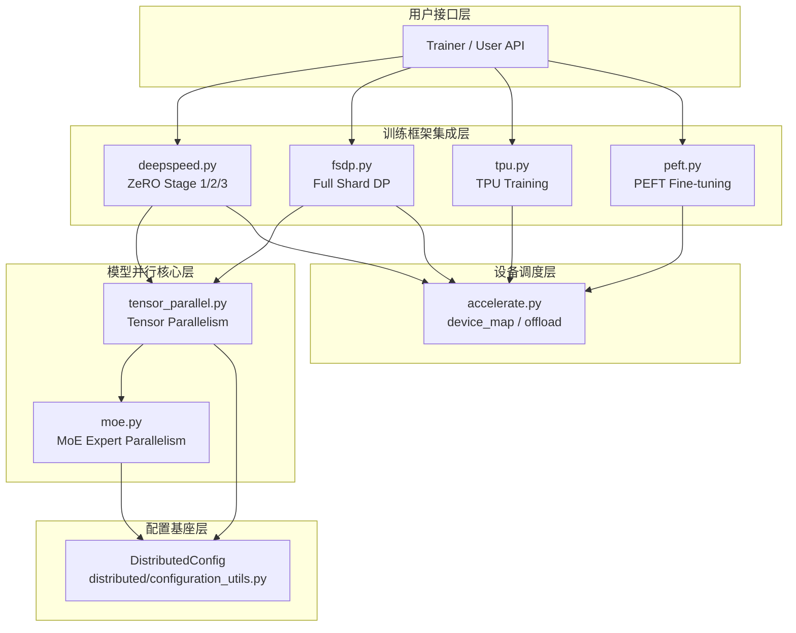

# Hugging Face Transformers 分布式与并行系统深度分析

## 目录

1. [系统总览](#1-系统总览)
2. [DeepSpeed 集成](#2-deepspeed-集成)
3. [FSDP 集成](#3-fsdp-集成)
4. [张量并行 (Tensor Parallelism)](#4-张量并行-tensor-parallelism)
5. [MoE 专家并行](#5-moe-专家并行)
6. [Accelerate 集成 (device_map / offload)](#6-accelerate-集成-device_map--offload)
7. [DistributedConfig](#7-distributedconfig)
8. [PEFT 微调集成](#8-peft-微调集成)
9. [TPU 集成](#9-tpu-集成)
10. [模块间关系与协作](#10-模块间关系与协作)

---

## 分布式与并行系统架构总览



---

## 1. 系统总览

Transformers 的分布式与并行系统是一套**多层次、可组合**的并行计算框架，覆盖了从单机多卡到多机多卡、从数据并行到模型并行、从训练到推理的完整场景。其核心设计理念是：

- **分层抽象**：每种并行策略（ZeRO、FSDP、TP、EP）都有独立的集成模块，通过统一的接口与 Trainer/Model 交互
- **互斥与组合**：`device_map` 与 `tp_plan` 互斥（模型级并行只能选一种），但 TP 可以与 EP 组合（2D 并行）
- **全局配置可达**：DeepSpeed 配置通过 `weakref` 全局变量实现跨模块访问，避免在 `from_pretrained` 等无 Trainer 上下文的场景中丢失配置
- **渐进式初始化**：配置分两阶段填充——`trainer_config_process`（TrainingArguments 创建时）和 `trainer_config_finalize`（模型和训练步数已知后）

### 架构层次图

```
┌──────────────────────────────────────────────────────┐
│                    Trainer / User API                 │
├──────────────────────────────────────────────────────┤
│  deepspeed.py  │  fsdp.py  │  tpu.py  │  peft.py    │  ← 训练框架集成层
├──────────────────────────────────────────────────────┤
│           tensor_parallel.py  │  moe.py              │  ← 模型并行核心层
├──────────────────────────────────────────────────────┤
│              accelerate.py (device_map / offload)     │  ← 设备调度与卸载层
├──────────────────────────────────────────────────────┤
│            distributed/configuration_utils.py         │  ← 分布式配置基座
└──────────────────────────────────────────────────────┘
```

---

## 2. DeepSpeed 集成

**文件**：`src/transformers/integrations/deepspeed.py`

### 2.1 模块职责

DeepSpeed 集成模块负责将 Microsoft DeepSpeed 库的 ZeRO 优化（Stage 1/2/3）、张量并行、序列并行等能力桥接到 Transformers 的 Trainer 流程中。核心职责包括：

1. DeepSpeed 配置的管理与同步（HF 训练参数 ↔ DeepSpeed 配置）
2. ZeRO-3 模式下的权重加载与初始化
3. 优化器与调度器的创建与协调
4. 序列并行（Sequence Parallelism）的损失计算
5. 权重转换（Weight Conversion）与检查点加载

### 2.2 核心类

#### `HfDeepSpeedConfig`

继承自 `accelerate.utils.deepspeed.HfDeepSpeedConfig`，是 DeepSpeed 配置的封装对象：

```python
class HfDeepSpeedConfig(DeepSpeedConfig):
    def __init__(self, config_file_or_dict):
        # 将自身注册为全局 weakref，使得 from_pretrained 等无 Trainer 上下文的
        # 代码也能查询 DeepSpeed 配置（如 is_deepspeed_zero3_enabled()）
        set_hf_deepspeed_config(self)
        dep_version_check("accelerate")
        dep_version_check("deepspeed")
        super().__init__(config_file_or_dict)
```

**设计要点**：使用 `weakref` 全局引用，确保配置对象与 `TrainingArguments` 生命周期绑定——当 `TrainingArguments` 被回收时，全局引用自动失效。

#### `HfTrainerDeepSpeedConfig`

Trainer 专用的配置子类，增加了 `"auto"` 值解析和配置校验功能：

```python
class HfTrainerDeepSpeedConfig(HfDeepSpeedConfig):
    def fill_match(self, ds_key_long, hf_val, hf_key=None, must_match=True):
        """
        核心方法：将 DeepSpeed 配置中的 "auto" 替换为 TrainingArguments 的实际值，
        并在 must_match=True 时校验两者一致性。
        """
        config, ds_key = self.find_config_node(ds_key_long)
        if config.get(ds_key) == "auto":
            config[ds_key] = hf_val  # "auto" → 实际值
            return
        if not must_match:
            return
        ds_val = config.get(ds_key)
        if ds_val is not None and ds_val != hf_val:
            self.mismatches.append(f"- ds {ds_key_long}={ds_val} vs hf {hf_key}={hf_val}")
```

### 2.3 配置同步流程

DeepSpeed 配置的同步分为两个阶段：

**阶段一：`trainer_config_process`**（TrainingArguments 创建时）

```python
def trainer_config_process(self, args, auto_find_batch_size=False):
    # 同步批次大小相关配置
    train_batch_size = args.world_size * args.per_device_train_batch_size * args.gradient_accumulation_steps
    self.fill_match("train_micro_batch_size_per_gpu", args.per_device_train_batch_size, ...)
    self.fill_match("gradient_accumulation_steps", args.gradient_accumulation_steps, ...)
    self.fill_match("train_batch_size", train_batch_size, ...)

    # 同步优化器参数
    self.fill_match("optimizer.params.lr", args.learning_rate, "learning_rate")
    self.fill_match("optimizer.params.betas", [args.adam_beta1, args.adam_beta2], ...)

    # 同步精度配置
    self.fill_match("fp16.enabled", (args.fp16 or args.fp16_full_eval), ...)
    self.fill_match("bf16.enabled", (args.bf16 or args.bf16_full_eval), ...)

    # 推断数据类型
    if self.is_true("bf16.enabled"):
        self._dtype = torch.bfloat16
    elif self.is_true("fp16.enabled"):
        self._dtype = torch.float16
    else:
        self._dtype = torch.float32
```

**阶段二：`trainer_config_finalize`**（模型和训练步数已知后）

```python
def trainer_config_finalize(self, args, model, num_training_steps):
    # 基于 hidden_size 自动填充 ZeRO-3 的 bucket 大小
    hidden_size_based_keys = [
        "zero_optimization.reduce_bucket_size",
        "zero_optimization.stage3_prefetch_bucket_size",
        "zero_optimization.stage3_param_persistence_threshold",
    ]
    # ...
    self.fill_only("zero_optimization.reduce_bucket_size", hidden_size * hidden_size)
    if self.is_zero3():
        self.fill_only("zero_optimization.stage3_prefetch_bucket_size", int(0.9 * hidden_size * hidden_size))
        self.fill_only("zero_optimization.stage3_param_persistence_threshold", 10 * hidden_size)

    # 同步调度器参数
    self.fill_match("scheduler.params.total_num_steps", num_training_steps, ...)
    self.fill_match("scheduler.params.warmup_num_steps", args.get_warmup_steps(num_training_steps), ...)

    # 校验所有不匹配项
    if len(self.mismatches) > 0:
        raise ValueError(...)
```

### 2.4 ZeRO-3 权重加载

ZeRO-3 模式下，模型参数被分片到各 GPU，加载权重需要特殊的 Gather → Load → Re-partition 流程：

```python
def _load_state_dict_into_zero3_model(model_to_load, state_dict, load_config=None):
    def load(module: nn.Module, state_dict, prefix="", assign_to_params_buffers=False):
        if is_deepspeed_zero3_enabled():
            import deepspeed
            named_parameters = dict(module.named_parameters(prefix=prefix[:-1], recurse=False))
            params_to_gather = []
            for k in named_parameters:
                if k in state_dict:
                    param = named_parameters[k]
                    param._is_hf_initialized = True  # 防止重复初始化
                    params_to_gather.append(param)
                    missing_keys.discard(k)

            if len(params_to_gather) > 0:
                # 关键：GatheredParameters 上下文管理器
                # 1. 收集（unpartition）当前层的分片参数
                # 2. 仅 rank 0 执行 _load_from_state_dict 加载权重
                # 3. 退出上下文后自动重新分片
                with deepspeed.zero.GatheredParameters(params_to_gather, modifier_rank=0):
                    if torch.distributed.get_rank() == 0:
                        module._load_from_state_dict(*args)
```

### 2.5 序列并行损失计算

```python
def deepspeed_sp_compute_loss(accelerator, model, inputs, return_outputs, pc):
    outputs = model(**inputs)
    loss = outputs.loss

    # 获取 SP 通信组
    if pc.sp_backend == "deepspeed" and pc.sp_size > 1:
        sp_group = groups._get_sequence_parallel_group()
    elif accelerator.torch_device_mesh is not None:
        sp_group = accelerator.torch_device_mesh["sp"].get_group()

    # 加权聚合：不同 rank 的有效 token 数可能不同（如 SFT 中 prompt 被掩码）
    losses_per_rank = torch.distributed.nn.functional.all_gather(loss, group=sp_group)
    good_tokens = (inputs["shift_labels"] != -100).view(-1).sum()
    good_tokens_per_rank = torch.distributed.nn.functional.all_gather(good_tokens, group=sp_group)

    total_loss = sum(
        losses_per_rank[rank] * good_tokens_per_rank[rank]
        for rank in range(sp_world_size)
        if good_tokens_per_rank[rank] > 0
    )
    total_good_tokens = sum(good_tokens_per_rank)
    loss = total_loss / max(total_good_tokens, 1)
```

### 2.6 全局配置访问机制

```python
_hf_deepspeed_config_weak_ref = None

def set_hf_deepspeed_config(hf_deepspeed_config_obj):
    global _hf_deepspeed_config_weak_ref
    _hf_deepspeed_config_weak_ref = weakref.ref(hf_deepspeed_config_obj)

def is_deepspeed_zero3_enabled():
    if _hf_deepspeed_config_weak_ref is not None and _hf_deepspeed_config_weak_ref() is not None:
        return _hf_deepspeed_config_weak_ref().is_zero3()
    return False

def deepspeed_config():
    if _hf_deepspeed_config_weak_ref is not None and _hf_deepspeed_config_weak_ref() is not None:
        return _hf_deepspeed_config_weak_ref().config
    return None
```

**设计原理**：`weakref` 确保：
- 当 `TrainingArguments` 被销毁时，全局引用自动置空
- 不阻止垃圾回收，避免内存泄漏
- 在 `from_pretrained`、`_get_resized_embeddings` 等无 Trainer 上下文的地方仍能查询配置

### 2.7 与其他模块的关系

- **accelerate.py**：`check_and_set_device_map` 中检查 `is_deepspeed_zero3_enabled()`，ZeRO-3 与 `device_map` 互斥
- **fsdp.py**：两者是互斥的数据并行方案
- **tensor_parallel.py**：DeepSpeed 的 `autotp_size` 配置可触发张量并行初始化（`deepspeed.tp_model_init`）
- **Trainer**：通过 `deepspeed_init` 完成引擎初始化，通过 `propagate_args_to_deepspeed` 同步训练参数

---

## 3. FSDP 集成

**文件**：`src/transformers/integrations/fsdp.py`

### 3.1 模块职责

FSDP（Fully Sharded Data Parallel）集成模块相对精简，主要负责：

1. 检测 FSDP 运行环境是否激活
2. 判断模块是否被 FSDP 管理
3. FSDP + PEFT (LoRA/QLoRA) 的兼容性处理
4. 检查点保存的参数适配

### 3.2 核心函数

#### `is_fsdp_enabled` — 环境检测

```python
def is_fsdp_enabled():
    if is_torch_available():
        import torch
        return (
            torch.distributed.is_available()
            and torch.distributed.is_initialized()
            and strtobool(os.environ.get("ACCELERATE_USE_FSDP", "False")) == 1
            and strtobool(os.environ.get("FSDP_CPU_RAM_EFFICIENT_LOADING", "False")) == 1
        )
    return False
```

**设计要点**：需要两个环境变量同时为 True：
- `ACCELERATE_USE_FSDP`：由 accelerate 框架设置，标识使用 FSDP
- `FSDP_CPU_RAM_EFFICIENT_LOADING`：标识启用了 CPU 内存高效加载模式

#### `is_fsdp_managed_module` — 模块检测

```python
def is_fsdp_managed_module(module: nn.Module) -> bool:
    if not is_torch_available():
        return False
    import torch
    if not torch.distributed.is_available():
        return False
    import torch.distributed.fsdp
    # 两种判断方式：
    # 1. 模块是否是 FSDP 包装的实例
    # 2. 模块是否被标记为 FSDP 管理的子模块
    return isinstance(module, torch.distributed.fsdp.FullyShardedDataParallel) or getattr(
        module, "_is_fsdp_managed_module", False
    )
```

#### `update_fsdp_plugin_peft` — FSDP + PEFT 兼容

```python
def update_fsdp_plugin_peft(model, accelerator):
    from peft import PeftConfig
    from peft.utils.other import fsdp_auto_wrap_policy

    # 1. 更新自动包装策略：将 LoRA 可训练层单独包装
    #    FSDP 需要知道哪些层需要独立包装以正确分片
    if isinstance(model.active_peft_config, PeftConfig):
        accelerator.state.fsdp_plugin.auto_wrap_policy = fsdp_auto_wrap_policy(model)

    # 2. QLoRA 的混合精度策略更新
    #    QLoRA 使用 4-bit 量化，存储类型可能是浮点型（如 float16/bfloat16）
    #    需要更新 FSDP 的混合精度策略以匹配量化存储类型
    if (
        getattr(model, "quantization_method", None) == QuantizationMethod.BITS_AND_BYTES
        and model.hf_quantizer.quantization_config.bnb_4bit_quant_storage.is_floating_point
    ):
        accelerator.state.fsdp_plugin.set_mixed_precision(
            model.hf_quantizer.quantization_config.bnb_4bit_quant_storage, override=True
        )
```

### 3.3 与其他模块的关系

- **accelerate.py**：`accelerate_dispatch` 中检查 `is_fsdp_enabled()`，FSDP 启用时不调用 `dispatch_model`
- **deepspeed.py**：两者互斥，不能同时使用
- **peft.py**：`update_fsdp_plugin_peft` 为 PEFT 微调提供 FSDP 兼容性

---

## 4. 张量并行 (Tensor Parallelism)

**文件**：`src/transformers/integrations/tensor_parallel.py`

### 4.1 模块职责

这是 Transformers 中**最核心、最复杂**的并行模块，实现了基于 Megatron-LM 论文的张量并行方案。核心职责包括：

1. 设备网格（Device Mesh）初始化与进程组管理
2. 多种张量分片策略（列并行、行并行、嵌入并行、序列并行等）
3. 自定义 autograd 通信原语（all-reduce、all-gather、reduce-scatter）
4. 权重加载时的自动分片
5. 模型保存时的权重重组
6. MoE 专家并行与 TP 的组合

### 4.2 初始化流程

```python
def initialize_tensor_parallelism(tp_plan, tp_size=None, device_mesh=None, device_map=None):
    """
    张量并行初始化入口，在模型加载时被调用。
    返回 (device_map, device_mesh, tp_size) 三元组。
    """
    # 互斥检查：tp_plan 与 device_map 不能同时使用
    if tp_plan is not None and device_map is not None:
        raise ValueError("`tp_plan` and `device_map` are mutually exclusive.")

    if device_mesh is None:
        # 自动检测加速器类型
        device_type = torch._C._get_accelerator().type
        if not torch.distributed.is_initialized():
            # 从环境变量读取分布式配置并初始化进程组
            rank = int(os.environ["RANK"])
            local_rank = int(os.environ["LOCAL_RANK"])
            world_size = int(os.environ["WORLD_SIZE"])
            # 根据设备类型选择通信后端
            backend_map = {
                "cuda": "nccl", "cpu": "gloo", "xpu": "xccl",
                "hpu": "hccl", "neuron": "neuron", "tpu": "tpu_dist",
            }
            torch.distributed.init_process_group(backend=backend, rank=rank, world_size=world_size)

        # 创建 1D 设备网格
        tp_size = tp_size if tp_size is not None else torch.distributed.get_world_size()
        device_mesh = torch.distributed.init_device_mesh(tp_device.type, (tp_size,))
    else:
        # 支持多维设备网格（如 TP+DP），提取 "tp" 维度
        if device_mesh.ndim > 1:
            if "tp" not in device_mesh.mesh_dim_names:
                raise ValueError("n-d device_mesh must contain a 'tp' dimension.")
            device_mesh = device_mesh["tp"]
        tp_size = device_mesh.size()

    return device_map, device_mesh, tp_size
```

### 4.3 通信原语

模块实现了 5 个自定义 autograd 函数，构成 TP 通信的基础设施：

```
┌────────────────────┬─────────────────────┬─────────────────────┐
│ 函数               │ 前向                │ 反向                │
├────────────────────┼─────────────────────┼─────────────────────┤
│ all_reduce_backward│ 恒等（identity）     │ all-reduce (sum)    │
│ all_reduce_forward │ all-reduce (sum)    │ 恒等（identity）     │
│ all_gather         │ all-gather          │ split (local chunk) │
│ split              │ split (local chunk) │ all-gather          │
│ reduce_scatter     │ reduce-scatter      │ all-gather          │
└────────────────────┴─────────────────────┴─────────────────────┘
```

#### `_AllReduceBackward` — 列并行层前使用（Megatron 中的 f）

```python
class _AllReduceBackward(torch.autograd.Function):
    """前向：恒等传递；反向：all-reduce 梯度。
    用于列并行层之前，确保每个 GPU 收到完整的输入梯度。"""
    @staticmethod
    def forward(ctx, x, device_mesh):
        ctx.device_mesh = device_mesh
        return x  # 前向不做任何操作

    @staticmethod
    def backward(ctx, grad_output):
        device_mesh = ctx.device_mesh
        if device_mesh.size() == 1:
            return grad_output, None
        grad_output = grad_output.contiguous()
        dist.all_reduce(grad_output, op=dist.ReduceOp.SUM, group=device_mesh.get_group())
        return grad_output, None
```

#### `_AllReduceForward` — 行并行层后使用（Megatron 中的 g）

```python
class _AllReduceForward(torch.autograd.Function):
    """前向：all-reduce 输出；反向：恒等传递。
    用于行并行层之后，将各 GPU 的部分输出求和为完整输出。"""
    @staticmethod
    def forward(ctx, x, device_mesh):
        if device_mesh.size() == 1:
            return x
        dist.all_reduce(x, op=dist.ReduceOp.SUM, group=device_mesh.get_group())
        return x

    @staticmethod
    def backward(ctx, grad_output):
        return grad_output, None  # 反向不做任何操作
```

### 4.4 张量分片策略

所有分片策略继承自 `TensorParallelLayer` 基类：

```python
class TensorParallelLayer:
    device_mesh = None
    rank = None
    empty_param = None

    def _prepare_input_fn(self, mod, inputs, device_mesh):
        raise NotImplementedError

    def _prepare_output_fn(self, mod, outputs, device_mesh):
        raise NotImplementedError

    def shard_tensor(self, param, tensor_idx=None, device=None, dtype=None):
        raise NotImplementedError

    def prepare_module_tp(self, module, device_mesh, **kwargs):
        # 通过注册 forward pre-hook 和 forward hook 实现通信注入
        distribute_module(module, device_mesh, self._prepare_input_fn, self._prepare_output_fn)
```

#### `ColwiseParallel` — 列并行

```python
class ColwiseParallel(TensorParallelLayer):
    """
    列并行：权重在 dim=-2（输出特征维）上分片。
    前向：输入复制 → 输出在最后一维分片。
    如果 gather_output=True，输出 all-gather 为完整张量。
    """
    def _prepare_input_fn(self, mod, inputs, device_mesh):
        input_tensor = inputs[0] if inputs else inputs
        return all_reduce_backward(input_tensor, device_mesh)  # f 操作

    def _prepare_output_fn(self, mod, outputs, device_mesh):
        if self.gather_output:
            return all_gather(outputs, device_mesh)
        return outputs

    def shard_tensor(self, param, tensor_idx=None, device=None, dtype=None):
        dim = param.dim() if isinstance(param, torch.Tensor) else len(param.get_shape())
        if dim == 1:  # bias 在最后一维分片
            parameter = get_tensor_shard(param, self.empty_param, self.device_mesh, self.rank, -1)
        else:  # weight 在倒数第二维（输出特征维）分片
            parameter = get_tensor_shard(param, self.empty_param, self.device_mesh, self.rank, -2)
        return parameter.to(device=device, dtype=dtype)
```

#### `RowwiseParallel` — 行并行

```python
class RowwiseParallel(TensorParallelLayer):
    """
    行并行：权重在 dim=-1（输入特征维）上分片。
    前向：输入（可选 split）→ 输出部分和 → all-reduce 求和。
    """
    def _prepare_input_fn(self, mod, inputs, device_mesh):
        # 临时移除 bias（避免在部分和上重复加 bias）
        if hasattr(mod, "bias") and mod.bias is not None:
            mod._bias = mod.bias
            mod.bias = None
        input_tensor = inputs[0] if inputs else inputs
        if self.split_input:
            return split(input_tensor, device_mesh)
        return input_tensor

    def _prepare_output_fn(self, mod, outputs, device_mesh):
        outputs = all_reduce_forward(outputs, device_mesh)  # g 操作
        # 恢复 bias（在 all-reduce 之后加，确保只加一次）
        if hasattr(mod, "_bias") and mod._bias is not None:
            outputs = outputs + mod._bias
        return outputs
```

#### `EmbeddingParallel` — 嵌入并行

```python
class EmbeddingParallel(TensorParallelLayer):
    """
    嵌入并行：支持词表维度（dim=0）和嵌入维度（dim=1）两种分片方式。
    词表并行时需要处理跨分片的 token 查找。
    """
    def _prepare_input_fn(self, mod, inputs, device_mesh):
        if self.embedding_dim_sharding == 0:  # 词表并行
            rank = device_mesh.get_local_rank()
            per_partition_size = mod.weight.shape[0]
            vocab_start_index = rank * per_partition_size
            vocab_end_index = vocab_start_index + per_partition_size
            # 构建掩码：不属于当前分片的 token
            input_mask = (input_tensor < vocab_start_index) | (input_tensor >= vocab_end_index)
            mod._input_mask = input_mask
            # 偏移到本地索引，掩码位置设为 0
            masked_input = input_tensor.clone() - vocab_start_index
            masked_input[input_mask] = 0
            return masked_input
        return input_tensor

    def _prepare_output_fn(self, mod, outputs, device_mesh):
        # 将不属于当前分片的 token 对应的嵌入置零
        if self.embedding_dim_sharding == 0 and hasattr(mod, "_input_mask"):
            mask_expanded = mod._input_mask.unsqueeze(-1).expand_as(outputs)
            outputs = outputs * (~mask_expanded).to(outputs.dtype)
        return all_reduce_forward(outputs, device_mesh)
```

#### `SequenceParallel` — 序列并行

```python
class SequenceParallel(TensorParallelLayer):
    """
    序列并行：输入/输出在序列维度上分片，权重复制。
    前向：all-gather 输入 → 层计算 → reduce-scatter 输出。
    """
    def _prepare_input_fn(self, mod, inputs, device_mesh):
        input_tensor = inputs[0] if inputs else inputs
        return all_gather(input_tensor, device_mesh)

    def _prepare_output_fn(self, mod, outputs, device_mesh):
        return reduce_scatter(outputs, device_mesh)

    def shard_tensor(self, param, tensor_idx=None, device=None, dtype=None):
        return param[...].to(device=device, dtype=dtype)  # 权重不分片，直接复制
```

#### `PackedColwiseParallel` / `PackedRowwiseParallel` — 融合权重分片

```python
class PackedColwiseParallel(ColwiseParallel):
    """用于 gate_up_proj 等融合权重的列并行分片。
    关键：gate 和 up 的分片需要交错排列，确保每个 GPU 获得等量的 gate 和 up 权重。"""

    def shard_tensor(self, param, tensor_idx=None, device=None, dtype=None):
        dim = param.dim() if isinstance(param, torch.Tensor) else len(param.get_shape())
        if dim == 1:
            parameter = get_tensor_shard(param, self.empty_param, self.device_mesh, self.rank, -1)
        else:
            expected_shape = self.get_expected_sharded_shape(self.empty_param.shape)
            if dim < len(expected_shape):
                # 输入未打包（如单独的 gate_proj），使用常规分片
                parameter = get_tensor_shard(param, self.empty_param, self.device_mesh, self.rank, -2)
            else:
                # 输入已打包（如 gate_up_proj），使用打包分片
                parameter = get_packed_weights(param, self.empty_param, self.device_mesh, self.rank, -2)
        return parameter.to(device=device, dtype=dtype)
```

### 4.5 打包权重的分片逻辑

`get_packed_weights` 处理融合权重（如 `gate_up_proj`）的分片，确保每个 GPU 获得等量的 gate 和 up 投影权重：

```python
def get_packed_weights(param, empty_param, device_mesh, rank, dim):
    """
    示例：gate_up_proj 形状 (16, 5120, 2*8190)，TP=4
    每个 GPU 需要获得等量的 gate 和 up 权重：
    - Shard 0: [Gate Slice 0, Up Slice 0]
    - Shard 1: [Gate Slice 1, Up Slice 1]
    - ...
    """
    total_size = empty_param.shape[dim]
    world_size = device_mesh.size()
    block_sizes = _blocks_to_block_sizes(total_size=total_size, blocks=2)  # gate 和 up 两个块

    tensors_slices = []
    block_offset = 0
    for block_size in block_sizes:
        shard_block_size = block_size // world_size
        start = rank * shard_block_size
        stop = (rank + 1) * shard_block_size
        tensors_slices += range(block_offset + start, block_offset + stop)
        block_offset += block_size

    # 按计算的索引切片
    if dim == 2 or dim == -1:
        tensor = slice_[..., tensors_slices]
    # ...
```

### 4.6 MoE 相关的 TP 策略

#### `GroupedGemmParallel` — 专家并行

```python
class GroupedGemmParallel(TensorParallelLayer):
    """专家并行：将专家分配到不同 GPU，每个 GPU 只加载部分专家。"""
    def shard_tensor(self, param, tensor_idx=None, device=None, dtype=None):
        global_num_experts = self.empty_param.shape[0]
        local_num_experts = global_num_experts // self.device_mesh.size()
        shard_size = local_num_experts
        start = self.rank * shard_size
        end = (self.rank + 1) * shard_size
        # tensor_idx 用于 ModuleList 中定位具体专家
        if tensor_idx is not None and start <= tensor_idx < end:
            return param[:].to(device=device)  # 该专家属于当前 GPU
        elif tensor_idx is None:
            return param[start:end].to(device=device, dtype=dtype)  # 已合并的权重
        elif len(shape) >= 1 and tensor_idx is not None:
            return None  # 该专家不属于当前 GPU，不加载
```

#### `RouterParallel` — 路由器并行

```python
class RouterParallel(TensorParallelLayer):
    """将全局专家索引重映射为本地索引，并屏蔽非本地专家的分数。
    示例：128 专家，EP=8，每个 GPU 拥有 16 个本地专家。
    全局索引 52 → 属于 rank 3 → 本地索引 4
    全局索引 4 → 属于 rank 0 → 本地索引 4
    """
    def _prepare_output_fn(self, mod, outputs, device_mesh):
        ep_rank, ep_size = device_mesh.get_local_rank(), device_mesh.size()
        num_local_experts = num_experts // ep_size
        router_logits, router_scores, router_indices = outputs
        # 屏蔽非本地专家
        non_local_mask = (router_indices // num_local_experts) != ep_rank
        router_scores = router_scores.masked_fill(non_local_mask, 0.0)
        # 重映射为本地索引
        router_indices = torch.fmod(router_indices, num_local_experts)
        # 哨兵值标记非本地专家
        router_indices = router_indices.masked_fill(router_indices == -1, num_local_experts)
        return router_logits, router_scores, router_indices
```

### 4.7 ParallelInterface — 策略注册表

```python
class ParallelInterface(GeneralInterface):
    _global_mapping = {
        "embedding_rowwise": EmbeddingParallel(embedding_dim_sharding=0),
        "embedding_colwise": EmbeddingParallel(embedding_dim_sharding=1),
        "colwise_gather_output": ColwiseParallel(gather_output=True),
        "colwise": ColwiseParallel(),
        "rowwise": RowwiseParallel(),
        "rowwise_split_input": RowwiseParallel(split_input=True),
        "packed_colwise": PackedColwiseParallel(),
        "packed_rowwise": PackedRowwiseParallel(),
        "sequence_parallel": SequenceParallel(),
        "grouped_gemm": GroupedGemmParallel(),
        "ep_router": RouterParallel(),
        "moe_tp_experts": MoeTensorParalellExperts(),
        "moe_identity_expert": MoeIdentityExpertParallel(),
        "replicated_with_grad_allreduce": ReplicatedWithGradAllReduce(),
        "mla_kv_a_proj": MlaKvAProjParallel(),
    }

    # 权重和偏置的分片维度映射
    plan_to_weight_dim = {"colwise": -2, "rowwise": -1, "embedding_rowwise": 0, ...}
    plan_to_bias_dim = {"colwise": -1, "rowwise": None, ...}  # rowwise 的 bias 不分片

ALL_PARALLEL_STYLES = ParallelInterface()
```

### 4.8 模型分发流程

```python
def distribute_model(model, tp_plan, distributed_config, device_mesh, tp_size):
    """模型分发入口，在 from_pretrained 中被调用。"""
    model._tp_size = tp_size
    model._device_mesh = device_mesh
    if distributed_config is not None:
        if isinstance(distributed_config, dict):
            distributed_config = DistributedConfig.from_dict(distributed_config)
        model.config.distributed_config = distributed_config
    if isinstance(tp_plan, dict):
        model.tp_plan = tp_plan

    if model_plan is not None and _torch_distributed_available:
        # 校验所有 plan 值是否已注册
        for v in model_plan.values():
            if v not in ALL_PARALLEL_STYLES:
                raise ValueError(f"Unsupported tensor parallel style {v}")
        # 为每个模块添加 TP hooks
        for name, module in model.named_modules():
            if not getattr(module, "_is_hooked", False):
                plan = _get_parameter_tp_plan(parameter_name=name, tp_plan=model_plan, is_weight=False)
                add_tensor_parallel_hooks_to_module(model, module, plan, name, device_mesh)
            module._is_hooked = True
    return model
```

### 4.9 权重保存时的重组

```python
def gather_state_dict_for_save(state_dict, tp_plan, device_mesh, tp_size):
    """将分片的权重 all-gather 回完整权重，用于检查点保存。"""
    for key, tensor in state_dict.items():
        current_plan = ...  # 查找该参数的 TP plan
        if current_plan is None or current_plan not in plan_to_weight_dim:
            result[key] = tensor  # 未分片，直接保留
            continue

        shard_dim = plan_to_weight_dim.get(current_plan) or plan_to_bias_dim.get(current_plan)
        if shard_dim is None:
            result[key] = tensor  # 复制参数，直接保留
            continue

        # All-gather 重组完整张量
        full_tensor = gather_full_tensor(tensor, shard_dim, device_mesh)
        # 打包权重需要重新排列
        if current_plan in ("packed_colwise", "packed_rowwise"):
            full_tensor = repack_weights(full_tensor, shard_dim, tp_size, 2)
        result[key] = full_tensor.contiguous()
```

---

## 5. MoE 专家并行

**文件**：`src/transformers/integrations/moe.py`

### 5.1 模块职责

MoE（Mixture of Experts）模块实现了专家混合模型的前向计算，支持多种计算后端：

1. **batched_mm**：批处理矩阵乘法，适用于小规模场景
2. **grouped_mm**：分组矩阵乘法，利用 PyTorch 2.9+ 的 `grouped_mm` 内核，高性能
3. **sonicmoe**：SonicMoE 后端，进一步优化的专家计算

### 5.2 专家前向计算

#### `batched_mm_experts_forward` — 批处理实现

```python
def batched_mm_experts_forward(self, hidden_states, top_k_index, top_k_weights):
    num_top_k = top_k_index.size(-1)
    num_tokens = hidden_states.size(0)
    # 将每个 token 复制 top_k 次，与路由对齐
    selected_hidden_states = hidden_states.repeat_interleave(num_top_k, dim=0)
    sample_weights = top_k_weights.reshape(-1)
    expert_ids = top_k_index.reshape(-1)

    # EP 哨兵处理：将超出范围的专家 ID 钳制到合法范围
    # （路由权重已为 0，加权后贡献为 0）
    expert_ids.clamp_(0, self.num_experts - 1)

    # 选择对应专家的权重
    selected_weights = self.gate_up_proj[expert_ids]
    # 批处理线性层
    proj_out = _batched_linear(selected_hidden_states, selected_weights, ...)
    # 门控激活
    proj_out = self._apply_gate(proj_out)
    # 下投影
    proj_out = _batched_linear(proj_out, self.down_proj[expert_ids], ...)
    # 加权
    weighted_out = proj_out * sample_weights.unsqueeze(-1)
    # 确定性聚合（替代 index_add_，避免 CUDA 上的非确定性原子操作）
    final_hidden_states = weighted_out.view(num_tokens, num_top_k, hidden_dim).sum(dim=1)
    return final_hidden_states.to(hidden_states.dtype)
```

#### `grouped_mm_experts_forward` — 分组矩阵乘法实现

```python
def grouped_mm_experts_forward(self, hidden_states, top_k_index, top_k_weights):
    # 按专家 ID 排序，使同一专家的 token 连续
    expert_ids_g, perm = torch.sort(expert_ids)
    selected_hidden_states_g = hidden_states[perm // num_top_k]

    # 计算每个专家的 token 偏移量
    tokens_per_expert = torch.histc(histc_input, bins=self.num_experts, min=0, max=self.num_experts - 1)
    offsets = torch.cumsum(tokens_per_expert, dim=0, dtype=torch.int32)

    # EP 哨兵处理
    sentinel_mask = (expert_ids_g >= self.num_experts).unsqueeze(-1)
    expert_ids_g.clamp_(max=self.num_experts - 1)

    # 前向掩码：将哨兵 token 的输入置零
    selected_hidden_states_g.masked_fill_(sentinel_mask, 0.0)

    # 分组线性层（高性能内核）
    proj_out = _grouped_linear(selected_hidden_states_g, self.gate_up_proj, offsets, ...)
    proj_out = self._apply_gate(proj_out)
    proj_out = _grouped_linear(proj_out, self.down_proj, offsets, ...)

    # 后向掩码：将哨兵 token 的输出置零
    weighted_out.masked_fill_(sentinel_mask, 0.0)

    # 恢复原始顺序
    inv_perm = torch.empty_like(perm)
    inv_perm[perm] = torch.arange(perm.size(0), device=device)
    weighted_out = weighted_out[inv_perm]

    # 确定性聚合
    final_hidden_states = weighted_out.view(num_tokens, num_top_k, hidden_dim).sum(dim=1)
    return final_hidden_states.to(hidden_states.dtype)
```

### 5.3 grouped_mm 调度器

```python
def _grouped_mm(input, weight, offs):
    """分组矩阵乘法调度器，优先使用 PyTorch 原生实现，否则回退到自定义实现。"""
    if _can_use_grouped_mm(input, weight, offs):
        if hasattr(torch.nn.functional, "grouped_mm"):
            return torch.nn.functional.grouped_mm(input.to(weight.dtype), weight, offs=offs)
        elif hasattr(torch, "_grouped_mm"):
            return torch._grouped_mm(input.to(weight.dtype), weight, offs=offs)
    return torch.ops.transformers.grouped_mm_fallback(input, weight, offs=offs)
```

`_can_use_grouped_mm` 的判断逻辑：
- `torch.compile` 下仅支持 bf16 权重
- CPU 上 PyTorch < 2.11 需要 16 字节对齐
- CUDA 上需要 SM80+（Ampere 及以上）计算能力

### 5.4 自定义 fallback 算子

```python
# 注册为 torch 自定义算子，支持 torch.compile 和自动微分
torch.library.custom_op(
    "transformers::grouped_mm_fallback",
    _grouped_mm_fallback,
    mutates_args=(),
    schema="(Tensor input, Tensor weight, Tensor offs) -> Tensor",
)
torch.library.register_fake("transformers::grouped_mm_fallback", _grouped_mm_fallback_fake)
torch.library.register_autograd("transformers::grouped_mm_fallback", _grouped_mm_fallback_backward, ...)
```

### 5.5 `use_experts_implementation` 装饰器

```python
def use_experts_implementation(
    experts_class=None, *, experts_interface=ALL_EXPERTS_FUNCTIONS,
    is_concatenated=True, is_transposed=False, has_bias=False, has_gate=True,
):
    """装饰器：修改专家类以支持多种实现后端。"""
    def wrapper(experts_class):
        original_forward = experts_class.forward
        @wraps(original_forward)
        def forward(self, *args, **kwargs):
            # 根据 config._experts_implementation 选择前向函数
            experts_forward = experts_interface.get_interface(
                self.config._experts_implementation, original_forward
            )
            return experts_forward(self, *args, **kwargs)
        experts_class.forward = forward
        return experts_class
    return wrapper
```

### 5.6 与其他模块的关系

- **tensor_parallel.py**：`GroupedGemmParallel` 和 `RouterParallel` 实现 EP 与 TP 的组合
- **deepspeed.py**：`_apply_weight_conversions_to_state_dict` 中检查 TP 与权重转换的兼容性
- **peft.py**：`PeftConcatenate` 处理 MoE 模型 LoRA 权重的融合

---

## 6. Accelerate 集成 (device_map / offload)

**文件**：`src/transformers/integrations/accelerate.py`

### 6.1 模块职责

Accelerate 集成模块是**设备调度与内存管理**的核心，负责：

1. `device_map` 的解析、推断与校验
2. 模型各模块的内存大小计算
3. 自动设备映射（balanced / sequential / balanced_low_0）
4. 磁盘卸载（disk offload）的索引构建与权重读写
5. 模型分发（dispatch）到多设备

### 6.2 device_map 解析流程

```python
def check_and_set_device_map(device_map):
    """
    device_map 支持多种输入格式，统一转换为 dict：
    - None → 检查上下文管理器/全局设备
    - torch.device → {"": device}
    - str ("auto"/"balanced"/"sequential") → 自动推断
    - str ("cuda") → {"": cuda:local_rank}
    - int → {"": int}
    - dict → 直接使用
    """
    # 互斥检查
    if device_map is not None:
        if is_deepspeed_zero3_enabled():
            raise ValueError("DeepSpeed Zero-3 is not compatible with passing a `device_map`.")
        if not is_accelerate_available():
            raise ValueError("Using a `device_map` requires `accelerate`.")
    return device_map
```

### 6.3 内存计算

```python
def compute_module_sizes(model, hf_quantizer=None, buffers_only=False, only_modules=True):
    """计算模型每个子模块的字节大小。
    返回两个字典：所有模块大小 和 叶子模块大小。"""
    all_module_sizes = defaultdict(int)
    leaves_module_sizes = defaultdict(int)
    tied_keys = getattr(model, "all_tied_weights_keys", {}).keys()

    for name, param in iterator:
        if name in tied_keys:
            continue  # 不重复计算共享权重
        dtype_size = hf_quantizer.param_element_size(model, name, param) if hf_quantizer else param.element_size()
        size = param.numel() * dtype_size
        # 累加到所有父模块
        name_parts = name.split(".")
        for idx in range(len(name_parts)):
            all_module_sizes[".".join(name_parts[:idx])] += size
```

### 6.4 自动设备映射

```python
def infer_auto_device_map(model, max_memory=None, no_split_module_classes=None, ...):
    """
    核心算法：贪心地将模块分配到设备上。
    优先级：GPU → CPU → 磁盘
    约束：
    - 不超过任何 GPU 的可用内存
    - CPU 卸载时，GPU 0 保留最大层的空间用于计算
    - 磁盘卸载时，CPU 保留最大层的空间用于计算
    - 不可分割的模块（no_split_module_classes）不跨设备
    - 共享权重（tied parameters）在同一设备上
    """
    while len(modules_to_treat) > 0:
        name, module = modules_to_treat.pop(0)
        module_size = module_sizes[name]

        # 处理共享权重
        tied_params = ...  # 找到与当前模块共享但不在其中的参数
        module_size_with_ties, tied_module_names, tied_modules = get_module_size_with_ties(...)

        # 当前设备能放下？
        if device_memory_used[device] + module_size_with_ties <= current_max_size:
            device_map[name] = device
            # 共享权重模块也放到同一设备
            for tied_module_name in tied_module_names:
                device_map[tied_module_name] = device
            continue

        # 放不下 → 尝试拆分模块
        if len(modules_children) > 0 and module.__class__.__name__ not in no_split_module_classes:
            modules_to_treat = [(f"{name}.{n}", v) for n, v in modules_children] + modules_to_treat
            continue

        # 无法拆分 → 移到下一个设备
        current_device += 1
        modules_to_treat = [(name, module)] + modules_to_treat
```

### 6.5 磁盘卸载

```python
def accelerate_disk_offload(model, disk_offload_folder, checkpoint_files, device_map, ...):
    """构建磁盘卸载索引。
    如果原始文件是 safetensors 格式，直接映射到原文件（零拷贝）；
    否则需要重新保存到 offload_folder。"""
    if is_offloaded_safetensors:
        # 直接映射到原始 safetensors 文件，避免重复写入
        disk_offload_index = {
            target_name: {
                "safetensors_file": weight_map[source_name],
                "weight_name": source_name,
                "dtype": str_dtype,
            }
            for target_name, source_name in weight_renaming_map.items()
            if target_name in param_device_map and param_device_map[target_name] == "disk"
        }
    else:
        disk_offload_index = {}  # 需要在加载时重新保存
```

### 6.6 模型分发

```python
def accelerate_dispatch(model, hf_quantizer, device_map, offload_folder, offload_index, offload_buffers):
    """调用 accelerate.dispatch_model 将模型分发到多设备。"""
    device_map_kwargs = {
        "device_map": device_map,
        "offload_dir": offload_folder,
        "offload_index": offload_index,
        "offload_buffers": offload_buffers,
    }
    # 跳过特定键的设备放置
    if "skip_keys" in inspect.signature(dispatch_model).parameters:
        device_map_kwargs["skip_keys"] = model._skip_keys_device_placement
    # HQQ 量化强制启用 hooks
    if "force_hooks" in inspect.signature(dispatch_model).parameters and hf_quantizer is not None:
        if hf_quantizer.quantization_config.quant_method == QuantizationMethod.HQQ:
            device_map_kwargs["force_hooks"] = True
    # FSDP 和 ZeRO-3 模式下不调用 dispatch_model
    if not is_fsdp_enabled() and not is_deepspeed_zero3_enabled():
        dispatch_model(model, **device_map_kwargs)
```

### 6.7 与其他模块的关系

- **deepspeed.py**：`is_deepspeed_zero3_enabled()` 检查，ZeRO-3 与 device_map 互斥
- **fsdp.py**：`is_fsdp_enabled()` 检查，FSDP 与 dispatch_model 互斥
- **tensor_parallel.py**：`tp_plan` 与 `device_map` 互斥
- **peft.py**：`_dispatch_accelerate_model` 在加载 PEFT 适配器后重新分发模型

---

## 7. DistributedConfig

**文件**：`src/transformers/distributed/configuration_utils.py`

### 7.1 模块职责

`DistributedConfig` 是分布式配置的基类数据结构，目前功能较为精简，作为未来扩展的基座。

### 7.2 核心类

```python
@dataclass
class DistributedConfig:
    """分布式配置基类"""
    enable_expert_parallel: bool = False
    # TODO: add tp_plan, pp_plan, device_mesh etc..

    @classmethod
    def from_dict(cls, config_dict, **kwargs):
        """从字典构建配置实例，kwargs 可覆盖字典值。"""
        config = cls(**config_dict)
        to_remove = []
        for key, value in kwargs.items():
            if hasattr(config, key):
                setattr(config, key, value)
                to_remove.append(key)
        for key in to_remove:
            kwargs.pop(key, None)
        return config

    def to_dict(self) -> dict[str, Any]:
        return copy.deepcopy(self.__dict__)

    def update(self, **kwargs):
        """更新已有属性，返回未使用的 kwargs。"""
        to_remove = []
        for key, value in kwargs.items():
            if hasattr(self, key):
                setattr(self, key, value)
                to_remove.append(key)
        unused_kwargs = {key: value for key, value in kwargs.items() if key not in to_remove}
        return unused_kwargs
```

### 7.3 设计原理

- 使用 `@dataclass` 简化定义，提供默认值
- `from_dict` 和 `update` 遵循 Transformers 中 `QuantizationConfigMixin` 的设计模式
- `enable_expert_parallel` 是当前唯一配置项，用于控制专家并行
- TODO 注释表明未来将扩展 `tp_plan`、`pp_plan`、`device_mesh` 等配置

### 7.4 与其他模块的关系

- **tensor_parallel.py**：`distribute_model` 中将 `DistributedConfig` 附加到 `model.config.distributed_config`
- 目前作为配置传递的载体，实际并行逻辑由各集成模块自行管理

---

## 8. PEFT 微调集成

**文件**：`src/transformers/integrations/peft.py`

### 8.1 模块职责

PEFT（Parameter-Efficient Fine-Tuning）集成模块负责：

1. 适配器（Adapter）的加载、注入、激活、删除
2. LoRA 权重与 MoE 融合权重的兼容处理
3. PEFT 配置的 v4→v5 转换
4. 热交换（Hotswap）支持——无需重编译即可切换适配器
5. 张量并行下的适配器分片

### 8.2 核心类：`PeftAdapterMixin`

```python
class PeftAdapterMixin:
    """为 PreTrainedModel 提供 PEFT 适配器管理能力。"""
    _hf_peft_config_loaded = False
    _prepare_peft_hotswap_kwargs = None
    peft_config: dict[str, PeftConfigLike]
```

#### `load_adapter` — 适配器加载

```python
def load_adapter(self, peft_model_id=None, adapter_name=None, peft_config=None,
                 adapter_state_dict=None, hotswap="auto", ...):
    # 1. 热交换检查
    if hotswap == "auto":
        hotswap_enabled = getattr(self, "_hotswap_enabled", False)
        not_first_adapter = bool(self._hf_peft_config_loaded and (adapter_name in self.peft_config))
        hotswap = hotswap_enabled and not_first_adapter

    # 2. 加载 PEFT 配置
    if peft_config is None:
        adapter_config_file = find_adapter_config_file(peft_model_id, ...)
        peft_config = PeftConfig.from_pretrained(peft_model_id, ...)

    # 3. 转换 PEFT 配置以适配 transformers v5 架构变化
    peft_config = convert_peft_config_for_transformers(peft_config, model=self, conversions=weight_conversions)

    # 4. 构建 PEFT 权重映射（处理 MoE 融合权重的 LoRA）
    peft_weight_conversions = build_peft_weight_mapping(weight_conversions, adapter_name, peft_config=peft_config)

    # 5. 修补 MoE 参数定位
    patch_moe_parameter_targeting(model=self, peft_config=peft_config)

    # 6. 注入适配器到模型
    if not hotswap:
        inject_adapter_in_model(peft_config, self, adapter_name)

    # 7. 张量并行下的适配器分片
    has_tp_adapters = any(getattr(module, "_tp_info", None) is not None for module in self.modules())
    if has_tp_adapters:
        _maybe_shard_state_dict_for_tp(self, adapter_state_dict, adapter_name)

    # 8. 加载适配器权重
    loading_info, _ = self._load_pretrained_model(model=self, state_dict=adapter_state_dict, ...)
```

### 8.3 MoE LoRA 权重融合

`PeftConcatenate` 处理 MoE 模型中 LoRA 权重的融合：

```python
class PeftConcatenate(Concatenate):
    """
    当基础权重被融合（如 W01 = [W0, W1]），LoRA 权重也需要融合：
    - LoRA A：沿 rank 维度拼接 [A0, A1]
    - LoRA B：块对角合并 [[B0, 0], [0, B1]]

    这样 W01' = W01 + A01 @ B01_bd
    """
    @torch.no_grad
    def convert(self, input_dict, source_patterns, target_patterns, full_layer_name, **kwargs):
        dims = [v.dim() for v in input_dict.values()]
        if set(dims) == {2}:
            # 2D LoRA：标准块对角合并
            output_dict = {full_layer_name: torch.block_diag(*ordered_tensors)}
        else:
            # 3D MoE LoRA：(experts, out_feat, rank) → 块对角 + 展平
            out = _block_diag_3d(ordered_tensors)  # (experts, n*out_feat, n*rank)
            out = torch.permute(out, (2, 0, 1))    # (n*rank, experts, n*out_feat)
            out = out.flatten(0, 1)                 # (n*rank * experts, n*out_feat)
            out = out.T
            output_dict = {full_layer_name: out}
        return output_dict
```

### 8.4 PEFT 配置转换

```python
def convert_peft_config_for_transformers(peft_config, model, conversions):
    """将 v4 时代的 PEFT 配置转换为 v5 架构。
    主要影响 MoE 模型（如 Mixtral），因为 v5 中专家权重的命名和融合方式发生了变化。"""
    if peft_config.peft_type != PeftType.LORA:
        return peft_config  # 仅支持 LoRA

    model_type = getattr(model.config, "model_type", None)
    if get_checkpoint_conversion_mapping(model_type) is not None:
        peft_config = _convert_peft_config_moe(peft_config, model_type)
    return peft_config
```

`_convert_peft_config_moe` 的关键逻辑：
- 将旧的 `target_modules`（如 `w1`, `w3`）映射到新的融合名称（如 `gate_up_proj`）
- 调整 LoRA rank 和 alpha：融合后 rank 翻倍（`r * len(required_old_targets)`），alpha 同步翻倍以保持 `alpha/r` 不变

### 8.5 热交换（Hotswap）

```python
def enable_peft_hotswap(self, target_rank=128, check_compiled="error"):
    """启用适配器热交换，允许在不触发 torch.compile 重编译的情况下切换 LoRA。"""
    self._hotswap_enabled = True
    self._prepare_peft_hotswap_kwargs = {"target_rank": target_rank, "check_compiled": check_compiled}
```

热交换的工作原理：
1. 首次加载适配器时，预分配最大 rank 的 LoRA 权重
2. 后续加载新适配器时，直接覆盖权重（`hotswap=True`），不改变计算图
3. 因为计算图不变，`torch.compile` 不需要重编译

### 8.6 与其他模块的关系

- **fsdp.py**：`update_fsdp_plugin_peft` 处理 FSDP + PEFT 的包装策略
- **accelerate.py**：`_dispatch_accelerate_model` 在加载适配器后重新分发模型
- **moe.py**：`PeftConcatenate` 和 `build_peft_weight_mapping` 处理 MoE LoRA 权重融合
- **tensor_parallel.py**：`load_adapter` 中通过 `_maybe_shard_state_dict_for_tp` 处理 TP 下的适配器分片

---

## 9. TPU 集成

**文件**：`src/transformers/integrations/tpu.py`

### 9.1 模块职责

TPU 集成模块负责在 Google TPU/XLA 设备上的分布式训练支持：

1. SPMD（Single Program Multiple Data）数据加载器的分片配置
2. XLA FSDP（v1 和 v2）的模型包装
3. TPU 检查点的保存与合并

### 9.2 核心函数

#### `tpu_spmd_dataloader` — SPMD 数据分片

```python
def tpu_spmd_dataloader(dataloader):
    """为 PyTorch/XLA FSDP SPMD 模式配置数据分片。
    将输入数据的第 0 维按 fsdp 轴分片。"""
    if is_torch_xla_available():
        import torch_xla.distributed.parallel_loader as pl
        import torch_xla.distributed.spmd as xs

        assert isinstance(dataloader, pl.MpDeviceLoader)
        # 在 fsdp 轴上分片第 0 维（batch 维）
        sharding_spec = xs.ShardingSpec(xs.get_global_mesh(), ("fsdp", None))
        dataloader._parallel_loader_kwargs["input_sharding"] = sharding_spec
        return dataloader
```

#### `wrap_model_xla_fsdp` — XLA FSDP 包装

```python
def wrap_model_xla_fsdp(model, args, is_fsdp_xla_v2_enabled):
    """将模型包装为 XLA FSDP，支持 v1 和 v2 两个版本。"""
    # 自动包装策略：基于参数数量或 Transformer 层类名
    if args.fsdp_config["min_num_params"] > 0:
        auto_wrap_policy = functools.partial(
            size_based_auto_wrap_policy, min_num_params=args.fsdp_config["min_num_params"]
        )
    elif fsdp_transformer_layer_cls_to_wrap is not None:
        auto_wrap_policy = functools.partial(
            transformer_auto_wrap_policy, transformer_layer_cls=transformer_cls_to_wrap
        )

    # 梯度检查点
    if args.fsdp_config["xla_fsdp_grad_ckpt"]:
        def auto_wrapper_callable(m, *args, **kwargs):
            target_cls = FSDP if not is_fsdp_xla_v2_enabled else FSDPv2
            return target_cls(checkpoint_module(m), *args, **kwargs)

    # FSDP v2 (SPMD) 需要额外的输出分片函数
    if is_fsdp_xla_v2_enabled:
        def shard_output(output, mesh):
            if isinstance(output, torch.Tensor):
                real_output = output
            elif isinstance(output, CausalLMOutputWithPast):
                real_output = output.logits
            xs.mark_sharding(real_output, mesh, ("fsdp", None, None))

        model = FSDPv2(model, shard_output=shard_output, auto_wrap_policy=auto_wrap_policy, ...)
    else:
        model = FSDP(model, auto_wrap_policy=auto_wrap_policy, ...)

    # 修补 optimizer_step：FSDP 不需要梯度归约
    def patched_optimizer_step(optimizer, barrier=False, optimizer_args={}):
        loss = optimizer.step(**optimizer_args)
        if barrier:
            xm.mark_step()
        return loss
    xm.optimizer_step = patched_optimizer_step
```

#### `save_tpu_checkpoint` — TPU 检查点保存

```python
def save_tpu_checkpoint(model, args, accelerator, processing_class, is_fsdp_xla_v1_enabled, output_dir=None):
    """TPU 检查点保存，处理 FSDP v1 分片检查点的合并。"""
    if is_fsdp_xla_v1_enabled:
        # 所有 rank 保存分片检查点
        ckpt = {"model": model.state_dict(), "shard_metadata": model.get_shard_metadata()}
        ckpt_path = os.path.join(output_dir, f"rank{args.process_index}-of-{args.world_size}-{WEIGHTS_NAME}")
        xm.save(ckpt, ckpt_path, master_only=False)
        xm.rendezvous("save_full_checkpoints")
        # Master 合并所有分片为完整检查点
        if args.should_save:
            full_state_dict, _ = consolidate_sharded_model_checkpoints(...)
            unwrapped_model.save_pretrained(output_dir, state_dict=full_state_dict)
    else:
        # 非 FSDP：直接保存
        model.save_pretrained(output_dir, state_dict=xm._maybe_convert_to_cpu(model.state_dict()), ...)
```

### 9.3 与其他模块的关系

- **fsdp.py**：TPU FSDP 是 GPU FSDP 的 XLA 变体，两者逻辑独立但概念对应
- **Trainer**：通过 `wrap_model_xla_fsdp` 和 `save_tpu_checkpoint` 集成到训练流程

---

## 10. 模块间关系与协作

### 10.1 互斥关系

```
device_map ←→ tp_plan        （模型级并行二选一）
device_map ←→ DeepSpeed ZeRO-3 （ZeRO-3 管理参数放置，不需要 device_map）
dispatch_model ←→ FSDP        （FSDP 管理参数分片，不需要 dispatch）
DeepSpeed ←→ FSDP             （两种数据并行方案互斥）
```

### 10.2 组合关系

```
TP + EP   （张量并行 + 专家并行，2D 并行）
TP + DP   （张量并行 + 数据并行，通过多维 device_mesh）
FSDP + PEFT （FSDP 数据并行 + LoRA 微调）
ZeRO-3 + TP （DeepSpeed ZeRO-3 + DeepSpeed 张量并行，通过 autotp_size）
SP + TP   （序列并行 + 张量并行，SP 是 TP 的扩展）
```

### 10.3 数据流图

```
用户 API
  │
  ├─ from_pretrained(model_id, device_map="auto", tp_plan="auto")
  │    │
  │    ├─ check_and_set_device_map() ──→ accelerate.py
  │    │    └─ is_deepspeed_zero3_enabled() ──→ deepspeed.py
  │    │
  │    ├─ initialize_tensor_parallelism() ──→ tensor_parallel.py
  │    │    └─ init_device_mesh()
  │    │
  │    ├─ infer_auto_device_map() ──→ accelerate.py
  │    │    └─ compute_module_sizes()
  │    │    └─ get_balanced_memory()
  │    │
  │    ├─ distribute_model() ──→ tensor_parallel.py
  │    │    └─ add_tensor_parallel_hooks_to_module()
  │    │    └─ shard_and_distribute_module()
  │    │
  │    └─ accelerate_dispatch() ──→ accelerate.py
  │         └─ is_fsdp_enabled() ──→ fsdp.py
  │
  ├─ Trainer.train()
  │    │
  │    ├─ deepspeed_init() ──→ deepspeed.py
  │    │    └─ trainer_config_finalize()
  │    │    └─ deepspeed_optim_sched()
  │    │
  │    ├─ wrap_model_xla_fsdp() ──→ tpu.py
  │    │
  │    └─ update_fsdp_plugin_peft() ──→ fsdp.py + peft.py
  │
  └─ model.load_adapter() ──→ peft.py
       └─ build_peft_weight_mapping()
       └─ convert_peft_config_for_transformers()
       └─ _maybe_shard_state_dict_for_tp() ──→ tensor_parallel.py
```

### 10.4 设计模式总结

| 模式 | 应用 | 说明 |
|------|------|------|
| **全局 weakref** | DeepSpeed 配置 | 跨模块无上下文访问配置，生命周期与 Trainer 绑定 |
| **策略注册表** | `ParallelInterface` / `ExpertsInterface` | 可扩展的并行策略和专家实现注册 |
| **Hook 注入** | TP 通信原语 | 通过 `register_forward_pre_hook` / `register_forward_hook` 注入通信，不修改模型代码 |
| **两阶段配置** | DeepSpeed 配置同步 | 先填充已知参数，模型加载后再填充依赖模型的参数 |
| **装饰器模式** | `use_experts_implementation` | 运行时切换专家计算后端 |
| **互斥检查** | device_map / tp_plan / ZeRO-3 | 在入口处检查并行策略的兼容性 |
| **确定性聚合** | MoE 专家输出 | 使用 `reshape+sum` 替代 `index_add_`，避免 CUDA 非确定性 |
| **哨兵值** | EP 路由 | 用 `num_local_experts` 作为哨兵索引标记非本地专家，避免越界访问 |
