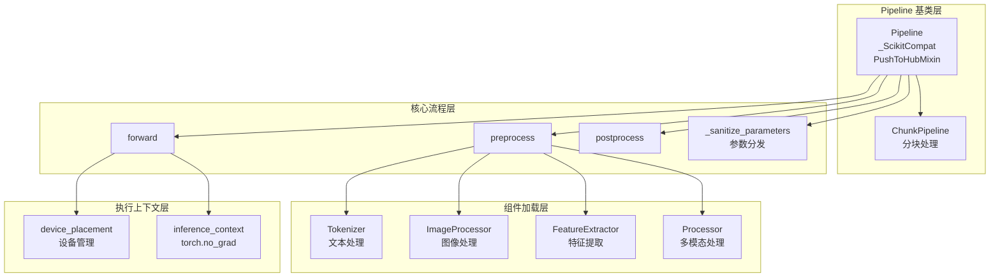

# Pipeline 推理管道深入分析

## Pipeline 架构总览



## 一、模块职责概述

Pipeline 是 Hugging Face Transformers 提供的高层推理 API，旨在将模型推理的完整流程——**预处理 → 模型推理 → 后处理**——封装为一个简单易用的对象。用户只需一行代码 `pipeline("text-generation", model="...")` 即可完成从模型加载到推理输出的全过程。

核心设计目标：
- **统一接口**：不同任务（文本生成、分类、语音识别等）共享相同的调用模式
- **自动组装**：根据任务类型自动选择合适的 Pipeline 类、Model 类、Tokenizer/Processor
- **批量优化**：内置 DataLoader + 多 worker 支持，高效处理大批量输入
- **设备透明**：自动处理 CPU/GPU/加速器上的张量迁移

## 二、核心类与函数

### 2.1 Pipeline 基类 (`base.py`)

`Pipeline` 是所有具体管道的抽象基类，定义了推理管道的核心骨架：

```python
class Pipeline(_ScikitCompat, PushToHubMixin):
    # 控制各预处理组件是否加载：True=必须, None=可选, False=不加载
    _load_processor = None
    _load_image_processor = None
    _load_feature_extractor = None
    _load_tokenizer = None

    # 标记该 Pipeline 是否调用 model.generate()
    _pipeline_calls_generate = False

    def __init__(self, model, tokenizer=None, feature_extractor=None,
                 image_processor=None, processor=None, task="", device=None, ...):
        # 1. 设备解析：支持 CUDA/MLU/MPS/XPU/HPU/NPU 等多种加速器
        # 2. 模型迁移到目标设备
        # 3. 若为生成类 Pipeline，准备 GenerationConfig 和 assistant_model
        # 4. 调用 _sanitize_parameters 分离参数到三个阶段
        self._preprocess_params, self._forward_params, self._postprocess_params = \
            self._sanitize_parameters(**kwargs)
```

**三个核心抽象方法**（子类必须实现）：

```python
@abstractmethod
def _sanitize_parameters(self, **pipeline_parameters):
    """将参数分发到 preprocess/forward/postprocess 三个阶段"""
    raise NotImplementedError()

@abstractmethod
def preprocess(self, input_, **preprocess_parameters):
    """预处理：原始输入 → 模型可消费的字典（含张量）"""
    raise NotImplementedError()

@abstractmethod
def _forward(self, input_tensors, **forward_parameters):
    """前向推理：模型输入 → 模型输出"""
    raise NotImplementedError()

@abstractmethod
def postprocess(self, model_outputs, **postprocess_parameters):
    """后处理：模型输出 → 用户友好的结果"""
    raise NotImplementedError()
```

**推理执行链**：

```python
def run_single(self, inputs, preprocess_params, forward_params, postprocess_params):
    model_inputs = self.preprocess(inputs, **preprocess_params)
    model_outputs = self.forward(model_inputs, **forward_params)
    outputs = self.postprocess(model_outputs, **postprocess_params)
    return outputs
```

`forward` 方法在 `_forward` 外层包裹了设备管理和推理上下文：

```python
def forward(self, model_inputs, **forward_params):
    with self.device_placement():                          # 设备上下文
        inference_context = self.get_inference_context()   # torch.no_grad
        with inference_context():
            model_inputs = self._ensure_tensor_on_device(model_inputs, device=self.device)
            model_outputs = self._forward(model_inputs, **forward_params)
            model_outputs = self._ensure_tensor_on_device(model_outputs, device=torch.device("cpu"))
    return model_outputs
```

### 2.2 ChunkPipeline (`base.py`)

`ChunkPipeline` 是 `Pipeline` 的子类，用于输入需要分块处理的场景（如长音频的 ASR）：

```python
class ChunkPipeline(Pipeline):
    def run_single(self, inputs, preprocess_params, forward_params, postprocess_params):
        all_outputs = []
        for model_inputs in self.preprocess(inputs, **preprocess_params):  # preprocess 生成多个 chunk
            model_outputs = self.forward(model_inputs, **forward_params)
            all_outputs.append(model_outputs)
        outputs = self.postprocess(all_outputs, **postprocess_params)      # 合并所有 chunk 的输出
        return outputs
```

关键区别：`Pipeline.preprocess` 返回单个结果，`ChunkPipeline.preprocess` 返回迭代器。

### 2.3 PipelineRegistry (`base.py`)

任务注册中心，管理任务名到 Pipeline 实现、默认模型等的映射：

```python
class PipelineRegistry:
    def __init__(self, supported_tasks: dict, task_aliases: dict):
        self.supported_tasks = supported_tasks
        self.task_aliases = task_aliases

    def check_task(self, task: str) -> tuple[str, dict, Any]:
        # 1. 查别名表（如 "ner" → "token-classification"）
        if task in self.task_aliases:
            task = self.task_aliases[task]
        # 2. 查主表
        if task in self.supported_tasks:
            return task, self.supported_tasks[task], None
        raise KeyError(...)

    def register_pipeline(self, task, pipeline_class, pt_model=None, default=None, type=None):
        """注册新的 Pipeline 任务"""
        ...
```

### 2.4 数据格式支持 (`base.py`)

`PipelineDataFormat` 及其子类支持从不同数据源读取输入：

| 类 | 格式 | 用途 |
|---|---|---|
| `JsonPipelineDataFormat` | JSON | 从 JSON 文件读取 |
| `CsvPipelineDataFormat` | CSV | 从 CSV 文件读取 |
| `PipedPipelineDataFormat` | stdin/stdout | 管道输入 |

### 2.5 模型加载 (`base.py`)

`load_model` 函数负责从 checkpoint 加载模型，具有容错和回退机制：

```python
def load_model(model, config, model_classes=None, task=None, **model_kwargs):
    if isinstance(model, str):
        # 1. 构建候选模型类列表：model_classes + config.architectures
        class_tuple = model_classes if model_classes is not None else ()
        if config.architectures:
            for architecture in config.architectures:
                _class = getattr(transformers_module, architecture, None)
                if _class is not None:
                    classes.append(_class)

        # 2. 逐一尝试加载，首个成功即返回
        for model_class in class_tuple:
            try:
                model = model_class.from_pretrained(model, **kwargs)
                break
            except (OSError, ValueError, TypeError, RuntimeError):
                # 3. 若因 dtype 不支持失败，回退到 float32
                if "dtype" in kwargs:
                    fp32_kwargs = kwargs.copy()
                    fp32_kwargs["dtype"] = torch.float32
                    model = model_class.from_pretrained(model, **fp32_kwargs)
                    break
    return model
```

### 2.6 PyTorch 管道工具 (`pt_utils.py`)

提供 Pipeline 批量推理所需的数据集和迭代器封装：

**PipelineDataset**：将预处理函数嵌入 `torch.utils.data.Dataset`

```python
class PipelineDataset(Dataset):
    def __init__(self, dataset, process, params):
        self.dataset = dataset
        self.process = process    # 通常是 self.preprocess
        self.params = params

    def __getitem__(self, i):
        item = self.dataset[i]
        processed = self.process(item, **self.params)  # 在 __getitem__ 中做预处理
        return processed
```

**PipelineIterator**：将推理函数嵌入 `IterableDataset`，支持批量拆包

```python
class PipelineIterator(IterableDataset):
    def __init__(self, loader, infer, params, loader_batch_size=None):
        self.loader = loader       # DataLoader 或其他迭代器
        self.infer = infer         # 通常是 self.forward 或 self.postprocess
        self.params = params
        self.loader_batch_size = loader_batch_size  # 批量拆包大小

    def __next__(self):
        item = next(self.iterator)
        processed = self.infer(item, **self.params)
        # 若 loader_batch_size > 1，逐项拆包返回
        if self.loader_batch_size is not None:
            self._loader_batch_data = processed
            self._loader_batch_index = 0
            return self.loader_batch_item()
        return processed
```

**PipelineChunkIterator**：嵌套迭代器，用于 `ChunkPipeline` 的分块预处理

**PipelinePackIterator**：打包迭代器，将分块的输出按 `is_last` 标记重新聚合

**KeyDataset / KeyPairDataset**：从字典式 Dataset 中提取特定列

### 2.7 管道注册与自动选择 (`__init__.py`)

#### 任务注册表

`SUPPORTED_TASKS` 字典是整个 Pipeline 系统的核心注册表：

```python
SUPPORTED_TASKS = {
    "text-generation": {
        "impl": TextGenerationPipeline,           # Pipeline 实现类
        "pt": (AutoModelForCausalLM,),            # 支持的 PyTorch 模型类
        "default": {"model": ("HuggingFaceTB/SmolLM3-3B", "a07cc9a")},  # 默认模型
        "type": "text",                            # 输入模态
    },
    "text-classification": {
        "impl": TextClassificationPipeline,
        "pt": (AutoModelForSequenceClassification,),
        "default": {"model": ("distilbert/distilbert-base-uncased-finetuned-sst-2-english", "714eb0f")},
        "type": "text",
    },
    # ... 更多任务
}

TASK_ALIASES = {
    "sentiment-analysis": "text-classification",
    "ner": "token-classification",
    "text-to-speech": "text-to-audio",
}

PIPELINE_REGISTRY = PipelineRegistry(supported_tasks=SUPPORTED_TASKS, task_aliases=TASK_ALIASES)
```

#### `pipeline()` 工厂函数

这是用户使用 Pipeline 的入口，完整流程如下：

```python
def pipeline(task=None, model=None, config=None, tokenizer=None, ...):
    # ── 第 1 步：解析任务 ──
    if task is None and model is None:
        raise RuntimeError(...)
    if task is None and model is not None:
        task = get_task(model, token)  # 从 Hub 获取 pipeline_tag

    # ── 第 2 步：加载配置 ──
    if isinstance(config, str):
        config = AutoConfig.from_pretrained(config, ...)
    elif config is None and isinstance(model, str):
        config = AutoConfig.from_pretrained(model, ...)

    # ── 第 3 步：确定 Pipeline 类 ──
    normalized_task, targeted_task, task_options = check_task(task)
    pipeline_class = targeted_task["impl"]

    # ── 第 4 步：确定默认模型（若未提供）──
    if model is None:
        model, default_revision = get_default_model_and_revision(targeted_task, task_options)

    # ── 第 5 步：加载模型 ──
    if isinstance(model, str):
        model_classes = targeted_task["pt"]
        model = load_model(model, model_classes=model_classes, config=config, task=task, ...)

    # ── 第 6 步：加载配套组件 ──
    tokenizer = _resolve_tokenizer(...)
    image_processor = _resolve_image_processor(...)
    feature_extractor = _resolve_feature_extractor(...)
    processor = _resolve_processor(...)

    # ── 第 7 步：实例化 Pipeline ──
    return pipeline_class(model=model, task=task, **kwargs)
```

组件加载的统一模式（以 tokenizer 为例）：

```python
def _resolve_tokenizer(tokenizer, load_tokenizer, use_fast, model_name, config, task, hub_kwargs, model_kwargs):
    def load(tokenizer):
        # 1. 推断组件标识符（显式传入 > model_name > config > fallback）
        tokenizer = _infer_pipeline_component(tokenizer, model_name, config, ...)
        # 2. 若已是实例则直接返回
        if not isinstance(tokenizer, (str, tuple)):
            return tokenizer
        # 3. 否则用 Auto 加载
        return AutoTokenizer.from_pretrained(tokenizer, ...)

    # 根据 load_tokenizer 标志决定是否加载
    return _load_pipeline_component(load_tokenizer, tokenizer, load)
```

## 三、TextGenerationPipeline 详解

### 3.1 类定义与配置

```python
class TextGenerationPipeline(Pipeline):
    _pipeline_calls_generate = True       # 标记调用 model.generate()
    _load_processor = False               # 不需要 processor
    _load_image_processor = False         # 不需要 image_processor
    _load_feature_extractor = False       # 不需要 feature_extractor
    _load_tokenizer = True                # 必须加载 tokenizer

    _default_generation_config = GenerationConfig(
        max_new_tokens=256,
        do_sample=True,
        temperature=0.7,
    )
```

### 3.2 参数分发 (`_sanitize_parameters`)

将用户传入的参数分发到三个阶段：

```python
def _sanitize_parameters(self, return_full_text=None, return_tensors=None,
                         return_text=None, return_type=None, prefix=None,
                         handle_long_generation=None, stop_sequence=None,
                         truncation=None, max_length=None,
                         continue_final_message=None, tools=None, ...):
    # ── 预处理参数 ──
    preprocess_params = {}
    if truncation is not None: preprocess_params["truncation"] = truncation
    if max_length is not None: preprocess_params["max_length"] = max_length
    if tools is not None: preprocess_params["tools"] = tools
    if prefix is not None: preprocess_params["prefix"] = prefix
    preprocess_params.update(generate_kwargs)  # generate 参数也传给 preprocess

    # ── 前向参数 ──
    forward_params = generate_kwargs
    if stop_sequence is not None:
        forward_params["eos_token_id"] = self.tokenizer.encode(stop_sequence)
    if self.assistant_model is not None:
        forward_params["assistant_model"] = self.assistant_model

    # ── 后处理参数 ──
    postprocess_params = {}
    if return_type is not None: postprocess_params["return_type"] = return_type
    if clean_up_tokenization_spaces is not None:
        postprocess_params["clean_up_tokenization_spaces"] = clean_up_tokenization_spaces

    return preprocess_params, forward_params, postprocess_params
```

### 3.3 预处理 (`preprocess`)

```python
def preprocess(self, prompt_text, prefix="", handle_long_generation=None,
               add_special_tokens=None, truncation=None, padding=None,
               max_length=None, continue_final_message=None, tools=None, ...):
    if isinstance(prompt_text, Chat):
        # Chat 模式：使用 apply_chat_template
        if continue_final_message is None:
            continue_final_message = prompt_text.messages[-1]["role"] == "assistant"
        inputs = self.tokenizer.apply_chat_template(
            prompt_text.messages,
            add_generation_prompt=not continue_final_message,
            continue_final_message=continue_final_message,
            return_dict=True, return_tensors="pt",
            tools=tools, ...
        )
    else:
        # 文本模式：直接 tokenize
        inputs = self.tokenizer(prefix + prompt_text, return_tensors="pt", ...)

    inputs["prompt_text"] = prompt_text  # 保留原始输入用于后处理

    # "hole" 策略处理超长输入：截断左侧留出生成空间
    if handle_long_generation == "hole":
        cur_len = inputs["input_ids"].shape[-1]
        keep_length = self.tokenizer.model_max_length - new_tokens
        inputs["input_ids"] = inputs["input_ids"][:, -keep_length:]
        if "attention_mask" in inputs:
            inputs["attention_mask"] = inputs["attention_mask"][:, -keep_length:]

    return inputs
```

### 3.4 前向推理 (`_forward`)

```python
def _forward(self, model_inputs, **generate_kwargs):
    input_ids = model_inputs["input_ids"]
    attention_mask = model_inputs.get("attention_mask", None)
    prompt_text = model_inputs.pop("prompt_text")

    # 处理 prefix 长度偏移
    prefix_length = generate_kwargs.pop("prefix_length", 0)
    if prefix_length > 0:
        generate_kwargs["max_length"] = ... + prefix_length

    # 注入 generation_config
    if "generation_config" not in generate_kwargs:
        generate_kwargs["generation_config"] = self.generation_config

    # 调用 model.generate()
    output = self.model.generate(input_ids=input_ids, attention_mask=attention_mask, **generate_kwargs)

    # 重塑输出：支持 num_return_sequences > 1
    generated_sequence = output.sequences if isinstance(output, ModelOutput) else output
    generated_sequence = generated_sequence.reshape(in_b, out_b // in_b, *generated_sequence.shape[1:])

    return {
        "generated_sequence": generated_sequence,
        "input_ids": input_ids,
        "prompt_text": prompt_text,
    }
```

### 3.5 后处理 (`postprocess`)

```python
def postprocess(self, model_outputs, return_type=ReturnType.FULL_TEXT,
                clean_up_tokenization_spaces=True, continue_final_message=None, ...):
    generated_sequence = model_outputs["generated_sequence"][0]
    input_ids = model_outputs["input_ids"]
    prompt_text = model_outputs["prompt_text"]

    for sequence in generated_sequence:
        if return_type == ReturnType.TENSORS:
            record = {"generated_token_ids": sequence}
        elif return_type in {ReturnType.NEW_TEXT, ReturnType.FULL_TEXT}:
            # 解码生成的 token（跳过 prompt 部分）
            all_text = self.tokenizer.decode(
                sequence[prompt_token_length:],
                skip_special_tokens=skip_special_tokens, ...
            )
            if return_type == ReturnType.FULL_TEXT:
                if isinstance(prompt_text, str):
                    all_text = prompt_text + all_text
                elif isinstance(prompt_text, Chat):
                    # 构建完整的 chat 消息列表
                    assistant_message = {"role": "assistant", "content": all_text}
                    all_text = list(prompt_text.messages) + [assistant_message]
            record = {"generated_text": all_text}
    return records
```

## 四、批量推理流程

当用户传入列表或 Dataset 时，Pipeline 自动启用批量推理：

```python
def __call__(self, inputs, *args, num_workers=None, batch_size=None, **kwargs):
    # ...
    is_iterable = is_dataset or is_generator or is_list

    if is_list:
        final_iterator = self.get_iterator(
            inputs, num_workers, batch_size, preprocess_params, forward_params, postprocess_params
        )
        return list(final_iterator)
    else:
        return self.run_single(inputs, ...)
```

`get_iterator` 构建三阶段迭代管道：

```python
def get_iterator(self, inputs, num_workers, batch_size, preprocess_params, forward_params, postprocess_params):
    # 阶段1：预处理
    dataset = PipelineDataset(inputs, self.preprocess, preprocess_params)
    collate_fn = no_collate_fn if batch_size == 1 else pad_collate_fn(self.tokenizer, feature_extractor)
    dataloader = DataLoader(dataset, num_workers=num_workers, batch_size=batch_size, collate_fn=collate_fn)

    # 阶段2：前向推理
    model_iterator = PipelineIterator(dataloader, self.forward, forward_params, loader_batch_size=batch_size)

    # 阶段3：后处理
    final_iterator = PipelineIterator(model_iterator, self.postprocess, postprocess_params)

    return final_iterator
```

数据流图：

```
inputs → PipelineDataset(preprocess) → DataLoader → PipelineIterator(forward) → PipelineIterator(postprocess) → outputs
```

## 五、设计原理总结

### 5.1 模板方法模式

`Pipeline` 基类定义了推理的骨架（`preprocess → _forward → postprocess`），子类只需实现具体步骤。`_sanitize_parameters` 则实现了参数的三阶段分发，使得 `__init__` 和 `__call__` 的额外参数能被正确路由。

### 5.2 注册表模式

`PipelineRegistry` + `SUPPORTED_TASKS` 实现了任务名到实现的解耦映射。新增任务只需调用 `register_pipeline`，无需修改工厂函数。

### 5.3 懒加载与按需组装

Pipeline 工厂函数根据任务类型和 Pipeline 类的 `_load_*` 标志按需加载组件，避免加载不必要的 tokenizer/feature_extractor/processor。

### 5.4 设备透明

`_ensure_tensor_on_device` 递归地将所有张量迁移到目标设备，`forward` 方法自动将输出迁回 CPU，避免 GPU 内存泄漏。

## 六、与其他模块的关系

```
Pipeline 推理管道
    ├── AutoConfig ─────────── 加载模型配置
    ├── AutoTokenizer ──────── 加载分词器
    ├── AutoModelFor* ──────── 加载具体模型
    ├── AutoProcessor ──────── 加载多模态处理器
    ├── AutoFeatureExtractor ── 加载特征提取器
    ├── AutoImageProcessor ─── 加载图像处理器
    ├── GenerationConfig ────── 生成配置（文本生成管道）
    ├── DataLoader ──────────── 批量推理
    └── dynamic_module_utils ── 自定义管道的远程代码加载
```

Pipeline 是 Transformers 最高层的抽象，它将 AutoModel 系列的自动分发能力与具体的推理逻辑结合，为用户提供最简洁的推理接口。
