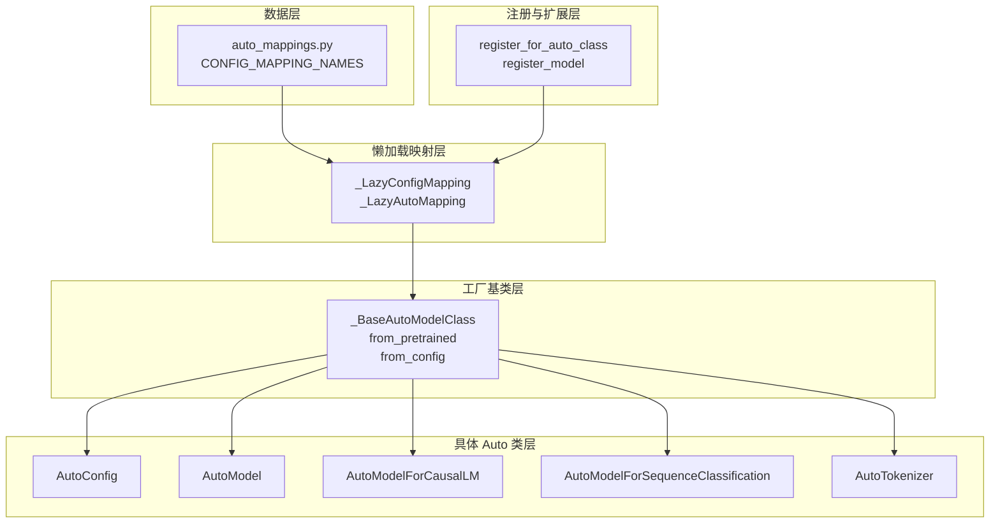

# AutoModel 自动分发机制深入分析

## AutoModel 架构总览



## 一、模块职责概述

AutoModel 系列是 Hugging Face Transformers 的核心自动分发机制，其核心思想是：**用户只需指定模型名称或路径，框架根据配置文件中的 `model_type` 自动选择正确的模型类、配置类、分词器类进行实例化**。

设计目标：
- **零配置加载**：`AutoModel.from_pretrained("bert-base-uncased")` 自动选择 `BertModel`
- **统一接口**：所有 Auto 类共享 `from_pretrained` / `from_config` 接口
- **懒加载**：模型类仅在首次访问时导入，避免启动时加载数百个模块
- **可扩展**：支持自定义模型注册和远程代码加载

核心文件关系：

```
auto_mappings.py          ── 纯数据：model_type → Config类名 的映射表
configuration_auto.py     ── AutoConfig：model_type → Config类 的懒加载映射
auto_factory.py           ── _BaseAutoModelClass + _LazyAutoMapping：模型工厂
modeling_auto.py          ── AutoModel/AutoModelForCausalLM 等：具体 Auto 类
tokenization_auto.py      ── AutoTokenizer：分词器自动分发
```

## 二、映射表：auto_mappings.py

这是整个自动分发机制的数据基础，由脚本自动生成：

```python
CONFIG_MAPPING_NAMES = OrderedDict(
    [
        ("bert", "BertConfig"),
        ("gpt2", "GPT2Config"),
        ("llama", "LlamaConfig"),
        ("mistral", "MistralConfig"),
        ("qwen2", "Qwen2Config"),
        # ... 数百个 model_type → Config类名 的映射
    ]
)
```

关键设计：
- **键**是 `model_type`（如 `"bert"`），与 `config.json` 中的 `model_type` 字段对应
- **值**是 Config 类名的**字符串**（如 `"BertConfig"`），而非类本身——这是懒加载的基础
- 使用 `OrderedDict` 保证遍历顺序稳定

`SPECIAL_MODEL_TYPE_TO_MODULE_NAME` 处理 model_type 到模块名的不规则映射：

```python
SPECIAL_MODEL_TYPE_TO_MODULE_NAME = {
    "EvollaModel": "evolla",
    "vibevoice_acoustic_tokenizer_encoder": "vibevoice_acoustic_tokenizer",
    ...
}
```

## 三、AutoConfig：配置自动分发

### 3.1 _LazyConfigMapping

`_LazyConfigMapping` 是 `OrderedDict` 的子类，实现配置类的懒加载：

```python
class _LazyConfigMapping(OrderedDict[str, type[PreTrainedConfig]]):
    def __init__(self, mapping):
        self._mapping = mapping           # model_type → Config类名（字符串）
        self._extra_content = {}          # 运行时注册的额外映射
        self._modules = {}                # 已导入的模块缓存

    def __getitem__(self, key: str) -> type[PreTrainedConfig]:
        if key in self._extra_content:
            return self._extra_content[key]
        if key not in self._mapping:
            raise KeyError(key)
        value = self._mapping[key]        # 获取类名字符串，如 "BertConfig"
        module_name = model_type_to_module_name(key)  # "bert" → "bert"
        # 延迟导入模块
        if module_name not in self._modules:
            self._modules[module_name] = importlib.import_module(f".{module_name}", "transformers.models")
        # 从模块中获取 Config 类
        return getattr(self._modules[module_name], value)
```

核心机制：**存储字符串，访问时才导入模块并解析为类**。这意味着 `import transformers` 时不会加载任何具体模型的模块。

`model_type_to_module_name` 函数将 model_type 转换为模块名：

```python
def model_type_to_module_name(key) -> str:
    if key in SPECIAL_MODEL_TYPE_TO_MODULE_NAME:
        key = SPECIAL_MODEL_TYPE_TO_MODULE_NAME[key]
    key = key.replace("-", "_")  # "bert-generation" → "bert_generation"
    return key
```

### 3.2 AutoConfig.from_pretrained

```python
class AutoConfig:
    def __init__(self):
        raise OSError("AutoConfig is designed to be instantiated "
                      "using the `AutoConfig.from_pretrained(...)` method.")

    @classmethod
    def from_pretrained(cls, pretrained_model_name_or_path, **kwargs):
        # 1. 读取 config.json 得到 config_dict
        config_dict, unused_kwargs = PreTrainedConfig.get_config_dict(pretrained_model_name_or_path, **kwargs)

        # 2. 判断代码来源
        has_remote_code = "auto_map" in config_dict and "AutoConfig" in config_dict["auto_map"]
        has_local_code = "model_type" in config_dict and config_dict["model_type"] in CONFIG_MAPPING

        # 3. 远程代码路径
        if has_remote_code and trust_remote_code:
            config_class = get_class_from_dynamic_module(class_ref, pretrained_model_name_or_path, ...)
            return config_class.from_pretrained(pretrained_model_name_or_path, **kwargs)

        # 4. 本地代码路径（最常见）
        elif "model_type" in config_dict:
            config_class = CONFIG_MAPPING[config_dict["model_type"]]  # 触发懒加载
            return config_class.from_dict(config_dict, **unused_kwargs)

        raise ValueError(...)
```

分发决策流程：

```
config.json
    ├── 有 auto_map.AutoConfig 且 trust_remote_code → 远程代码加载
    ├── 有 model_type 且在 CONFIG_MAPPING 中 → 本地 Config 类
    └── 都不满足 → 报错
```

## 四、_LazyAutoMapping：模型类的懒加载映射

### 4.1 核心实现

`_LazyAutoMapping` 是 AutoModel 系列的核心数据结构，将 Config 类映射到模型类：

```python
class _LazyAutoMapping(OrderedDict[type[PreTrainedConfig], tuple[type | None, type | None]]):
    def __init__(self, config_mapping, model_mapping):
        self._config_mapping = config_mapping     # model_type → Config类名
        self._reverse_config_mapping = {v: k for k, v in config_mapping.items()}  # Config类名 → model_type
        self._model_mapping = model_mapping       # model_type → Model类名
        self._model_mapping._model_mapping = self  # 双向引用
        self._extra_content = {}                  # 运行时注册
        self._modules = {}                        # 模块缓存

    def __getitem__(self, key: type[PreTrainedConfig]) -> tuple:
        # 1. 检查额外内容
        if key in self._extra_content:
            return self._extra_content[key]

        # 2. 通过 Config 类名反查 model_type
        model_type = self._reverse_config_mapping[key.__name__]

        # 3. 通过 model_type 查找 Model 类名
        if model_type in self._model_mapping:
            model_name = self._model_mapping[model_type]
            return self._load_attr_from_module(model_type, model_name)

    def _load_attr_from_module(self, model_type, attr):
        """延迟导入模块并获取属性"""
        module_name = model_type_to_module_name(model_type)
        if module_name not in self._modules:
            self._modules[module_name] = importlib.import_module(f".{module_name}", "transformers.models")
        return getattribute_from_module(self._modules[module_name], attr)
```

关键设计：
- **键**是 Config **类**（如 `BertConfig`），而非字符串——因为 `from_pretrained` 拿到的是已实例化的 config
- **值**是 Model **类**（如 `BertForCausalLM`），通过懒加载获取
- 通过 `_reverse_config_mapping`（Config类名 → model_type）实现从 Config 类到 model_type 的反向查找

### 4.2 使用示例

```python
# modeling_auto.py 中的映射定义
MODEL_FOR_CAUSAL_LM_MAPPING_NAMES = OrderedDict([
    ("llama", "LlamaForCausalLM"),
    ("gpt2", "GPT2LMHeadModel"),
    ("bert", "BertLMHeadModel"),
    ...
])

# 创建懒加载映射
MODEL_FOR_CAUSAL_LM_MAPPING = _LazyAutoMapping(CONFIG_MAPPING_NAMES, MODEL_FOR_CAUSAL_LM_MAPPING_NAMES)

# 使用：config 是 LlamaConfig 实例
model_class = MODEL_FOR_CAUSAL_LM_MAPPING[type(config)]  # → LlamaForCausalLM（懒加载）
```

## 五、_BaseAutoModelClass：模型自动分发工厂

### 5.1 from_config

```python
class _BaseAutoModelClass:
    _model_mapping = None  # 子类设置，如 MODEL_FOR_CAUSAL_LM_MAPPING

    def __init__(self, *args, **kwargs):
        raise OSError(f"{self.__class__.__name__} is designed to be instantiated "
                      f"using the `{self.__class__.__name__}.from_pretrained(...)` method.")

    @classmethod
    def from_config(cls, config, **kwargs):
        trust_remote_code = kwargs.pop("trust_remote_code", None)
        has_remote_code = hasattr(config, "auto_map") and cls.__name__ in config.auto_map
        has_local_code = type(config) in cls._model_mapping

        # 远程代码路径
        if has_remote_code and trust_remote_code:
            class_ref = config.auto_map[cls.__name__]
            model_class = get_class_from_dynamic_module(class_ref, ...)
            if not has_local_code:
                cls.register(config.__class__, model_class, exist_ok=True)
            return model_class._from_config(config, **kwargs)

        # 本地代码路径
        elif has_local_code:
            model_class = _get_model_class(config, cls._model_mapping)
            return model_class._from_config(config, **kwargs)

        raise ValueError(...)
```

### 5.2 from_pretrained

这是最常用的入口，完整流程：

```python
@classmethod
def from_pretrained(cls, pretrained_model_name_or_path, *model_args, **kwargs):
    config = kwargs.pop("config", None)

    # 1. 若未提供 config，自动加载
    if not isinstance(config, PreTrainedConfig):
        config, kwargs = AutoConfig.from_pretrained(
            pretrained_model_name_or_path, return_unused_kwargs=True, ...
        )

    # 2. 判断代码来源
    has_remote_code = hasattr(config, "auto_map") and cls.__name__ in config.auto_map
    has_local_code = type(config) in cls._model_mapping

    # 3. 远程代码路径
    if has_remote_code and trust_remote_code:
        model_class = get_class_from_dynamic_module(class_ref, ...)
        if not has_local_code:
            cls.register(config.__class__, model_class, exist_ok=True)
        return model_class.from_pretrained(pretrained_model_name_or_path, config=config, ...)

    # 4. 本地代码路径
    elif has_local_code:
        model_class = _get_model_class(config, cls._model_mapping)
        return model_class.from_pretrained(pretrained_model_name_or_path, config=config, ...)

    raise ValueError(...)
```

### 5.3 _get_model_class

当映射值是元组时（同一 Config 对应多个模型），通过 `architectures` 字段选择：

```python
def _get_model_class(config, model_mapping):
    supported_models = model_mapping[type(config)]
    if not isinstance(supported_models, (list, tuple)):
        return supported_models  # 单个模型，直接返回

    # 多个候选模型，通过 config.architectures 选择
    name_to_model = {model.__name__: model for model in supported_models}
    architectures = getattr(config, "architectures", [])
    for arch in architectures:
        if arch in name_to_model:
            return name_to_model[arch]

    # 默认返回第一个
    return supported_models[0]
```

## 六、AutoModel 系列类

### 6.1 类定义模式

所有 AutoModel 类遵循相同的定义模式：

```python
# 1. 定义类，设置 _model_mapping
class AutoModel(_BaseAutoModelClass):
    _model_mapping = MODEL_MAPPING

# 2. 用 auto_class_update 增强（添加文档、复制 from_config/from_pretrained）
AutoModel = auto_class_update(AutoModel)


class AutoModelForCausalLM(_BaseAutoModelClass):
    _model_mapping = MODEL_FOR_CAUSAL_LM_MAPPING

    @classmethod
    def from_pretrained(cls, pretrained_model_name_or_path, *model_args, **kwargs):
        return super().from_pretrained(pretrained_model_name_or_path, *model_args, **kwargs)

AutoModelForCausalLM = auto_class_update(AutoModelForCausalLM, head_doc="causal language modeling")
```

### 6.2 映射关系一览

每个 Auto 类对应一个 `_MAPPING`，每个 `_MAPPING` 由 `_LazyAutoMapping(CONFIG_MAPPING_NAMES, XXX_MAPPING_NAMES)` 创建：

| Auto 类 | 映射名 | 用途 |
|---|---|---|
| `AutoModel` | `MODEL_MAPPING` | 基础模型（无任务头） |
| `AutoModelForCausalLM` | `MODEL_FOR_CAUSAL_LM_MAPPING` | 因果语言模型 |
| `AutoModelForMaskedLM` | `MODEL_FOR_MASKED_LM_MAPPING` | 掩码语言模型 |
| `AutoModelForSeq2SeqLM` | `MODEL_FOR_SEQ_TO_SEQ_CAUSAL_LM_MAPPING` | 序列到序列模型 |
| `AutoModelForSequenceClassification` | `MODEL_FOR_SEQUENCE_CLASSIFICATION_MAPPING` | 文本分类 |
| `AutoModelForTokenClassification` | `MODEL_FOR_TOKEN_CLASSIFICATION_MAPPING` | 标注任务 |
| `AutoModelForQuestionAnswering` | `MODEL_FOR_QUESTION_ANSWERING_MAPPING` | 问答 |
| `AutoModelForImageTextToText` | `MODEL_FOR_IMAGE_TEXT_TO_TEXT_MAPPING` | 图文多模态 |
| `AutoModelForSpeechSeq2Seq` | `MODEL_FOR_SPEECH_SEQ_2_SEQ_MAPPING` | 语音识别 |
| ... | ... | ... |

### 6.3 auto_class_update

`auto_class_update` 函数为 Auto 类添加定制化的文档和方法：

```python
def auto_class_update(cls, checkpoint_for_example="google-bert/bert-base-cased", head_doc=""):
    model_mapping = cls._model_mapping
    name = cls.__name__

    # 1. 更新类文档
    cls.__doc__ = insert_head_doc(CLASS_DOCSTRING, head_doc=head_doc).replace("BaseAutoModelClass", name)

    # 2. 复制 from_config 并更新文档（包含支持的模型列表）
    from_config = copy_func(_BaseAutoModelClass.from_config)
    from_config.__doc__ = ...
    from_config = replace_list_option_in_docstrings(model_mapping._model_mapping, use_model_types=False)(from_config)
    cls.from_config = classmethod(from_config)

    # 3. 复制 from_pretrained 并更新文档
    from_pretrained = copy_func(_BaseAutoModelClass.from_pretrained)
    from_pretrained.__doc__ = ...
    from_pretrained = replace_list_option_in_docstrings(model_mapping._model_mapping)(from_pretrained)
    cls.from_pretrained = classmethod(from_pretrained)

    return cls
```

为什么要 `copy_func`？因为每个 Auto 类需要有自己的 `from_config`/`from_pretrained` 方法（含不同的文档字符串和类型提示），而不是共享基类的同一个方法。

## 七、AutoTokenizer 自动分发

### 7.1 映射结构

AutoTokenizer 使用相同的 `_LazyAutoMapping`，但映射值是单个分词器类名：

```python
TOKENIZER_MAPPING_NAMES = OrderedDict([
    ("bert", "BertTokenizer" if is_tokenizers_available() else None),
    ("gpt2", "GPT2Tokenizer" if is_tokenizers_available() else None),
    ("llama", "TokenizersBackend" if is_tokenizers_available() else None),
    ("t5", "T5Tokenizer" if is_tokenizers_available() else None),
    ...
])

TOKENIZER_MAPPING = _LazyAutoMapping(CONFIG_MAPPING_NAMES, TOKENIZER_MAPPING_NAMES)
```

V5 版本的重大变化：映射值从 `(slow_tokenizer, fast_tokenizer)` 元组简化为单个类名，始终优先使用基于 `tokenizers` 库的快速实现。

### 7.2 from_pretrained 分发逻辑

AutoTokenizer 的分发逻辑比 AutoModel 更复杂，因为它需要考虑多种来源：

```python
class AutoTokenizer:
    @classmethod
    def from_pretrained(cls, pretrained_model_name_or_path, *inputs, **kwargs):
        # 1. 加载 config
        config = AutoConfig.from_pretrained(pretrained_model_name_or_path, ...)
        config_model_type = config.model_type

        # 2. 读取 tokenizer_config.json
        tokenizer_config = get_tokenizer_config(pretrained_model_name_or_path, ...)
        tokenizer_config_class = tokenizer_config.get("tokenizer_class", None)

        # 3. 检查 auto_map（远程代码）
        tokenizer_auto_map = tokenizer_config.get("auto_map", {}).get("AutoTokenizer", None)

        # 4. 分发决策
        if has_remote_code and trust_remote_code:
            # 远程代码路径
            tokenizer_class = get_class_from_dynamic_module(class_ref, ...)
            return tokenizer_class.from_pretrained(...)

        elif tokenizer_config_class is not None:
            # 根据 tokenizer_config.json 中的 tokenizer_class 加载
            tokenizer_class = tokenizer_class_from_name(tokenizer_config_class)
            if tokenizer_class is None:
                tokenizer_class = TokenizersBackend  # 回退到通用后端
            return tokenizer_class.from_pretrained(...)

        elif getattr(config, "tokenizer_class", None):
            # 根据 config 中的 tokenizer_class 加载
            ...

        else:
            # 根据 model_type 从映射表查找
            tokenizer_class = TOKENIZER_MAPPING.get(type(config), TokenizersBackend)
            return tokenizer_class.from_pretrained(...)
```

### 7.3 tokenizer_class_from_name

将类名字符串解析为实际的类：

```python
def tokenizer_class_from_name(class_name: str) -> type | None:
    # 1. 检查预注册的类
    if class_name in REGISTERED_TOKENIZER_CLASSES:
        return REGISTERED_TOKENIZER_CLASSES[class_name]

    # 2. 在 TOKENIZER_MAPPING_NAMES 中查找并导入
    for module_name, tokenizer_class in TOKENIZER_MAPPING_NAMES.items():
        if tokenizer_class == class_name:
            module = importlib.import_module(f".{module_name}", "transformers.models")
            return getattr(module, class_name)

    # 3. 在额外内容中查找
    for tokenizer in TOKENIZER_MAPPING._extra_content.values():
        if getattr(tokenizer, "__name__", None) == class_name:
            return tokenizer

    # 4. V5 兼容：XxxFast → Xxx
    if class_name.endswith("Fast"):
        return tokenizer_class_from_name(class_name[:-4])

    return None
```

### 7.4 MODELS_WITH_INCORRECT_HUB_TOKENIZER_CLASS

某些模型在 Hub 上的 `tokenizer_config.json` 中声明了错误的 `tokenizer_class`，需要强制覆盖：

```python
MODELS_WITH_INCORRECT_HUB_TOKENIZER_CLASS = {
    "deepseek_v2", "deepseek_v3", "internlm2", "jamba", "phi3", "qwen2", ...
}
```

对于这些模型，即使 Hub 上声明了 `tokenizer_class`，也会使用映射表中注册的类。

## 八、完整分发流程图

以 `AutoModelForCausalLM.from_pretrained("meta-llama/Llama-2-7b-hf")` 为例：

```
1. from_pretrained("meta-llama/Llama-2-7b-hf")
    │
    ├── config 未提供 → AutoConfig.from_pretrained("meta-llama/Llama-2-7b-hf")
    │   │
    │   ├── 读取 config.json → {"model_type": "llama", ...}
    │   │
    │   ├── CONFIG_MAPPING["llama"]
    │   │   └── _LazyConfigMapping.__getitem__("llama")
    │   │       └── importlib.import_module(".llama", "transformers.models")
    │   │           └── getattr(llama_module, "LlamaConfig")  → LlamaConfig
    │   │
    │   └── LlamaConfig.from_dict(config_dict) → config: LlamaConfig
    │
    ├── type(config) = LlamaConfig
    │
    ├── MODEL_FOR_CAUSAL_LM_MAPPING[LlamaConfig]
    │   │
    │   ├── _reverse_config_mapping["LlamaConfig"] → "llama"
    │   │
    │   ├── MODEL_FOR_CAUSAL_LM_MAPPING_NAMES["llama"] → "LlamaForCausalLM"
    │   │
    │   └── _load_attr_from_module("llama", "LlamaForCausalLM")
    │       └── importlib.import_module(".llama", "transformers.models")
    │           └── getattr(llama_module, "LlamaForCausalLM") → LlamaForCausalLM
    │
    └── LlamaForCausalLM.from_pretrained("meta-llama/Llama-2-7b-hf", config=config)
        └── 加载权重，返回模型实例
```

## 九、注册机制

### 9.1 AutoConfig.register

```python
@staticmethod
def register(model_type, config, exist_ok=False):
    CONFIG_MAPPING.register(model_type, config, exist_ok=exist_ok)
```

### 9.2 AutoModel.register

```python
@classmethod
def register(cls, config_class, model_class, exist_ok=False):
    if hasattr(model_class, "config_class") and model_class.config_class.__name__ != config_class.__name__:
        raise ValueError(...)
    cls._model_mapping.register(config_class, model_class, exist_ok=exist_ok)
```

### 9.3 _LazyAutoMapping.register

```python
def register(self, key: type[PreTrainedConfig], value, exist_ok=False):
    if hasattr(key, "__name__") and key.__name__ in self._reverse_config_mapping:
        model_type = self._reverse_config_mapping[key.__name__]
        if model_type in self._model_mapping and not exist_ok:
            raise ValueError(f"'{key}' is already used by a Transformers model.")
    self._extra_content[key] = value
```

注册的内容存入 `_extra_content`，优先级高于懒加载映射。

## 十、远程代码加载

当模型的 `config.json` 包含 `auto_map` 字段时，Auto 类可以从 Hub 动态加载自定义代码：

```json
{
    "auto_map": {
        "AutoConfig": "custom_config.CustomConfig",
        "AutoModel": "custom_model.CustomModel",
        "AutoTokenizer": ["custom_tokenizer.CustomTokenizer", "custom_tokenizer.CustomTokenizerFast"]
    }
}
```

分发逻辑中的关键判断：

```python
has_remote_code = hasattr(config, "auto_map") and cls.__name__ in config.auto_map
has_local_code = type(config) in cls._model_mapping
explicit_local_code = has_local_code and not _get_model_class(
    config, cls._model_mapping
).__module__.startswith("transformers.")

# 优先级：远程代码（需 trust_remote_code）> 本地代码
if has_remote_code and trust_remote_code and not explicit_local_code:
    model_class = get_class_from_dynamic_module(class_ref, ...)
    return model_class.from_pretrained(...)
elif has_local_code:
    model_class = _get_model_class(config, cls._model_mapping)
    return model_class.from_pretrained(...)
```

`explicit_local_code` 检查确保：如果本地已有同名模型类但不在 `transformers.` 模块下（即用户自定义的），不会被远程代码覆盖。

## 十一、add_generation_mixin_to_remote_model

为远程加载的模型动态添加 `GenerationMixin`，确保兼容性：

```python
def add_generation_mixin_to_remote_model(model_class):
    # 1. 非 PyTorch 模型，不做处理
    if "torch.nn.modules.module.Module" not in str(model_class.__mro__):
        return model_class

    # 2. 已直接继承 GenerationMixin，不做处理
    if "GenerationMixin" in str(model_class.__bases__):
        return model_class

    # 3. 有自定义 generate 或 prepare_inputs_for_generation，动态添加
    if has_custom_generate_in_class or has_custom_prepare_inputs:
        model_class_with_generation_mixin = type(
            model_class.__name__, (model_class, GenerationMixin), {**model_class.__dict__}
        )
        return model_class_with_generation_mixin

    return model_class
```

## 十二、设计原理总结

### 12.1 懒加载（Lazy Loading）

整个 AutoModel 体系的核心设计原则。映射表中存储的是**类名字符串**而非类本身，只有在实际访问时才通过 `importlib` 导入对应模块。这避免了 `import transformers` 时加载数百个模型模块的开销。

```
字符串 "LlamaForCausalLM"  ──访问时──→  importlib.import_module(".llama")  →  getattr(module, "LlamaForCausalLM")
```

### 12.2 双层映射

```
model_type (字符串) ──→ Config类名 (字符串) ──→ Config类 (类对象)
                                                    │
model_type (字符串) ──→ Model类名 (字符串) ──→ Model类 (类对象)
                                                    │
Config类 (类对象)  ─────────────────────────────→ Model类 (类对象)
```

`_LazyAutoMapping` 的键是 Config **类**，而非 model_type 字符串。这是因为 `from_pretrained` 拿到的是已加载的 config 对象，通过 `type(config)` 查找最直接。

### 12.3 注册表模式

所有 Auto 类都支持 `register` 方法，允许用户在运行时注册自定义模型：

```python
AutoConfig.register("my-model", MyConfig)
AutoModel.register(MyConfig, MyModel)
```

注册的内容存入 `_extra_content`，优先于懒加载映射。

### 12.4 工厂方法模式

`_BaseAutoModelClass` 是典型的工厂方法：`from_pretrained` / `from_config` 根据配置信息选择并实例化具体的产品类。用户永远不直接实例化 Auto 类本身。

## 十三、与其他模块的关系

```
AutoModel 自动分发
    ├── auto_mappings.py ─────── 纯数据映射表（自动生成）
    ├── configuration_auto.py ── AutoConfig + _LazyConfigMapping
    ├── auto_factory.py ──────── _BaseAutoModelClass + _LazyAutoMapping + auto_class_update
    ├── modeling_auto.py ─────── 所有 AutoModel* 类定义 + 模型映射表
    ├── tokenization_auto.py ─── AutoTokenizer + 分词器映射表
    │
    ├── 依赖 ─────────────────── configuration_utils.PreTrainedConfig
    ├── 依赖 ─────────────────── dynamic_module_utils (远程代码加载)
    ├── 依赖 ─────────────────── utils.cached_file (Hub 文件缓存)
    │
    └── 被依赖 ───────────────── pipelines (Pipeline 使用 Auto* 加载组件)
                     └── trainers (Trainer 使用 AutoModel 加载模型)
```

AutoModel 是 Transformers 中间层的核心抽象，向下连接具体的模型实现（如 `BertModel`、`LlamaForCausalLM`），向上为 Pipeline、Trainer 等高层 API 提供统一的模型加载接口。
