# BERT 案例详解：Transformers 框架全模块串联

> 本文档以 BERT 模型为例，将 Transformers 框架的所有模块串联起来，展示从加载到推理的完整生命周期。
> 所有引用均基于真实源码文件。

---

## 1. BERT 在 Transformers 中的定位

BERT（Bidirectional Encoder Representations from Transformers）是 **Encoder-only** 模型的典型代表。与 GPT（Decoder-only）和 T5（Encoder-Decoder）形成三类 Transformer 架构的鼎立格局。

BERT 的核心特征是 **双向注意力**——每个 token 可以同时关注序列中所有其他 token，而非仅关注左侧上下文。这使得 BERT 天然适合以下任务：

| 任务类型 | 对应模型类 | 源码位置 |
|---------|-----------|---------|
| MLM（掩码语言建模） | `BertForMaskedLM` | [modeling_bert.py:913](file:///workspace/src/transformers/models/bert/modeling_bert.py#L913) |
| NSP（下一句预测） | `BertForNextSentencePrediction` | [modeling_bert.py:994](file:///workspace/src/transformers/models/bert/modeling_bert.py#L994) |
| 序列分类 | `BertForSequenceClassification` | [modeling_bert.py:1076](file:///workspace/src/transformers/models/bert/modeling_bert.py#L1076) |
| 问答 | `BertForQuestionAnswering` | [modeling_bert.py:1315](file:///workspace/src/transformers/models/bert/modeling_bert.py#L1315) |
| Token 标注 | `BertForTokenClassification` | [modeling_bert.py:1255](file:///workspace/src/transformers/models/bert/modeling_bert.py#L1255) |
| 多选 | `BertForMultipleChoice` | [modeling_bert.py:1157](file:///workspace/src/transformers/models/bert/modeling_bert.py#L1157) |
| 预训练（MLM+NSP） | `BertForPreTraining` | [modeling_bert.py:731](file:///workspace/src/transformers/models/bert/modeling_bert.py#L731) |

### 架构定位图

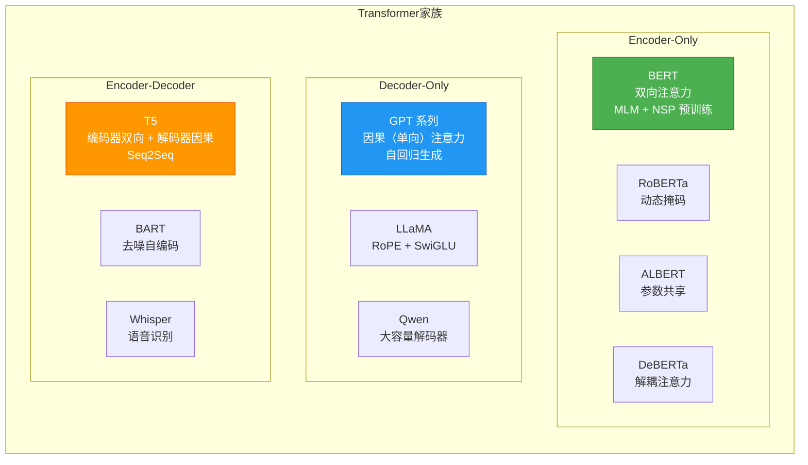

关键区别：BERT 在 [modeling_bert.py:708](file:///workspace/src/transformers/models/bert/modeling_bert.py#L708) 使用 `create_bidirectional_mask` 创建双向掩码，而 GPT 使用 `create_causal_mask` 创建因果掩码。

---

## 2. Config 定义全流程

### BertConfig 的 @strict dataclass 定义

BERT 的配置类定义在 [configuration_bert.py](file:///workspace/src/transformers/models/bert/configuration_bert.py) 中，使用了 `@strict` 装饰器和 `@auto_docstring` 装饰器：

```python
# configuration_bert.py:17-63
from huggingface_hub.dataclasses import strict
from ...configuration_utils import PreTrainedConfig
from ...utils import auto_docstring

@auto_docstring(checkpoint="google-bert/bert-base-uncased")
@strict
class BertConfig(PreTrainedConfig):
    model_type = "bert"  # 注册模型类型标识

    vocab_size: int = 30522
    hidden_size: int = 768
    num_hidden_layers: int = 12
    num_attention_heads: int = 12
    intermediate_size: int = 3072
    hidden_act: str = "gelu"
    hidden_dropout_prob: float | int = 0.1
    attention_probs_dropout_prob: float | int = 0.1
    max_position_embeddings: int = 512
    type_vocab_size: int = 2
    initializer_range: float = 0.02
    layer_norm_eps: float = 1e-12
    pad_token_id: int | None = 0
    use_cache: bool = True
    classifier_dropout: float | int | None = None
    is_decoder: bool = False
    add_cross_attention: bool = False
    tie_word_embeddings: bool = True
```

**关键设计要点**：

1. **`@strict` 装饰器**（来自 `huggingface_hub.dataclasses`）：强制类型检查，确保配置参数类型正确，防止传入非法值
2. **`model_type = "bert"`**：这是 AutoConfig 自动路由的核心标识，在 [configuration_auto.py:424](file:///workspace/src/transformers/models/auto/configuration_auto.py#L424) 的 `AutoConfig.register` 方法中用于注册映射
3. **`attribute_map`**：继承自 `PreTrainedConfig`（[configuration_utils.py:219](file:///workspace/src/transformers/configuration_utils.py#L219)），提供属性别名映射，通过 `__getattribute__` 和 `__setattr__` 拦截实现透明别名访问

### Config 类图

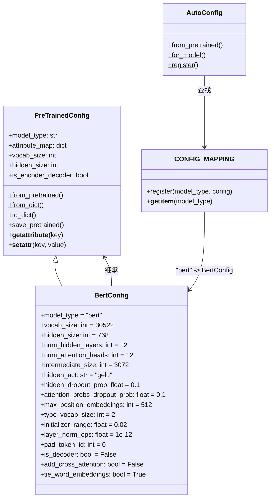

### Config 序列化流程图

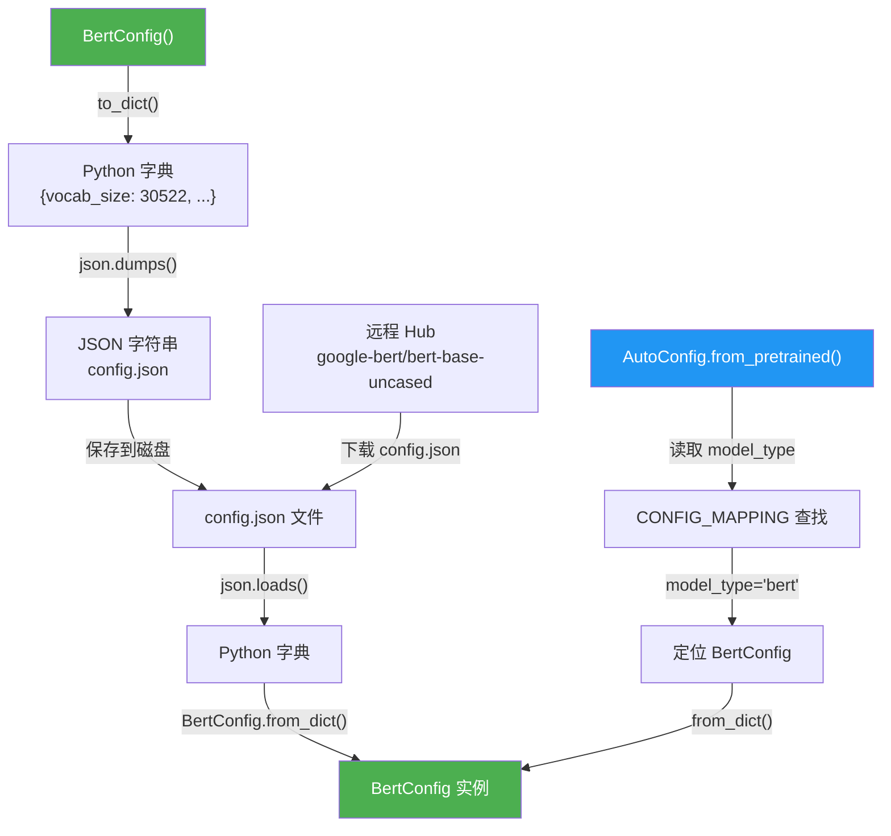

**序列化/反序列化关键路径**：

- `save_pretrained()` → `to_dict()` → JSON 文件
- `from_pretrained()` → 下载/读取 JSON → `from_dict()` → BertConfig 实例
- `AutoConfig.from_pretrained()` 通过 `model_type` 字段在 `CONFIG_MAPPING` 中查找对应的 Config 类

---

## 3. from_pretrained 完整时序

当用户调用 `BertModel.from_pretrained('bert-base-uncased')` 时，框架执行一系列复杂步骤将预训练权重加载到模型中。

### 时序图

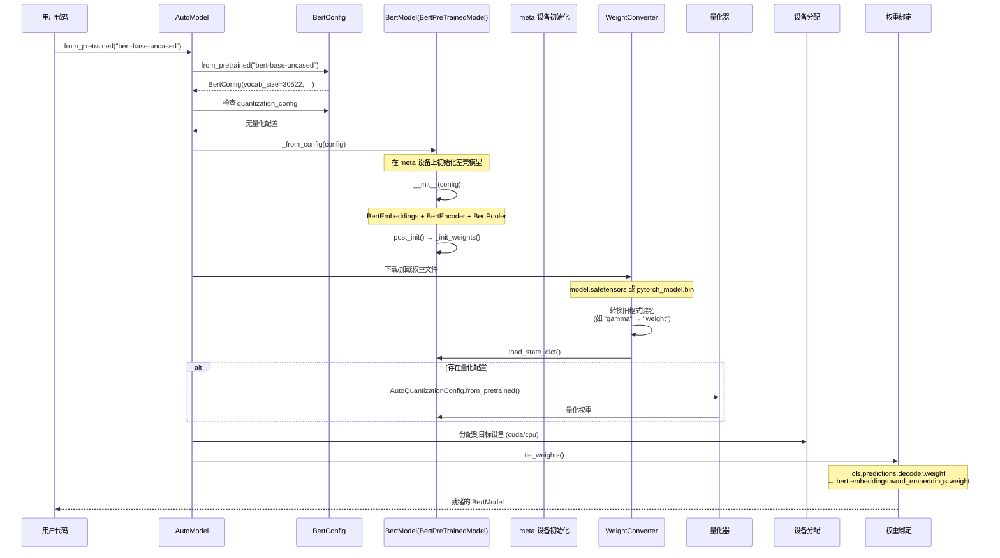

### 每一步涉及的具体代码

**步骤 1：Config 加载**
- 入口：[modeling_utils.py:3789](file:///workspace/src/transformers/modeling_utils.py#L3789) `PreTrainedModel.from_pretrained()`
- Config 加载：先通过 `AutoConfig.from_pretrained()` 获取 `BertConfig`

**步骤 2：meta 设备初始化**
- 框架在 `torch.device("meta")` 上创建模型骨架，不分配实际内存
- 调用 `BertModel.__init__(config)`（[modeling_bert.py:601](file:///workspace/src/transformers/models/bert/modeling_bert.py#L601)）

```python
# modeling_bert.py:601-616
def __init__(self, config, add_pooling_layer=True):
    super().__init__(config)
    self.config = config
    self.embeddings = BertEmbeddings(config)    # 词/位置/类型嵌入
    self.encoder = BertEncoder(config)           # 12层 Transformer
    self.pooler = BertPooler(config) if add_pooling_layer else None  # 池化层
    self.post_init()  # 初始化权重 + 权重绑定
```

**步骤 3：权重加载与转换**
- `WeightConverter` 处理旧版键名映射（如 `gamma` → `weight`，`beta` → `bias`）
- 从 safetensors 或 bin 文件加载 state_dict

**步骤 4：权重绑定**
- `BertForPreTraining` 中定义了绑定关系（[modeling_bert.py:732-735](file:///workspace/src/transformers/models/bert/modeling_bert.py#L732)）：

```python
# modeling_bert.py:732-735
_tied_weights_keys = {
    "cls.predictions.decoder.weight": "bert.embeddings.word_embeddings.weight",
    "cls.predictions.decoder.bias": "cls.predictions.bias",
}
```

这意味着 MLM 头的输出权重与输入嵌入共享，节省参数量。

---

## 4. Tokenizer 编码流程

BertTokenizer 基于 **WordPiece** 分词算法，定义在 [tokenization_bert.py](file:///workspace/src/transformers/models/bert/tokenization_bert.py)。

### 核心架构

```python
# tokenization_bert.py:41-77
class BertTokenizer(TokenizersBackend):
    vocab_files_names = VOCAB_FILES_NAMES  # {"vocab_file": "vocab.txt", "tokenizer_file": "tokenizer.json"}
    model_input_names = ["input_ids", "token_type_ids", "attention_mask"]
    model = WordPiece
```

BertTokenizer 继承自 `TokenizersBackend`，底层使用 HuggingFace 的 `tokenizers` 库实现高性能分词。

### 初始化流程

```python
# tokenization_bert.py:79-135
def __init__(self, vocab=None, do_lower_case=True, unk_token="[UNK]", ...):
    self._tokenizer = Tokenizer(WordPiece(self._vocab, unk_token=str(unk_token)))
    self._tokenizer.normalizer = normalizers.BertNormalizer(  # 文本规范化
        clean_text=True, handle_chinese_chars=tokenize_chinese_chars,
        strip_accents=strip_accents, lowercase=do_lower_case,
    )
    self._tokenizer.pre_tokenizer = pre_tokenizers.BertPreTokenizer()  # 预分词
    self._tokenizer.decoder = decoders.WordPiece(prefix="##")  # 解码器
    # 后处理器：添加 [CLS] 和 [SEP]
    self._tokenizer.post_processor = processors.TemplateProcessing(
        single=f"[CLS]:0 $A:0 [SEP]:0",
        pair=f"[CLS]:0 $A:0 [SEP]:0 $B:1 [SEP]:1",
        special_tokens=[("[CLS]", cls_token_id), ("[SEP]", sep_token_id)],
    )
```

### 编码流程图

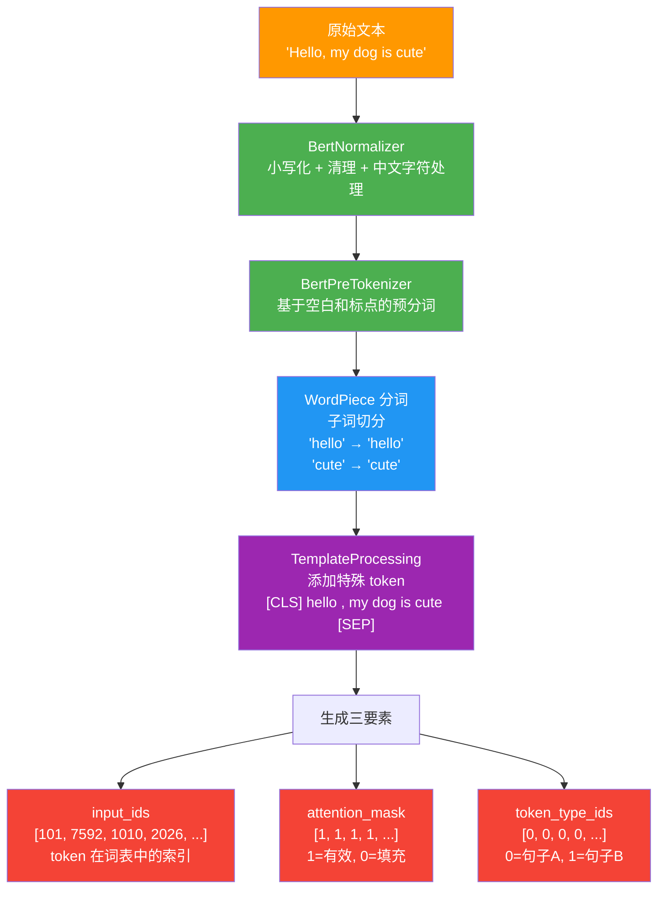

### 特殊 Token 管理

| Token | 用途 | 默认值 |
|-------|------|--------|
| `[CLS]` | 句首标记，用于分类 | `cls_token_id = 2` |
| `[SEP]` | 句子分隔符 | `sep_token_id = 3` |
| `[PAD]` | 填充标记 | `pad_token_id = 0` |
| `[UNK]` | 未知词标记 | `unk_token_id = 1` |
| `[MASK]` | 掩码标记（MLM 训练） | `mask_token_id = 4` |

### 句对编码

当输入两个句子时，`TemplateProcessing` 的 `pair` 模板生效：

```
[CLS] 句子A [SEP] 句子B [SEP]
 0     0     0     1     1    ← token_type_ids
```

---

## 5. 模型前向传播全链路

从 `input_ids` 到最终输出的完整数据流。

### 数据流图

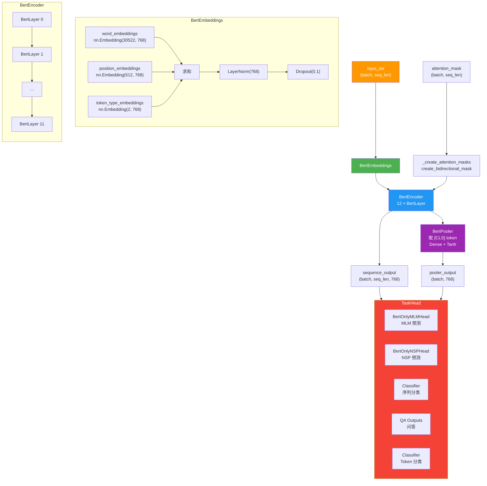

### 单层 BertLayer 内部结构图

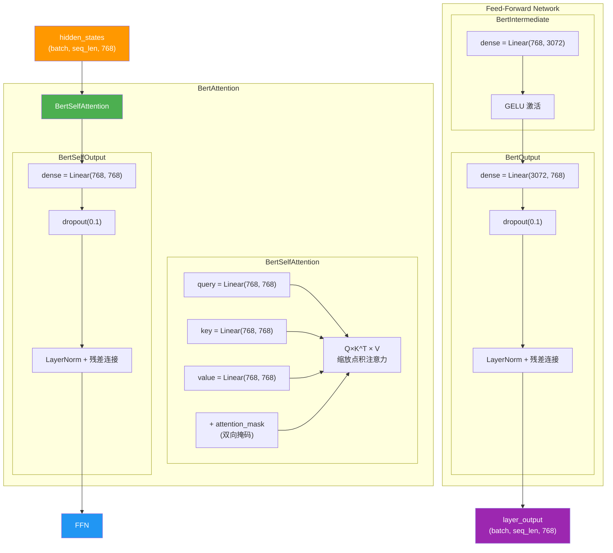

### 关键代码对应

**BertSelfAttention**（[modeling_bert.py:143-207](file:///workspace/src/transformers/models/bert/modeling_bert.py#L143)）：

```python
# modeling_bert.py:168-207
def forward(self, hidden_states, attention_mask=None, past_key_values=None, **kwargs):
    # Q/K/V 投影并重塑为多头形式
    query_layer = self.query(hidden_states).view(*hidden_shape).transpose(1, 2)
    key_layer = self.key(hidden_states).view(*hidden_shape).transpose(1, 2)
    value_layer = self.value(hidden_states).view(*hidden_shape).transpose(1, 2)

    # 通过 ALL_ATTENTION_FUNCTIONS 分发到具体实现
    attention_interface = ALL_ATTENTION_FUNCTIONS.get_interface(
        self.config._attn_implementation, eager_attention_forward
    )
    attn_output, attn_weights = attention_interface(
        self, query_layer, key_layer, value_layer,
        attention_mask, dropout=..., scaling=self.scaling, **kwargs,
    )
    attn_output = attn_output.reshape(*input_shape, -1).contiguous()
    return attn_output, attn_weights
```

**BertLayer**（[modeling_bert.py:358-420](file:///workspace/src/transformers/models/bert/modeling_bert.py#L358)）：

```python
# modeling_bert.py:378-420
def forward(self, hidden_states, attention_mask=None, ...):
    self_attention_output, _ = self.attention(hidden_states, attention_mask, ...)
    attention_output = self_attention_output

    # 如果是 decoder 且有 encoder 输出，执行交叉注意力
    if self.is_decoder and encoder_hidden_states is not None:
        cross_attention_output, _ = self.crossattention(...)
        attention_output = cross_attention_output

    # FFN（支持分块处理以节省内存）
    layer_output = apply_chunking_to_forward(
        self.feed_forward_chunk, self.chunk_size_feed_forward, self.seq_len_dim, attention_output
    )
    return layer_output
```

### 双向注意力掩码图

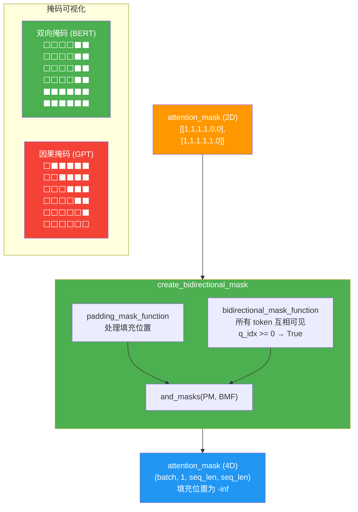

BERT 的 `_create_attention_masks` 方法（[modeling_bert.py:692-722](file:///workspace/src/transformers/models/bert/modeling_bert.py#L692)）根据 `is_decoder` 标志选择掩码类型：

```python
# modeling_bert.py:700-712
if self.config.is_decoder:
    attention_mask = create_causal_mask(...)     # 因果掩码
else:
    attention_mask = create_bidirectional_mask(...)  # 双向掩码（BERT 默认）
```

---

## 6. 注意力系统如何运作

### BERT 双向注意力 vs GPT 因果注意力

| 特性 | BERT（双向） | GPT（因果） |
|------|-------------|-------------|
| 掩码函数 | `bidirectional_mask_function` | `causal_mask_function` |
| 掩码逻辑 | `q_idx >= 0`（全部可见） | `kv_idx <= q_idx`（仅看左侧） |
| 创建函数 | `create_bidirectional_mask` | `create_causal_mask` |
| 源码位置 | [masking_utils.py:80](file:///workspace/src/transformers/masking_utils.py#L80) | [masking_utils.py:73](file:///workspace/src/transformers/masking_utils.py#L73) |
| 适用场景 | 理解型任务 | 生成型任务 |

### ALL_ATTENTION_FUNCTIONS 分发机制

`ALL_ATTENTION_FUNCTIONS` 是一个全局的注意力接口注册表，定义在 [modeling_utils.py:5070](file:///workspace/src/transformers/models/bert/../../modeling_utils.py#L5070)：

```python
ALL_ATTENTION_FUNCTIONS: AttentionInterface = AttentionInterface()
```

它继承自 `GeneralInterface`（[utils/generic.py:1054](file:///workspace/src/transformers/utils/generic.py#L1054)），支持全局映射和局部覆盖。

### 注意力分发流程图

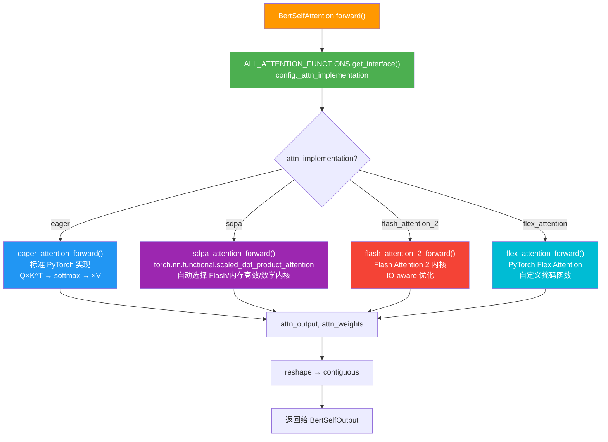

**eager_attention_forward** 的核心实现（[modeling_bert.py:115-140](file:///workspace/src/transformers/models/bert/modeling_bert.py#L115)）：

```python
# modeling_bert.py:115-140
def eager_attention_forward(module, query, key, value, attention_mask, scaling=None, dropout=0.0, **kwargs):
    if scaling is None:
        scaling = query.size(-1) ** -0.5
    attn_weights = torch.matmul(query, key.transpose(2, 3)) * scaling  # QK^T / √d
    if attention_mask is not None:
        attn_weights = attn_weights + attention_mask  # 加掩码（-inf 被屏蔽）
    attn_weights = nn.functional.softmax(attn_weights, dim=-1)  # softmax 归一化
    attn_weights = nn.functional.dropout(attn_weights, p=dropout, training=module.training)
    attn_output = torch.matmul(attn_weights, value)  # 加权求和
    attn_output = attn_output.transpose(1, 2).contiguous()
    return attn_output, attn_weights
```

**BertPreTrainedModel 声明支持的注意力实现**（[modeling_bert.py:536-548](file:///workspace/src/transformers/models/bert/modeling_bert.py#L536)）：

```python
# modeling_bert.py:536-548
class BertPreTrainedModel(PreTrainedModel):
    _supports_flash_attn = True
    _supports_sdpa = True
    _supports_flex_attn = True
    _supports_attention_backend = True
```

---

## 7. 缓存系统在 BERT 中的角色

### BERT 不需要 KV Cache

BERT 作为 Encoder-only 模型，采用 **非自回归** 的推理方式——一次性处理整个序列，而非逐 token 生成。因此，BERT **默认不使用 KV Cache**。

在 [modeling_bert.py:643-646](file:///workspace/src/transformers/models/bert/modeling_bert.py#L643) 中可以清楚看到：

```python
# modeling_bert.py:643-646
if self.config.is_decoder:
    use_cache = use_cache if use_cache is not None else self.config.use_cache
else:
    use_cache = False  # Encoder 模式下，缓存始终关闭
```

### EncoderDecoderCache 场景

当 BERT 被配置为 decoder（`is_decoder=True` + `add_cross_attention=True`）时，如 `BertLMHeadModel`，它可以参与 Seq2Seq 架构。此时会使用 `EncoderDecoderCache`：

```python
# modeling_bert.py:648-653
if use_cache and past_key_values is None:
    past_key_values = (
        EncoderDecoderCache(DynamicCache(config=self.config), DynamicCache(config=self.config))
        if encoder_hidden_states is not None or self.config.is_encoder_decoder
        else DynamicCache(config=self.config)
    )
```

`EncoderDecoderCache`（[cache_utils.py:1479](file:///workspace/src/transformers/cache_utils.py#L1479)）包含两个独立的缓存：
- `self_attention_cache`：自注意力的 KV 缓存
- `cross_attention_cache`：交叉注意力的 KV 缓存

### 缓存对比图

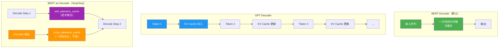

**关键区别**：

| 特性 | BERT Encoder | GPT Decoder | BERT as Decoder |
|------|-------------|-------------|-----------------|
| KV Cache | 不使用 | DynamicCache | EncoderDecoderCache |
| 推理方式 | 一次性 | 自回归 | 自回归 |
| 交叉注意力 | 无 | 无 | 有（缓存 encoder 输出） |
| `use_cache` | `False` | `True` | `True` |

---

## 8. 训练流程

### BertForPreTraining 的 MLM + NSP 损失

BERT 的预训练包含两个任务，定义在 [modeling_bert.py:731-820](file:///workspace/src/transformers/models/bert/modeling_bert.py#L731)：

```python
# modeling_bert.py:731-820
class BertForPreTraining(BertPreTrainedModel):
    _tied_weights_keys = {
        "cls.predictions.decoder.weight": "bert.embeddings.word_embeddings.weight",
        "cls.predictions.decoder.bias": "cls.predictions.bias",
    }

    def __init__(self, config):
        super().__init__(config)
        self.bert = BertModel(config)
        self.cls = BertPreTrainingHeads(config)  # MLM头 + NSP头
        self.post_init()

    def forward(self, input_ids, attention_mask=None, token_type_ids=None,
                labels=None, next_sentence_label=None, **kwargs):
        outputs = self.bert(input_ids, attention_mask=attention_mask,
                           token_type_ids=token_type_ids, ...)
        sequence_output, pooled_output = outputs[:2]
        prediction_scores, seq_relationship_score = self.cls(sequence_output, pooled_output)

        total_loss = None
        if labels is not None and next_sentence_label is not None:
            loss_fct = CrossEntropyLoss()
            masked_lm_loss = loss_fct(prediction_scores.view(-1, self.config.vocab_size), labels.view(-1))
            next_sentence_loss = loss_fct(seq_relationship_score.view(-1, 2), next_sentence_label.view(-1))
            total_loss = masked_lm_loss + next_sentence_loss  # 两个损失简单相加

        return BertForPreTrainingOutput(
            loss=total_loss,
            prediction_logits=prediction_scores,
            seq_relationship_logits=seq_relationship_score,
            ...
        )
```

**BertPreTrainingHeads**（[modeling_bert.py:523-532](file:///workspace/src/transformers/models/bert/modeling_bert.py#L523)）包含两个头：

```python
# modeling_bert.py:523-532
class BertPreTrainingHeads(nn.Module):
    def __init__(self, config):
        super().__init__()
        self.predictions = BertLMPredictionHead(config)  # MLM: Dense → GELU → LN → Linear(vocab_size)
        self.seq_relationship = nn.Linear(config.hidden_size, 2)  # NSP: Linear(768, 2)
```

### 训练循环时序图

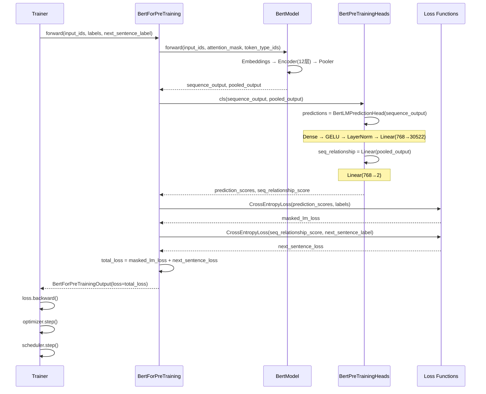

### Trainer 集成要点

1. **数据准备**：MLM 标签中，被掩码 token 的位置为真实 token ID，其余为 `-100`（忽略）
2. **NSP 标签**：`0` 表示句子 B 是句子 A 的续句，`1` 表示随机句子
3. **权重绑定**：MLM 头的 decoder 权重与 embedding 层共享，通过 `_tied_weights_keys` 声明

---

## 9. Pipeline 推理

`pipeline("text-classification", model="bert-base-uncased")` 的完整流程。

### Pipeline 时序图

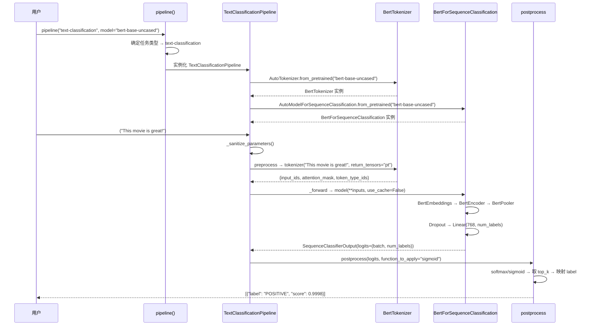

### 关键代码对应

**TextClassificationPipeline**（[text_classification.py:43](file:///workspace/src/transformers/pipelines/text_classification.py#L43)）的核心方法：

```python
# text_classification.py:154-157
def preprocess(self, inputs, **tokenizer_kwargs):
    return_tensors = "pt"
    return self.tokenizer(**inputs, return_tensors=return_tensors, **tokenizer_kwargs)

# text_classification.py:171-176
def _forward(self, model_inputs):
    model_forward = self.model.forward
    if "use_cache" in inspect.signature(model_forward).parameters:
        model_inputs["use_cache"] = False  # 分类任务不需要缓存
    return self.model(**model_inputs)
```

**BertForSequenceClassification**（[modeling_bert.py:1076-1153](file:///workspace/src/transformers/models/bert/modeling_bert.py#L1076)）的前向传播：

```python
# modeling_bert.py:1110-1153
def forward(self, input_ids, attention_mask=None, token_type_ids=None, labels=None, **kwargs):
    outputs = self.bert(input_ids, attention_mask=attention_mask, token_type_ids=token_type_ids, ...)
    pooled_output = outputs[1]  # [CLS] token 的池化输出
    pooled_output = self.dropout(pooled_output)
    logits = self.classifier(pooled_output)  # Linear(768, num_labels)

    loss = None
    if labels is not None:
        # 自动判断问题类型：回归 / 单标签分类 / 多标签分类
        if self.config.problem_type is None:
            if self.num_labels == 1:
                self.config.problem_type = "regression"
            elif self.num_labels > 1 and (labels.dtype == torch.long or labels.dtype == torch.int):
                self.config.problem_type = "single_label_classification"
            else:
                self.config.problem_type = "multi_label_classification"
        # 根据问题类型选择损失函数
        ...
```

---

## 10. 状态与生命周期总结

BERT 模型在 Transformers 框架中经历从定义到使用的完整生命周期。

### 状态机图

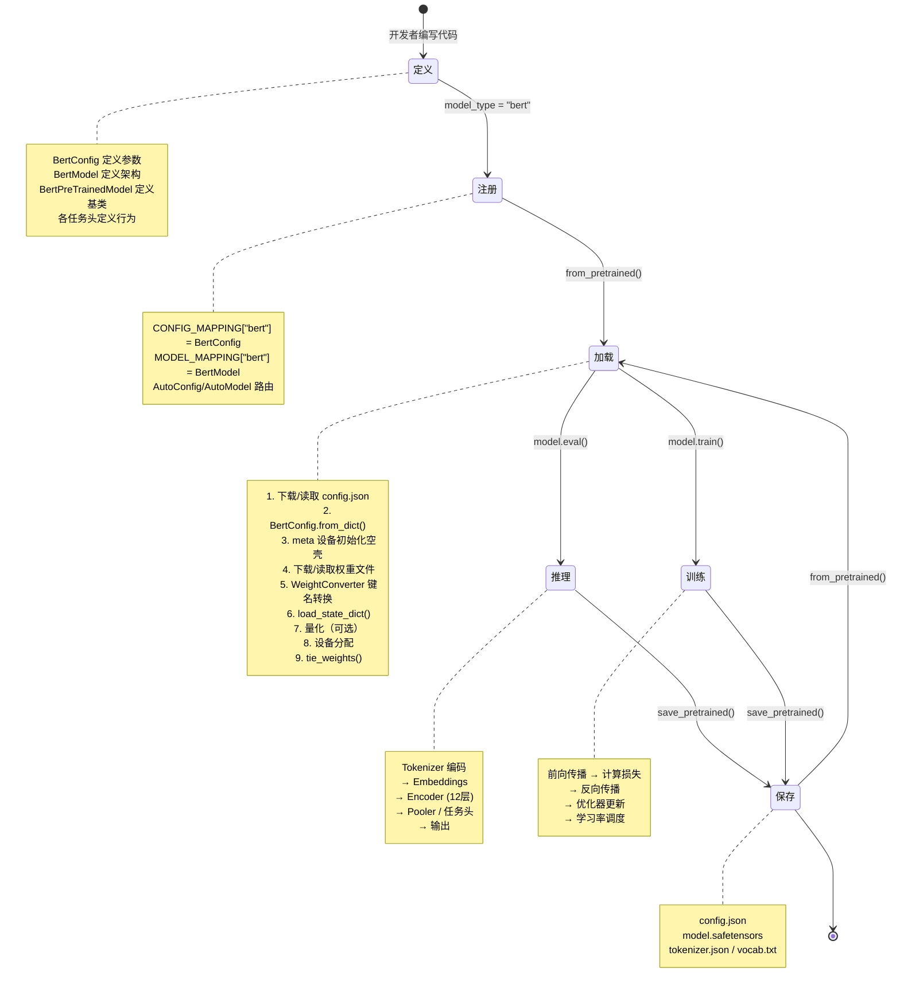

### 生命周期各阶段与源码映射

| 阶段 | 关键文件 | 关键函数/类 |
|------|---------|------------|
| **定义** | [configuration_bert.py](file:///workspace/src/transformers/models/bert/configuration_bert.py) | `BertConfig` @strict dataclass |
| | [modeling_bert.py](file:///workspace/src/transformers/models/bert/modeling_bert.py) | `BertModel`, `BertPreTrainedModel`, 各任务头 |
| | [tokenization_bert.py](file:///workspace/src/transformers/models/bert/tokenization_bert.py) | `BertTokenizer` |
| **注册** | [configuration_auto.py](file:///workspace/src/transformers/models/auto/configuration_auto.py) | `CONFIG_MAPPING`, `AutoConfig.register()` |
| | [__init__.py](file:///workspace/src/transformers/models/bert/__init__.py) | `_LazyModule` 延迟导入 |
| **加载** | [modeling_utils.py](file:///workspace/src/transformers/modeling_utils.py) | `PreTrainedModel.from_pretrained()` |
| | [configuration_utils.py](file:///workspace/src/transformers/configuration_utils.py) | `PreTrainedConfig.from_pretrained()` |
| **推理** | [masking_utils.py](file:///workspace/src/transformers/masking_utils.py) | `create_bidirectional_mask()` |
| | [modeling_utils.py](file:///workspace/src/transformers/modeling_utils.py) | `ALL_ATTENTION_FUNCTIONS.get_interface()` |
| **训练** | [modeling_bert.py](file:///workspace/src/transformers/models/bert/modeling_bert.py) | `BertForPreTraining.forward()`, `CrossEntropyLoss` |
| **缓存** | [cache_utils.py](file:///workspace/src/transformers/cache_utils.py) | `DynamicCache`, `EncoderDecoderCache` |
| **Pipeline** | [text_classification.py](file:///workspace/src/transformers/pipelines/text_classification.py) | `TextClassificationPipeline` |
| **保存** | [configuration_utils.py](file:///workspace/src/transformers/configuration_utils.py) | `PreTrainedConfig.save_pretrained()` |

### 模块协作全景

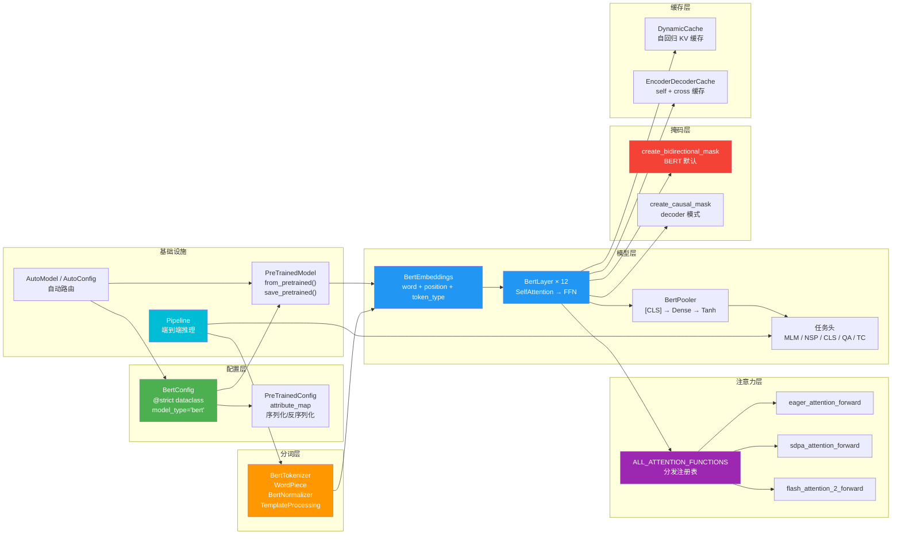

---

## 总结

BERT 在 Transformers 框架中的完整生命周期可以概括为：

1. **定义**：通过 `@strict` dataclass 定义 `BertConfig`，声明 `model_type = "bert"`；通过 `BertPreTrainedModel` → `BertModel` 定义模型架构
2. **注册**：`model_type` 自动注册到 `CONFIG_MAPPING` 和 `MODEL_MAPPING`，支持 `AutoConfig`/`AutoModel` 自动路由
3. **加载**：`from_pretrained()` 执行 Config 加载 → meta 设备初始化 → 权重下载/转换 → 量化（可选）→ 设备分配 → 权重绑定
4. **编码**：`BertTokenizer` 通过 BertNormalizer → BertPreTokenizer → WordPiece → TemplateProcessing 将文本转为 `input_ids` + `attention_mask` + `token_type_ids`
5. **前向传播**：Embeddings（三种嵌入求和）→ Encoder（12层 BertLayer，每层含 SelfAttention + FFN）→ Pooler → 任务头
6. **注意力**：通过 `ALL_ATTENTION_FUNCTIONS` 分发到 eager/SDPA/Flash Attention/Flex Attention 实现；BERT 默认使用 `create_bidirectional_mask` 双向掩码
7. **缓存**：BERT Encoder 不使用 KV Cache；作为 decoder 时使用 `EncoderDecoderCache`
8. **训练**：`BertForPreTraining` 同时计算 MLM 损失和 NSP 损失，简单相加作为总损失
9. **Pipeline**：`TextClassificationPipeline` 封装了 tokenize → forward → postprocess 的端到端流程
10. **保存**：`save_pretrained()` 将 config.json + model.safetensors + tokenizer 文件持久化到磁盘
