# GPT-2 案例详解：Decoder-only 自回归模型的完整生命周期

> 本文档以 GPT-2 模型为例，将 Transformers 框架的所有模块串联起来，重点展示 Decoder-only 自回归模型从配置加载、分词编码、前向传播、注意力机制、自回归生成到训练推理的完整生命周期。
>
> 源码文件：
> - [configuration_gpt2.py](src/transformers/models/gpt2/configuration_gpt2.py)
> - [modeling_gpt2.py](src/transformers/models/gpt2/modeling_gpt2.py)
> - [tokenization_gpt2.py](src/transformers/models/gpt2/tokenization_gpt2.py)
> - [\_\_init\_\_.py](src/transformers/models/gpt2/__init__.py)

---

## 1. GPT-2 在 Transformers 中的定位

GPT-2 是 OpenAI 于 2019 年发布的 Decoder-only 因果语言模型，采用**自回归生成**范式：每次只预测下一个 token，已生成的内容作为上下文参与后续预测。与 BERT 等 Encoder 模型不同，GPT-2 使用**因果掩码（Causal Mask）**确保每个位置只能看到自身及之前的 token。

GPT-2 的一个标志性设计是使用 `Conv1D` 线性层（而非标准 `nn.Linear`），这是 OpenAI 原始实现的遗留设计——权重矩阵的形状为 `(in_features, out_features)`，与 `nn.Linear` 的 `(out_features, in_features)` 互为转置。

### 架构定位图

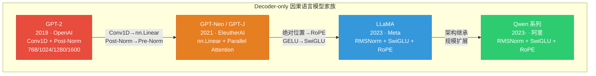

### 核心特征总结

| 特征 | GPT-2 | LLaMA（对比） |
|------|-------|--------------|
| 线性层 | `Conv1D`（权重转置） | `nn.Linear` |
| 归一化 | `LayerNorm` + Post-Norm | `RMSNorm` + Pre-Norm |
| 激活函数 | `gelu_new`（近似 GELU） | `silu`（SwiGLU） |
| 位置编码 | 可学习绝对位置 `wpe` | 旋转位置编码 RoPE |
| 注意力缩放 | `scale_attn_weights` + 可选层逆缩放 | 标准 `head_dim^-0.5` |
| 权重绑定 | `lm_head.weight ↔ wte.weight` | 同样绑定 |

---

## 2. Config 定义与特殊设计

`GPT2Config` 继承自 `PreTrainedConfig`，定义于 [configuration_gpt2.py](src/transformers/models/gpt2/configuration_gpt2.py)。它使用 `@strict` 装饰器（来自 `huggingface_hub`）确保数据类字段的严格类型检查，并通过 `attribute_map` 将 GPT-2 原始命名映射到 Transformers 统一命名。

### 关键参数解析

```python
# 源自 configuration_gpt2.py L78-L103
vocab_size: int = 50257              # 词表大小
n_positions: int = 1024              # 最大位置编码长度
n_embd: int = 768                    # 隐藏层维度
n_layer: int = 12                    # Transformer 层数
n_head: int = 12                     # 注意力头数
n_inner: int | None = None           # MLP 中间层维度，默认 4 * n_embd
activation_function: str = "gelu_new" # 近似 GELU 激活
scale_attn_weights: bool = True      # 是否缩放注意力权重（1/√d_k）
reorder_and_upcast_attn: bool = False # 混合精度下重排序并上溯注意力计算
add_cross_attention: bool = False    # 是否添加交叉注意力（用于编码器-解码器场景）
tie_word_embeddings: bool = True     # 权重绑定：lm_head ↔ wte
```

### Config 类图

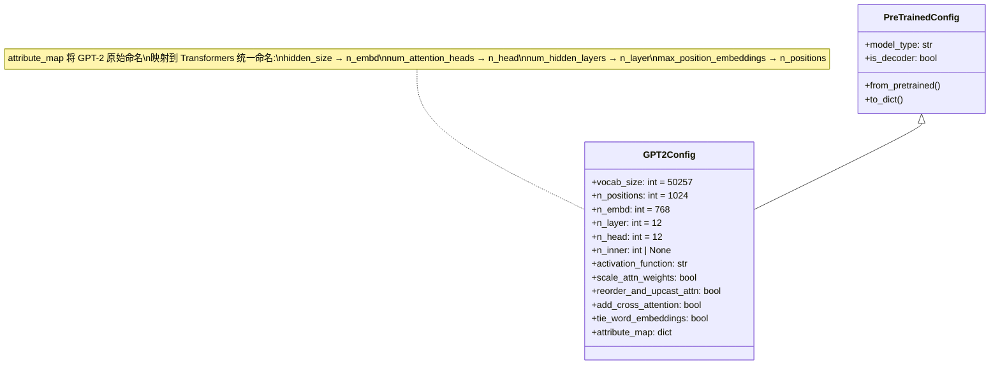

### Conv1D vs nn.Linear 对比图

```mermaid
graph LR
    subgraph "nn.Linear"
        direction TB
        L_in["输入 x<br/>(batch, seq, in_features)"]
        L_w["权重 W<br/>shape: (out_features, in_features)"]
        L_out["输出 y = xW^T + b<br/>(batch, seq, out_features)"]
        L_in --> L_out
        L_w -.-> L_out
    end

    subgraph "Conv1D（GPT-2 使用）"
        direction TB
        C_in["输入 x<br/>(batch, seq, nx)"]
        C_w["权重 W<br/>shape: (nx, nf) ← 转置！"]
        C_out["输出 y = xW + b<br/>(batch, seq, nf)"]
        C_in --> C_out
        C_w -.-> C_out
    end

    L_out ==|"数学等价<br/>xW^T ≡ x·W_transposed"| C_out

    style C_w fill:#e74c3c,color:#fff
    style L_w fill:#3498db,color:#fff
```

Conv1D 的核心差异（定义于 [pytorch_utils.py](src/transformers/pytorch_utils.py) L97-L123）：

```python
class Conv1D(nn.Module):
    def __init__(self, nf, nx):
        super().__init__()
        self.nf = nf
        self.nx = nx
        # 关键：权重形状为 (nx, nf)，即 (in_features, out_features)
        # 而 nn.Linear 的权重形状为 (out_features, in_features)
        self.weight = nn.Parameter(torch.empty(nx, nf))
        self.bias = nn.Parameter(torch.zeros(nf))
        nn.init.normal_(self.weight, std=0.02)

    def forward(self, x):
        size_out = x.size()[:-1] + (self.nf,)
        # torch.addmm(bias, input, weight) 计算 bias + input @ weight
        # 等价于 nn.Linear 的 F.linear(x, W.T, b) = x @ W.T + b
        x = torch.addmm(self.bias, x.view(-1, x.size(-1)), self.weight)
        x = x.view(size_out)
        return x
```

---

## 3. from_pretrained 完整时序

从 `GPT2LMHeadModel.from_pretrained('gpt2')` 到模型就绪，涉及多个关键步骤。

### 时序图

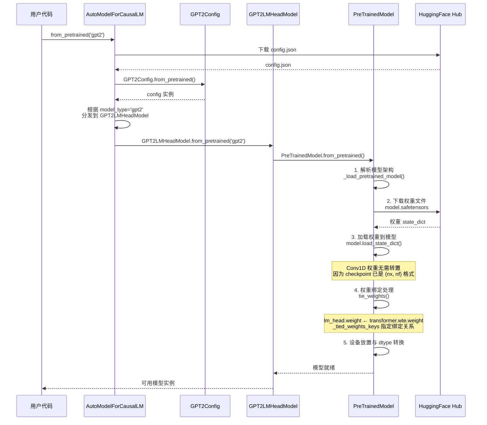

### 权重绑定机制

`GPT2LMHeadModel` 通过 `_tied_weights_keys` 声明权重绑定关系（[modeling_gpt2.py](src/transformers/models/gpt2/modeling_gpt2.py) L646）：

```python
class GPT2LMHeadModel(GPT2PreTrainedModel, GenerationMixin):
    _tied_weights_keys = {"lm_head.weight": "transformer.wte.weight"}

    def __init__(self, config):
        super().__init__(config)
        self.transformer = GPT2Model(config)
        # lm_head 使用 nn.Linear，权重形状 (vocab_size, n_embd)
        self.lm_head = nn.Linear(config.n_embd, config.vocab_size, bias=False)
        self.post_init()  # 在此触发 tie_weights()
```

绑定过程：`lm_head.weight`（形状 `(50257, 768)`）与 `transformer.wte.weight`（形状 `(50257, 768)`）共享同一存储，修改一个另一个同步变化。

### Conv1D 权重加载的特殊处理

由于 GPT-2 的 checkpoint 中 Conv1D 权重已经以 `(nx, nf)` 格式存储，加载时无需额外转置。但需注意：
- `c_attn.weight`：形状 `(768, 2304)`，一次投影出 Q/K/V
- `c_proj.weight`：形状 `(768, 768)`，注意力输出投影
- `c_fc.weight`：形状 `(768, 3072)`，MLP 上投影
- `c_proj.weight`（MLP）：形状 `(3072, 768)`，MLP 下投影

---

## 4. Tokenizer 编码流程

`GPT2Tokenizer` 定义于 [tokenization_gpt2.py](src/transformers/models/gpt2/tokenization_gpt2.py)，继承自 `TokenizersBackend`，使用 **Byte-Level BPE** 分词算法。

### 核心设计特点

1. **ByteLevel 预处理**：将所有字符先转为 UTF-8 字节，再映射到 Unicode 字符，确保任何文本都可编码（无 `<unk>` 问题）
2. **无 [CLS]/[SEP]**：GPT-2 没有 BERT 风格的特殊分隔 token，只有 `<|endoftext|>` 作为 BOS/EOS
3. **空格敏感**：词首有无空格会产生不同 token（如 `"Hello"` vs `" Hello"`）

```python
# 源自 tokenization_gpt2.py L94-L129
class GPT2Tokenizer(TokenizersBackend):
    vocab_files_names = VOCAB_FILES_NAMES  # {"vocab_file": "vocab.json", "merges_file": "merges.txt"}
    model_input_names = ["input_ids", "attention_mask"]
    model = BPE  # 使用 BPE 模型

    def __init__(self, vocab, merges, errors="replace",
                 unk_token="<|endoftext|>", bos_token="<|endoftext|>",
                 eos_token="<|endoftext|>", pad_token=None,
                 add_prefix_space=False, **kwargs):
        self.add_prefix_space = add_prefix_space
        self._vocab = vocab if vocab is not None else {}
        self._merges = merges or []
        # 构建 tokenizers 库的 BPE 模型
        self._tokenizer = Tokenizer(BPE(
            vocab=self._vocab, merges=self._merges,
            dropout=None, continuing_subword_prefix="",
            end_of_word_suffix="", fuse_unk=False,
        ))
        # ByteLevel 预分词器：将文本转为字节级表示
        self._tokenizer.pre_tokenizer = pre_tokenizers.ByteLevel(
            add_prefix_space=add_prefix_space
        )
        # ByteLevel 解码器：将字节级表示还原为文本
        self._tokenizer.decoder = decoders.ByteLevel()
```

### 编码流程图

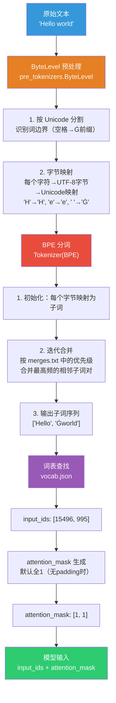

### 空格敏感性示例

```python
tokenizer = GPT2Tokenizer.from_pretrained("openai-community/gpt2")
tokenizer("Hello world")["input_ids"]     # [15496, 995]    → "Hello" + "Ġworld"
tokenizer(" Hello world")["input_ids"]    # [18435, 995]    → "ĠHello" + "Ġworld"
# 注意："Hello" 和 " Hello" 编码为不同的 token！
```

---

## 5. 模型前向传播全链路

从 `input_ids` 到 `logits` 的完整数据流，定义于 [modeling_gpt2.py](src/transformers/models/gpt2/modeling_gpt2.py) 的 `GPT2LMHeadModel.forward()` 和 `GPT2Model.forward()`。

### 数据流图

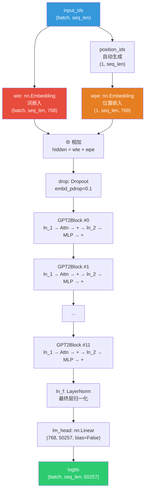

### 单层 GPT2Block 内部结构图

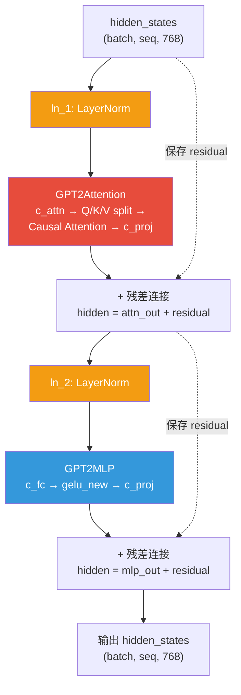

对应源码（[modeling_gpt2.py](src/transformers/models/gpt2/modeling_gpt2.py) L262-L309）：

```python
class GPT2Block(GradientCheckpointingLayer):
    def forward(self, hidden_states, past_key_values=None,
                attention_mask=None, ...):
        # Post-Norm：先归一化，再注意力，再残差
        residual = hidden_states
        hidden_states = self.ln_1(hidden_states)
        attn_output, _ = self.attn(hidden_states, ...)
        hidden_states = attn_output + residual  # 第一个残差连接

        # Post-Norm：先归一化，再MLP，再残差
        residual = hidden_states
        hidden_states = self.ln_2(hidden_states)
        feed_forward_hidden_states = self.mlp(hidden_states)
        hidden_states = residual + feed_forward_hidden_states  # 第二个残差连接

        return hidden_states
```

### Post-Norm 架构对比图

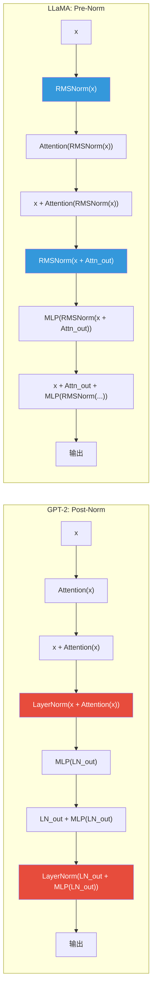

> **Post-Norm vs Pre-Norm**：GPT-2 采用 Post-Norm（归一化在残差之后），训练时梯度可能不稳定；LLaMA 采用 Pre-Norm（归一化在子层之前），训练更稳定，是现代 LLM 的主流选择。

---

## 6. 注意力系统运作

`GPT2Attention` 定义于 [modeling_gpt2.py](src/transformers/models/gpt2/modeling_gpt2.py) L75-L226，是 GPT-2 的核心计算模块。

### 注意力前向流程图

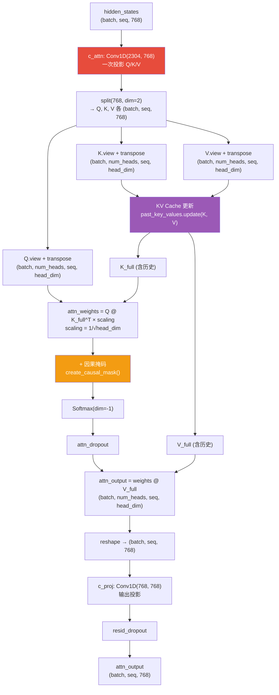

### 因果掩码生成图

因果掩码由 [masking_utils.py](src/transformers/masking_utils.py) 中的 `create_causal_mask()` 生成，确保每个位置只能关注自身及之前的 token：

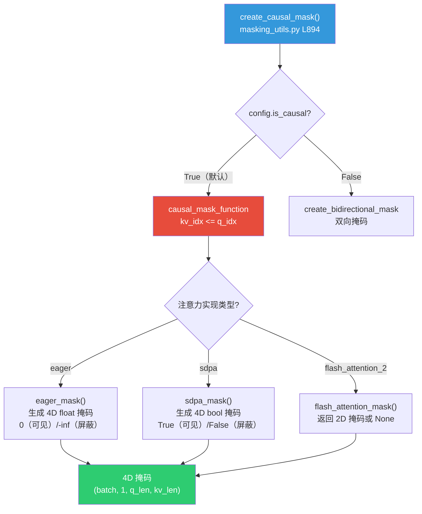

因果掩码矩阵示意（5×5）：

```
位置  0  1  2  3  4
 0 [ ■  ⬚  ⬚  ⬚  ⬚ ]    ■ = 可见（0）
 1 [ ■  ■  ⬚  ⬚  ⬚ ]    ⬚ = 屏蔽（-inf）
 2 [ ■  ■  ■  ⬚  ⬚ ]
 3 [ ■  ■  ■  ■  ⬚ ]
 4 [ ■  ■  ■  ■  ■ ]
```

### KV Cache 增量更新时序图

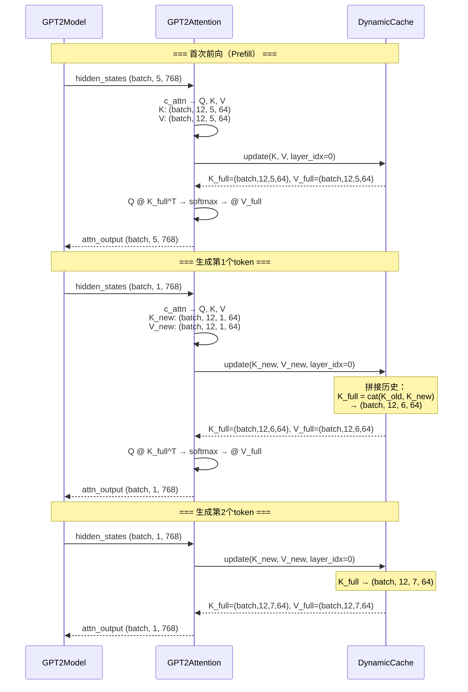

KV Cache 的关键源码（[modeling_gpt2.py](src/transformers/models/gpt2/modeling_gpt2.py) L193-L199）：

```python
# 在 GPT2Attention.forward() 中
if (past_key_values is not None and not is_cross_attention) or (
    past_key_values is not None and is_cross_attention and not is_updated
):
    # 将新的 K/V 与缓存中的历史 K/V 拼接
    key_states, value_states = curr_past_key_values.update(
        key_states, value_states, self.layer_idx
    )
```

---

## 7. generate() 生成全流程

`GPT2LMHeadModel` 继承了 `GenerationMixin`（[modeling_gpt2.py](src/transformers/models/gpt2/modeling_gpt2.py) L645），其 `generate()` 方法定义于 [generation/utils.py](src/transformers/generation/utils.py)。

### 生成循环时序图

```mermaid
sequenceDiagram
    participant User as 用户代码
    participant Gen as GenerationMixin.generate()
    participant Prep as 准备阶段
    participant Loop as 生成循环
    participant Model as GPT2LMHeadModel.forward()
    participant Sample as 采样策略
    participant Cache as KV Cache
    participant Stream as Streamer（可选）

    User->>Gen: generate(input_ids, max_new_tokens=50)
    Gen->>Prep: 1. 准备生成配置<br/>GenerationConfig 合并
    Prep->>Prep: 2. 准备 KV Cache<br/>DynamicCache()
    Prep->>Prep: 3. 准备注意力掩码<br/>create_causal_mask()

    Note over Loop,Cache: === Prefill 阶段 ===
    Prep->>Model: 首次前向（全部 input_ids）
    Model-->>Loop: logits (batch, seq_len, vocab_size)<br/>past_key_values（已缓存）

    Note over Loop,Cache: === Decode 循环 ===
    loop 每个生成步骤
        Loop->>Loop: 提取最后一个 token 的 logits<br/>logits[:, -1, :]
        Loop->>Sample: Logits 处理
        Note over Sample: 1. Repetition Penalty<br/>2. Temperature 缩放<br/>3. Top-K 过滤<br/>4. Top-P (Nucleus) 过滤
        Sample->>Sample: 采样/贪心选择<br/>next_token
        Loop->>Cache: KV Cache 已在 forward 中更新
        Loop->>Loop: 停止条件检查
        Note over Loop: • EOS token？<br/>• max_new_tokens 达到？<br/>• 停止词匹配？
        Loop->>Stream: streamer.put(next_token)<br/>（流式输出，可选）
        alt 未停止
            Loop->>Model: 下一步前向<br/>input_ids=next_token<br/>past_key_values=cache
            Model-->>Loop: logits (batch, 1, vocab_size)
        else 停止
            Loop-->>Gen: 生成序列
        end
    end

    Gen-->>User: generated_ids (batch, total_len)
```

### 辅助解码流程图（Speculative Decoding）

当使用辅助模型进行推测解码时，流程如下：

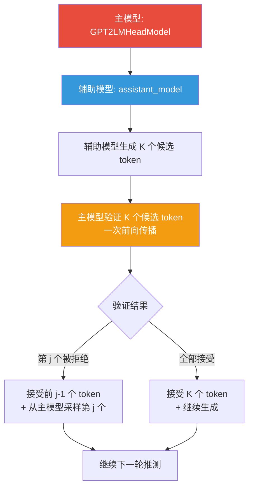

---

## 8. 训练流程

### 训练循环时序图

```mermaid
sequenceDiagram
    participant Data as 数据加载器
    participant Tok as GPT2Tokenizer
    participant Model as GPT2LMHeadModel
    participant Loss as Loss Function
    participant Opt as Optimizer

    Data->>Tok: 原始文本 batch
    Tok-->>Model: input_ids, attention_mask

    Note over Model: === 前向传播 ===
    Model->>Model: GPT2Model.forward()<br/>wte + wpe → Blocks → ln_f
    Model->>Model: lm_head(hidden_states)<br/>→ logits (batch, seq, 50257)

    Note over Model,Loss: === 损失计算 ===
    Model->>Loss: logits + labels
    Note over Loss: labels = input_ids（自回归标签）<br/>内部自动 shift：<br/>shift_logits = logits[:, :-1, :]<br/>shift_labels = labels[:, 1:]
    Loss->>Loss: CrossEntropyLoss<br/>shift_logits vs shift_labels
    Loss-->>Opt: loss 标量

    Note over Opt: === 反向传播 ===
    Opt->>Model: loss.backward()
    Note over Model: 梯度回传<br/>通过 lm_head → wte<br/>（权重绑定：梯度自动累加）
    Opt->>Opt: optimizer.step()
    Opt->>Model: 更新参数
```

### 权重绑定梯度流图

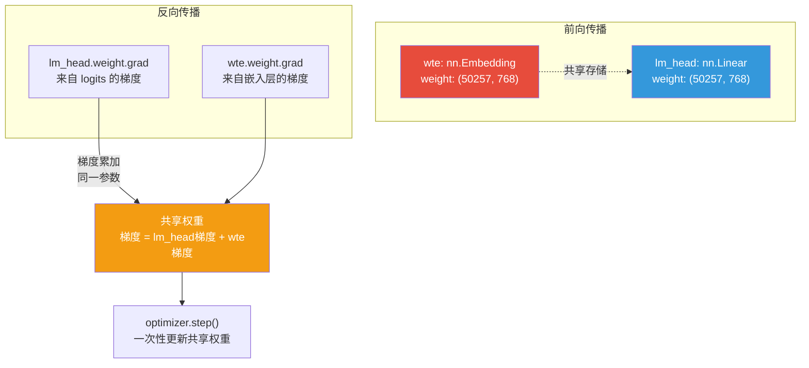

损失计算的关键源码（[modeling_gpt2.py](src/transformers/models/gpt2/modeling_gpt2.py) L708-L716）：

```python
# GPT2LMHeadModel.forward()
loss = None
if labels is not None:
    # labels 自动 shift：logits 取前 n-1 位，labels 取后 n-1 位
    # 即：用位置 i 的输出预测位置 i+1 的 token
    loss = self.loss_function(
        logits,
        labels,
        vocab_size=self.config.vocab_size,
        **kwargs,
    )
```

### GPT-2 特殊的残差缩放初始化

GPT-2 采用了特殊的残差路径初始化策略（[modeling_gpt2.py](src/transformers/models/gpt2/modeling_gpt2.py) L448-L458）：

```python
# GPT2PreTrainedModel._init_weights()
if isinstance(module, PreTrainedModel):
    for name, p in module.named_parameters():
        if name == "c_proj.weight":
            # 残差投影层的权重缩小 1/√(2N)
            # N 为残差层数，2 是因为每个 Block 有 2 个残差连接
            init.normal_(p, mean=0.0,
                std=self.config.initializer_range / math.sqrt(2 * self.config.n_layer))
```

这一策略来自 GPT-2 论文：随着模型深度增加，残差路径上的方差会累积，通过缩小残差层权重来抵消这种累积效应。

---

## 9. Pipeline 推理

`pipeline("text-generation", model="gpt2")` 使用 `TextGenerationPipeline`（[text_generation.py](src/transformers/pipelines/text_generation.py)），封装了分词、生成、后处理的完整流程。

### Pipeline 时序图

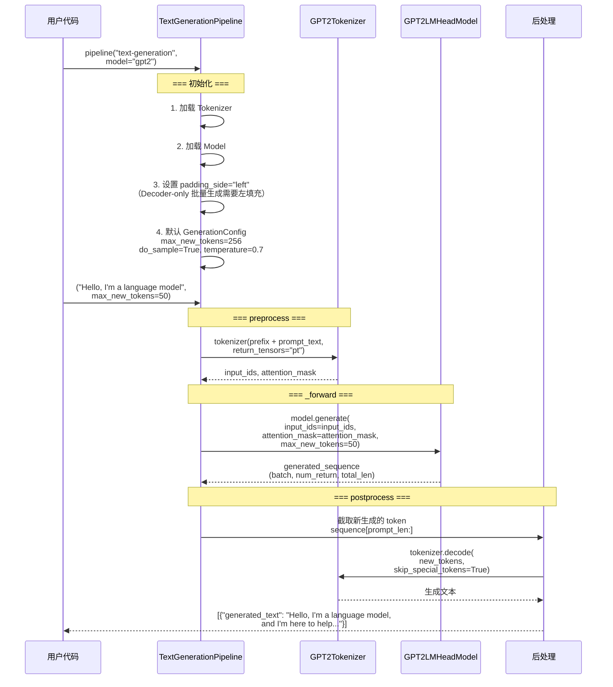

Pipeline 的关键初始化逻辑（[text_generation.py](src/transformers/pipelines/text_generation.py) L99-L106）：

```python
class TextGenerationPipeline(Pipeline):
    def __init__(self, *args, **kwargs):
        super().__init__(*args, **kwargs)
        self.check_model_type(MODEL_FOR_CAUSAL_LM_MAPPING_NAMES)
        # Decoder-only 模型需要左填充以确保批量生成正确
        if self.tokenizer is not None and self.tokenizer.padding_side == "right":
            self.tokenizer.padding_side = "left"
```

Pipeline 默认生成配置（[text_generation.py](src/transformers/pipelines/text_generation.py) L93-L97）：

```python
_default_generation_config = GenerationConfig(
    max_new_tokens=256,
    do_sample=True,       # 自由文本生成通常使用采样
    temperature=0.7,
)
```

---

## 10. 状态与生命周期总结

GPT-2 模型在 Transformers 中的完整生命周期，从配置创建到推理输出，经历以下状态转换：

### 状态机图

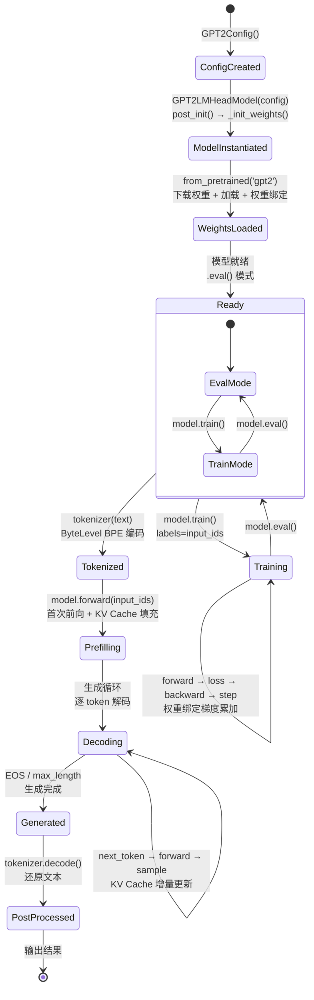

### 生命周期关键节点总结

| 阶段 | 关键函数/类 | 源码位置 |
|------|------------|---------|
| 配置创建 | `GPT2Config` | [configuration_gpt2.py](src/transformers/models/gpt2/configuration_gpt2.py) L25 |
| 模型实例化 | `GPT2LMHeadModel.__init__` | [modeling_gpt2.py](src/transformers/models/gpt2/modeling_gpt2.py) L648 |
| 权重初始化 | `GPT2PreTrainedModel._init_weights` | [modeling_gpt2.py](src/transformers/models/gpt2/modeling_gpt2.py) L433 |
| 预训练加载 | `PreTrainedModel.from_pretrained` | [modeling_utils.py](src/transformers/modeling_utils.py) |
| 权重绑定 | `_tied_weights_keys` + `tie_weights()` | [modeling_gpt2.py](src/transformers/models/gpt2/modeling_gpt2.py) L646 |
| 分词编码 | `GPT2Tokenizer.__call__` | [tokenization_gpt2.py](src/transformers/models/gpt2/tokenization_gpt2.py) L94 |
| 前向传播 | `GPT2Model.forward` | [modeling_gpt2.py](src/transformers/models/gpt2/modeling_gpt2.py) L522 |
| 注意力计算 | `GPT2Attention.forward` | [modeling_gpt2.py](src/transformers/models/gpt2/modeling_gpt2.py) L144 |
| 因果掩码 | `create_causal_mask` | [masking_utils.py](src/transformers/masking_utils.py) L894 |
| KV Cache | `DynamicCache.update` | [cache_utils.py](src/transformers/cache_utils.py) L1229 |
| 自回归生成 | `GenerationMixin.generate` | [generation/utils.py](src/transformers/generation/utils.py) L339 |
| 损失计算 | `GPT2LMHeadModel.loss_function` | [modeling_gpt2.py](src/transformers/models/gpt2/modeling_gpt2.py) L711 |
| Pipeline | `TextGenerationPipeline` | [text_generation.py](src/transformers/pipelines/text_generation.py) L23 |
| Conv1D 线性层 | `Conv1D` | [pytorch_utils.py](src/transformers/pytorch_utils.py) L97 |

### 模型家族一览

GPT-2 在 Transformers 中提供了多种任务头：

| 类名 | 任务 | 头部 |
|------|------|------|
| `GPT2Model` | 基础模型（提取隐藏状态） | 无 |
| `GPT2LMHeadModel` | 因果语言建模 | `lm_head` (Linear, 权重绑定) |
| `GPT2DoubleHeadsModel` | 语言建模 + 多项选择 | `lm_head` + `multiple_choice_head` |
| `GPT2ForSequenceClassification` | 序列分类 | `score` (Linear) |
| `GPT2ForTokenClassification` | Token 分类 | `classifier` (Linear) |
| `GPT2ForQuestionAnswering` | 问答 | `qa_outputs` (Linear → 2) |

---

> **总结**：GPT-2 作为 Decoder-only 因果语言模型的开山之作，其设计深刻影响了后续所有 LLM。从 Conv1D 到 nn.Linear、从 Post-Norm 到 Pre-Norm、从绝对位置编码到 RoPE，每一代演进都在 GPT-2 的基础上优化。理解 GPT-2 的完整生命周期，就是理解现代大语言模型的基石。
