# Qwen3.5-MoE 系列详解：混合专家 + 线性注意力 + 多模态的完整生命周期

> 本文档以 Qwen3.5-MoE 模型为例，将 Transformers 框架的所有模块串联起来，深度剖析最前沿的 **混合专家 + 多模态 + 线性注意力** 模型在 Transformers 中的完整生命周期。
>
> 源码文件：
> - [configuration_qwen3_5_moe.py](file:///workspace/src/transformers/models/qwen3_5_moe/configuration_qwen3_5_moe.py)
> - [modeling_qwen3_5_moe.py](file:///workspace/src/transformers/models/qwen3_5_moe/modeling_qwen3_5_moe.py)
> - [modular_qwen3_5_moe.py](file:///workspace/src/transformers/models/qwen3_5_moe/modular_qwen3_5_moe.py)

---

## 1. Qwen3.5-MoE 在 Transformers 中的定位

Qwen3.5-MoE 是 Qwen 系列中最前沿的混合架构模型，它同时融合了三大创新：**混合注意力层**（full_attention + linear_attention 交替）、**MoE 专家路由**（256 专家 Top-8 路由 + 共享专家）和**多模态视觉编码器**（Vision Transformer + PatchMerger）。

### 1.1 架构定位图

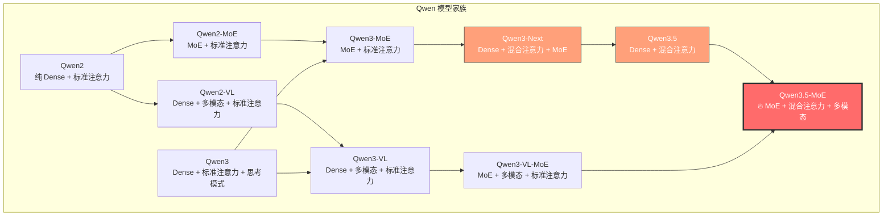
```mermaid
graph TB
    subgraph "Qwen 模型家族"
        Qwen2["Qwen2<br/>纯 Dense + 标准注意力"]
        Qwen2VL["Qwen2-VL<br/>Dense + 多模态 + 标准注意力"]
        Qwen2Moe["Qwen2-MoE<br/>MoE + 标准注意力"]
        Qwen3["Qwen3<br/>Dense + 标准注意力 + 思考模式"]
        Qwen3VL["Qwen3-VL<br/>Dense + 多模态 + 标准注意力"]
        Qwen3Moe["Qwen3-MoE<br/>MoE + 标准注意力"]
        Qwen3VLMoe["Qwen3-VL-MoE<br/>MoE + 多模态 + 标准注意力"]
        Qwen3Next["Qwen3-Next<br/>Dense + 混合注意力 + MoE"]
        Qwen35["Qwen3.5<br/>Dense + 混合注意力"]
        Qwen35Moe["Qwen3.5-MoE<br/>🔥 MoE + 混合注意力 + 多模态"]
    end

    Qwen2 --> Qwen2VL
    Qwen2 --> Qwen2Moe
    Qwen2VL --> Qwen3VL
    Qwen2Moe --> Qwen3Moe
    Qwen3 --> Qwen3VL
    Qwen3 --> Qwen3Moe
    Qwen3VL --> Qwen3VLMoe
    Qwen3Moe --> Qwen3Next
    Qwen3Next --> Qwen35
    Qwen35 --> Qwen35Moe
    Qwen3VLMoe --> Qwen35Moe

    style Qwen35Moe fill:#ff6b6b,stroke:#333,color:#fff,stroke-width:3px
    style Qwen35 fill:#ffa07a,stroke:#333,color:#fff
    style Qwen3Next fill:#ffa07a,stroke:#333,color:#fff
```

### 1.2 三大创新点图示

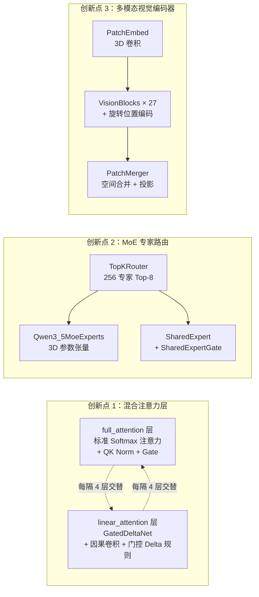
```mermaid
graph LR
    subgraph "创新点 1：混合注意力层"
        FA["full_attention 层<br/>标准 Softmax 注意力<br/>+ QK Norm + Gate"]
        LA["linear_attention 层<br/>GatedDeltaNet<br/>+ 因果卷积 + 门控 Delta 规则"]
        FA -.->|"每隔 4 层交替"| LA
        LA -.->|"每隔 4 层交替"| FA
    end

    subgraph "创新点 2：MoE 专家路由"
        Router["TopKRouter<br/>256 专家 Top-8"]
        Experts["Qwen3_5MoeExperts<br/>3D 参数张量"]
        Shared["SharedExpert<br/>+ SharedExpertGate"]
        Router --> Experts
        Router --> Shared
    end

    subgraph "创新点 3：多模态视觉编码器"
        Patch["PatchEmbed<br/>3D 卷积"]
        VBlock["VisionBlocks × 27<br/>+ 旋转位置编码"]
        Merge["PatchMerger<br/>空间合并 + 投影"]
        Patch --> VBlock --> Merge
    end
```

### 1.3 继承关系

从 [modular_qwen3_5_moe.py](file:///workspace/src/transformers/models/qwen3_5_moe/modular_qwen3_5_moe.py) 可以看出，Qwen3.5-MoE 的类继承链非常清晰：

| Qwen3.5-MoE 类 | 直接父类 | 来源模块 |
|---|---|---|
| `Qwen3_5MoeTextConfig` | `Qwen3NextConfig` | qwen3_next |
| `Qwen3_5MoeVisionConfig` | `Qwen3_5VisionConfig` | qwen3_5 |
| `Qwen3_5MoeConfig` | `Qwen3VLConfig` | qwen3_vl |
| `Qwen3_5MoeGatedDeltaNet` | `Qwen3_5GatedDeltaNet` | qwen3_5 |
| `Qwen3_5MoeAttention` | `Qwen3NextAttention` | qwen3_next |
| `Qwen3_5MoeExperts` | `Qwen3NextExperts` | qwen3_next |
| `Qwen3_5MoeTopKRouter` | `Qwen3VLMoeTextTopKRouter` | qwen3_vl_moe |
| `Qwen3_5MoeSparseMoeBlock` | `Qwen3NextSparseMoeBlock` | qwen3_next |
| `Qwen3_5MoeForConditionalGeneration` | `Qwen3VLMoeForConditionalGeneration` | qwen3_vl_moe |

---

## 2. Config 三层嵌套设计

Qwen3.5-MoE 采用三层 Config 嵌套设计，顶层 `Qwen3_5MoeConfig` 包含 `text_config` 和 `vision_config` 两个子配置。

### 2.1 Config 嵌套类图

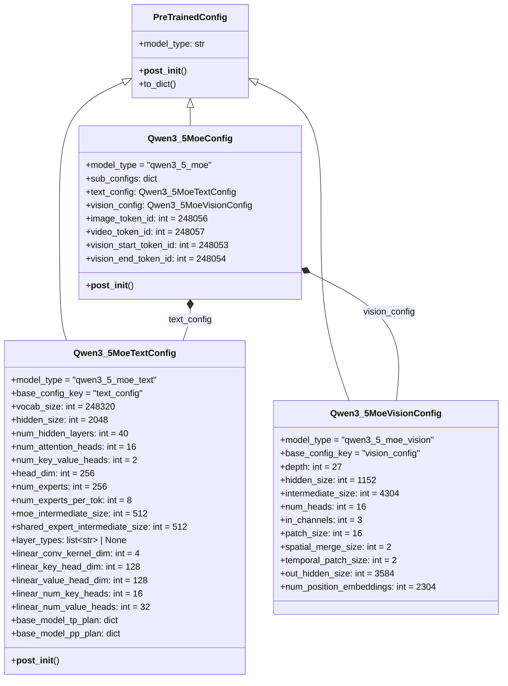
```mermaid
classDiagram
    class PreTrainedConfig {
        +model_type: str
        +__post_init__()
        +to_dict()
    }

    class Qwen3_5MoeTextConfig {
        +model_type = "qwen3_5_moe_text"
        +base_config_key = "text_config"
        +vocab_size: int = 248320
        +hidden_size: int = 2048
        +num_hidden_layers: int = 40
        +num_attention_heads: int = 16
        +num_key_value_heads: int = 2
        +head_dim: int = 256
        +num_experts: int = 256
        +num_experts_per_tok: int = 8
        +moe_intermediate_size: int = 512
        +shared_expert_intermediate_size: int = 512
        +layer_types: list~str~ | None
        +linear_conv_kernel_dim: int = 4
        +linear_key_head_dim: int = 128
        +linear_value_head_dim: int = 128
        +linear_num_key_heads: int = 16
        +linear_num_value_heads: int = 32
        +base_model_tp_plan: dict
        +base_model_pp_plan: dict
        +__post_init__()
    }

    class Qwen3_5MoeVisionConfig {
        +model_type = "qwen3_5_moe_vision"
        +base_config_key = "vision_config"
        +depth: int = 27
        +hidden_size: int = 1152
        +intermediate_size: int = 4304
        +num_heads: int = 16
        +in_channels: int = 3
        +patch_size: int = 16
        +spatial_merge_size: int = 2
        +temporal_patch_size: int = 2
        +out_hidden_size: int = 3584
        +num_position_embeddings: int = 2304
    }

    class Qwen3_5MoeConfig {
        +model_type = "qwen3_5_moe"
        +sub_configs: dict
        +text_config: Qwen3_5MoeTextConfig
        +vision_config: Qwen3_5MoeVisionConfig
        +image_token_id: int = 248056
        +video_token_id: int = 248057
        +vision_start_token_id: int = 248053
        +vision_end_token_id: int = 248054
        +__post_init__()
    }

    PreTrainedConfig <|-- Qwen3_5MoeTextConfig
    PreTrainedConfig <|-- Qwen3_5MoeVisionConfig
    PreTrainedConfig <|-- Qwen3_5MoeConfig
    Qwen3_5MoeConfig *-- Qwen3_5MoeTextConfig : text_config
    Qwen3_5MoeConfig *-- Qwen3_5MoeVisionConfig : vision_config
```

### 2.2 sub_configs 机制图

`sub_configs` 是 Transformers 中多模态模型的标准机制，定义在 [configuration_qwen3_5_moe.py:171](file:///workspace/src/transformers/models/qwen3_5_moe/configuration_qwen3_5_moe.py#L171)：

```python
class Qwen3_5MoeConfig(PreTrainedConfig):
    sub_configs = {"vision_config": Qwen3_5MoeVisionConfig, "text_config": Qwen3_5MoeTextConfig}
```

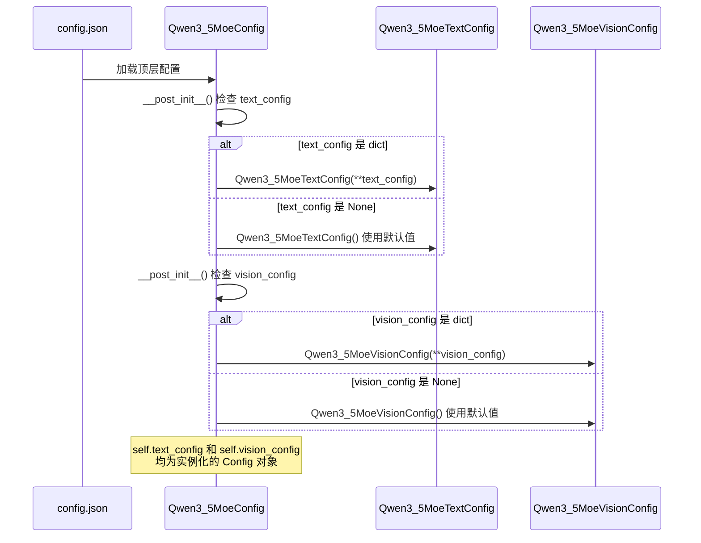
```mermaid
sequenceDiagram
    participant JSON as config.json
    participant Top as Qwen3_5MoeConfig
    participant Text as Qwen3_5MoeTextConfig
    participant Vision as Qwen3_5MoeVisionConfig

    JSON->>Top: 加载顶层配置
    Top->>Top: __post_init__() 检查 text_config
    alt text_config 是 dict
        Top->>Text: Qwen3_5MoeTextConfig(**text_config)
    else text_config 是 None
        Top->>Text: Qwen3_5MoeTextConfig() 使用默认值
    end
    Top->>Top: __post_init__() 检查 vision_config
    alt vision_config 是 dict
        Top->>Vision: Qwen3_5MoeVisionConfig(**vision_config)
    else vision_config 是 None
        Top->>Vision: Qwen3_5MoeVisionConfig() 使用默认值
    end
    Note over Top: self.text_config 和 self.vision_config<br/>均为实例化的 Config 对象
```

关键代码在 [configuration_qwen3_5_moe.py:183-194](file:///workspace/src/transformers/models/qwen3_5_moe/configuration_qwen3_5_moe.py#L183)：

```python
def __post_init__(self, **kwargs):
    if isinstance(self.vision_config, dict):
        self.vision_config = self.sub_configs["vision_config"](**self.vision_config)
    elif self.vision_config is None:
        self.vision_config = self.sub_configs["vision_config"]()

    if isinstance(self.text_config, dict):
        self.text_config = self.sub_configs["text_config"](**self.text_config)
    elif self.text_config is None:
        self.text_config = self.sub_configs["text_config"]()

    super().__post_init__(**kwargs)
```

### 2.3 base_model_tp_plan / base_model_pp_plan 并行策略声明图

`Qwen3_5MoeTextConfig` 在 [configuration_qwen3_5_moe.py:59-77](file:///workspace/src/transformers/models/qwen3_5_moe/configuration_qwen3_5_moe.py#L59) 声明了张量并行（TP）和流水线并行（PP）策略：

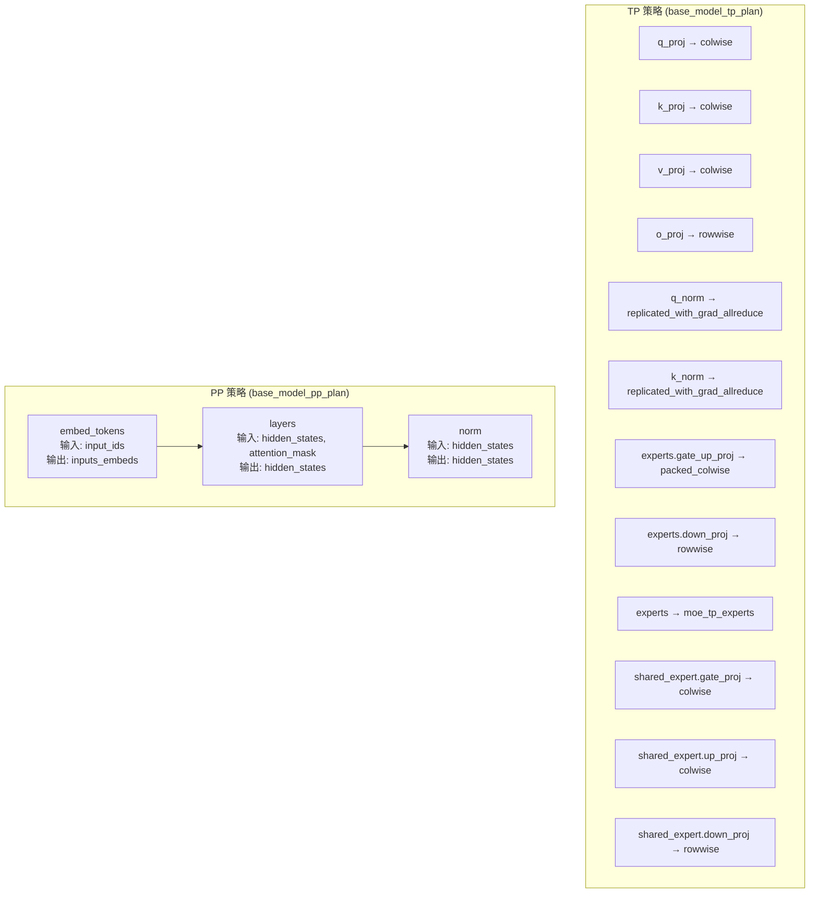
```mermaid
graph TB
    subgraph "TP 策略 (base_model_tp_plan)"
        Q["q_proj → colwise"]
        K["k_proj → colwise"]
        V["v_proj → colwise"]
        O["o_proj → rowwise"]
        QN["q_norm → replicated_with_grad_allreduce"]
        KN["k_norm → replicated_with_grad_allreduce"]
        EGU["experts.gate_up_proj → packed_colwise"]
        ED["experts.down_proj → rowwise"]
        EE["experts → moe_tp_experts"]
        SG["shared_expert.gate_proj → colwise"]
        SU["shared_expert.up_proj → colwise"]
        SD["shared_expert.down_proj → rowwise"]
    end

    subgraph "PP 策略 (base_model_pp_plan)"
        EMB["embed_tokens<br/>输入: input_ids<br/>输出: inputs_embeds"]
        LAY["layers<br/>输入: hidden_states, attention_mask<br/>输出: hidden_states"]
        NRM["norm<br/>输入: hidden_states<br/>输出: hidden_states"]
        EMB --> LAY --> NRM
    end
```

---

## 3. from_pretrained 完整时序

从 `Qwen3_5MoeForConditionalGeneration.from_pretrained('Qwen/Qwen3.5-35B-A3B')` 到模型就绪的完整流程。

### 3.1 时序图

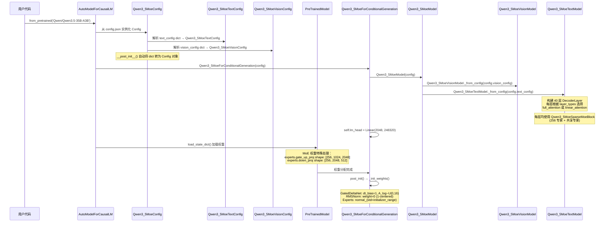
```mermaid
sequenceDiagram
    participant User as 用户代码
    participant Auto as AutoModelForCausalLM
    participant CFG as Qwen3_5MoeConfig
    participant TCFG as Qwen3_5MoeTextConfig
    participant VCFG as Qwen3_5MoeVisionConfig
    participant PTM as PreTrainedModel
    participant Model as Qwen3_5MoeForConditionalGeneration
    participant QModel as Qwen3_5MoeModel
    participant Vision as Qwen3_5MoeVisionModel
    participant Text as Qwen3_5MoeTextModel

    User->>Auto: from_pretrained('Qwen/Qwen3.5-35B-A3B')
    Auto->>CFG: 从 config.json 实例化 Config
    CFG->>TCFG: 解析 text_config dict → Qwen3_5MoeTextConfig
    CFG->>VCFG: 解析 vision_config dict → Qwen3_5MoeVisionConfig
    Note over CFG: __post_init__() 自动将 dict 转为 Config 对象

    Auto->>Model: Qwen3_5MoeForConditionalGeneration(config)
    Model->>QModel: Qwen3_5MoeModel(config)
    QModel->>Vision: Qwen3_5MoeVisionModel._from_config(config.vision_config)
    QModel->>Text: Qwen3_5MoeTextModel._from_config(config.text_config)
    Note over Text: 构建 40 层 DecoderLayer<br/>每层根据 layer_types 选择<br/>full_attention 或 linear_attention
    Note over Text: 每层均使用 Qwen3_5MoeSparseMoeBlock<br/>(256 专家 + 共享专家)
    Model->>Model: self.lm_head = Linear(2048, 248320)

    Auto->>PTM: load_state_dict() 加载权重
    Note over PTM: MoE 权重特殊处理：<br/>experts.gate_up_proj shape: [256, 1024, 2048]<br/>experts.down_proj shape: [256, 2048, 512]
    PTM->>Model: 权重分配完成
    Model->>Model: post_init() → _init_weights()
    Note over Model: GatedDeltaNet: dt_bias=1, A_log~U(0,16)<br/>RMSNorm: weight=0 (1-centered)<br/>Experts: normal_(std=initializer_range)
```

### 3.2 MoE 权重加载特殊处理

Qwen3.5-MoE 的专家权重以 3D 张量存储，这是 MoE 模型与 Dense 模型的关键区别。在 [modeling_qwen3_5_moe.py:736-772](file:///workspace/src/transformers/models/qwen3_5_moe/modeling_qwen3_5_moe.py#L736) 中：

```python
@use_experts_implementation
class Qwen3_5MoeExperts(nn.Module):
    def __init__(self, config):
        super().__init__()
        self.num_experts = config.num_experts          # 256
        self.hidden_dim = config.hidden_size           # 2048
        self.intermediate_dim = config.moe_intermediate_size  # 512
        # 3D 参数张量：[num_experts, intermediate_dim*2, hidden_dim]
        self.gate_up_proj = nn.Parameter(torch.empty(self.num_experts, 2 * self.intermediate_dim, self.hidden_dim))
        # 3D 参数张量：[num_experts, hidden_dim, intermediate_dim]
        self.down_proj = nn.Parameter(torch.empty(self.num_experts, self.hidden_dim, self.intermediate_dim))
```

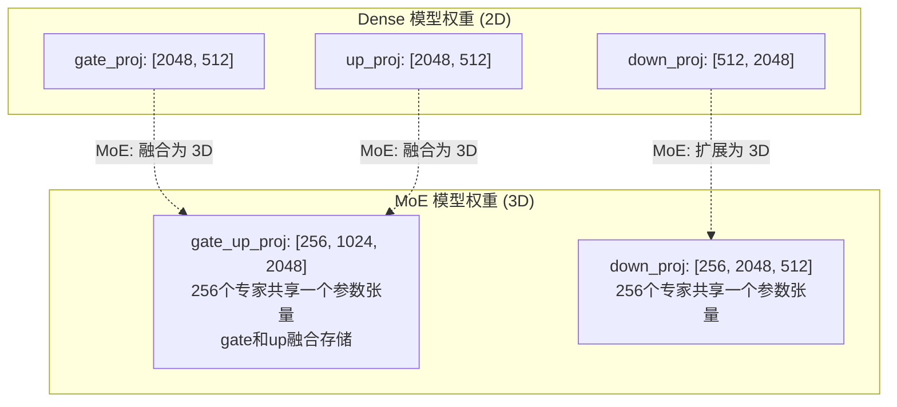
```mermaid
graph TB
    subgraph "Dense 模型权重 (2D)"
        D_GP["gate_proj: [2048, 512]"]
        D_UP["up_proj: [2048, 512]"]
        D_DP["down_proj: [512, 2048]"]
    end

    subgraph "MoE 模型权重 (3D)"
        M_GU["gate_up_proj: [256, 1024, 2048]<br/>256个专家共享一个参数张量<br/>gate和up融合存储"]
        M_DP["down_proj: [256, 2048, 512]<br/>256个专家共享一个参数张量"]
    end

    D_GP -.->|"MoE: 融合为 3D"| M_GU
    D_UP -.->|"MoE: 融合为 3D"| M_GU
    D_DP -.->|"MoE: 扩展为 3D"| M_DP
```

---

## 4. 混合注意力层架构

Qwen3.5-MoE 的核心创新在于 **full_attention 层和 linear_attention 层交替排列**，这是混合注意力架构的首次大规模应用。

### 4.1 层类型分布图

`layer_types` 在 [configuration_qwen3_5_moe.py:112-119](file:///workspace/src/transformers/models/qwen3_5_moe/configuration_qwen3_5_moe.py#L112) 中自动生成，默认 `full_attention_interval=4`：

```python
def __post_init__(self, **kwargs):
    if self.layer_types is None:
        interval_pattern = kwargs.pop("full_attention_interval", 4)
        self.layer_types = [
            "linear_attention" if bool((i + 1) % interval_pattern) else "full_attention"
            for i in range(self.num_hidden_layers)
        ]
```

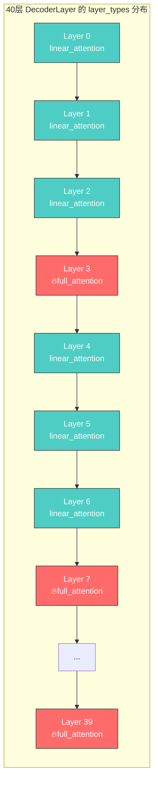
```mermaid
graph LR
    subgraph "40层 DecoderLayer 的 layer_types 分布"
        L0["Layer 0<br/>linear_attention"]
        L1["Layer 1<br/>linear_attention"]
        L2["Layer 2<br/>linear_attention"]
        L3["Layer 3<br/>🔥full_attention"]
        L4["Layer 4<br/>linear_attention"]
        L5["Layer 5<br/>linear_attention"]
        L6["Layer 6<br/>linear_attention"]
        L7["Layer 7<br/>🔥full_attention"]
        L8["..."]
        L39["Layer 39<br/>🔥full_attention"]
    end

    L0 --> L1 --> L2 --> L3 --> L4 --> L5 --> L6 --> L7 --> L8 --> L39

    style L3 fill:#ff6b6b,stroke:#333,color:#fff
    style L7 fill:#ff6b6b,stroke:#333,color:#fff
    style L39 fill:#ff6b6b,stroke:#333,color:#fff
    style L0 fill:#4ecdc4,stroke:#333,color:#fff
    style L1 fill:#4ecdc4,stroke:#333,color:#fff
    style L2 fill:#4ecdc4,stroke:#333,color:#fff
    style L4 fill:#4ecdc4,stroke:#333,color:#fff
    style L5 fill:#4ecdc4,stroke:#333,color:#fff
    style L6 fill:#4ecdc4,stroke:#333,color:#fff
```

规律：每 4 层中，第 0-2 层为 `linear_attention`，第 3 层为 `full_attention`。40 层中共有 10 个 `full_attention` 层和 30 个 `linear_attention` 层。

### 4.2 Qwen3_5MoeAttention 内部结构图

定义在 [modeling_qwen3_5_moe.py:642-716](file:///workspace/src/transformers/models/qwen3_5_moe/modeling_qwen3_5_moe.py#L642)：

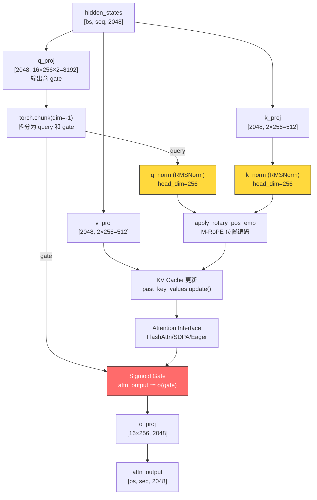
```mermaid
graph TB
    Input["hidden_states<br/>[bs, seq, 2048]"]

    QP["q_proj<br/>[2048, 16×256×2=8192]<br/>输出含 gate"]
    KP["k_proj<br/>[2048, 2×256=512]"]
    VP["v_proj<br/>[2048, 2×256=512]"]

    Chunk["torch.chunk(dim=-1)<br/>拆分为 query 和 gate"]
    QN["q_norm (RMSNorm)<br/>head_dim=256"]
    KN["k_norm (RMSNorm)<br/>head_dim=256"]

    RoPE["apply_rotary_pos_emb<br/>M-RoPE 位置编码"]
    KVCache["KV Cache 更新<br/>past_key_values.update()"]

    Attn["Attention Interface<br/>FlashAttn/SDPA/Eager"]
    Gate["Sigmoid Gate<br/>attn_output *= σ(gate)"]
    OProj["o_proj<br/>[16×256, 2048]"]

    Output["attn_output<br/>[bs, seq, 2048]"]

    Input --> QP
    Input --> KP
    Input --> VP
    QP --> Chunk
    Chunk -->|"query"| QN
    Chunk -->|"gate"| Gate
    KP --> KN
    QN --> RoPE
    KN --> RoPE
    VP --> KVCache
    RoPE --> KVCache
    KVCache --> Attn
    Attn --> Gate
    Gate --> OProj
    OProj --> Output

    style QN fill:#ffd93d,stroke:#333
    style KN fill:#ffd93d,stroke:#333
    style Gate fill:#ff6b6b,stroke:#333,color:#fff
```

**三大创新点**：
1. **QK Norm**：`q_norm` 和 `k_norm` 对 Q/K 做 RMSNorm，稳定训练
2. **Gate 机制**：`q_proj` 输出维度翻倍（`head_dim * 2`），一半作为 query，一半经 sigmoid 门控
3. **M-RoPE**：多模态旋转位置编码，支持文本/图像/视频的 3D 位置

### 4.3 Qwen3_5MoeGatedDeltaNet 内部结构图

定义在 [modeling_qwen3_5_moe.py:367-555](file:///workspace/src/transformers/models/qwen3_5_moe/modeling_qwen3_5_moe.py#L367)：

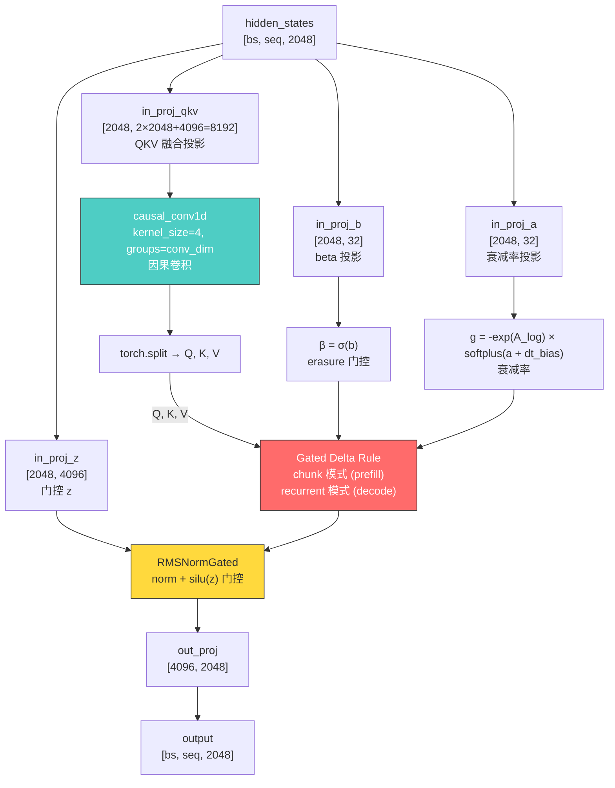
```mermaid
graph TB
    Input["hidden_states<br/>[bs, seq, 2048]"]

    InQKV["in_proj_qkv<br/>[2048, 2×2048+4096=8192]<br/>QKV 融合投影"]
    InZ["in_proj_z<br/>[2048, 4096]<br/>门控 z"]
    InB["in_proj_b<br/>[2048, 32]<br/>beta 投影"]
    InA["in_proj_a<br/>[2048, 32]<br/>衰减率投影"]

    Conv1D["causal_conv1d<br/>kernel_size=4, groups=conv_dim<br/>因果卷积"]
    Split["torch.split → Q, K, V"]

    Beta["β = σ(b)<br/>erasure 门控"]
    Decay["g = -exp(A_log) × softplus(a + dt_bias)<br/>衰减率"]

    DeltaRule["Gated Delta Rule<br/>chunk 模式 (prefill)<br/>recurrent 模式 (decode)"]

    Norm["RMSNormGated<br/>norm + silu(z) 门控"]
    OutProj["out_proj<br/>[4096, 2048]"]

    Output["output<br/>[bs, seq, 2048]"]

    Input --> InQKV
    Input --> InZ
    Input --> InB
    Input --> InA
    InQKV --> Conv1D
    Conv1D --> Split
    Split -->|"Q, K, V"| DeltaRule
    InB --> Beta
    InA --> Decay
    Beta --> DeltaRule
    Decay --> DeltaRule
    InZ --> Norm
    DeltaRule --> Norm
    Norm --> OutProj
    OutProj --> Output

    style Conv1D fill:#4ecdc4,stroke:#333,color:#fff
    style DeltaRule fill:#ff6b6b,stroke:#333,color:#fff
    style Norm fill:#ffd93d,stroke:#333
```

**GatedDeltaNet 核心公式**：

```
# 递推模式（单 token 解码）：
S_t = S_{t-1} * exp(g_t)                    # 衰减旧状态
kv_mem = (S_t * k_t).sum(dim=-2)            # 检索记忆
δ_t = (v_t - kv_mem) * β_t                  # 计算修正量
S_t = S_t + k_t^T * δ_t                     # 更新状态
o_t = (S_t * q_t).sum(dim=-2)               # 查询输出
```

### 4.4 两种注意力层的数据流对比图

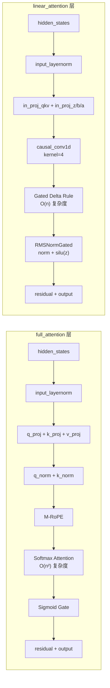
```mermaid
graph LR
    subgraph "full_attention 层"
        FA_IN["hidden_states"] --> FA_LN["input_layernorm"]
        FA_LN --> FA_QKV["q_proj + k_proj + v_proj"]
        FA_QKV --> FA_NORM["q_norm + k_norm"]
        FA_NORM --> FA_ROPE["M-RoPE"]
        FA_ROPE --> FA_ATTN["Softmax Attention<br/>O(n²) 复杂度"]
        FA_ATTN --> FA_GATE["Sigmoid Gate"]
        FA_GATE --> FA_OUT["residual + output"]
    end

    subgraph "linear_attention 层"
        LA_IN["hidden_states"] --> LA_LN["input_layernorm"]
        LA_LN --> LA_PROJ["in_proj_qkv + in_proj_z/b/a"]
        LA_PROJ --> LA_CONV["causal_conv1d<br/>kernel=4"]
        LA_CONV --> LA_DELTA["Gated Delta Rule<br/>O(n) 复杂度"]
        LA_DELTA --> LA_NORM["RMSNormGated<br/>norm + silu(z)"]
        LA_NORM --> LA_OUT["residual + output"]
    end
```

| 特性 | full_attention | linear_attention |
|---|---|---|
| 复杂度 | O(n²) | O(n) |
| 缓存类型 | KV Cache | conv_state + recurrent_state |
| 位置编码 | M-RoPE | 无（卷积隐式编码） |
| QK Norm | ✅ | ❌（使用 L2 Norm） |
| Gate 机制 | Sigmoid Gate on Q | RMSNormGated with z |
| 适用场景 | 精确长程依赖 | 高效序列建模 |

---

## 5. MoE 专家路由系统

Qwen3.5-MoE 采用 256 专家 Top-8 路由 + 共享专家的混合架构，每个 token 同时经过 8 个路由专家和 1 个共享专家。

### 5.1 MoE 路由流程图

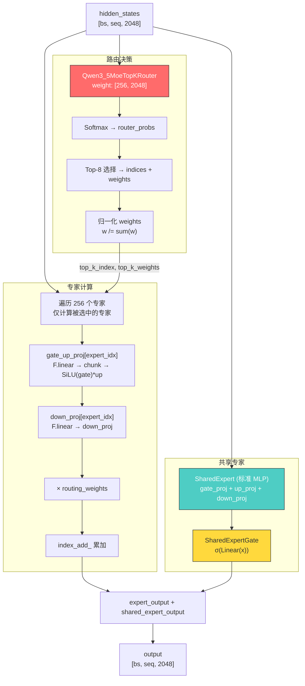
```mermaid
graph TB
    Input["hidden_states<br/>[bs, seq, 2048]"]

    subgraph "路由决策"
        Router["Qwen3_5MoeTopKRouter<br/>weight: [256, 2048]"]
        Softmax["Softmax → router_probs"]
        TopK["Top-8 选择 → indices + weights"]
        Norm["归一化 weights<br/>w /= sum(w)"]
    end

    subgraph "专家计算"
        ExpertLoop["遍历 256 个专家<br/>仅计算被选中的专家"]
        GateUp["gate_up_proj[expert_idx]<br/>F.linear → chunk → SiLU(gate)*up"]
        Down["down_proj[expert_idx]<br/>F.linear → down_proj"]
        Weighted["× routing_weights"]
        Accum["index_add_ 累加"]
    end

    subgraph "共享专家"
        Shared["SharedExpert (标准 MLP)<br/>gate_proj + up_proj + down_proj"]
        SharedGate["SharedExpertGate<br/>σ(Linear(x))"]
    end

    Merge["expert_output + shared_expert_output"]
    Output["output<br/>[bs, seq, 2048]"]

    Input --> Router
    Router --> Softmax --> TopK --> Norm
    Input --> ExpertLoop
    Norm -->|"top_k_index, top_k_weights"| ExpertLoop
    ExpertLoop --> GateUp --> Down --> Weighted --> Accum
    Input --> Shared
    Shared --> SharedGate
    Accum --> Merge
    SharedGate --> Merge
    Merge --> Output

    style Router fill:#ff6b6b,stroke:#333,color:#fff
    style Shared fill:#4ecdc4,stroke:#333,color:#fff
    style SharedGate fill:#ffd93d,stroke:#333
```

### 5.2 Qwen3_5MoeSparseMoeBlock 内部结构图

定义在 [modeling_qwen3_5_moe.py:794-813](file:///workspace/src/transformers/models/qwen3_5_moe/modeling_qwen3_5_moe.py#L794)：

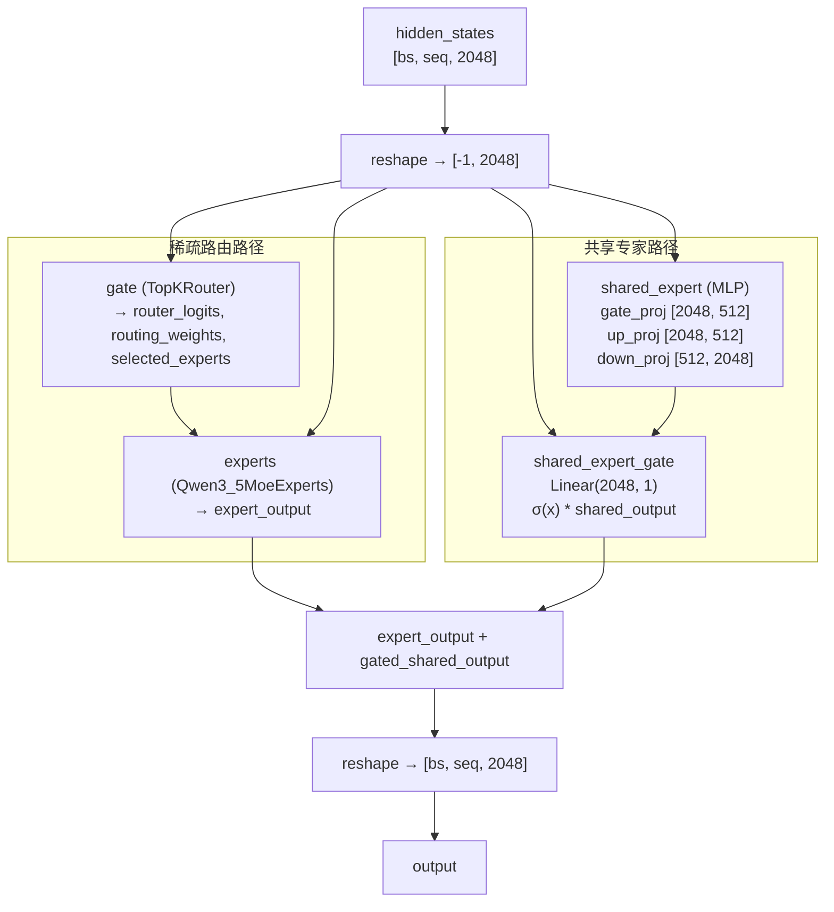
```mermaid
graph TB
    Input["hidden_states<br/>[bs, seq, 2048]"]
    Reshape["reshape → [-1, 2048]"]

    subgraph "稀疏路由路径"
        Gate["gate (TopKRouter)<br/>→ router_logits, routing_weights, selected_experts"]
        Experts["experts (Qwen3_5MoeExperts)<br/>→ expert_output"]
    end

    subgraph "共享专家路径"
        SharedMLP["shared_expert (MLP)<br/>gate_proj [2048, 512]<br/>up_proj [2048, 512]<br/>down_proj [512, 2048]"]
        SharedGate["shared_expert_gate<br/>Linear(2048, 1)<br/>σ(x) * shared_output"]
    end

    Add["expert_output + gated_shared_output"]
    Reshape2["reshape → [bs, seq, 2048]"]
    Output["output"]

    Input --> Reshape
    Reshape --> Gate
    Gate --> Experts
    Reshape --> Experts
    Reshape --> SharedMLP
    Reshape --> SharedGate
    SharedMLP --> SharedGate
    Experts --> Add
    SharedGate --> Add
    Add --> Reshape2 --> Output
```

关键代码：

```python
class Qwen3_5MoeSparseMoeBlock(nn.Module):
    def __init__(self, config):
        self.gate = Qwen3_5MoeTopKRouter(config)
        self.experts = Qwen3_5MoeExperts(config)
        self.shared_expert = Qwen3_5MoeMLP(config, intermediate_size=config.shared_expert_intermediate_size)
        self.shared_expert_gate = torch.nn.Linear(config.hidden_size, 1, bias=False)

    def forward(self, hidden_states):
        shared_expert_output = self.shared_expert(hidden_states_reshaped)
        _, routing_weights, selected_experts = self.gate(hidden_states_reshaped)
        expert_output = self.experts(hidden_states_reshaped, selected_experts, routing_weights)
        shared_expert_output = F.sigmoid(self.shared_expert_gate(hidden_states_reshaped)) * shared_expert_output
        expert_output = expert_output + shared_expert_output
```

### 5.3 @use_experts_implementation 装饰器的工作原理

定义在 [integrations/moe.py:523](file:///workspace/src/transformers/integrations/moe.py)，该装饰器允许将默认的 PyTorch 专家实现替换为优化版本（如 `megablocks`、`grouped_gemm`）：

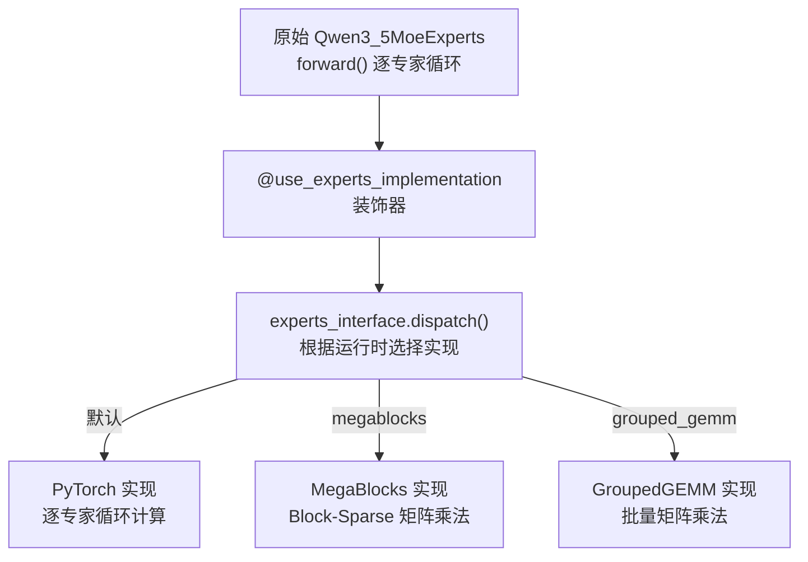
```mermaid
graph TB
    Original["原始 Qwen3_5MoeExperts<br/>forward() 逐专家循环"]
    Decorator["@use_experts_implementation<br/>装饰器"]
    Dispatch["experts_interface.dispatch()<br/>根据运行时选择实现"]
    PyTorch["PyTorch 实现<br/>逐专家循环计算"]
    MegaBlocks["MegaBlocks 实现<br/>Block-Sparse 矩阵乘法"]
    GroupedGEMM["GroupedGEMM 实现<br/>批量矩阵乘法"]

    Original --> Decorator
    Decorator --> Dispatch
    Dispatch -->|"默认"| PyTorch
    Dispatch -->|"megablocks"| MegaBlocks
    Dispatch -->|"grouped_gemm"| GroupedGEMM
```

### 5.4 负载均衡损失计算图

定义在 [modeling_qwen3_5_moe.py:1755-1834](file:///workspace/src/transformers/models/qwen3_5_moe/modeling_qwen3_5_moe.py#L1755)：

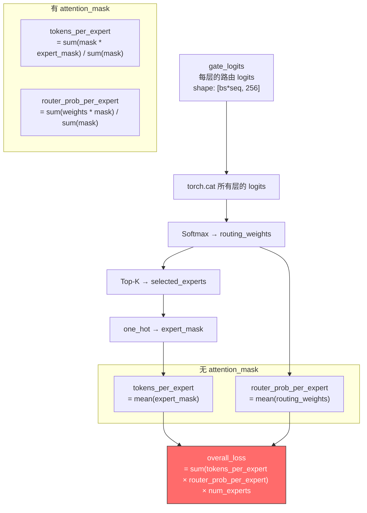
```mermaid
graph TB
    Logits["gate_logits<br/>每层的路由 logits<br/>shape: [bs*seq, 256]"]
    Concat["torch.cat 所有层的 logits"]
    Softmax["Softmax → routing_weights"]
    TopK["Top-K → selected_experts"]
    OneHot["one_hot → expert_mask"]

    subgraph "无 attention_mask"
        TPE["tokens_per_expert<br/>= mean(expert_mask)"]
        RPE["router_prob_per_expert<br/>= mean(routing_weights)"]
    end

    subgraph "有 attention_mask"
        TPE2["tokens_per_expert<br/>= sum(mask * expert_mask) / sum(mask)"]
        RPE2["router_prob_per_expert<br/>= sum(weights * mask) / sum(mask)"]
    end

    Loss["overall_loss<br/>= sum(tokens_per_expert × router_prob_per_expert) × num_experts"]

    Logits --> Concat --> Softmax --> TopK --> OneHot
    OneHot --> TPE
    Softmax --> RPE
    TPE --> Loss
    RPE --> Loss

    style Loss fill:#ff6b6b,stroke:#333,color:#fff
```

公式：`L_aux = N × Σ_i(f_i × P_i)`，其中 `f_i` 是分配给专家 i 的 token 比例，`P_i` 是路由到专家 i 的平均概率。

---

## 6. 多模态视觉编码器

### 6.1 视觉编码流程图

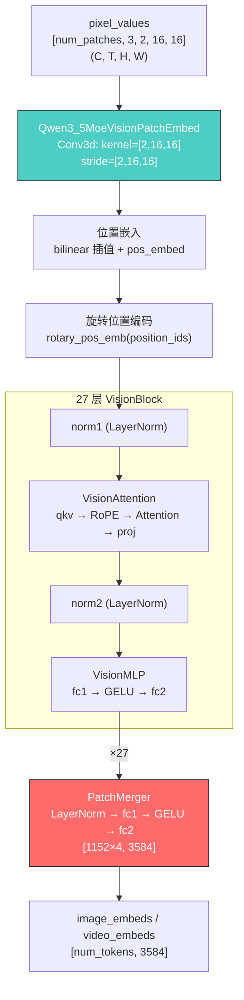
```mermaid
graph TB
    Pixels["pixel_values<br/>[num_patches, 3, 2, 16, 16]<br/>(C, T, H, W)"]

    PatchEmbed["Qwen3_5MoeVisionPatchEmbed<br/>Conv3d: kernel=[2,16,16]<br/>stride=[2,16,16]"]
    PosEmbed["位置嵌入<br/>bilinear 插值 + pos_embed"]
    RotEmb["旋转位置编码<br/>rotary_pos_emb(position_ids)"]

    subgraph "27 层 VisionBlock"
        VBN1["norm1 (LayerNorm)"]
        VBA["VisionAttention<br/>qkv → RoPE → Attention → proj"]
        VBN2["norm2 (LayerNorm)"]
        VBM["VisionMLP<br/>fc1 → GELU → fc2"]
    end

    Merger["PatchMerger<br/>LayerNorm → fc1 → GELU → fc2<br/>[1152×4, 3584]"]
    Output["image_embeds / video_embeds<br/>[num_tokens, 3584]"]

    Pixels --> PatchEmbed
    PatchEmbed --> PosEmbed
    PosEmbed --> RotEmb
    RotEmb --> VBN1 --> VBA --> VBN2 --> VBM
    VBM -->|"×27"| Merger
    Merger --> Output

    style PatchEmbed fill:#4ecdc4,stroke:#333,color:#fff
    style Merger fill:#ff6b6b,stroke:#333,color:#fff
```

### 6.2 3D 位置编码（M-RoPE）计算图

视觉 token 的 3D 位置编码由 `get_vision_position_ids` 方法计算，定义在 [modeling_qwen3_5_moe.py:1394-1450](file:///workspace/src/transformers/models/qwen3_5_moe/modeling_qwen3_5_moe.py#L1394)：

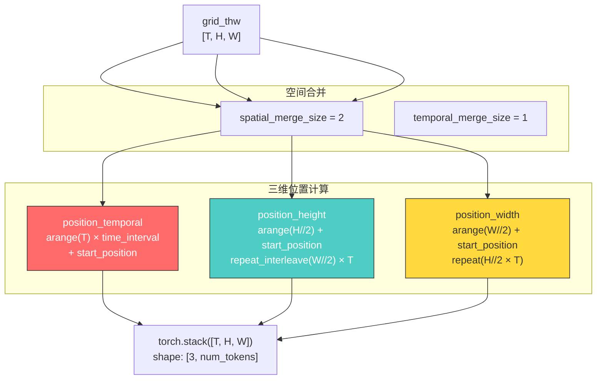
```mermaid
graph TB
    GridTHW["grid_thw<br/>[T, H, W]"]

    subgraph "空间合并"
        SM["spatial_merge_size = 2"]
        TM["temporal_merge_size = 1"]
    end

    subgraph "三维位置计算"
        T["position_temporal<br/>arange(T) × time_interval<br/>+ start_position"]
        H["position_height<br/>arange(H//2) + start_position<br/>repeat_interleave(W//2) × T"]
        W["position_width<br/>arange(W//2) + start_position<br/>repeat(H//2 × T)"]
    end

    Stack["torch.stack([T, H, W])<br/>shape: [3, num_tokens]"]

    GridTHW --> SM --> T
    GridTHW --> SM --> H
    GridTHW --> SM --> W
    T --> Stack
    H --> Stack
    W --> Stack

    style T fill:#ff6b6b,stroke:#333,color:#fff
    style H fill:#4ecdc4,stroke:#333,color:#fff
    style W fill:#ffd93d,stroke:#333
```

关键代码：

```python
def get_vision_position_ids(self, start_position, grid_thw, ...):
    llm_grid_t = grid_thw[0] // temp_merge_size
    llm_grid_h = grid_thw[1] // spatial_merge_size
    llm_grid_w = grid_thw[2] // spatial_merge_size

    position_temporal = torch.arange(llm_grid_t) * time_interval
    position_width = torch.arange(llm_grid_w) + start_position
    position_height = torch.arange(llm_grid_h) + start_position

    position_width = position_width.repeat(llm_grid_h * llm_grid_t)
    position_height = position_height.repeat_interleave(llm_grid_w).repeat(llm_grid_t)
    position_temporal = position_temporal.repeat_interleave(llm_grid_h * llm_grid_w) + start_position

    return torch.stack([position_temporal, position_height, position_width], dim=0)
```

### 6.3 视觉 token 与文本 token 的融合流程图

在 [modeling_qwen3_5_moe.py:1707-1727](file:///workspace/src/transformers/models/qwen3_5_moe/modeling_qwen3_5_moe.py#L1707) 中，使用 `masked_scatter` 将视觉嵌入融合到文本嵌入中：

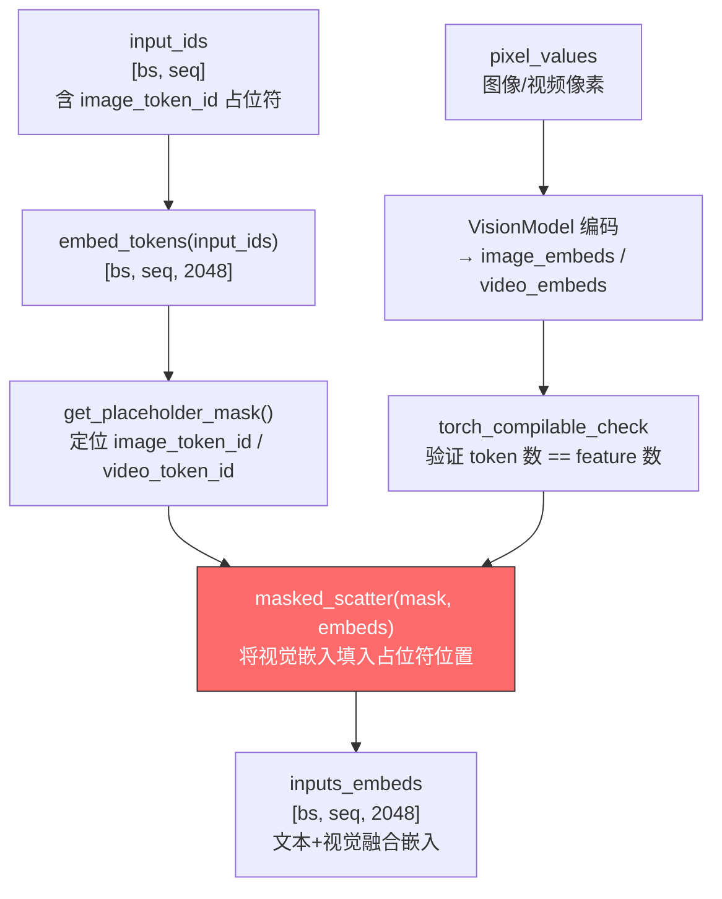
```mermaid
graph TB
    InputIDs["input_ids<br/>[bs, seq]<br/>含 image_token_id 占位符"]
    Embed["embed_tokens(input_ids)<br/>[bs, seq, 2048]"]
    PixelVals["pixel_values<br/>图像/视频像素"]
    VisionEnc["VisionModel 编码<br/>→ image_embeds / video_embeds"]

    PlaceholderMask["get_placeholder_mask()<br/>定位 image_token_id / video_token_id"]
    Check["torch_compilable_check<br/>验证 token 数 == feature 数"]

    Scatter["masked_scatter(mask, embeds)<br/>将视觉嵌入填入占位符位置"]

    FusedEmbeds["inputs_embeds<br/>[bs, seq, 2048]<br/>文本+视觉融合嵌入"]

    InputIDs --> Embed
    PixelVals --> VisionEnc
    Embed --> PlaceholderMask
    VisionEnc --> Check
    PlaceholderMask --> Scatter
    Check --> Scatter
    Scatter --> FusedEmbeds

    style Scatter fill:#ff6b6b,stroke:#333,color:#fff
```

关键代码：

```python
if pixel_values is not None:
    image_embeds = self.get_image_features(pixel_values, image_grid_thw)
    image_mask, _ = self.get_placeholder_mask(input_ids, inputs_embeds=inputs_embeds, image_features=image_embeds)
    inputs_embeds = inputs_embeds.masked_scatter(image_mask, image_embeds)

if pixel_values_videos is not None:
    video_embeds = self.get_video_features(pixel_values_videos, video_grid_thw)
    _, video_mask = self.get_placeholder_mask(input_ids, inputs_embeds=inputs_embeds, video_features=video_embeds)
    inputs_embeds = inputs_embeds.masked_scatter(video_mask, video_embeds)
```

---

## 7. RoPE 与 M-RoPE 位置编码

M-RoPE（Multimodal Rotary Position Embedding）是 Qwen3.5 系列的核心位置编码方案，支持文本的 1D 位置和图像/视频的 3D 位置。

### 7.1 M-RoPE 原理图

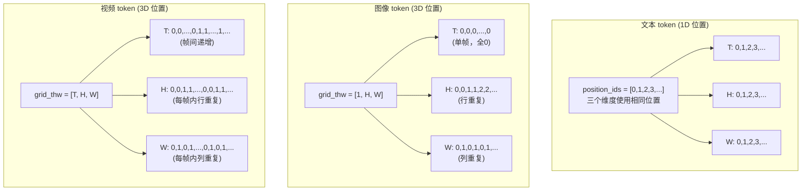
```mermaid
graph TB
    subgraph "文本 token (1D 位置)"
        Text["position_ids = [0,1,2,3,...]<br/>三个维度使用相同位置"]
        TextT["T: 0,1,2,3,..."]
        TextH["H: 0,1,2,3,..."]
        TextW["W: 0,1,2,3,..."]
        Text --> TextT & TextH & TextW
    end

    subgraph "图像 token (3D 位置)"
        Img["grid_thw = [1, H, W]"]
        ImgT["T: 0,0,0,...,0<br/>(单帧，全0)"]
        ImgH["H: 0,0,1,1,2,2,...<br/>(行重复)"]
        ImgW["W: 0,1,0,1,0,1,...<br/>(列重复)"]
        Img --> ImgT & ImgH & ImgW
    end

    subgraph "视频 token (3D 位置)"
        Vid["grid_thw = [T, H, W]"]
        VidT["T: 0,0,...,0,1,1,...,1,...<br/>(帧间递增)"]
        VidH["H: 0,0,1,1,...,0,0,1,1,...<br/>(每帧内行重复)"]
        VidW["W: 0,1,0,1,...,0,1,0,1,...<br/>(每帧内列重复)"]
        Vid --> VidT & VidH & VidW
    end
```

### 7.2 apply_interleaved_mrope 交错排列图

在 [modeling_qwen3_5_moe.py:165-180](file:///workspace/src/transformers/models/qwen3_5_moe/modeling_qwen3_5_moe.py#L165) 中，M-RoPE 将三维频率交错排列：

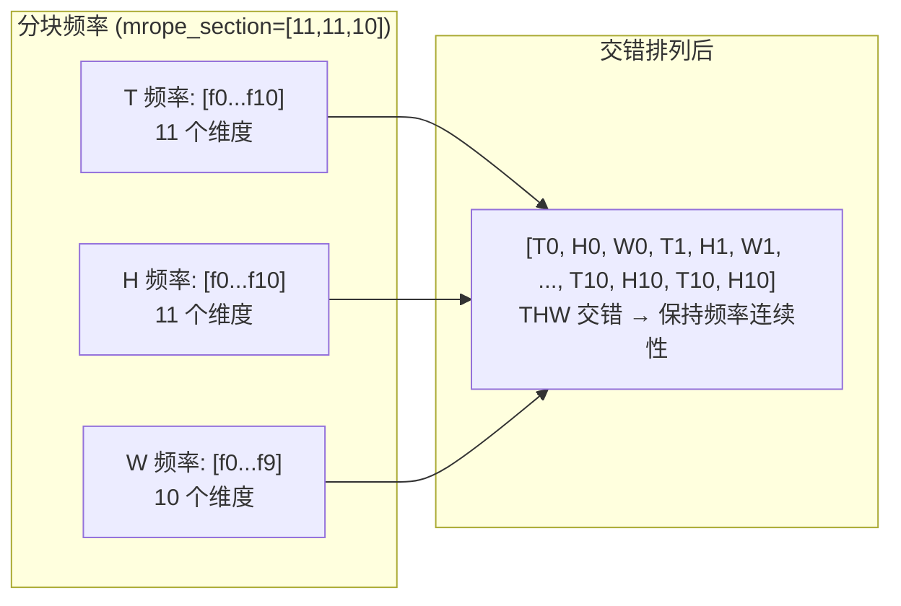
```mermaid
graph LR
    subgraph "分块频率 (mrope_section=[11,11,10])"
        T_Freq["T 频率: [f0...f10]<br/>11 个维度"]
        H_Freq["H 频率: [f0...f10]<br/>11 个维度"]
        W_Freq["W 频率: [f0...f9]<br/>10 个维度"]
    end

    subgraph "交错排列后"
        Interleaved["[T0, H0, W0, T1, H1, W1, ..., T10, H10, T10, H10]<br/>THW 交错 → 保持频率连续性"]
    end

    T_Freq --> Interleaved
    H_Freq --> Interleaved
    W_Freq --> Interleaved
```

关键代码：

```python
def apply_interleaved_mrope(self, freqs, mrope_section):
    freqs_t = freqs[0]  # 以 T 维度为基底
    for dim, offset in enumerate((1, 2), start=1):  # H, W
        length = mrope_section[dim] * 3
        idx = slice(offset, length, 3)  # 交错索引
        freqs_t[..., idx] = freqs[dim, ..., idx]
    return freqs_t
```

### 7.3 get_rope_index 位置计算流程图

定义在 [modeling_qwen3_5_moe.py:1452-1543](file:///workspace/src/transformers/models/qwen3_5_moe/modeling_qwen3_5_moe.py#L1452)：

```mermaid
graph TB
    Input["input_ids + mm_token_type_ids<br/>+ image_grid_thw + video_grid_thw"]

    Split["按 token_type 分组<br/>itertools.groupby"]

    subgraph "文本组 (type=0)"
        TextPos["arange(text_len) + current_pos<br/>expand(3, -1) → T/H/W 相同"]
    end

    subgraph "图像组 (type=1)"
        ImgGrid["next(image_grid_thw_iter)"]
        ImgPos["get_vision_position_ids(current_pos, grid_thw)"]
        ImgAdvance["current_pos += max(H,W) // merge_size"]
    end

    subgraph "视频组 (type=2)"
        VidGrid["next(video_grid_thw_iter)"]
        VidPos["get_vision_position_ids(current_pos, grid_thw)"]
        VidAdvance["current_pos += max(H,W) // merge_size"]
    end

    Concat["torch.cat 所有组的位置<br/>shape: [3, bs, seq_len]"]
    Delta["mrope_position_deltas<br/>= max(position) + 1 - seq_len"]

    Input --> Split
    Split --> TextPos
    Split --> ImgGrid --> ImgPos --> ImgAdvance
    Split --> VidGrid --> VidPos --> VidAdvance
    TextPos --> Concat
    ImgPos --> Concat
    VidPos --> Concat
    Concat --> Delta

    style Concat fill:#ff6b6b,stroke:#333,color:#fff
    style Delta fill:#ffd93d,stroke:#333
```

**视频特殊处理**：由于 Qwen3.5 使用时间戳分隔视频帧，`video_grid_thw` 需要按帧拆分：

```python
if video_grid_thw is not None:
    video_grid_thw = torch.repeat_interleave(video_grid_thw, video_grid_thw[:, 0], dim=0)
    video_grid_thw[:, 0] = 1  # 每帧独立
```

---

## 8. 缓存系统

Qwen3.5-MoE 的混合注意力架构需要混合缓存：`full_attention` 层使用 KV Cache，`linear_attention` 层使用 `conv_state` + `recurrent_state`。

### 8.1 混合缓存架构图

```mermaid
graph TB
    subgraph "DynamicCache (统一管理)"
        subgraph "full_attention 层缓存"
            KV["CacheLayer<br/>key_cache: [bs, heads, seq, dim]<br/>value_cache: [bs, heads, seq, dim]"]
        end

        subgraph "linear_attention 层缓存"
            Conv["LinearAttentionCacheLayerMixin<br/>conv_states: [bs, conv_dim, kernel_size]<br/>因果卷积状态"]
            Recur["recurrent_states: [bs, heads, k_dim, v_dim]<br/>DeltaNet 递推状态"]
        end
    end

    Config["config.layer_types<br/>确定每层缓存类型"]

    Config -->|"full_attention"| KV
    Config -->|"linear_attention"| Conv
    Config -->|"linear_attention"| Recur

    style KV fill:#ff6b6b,stroke:#333,color:#fff
    style Conv fill:#4ecdc4,stroke:#333,color:#fff
    style Recur fill:#4ecdc4,stroke:#333,color:#fff
```

DynamicCache 在初始化时根据 `config.layer_types` 自动判断每层的缓存类型，定义在 [cache_utils.py:1229](file:///workspace/src/transformers/cache_utils.py)。

### 8.2 linear_attention 层的缓存更新流程

```mermaid
sequenceDiagram
    participant Layer as Qwen3_5MoeGatedDeltaNet
    participant Cache as DynamicCache
    participant ConvState as conv_state
    participant RecurState as recurrent_state

    Note over Layer: Prefill 阶段 (seq_len > 1)
    Layer->>Cache: has_previous_state(layer_idx)?
    Cache-->>Layer: False (首次)
    Layer->>Layer: in_proj_qkv → causal_conv1d
    Layer->>Cache: update_conv_state(new_conv_state, layer_idx)
    Cache->>ConvState: 懒初始化 + copy
    Layer->>Layer: chunk_gated_delta_rule(Q, K, V, g, β)
    Layer->>Cache: update_recurrent_state(last_recurrent_state, layer_idx)
    Cache->>RecurState: copy

    Note over Layer: Decode 阶段 (seq_len == 1)
    Layer->>Cache: has_previous_state(layer_idx)?
    Cache-->>Layer: True
    Cache-->>Layer: conv_state, recurrent_state
    Layer->>Layer: causal_conv1d_update (单步更新)
    Note over Layer: conv_state 原地更新
    Layer->>Layer: recurrent_gated_delta_rule (递推)
    Note over Layer: S_t = S_{t-1} * g + k^T * δ
    Layer->>Cache: update_recurrent_state(new_state, layer_idx)
    Cache->>RecurState: copy
```

关键代码在 [modeling_qwen3_5_moe.py:449-546](file:///workspace/src/transformers/models/qwen3_5_moe/modeling_qwen3_5_moe.py#L449)：

```python
use_precomputed_states = cache_params is not None and cache_params.has_previous_state(self.layer_idx)

if use_precomputed_states:
    conv_state = cache_params.layers[self.layer_idx].conv_states
    recurrent_state = cache_params.layers[self.layer_idx].recurrent_states

# Prefill: 多 token，使用 chunk 模式
if not (use_precomputed_states and seq_len == 1):
    if cache_params is not None:
        new_conv_state = F.pad(mixed_qkv, (self.conv_kernel_size - mixed_qkv.shape[-1], 0))
        cache_params.update_conv_state(new_conv_state, self.layer_idx)
    core_attn_out, last_recurrent_state = self.chunk_gated_delta_rule(...)

# Decode: 单 token，使用 recurrent 模式
else:
    mixed_qkv = self.causal_conv1d_update(mixed_qkv, conv_state, ...)
    core_attn_out, last_recurrent_state = self.recurrent_gated_delta_rule(...)

if cache_params is not None:
    cache_params.update_recurrent_state(last_recurrent_state, self.layer_idx)
```

---

## 9. generate() 生成全流程

### 9.1 生成循环时序图

```mermaid
sequenceDiagram
    participant User as 用户
    participant Processor as AutoProcessor
    participant Model as Qwen3_5MoeForConditionalGeneration
    participant Vision as Qwen3_5MoeVisionModel
    participant Text as Qwen3_5MoeTextModel
    participant Cache as DynamicCache

    User->>Processor: 处理图像+文本
    Processor-->>Model: input_ids + pixel_values + grid_thw + mm_token_type_ids

    Note over Model: 首次迭代 (is_first_iteration=True)
    Model->>Model: prepare_inputs_for_generation()
    Model->>Vision: get_image_features(pixel_values, grid_thw)
    Vision-->>Model: image_embeds
    Model->>Model: masked_scatter 融合视觉嵌入
    Model->>Model: _prepare_position_ids_for_generation()<br/>计算 3D position_ids + rope_deltas
    Model->>Text: forward(inputs_embeds, position_ids, ...)
    Text->>Cache: 初始化 DynamicCache
    Text-->>Model: hidden_states
    Model->>Model: lm_head → logits → 采样 next_token

    Note over Model: 后续迭代 (is_first_iteration=False)
    loop 生成循环
        Model->>Model: prepare_inputs_for_generation()<br/>清除 pixel_values/grid_thw
        Model->>Model: _prepare_position_ids_for_generation()<br/>使用 rope_deltas 推算位置
        Model->>Text: forward(input_ids=next_token, position_ids, past_key_values)
        Text->>Cache: 读取/更新缓存
        Text-->>Model: hidden_states
        Model->>Model: lm_head → logits → 采样 next_token
    end

    Model-->>User: generated_ids
```

### 9.2 prepare_inputs_for_generation 的特殊处理

定义在 [modeling_qwen3_5_moe.py:2106-2142](file:///workspace/src/transformers/models/qwen3_5_moe/modeling_qwen3_5_moe.py#L2106)：

```python
def prepare_inputs_for_generation(self, input_ids, past_key_values=None, ...,
                                   pixel_values=None, pixel_values_videos=None,
                                   image_grid_thw=None, video_grid_thw=None,
                                   is_first_iteration=False, **kwargs):
    model_inputs = super().prepare_inputs_for_generation(...)

    # 首次迭代后清除视觉输入，避免重复编码
    if not is_first_iteration and use_cache:
        model_inputs["pixel_values"] = None
        model_inputs["pixel_values_videos"] = None

    return model_inputs
```

```mermaid
graph TB
    subgraph "首次迭代"
        F1["pixel_values: ✅ 有值"]
        F2["image_grid_thw: ✅ 有值"]
        F3["mm_token_type_ids: ✅ 有值"]
        F4["→ 视觉编码 + masked_scatter"]
    end

    subgraph "后续迭代"
        S1["pixel_values: ❌ None"]
        S2["image_grid_thw: ❌ None"]
        S3["mm_token_type_ids: ❌ None"]
        S4["→ 仅文本 token，使用 rope_deltas 推算位置"]
    end

    F1 --> F4
    S1 --> S4

    style F1 fill:#4ecdc4,stroke:#333,color:#fff
    style F2 fill:#4ecdc4,stroke:#333,color:#fff
    style S1 fill:#999,stroke:#333,color:#fff
    style S2 fill:#999,stroke:#333,color:#fff
```

### 9.3 _prepare_position_ids_for_generation 的 3D 位置编码处理

定义在 [modeling_qwen3_5_moe.py:2144-2180](file:///workspace/src/transformers/models/qwen3_5_moe/modeling_qwen3_5_moe.py#L2144)：

```mermaid
graph TB
    Start["_prepare_position_ids_for_generation"]

    Check1{"past_length != 0<br/>且 rope_deltas 存在?"}
    UseDelta["position_ids = text_positions + rope_deltas<br/>直接使用缓存的 delta"]

    Check2{"有 input_ids 且<br/>有 mm_token_type_ids 且<br/>有 image/video_grid_thw?"}
    Compute3D["get_rope_index(input_ids, ...)<br/>计算完整 3D 位置"]
    StoreDelta["存储 rope_deltas"]

    Simple3D["vision_positions = text_positions.expand(3,-1,-1)<br/>纯文本：三个维度相同"]
    ZeroDelta["rope_deltas = zeros<br/>无多模态偏移"]

    Concat["torch.cat([text_positions, vision_positions])<br/>shape: [4, bs, seq]"]
    Output["position_ids [4, bs, seq]"]

    Start --> Check1
    Check1 -->|"是"| UseDelta --> Output
    Check1 -->|"否"| Check2
    Check2 -->|"是"| Compute3D --> StoreDelta --> Concat --> Output
    Check2 -->|"否"| Simple3D --> ZeroDelta --> Concat

    style Compute3D fill:#ff6b6b,stroke:#333,color:#fff
    style UseDelta fill:#4ecdc4,stroke:#333,color:#fff
```

关键代码：

```python
def _prepare_position_ids_for_generation(self, inputs_tensor, model_kwargs):
    text_positions = super()._prepare_position_ids_for_generation(inputs_tensor, model_kwargs)

    # 增量生成：直接用缓存的 rope_deltas
    past_length = 0
    if (cache := model_kwargs.get("past_key_values")) is not None:
        past_length = cache.get_seq_length()
    if past_length != 0 and self.model.rope_deltas is not None:
        position_ids = text_positions[None, ...] + self.model.rope_deltas
        return position_ids

    # 首次生成：计算 3D 位置
    if is_input_ids and model_kwargs.get("mm_token_type_ids") is not None and ...:
        vision_positions, rope_deltas = self.model.get_rope_index(inputs_tensor, **model_kwargs)
        self.model.rope_deltas = rope_deltas
    else:
        vision_positions = text_positions.unsqueeze(0).expand(3, -1, -1)
        self.model.rope_deltas = torch.zeros(...)

    # 拼接 [text, T, H, W] → [4, bs, seq]
    text_positions = text_positions[None, ...]
    position_ids = torch.cat([text_positions, vision_positions], dim=0)
    return position_ids
```

---

## 10. 分布式并行

### 10.1 TP 策略映射图

定义在 [configuration_qwen3_5_moe.py:59-72](file:///workspace/src/transformers/models/qwen3_5_moe/configuration_qwen3_5_moe.py#L59)：

```mermaid
graph TB
    subgraph "注意力层并行策略"
        QP["q_proj → colwise<br/>按列切分，每个 GPU 计算部分 head"]
        KP["k_proj → colwise"]
        VP["v_proj → colwise"]
        OP["o_proj → rowwise<br/>按行切分，结果 all-reduce"]
        QN["q_norm → replicated_with_grad_allreduce<br/>复制，梯度 all-reduce"]
        KN["k_norm → replicated_with_grad_allreduce"]
    end

    subgraph "MoE 专家并行策略"
        EGU["experts.gate_up_proj → packed_colwise<br/>打包列切分 [256, 1024, 2048]"]
        ED["experts.down_proj → rowwise"]
        EE["experts → moe_tp_experts<br/>🔥 专家级并行：每个 GPU 持有部分专家"]
        SG["shared_expert.gate_proj → colwise"]
        SU["shared_expert.up_proj → colwise"]
        SD["shared_expert.down_proj → rowwise"]
    end

    style EE fill:#ff6b6b,stroke:#333,color:#fff
    style QN fill:#ffd93d,stroke:#333
    style KN fill:#ffd93d,stroke:#333
```

### 10.2 MoE 专家并行（moe_tp_experts）原理图

```mermaid
graph TB
    subgraph "4 GPU 张量并行"
        subgraph "GPU 0"
            E0["Expert 0-63<br/>gate_up_proj[0:64]<br/>down_proj[0:64]"]
        end
        subgraph "GPU 1"
            E1["Expert 64-127<br/>gate_up_proj[64:128]<br/>down_proj[64:128]"]
        end
        subgraph "GPU 2"
            E2["Expert 128-191<br/>gate_up_proj[128:192]<br/>down_proj[128:192]"]
        end
        subgraph "GPU 3"
            E3["Expert 192-255<br/>gate_up_proj[192:256]<br/>down_proj[192:256]"]
        end
    end

    Input["hidden_states<br/>[bs, seq, 2048]"]
    Router["TopKRouter<br/>每个 GPU 完整计算路由"]
    Dispatch["All-to-All 通信<br/>将 token 发送到对应专家所在 GPU"]
    Compute["各 GPU 并行计算<br/>本地专家前向"]
    Gather["All-to-All 通信<br/>收集计算结果"]
    Output["expert_output<br/>[bs, seq, 2048]"]

    Input --> Router
    Router --> Dispatch
    Dispatch --> E0 & E1 & E2 & E3
    E0 & E1 & E2 & E3 --> Gather
    Gather --> Output

    style Dispatch fill:#ff6b6b,stroke:#333,color:#fff
    style Gather fill:#ff6b6b,stroke:#333,color:#fff
```

**moe_tp_experts** 与普通 `colwise/rowwise` 的区别：
- `colwise/rowwise`：切分单个线性层的权重矩阵
- `moe_tp_experts`：按专家维度切分，每个 GPU 持有 `256/tp_size` 个完整专家

---

## 11. 状态与生命周期总结

### 11.1 状态机图

```mermaid
stateDiagram-v2
    [*] --> 定义: 代码编写
    定义 --> 注册: AutoConfig/AutoModel 注册<br/>model_type = "qwen3_5_moe"

    注册 --> 加载: from_pretrained()
    state 加载 {
        [*] --> 解析Config: 读取 config.json
        解析Config --> 构建TextConfig: text_config → Qwen3_5MoeTextConfig
        解析Config --> 构建VisionConfig: vision_config → Qwen3_5MoeVisionConfig
        构建TextConfig --> 初始化模型: 40层 DecoderLayer<br/>+ MoE + 混合注意力
        构建VisionConfig --> 初始化模型: 27层 VisionBlock<br/>+ PatchEmbed + Merger
        初始化模型 --> 加载权重: state_dict 加载<br/>MoE 3D 权重特殊处理
        加载权重 --> 初始化权重: _init_weights()<br/>dt_bias, A_log, RMSNorm
    }

    加载 --> 多模态编码: forward() with pixel_values
    state 多模态编码 {
        [*] --> 视觉编码: VisionModel<br/>PatchEmbed → 27 Blocks → Merger
        视觉编码 --> 嵌入融合: masked_scatter<br/>视觉 token → 占位符位置
        嵌入融合 --> 位置计算: get_rope_index<br/>3D M-RoPE 位置编码
        位置计算 --> 文本前向: TextModel<br/>混合注意力 + MoE
    }

    多模态编码 --> 生成: generate()
    state 生成 {
        [*] --> 首次迭代: 视觉编码 + 全序列前向<br/>初始化 DynamicCache
        首次迭代 --> 增量解码: 清除 pixel_values<br/>使用 rope_deltas 推算位置
        增量解码 --> 增量解码: 单 token 递推<br/>KV Cache + conv/recurrent state 更新
        增量解码 --> 结束: EOS 或 max_length
    }

    生成 --> 保存: save_pretrained()
    state 保存 {
        [*] --> 序列化Config: config.json<br/>含 text_config + vision_config
        序列化Config --> 序列化权重: model.safetensors<br/>MoE 3D 权重保持原格式
    }

    保存 --> [*]

    note right of 加载: DynamicCache 根据<br/>layer_types 自动分配<br/>KV Cache 或 conv/recurrent state
    note right of 生成: full_attention 层: KV Cache<br/>linear_attention 层: conv + recurrent state
```

### 11.2 关键数据流总结

```mermaid
graph LR
    subgraph "输入"
        IDs["input_ids"]
        Pixels["pixel_values"]
        GridTHW["grid_thw"]
        TokenType["mm_token_type_ids"]
    end

    subgraph "视觉编码"
        VE["VisionModel<br/>PatchEmbed → 27 Blocks → Merger"]
        IE["image_embeds<br/>[num_tokens, 3584]"]
    end

    subgraph "嵌入融合"
        MS["masked_scatter<br/>视觉嵌入 → 占位符"]
        Fused["inputs_embeds<br/>[bs, seq, 2048]"]
    end

    subgraph "位置编码"
        RI["get_rope_index<br/>3D M-RoPE"]
        PID["position_ids<br/>[4, bs, seq]"]
    end

    subgraph "文本模型"
        ET["embed_tokens"]
        DL["40 层 DecoderLayer"]
        subgraph "每层"
            LN["input_layernorm"]
            ATTN["full_attention / linear_attention"]
            PLN["post_attention_layernorm"]
            MOE["SparseMoeBlock<br/>256专家Top8 + 共享专家"]
        end
        FinalNorm["RMSNorm"]
    end

    subgraph "输出"
        LM["lm_head<br/>[2048, 248320]"]
        Logits["logits"]
    end

    IDs --> ET
    Pixels --> VE --> IE --> MS
    IDs --> MS
    MS --> Fused
    GridTHW --> RI
    TokenType --> RI
    RI --> PID
    Fused --> DL
    PID --> DL
    DL --> FinalNorm --> LM --> Logits
```

### 11.3 核心设计哲学

Qwen3.5-MoE 在 Transformers 中的实现体现了以下设计哲学：

1. **模块化继承**：通过 `modular_qwen3_5_moe.py` 中的类继承（`Qwen3_5MoeGatedDeltaNet ← Qwen3_5GatedDeltaNet`），最大化代码复用，最小化重复
2. **混合架构统一管理**：`DynamicCache` 根据 `config.layer_types` 自动分发不同缓存类型，上层代码无需感知底层差异
3. **多模态位置编码**：M-RoPE 将文本 1D 位置和视觉 3D 位置统一到同一框架，通过 `rope_deltas` 在增量生成时高效推算
4. **MoE 专家并行**：`moe_tp_experts` 策略让 256 个专家可以跨 GPU 分布，配合 `@use_experts_implementation` 装饰器支持多种优化后端
5. **生成效率**：`linear_attention` 层的 O(n) 复杂度 + `recurrent_state` 缓存，使得增量解码无需维护完整的 KV Cache，大幅降低长序列生成的内存开销
