# T5 案例详解 — Encoder-Decoder 序列到序列模型的全景解读

> **定位**：本篇以 T5（Text-to-Text Transfer Transformer）为例，将 Transformers 框架的所有模块串联起来，展示 Encoder-Decoder 序列到序列模型从加载到推理的完整生命周期。T5 是"文本到文本"范式的开创者，其架构设计深刻影响了后续的 BART、mT5、Flan-T5、UL2 等模型。

---

## 一、T5 在 Transformers 中的定位

### 1.1 三大架构范式

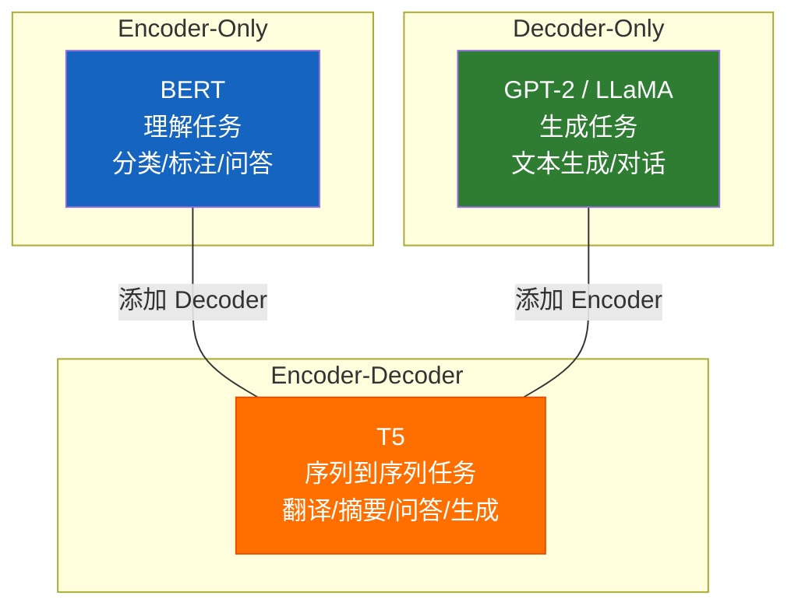
```mermaid
graph TB
    subgraph "Encoder-Only<br/>双向注意力"
        BERT["BERT<br/>理解任务<br/>分类/标注/问答"]
    end

    subgraph "Decoder-Only<br/>因果注意力"
        GPT["GPT-2 / LLaMA<br/>生成任务<br/>文本生成/对话"]
    end

    subgraph "Encoder-Decoder<br/>双向编码 + 因果解码"
        T5["T5<br/>序列到序列任务<br/>翻译/摘要/问答/生成"]
    end

    BERT ---|"添加 Decoder"| T5
    GPT ---|"添加 Encoder"| T5

    style T5 fill:#ff6f00,color:#fff,stroke:#e65100
    style BERT fill:#1565c0,color:#fff
    style GPT fill:#2e7d32,color:#fff
```

### 1.2 T5 的核心创新——Text-to-Text 统一范式

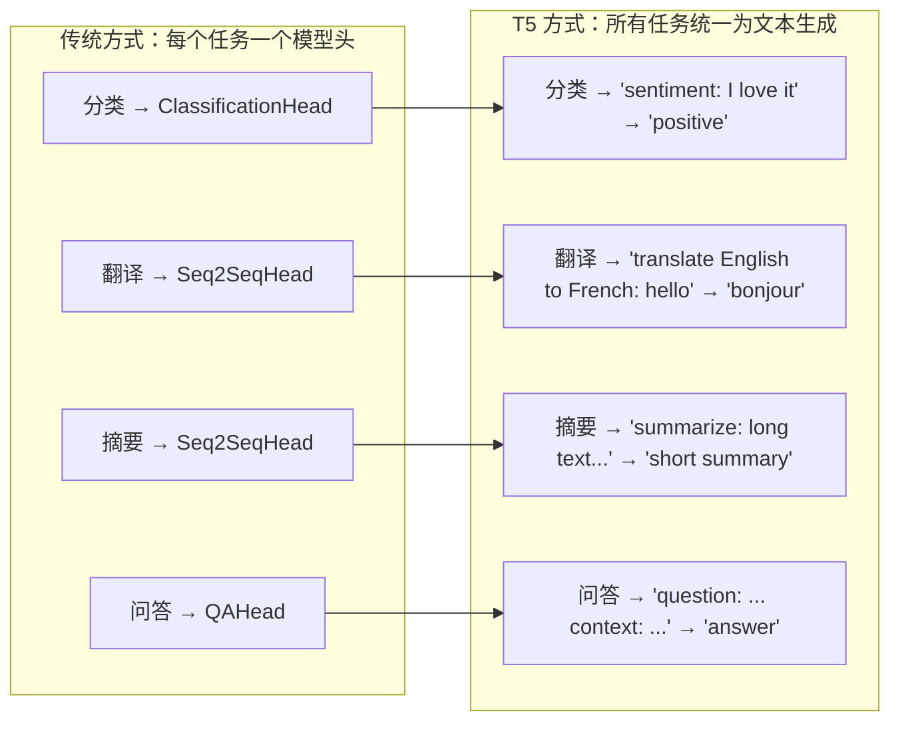
```mermaid
graph LR
    subgraph "传统方式：每个任务一个模型头"
        T1["分类 → ClassificationHead"]
        T2["翻译 → Seq2SeqHead"]
        T3["摘要 → Seq2SeqHead"]
        T4["问答 → QAHead"]
    end

    subgraph "T5 方式：所有任务统一为文本生成"
        T5["分类 → 'sentiment: I love it' → 'positive'"]
        T6["翻译 → 'translate English to French: hello' → 'bonjour'"]
        T7["摘要 → 'summarize: long text...' → 'short summary'"]
        T8["问答 → 'question: ... context: ...' → 'answer'"]
    end

    T1 --> T5
    T2 --> T6
    T3 --> T7
    T4 --> T8
```

**核心思想**：所有 NLP 任务都统一为"输入文本 → 输出文本"的形式，只需一个语言模型 + 一个 LM Head。

### 1.3 T5 家族

| 模型 | 参数量 | 特点 |
|------|--------|------|
| T5-Small | 60M | 基础版本 |
| T5-Base | 220M | 标准版本 |
| T5-Large | 770M | 大版本 |
| T5-3B / T5-11B | 3B / 11B | 超大版本 |
| mT5 | — | 多语言版本 |
| Flan-T5 | — | 指令微调版本 |
| T5v1.1 | — | 改进版（gated-gelu、不缩放输出） |
| UL2 | — | 统一预训练范式 |

---

## 二、Config 定义全流程

### 2.1 T5Config 类图

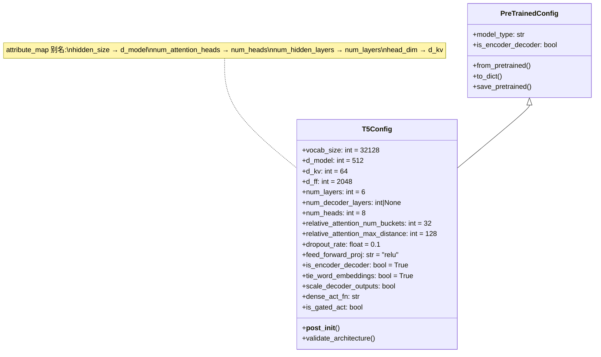
```mermaid
classDiagram
    class PreTrainedConfig {
        +model_type: str
        +is_encoder_decoder: bool
        +from_pretrained()
        +to_dict()
        +save_pretrained()
    }

    class T5Config {
        +vocab_size: int = 32128
        +d_model: int = 512
        +d_kv: int = 64
        +d_ff: int = 2048
        +num_layers: int = 6
        +num_decoder_layers: int|None
        +num_heads: int = 8
        +relative_attention_num_buckets: int = 32
        +relative_attention_max_distance: int = 128
        +dropout_rate: float = 0.1
        +feed_forward_proj: str = "relu"
        +is_encoder_decoder: bool = True
        +tie_word_embeddings: bool = True
        +scale_decoder_outputs: bool
        +dense_act_fn: str
        +is_gated_act: bool
        +__post_init__()
        +validate_architecture()
    }

    PreTrainedConfig <|-- T5Config

    note for T5Config "attribute_map 别名:\nhidden_size → d_model\nnum_attention_heads → num_heads\nnum_hidden_layers → num_layers\nhead_dim → d_kv"
```

### 2.2 Config 特殊设计

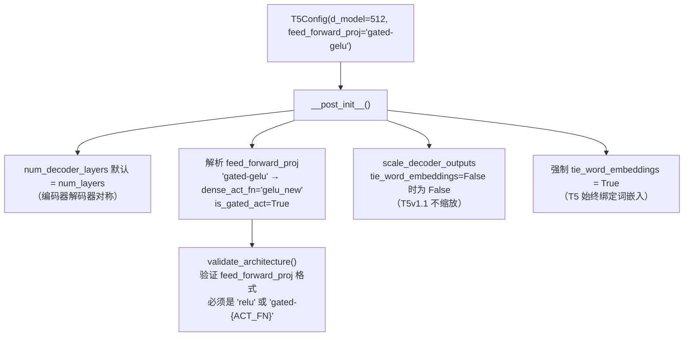
```mermaid
flowchart TB
    A["T5Config(d_model=512, feed_forward_proj='gated-gelu')"] --> B["__post_init__()"]
    B --> C["num_decoder_layers 默认 = num_layers<br/>（编码器解码器对称）"]
    B --> D["解析 feed_forward_proj<br/>'gated-gelu' → dense_act_fn='gelu_new'<br/>is_gated_act=True"]
    B --> E["scale_decoder_outputs<br/>tie_word_embeddings=False 时为 False<br/>（T5v1.1 不缩放）"]
    B --> F["强制 tie_word_embeddings = True<br/>（T5 始终绑定词嵌入）"]

    D --> G["validate_architecture()<br/>验证 feed_forward_proj 格式<br/>必须是 'relu' 或 'gated-{ACT_FN}'"]
```

**关键设计**：
- `attribute_map` 提供别名：`hidden_size` → `d_model`，`num_hidden_layers` → `num_layers`
- `feed_forward_proj` 字符串编码了 FFN 类型：`"relu"` → `T5DenseActDense`，`"gated-gelu"` → `T5DenseGatedActDense`
- `num_decoder_layers` 默认等于 `num_layers`，但可以不同（如编码器 12 层解码器 6 层）
- `is_encoder_decoder = True` 是 T5 的核心标志，影响 AutoModel 分发和掩码生成

### 2.3 Config 序列化流程

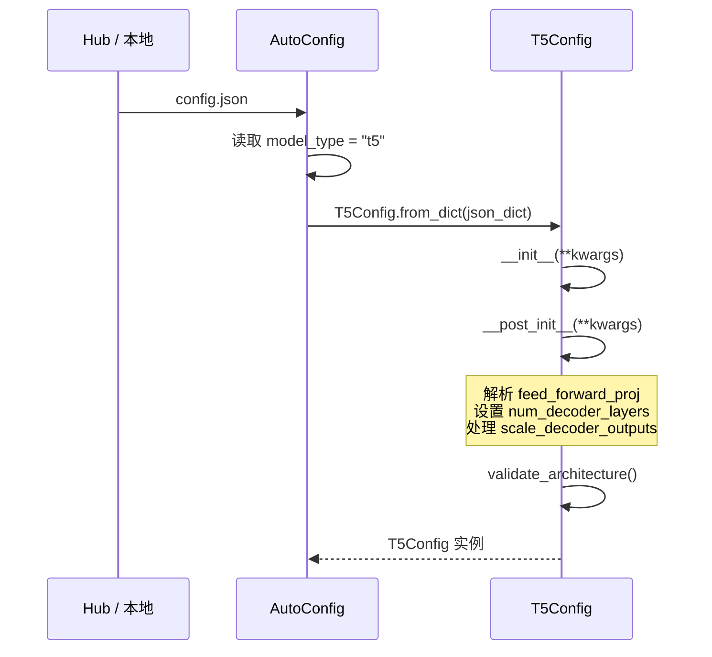
```mermaid
sequenceDiagram
    participant Hub as Hub / 本地
    participant Auto as AutoConfig
    participant T5 as T5Config

    Hub->>Auto: config.json
    Auto->>Auto: 读取 model_type = "t5"
    Auto->>T5: T5Config.from_dict(json_dict)
    T5->>T5: __init__(**kwargs)
    T5->>T5: __post_init__(**kwargs)
    Note over T5: 解析 feed_forward_proj<br/>设置 num_decoder_layers<br/>处理 scale_decoder_outputs
    T5->>T5: validate_architecture()
    T5-->>Auto: T5Config 实例
```

---

## 三、from_pretrained 完整时序

### 3.1 加载时序图

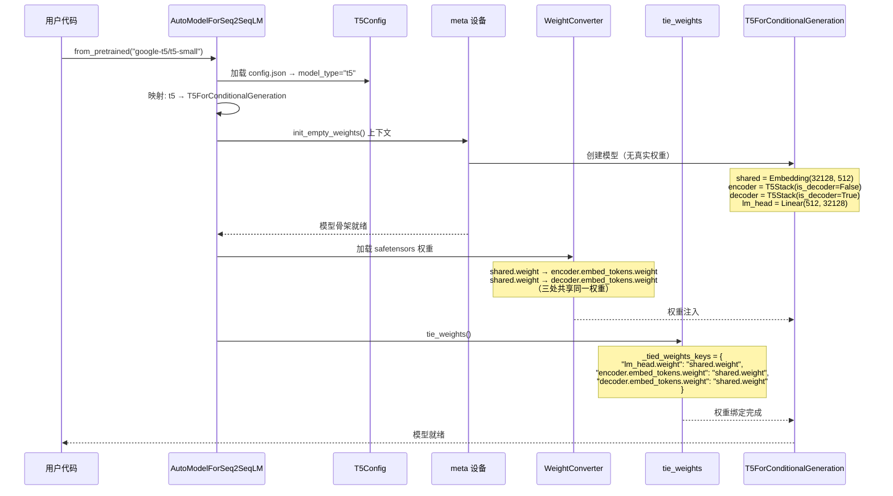
```mermaid
sequenceDiagram
    participant User as 用户代码
    participant Auto as AutoModelForSeq2SeqLM
    participant Config as T5Config
    participant Meta as meta 设备
    participant WC as WeightConverter
    participant Tie as tie_weights
    participant Model as T5ForConditionalGeneration

    User->>Auto: from_pretrained("google-t5/t5-small")
    Auto->>Config: 加载 config.json → model_type="t5"
    Auto->>Auto: 映射: t5 → T5ForConditionalGeneration
    Auto->>Meta: init_empty_weights() 上下文
    Meta->>Model: 创建模型（无真实权重）
    Note over Model: shared = Embedding(32128, 512)<br/>encoder = T5Stack(is_decoder=False)<br/>decoder = T5Stack(is_decoder=True)<br/>lm_head = Linear(512, 32128)
    Meta-->>Auto: 模型骨架就绪
    Auto->>WC: 加载 safetensors 权重
    Note over WC: shared.weight → encoder.embed_tokens.weight<br/>shared.weight → decoder.embed_tokens.weight<br/>（三处共享同一权重）
    WC-->>Model: 权重注入
    Auto->>Tie: tie_weights()
    Note over Tie: _tied_weights_keys = {<br/>  "lm_head.weight": "shared.weight",<br/>  "encoder.embed_tokens.weight": "shared.weight",<br/>  "decoder.embed_tokens.weight": "shared.weight"<br/>}
    Tie-->>Model: 权重绑定完成
    Model-->>User: 模型就绪
```

### 3.2 权重绑定的特殊性

T5 的权重绑定是所有模型中最复杂的——**三处共享同一个 Embedding 权重**：

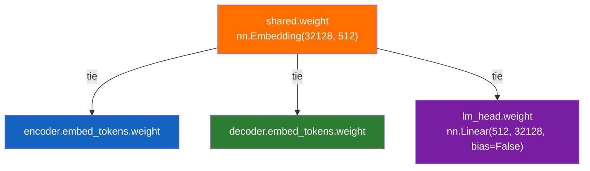
```mermaid
graph TB
    Shared["shared.weight<br/>nn.Embedding(32128, 512)"]

    Enc["encoder.embed_tokens.weight"]
    Dec["decoder.embed_tokens.weight"]
    LM["lm_head.weight<br/>nn.Linear(512, 32128, bias=False)"]

    Shared -->|"tie"| Enc
    Shared -->|"tie"| Dec
    Shared -->|"tie"| LM

    style Shared fill:#ff6f00,color:#fff
    style Enc fill:#1565c0,color:#fff
    style Dec fill:#2e7d32,color:#fff
    style LM fill:#7b1fa2,color:#fff
```

**`_tied_weights_keys`** 声明了绑定关系：
```python
_tied_weights_keys = {
    "lm_head.weight": "shared.weight",
    "encoder.embed_tokens.weight": "shared.weight",
    "decoder.embed_tokens.weight": "shared.weight",
}
```

**`scale_decoder_outputs`**：原始 T5 在 lm_head 前对 decoder 输出乘以 `d_model**-0.5`，T5v1.1 不缩放（因为 `tie_word_embeddings=False` 的配置暗示不缩放）。

---

## 四、Tokenizer 编码流程

### 4.1 T5Tokenizer 架构

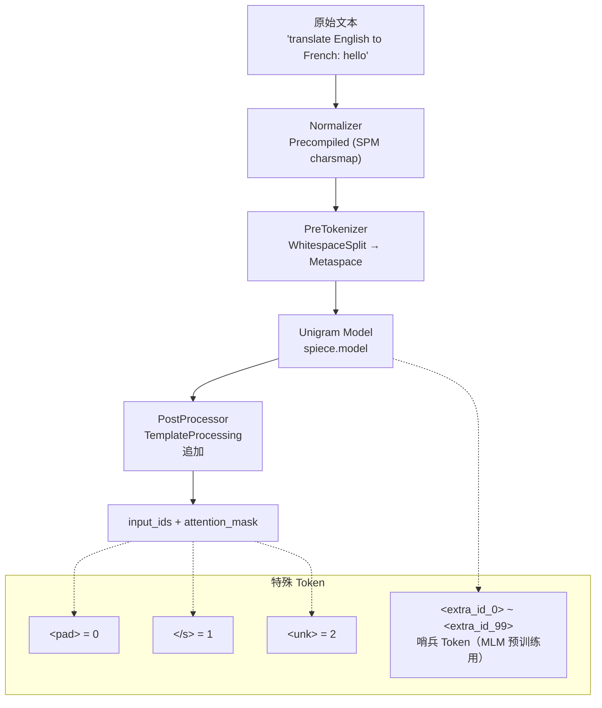
```mermaid
flowchart TB
    Input["原始文本<br/>'translate English to French: hello'"] --> Norm["Normalizer<br/>Precompiled (SPM charsmap)"]
    Norm --> PreTok["PreTokenizer<br/>WhitespaceSplit → Metaspace"]
    PreTok --> Model["Unigram Model<br/>spiece.model"]
    Model --> Post["PostProcessor<br/>TemplateProcessing<br/>追加 </s>"]
    Post --> Output["input_ids + attention_mask"]

    subgraph "特殊 Token"
        PAD["&lt;pad&gt; = 0"]
        EOS["&lt;/s&gt; = 1"]
        UNK["&lt;unk&gt; = 2"]
        Extra["&lt;extra_id_0&gt; ~ &lt;extra_id_99&gt;<br/>哨兵 Token（MLM 预训练用）"]
    end

    Output -.-> PAD
    Output -.-> EOS
    Output -.-> UNK
    Model -.-> Extra
```

### 4.2 哨兵 Token（Sentinel Tokens）

T5 预训练使用 Span Corruption 目标，需要哨兵 Token 标记被遮蔽的 span：

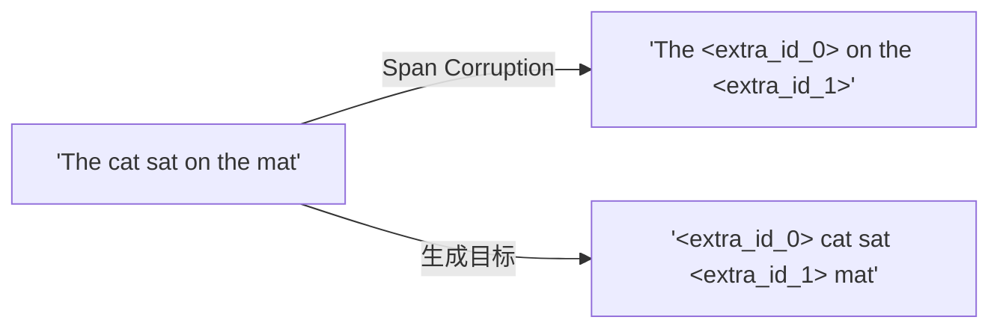
```mermaid
graph LR
    Original["'The cat sat on the mat'"]
    Masked["'The &lt;extra_id_0&gt; on the &lt;extra_id_1&gt;'"]
    Target["'&lt;extra_id_0&gt; cat sat &lt;extra_id_1&gt; mat'"]

    Original -->|"Span Corruption"| Masked
    Original -->|"生成目标"| Target
```

- `<extra_id_0>` ~ `<extra_id_99>`：共 100 个哨兵 Token
- 输入中的哨兵 Token 标记被遮蔽的位置
- 目标中的哨兵 Token 标记恢复内容的开始
- `get_sentinel_tokens()` 和 `get_sentinel_token_ids()` 可获取这些 Token

### 4.3 与 BERT/GPT-2 分词器的对比

| 特性 | BERT | GPT-2 | T5 |
|------|------|-------|-----|
| 分词算法 | WordPiece | BPE | Unigram |
| 词表大小 | 30,522 | 50,257 | 32,128 |
| 预分词 | Whitespace + WordPiece | ByteLevel + BPE | WhitespaceSplit + Metaspace |
| 特殊 Token | [CLS] [SEP] [MASK] | 无 | \<pad\> \</s\> \<extra_id_*\> |
| 后处理 | [CLS] + A + [SEP] + B + [SEP] | 无 | 追加 \</s\> |
| 空格处理 | 保留 | ByteLevel 编码 | Metaspace（▁ 替换空格） |

---

## 五、模型前向传播全链路

### 5.1 T5ForConditionalGeneration 整体架构

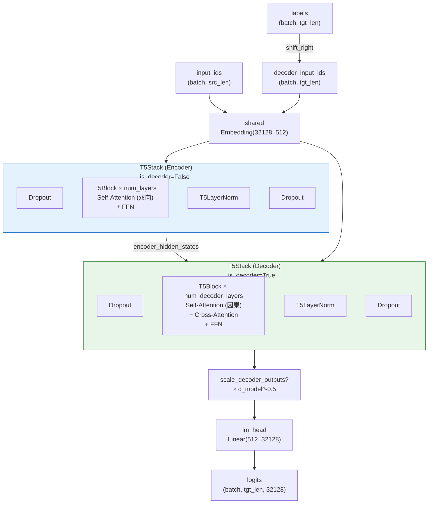
```mermaid
flowchart TB
    InputIDs["input_ids<br/>(batch, src_len)"]
    Labels["labels<br/>(batch, tgt_len)"]

    InputIDs --> Shared["shared<br/>Embedding(32128, 512)"]

    subgraph Encoder["T5Stack (Encoder)<br/>is_decoder=False"]
        direction TB
        EDrop["Dropout"]
        EBlock["T5Block × num_layers<br/>Self-Attention (双向)<br/>+ FFN"]
        ENorm["T5LayerNorm"]
        EDrop2["Dropout"]
    end

    Labels -->|"shift_right"| DecInput["decoder_input_ids<br/>(batch, tgt_len)"]
    DecInput --> Shared

    subgraph Decoder["T5Stack (Decoder)<br/>is_decoder=True"]
        direction TB
        DDrop["Dropout"]
        DBlock["T5Block × num_decoder_layers<br/>Self-Attention (因果)<br/>+ Cross-Attention<br/>+ FFN"]
        DNorm["T5LayerNorm"]
        DDrop2["Dropout"]
    end

    Shared --> Encoder
    Encoder -->|"encoder_hidden_states"| Decoder
    Shared --> Decoder

    Decoder --> Scale["scale_decoder_outputs?<br/>× d_model^-0.5"]
    Scale --> LMHead["lm_head<br/>Linear(512, 32128)"]
    LMHead --> Logits["logits<br/>(batch, tgt_len, 32128)"]

    style Encoder fill:#e3f2fd,stroke:#1565c0
    style Decoder fill:#e8f5e9,stroke:#2e7d32
```

### 5.2 T5Block 内部结构——编码器 vs 解码器

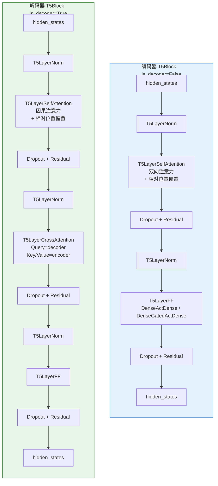
```mermaid
graph TB
    subgraph EncoderBlock["编码器 T5Block<br/>is_decoder=False"]
        direction TB
        EH["hidden_states"] --> ELN1["T5LayerNorm"]
        ELN1 --> ESA["T5LayerSelfAttention<br/>双向注意力<br/>+ 相对位置偏置"]
        ESA --> EDrop1["Dropout + Residual"]
        EDrop1 --> ELN2["T5LayerNorm"]
        ELN2 --> EFF["T5LayerFF<br/>DenseActDense / DenseGatedActDense"]
        EFF --> EDrop2["Dropout + Residual"]
        EDrop2 --> EOut["hidden_states"]
    end

    subgraph DecoderBlock["解码器 T5Block<br/>is_decoder=True"]
        direction TB
        DH["hidden_states"] --> DLN1["T5LayerNorm"]
        DLN1 --> DSA["T5LayerSelfAttention<br/>因果注意力<br/>+ 相对位置偏置"]
        DSA --> DDrop1["Dropout + Residual"]
        DDrop1 --> DLN2["T5LayerNorm"]
        DLN2 --> DCA["T5LayerCrossAttention<br/>Query=decoder<br/>Key/Value=encoder"]
        DCA --> DDrop2["Dropout + Residual"]
        DDrop2 --> DLN3["T5LayerNorm"]
        DLN3 --> DFF["T5LayerFF"]
        DFF --> DDrop3["Dropout + Residual"]
        DDrop3 --> DOut["hidden_states"]
    end

    style EncoderBlock fill:#e3f2fd,stroke:#1565c0
    style DecoderBlock fill:#e8f5e9,stroke:#2e7d32
```

**关键差异**：
- 编码器只有 Self-Attention + FFN（2 个子层）
- 解码器有 Self-Attention + Cross-Attention + FFN（3 个子层）
- 编码器使用双向注意力掩码（`create_bidirectional_mask`）
- 解码器使用因果注意力掩码（`create_causal_mask`）

### 5.3 Pre-Norm 架构

T5 使用 Pre-Norm（先归一化再计算），与 GPT-2 的 Post-Norm 不同：

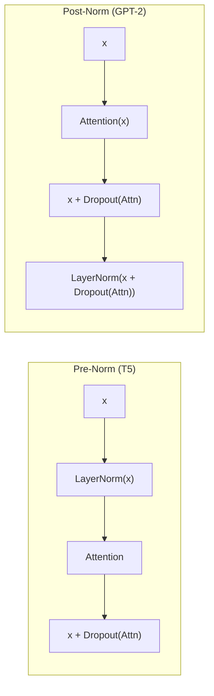
```mermaid
graph LR
    subgraph "Pre-Norm (T5)"
        direction TB
        PN_In["x"] --> PN_Norm["LayerNorm(x)"]
        PN_Norm --> PN_Attn["Attention"]
        PN_Attn --> PN_Add["x + Dropout(Attn)"]
    end

    subgraph "Post-Norm (GPT-2)"
        direction TB
        NN_In["x"] --> NN_Attn["Attention(x)"]
        NN_Attn --> NN_Add["x + Dropout(Attn)"]
        NN_Add --> NN_Norm["LayerNorm(x + Dropout(Attn))"]
    end
```

### 5.4 T5LayerNorm——RMSNorm 的先驱

T5 使用的是 RMSNorm（Root Mean Square Layer Normalization），而非标准 LayerNorm：

```python
class T5LayerNorm(nn.Module):
    def __init__(self, hidden_size, eps=1e-6):
        super().__init__()
        self.weight = nn.Parameter(torch.ones(hidden_size))  # 只有缩放，没有偏置
        self.variance_epsilon = eps

    def forward(self, hidden_states):
        variance = hidden_states.to(torch.float32).pow(2).mean(-1, keepdim=True)
        hidden_states = hidden_states * torch.rsqrt(variance + self.variance_epsilon)
        return self.weight * hidden_states
```

**与 LayerNorm 的区别**：不减均值、无偏置参数。这个设计后来被 LLaMA 的 `LlamaRMSNorm` 继承。

---

## 六、注意力系统运作——相对位置编码

### 6.1 T5 的相对位置偏置

T5 不使用绝对位置编码（如正弦编码）或 RoPE，而是使用**相对位置桶偏置**：

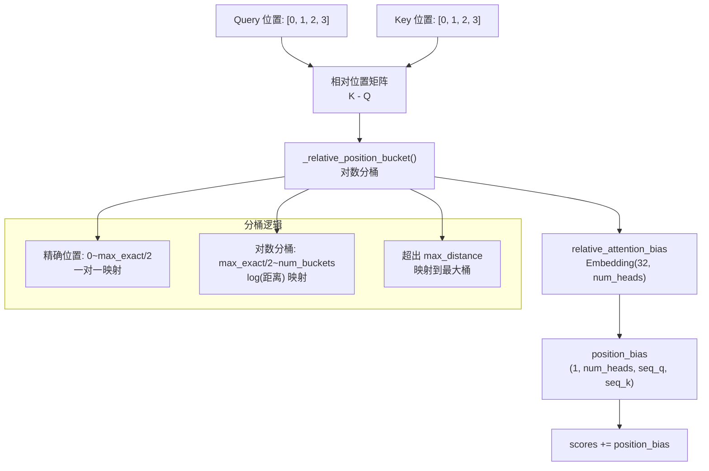
```mermaid
flowchart TB
    Q["Query 位置: [0, 1, 2, 3]"]
    K["Key 位置: [0, 1, 2, 3]"]

    Q --> RP["相对位置矩阵<br/>K - Q"]
    K --> RP

    RP --> Bucket["_relative_position_bucket()<br/>对数分桶"]
    Bucket --> Emb["relative_attention_bias<br/>Embedding(32, num_heads)"]
    Emb --> Bias["position_bias<br/>(1, num_heads, seq_q, seq_k)"]

    Bias --> Scores["scores += position_bias"]

    subgraph "分桶逻辑"
        direction TB
        B1["精确位置: 0~max_exact/2<br/>一对一映射"]
        B2["对数分桶: max_exact/2~num_buckets<br/>log(距离) 映射"]
        B3["超出 max_distance<br/>映射到最大桶"]
    end

    Bucket --> B1
    Bucket --> B2
    Bucket --> B3
```

### 6.2 分桶算法详解

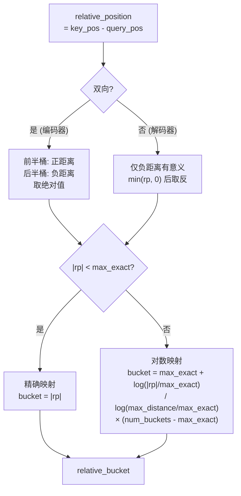
```mermaid
flowchart TB
    RP["relative_position<br/>= key_pos - query_pos"] --> Dir{"双向?"}

    Dir -->|"是 (编码器)"| Bi["前半桶: 正距离<br/>后半桶: 负距离<br/>取绝对值"]
    Dir -->|"否 (解码器)"| Uni["仅负距离有意义<br/>min(rp, 0) 后取反"]

    Bi --> Small{"|rp| < max_exact?"}
    Uni --> Small

    Small -->|"是"| Exact["精确映射<br/>bucket = |rp|"]
    Small -->|"否"| Log["对数映射<br/>bucket = max_exact + log(|rp|/max_exact)<br/>/ log(max_distance/max_exact)<br/>× (num_buckets - max_exact)"]

    Exact --> Result["relative_bucket"]
    Log --> Result
```

**关键参数**：
- `relative_attention_num_buckets = 32`：桶数量
- `relative_attention_max_distance = 128`：最大精确距离
- 只有第 0 层计算 position_bias，后续层复用（`position_bias = layer_outputs[1]`）

### 6.3 编码器 vs 解码器的掩码系统

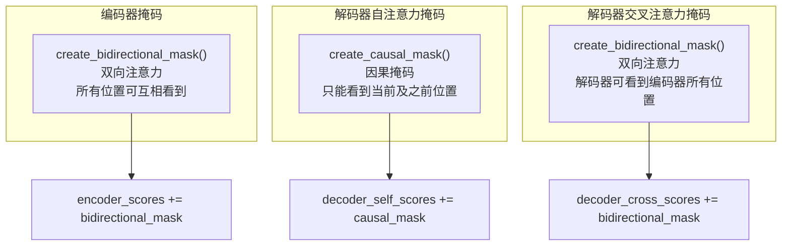
```mermaid
flowchart TB
    subgraph "编码器掩码"
        EMask["create_bidirectional_mask()<br/>双向注意力<br/>所有位置可互相看到"]
    end

    subgraph "解码器自注意力掩码"
        DMask["create_causal_mask()<br/>因果掩码<br/>只能看到当前及之前位置"]
    end

    subgraph "解码器交叉注意力掩码"
        CMask["create_bidirectional_mask()<br/>双向注意力<br/>解码器可看到编码器所有位置"]
    end

    EMask --> Scores1["encoder_scores += bidirectional_mask"]
    DMask --> Scores2["decoder_self_scores += causal_mask"]
    CMask --> Scores3["decoder_cross_scores += bidirectional_mask"]
```

**V5 变化**：T5 使用新的 `masking_utils.py` 中的 `create_bidirectional_mask` 和 `create_causal_mask`，替代了旧的 `modeling_attn_mask_utils.py`。

---

## 七、缓存系统——EncoderDecoderCache

### 7.1 双缓存架构

T5 作为 Encoder-Decoder 模型，使用 `EncoderDecoderCache` 管理两种缓存：

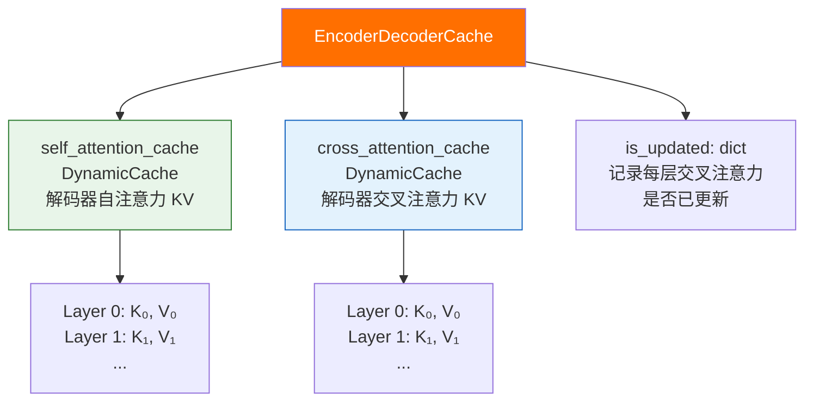
```mermaid
graph TB
    EDC["EncoderDecoderCache"]

    EDC --> SelfCache["self_attention_cache<br/>DynamicCache<br/>解码器自注意力 KV"]
    EDC --> CrossCache["cross_attention_cache<br/>DynamicCache<br/>解码器交叉注意力 KV"]

    SelfCache --> SelfLayers["Layer 0: K₀, V₀<br/>Layer 1: K₁, V₁<br/>..."]
    CrossCache --> CrossLayers["Layer 0: K₀, V₀<br/>Layer 1: K₁, V₁<br/>..."]

    EDC --> IsUpdated["is_updated: dict<br/>记录每层交叉注意力<br/>是否已更新"]

    style EDC fill:#ff6f00,color:#fff
    style SelfCache fill:#e8f5e9,stroke:#2e7d32
    style CrossCache fill:#e3f2fd,stroke:#1565c0
```

### 7.2 生成过程中的缓存更新时序

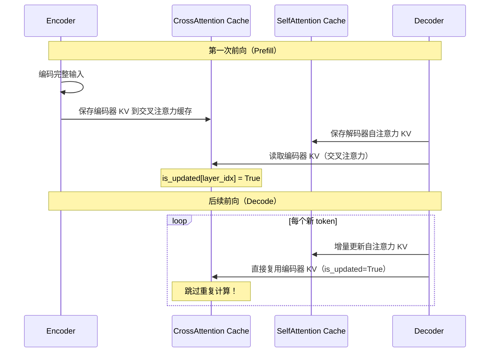
```mermaid
sequenceDiagram
    participant Enc as Encoder
    participant Cross as CrossAttention Cache
    participant Self as SelfAttention Cache
    participant Dec as Decoder

    Note over Enc,Dec: 第一次前向（Prefill）

    Enc->>Enc: 编码完整输入
    Enc->>Cross: 保存编码器 KV 到交叉注意力缓存
    Dec->>Self: 保存解码器自注意力 KV
    Dec->>Cross: 读取编码器 KV（交叉注意力）
    Note over Cross: is_updated[layer_idx] = True

    Note over Enc,Dec: 后续前向（Decode）

    loop 每个新 token
        Dec->>Self: 增量更新自注意力 KV
        Dec->>Cross: 直接复用编码器 KV（is_updated=True）
        Note over Cross: 跳过重复计算！
    end
```

**关键优化**：编码器的 KV 在第一次前向后缓存，后续生成步骤中交叉注意力直接复用，无需重新计算。`is_updated` 字典标记每层是否已更新。

### 7.3 与 Decoder-Only 缓存的对比

| 特性 | Decoder-Only (GPT-2/LLaMA) | Encoder-Decoder (T5) |
|------|---------------------------|----------------------|
| 缓存类型 | `DynamicCache` | `EncoderDecoderCache` |
| 缓存内容 | 自注意力 KV | 自注意力 KV + 交叉注意力 KV |
| 编码器缓存 | 无 | 有（一次性计算，后续复用） |
| 交叉注意力 | 无 | 有（Q=decoder, K/V=encoder） |
| is_updated | 无 | 有（标记交叉注意力是否已更新） |

---

## 八、generate() 生成全流程

### 8.1 T5 的 Seq2Seq 生成时序

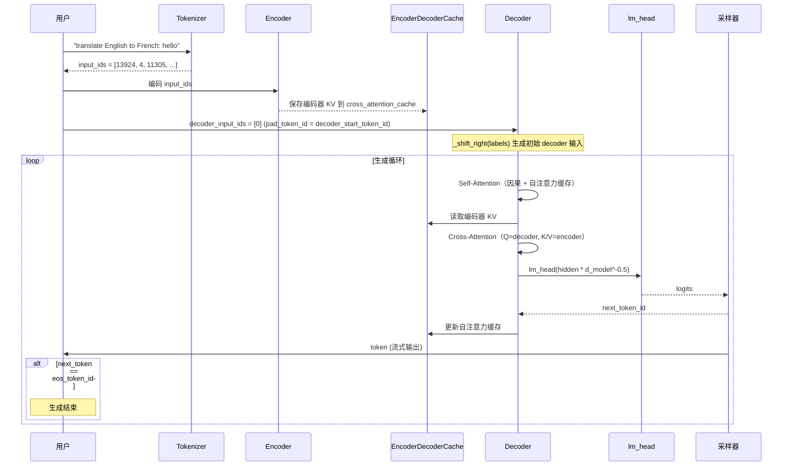
```mermaid
sequenceDiagram
    participant User as 用户
    participant Tok as Tokenizer
    participant Enc as Encoder
    participant Cache as EncoderDecoderCache
    participant Dec as Decoder
    participant LM as lm_head
    participant Sample as 采样器

    User->>Tok: "translate English to French: hello"
    Tok-->>User: input_ids = [13924, 4, 11305, ...]

    User->>Enc: 编码 input_ids
    Enc-->>Cache: 保存编码器 KV 到 cross_attention_cache

    User->>Dec: decoder_input_ids = [0] (pad_token_id = decoder_start_token_id)
    Note over Dec: _shift_right(labels) 生成初始 decoder 输入

    loop 生成循环
        Dec->>Dec: Self-Attention（因果 + 自注意力缓存）
        Dec->>Cache: 读取编码器 KV
        Dec->>Dec: Cross-Attention（Q=decoder, K/V=encoder）
        Dec->>LM: lm_head(hidden * d_model^-0.5)
        LM-->>Sample: logits
        Sample-->>Dec: next_token_id
        Dec->>Cache: 更新自注意力缓存
        Sample->>User: token (流式输出)

        alt next_token == eos_token_id
            Note over User: 生成结束
        end
    end
```

### 8.2 _shift_right——解码器输入的特殊处理

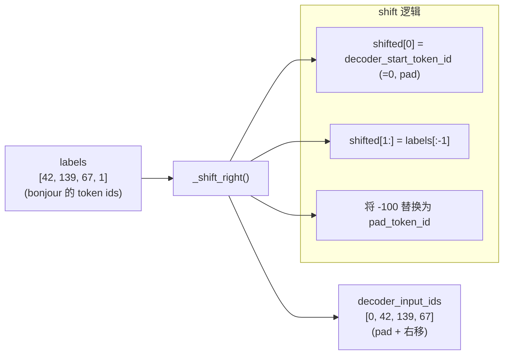
```mermaid
flowchart LR
    Labels["labels<br/>[42, 139, 67, 1]<br/>(bonjour 的 token ids)"] --> Shift["_shift_right()"]
    Shift --> Result["decoder_input_ids<br/>[0, 42, 139, 67]<br/>(pad + 右移)"]

    subgraph "shift 逻辑"
        S1["shifted[0] = decoder_start_token_id (=0, pad)"]
        S2["shifted[1:] = labels[:-1]"]
        S3["将 -100 替换为 pad_token_id"]
    end

    Shift --> S1
    Shift --> S2
    Shift --> S3
```

**设计原理**：训练时 labels 右移一位作为解码器输入，实现 teacher forcing。T5 使用 `pad_token_id`（0）作为 `decoder_start_token_id`。

### 8.3 prepare_inputs_for_generation 的特殊处理

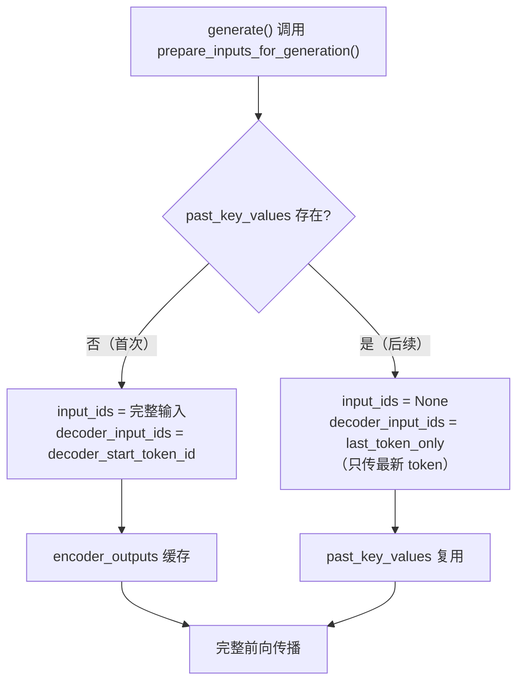
```mermaid
flowchart TB
    Input["generate() 调用 prepare_inputs_for_generation()"] --> Check{"past_key_values 存在?"}

    Check -->|"否（首次）"| First["input_ids = 完整输入<br/>decoder_input_ids = decoder_start_token_id"]
    Check -->|"是（后续）"| Sub["input_ids = None<br/>decoder_input_ids = last_token_only<br/>（只传最新 token）"]

    First --> Enc["encoder_outputs 缓存"]
    Sub --> Cache["past_key_values 复用"]

    Enc --> Forward["完整前向传播"]
    Cache --> Forward
```

---

## 九、训练流程

### 9.1 Span Corruption 预训练

```mermaid
flowchart TB
    Original["'The quick brown fox jumps over the lazy dog'"]

    Original --> Corrupt["Span Corruption<br/>随机遮蔽 15% 的 token span"]

    Corrupt --> Input["输入: 'The &lt;extra_id_0&gt; fox jumps &lt;extra_id_1&gt; the lazy dog'"
    Corrupt --> Target["目标: '&lt;extra_id_0&gt; quick brown &lt;extra_id_1&gt; over'"]

    Input --> Encoder["Encoder 编码"]
    Target -->|"shift_right"| DecoderInput["Decoder 输入"]

    Encoder --> CrossAttn["Cross-Attention"]
    DecoderInput --> Decoder["Decoder 解码"]

    CrossAttn --> Logits["logits"]
    Decoder --> Logits

    Logits --> Loss["CrossEntropyLoss<br/>logits vs labels"]
```

### 9.2 训练循环时序

```mermaid
sequenceDiagram
    participant Trainer as Seq2SeqTrainer
    participant Model as T5ForConditionalGeneration
    participant Encoder as T5Stack(Encoder)
    participant Decoder as T5Stack(Decoder)
    participant Loss as CrossEntropyLoss

    Trainer->>Model: forward(input_ids, labels=labels)
    Model->>Model: decoder_input_ids = _shift_right(labels)
    Model->>Encoder: encoder(input_ids)
    Encoder-->>Model: encoder_outputs
    Model->>Decoder: decoder(decoder_input_ids, encoder_hidden_states)
    Decoder-->>Model: decoder_outputs
    Model->>Model: sequence_output *= d_model**-0.5
    Model->>Model: lm_head(sequence_output)
    Model->>Loss: CrossEntropyLoss(logits, labels)
    Loss-->>Trainer: loss
    Trainer->>Trainer: backward() + step()
```

### 9.3 FFN 的两种变体

```mermaid
graph TB
    subgraph "T5DenseActDense<br/>feed_forward_proj='relu'"
        direction LR
        WI["wi: Linear(d_model→d_ff)"]
        ACT["ReLU"]
        DO1["Dropout"]
        WO["wo: Linear(d_ff→d_model)"]

        WI --> ACT --> DO1 --> WO
    end

    subgraph "T5DenseGatedActDense<br/>feed_forward_proj='gated-gelu'"
        direction LR
        WI0["wi_0: Linear(d_model→d_ff)"]
        ACT2["GELU"]
        WI1["wi_1: Linear(d_model→d_ff)"]
        GATE["门控: act(wi_0) × wi_1"]
        DO2["Dropout"]
        WO2["wo: Linear(d_ff→d_model)"]

        WI0 --> ACT2 --> GATE
        WI1 --> GATE
        GATE --> DO2 --> WO2
    end
```

**T5v1.1 改进**：使用 `gated-gelu` 替代 `relu`，与 LLaMA 的 SwiGLU 设计思路一致——门控 + 激活函数。

---

## 十、Pipeline 推理

### 10.1 pipeline("summarization") 完整流程

```mermaid
sequenceDiagram
    participant User as 用户
    participant Pipe as SummarizationPipeline
    participant Tok as T5Tokenizer
    participant Model as T5ForConditionalGeneration
    participant Dec as Decoder

    User->>Pipe: ("summarize: long text...", max_length=50)
    Pipe->>Tok: preprocess(text)
    Tok-->>Pipe: input_ids + attention_mask

    Pipe->>Model: _forward(input_ids)
    Note over Model: Encoder 编码 → Decoder 自回归生成
    Model->>Dec: generate(decoder_start_token_id=0)
    loop 自回归循环
        Dec->>Dec: Self-Attn + Cross-Attn
        Dec->>Dec: 采样 next_token
    end
    Dec-->>Model: output_ids

    Model-->>Pipe: generated_ids
    Pipe->>Tok: postprocess(generated_ids)
    Tok-->>User: "short summary text"
```

### 10.2 T5 支持的 Pipeline 类型

| Pipeline | 任务 | 前缀示例 |
|----------|------|---------|
| `summarization` | 摘要 | `summarize: ...` |
| `translation_xx_to_yy` | 翻译 | `translate English to French: ...` |
| `text2text-generation` | 通用文本生成 | 任意前缀 |

---

## 十一、T5Stack——编码器和解码器的统一抽象

### 11.1 T5Stack 的统一设计

T5 的编码器和解码器共享 `T5Stack` 类，通过 `config.is_decoder` 控制行为：

```mermaid
flowchart TB
    Config["T5Config"] --> Copy1["encoder_config<br/>is_decoder=False<br/>use_cache=False"]
    Config --> Copy2["decoder_config<br/>is_decoder=True<br/>num_layers=num_decoder_layers"]

    Copy1 --> EncStack["T5Stack(encoder_config)<br/>编码器"]
    Copy2 --> DecStack["T5Stack(decoder_config)<br/>解码器"]

    subgraph "T5Stack 统一逻辑"
        direction TB
        Emb["embed_tokens"]
        Blocks["T5Block × num_layers"]
        Norm["final_layer_norm"]
        Drop["dropout"]

        Emb --> Drop --> Blocks --> Norm --> Drop2["dropout"]
    end

    EncStack -->|"create_bidirectional_mask"| BMask["双向掩码"]
    DecStack -->|"create_causal_mask"| CMask["因果掩码"]
    DecStack -->|"EncoderDecoderCache"| Cache["双缓存"]
```

**设计精妙之处**：
- 编码器和解码器使用同一个 `T5Stack` 类，只是 `is_decoder` 不同
- `T5Block` 根据 `is_decoder` 决定是否添加 `T5LayerCrossAttention`
- 第 0 层的 `has_relative_attention_bias=True`，计算位置偏置；后续层复用
- 编码器不使用缓存（`use_cache=False`），解码器使用 `EncoderDecoderCache`

---

## 十二、状态与生命周期总结

### 12.1 T5 模型完整生命周期

```mermaid
stateDiagram-v2
    [*] --> 定义: @strict dataclass
    定义 --> 注册: model_type = "t5"
    注册 --> 加载: from_pretrained()
    
    state 加载 {
        [*] --> Config解析: config.json
        Config解析 --> AutoModel分发: model_type → T5ForConditionalGeneration
        AutoModel分发 --> Meta创建: init_empty_weights()
        Meta创建 --> 权重加载: safetensors
        权重加载 --> 权重绑定: shared ↔ encoder/decoder/lm_head
        权重绑定 --> [*]
    }

    加载 --> 推理: model.generate()
    加载 --> 训练: trainer.train()

    state 推理 {
        [*] --> Tokenizer编码: 输入文本 → input_ids
        Tokenizer编码 --> Encoder编码: 双向注意力
        Encoder编码 --> Decoder生成: 因果 + 交叉注意力
        Decoder生成 --> Tokenizer解码: output_ids → 文本
        Tokenizer解码 --> [*]
    }

    state 训练 {
        [*] --> SpanCorruption: 遮蔽 span
        SpanCorruption --> ShiftRight: labels → decoder_input_ids
        ShiftRight --> Encoder编码2: 双向注意力
        Encoder编码2 --> Decoder解码: 因果 + 交叉注意力
        Decoder解码 --> Loss计算: CrossEntropyLoss
        Loss计算 --> Backward: 反向传播
        Backward --> [*]
    }

    推理 --> 保存: save_pretrained()
    训练 --> 保存
    保存 --> [*]
```

### 12.2 T5 vs BERT vs GPT-2 全景对比

```mermaid
graph TB
    subgraph "BERT — Encoder-Only"
        B_In["input_ids"] --> B_Emb["Embedding + 位置编码"]
        B_Emb --> B_Enc["Encoder × 12<br/>双向注意力"]
        B_Enc --> B_Head["任务头<br/>MLM / 分类 / QA"]
    end

    subgraph "GPT-2 — Decoder-Only"
        G_In["input_ids"] --> G_Emb["wte + wpe"]
        G_Emb --> G_Dec["Decoder × 12<br/>因果注意力"]
        G_Dec --> G_Head["lm_head"]
    end

    subgraph "T5 — Encoder-Decoder"
        T_In["input_ids"] --> T_Shared["shared Embedding"]
        T_Shared --> T_Enc["Encoder × 12<br/>双向注意力 + 相对位置"]
        T_Enc --> T_Cross["Cross-Attention"]
        T_Shared --> T_Dec["Decoder × 12<br/>因果注意力 + 交叉注意力"]
        T_Dec --> T_Cross
        T_Cross --> T_Head["lm_head (× d_model^-0.5)"]
    end

    style T_Enc fill:#e3f2fd,stroke:#1565c0
    style T_Dec fill:#e8f5e9,stroke:#2e7d32
    style T_Cross fill:#ff6f00,color:#fff
```

| 维度 | BERT | GPT-2 | T5 |
|------|------|-------|-----|
| 架构 | Encoder-Only | Decoder-Only | Encoder-Decoder |
| 注意力 | 双向 | 因果 | 编码器双向 + 解码器因果 + 交叉 |
| 位置编码 | 绝对（正弦/学习） | 绝对（学习） | 相对（桶偏置） |
| 归一化 | LayerNorm (Post) | LayerNorm (Post) | RMSNorm (Pre) |
| FFN | Dense+GELU | Dense+GELU | Dense+ReLU / Gated+GELU |
| 缓存 | 无 | DynamicCache | EncoderDecoderCache |
| 生成 | 不支持 | 自回归 | Seq2Seq 自回归 |
| 权重绑定 | 无 | wte ↔ lm_head | shared ↔ encoder/decoder/lm_head |
| 特殊 Token | [CLS] [SEP] [MASK] | 无 | \<pad\> \</s\> \<extra_id_*\> |
| 典型任务 | 分类/标注/问答 | 文本生成 | 翻译/摘要/生成 |
