# Hugging Face Transformers 源码全景解读

> **项目版本**：v5.8.0.dev0 | **定位**：本系列文档的总纲，先总后分，统领全部 17 篇深度分析

---

## 一、项目是什么

Hugging Face Transformers 是当今深度学习领域最核心的**模型定义框架**。它不是训练框架，不是推理引擎，而是连接一切生态的枢纽——

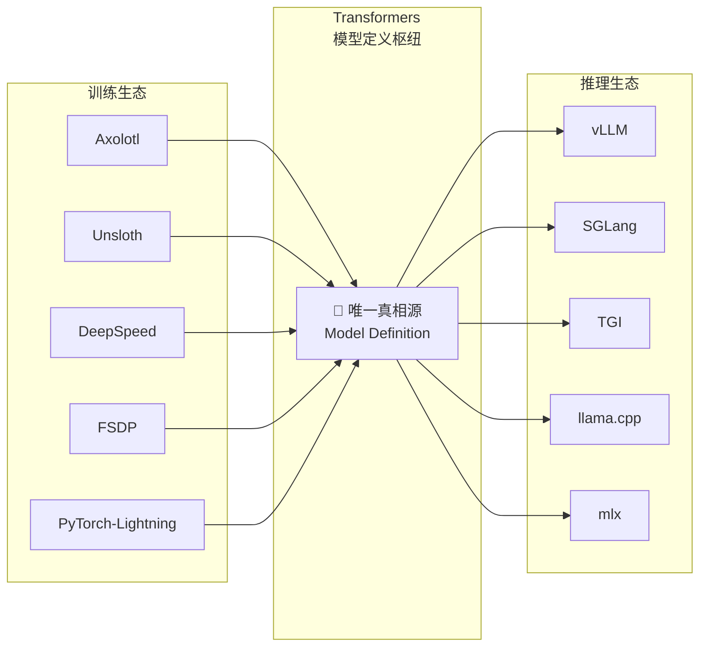

**核心价值**：只要一个模型在 Transformers 中被定义，它就自动兼容上述所有训练框架和推理引擎。Transformers 是生态的"协议层"——定义了模型长什么样、权重怎么存、配置怎么读。

**规模**：200+ 模型实现、1M+ Hub 模型检查点、100K+ GitHub Stars。

---

## 二、五层架构总览

Transformers 的代码组织遵循严格的分层架构，每一层只依赖其下层：

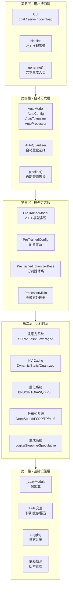

| 层级 | 核心职责 | 关键基类 | 是否依赖 PyTorch |
|------|---------|---------|:---:|
| 第五层 · 用户接口 | 提供用户可直接调用的 API | — | ✅ |
| 第四层 · 自动分发 | 根据 `model_type` 动态选择实现 | `_LazyAutoMapping` | ❌ |
| 第三层 · 模型定义 | 定义模型架构、配置、分词器 | `PreTrainedModel`、`PreTrainedConfig` | ✅ |
| 第二层 · 运行时 | 注意力、缓存、量化、分布式 | `AttentionInterface`、`Cache`、`HfQuantizer` | ✅ |
| 第一层 · 基础设施 | 懒加载、Hub、日志、依赖检测 | `_LazyModule`、`PushToHubMixin` | ❌ |

**设计原则**：`import transformers` 不应加载 PyTorch。第一层和第四层完全不依赖 PyTorch，确保极速导入。

---

## 三、核心设计理念

### 3.1 配置-模型-分词器三位一体

每个模型由三个核心组件构成，它们通过 `model_type` 字符串关联：

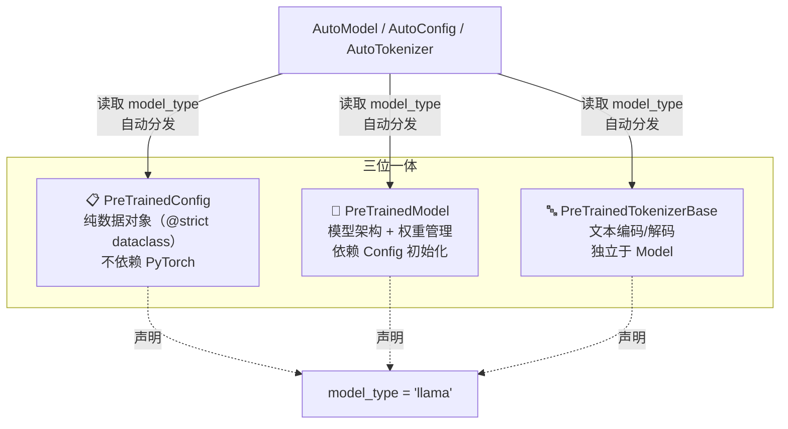

**设计哲学**：
- **Config 是纯数据**：V5 中使用 `@strict` dataclass，自动验证类型和范围，不依赖任何 ML 框架
- **Model 依赖 Config**：模型架构完全由 Config 驱动，`from_pretrained()` 先加载 Config 再构建模型
- **Tokenizer 独立运作**：分词器有自己的词表和序列化格式，但与 Model 共享 `model_type`

### 3.2 注册表驱动的插件架构

Transformers 的核心扩展机制是**注册表模式**——新增功能只需注册，不修改已有代码：

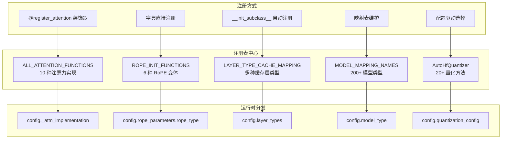

**开放-封闭原则**：对扩展开放（注册新实现），对修改封闭（不改动核心代码）。

### 3.3 懒加载——零成本导入

Transformers 包含 200+ 模型，如果一次性导入所有模块，启动时间会非常长。`_LazyModule` 机制确保：

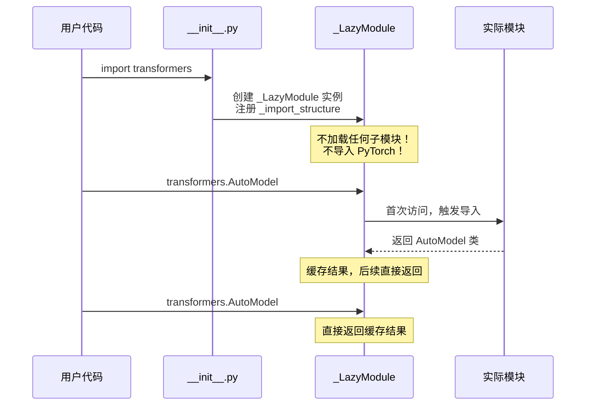

**关键设计**：
- `_import_structure` 字典：模块路径 → 导出名称列表
- `TYPE_CHECKING` 分支：给 IDE 和类型检查器用的真实导入
- `DummyObject`：可选依赖缺失时的友好错误占位

### 3.4 AutoModel 自动分发——工厂模式的极致

AutoModel 系列是 Transformers 最常用的 API，其背后是精巧的懒加载工厂：

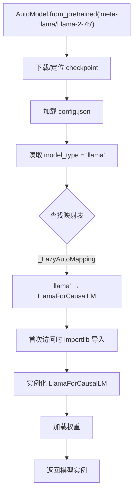

**双层映射**：
1. `model_type → Config 类名`（`_LazyConfigMapping`）
2. `Config 类 → Model 类名`（`_LazyAutoMapping`）

映射表中存储的是**类名字符串**而非类本身，首次访问时才解析为真正的类。

---

## 四、核心数据流

### 4.1 模型加载全流程

`from_pretrained()` 是 Transformers 最重要的方法，它串联了几乎所有子系统：

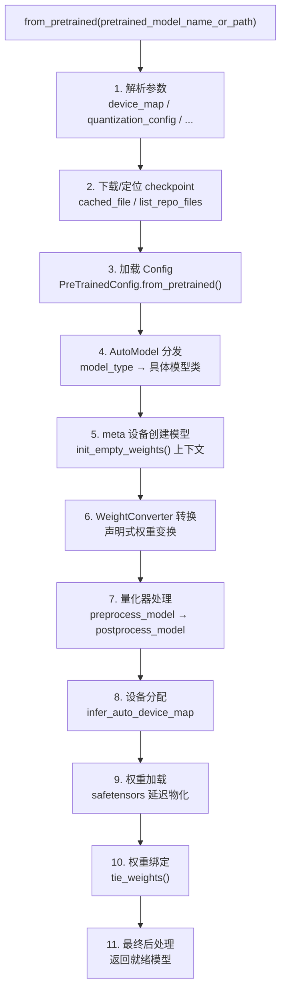

**V5 关键创新**：`WeightConverter` 替代了旧的 `_load_pretrained_model`，用声明式 API 定义权重转换（如 QKV 融合、MoE 重排），支持可逆转换和复杂组合。

### 4.2 文本生成全流程

`generate()` 是推理场景最核心的方法，它通过 `GenerationMixin` 混入所有因果语言模型：

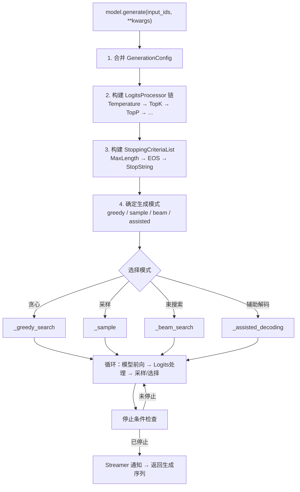

### 4.3 训练全流程

`Trainer.train()` 是训练场景的入口，它集成了分布式、回调、优化等所有子系统：

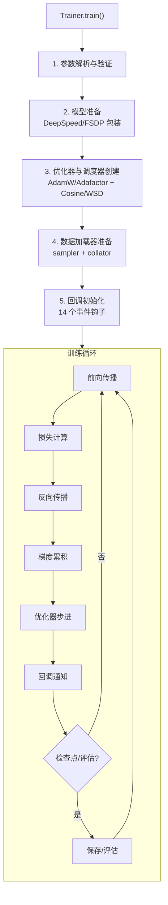

---

## 五、六大子系统纵览

### 六大子系统全景关系图

六大子系统并非孤立运作，而是围绕 `PreTrainedModel` 形成紧密协作的网络。下图展示它们之间的完整交互关系：

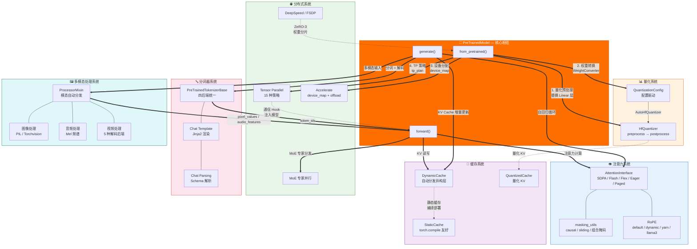

**关系解读**：

| 交互路径 | 含义 |
|---------|------|
| `from_pretrained → 量化` | 加载时量化器替换 Linear 层，量化配置决定替换策略 |
| `from_pretrained → 分布式` | 加载时根据 `device_map` 分配设备，根据 `tp_plan` 注入通信 Hook |
| `量化 → 缓存` | 量化模型使用 `QuantizedCache` 存储量化后的 KV 状态 |
| `forward → 注意力` | 每次前向传播调用注意力函数，由 `config._attn_implementation` 选择实现 |
| `forward → 缓存` | 注意力计算时读写 KV Cache，`DynamicCache` 自动分发异构层 |
| `forward → MoE` | MoE 模型的专家层通过分布式系统分发到不同设备 |
| `generate → 注意力 + 缓存` | 自回归生成循环中反复调用注意力 + 增量更新 KV Cache |
| `generate → 分词器` | 生成前编码输入，生成后解码输出 |
| `generate → 多模态` | 多模态模型生成时需要处理图像/音频/视频输入 |
| `分词器 → forward` | 分词器输出的 `input_ids` 是模型前向传播的输入 |
| `多模态 → forward` | Processor 输出的 `pixel_values` / `audio_features` 是多模态模型的输入 |
| `DeepSpeed → from_pretrained` | ZeRO-3 模式下权重分片加载 |
| `TP → forward` | 张量并行通过 Hook 在前向传播中注入通信操作 |

### 5.1 注意力系统——策略模式的典范

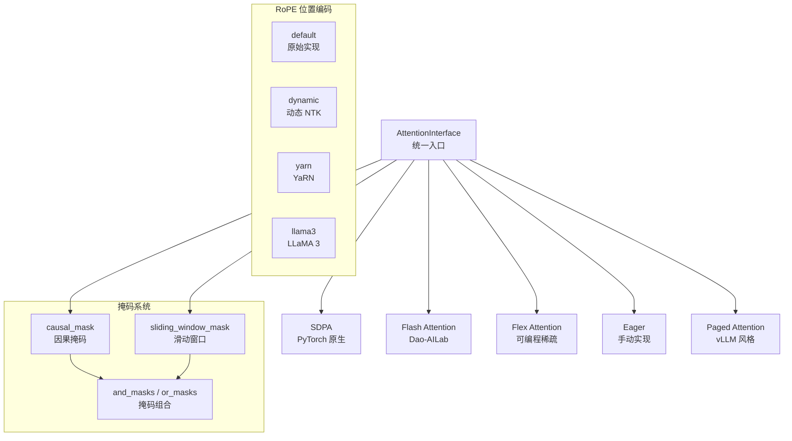

**核心设计**：`ALL_ATTENTION_FUNCTIONS` 注册表 + `config._attn_implementation` 运行时选择。V5 新增 `masking_utils.py`，以掩码函数为一等公民，通过 `and_masks`/`or_masks` 组合构建复杂模式。

### 5.2 缓存系统——两级架构

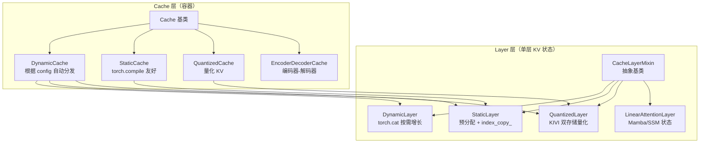

**核心创新**：`LAYER_TYPE_CACHE_MAPPING` 通过 `__init_subclass__` 自动注册，`DynamicCache` 根据 `config.layer_types` 自动分发异构缓存层。

### 5.3 量化系统——配置与执行分离

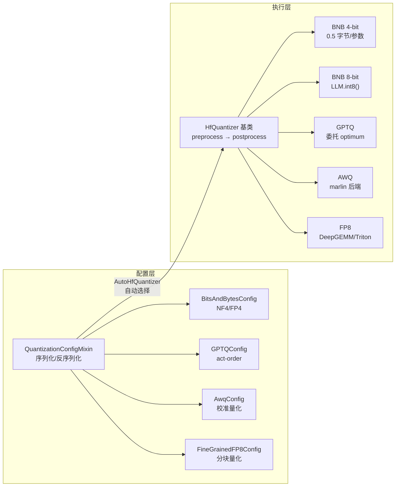

**生命周期**：`preprocess_model`（替换 Linear 层）→ 加载权重 → `postprocess_model`（最终调整）。

### 5.4 分布式系统——集成而非实现

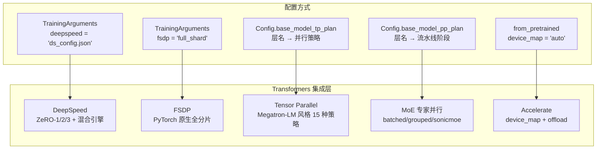

**设计哲学**：Transformers 不自己实现分布式训练，而是集成现有框架。通过 Config 中的 `base_model_tp_plan` 和 `base_model_pp_plan` 声明并行策略，运行时由集成层执行。

### 5.5 分词器系统——四后端统一

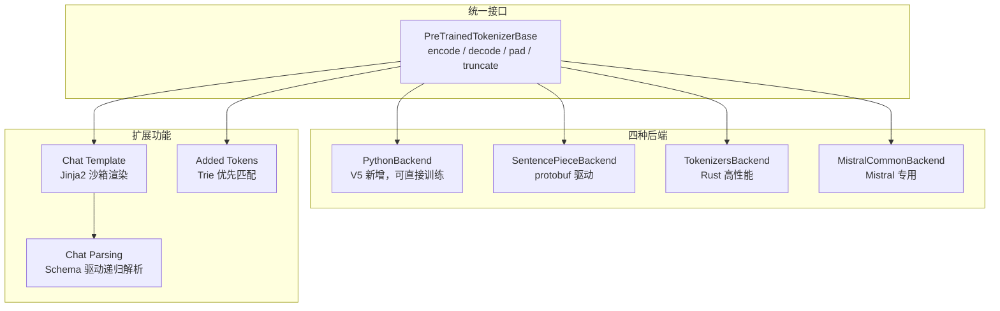

**V5 变革**：从"慢/快"二元架构升级为四后端统一，新增纯 Python 后端可直接初始化和训练空分词器。

### 5.6 多模态处理系统——模态解耦

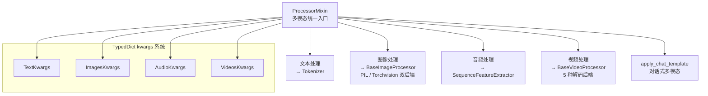

**核心设计**：`ProcessorMixin.__call__` 根据输入类型自动分发到对应处理器，`_merge_kwargs` 实现四级优先级参数合并。

---

## 六、模型实现范式

### 6.1 一个模型的标准目录结构

以 LLaMA 为例，每个模型遵循统一的文件组织：

```
models/llama/
├── __init__.py                    # 懒加载入口
├── configuration_llama.py         # LlamaConfig（@strict dataclass）
├── modeling_llama.py              # 模型实现（7 层组件）
│   ├── LlamaRMSNorm              # 归一化
│   ├── LlamaRotaryEmbedding      # 位置编码
│   ├── LlamaAttention            # 注意力（GQA + 多后端分发）
│   ├── LlamaMLP                  # 前馈网络（SwiGLU）
│   ├── LlamaDecoderLayer         # 解码层（Pre-Norm + GradientCheckpointingLayer）
│   ├── LlamaModel                # 模型主体（因果掩码 + 逐层前向）
│   └── LlamaForCausalLM          # 任务模型（GenerationMixin + lm_head）
├── tokenization_llama.py          # 分词器（BPE + ByteFallback）
├── convert_llama_weights_to_hf.py # 权重转换脚本
└── modular_llama.py               # [可选] Modular 复用
```

### 6.2 Decoder-only 模型的组件层次

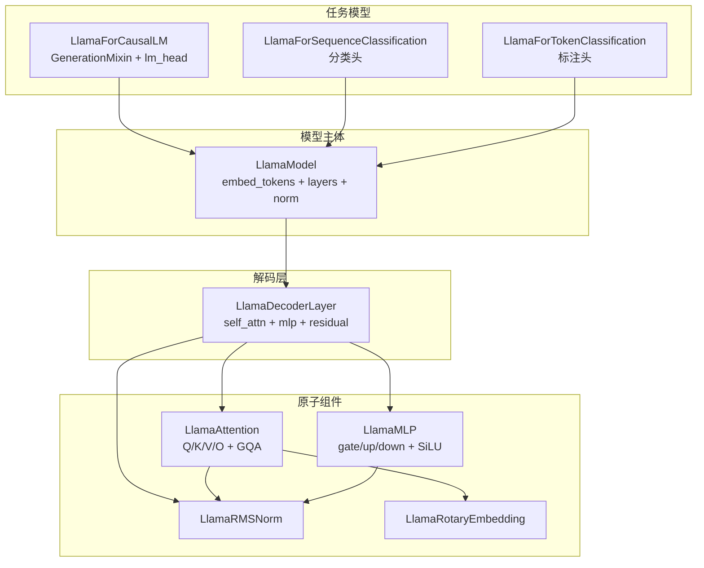

### 6.3 V5 Modular 模式——代码复用的新范式

V5 引入 `modular_*.py`，允许模型通过继承复用已有组件，而非复制粘贴：

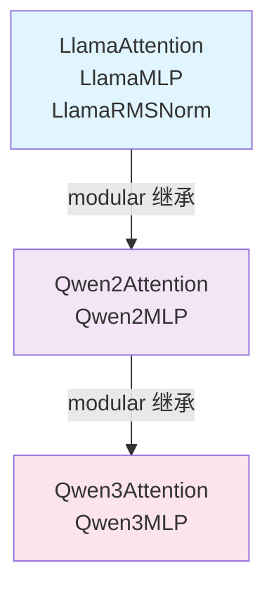

---

## 七、V5 重大架构演进

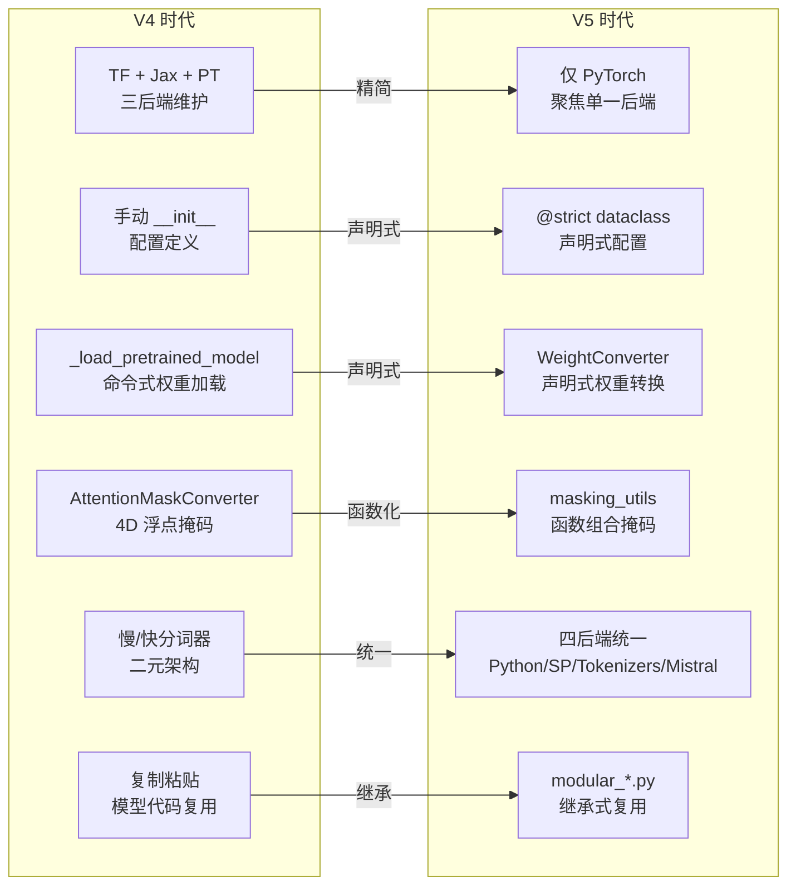

| 维度 | V4 | V5 | 收益 |
|------|----|----|------|
| 后端 | TF + Jax + PT | 仅 PyTorch | 维护成本降低 60%+ |
| Config | 手动 `__init__` | `@strict` dataclass | 自动验证、类型安全 |
| 权重加载 | `_load_pretrained_model` | `WeightConverter` | 可逆、可组合、更快 |
| 掩码 | `AttentionMaskConverter` | `masking_utils` | 函数组合、Flex Attention 兼容 |
| 分词器 | 慢/快二元 | 四后端统一 | 可直接训练、更直观 |
| 模型复用 | 复制粘贴 | `modular_*.py` | 减少代码重复 |
| 并行 | 基础 TP | 完整 TP/PP/MoE | 生产级分布式支持 |

---

## 八、六大设计模式速查

Transformers 的代码中反复使用以下六大设计模式，理解它们是读懂源码的钥匙：

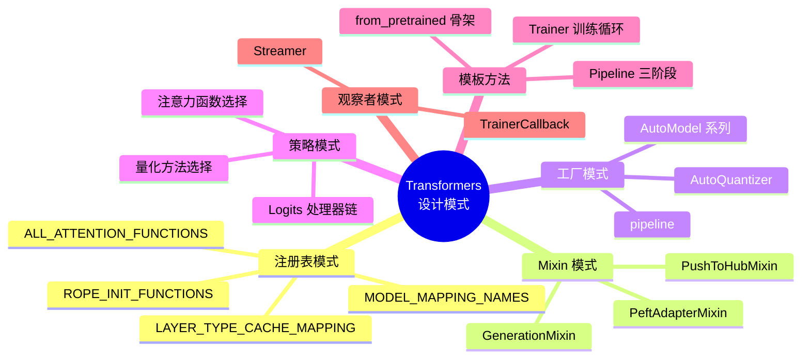

| 模式 | 一句话总结 | 典型应用 |
|------|----------|---------|
| **注册表** | "做什么"和"谁来做"解耦 | 注意力/缓存/RoPE/模型的运行时选择 |
| **Mixin** | 组合优于继承 | 给模型注入 generate/push_to_hub 能力 |
| **工厂** | 根据输入动态创建对象 | AutoModel 根据 model_type 创建模型 |
| **策略** | 算法独立于客户端变化 | 量化/注意力/Logits 处理的可替换实现 |
| **模板方法** | 定义骨架，子类填细节 | from_pretrained 的 14 步流程 |
| **观察者** | 一对多依赖自动通知 | 训练回调、生成流式输出 |

---

## 九、文档导航——先总后分

本系列共 **18 篇**文档，建议按以下顺序阅读：

```mermaid
graph TB
    ROOT["📍 本文档<br/>项目全景解读"]

    ROOT --> P1["🏗️ 01 核心基础设施<br/>懒加载 · 依赖检测 · 日志 · Hub"]
    ROOT --> P2["📋 02 配置系统<br/>PreTrainedConfig · @strict · 序列化"]
    ROOT --> P3["🧠 03 模型系统<br/>PreTrainedModel · from_pretrained · WeightConverter"]

    P3 --> P4["👁️ 04 注意力与掩码<br/>SDPA/Flash/Flex · masking_utils · RoPE"]
    P3 --> P5["💾 05 缓存系统<br/>DynamicCache · StaticCache · 量化缓存"]
    P3 --> P6["🎲 06 生成系统<br/>generate · Logits处理器 · 辅助解码"]

    ROOT --> P7["🔤 07 分词器系统<br/>四后端 · Chat Template · Chat Parsing"]
    ROOT --> P8["🖼️ 08 多模态处理<br/>ProcessorMixin · 图像/音频/视频处理"]

    ROOT --> P9["🏋️ 09 训练系统<br/>Trainer · Callback · DataCollator · 优化器"]
    ROOT --> P10["📊 10 量化系统<br/>HfQuantizer · BNB/GPTQ/AWQ/FP8"]
    ROOT --> P11["🌐 11 分布式与并行<br/>DeepSpeed · FSDP · TP · MoE"]

    ROOT --> P12["🔧 12 Pipeline 推理管道<br/>三阶段模板 · 批量推理"]
    ROOT --> P13["🏭 13 AutoModel 自动分发<br/>_LazyAutoMapping · 远程代码"]

    ROOT --> P14["📐 14 模型实现模式<br/>LLaMA 拆解 · Modular 模式"]
    ROOT --> P15["💻 15 CLI 与工具<br/>chat/serve/download · 脚手架"]
    ROOT --> P16["🧪 16 测试体系<br/>Mixin 测试 · CI 智能选择"]

    ROOT --> P0["🎯 00 设计模式总结<br/>注册表 · Mixin · 工厂 · 策略 · 模板方法 · 观察者"]

    style ROOT fill:#ff6f00,color:#fff
    style P0 fill:#7c4dff,color:#fff
```

### 阅读路径建议

**路径 A：核心理解（4 篇）**
> [01 核心基础设施](01_核心基础设施.md) → [02 配置系统](02_配置系统.md) → [03 模型系统](03_模型系统.md) → [00 设计模式总结](00_设计模式总结.md)

**路径 B：推理全链路（4 篇）**
> [07 分词器系统](07_分词器系统.md) → [04 注意力与掩码](04_注意力与掩码系统.md) → [05 缓存系统](05_缓存系统.md) → [06 生成系统](06_生成系统.md)

**路径 C：训练与部署（4 篇）**
> [09 训练系统](09_训练系统.md) → [10 量化系统](10_量化系统.md) → [11 分布式与并行](11_分布式与并行系统.md) → [12 Pipeline](12_Pipeline推理管道.md)

**路径 D：扩展与维护（5 篇）**
> [13 AutoModel](13_AutoModel自动分发.md) → [14 模型实现模式](14_模型实现模式.md) → [08 多模态处理](08_多模态处理系统.md) → [15 CLI](15_CLI与工具.md) → [16 测试体系](16_测试体系.md)

---

## 十、源码目录速查

```
src/transformers/
├── __init__.py                  ← 懒加载入口（_import_structure）
├── configuration_utils.py       ← PreTrainedConfig 基类
├── modeling_utils.py            ← PreTrainedModel 基类（核心！）
├── modeling_outputs.py          ← 模型输出 dataclass
├── modeling_layers.py           ← 通用层（GradientCheckpointingLayer）
├── masking_utils.py             ← 新版掩码系统
├── modeling_rope_utils.py       ← RoPE 旋转位置编码
├── cache_utils.py               ← KV Cache 体系
├── core_model_loading.py        ← V5 WeightConverter
├── processing_utils.py          ← ProcessorMixin
├── tokenization_utils_base.py   ← 分词器基类
├── trainer.py                   ← Trainer 训练器
├── training_args.py             ← TrainingArguments
├── optimization.py              ← 优化器与调度器
├── initialization.py            ← 权重初始化
│
├── models/                      ← 200+ 模型实现
│   ├── auto/                    ← AutoModel 自动分发
│   ├── llama/                   ← LLaMA（代表性示例）
│   └── ...                      ← 其他模型
│
├── generation/                  ← 生成系统
├── pipelines/                   ← 推理管道
├── integrations/                ← 第三方集成（30+）
├── quantizers/                  ← 量化器（20+）
├── distributed/                 ← 分布式配置
├── data/                        ← 数据整理器
├── loss/                        ← 损失函数
├── cli/                         ← 命令行工具
└── utils/                       ← 工具模块
    ├── import_utils.py          ← 懒加载核心
    ├── hub.py                   ← Hub 交互
    ├── logging.py               ← 日志系统
    └── ...                      ← 其他工具
```

---

## 十一、一句话总结每个子系统

| 子系统 | 一句话 |
|--------|-------|
| **懒加载** | `import transformers` 不加载 PyTorch，首次访问才触发导入 |
| **配置** | `@strict` dataclass 自动验证，差异序列化只保存非默认值 |
| **模型** | `from_pretrained` 14 步流程，meta 设备创建 → WeightConverter 转换 → 量化 → 设备分配 |
| **注意力** | 10 种实现注册在 `ALL_ATTENTION_FUNCTIONS`，运行时由 `config._attn_implementation` 选择 |
| **缓存** | 两级架构：Layer 管单层 KV 状态，Cache 管容器，`DynamicCache` 自动分发异构层 |
| **生成** | `generate()` 9 步模板方法，38 个 Logits 处理器链式调用，支持辅助解码 |
| **分词器** | 四后端统一接口，Chat Template 基于 Jinja2，Chat Parsing 基于 Schema 递归解析 |
| **多模态** | `ProcessorMixin` 根据输入类型自动分发，TypedDict kwargs 四级优先级合并 |
| **训练** | `Trainer` 定义训练循环骨架，14 个回调事件，10 种 DataCollator |
| **量化** | `HfQuantizer` 基类定义生命周期，`AutoHfQuantizer` 根据配置自动选择 |
| **分布式** | 集成而非实现，Config 中声明 `tp_plan`/`pp_plan`，运行时由集成层执行 |
| **Pipeline** | `preprocess → forward → postprocess` 三阶段模板，`pipeline()` 7 步工厂 |
| **AutoModel** | `_LazyAutoMapping` 存类名字符串，首次访问时解析为类 |
| **模型实现** | 7 层组件（Norm → RoPE → Attention → MLP → Layer → Model → ForCausalLM） |
| **CLI** | Chat-Serve 分离架构，FastAPI + Uvicorn 服务端 |
| **测试** | Mixin 继承自动获得数百个通用测试，CI 根据 git diff 智能选择测试 |
